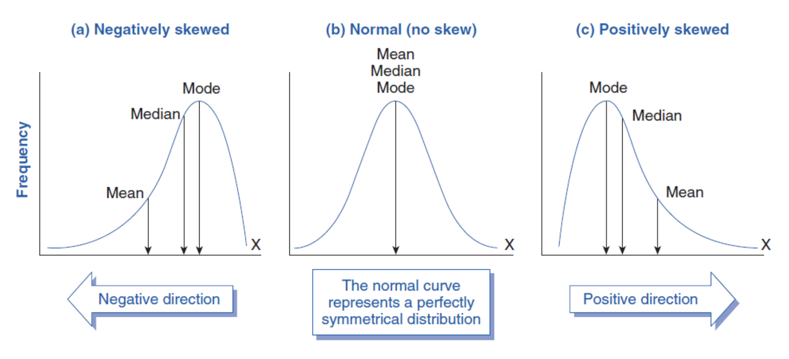
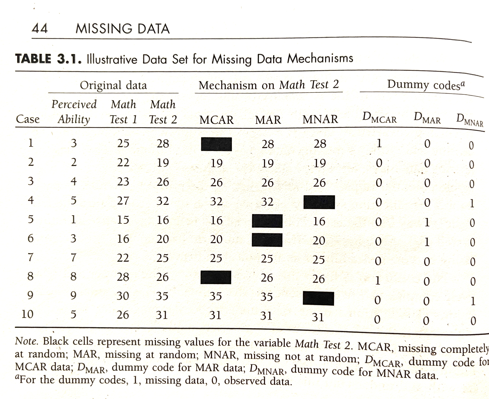
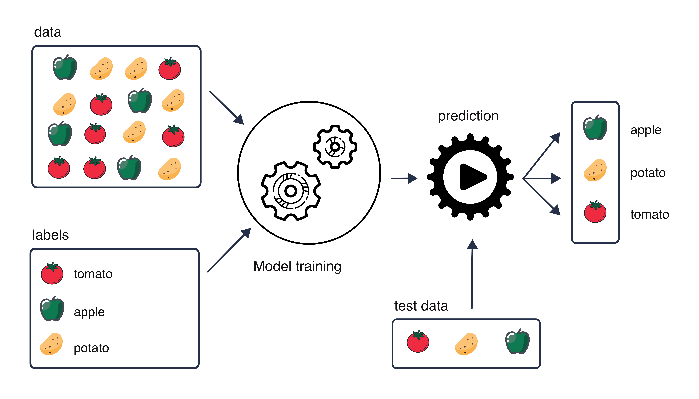

```{r}
#| message: false
#| warning: false

# load libraries
library(tidyverse)
library(kableExtra)
library(ggplot2)
library(rmarkdown)
library(ggbeeswarm)
library(gridExtra)
library(scales)
library(ggthemes)
library(faraway)
library(GGally)
library(glmnet)
library(latex2exp)
library(splitTools)
library(ggeffects)
library(pROC)
library(patchwork)

```

# ML foundations and end-to-end workflow {background-color="var(--light-gold)"}

## Data science lifecycle
*From research question to biological insight*

```{dot}
digraph workflow {

  graph [rankdir=LR]
  node [shape=box, style="rounded,filled", fillcolor="#DCEEFF"]

  define [label="Define problem"]
  collect [label="Collect data"]
  clean [label="Clean & preprocess data"]
  explore [label="Explore data"]

  transform [label="Feature transformation\n& engineering"]

  inference [label="Inferential statistics"]
  supervised [label="Supervised learning \n(prediction)"]
  unsupervised [label="Unsupervised learning \n(structure discovery)"]

  evaluate [label="Evaluate & interpret"]
  communicate [label="Communicate results"]

  define -> collect -> clean -> explore -> transform

  transform -> inference
  transform -> supervised
  transform -> unsupervised

  inference -> evaluate
  supervised -> evaluate
  unsupervised -> evaluate

  evaluate -> communicate
}
```

## Data science lifecycle
*More realistic case*

```{dot}
digraph workflow {

  graph [rankdir=LR]
  node [shape=box, style="rounded,filled", fillcolor="#DCEEFF"]

  define [label="Define problem"]
  collect [label="Collect data"]
  clean [label="Clean & preprocess data"]
  explore [label="Explore data"]

  transform [label="Feature transformation\n& engineering"]

  inference [label="Inferential statistics"]
  supervised [label="Supervised learning \n(prediction)"]
  unsupervised [label="Unsupervised learning \n(structure discovery)"]

  evaluate [label="Evaluate & interpret"]
  communicate [label="Communicate results"]

  define -> collect -> clean -> explore -> transform

  transform -> inference
  transform -> supervised
  transform -> unsupervised

  inference -> evaluate
  supervised -> evaluate
  unsupervised -> evaluate

  evaluate -> communicate

  collect -> define
  clean -> collect
  clean -> define
  explore -> clean
  transform -> clean
  inference -> define
  inference -> collect
  inference -> clean
  inference -> explore
  supervised -> collect
  supervised -> define
  unsupervised -> collect
  unsupervised -> explore
  evaluate -> define
  evaluate -> collect
  evaluate -> explore
  communicate -> define

}
```


## Data science lifecycle
*More realistic case*

<br><br>

Looping back examples:

::: incremental
-   Exploration uncovers data issues
-   Data limitations question original design
-   Revisit exploration after inferential analysis
-   Model performance leads back to EDA
-   Feature engineering prompts new transformations
:::

## Example data
*Diabetes data*

<br>

::::: columns
::: {.column width="50%"}
-   403 participants were interviewed in a study to understand the prevalence of obesity, diabetes, and other cardiovascular risk factors in central Virginia
-   [Diabetes data](https://rdrr.io/cran/faraway/man/diabetes.html) is available as part of `faraway` R package
:::

::: {.column width="50%"}
```{r}
#| echo: false
#| warning: false
#| message: false
#| include: true

# Diabetes data from faraway() package
df <- diabetes

c1 <- colnames(df)
c2 <- c("Subject ID", "Total Cholesterol [mg/dL]", "Stabilize Glucose [mg/dL]", 
        "High Density Lipoprotein [mg/dL]", "Cholesterol / HDL Ratio", "Glycosolated Hemoglobin [%]", 
        "County: Buckingham or Louisa", "age [years]", "gender", 
        "height [in]", "weight [lb]", "frame: small, medium or large", 
        "First Systolic Blood Pressure", "First Diastolic Blood Pressure", 
        "Second Systolic Blood Pressure", "Second Diastolic Blood Pressure", 
        "waist [in]", "hip [in]", 
        "Postprandial Time [min] when labs were drawn")

tbl <- data.frame(Abbreviation = c1, Description = c2)

kbl_font_size <- 14

tbl %>% 
  kbl(align = "c") %>%
  kable_paper("hover", full_width = F) %>%
  kable_styling(font_size = kbl_font_size)

```
:::
:::::

## Example data
*Diabetes data*

<br>

:::::: columns
::: {.column width="45%"}
-  We can calculate BMI as $$BMI = 703 \times \frac{\text{weight [lb]}}{\text{height [in]}^2} $$ 
-  And create a new binary variable `BMI>30` indicating if BMI is over 30 (1) or no (0)
-  First few observations are shown on the right.
:::

::: {.column width="5%"}
:::

::: {.column width="50%"}
```{r}

# add obesity variables
inch2m <- 2.54/100
pound2kg <- 0.45
data_diabetes <- diabetes %>%
  mutate(height  = height * inch2m, height = round(height, 2)) %>% 
  mutate(waist = waist * inch2m) %>%  
  mutate(weight = weight * pound2kg, weight = round(weight, 2)) %>%
  mutate(BMI = weight / height^2, BMI = round(BMI, 2)) %>% 
  mutate(`BMI>30`= cut(BMI, breaks = c(0, 29.9, 100), labels = c(0, 1))) %>% 
  relocate(BMI, .after = id) %>%
  relocate(`BMI>30`, .after = BMI) 
  
# preview data
glimpse(head(data_diabetes))
```
:::
::::::

## Example data

*Diabetes data + 1000 genes*

<br>

In addition, we simulated expression levels for 1,000 genes, with a subset of known obesity-associated genes simulated as up-regulated.

```{r}
#| fig-align: center

# Load clinical data
data_obesity_genes <- read_csv("data/data-obesity.csv") |>
  mutate(`BMI>30` = ifelse(obese == "No", 0, 1)) |>
  mutate(`BMI>30`= factor(`BMI>30`)) |>
  dplyr::select(-obese) |>
  dplyr::relocate(`BMI>30`, .after = "BMI")

# Load gene expression data
data_exprs <- read_csv("data/data-obesity-genes.csv")

# Join data
data <- data_obesity_genes %>%
  left_join(data_exprs, by = "id") #%>% 
  #mutate(obese = factor(obese, levels = c("No", "Yes")))

# show distribution of random 3 genes by obesity
data %>%
  select("BMI>30", 31:33) %>% 
  na.omit() %>%
  pivot_longer(-`BMI>30`, names_to = "gene", values_to = "expression") %>% 
  mutate(gene = factor(gene)) %>% 
  ggplot(aes(x = expression, fill = `BMI>30`)) +
  geom_histogram(position = "identity", alpha = 0.5, bins = 30) + 
  facet_wrap(~gene, scales = "free") +
  theme_minimal() + 
  scale_fill_tableau(name = "BMI>30",  palette = "Classic Blue-Red 6") + 
  theme(legend.position = "top")
  
```

## Data Preparation {.smaller}

```{dot}
//| fig-height: 2.5

digraph workflow {

  graph [rankdir=LR]
  node [shape=box, style="rounded,filled", fillcolor="#DCEEFF"]

  define [label="Define problem"]
  collect [label="Collect data"]
  clean [label="Clean & preprocess data" , fillcolor="#F2C94C"]
  explore [label="Explore data"]

  transform [label="Feature transformation\n& engineering", fillcolor="#F2C94C"]

  inference [label="Inferential statistics"]
  supervised [label="Supervised learning \n(prediction)"]
  unsupervised [label="Unsupervised learning \n(structure discovery)"]

  evaluate [label="Evaluate & interpret"]
  communicate [label="Communicate results"]

  define -> collect -> clean -> explore -> transform

  transform -> inference
  transform -> supervised
  transform -> unsupervised

  inference -> evaluate
  supervised -> evaluate
  unsupervised -> evaluate
  evaluate -> communicate
}
```


<br>

. . .

|   | Step | What it's about | What to think about |
|----------------|----------------|----------------------|--------------------|
| 🧼 | **Data Cleaning** | Fixing errors, missing values, and inconsistencies | Is the data valid, complete, and reliable? |
| ⚙️ | **Data Pre-processing** | Preparing clean data for modeling | Is the data in a model-friendly format? |
| 🔢 | **Variable (feature) Transformations** | Changing variable scale or representation | Is the representation appropriate for the method and its assumptions? |
| 🛠️ | **Feature Engineering** | Creating new informative variables from existing ones | Can we create features that improve signal or interpretability? |

## Data Preparation
*Where does this step belong?*

🧼 Data Cleaning • ⚙️ Pre-processing • 🔢 Variable Transformation • 🛠️ Feature Engineering

<br>

::: incremental
-   Convert height from inches to meters [(🧼 🔢)]{.fragment}\
-   Encode gender as binary (0 = Female, 1 = Male) [(⚙️)]{.fragment}\
-   Create BMI from height and weight [(🛠️ 🔢)]{.fragment}\
-   Log-transform (normalize) gene expression values [(🔢 ⚙️)]{.fragment}\
-   Remove irrelevant genes with no variation across individuals [(⚙️ 🧼)]{.fragment}\
-   Impute missing age values [(🧼 ⚙️)]{.fragment}\
-   Create a BMI × gender interaction variable [(🛠️)]{.fragment}\
-   Write and apply validation rules: flag heights \< 50 or \> 90 inches [(🧼)]{.fragment}\
-   Detect inconsistent category labels: “male” vs “Male” [(🧼)]{.fragment}\
-   Create an average inflammation score from 5 genes [(🛠)]{.fragment}
-   Scale gene expression features to mean = 0, SD = 1 [(⚙️ 🔢)]{.fragment}\
-   Keep one of a highly correlated features, e.g. keep `weight` but drop `waist` [(⚙️)]{.fragment}
:::

## Data Preparation {.smaller}
::: footer
:::

```{r}
#| label: data
#| echo: false
#| warning: false
#| message: false

# load libraries
library(tidyverse)
library(splitTools)
library(kableExtra)

# input data
input_diabetes <- read_csv("data/data-diabetes.csv")

# clean data
inch2cm <- 2.54
pound2kg <- 0.45
data_diabetes <- input_diabetes %>%
  mutate(height  = height * inch2cm / 100, height = round(height, 2)) %>% 
  mutate(waist = waist * inch2cm) %>% 
  mutate(weight = weight * pound2kg, weight = round(weight, 2)) %>%
  mutate(BMI = weight / height^2, BMI = round(BMI, 2)) %>%
  mutate(obese= cut(BMI, breaks = c(0, 29.9, 100), labels = c("No", "Yes"))) %>%
  mutate(diabetic = ifelse(glyhb > 7, "Yes", "No"), diabetic = factor(diabetic, levels = c("No", "Yes"))) %>%
  mutate(location = factor(location)) %>%
  mutate(frame = factor(frame)) %>%
  mutate(gender = factor(gender))
  
```

*scaling & normalization* <br>

-   **Scaling** of numerical features
    -   Changing the range (scale) of the data, e.g. to prevent features with larger scales dominating the model.

. . .

-   **Normalization:** rescaling or transforming data to make values more comparable or suitable for analysis, often by putting them on a common scale or removing technical differences. Often changing observations to remove skewness.

    -   e.g. going from **positive skew**: mode \< median \< mean
    -   or going from **negative skew**: mode \> median \> mean

{width="80%"}

*Source: https://www.biologyforlife.com/skew.html*

## Data Preparation
*common transformations* <br> <br>

**square-root for moderate skew**

-   sqrt(x) for positively skewed data,
-   sqrt(max(x+1) - x) for negatively skewed data

<br>

**log for greater skew**

-   log10(x) for positively skewed data,
-   log10(max(x+1) - x) for negatively skewed data

<br>

**inverse for severe skew**

-   1/x for positively skewed data
-   1/(max(x+1) - x) for negatively skewed data

## Data Preparation
*dummy variables* <br><br>

-   Representing categorical variables with **dummy variables** or **one-hot encoding** to create numerical features.
-   E.g. categorical variable `weight` with **three** possible vales (underweight, healthy, overweight) can be transformed into **two** binary variables: "is_healthy", and "is_overweight", where the value of each variable is 1 if the observation belongs to that category and 0 otherwise. 
- Only $k-1$ binary variables to encode $k$ categories.

<br>

```{r}
#| label: tbl-dummys
#| tbl-cap-location: margin
#| echo: false

# make up some unbalanced obese categories to demonstrate when upsampling etc. may be needed
data_obese_makeup <- data_diabetes %>%
  na.omit() %>%
  mutate(weight = cut(BMI, breaks = c(0, 24, 30, 100), labels = c("Underweight", "Healthy", "Overweight"), include.lowest = TRUE)) %>%
  dplyr::select(id, weight)

data_dummy <- data_obese_makeup %>%
  mutate(is_healthy = ifelse(weight == "Healthy", 1, 0)) %>%
  mutate(is_overweight = ifelse(weight == "Overweight", 1, 0)) %>%
  mutate(id = id - 100) %>%
  slice(c(1, 2, 3, 9, 10))

data_dummy %>%
  kbl(caption = "Example of weight-status variable with three categories (underweight/healthy/overweight) encoded as dummy variables", align = "cccc") %>%
  column_spec(2, border_right="2px solid black") %>%
  kable_styling()

```


## Data Preparation
*one-hot encoding* <br><br>

-   In **one-hot encoding** $k$ binary variables are created.

<br>

```{r}
#| label: tbl-one-hot-encoding
#| tbl-cap-location: margin
#| echo: false

# make up some unbalanced obese categories to demonstrate when upsampling etc. may be needed
data_obese_makeup <- data_diabetes %>%
  na.omit() %>%
  mutate(weight = cut(BMI, breaks = c(0, 24, 30, 100), labels = c("Underweight", "Healthy", "Overweight"), include.lowest = TRUE)) %>%
  dplyr::select(id, weight)

data_one_hot <- data_obese_makeup %>%
  mutate(is_underweight = ifelse(weight == "Underweight", 1, 0)) %>%
  mutate(is_healthy = ifelse(weight == "Healthy", 1, 0)) %>%
  mutate(is_overweight = ifelse(weight == "Overweight", 1, 0)) %>%
  mutate(id = id - 100) %>%
  slice(c(1, 2, 3, 9, 10))

data_one_hot %>%
  kbl(caption = "One-hot encoding of a three-category weight-status variable (underweight/healthy/overweight).", align = "cccc") %>%
  column_spec(2, border_right="2px solid black") %>%
  kable_styling()

```


## Data Preparation
*missing data* <br><br>

-   **handling missing data** via
    -   imputations (mean, median, KNN-based)
    -   deleting strategies such as list-wise deletion (complete-case analysis) or pair-wise deletion (available-case analysis)
    -   choosing algorithms that can handle some extent of missing data, e.g. Random Forest, Naive Bayes

## Data Preparation
*Rubin's (1976) missing data classification system* <br><br>

::::: columns
::: {.column width="50%"}
### MCAR

-   missing completely at random

### MAR

-   missing at random
-   two observations for Test 2 deleted where Test 1 $<17$
-   missing data on a variable is related to some other measured variable in the model, but not to the value of the variable with missing values itself

### MNAR

-   missing not at random
-   omitting two highest values for Test 2
-   when the missing values on a variable are related to the values of that variable itself
:::

::: {.column width="50%"}
 @missing2008
:::
:::::

## Data Preparation
*handling imbalanced data* <br><br>

::::: columns
::: {.column width="50%"}
-   **handling imbalanced data**
    - class/sample weighting: give errors on the minority class more weight
    - resampling: undersample the majority class or oversample the minority class (e.g. using SMOTE [@fernandez2018smote] or ADASYN [@4633969])
    - imbalance-aware models/losses, e.g. Balanced Random Forest
    - decision-threshold tuning
:::

::: {.column width="5%"}
:::

::: {.column width="45%"}
<br>
```{r}

# make up some unbalanced obese categories to demonstrate when up-sampling etc. may be needed
inch2cm <- 2.54
pound2kg <- 0.45
data_diabetes <- input_diabetes %>%
  mutate(height  = height * inch2cm / 100, height = round(height, 2)) %>% 
  mutate(waist = waist * inch2cm) %>% 
  mutate(weight = weight * pound2kg, weight = round(weight, 2)) %>%
  mutate(BMI = weight / height^2, BMI = round(BMI, 2)) %>%
  na.omit() %>% 
  mutate(obese = cut(BMI, breaks = c(0, 24, 30, 100), labels = c("Underweight", "Healthy", "Overweight"), include.lowest = TRUE)) 

font_size <- 20
data_diabetes %>%
  ggplot(aes(x = obese, y = "", fill = obese)) + 
  geom_col(width = 0.6) +
  scale_fill_brewer(palette = "Set1") +
  ylab("number of samples") + 
  xlab("") + 
  theme_bw() +
  theme(legend.title = element_blank(), legend.position = "none", legend.text = element_text(size=font_size)) +
  theme(axis.title = element_text(size = font_size), axis.text = element_text(size = font_size))
  

```
:::
:::::


## Exploratory Data Analysis (EDA)

<br>

```{dot}
//| fig-height: 2.5

digraph workflow {

  graph [rankdir=LR]
  node [shape=box, style="rounded,filled", fillcolor="#DCEEFF"]

  define [label="Define problem"]
  collect [label="Collect data"]
  clean [label="Clean & preprocess data"]
  explore [label="Explore data", fillcolor="#F2C94C"]

  transform [label="Feature transformation\n& engineering"]

  inference [label="Inferential statistics"]
  supervised [label="Supervised learning \n(prediction)"]
  unsupervised [label="Unsupervised learning \n(structure discovery)"]

  evaluate [label="Evaluate & interpret"]
  communicate [label="Communicate results"]

  define -> collect -> clean -> explore -> transform

  transform -> inference
  transform -> supervised
  transform -> unsupervised

  inference -> evaluate
  supervised -> evaluate
  unsupervised -> evaluate
  evaluate -> communicate
}
```


<br>

. . .

EDA is the process of visually and statistically exploring data to:

::: incremental
-   Understand variable distributions and relationships
-   Identify missing values, outliers, class imbalance, or batch effects
-   Detect patterns, structure, and potential data-quality issues
-   Inform preprocessing and modeling decisions
:::

. . .

::: {.key-bold}

EDA helps us understand what the data can support, choose appropriate methods, and detect problems before modeling.

:::

## Exploratory Data Analysis (EDA) {.smaller}

<br>
<br>


:::: {.columns}

::: {.column width="35%"}

Using our dataset, we can:

-   📊 Visualize gene expression by BMI>30 status (e.g., histograms, boxplots)
-   🧮 Explore relationships among clinical variables (e.g., age, BMI, gender)
-   📉 Detect skewness or low-variance genes
-   🔎 Use PCA to check for sample clusters or outliers

:::

::: {.column width="5%"}

:::

::: {.column width="60%"}

```{r}
#| label: eda
#| fig-width: 10
#| fig-height: 10


data_obesity <- read_csv("data/data-obesity.csv")
data_exprs <- read_csv("data/data-obesity-genes.csv")
data <- data_obesity %>%
  left_join(data_exprs, by = "id") %>%
  mutate(obese = factor(obese, levels = c("Yes", "No"))) |>
  mutate(`BMI>30` = ifelse(BMI>30, 1, 0)) |>
  mutate(`BMI>30` = factor(`BMI>30`))

data %>%
  select(`BMI>30`, age, height, FTO) %>%
  ggpairs(mapping = aes(color = `BMI>30`)) + 
  scale_fill_brewer(palette = "Set1") + 
  scale_color_brewer(palette = "Set1") +
  theme_minimal() 

```
:::

::::

::: footer
:::

## Inference vs. Supervised vs. Unsupervised

```{dot}
//| fig-height: 2.5

digraph workflow {

  graph [rankdir=LR]
  node [shape=box, style="rounded,filled", fillcolor="#DCEEFF"]

  define [label="Define problem"]
  collect [label="Collect data"]
  clean [label="Clean & preprocess data"]
  explore [label="Explore data"]

  transform [label="Feature transformation\n& engineering"]

  inference [label="Inferential statistics", fillcolor="#F2C94C"]
  supervised [label="Supervised learning \n(prediction)", fillcolor="#F2C94C"]
  unsupervised [label="Unsupervised learning \n(structure discovery)", fillcolor="#F2C94C"]

  evaluate [label="Evaluate & interpret"]
  communicate [label="Communicate results"]

  define -> collect -> clean -> explore -> transform

  transform -> inference
  transform -> supervised
  transform -> unsupervised

  inference -> evaluate
  supervised -> evaluate
  unsupervised -> evaluate
  evaluate -> communicate
}
```

. . .

<br>

| **Goal**                                | **Approach**              | **Typical question**                                         |
| --------------------------------------- | ------------------------- | ------------------------------------------------------------ |
| Understand relationships or effects     | **Statistical inference** | Is X associated with Y? How large is the effect?             |
| Predict an outcome for new observations | **Supervised learning**   | Can we predict Y from X?                                     |
| Discover patterns or structure          | **Unsupervised learning** | Are there groups, gradients, or other structure in the data? |


## Inferential Statistics {.smaller}

```{dot}
//| fig-height: 2.5

digraph workflow {

  graph [rankdir=LR]
  node [shape=box, style="rounded,filled", fillcolor="#DCEEFF"]

  define [label="Define problem"]
  collect [label="Collect data"]
  clean [label="Clean & preprocess data"]
  explore [label="Explore data"]

  transform [label="Feature transformation\n& engineering"]

  inference [label="Inferential statistics", fillcolor="#F2C94C"]
  supervised [label="Supervised learning \n(prediction)"]
  unsupervised [label="Unsupervised learning \n(structure discovery)"]

  evaluate [label="Evaluate & interpret"]
  communicate [label="Communicate results"]

  define -> collect -> clean -> explore -> transform

  transform -> inference
  transform -> supervised
  transform -> unsupervised

  inference -> evaluate
  supervised -> evaluate
  unsupervised -> evaluate
  evaluate -> communicate
}
```

<br>

. . .

Inferential statistics allow us to draw conclusions about a population from a sample, while quantifying uncertainty and testing hypotheses about relationships or differences.

Common inferential methods:

::: incremental
- 🧮 **t-test / ANOVA:** Compare means between groups (e.g., glucose levels in $BMI>30$ and $BMI\le30$)
- 📈 **Correlation tests:** Assess associations between continuous variables (e.g., age vs. gene expression)
- 📊 **Chi-squared / Fisher's exact test:** Test associations between categorical variables (e.g., gene mutation vs. obesity status)
- 🔍 **Regression models:** Model relationships between variables while adjusting for covariates (e.g., whether gene expression is associated with BMI after adjusting for age and gender)
- 🧩 **Mixed-effects models:** Model repeated or hierarchical observations while accounting for both fixed and random effects (e.g., gene expression changes over time within individuals)
- ⏱️ **Survival analysis:** Model time-to-event outcomes while accounting for censoring (e.g., time to disease onset in relation to gene expression and clinical predictors)
:::

. . .

::: {.key-bold}
These tests help answer: "Is the observed relationship likely to exist beyond our data?"
:::

::: footer
:::

## Regression refresher
*Simple linear expression*

<br>

- Models the relationship between **one predictor and a continuous outcome**.
- The coefficient tells us the expected change in the outcome for a **one-unit change in the predictor**.

:::::: columns
::: {.column width="45%"}
```{r}
#| label: linear-regression

# linear regression example
# BMI vs. age, gender and FTO

# Ensure gender is a factor
data$gender <- factor(data$gender)

# Fit linear regression model
lm_model <- lm(BMI ~ FTO, data = data)

# View the summary of the model
summary(lm_model)

```
:::

::: {.column width="10%"}
:::

::: {.column width="45%"}

<br>

```{r}
#| label: fig-reg
#| fig-cap: "Predicted BMI across FTO values."
#| fig-height: 8

library(RColorBrewer)
mycols <- brewer.pal(6, "Set1")

# Base scatterplot with regression line
ggplot(data, aes(x = FTO, y = BMI)) +
  geom_point(alpha = 0.8, color = mycols[2], size = 3) +                      # scatterplot
  geom_smooth(method = "lm", se = FALSE, color = mycols[1], linetype = "solid") +  # regression line + CI
  labs(
    x = "FTO Gene Expression",
    y = "Body Mass Index (BMI)"
  ) +
  theme_bw() +
  theme(
    text = element_text(size = 24),
    plot.title = element_text(hjust = 0.5, size = 20)
  )

```
:::
::::::

::: {.footer}
:::

## Regression refresher
*Multiple regression*

<br>

- Models a continuous outcome using **several predictors** at the same time.
- Each coefficient estimates the association with the outcome **while adjusting for the other variables in the model.**


:::::: columns
::: {.column width="45%"}
```{r}
# linear regression example
# BMI vs. age, gender and FTO

# Ensure gender is a factor
data$gender <- factor(data$gender)

# Fit linear regression model
lm_model <- lm(BMI ~ FTO + age + gender, data = data)

# View the summary of the model
summary(lm_model)

```
:::

::: {.column width="10%"}
:::


::: {.column width="45%"}

```{r}
#| label: fig-multiple-reg
#| fig-cap: "Predicted BMI across FTO values, adjusted for age and stratified by gender."
#| fig-height: 6
#| fig-width: 8


pred <- ggpredict(
  lm_model,
  terms = c("FTO [all]", "gender")
)

plot(pred) +
  labs(
    x = "FTO",
    y = "Predicted BMI",
    colour = "Gender"
  ) +
  theme_bw() +
  theme(
    text = element_text(size = 24),
    plot.title = element_text(hjust = 0.5, size = 20)
  )
```
:::
::::

::: {.footer}
:::

::: {.notes}
Age is still included in the model, but it is not shown directly. For this figure, age is held constant, typically at the mean age.
So we are essentially asking: for people of the same age, how does predicted BMI change with FTO, and does the predicted BMI differ between genders?
The slope of the lines represents the FTO coefficient: how much BMI is expected to change for a one-unit increase in FTO, after accounting for age and gender.
The vertical difference between the gender lines represents the gender coefficient, again after accounting for FTO and age.
Because the model has no interaction (FTO * gender), the effect of FTO is assumed to be the same for both genders, so the lines should be parallel.
:::

## Regression refresher
*Logistic regression*

<br>

- Models a **binary outcome** by estimating the probability of belonging to one class.
- Coefficients are on **the log-odds scale**; exponentiating them gives **odds ratios**.

:::::: columns
::: {.column width="45%"}
```{r}
# Fit logistic regression model
data_obesity <- read_csv("data/data-obesity.csv")
data_expr <- read_csv("data/data-obesity-genes.csv")

data <- data_obesity %>%
  select(-bp.1s, -bp.2s, -bp.1d, -bp.2d) %>%
  na.omit() %>%
  left_join(data_expr, by = "id") %>%
  mutate(obese = factor(obese, levels = c("No", "Yes"))) %>%
  mutate(obeseStatus = as.numeric(obese) - 1) |> # Convert factor to numeric (0 = No, 1 = Yes))
  mutate(`BMI>30` = ifelse(BMI>30, 1, 0)) |>
  mutate(`BMI>30` = factor(`BMI>30`))
#data$obeseStatus <- as.numeric(data$obese) - 1  # Convert factor to numeric (0 = No, 1 = Yes)
logit_model <- glm(`BMI>30` ~ FTO, data = data, family = binomial)

# View model summary
summary(logit_model)

```

:::

::: {.column width="10%"}
:::

::: {.column width="45%"}

<br>

```{r}
#| fig-height: 7
#| fig-width: 8

# Predict probabilities from the fitted model
data$predicted_prob <- predict(logit_model, type = "response")

# Plot
ggplot(data, aes(x = FTO, y = obeseStatus)) +
  geom_jitter(size = 3, height = 0.05, width = 0, alpha = 0.8, color = mycols[2]) +  # Actual 0/1 values
  geom_line(aes(y = predicted_prob), color = mycols[1], size = 1.2) +        # Fitted logistic curve
  labs(
    x = "FTO Gene Expression",
    y = "BMI>30"
  ) +
  theme_bw() + 
    theme(
    text = element_text(size = 20),
    plot.title = element_text(hjust = 0.5, size = 20)
  )

```
:::
::::::

::: footer
:::


## From inference to prediction

```{dot}
//| fig-height: 2.5

digraph workflow {

  graph [rankdir=LR]
  node [shape=box, style="rounded,filled", fillcolor="#DCEEFF"]

  define [label="Define problem"]
  collect [label="Collect data"]
  clean [label="Clean & preprocess data"]
  explore [label="Explore data"]

  transform [label="Feature transformation\n& engineering"]

  inference [label="Inferential statistics"]
  supervised [label="Supervised learning \n(prediction)", fillcolor="#F2C94C"]
  unsupervised [label="Unsupervised learning \n(structure discovery)"]

  evaluate [label="Evaluate & interpret"]
  communicate [label="Communicate results"]

  define -> collect -> clean -> explore -> transform

  transform -> inference
  transform -> supervised
  transform -> unsupervised

  inference -> evaluate
  supervised -> evaluate
  unsupervised -> evaluate
  evaluate -> communicate
}
```

. . .

<br>

::: incremental
- So far, we used models to understand relationships and estimate effects.
- Now the goal changes: can the model make accurate predictions for new, unseen observations?
- For prediction, the key question is **generalization to unseen data.**
:::


## Supervised learning 
*classification and regression*
<br>

::: incremental
- Learns the relationship between input features and a known outcome (target) from **labelled data**
- Uses this learned relationship to **predict outcomes for new, unseen observations**  
  *e.g., predicting BMI > 30 from clinical and gene expression data*
:::

. . .

{height="75%" width="75%" align="center"}

::: footer
:::

## The goal: generalization
<br><br>

A good predictive model should perform well on **new, unseen data**.

::: incremental
- **Underfitting** — the model is too simple to capture important patterns
- **Overfitting** — the model fits the training data too closely, including noise
- **Generalization** — the model captures patterns that also hold in new data
:::

. . .

<br>

::: {.key-message-box}
The goal is not to optimize training performance — it is to perform well on unseen data.
:::

## Supervised learning models
<br><br>

Different algorithms learn the relationship between features and a known outcome in different ways.

::: incremental
- **Linear and regularized models** — linear/logistic regression, ridge, lasso, elastic net
- **Neighbour-based models** — k-nearest neighbours (k-NN)
- **Tree-based and ensemble models** — decision trees, random forests, gradient boosting
- **Kernel and boundary-based methods** — support vector machines (SVM)
- **Probabilistic models** — Naive Bayes, LDA/QDA, Gaussian processes
- **Latent-component and data-integration methods** — PLS, sparse PLS, DIABLO (`mixOmics`)
- **Neural networks** — multilayer perceptrons and deep learning
:::

## Supervised learning models
<br><br>

Different algorithms learn the relationship between features and a known outcome in different ways.

- **Linear and regularized models** — linear/logistic regression, ridge, lasso, elastic net
- **Neighbour-based models** — k-nearest neighbours (k-NN)
- **Tree-based and ensemble models** — decision trees, random forests, gradient boosting
- **Kernel and boundary-based methods** — support vector machines (SVM)
- [Probabilistic models — Naive Bayes, LDA/QDA, Gaussian processes]{.muted}
- **Latent-component and data-integration methods** — PLS, sparse PLS, DIABLO (`mixOmics`)
- [Neural networks — multilayer perceptrons and deep learning]{.muted}


## Predictive Modelling {.smaller}
*Starting from linear regression*
<br><br>

:::::: columns
::: {.column width="45%"}
Linear regression models an outcome as a combination of predictors:

$$
y = \beta_0 + \beta_1x_1 + \beta_2x_2 + \cdots + \beta_px_p + \varepsilon
$$

The coefficients are estimated by minimizing the **Residual Sum of Squares (RSS)**:

$$
RSS = \sum_{i=1}^{n}(y_i-\hat y_i)^2
$$


<br>
<br>

With many predictors, especially correlated ones:

- the model may **overfit**
- coefficient estimates can become **unstable**
- interpretation becomes more difficult
:::

::: {.column width="5%"}
:::


::: {.column width="45%"}

```{r}
#| fig-height: 6

y <- data$BMI[1:30]
x <- data$FTO[1:30]

# RSS
plot(x, y, pch=19, xlab="FTO", ylab="BMI", main = "RSS", cex.main = 1.5, cex.lab = 1.5, cex.axis = 1.5, las = 1)
abline(lm(y ~ x), col=mycols[1], lwd = 2)
model <- lm(y ~ x)

for (i in 1:length(x)){
  segments(x[i], y[i], x[i], model$fitted.values[i], col = mycols[2], lwd = 2, lty = 2)
}

```
:::
::::

. . .

::: {.key-message-box}
Ordinary regression minimizes prediction error on the training data without constraining model complexity.
:::


## Predictive Modelling {.smaller}
*Lasso (Least Absolute Shrinkage and Selection Operator) regularization* <br>

<br>

:::::: columns
::: {.column width="45%"}

Lasso modifies the regression objective by adding a penalty on the size of the coefficients:

$$
\text{Minimize: } RSS + \lambda \sum_{j=1}^{p} |\beta_j|
$$
<br>

**λ (lambda)** is the regularization parameter:

- $\lambda = 0$ → ordinary regression
- Larger $\lambda$ → stronger **coefficient shrinkage**
- Some coefficients become **exactly zero**
- This provides automatic **feature selection**

:::

::: {.column width="10%"}
:::

::: {.column width="45%"}

<br>

```{r}
#| fig-height: 7

library(glmnet)
library(latex2exp)

set.seed(123)
data_obesity <- read_csv("data/data-obesity.csv")
data_expr <- read_csv("data/data-obesity-genes.csv")
data <- data_obesity %>%
  select(-bp.1s, -bp.2s, -bp.1d, -bp.2d, -obese) %>%
  na.omit() %>%
  left_join(data_expr, by = "id")

x <- data %>%
  select(-id, -BMI) 

ft <- c("waist", "age", "FTO", colnames(data_expr)[2:10])

x <- x %>%
  select(all_of(ft)) %>% 
  as.matrix() %>%
  scale()

y <- data$BMI

# Lasso model
# model <- cv.glmnet(x, y, alpha = 1, standardize = FALSE)
model <- glmnet(x, y, alpha=1, lambda = seq(0, 1.5, 0.1))

# plot beta estimates vs. lambda
df_betas <- model$beta %>% 
  as.matrix() %>% 
  as_tibble(rownames = "var") %>% 
  pivot_longer(-var, names_to = "lambda_name", values_to = "beta") 
  
df_lambda <- data_frame(lambda_name = colnames(model$beta), lambda= model$lambda) %>%
  as_tibble()

data_plot <- df_betas %>%
  left_join(df_lambda, by = "lambda_name") 

font_size = 18
data_plot %>%
  ggplot(aes(x = lambda, y = beta, color = var)) +
  geom_line(linewidth = 2, alpha = 0.7) + 
  theme_bw() +
  xlab(TeX("$\\lambda$")) + 
  ylab(TeX("Standardized coefficients")) + 
  scale_color_manual(values = colorRampPalette(brewer.pal(12, "Set1"))(nrow(model$beta))) +
  theme(legend.title = element_blank(), legend.position = "top", legend.text = element_text(size=font_size)) + 
  theme(axis.title = element_text(size = font_size), axis.text = element_text(size = font_size)) + 
  theme(title = element_text(size = font_size)) + 
  ylim(c(-1, 1.5))

```

:::
::::::


::: {.key-message-box}
- $\lambda$ is a **hyperparameter**: it must be chosen during model development.
- We typically choose hyperparameters using **cross-validation**.
:::


## Data splitting {.smaller}

*Common strategies for estimating performance on unseen data*

<br>

:::: {.columns}

::: {.column width="45%"}

::: {.fragment}
🧪 **Train / Validation / Test**

Split data once:

- [Train ][Validation ][Test ]
- [60–70% data ][15–20% data][15–20% data]
- Train the model, tune using validation, evaluate **once** on test
:::

<br>

::: {.fragment}
🔁 **k-Fold Cross-Validation (e.g. k = 5)**

Rotate the validation fold:

- [Fold1][Fold2][Fold3][Fold4][Fold5]
- Valid Train Train Train Train
- Every observation is used for validation once
:::
:::

::: {.column width="10%"}
:::

::: {.column width="45%"}
::: {.fragment}
🔁🔁 **Repeated k-Fold Cross-Validation**

- Repeat k-fold CV with different splits
- Produces multiple performance estimates
- Reduces dependence on one particular split
- Gives a more stable estimate of model performance
:::
<br>
<br>
<br>

::: {.fragment}
🧍 **Leave-One-Out CV (LOOCV)**

One observation is held out at a time:

- [Train: n-1 observations] → [Validate on: 1 observation]
- Repeat for every observation
:::
:::
::::

<br>

. . .

::: {.key-message-box}
The **test set** is reserved for final evaluation and should not be used for model tuning.
:::


## Model development
<br><br>

::: incremental
1. **Split** data into training and test sets
2. **Fit preprocessing steps** on the training data
3. **Train** candidate models
4. **Tune hyperparameters** using cross-validation
5. **Select and refit** the final model on the full training set
6. **Evaluate once** on the held-out test set
:::


## Evaluating regression models {.smaller}
*prediction error*
<br><br>

For regression tasks, predictions are numeric:

$$
\hat{y}_i
$$
We compare each observed value with its predicted value:

$$
e_i = y_i - \hat{y}_i
$$


. . .

<br>

::: {.incremental}
- Smaller prediction errors mean better predictive performance.
- Errors should be evaluated on **validation/test data**, not only on training data.
- Good model fit does not always mean good prediction.
:::


## Evaluating regression models {.smaller}
*Common regression metrics*
<br><br>

**Mean Absolute Error**

$$
MAE = \frac{1}{N}\sum_{i=1}^{N}|y_i - \hat{y}_i|
$$

Average absolute prediction error, in the same units as the outcome.

. . .

<br>

**Root Mean Squared Error**

$$
RMSE = \sqrt{\frac{1}{N}\sum_{i=1}^{N}(y_i - \hat{y}_i)^2}
$$

Also in the same units, but gives more weight to large errors.


## Evaluating classification models {.smaller}
*Classification predictions*
<br><br>

Many classifiers do not directly give a class label.

They first give a **score** or **predicted probability**:

$$
P(Y = \text{positive})
$$

. . . 

::: {.incremental}
- Example: probability that a biopsy is malignant.
- To turn this into a class prediction, we choose a **threshold**.
- If the probability is above the threshold, predict **positive**.
:::

## Evaluating classification models {.smaller}
*Threshold-based metrics*
<br><br>

After choosing a threshold, we compare predicted classes with true labels.

|                     | Predicted positive | Predicted negative |
|---------------------|-------------------:|-------------------:|
| **Actual positive** | TP                 | FN                 |
| **Actual negative** | FP                 | TN                 |

<br>

::: {.incremental}
- **Accuracy**
  - Overall proportion of correct predictions  
- **Precision** TP / (TP + FP)  
  - Of all the samples the model predicted as positive, how many were actually correct?
- **Specificity** TN / (TN + FP)
  - The proportion of actual negatives that are correctly predicted as negative
- **Sensitivity (Recall)** TP / (TP + FN)  
  - Of all the actual positives, how many did the model catch?
- The **F1 score** combines **precision** and **recall** into a single measure:
$F1 = 2 \times \frac{\text{Precision} \times \text{Recall}}{\text{Precision} + \text{Recall}}$  


:::

## Evaluating classification models {.smaller}
*ROC curve, PR curve*
<br><br>


:::: {.columns}

::: {.column width="45%"}
Changing the threshold changes the classifier performance.

The **ROC curve** shows this trade-off across thresholds:

$$
\text{sensitivity vs. } 1 - \text{specificity}
$$

$$
\text{AUC} = \text{overall ability to distinguish classes}
$$

<br><br>

::: {.fragment}
The **PR curve** shows the trade-off betwee precision and recall.
:::

:::

::: {.column width="5%"}

:::

::: {.column width="45%"}

```{r}
#| label: fig-roc-example
#| fig-cap: "Example ROC curve. The curve shows sensitivity versus the false positive rate (1 - specificity) across different classification thresholds."
#| fig-width: 6
#| fig-height: 5
#| echo: false
#| warning: false
#| message: false

library(pROC)
library(ggplot2)

set.seed(123)

# Simulate true class labels
n <- 200
truth <- factor(
  sample(c("Negative", "Positive"), n, replace = TRUE),
  levels = c("Negative", "Positive")
)

# Simulate model scores:
# positive samples tend to receive higher scores
score <- ifelse(
  truth == "Positive",
  rbeta(n, shape1 = 5, shape2 = 3),
  rbeta(n, shape1 = 3, shape2 = 5)
)

# Calculate ROC curve
roc_obj <- roc(
  response = truth,
  predictor = score,
  levels = c("Negative", "Positive"),
  direction = "<",
  quiet = TRUE
)

auc_value <- auc(roc_obj)

# Extract sensitivity and specificity
roc_df <- data.frame(
  sensitivity = roc_obj$sensitivities,
  false_positive_rate = 1 - roc_obj$specificities
)

# Plot
ggplot(roc_df,
       aes(x = false_positive_rate, y = sensitivity)) +
  geom_line(linewidth = 1.5) +
  geom_abline(
    intercept = 0,
    slope = 1,
    linetype = "dashed"
  ) +
  annotate(
    "text",
    x = 0.65,
    y = 0.2,
    label = paste0("AUC = ", round(auc_value, 2)),
    size = 3
  ) +
  coord_equal() +
  labs(
    x = "False positive rate (1 - specificity)",
    y = "Sensitivity (true positive rate)"
  ) +
  theme_classic(base_size = 16)
```


:::

::::


## Class imbalance {.smaller}
<br><br>

*When one outcome class is much more common than the other*

For example:

- 95% negative
- 5% positive

A model predicting **everyone as negative** would achieve **95% accuracy** — but detect none of the positive cases.

::: incremental
- Accuracy can be misleading
- Consider **sensitivity/recall, precision, F1, PR AUC**, and ROC AUC
- Use **stratified splitting** so class proportions are preserved
- Consider **class weights** or resampling when appropriate
- Any resampling must be performed **within the training/CV folds only**
:::

. . .

<br><br>

::: {.key-message-box}
Choose evaluation metrics that reflect the problem you actually care about — not just overall accuracy.
:::


## Data leakage {.smaller}
<br><br>

**Data leakage** occurs when information unavailable during real prediction influences model training. e.g.

<br>

::: incremental
- Scaling using the complete dataset
- Imputing before splitting the data
- Selecting features using all samples
- Correcting batch effects using all samples
- Using the test set to choose hyperparameters
:::

. . . 

<br><br>

::: {.key-message-box}
Any preprocessing step that learns from the data must be fitted on the **training data only** to avoid data leackage.
:::

## Unsupervised learning {.smaller}
*Finding structure in data without a known outcome*
<br>

```{dot}
//| fig-height: 2.5

digraph workflow {

  graph [rankdir=LR]
  node [shape=box, style="rounded,filled", fillcolor="#DCEEFF"]

  define [label="Define problem"]
  collect [label="Collect data"]
  clean [label="Clean & preprocess data"]
  explore [label="Explore data"]

  transform [label="Feature transformation\n& engineering"]

  inference [label="Inferential statistics"]
  supervised [label="Supervised learning \n(prediction)"]
  unsupervised [label="Unsupervised learning \n(structure discovery)", fillcolor="#F2C94C"]

  evaluate [label="Evaluate & interpret"]
  communicate [label="Communicate results"]

  define -> collect -> clean -> explore -> transform

  transform -> inference
  transform -> supervised
  transform -> unsupervised

  inference -> evaluate
  supervised -> evaluate
  unsupervised -> evaluate
  evaluate -> communicate
}
```

<br>

In unsupervised learning, there is **no target variable to predict**.

. . .

Instead, we ask questions such as:

::: incremental
- Are there **groups of similar samples**?
- Which variables explain the major patterns of variation?
- Can we represent high-dimensional data in **fewer dimensions**?
- Are there unusual samples or hidden structure in the data?
:::

## Unsupervised learning {.smaller}
*Common approaches*
<br><br>

- **Dimensionality reduction** — PCA, UMAP, t-SNE
- **Clustering** — k-means, hierarchical clustering, density-based methods

<br>

```{r}
#| fig-align: center

# Perform PCA on gene expression data
# filter gene expression data to include only those with obesity status
x <- data_expr %>%
  filter(id %in% data_obesity$id) %>%
  column_to_rownames("id") %>%
  as.matrix()

# Scale the data prior pca
x_scaled <- scale(x)

# Calculate PCA
pca <- prcomp(x, center=TRUE, scale.=FALSE)
eigs <- pca$sdev^2
var_exp <- eigs / sum(eigs)

res_pca <- data.frame(PC1=pca$x[,1], PC2=pca$x[,2], PC3=pca$x[,3], PC4=pca$x[,4], PC5=pca$x[,5]) |>
    rownames_to_column("id") |> 
    mutate(id = as.integer(id)) |>
    as_tibble() |> 
    left_join(data_obesity, by="id")

res_pca_loadings <- pca$rotation

# show PCA scores plot
p1 <- res_pca |>
    ggplot(aes(x=PC1, y=PC2, group = obese, fill = obese)) +
    geom_point(alpha = 0.6,  shape = 21, size = 2) +
    labs(title="PCA scores plot", x="PC1", y="PC2") +
    xlab(paste("PC1 (Var: ", round(var_exp[1] * 100, 2), "%)")) +
    ylab(paste("PC2 (Var: ", round(var_exp[2] * 100, 2), "%)")) +
    theme_minimal() +
    theme(legend.title=element_blank()) + 
  scale_fill_manual(values = c("No" = "blue4", "Yes" = "red4")) 

# show top 10 loadings along PC1
p2 <- res_pca_loadings |> 
    as.data.frame() |> 
    rownames_to_column("gene") |> 
    arrange(desc(abs(PC1))) |> 
    head(10) |> 
    ggplot(aes(x=reorder(gene, PC1), y=PC1)) +
    geom_bar(stat="identity", fill="steelblue") +
    coord_flip() +
    labs(title="Top genes contributing to PC1", x="gene", y="Loading") +
    theme_minimal()

p1 + p2

```

<br>

. . .

::: {.key-message-box}
Unsupervised learning is about **structure discovery**, not prediction of a known outcome.
:::

::: footer
:::

## From model to usable tool {.smaller}
*deployment*

<br>

- A trained model can be **saved and reused** to make predictions on new data
- Deployment makes the model accessible to others — through an analysis pipeline, an app, API or software package.

<br>

## Reproducible & FAIR machine learning
*A model is more useful when others can understand, reproduce, and reuse it.*

<br>

- **Code & workflow** — e.g. scripts/notebooks and the complete preprocessing pipeline
- **Documentation** — e.g. `README.md` explaining what the project does and how to run it
- **Environment** — e.g. record software and package versions
- **Licence** — e.g. define how the work may be reused
- **Citation** — e.g. `CITATION.cff` tells users how to cite the project
- **Versioning** — e.g. Git + tagged releases preserve specific versions
- **Archiving** — e.g. Zenodo creates a persistent archive and DOI


<br>
FAIR = Findable • Accessible • Interoperable • Reusable

## Summary {.smaller}
<br>

**End-to-end ML is not just fitting a model — it is the whole workflow from question to reusable result.**

. . .

::: incremental

- We start with the **research question and analysis goal**: inference, prediction, or structure discovery
- We pepare and explore the data carefully before modelling
- For prediction, we focus on **generalization to unseen data** and avoid data leakage
- We use appropriate **data splitting, cross-validation, tuning and evaluation metrics**
- We interpretation, bias and fairness matter throughout the workflow
- We make analyses **reproducible, reusable and FAIR** through documentation, versioning, licensing and archiving.

:::

. . .


## Any questions so far?


## Group discussion {.smaller}
<br>

Think about your current or planned research project: 

- Goal: What are you trying to understand, predict, or discover?
- Stage: What stage(s) of the ML workflow are you currently working on?
- Challenge: What are the main challenges or decisions you expect at those stages?


<br>

Tell your group about. When you're talking, somone should take notes. And before you move to the next person, tag the answer. Possible tags are below. 

<br>

*#data-cleaning; #data-preprocessing; #missing-data; #variable-transformation; #feature-engineering; #data-splitting; #classification; #regression; #dimensionality-reduction; #clustering; #model-evaluation; #model-interpretation; #documentation; #version-control; #model-sharing; #R; #python*

<br> Example

Olga

- goal: want to predict pancreatic cancer from ICD codes [#classification]
- stage: back to #data-preprocessing (after fitting and sharing intitial model)
- challenge: ICD codes are hierarchical

## Homework {.smaller}

By Oct 2nd, 23:59

- Think of one possible project idea related to your own research or not. 
- The project may use examples from your own research data, a publicly available dataset, or simulated/made-up data. 
- Be prepared to briefly describe the biological or research question, what the samples and features are, whether the task is supervised or unsupervised, and what you would hope the final analysis or model could reveal or do. 
- The dataset should be large and complex enough to support a meaningful ML analysis, but still computationally manageable on a standard laptop, with individual analysis steps ideally taking minutes rather than hours.

**Fill in the excel form** (will share link in the email).

## References
