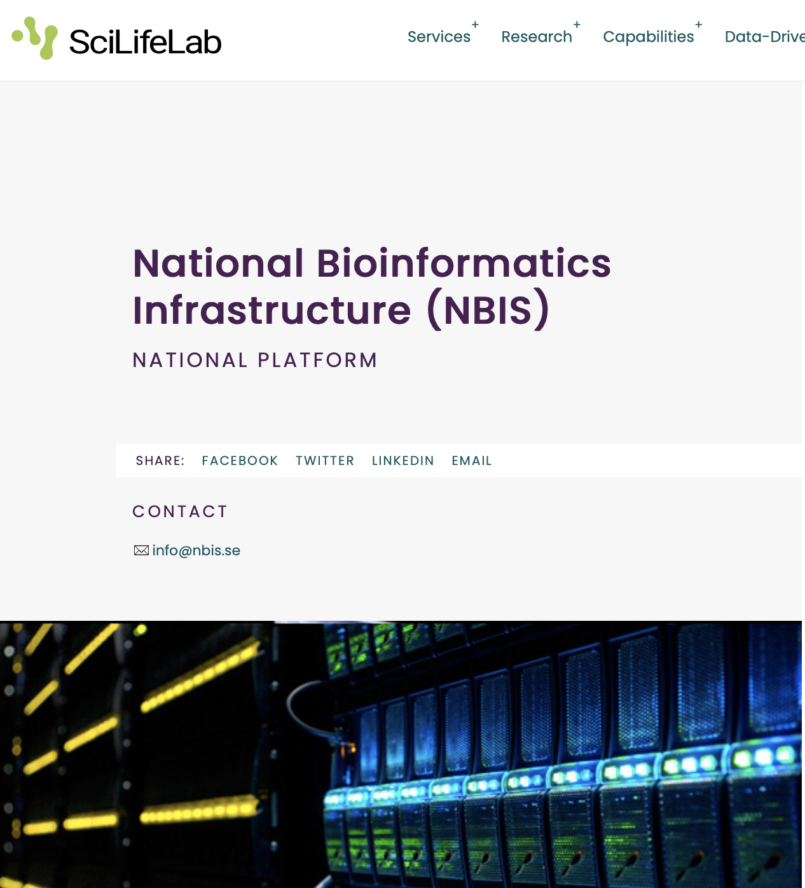
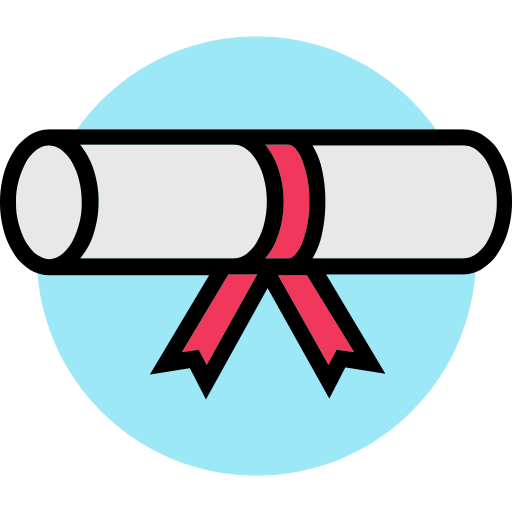

```{r}
#| message: false
#| warning: false

# load libraries
library(tidyverse)
library(kableExtra)
library(ggplot2)
library(rmarkdown)
library(ggbeeswarm)
library(gridExtra)
library(scales)
library(ggthemes)
library(faraway)
library(GGally)
library(glmnet)
library(latex2exp)
library(splitTools)

```


## Session plan
<br>

. . .

Part I (ca. 60 min)

- say Hi and sort out course practicalities (up to 30 min)
- introduce key ML concepts and end-to-end workflow (up to 30 min)

. . .

<br>

*take a small break (ca. 15 min)*


. . .

<br>

Part II

- group discussion (ca. 30 min)

<br>

. . .

Part III

- demo of a project work (ca. 30 min)
- & a small homework task


# 👋 Hello & Warm Welcome to the course {.center background-color="var(--light-gold)"}

## About us

<br/><br/>


::: columns
::: {.column width="60%"}
- [Olga Dethlefsen](https://nbis.se/about/staff/olga-dethlefsen/)
- [Payam Emami](https://nbis.se/about/staff/payam-emami/)
- [Eva Freyhult](https://nbis.se/about/staff/eva-freyhult/)

<br>

- [Mun-Gwan Hong](https://nbis.se/staff/mun-gwan-hong)
- [Miguel A. Redondo](https://nbis.se/staff/miguel-a-redondo-2)
- [Yuan Li](https://nbis.se/staff/employee-13)

<br/><br/>

- NBIS: National Bioinformatics Infrastructure Sweden
- SciLifeLab Bioinformatics Platform
- <https://nbis.se>
- <https://www.scilifelab.se/units/nbis/>
:::

::: {.column width="40%"}
{width="391"}
:::
:::

<br/><br/>


## What about you?
*Let’s do a quick round of introductions*

<br>

. . .

:::: {.columns}

::: {.column width="40%"}

E.g.

- Where are you in your career right now (university, position)?
- What is your favorite data? 
- Why did you choose this course?
- Or, if you prefer: what are your weekend plans or anything else unrelated?

:::


::: {.column width="10%"}
:::


::: {.column width="40%"}
{width="391"}
:::

::::

## Building on previous course

<br>

::: incremental
- Since 2019 we have been running "Introduction to statistics and ML" for life science researcher.
- There was a demand for a continuation course. 
- Which we started running 2025.
- And now this course is also part of [Data-Driven Life Science Research School](https://www.scilifelab.se/data-driven/ddls-research-school/)
:::

# Practicalities

## Sessions

<br/><br/>

::: columns
::: {.column width="60%"}

::: {.incremental}

- On-line sessions
- Sep 25, Oct 9, Nov 13
- 09:30 - 12:30
- up to 3h hours long

:::

<br>

::: {.incremental}

- On-site at Uppsala University
- Oct 12 - 16
- 09:00 - 17:00
- 😅 intense

:::

:::

:::

## Course website

<br/><br/>

::: incremental
- [https://uppsala.instructure.com/courses/122258](https://uppsala.instructure.com/courses/122258)
- we will send you Canvas invite shortly so you can access non-public materials
:::


## Canvas Demo

<br/><br/>

- Schedule
- Travel
- Files
- People


<br/><br/>

## Certificate requirements, 3 hp

<br/><br/>

::: columns
::: {.column width="60%"}
::: {.fragment .fade-in}
1.  presence in all sessions
    -   we may allow some skipping if you talk to us ahead
:::

<!-- ::: {.fragment .fade-in}
2.  completing "Daily challenge" quiz
    -   opens daily at 15.00
    -   closes at 09:00 the following day
::: -->

::: {.fragment .fade-in}
2.  active participation
:::

::: {.fragment .fade-in}
3.  completing project work
:::
:::

::: {.column width="40%"}
{fig-align="center" width="200"}
:::
:::

. . .

<br>
*Note that it is up to you to clarify and arrange credit transfer with your university department.*

 
## Any questions? {.center}

<br/><br/>

