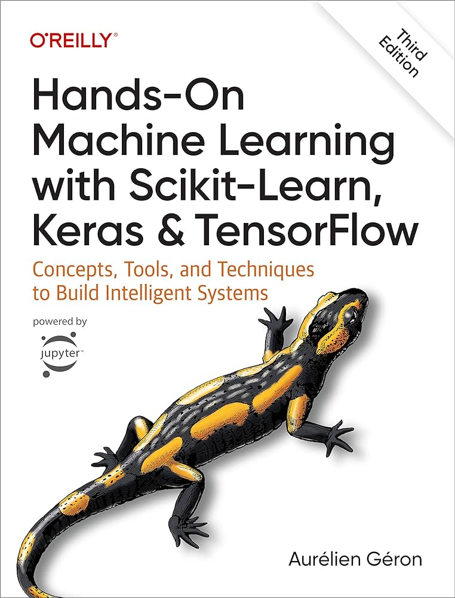
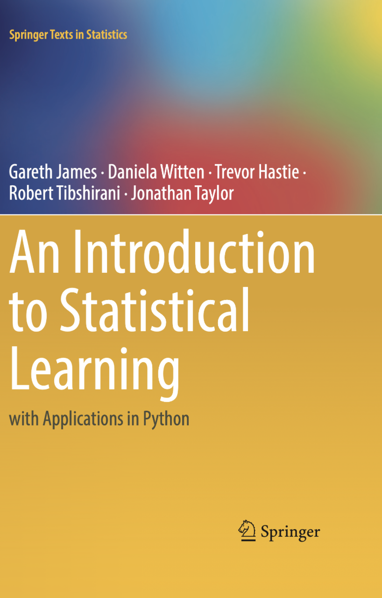
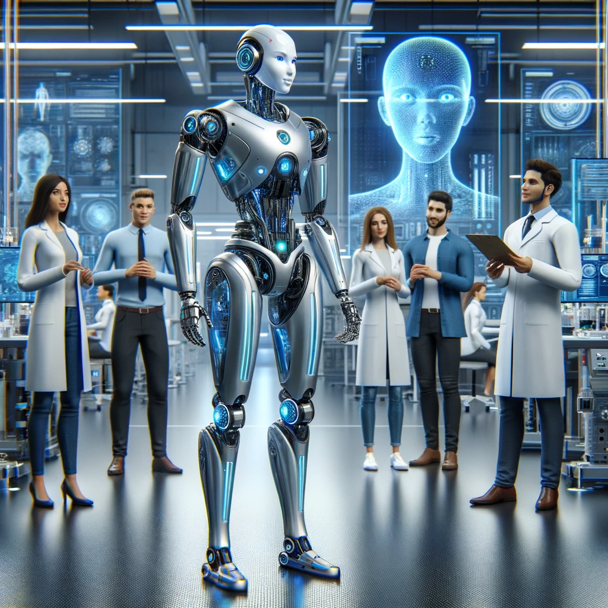

## Group discussion

 

- Think about all the topics we discussed this week. 
- Discuss what you may be still finding unclear or interesting. 
- Come up with at least **at least 2 questions** that you would like to hear answers to. Write them down on a piece of paper. 

## Materials availability
 

[https://uppsala.instructure.com/courses/110506](https://uppsala.instructure.com/courses/110506)

- website will stay up forever
- in case any of the links break, contact us

 

. . .

[https://nbisweden.github.io/ML4Life/](https://nbisweden.github.io/ML4Life/)

- our landing and learning resources page

## Recommended books {.smaller}
 

:::: {.columns}

::: {.column width="70%"}
### Biostatistics

- Medical Statistics at a Glance by Aviva Petrie and Caroline Sabin
- Essential Medical Statistics by Kirkwood and Sterne
- Practical Statistics for Data Scientists: 50 Essential Concepts by Peter Bruce and Andrew Bruce

### Linear models 

- Linear Models with R by Julian J. Faraway (second edition)
- Extending the Linear Models with R by Julian J. Faraway (second edition)
- Data Analysis Using Regression and Multilevel/Hierarchical Models by Andrew Gelman & Jennifer Hill

### Statistics & machine learning 

- An Introduction to Statistical Learning with Application in R by Gareth James, Daniela Witten, Trevor Hastie & Robert Tibshirani (second edition) [free download](https://www.statlearning.com).
- Data Analysis for the Life Sciences with R by Rafael A. Irizarry, Michael I. Love.
- Hands-on Machine Learning with Scikit-Learn, Keras & TensorFlow by Aurelien Geron
- Elements of Statistical Learning: data mining, inference and prediction by Trevor Hastie, Robert Tibshirani & Jerome Friedman
:::
 
::: {.column width="2%"}
:::  

::: {.column width="13%"}
{height=2in width=1.3in}

{height=2in width=1.3in}
::: 

::: {.column width="15%"}

{height=2in width=1.3in}

{height=2in width=1.3in}

:::

::::

## Contact

 

:::: {.columns}

::: {.column width="50%"}
- edu.ml-biostats@nbis.se (reaches Eva and Olga)

- eva.freyhult@nbis.se
- olga.dethlefsen@nbis.se
- payam.emami@nbis.se
- miguel.angel.redondo@nbis.se
- mungwan.hong@nbis.se
- julie.lorent@nbis.se

:::

::: {.column width="50%"}

:::

::::

## Drop-in

 

:::: {.columns}

::: {.column width="60%"}
[https://meet.nbis.se/dropin](https://meet.nbis.se/dropin)

- Tuesdays after lunch, online, 14:00 - 15:00
- And in person in Stockholm and Lund
- For exact schedule see [https://nbis.se/get-support/talk-to-us](https://nbis.se/get-support/talk-to-us)
:::

::: {.column width="5%"}

:::

::: {.column width="35%"}

:::

::::

## SciLifeLab AI and IO Seminar series
 
 

:::: {.columns}

::: {.column width="50%"}
[https://scilifelab.atlassian.net/wiki/spaces/IJC/overview](https://scilifelab.atlassian.net/wiki/spaces/IJC/overview)

- invited talks in Artificial Intelligence and Integrative Omics
- online, once a month, 1h
- open to everyone
:::

::: {.column width="5%"}

:::

::: {.column width="45%"}

:::

::::

## Training events
 

- [https://nbis.se/training](https://nbis.se/training)
- [https://www.scilifelab.se/events/#calendar](https://www.scilifelab.se/events/#calendar)

## Follow-up session
 

- any interest for an online follow-up session?

## Feedback

 

:::: {.columns}

::: {.column width="45%"}

:::

::: {.column width="5%"}

:::
::: {.column width="45%"}
- Your opinion matters!
- Could you please help us and future participants by filling in the feedback form before you leave?

:::

::::

## Well done & massive thank you! 

<!-- ## {background-color="black" background-image="images/robot-flower.png" background-size="250px" background-repeat="repeat"} -->

<!-- Well done & massive thank you!  -->

