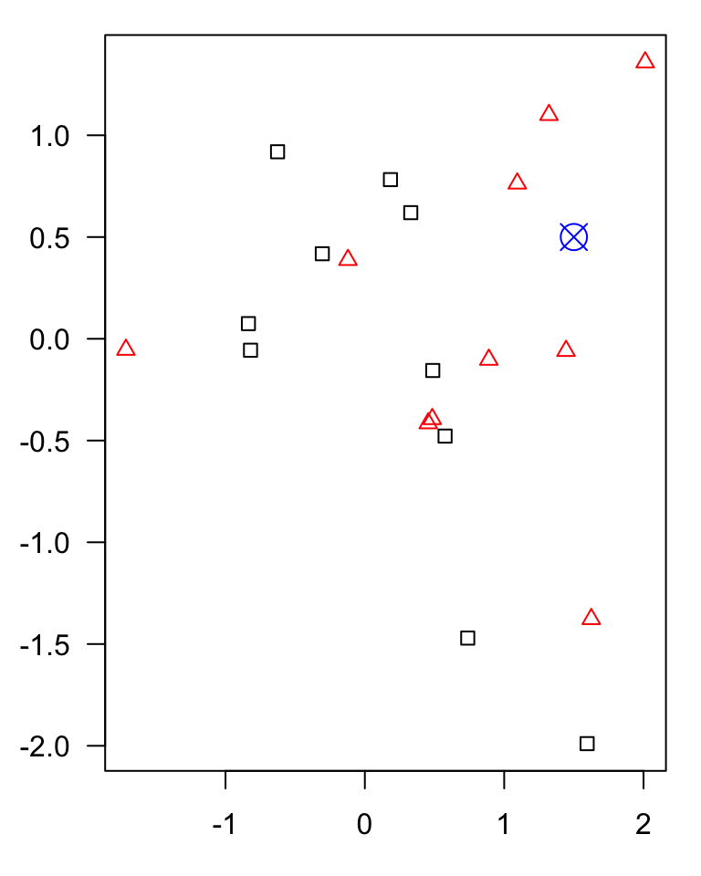
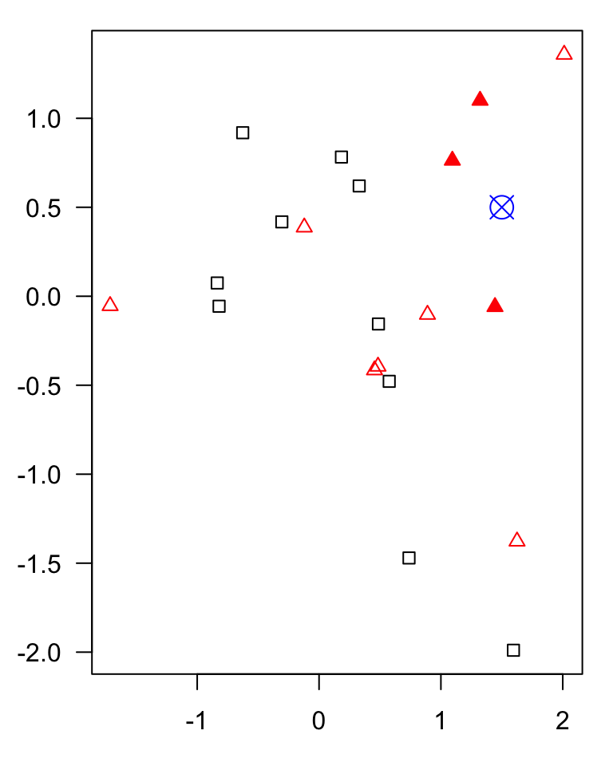
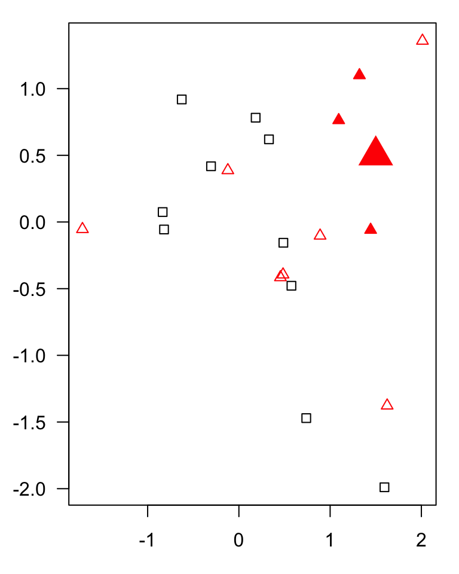
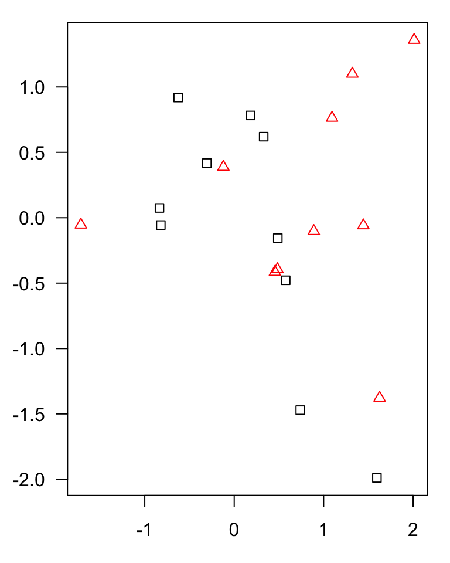
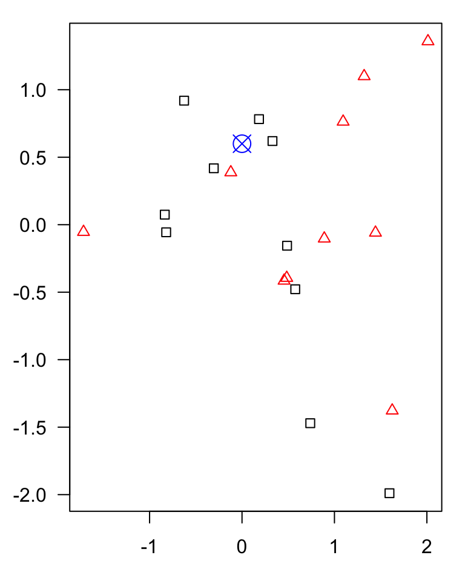
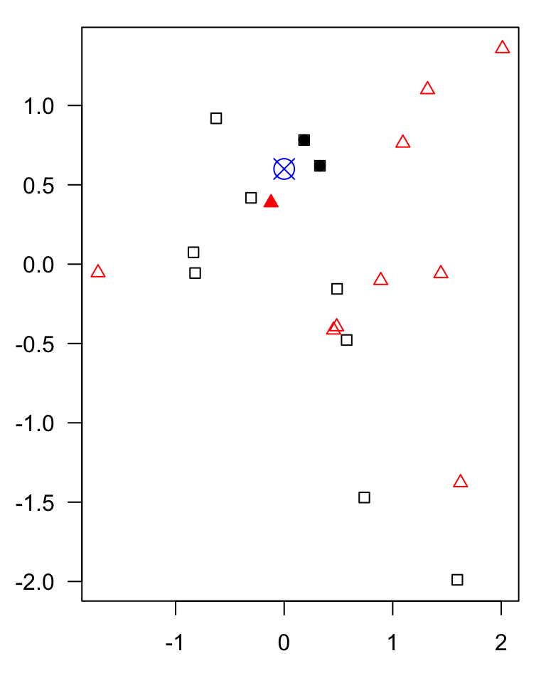
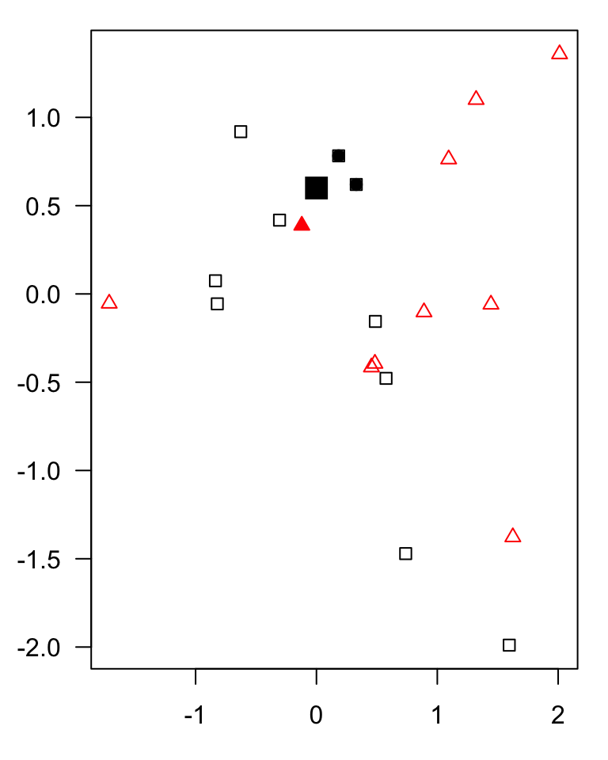

```{r}
#| message: false
#| warning: false

# load libraries
library(tidyverse)
library(kableExtra)
library(ggplot2)
library(rmarkdown)
library(ggbeeswarm)
library(gridExtra)
library(scales)
library(ggthemes)
library(faraway)
library(GGally)
library(glmnet)
library(latex2exp)
library(splitTools)
library(ggeffects)
library(pROC)
library(patchwork)

```

## Outline
<br><br>

- Introduction:	from inference to prediction
- KNN: K-nearest neighbors
- SVM: Support vector machines
- Data splitting
- Model evaluation
- Tuning and cross-validation
- Final model

## What is supervised learning?
*From inference to prediction*
<br><br>

**Inference:** 

Understanding relationships between variables.

- Which variables are associated with an outcome?
- What is the magnitude and uncertainty of these associations?

<br>

. . .

**Prediction:** 

Predicting outcomes for new observations.

- Can we use measured variables to predict an outcome?
- How well does our model perform on unseen data?

. . .

<br>

::: {.text-box-1}
*Explaining relationships is not the same as making accurate predictions. However, many methods, such as linear models, can be used for both inference and prediction.*
:::

## What is supervised learning?
*Two types of prediction tasks*
<br><br>

::: {.columns}

::: {.column width="50%"}

### Regression

Predict a **continuous outcome**.

**Example:** Predict chronological age from DNA methylation measurements.

$$
\hat{y} = \text{predicted age}
$$

:::


::: {.column width="50%"}

### Classification

Predict a **categorical outcome**.

**Example:** Predict whether a tumour is benign or malignant from biopsy measurements.

$$
\hat{y} \in \{\text{benign}, \text{malignant}\}
$$

:::

:::


## What is supervised learning?
<br>

In **supervised learning**, we train a model using observations with **known outcomes (labels)**.

- **Features / predictors ($X$):** the input variables used for predictions, e.g. image-derived features
- **Target / outcome ($y$):** the known outcome we want to predict.e.g. treatment response
- **Training:** Learning relationships between predictors and the outcome.

. . .

::: {.text-box-2}
The learning algorithm uses the features and their corresponding targets to learn a function:


$$\hat{y} = f(X)$$

where $f$ represents the model and $\hat{y}$ is the predicted outcome.
:::

. . .

<br>

Once trained, the model can make predictions for **new observations**.


## The goal {.center}

<br>

The central goal is **generalization**: the ability to make accurate predictions on new, unseen data.

## What is supervised learning?
*Supervised learning models*
<br><br>


Different algorithms learn relationships between features and targets in different ways.

. . .

Some commonly used supervised learning algorithms include:

::: incremental
- **Linear and logistic regression:** Learn relationships between features and outcomes by **estimating model coefficients**.
- **K-nearest neighbors (KNN):** Makes predictions using nearby training observations by **comparing distances and identifying nearest neighbors**.
- **Support Vector Machines (SVM):** Learn by **finding a decision boundary** that separates classes with the largest possible margin (with extensions for nonlinear relationships and regression).
- **Decision trees:** Learn by **recursively splitting the data** based on feature values to form prediction rules.
- **Random Forests:** Learn by **combining many decision trees**, each trained on different samples and using random subsets of features.
- **Artificial Neural Networks (ANN):** Learn by **iteratively adjusting weights** between interconnected computational units to minimize prediction errors.
:::

# KNN: K-nearest neighbors

## KNN
<br>

::: incremental
- A supervised learning algorithm that makes predictions based on **similarity between observations**.
- **Key assumption:** Observations with similar features are likely to have similar outcomes.
- For a new observation, KNN identifies the $k$ closest training observations:
  - **Classification:** Predicts the most common class among the neighbors.
  - **Regression:** Predicts the average outcome among the neighbors.
- KNN retains the training observations rather than fitting model coefficients during training (*lazy learning*).
:::

## KNN

```{r}
#| label: fig-knn-create-points
#| fig-cap: An example of k-nearest neighbors algorithm with k=3; in the top new observation (blue) is closest to three red triangles and thus classified as a red triangle; in the bottom, a new observation (blue) is closest to 2 black dots and 1 red triangle thus classified as a black dot (majority vote)

# Example data
n1 <- 10
n2 <- 10
set.seed(1)
x <- c(rnorm(n1, mean=0, sd=1), rnorm(n2, mean=0.5, sd=1))
y <- rnorm(n1+n2, mean=0, sd=1)

group <- rep(1, (n1+n2))
group[1:n1] <- 0
idx.1 <- which(group==0)
idx.2 <- which(group==1)

# new points
p1 <- c(1.5, 0.5)
p2 <- c(0, 0.6)

# distance 
dist.1 <- c()
dist.2 <- c()
for (i in 1:length(x))
{
  dist.1[i] <- round(sqrt((p1[1]-x[i])^2 + (p1[2]-y[i])^2),2)
  dist.2[i] <- round(sqrt((p2[1]-x[i])^2 + (p2[2]-y[i])^2),2)
}

# find nearest friends
n.idx1 <- order(dist.1)
n.idx2 <- order(dist.2)

```

```{r}
#| label: fig-knn-00
#| fig-width: 4
#| fig-height: 5
#| include: false

# a) 
par(mar=(c(3, 3, 1, 1)))
plot(x[idx.1],y[idx.1], pch=0, las=1, xlim=c(min(x), max(x)), ylim=c(min(y), max(y)), xlab="x", ylab="y")
points(x[idx.2], y[idx.2], pch=2, col="red")
#points(p1[1], p1[2], pch=13, col="blue", cex=2)

```

```{r}
#| label: fig-knn-01
#| fig-width: 4
#| fig-height: 5
#| include: false

# b) 
par(mar=(c(3, 3, 1, 1)))
plot(x[idx.1],y[idx.1], pch=0, las=1, xlim=c(min(x), max(x)), ylim=c(min(y), max(y)), xlab="x", ylab="y")
points(x[idx.2], y[idx.2], pch=2, col="red")
points(p1[1], p1[2], pch=13, col="blue", cex=2)

```

```{r}
#| label: fig-knn-02
#| fig-width: 4
#| fig-height: 5
#| include: false

# c) 
par(mar=(c(3, 3, 1, 1)))
plot(x[idx.1],y[idx.1], pch=0, las=1, xlim=c(min(x), max(x)), ylim=c(min(y), max(y)), xlab="x", ylab="y")
points(x[idx.2], y[idx.2], pch=2, col="red")
points(p1[1], p1[2], pch=13, col="blue", cex=2)
points(x[n.idx1[1:3]], y[n.idx1[1:3]], pch=17, col="red")

```

```{r}
#| label: fig-knn-03
#| fig-width: 4
#| fig-height: 5
#| include: false

# d) 
par(mar=(c(3, 3, 1, 1)))
plot(x[idx.1],y[idx.1], pch=0, las=1, xlim=c(min(x), max(x)), ylim=c(min(y), max(y)), xlab="x", ylab="y")
points(x[idx.2], y[idx.2], pch=2, col="red")
points(p1[1], p1[2], pch=17, col="red", cex=3)
points(x[n.idx1[1:3]], y[n.idx1[1:3]], pch=17, col="red")

```

::: r-stack
{.fragment width="700" height="600"}

{.fragment width="700" height="600"}

{.fragment width="700" height="600"}

{.fragment width="700" height="600"}
:::

::: footer
:::


## KNN
<br>

```{r}
#| label: fig-knn-10
#| fig-width: 4
#| fig-height: 5
#| include: false

par(mar=(c(3, 3, 1, 1)))
plot(x[idx.1],y[idx.1], pch=0, las=1, xlim=c(min(x), max(x)), ylim=c(min(y), max(y)), xlab="x", ylab="y")
points(x[idx.2], y[idx.2], pch=2, col="red")
```

```{r}
#| label: fig-knn-20
#| fig-width: 4
#| fig-height: 5
#| include: false

par(mar=(c(3, 3, 1, 1)))
plot(x[idx.1],y[idx.1], pch=0, las=1, xlim=c(min(x), max(x)), ylim=c(min(y), max(y)), xlab="x", ylab="y")
points(x[idx.2], y[idx.2], pch=2, col="red")
points(p2[1], p2[2], pch=13, col="blue", cex=2)

```

```{r}
#| label: fig-knn-30
#| fig-width: 4
#| fig-height: 5
#| include: false

par(mar=(c(3, 3, 1, 1)))
plot(x[idx.1],y[idx.1], pch=0, las=1, xlim=c(min(x), max(x)), ylim=c(min(y), max(y)), xlab="x", ylab="y")

points(x[idx.2], y[idx.2], pch=2, col="red")
points(p2[1], p2[2], pch=13, col="blue", cex=2)
points(x[n.idx2[1]], y[n.idx2[1]], pch=17, col="red")
points(x[n.idx2[2:3]], y[n.idx2[2:3]], pch=19, col="black")

```

```{r}
#| label: fig-knn-40
#| fig-width: 4
#| fig-height: 5
#| include: false


par(mar=(c(3, 3, 1, 1)))
plot(x[idx.1],y[idx.1], pch=0, las=1, xlim=c(min(x), max(x)), ylim=c(min(y), max(y)), xlab="x", ylab="y")
points(x[idx.2], y[idx.2], pch=2, col="red")
points(p2[1], p2[2], pch=15, col="black", cex=2)
points(x[n.idx2[1]], y[n.idx2[1]], pch=17, col="red")
points(x[n.idx2[2:3]], y[n.idx2[2:3]], pch=19, col="black")

```

::: r-stack
{.fragment width="700" height="600"}

{.fragment width="700" height="600"}

{.fragment width="700" height="600"}

{.fragment width="700" height="600"}
:::

::: footer
:::

## KNN
*Choosing the number of neighbors ($k$)*

<br>

::: incremental
- $k$ is a **hyperparameter** that controls the flexibility of the KNN model.
- **Small $k$ (e.g., $k=1$):** More complex decision boundaries, sensitive to noise → risk of **overfitting**.
- **Large $k$:** Smoother decision boundaries, may miss local patterns → risk of **underfitting**.
- There is **no universally optimal $k$**; the best value depends on the dataset.
- We can select $k$ using **validation data or cross-validation**.
:::

```{r}
#| label: fig-knn-boundaries
#| fig-cap: "Effect of the number of neighbors (k) on KNN decision boundaries. Smaller k produces more flexible boundaries, while larger k produces smoother predictions."
#| fig-width: 12
#| fig-height: 4.5
#| echo: false

library(class)

# Use the same data as in the previous KNN example
# x, y, and group should already be defined

train <- data.frame(
  GeneA = x,
  GeneB = y,
  Class = factor(group, levels = c(0, 1))
)

# Grid covering the feature space
x_seq <- seq(min(x) - 0.5, max(x) + 0.5, length.out = 200)
y_seq <- seq(min(y) - 0.5, max(y) + 0.5, length.out = 200)

grid <- expand.grid(
  GeneA = x_seq,
  GeneB = y_seq
)

# Values of k to compare
k_values <- c(1, 5, 19)

# Colors
bg_cols <- c("#E6E6E6", "#FADDDD")
point_cols <- c("#333333", "#D04A4A")

# Plot
old_par <- par(no.readonly = TRUE)
par(mfrow = c(1, 3), mar = c(4, 4, 3, 1))

for (k in k_values) {

  # Predict class for every point on the grid
  pred <- knn(
    train = train[, c("GeneA", "GeneB")],
    test = grid,
    cl = train$Class,
    k = k
  )

  # Convert predictions to a matrix
  z <- matrix(
    as.integer(pred),
    nrow = length(x_seq),
    ncol = length(y_seq)
  )

  # Decision regions
  image(
    x_seq, y_seq, z,
    col = bg_cols,
    xlab = "Gene A",
    ylab = "Gene B",
    main = paste0("k = ", k),
    useRaster = TRUE,
      cex.lab = 2,
  cex.axis = 2,
  cex.main = 2
  )

  # Decision boundary
  contour(
    x_seq, y_seq, z,
    levels = 1.5,
    add = TRUE,
    drawlabels = FALSE,
    lwd = 1.5
  )

  # Training observations
  points(
    train$GeneA, train$GeneB,
    pch = ifelse(train$Class == "0", 16, 17),
    col = point_cols[as.integer(train$Class)],
    cex = 1.1
  )
}

par(old_par)
```

::: footer
:::

## KNN
*Why is feature scaling important?*
<br>

- KNN relies on **distances between observations**, so features with larger numerical ranges can dominate the distance calculation.
- **Standardization** puts features on a comparable scale:

  $$
  z = \frac{x-\mu}{\sigma}
  $$


Each feature is transformed to have mean 0 and standard deviation 1 in the training data.

<br>

. . .

- **To avoid data leakage!**
  - We estimate scaling parameters using **training data only**.
  - We then apply the same transformation to validation, test and new data.
  - During cross-validation, we fit scaling separately within each training fold.

## KNN
*Advantages and limitations of KNN*
<br><br>

::: {.columns}

::: {.column width="50%"}

### Advantages

- Simple to understand and implement.
- Makes few assumptions about the relationship between features and outcomes.
- Can capture nonlinear relationships.
- Works for both classification and regression.

:::

::: {.column width="50%"}

### Limitations

- Computationally expensive for large datasets at prediction time.
- Sensitive to feature scaling, noise and irrelevant features.
- Performance depends on the choice of $k$ and distance metric.
- Struggles with high-dimensional data (**curse of dimensionality**).

:::

:::

. . .

<br>
KNN is simple and flexible, but requires careful preprocessing, model evaluation and hyperparameter tuning.


# Support Vector Machines (SVM)

## SVM
<br>

::: incremental
- A supervised learning algorithm used primarily for **classification**, but also for regression (SVR).
- SVM **learns a decision boundary** that separates observations belonging to different classes.
- The goal is to find a boundary that **maximizes the margin** between the classes.
- The observations closest to the boundary are called **support vectors** and help determine its position.
:::
 
## SVM {.smaller}
*Finding a decision boundary*
<br>

- A **linear SVM** separates classes using a straight line (2D), a plane (3D), or a **hyperplane** (higher dimensions).
- Among possible separating boundaries, SVM aims to find the one with the **largest margin** between the classes.
- The decision boundary is defined by:

  $$
  \mathbf{w}^{T}\mathbf{x} + b = 0
  $$

  where $\mathbf{w}$ represents learned feature weights, $\mathbf{x}$ the input features, and $b$ the intercept.

- New observations are classified according to **which side of the boundary** they fall on.

```{r}
#| label: setup-svm
#| include: false

library(e1071)

# Shared colors and plotting symbols
class_cols <- c(A = "#2578A8", B = "#CE6547")
class_pch  <- c(A = 16, B = 17)

plot_samples <- function(dat, main = "", xlim = NULL, ylim = NULL) {
  plot(
    dat$GeneA, dat$GeneB,
    col = class_cols[as.character(dat$Class)],
    pch = class_pch[as.character(dat$Class)],
    xlab = "Gene A", ylab = "Gene B",
    main = main, cex = 1.15,
    xlim = xlim, ylim = ylim
  )
}

# Extract coefficients of a linear SVM
linear_coefficients <- function(model) {
  w <- as.vector(t(model$coefs) %*% model$SV)
  list(w = w, b = -as.numeric(model$rho))
}

# Draw decision boundary and margins
add_linear_svm <- function(model, margin = TRUE) {
  p <- linear_coefficients(model)

  abline(
    a = -p$b / p$w[2],
    b = -p$w[1] / p$w[2],
    col = "#343434", lwd = 2.5
  )

  if (margin) {
    for (s in c(-1, 1)) {
      abline(
        a = (s - p$b) / p$w[2],
        b = -p$w[1] / p$w[2],
        col = "#343434", lty = 2, lwd = 1.4
      )
    }
  }
}

# Highlight support vectors
add_support_vectors <- function(model) {
  points(
    model$SV[, 1], model$SV[, 2],
    pch = 1, cex = 1.8, lwd = 1.5,
    col = "#252525"
  )
}

# Plot predicted decision regions
plot_regions <- function(model, dat, main = "",
                         xlim = c(-3, 3),
                         ylim = c(-3, 3)) {

  xs <- seq(xlim[1], xlim[2], length.out = 230)
  ys <- seq(ylim[1], ylim[2], length.out = 230)

  grid <- expand.grid(GeneA = xs, GeneB = ys)

  pred <- predict(model, grid, decision.values = TRUE)

  z <- matrix(as.integer(pred), nrow = length(xs))

  image(
    xs, ys, z,
    col = c("#DAECF6", "#F6DDD4"),
    xlab = "Gene A", ylab = "Gene B",
    main = main, useRaster = TRUE
  )

  dv <- matrix(
    as.numeric(attr(pred, "decision.values")),
    nrow = length(xs)
  )

  contour(
    xs, ys, dv,
    levels = 0, add = TRUE,
    drawlabels = FALSE,
    lwd = 2, col = "#333333"
  )

  points(
    dat$GeneA, dat$GeneB,
    col = class_cols[as.character(dat$Class)],
    pch = class_pch[as.character(dat$Class)],
    cex = 1.05
  )
}

set.seed(13)

n <- 18

a <- data.frame(
  GeneA = rnorm(n, -1.25, 0.38),
  GeneB = rnorm(n, -0.65, 0.40),
  Class = "A"
)

b <- data.frame(
  GeneA = rnorm(n, 1.25, 0.38),
  GeneB = rnorm(n, 0.65, 0.40),
  Class = "B"
)

dat_linear <- rbind(a, b)
dat_linear$Class <- factor(
  dat_linear$Class, levels = c("A", "B")
)

fit_linear <- svm(
  Class ~ GeneA + GeneB,
  data = dat_linear,
  kernel = "linear",
  cost = 100,
  scale = FALSE
)

op <- par(
  mar = c(4.5, 4.5, 2, 1),
  cex.lab = 1.25,
  cex.axis = 1.05
)

```

```{r}
#| label: fig-svm-max-margin
#| fig-cap: "Maximum-margin principle in linear SVM. (A) A separating boundary with a smaller margin. (B) The maximum-margin boundary selected by SVM. Circled observations are support vectors."
#| fig-width: 11
#| fig-height: 4.8
#| echo: false

# Requires dat_linear, fit_linear and the plotting
# functions from the previous SVM section.

# Extract optimal linear SVM coefficients
p <- linear_coefficients(fit_linear)
w <- p$w
b <- p$b

# Express the fitted boundary using a unit normal vector
normal <- w / sqrt(sum(w^2))
offset <- b / sqrt(sum(w^2))

# Signed distances of training points to SVM boundary
coords <- as.matrix(dat_linear[, c("GeneA", "GeneB")])
labels <- ifelse(dat_linear$Class == "A", -1, 1)

signed_dist <- as.vector(coords %*% normal + offset)

# Find a small shift that keeps all observations
# correctly classified but reduces the margin.
left_space <- min(signed_dist[labels == 1])
right_space <- -max(signed_dist[labels == -1])

shift <- 0.55 * min(left_space, right_space)

# Shift toward one class (still separating)
offset_shifted <- offset + shift

draw_boundary <- function(offset_value, normal, col = "#333333") {
  abline(
    a = -offset_value / normal[2],
    b = -normal[1] / normal[2],
    col = col,
    lwd = 2.5
  )
}

draw_margin <- function(offset_value, normal, margin_size) {
  for (s in c(-1, 1)) {
    abline(
      a = -(offset_value + s * margin_size) / normal[2],
      b = -normal[1] / normal[2],
      col = "#777777",
      lty = 2,
      lwd = 1.5
    )
  }
}

op <- par(
  mfrow = c(1, 2),
  mar = c(4.5, 4.5, 3, 1),
  cex.lab = 1.3,
  cex.axis = 1.1,
  cex.main = 1.3
)

# A: Shifted boundary with a smaller geometric margin
plot_samples(
  dat_linear,
  main = "A. Smaller margin",
  xlim = c(-2.5, 2.5),
  ylim = c(-2.2, 2.2)
)

dist_shifted <- as.vector(
  coords %*% normal + offset_shifted
)

margin_shifted <- min(labels * dist_shifted)

draw_boundary(offset_shifted, normal)
draw_margin(offset_shifted, normal, margin_shifted)

# B: Maximum-margin SVM
plot_samples(
  dat_linear,
  main = "B. Maximum margin",
  xlim = c(-2.5, 2.5),
  ylim = c(-2.2, 2.2)
)

draw_boundary(offset, normal)

# Geometric margin (distance from boundary to support vectors)
margin_opt <- 1 / sqrt(sum(w^2))
draw_margin(offset, normal, margin_opt)

add_support_vectors(fit_linear)

par(op)
```


::: footer
:::

## SVM {.smaller}
*Soft-margin SVM: Allowing classification errors*
<br>

- Real biological data often contain **noise, variability and overlapping classes**, making perfect separation impossible.
- **Soft-margin SVM** allows some observations to fall inside the margin or be misclassified.
- The hyperparameter **$C$ (cost)** controls the trade-off between maximizing the margin and penalizing margin violations:
  - **Small $C$:** Stronger regularization → wider margin, more tolerance for violations.
  - **Large $C$:** Weaker regularization → stronger penalties for violations, potentially narrower margin.
- The best value of $C$ is typically selected using **validation or cross-validation**.


```{r}
#| label: fig-svm-cost
#| fig-cap: "Soft-margin linear SVM fitted to the same overlapping dataset. Smaller C permits more margin violations, while larger C penalizes them more strongly."
#| fig-width: 11.5
#| fig-height: 4.7
#| echo: false

set.seed(23)

n <- 32

a <- data.frame(
  GeneA = rnorm(n, -0.65, 0.65),
  GeneB = rnorm(n, -0.20, 0.70),
  Class = "A"
)

b <- data.frame(
  GeneA = rnorm(n, 0.65, 0.65),
  GeneB = rnorm(n, 0.20, 0.70),
  Class = "B"
)

dat_overlap <- rbind(a, b)
dat_overlap$Class <- factor(
  dat_overlap$Class, levels = c("A", "B")
)

op <- par(
  mfrow = c(1, 2),
  mar = c(4.3, 4.5, 3, 1),
  cex.lab = 1.25,
  cex.axis = 1.02,
  cex.main = 1.3
)

for (C in c(0.1, 100)) {

  fit <- svm(
    Class ~ GeneA + GeneB,
    data = dat_overlap,
    kernel = "linear",
    cost = C,
    scale = FALSE
  )

  plot_samples(
    dat_overlap,
    main = paste0("C = ", C),
    xlim = c(-2.8, 2.8),
    ylim = c(-2.6, 2.6)
  )

  add_linear_svm(fit)
  add_support_vectors(fit)
}

par(op)
```


::: footer
:::


## SVM {.smaller}
*Nonlinear SVM: The kernel trick*
<br>

:::: {.columns}
::: {.column width="45%"}

- Biological relationships are often **nonlinear**, and classes may not be separable by a straight line.
- **Kernel functions** allow SVM to learn nonlinear decision boundaries by implicitly working in a transformed feature space.
- Common kernels:
  - **Linear:** Linear decision boundary.
  - **Polynomial:** Captures polynomial relationships.
  - **Radial Basis Function (RBF):** Flexible, nonlinear decision boundaries.
:::

::: {.column width="5%"}

:::

::: {.column width="45%"}

```{r}
#| label: fig-svm-kernels
#| fig-cap: "Linear and RBF SVM fitted to the same nonlinear classification problem. Shaded regions indicate predicted classes; solid curves indicate decision boundaries."
#| fig-height: 12
#| echo: false

set.seed(31)

n <- 65

ang1 <- runif(n, 0, 2 * pi)
ang2 <- runif(n, 0, 2 * pi)

r1 <- pmax(0.05, rnorm(n, 0.75, 0.17))
r2 <- pmax(0.05, rnorm(n, 2.05, 0.23))

dat_rings <- data.frame(
  GeneA = c(r1 * cos(ang1), r2 * cos(ang2)),
  GeneB = c(r1 * sin(ang1), r2 * sin(ang2)),
  Class = factor(
    rep(c("A", "B"), each = n),
    levels = c("A", "B")
  )
)

# Linear SVM
fit_lin_rings <- svm(
  Class ~ GeneA + GeneB,
  data = dat_rings,
  kernel = "linear",
  cost = 1,
  scale = FALSE
)

# Nonlinear SVM
fit_rbf_rings <- svm(
  Class ~ GeneA + GeneB,
  data = dat_rings,
  kernel = "radial",
  cost = 10,
  gamma = 0.7,
  scale = FALSE
)

op <- par(
  mfrow = c(2,1),
  mar = c(4.3, 4.5, 3, 1),
  cex.lab = 1.25,
  cex.axis = 1.02,
  cex.main = 1.3
)

plot_regions(
  fit_lin_rings, dat_rings,
  main = "Linear SVM"
)

plot_regions(
  fit_rbf_rings, dat_rings,
  main = "RBF SVM"
)

par(op)
```

:::

::::

::: footer
:::


## SVM {.smaller}
*Nonlinear SVM: The kernel trick*
<br>


:::: {.columns}
::: {.column width="45%"}

- For the **RBF kernel**, $\gamma$ controls how quickly similarity decreases with distance:
  - **Small $\gamma$:** Broader influence of observations → generally smoother boundaries.
  - **Large $\gamma$:** More localized influence → potentially more complex boundaries.
- **$C$ and $\gamma$** jointly control model flexibility and can be tuned using cross-validation.
:::

::: {.column width="5%"}

:::

::: {.column width="45%"}

```{r}
#| label: fig-svm-kernels-02
#| fig-cap: "Linear and RBF SVM fitted to the same nonlinear classification problem. Shaded regions indicate predicted classes; solid curves indicate decision boundaries."
#| fig-height: 12
#| echo: false

set.seed(31)

n <- 65

ang1 <- runif(n, 0, 2 * pi)
ang2 <- runif(n, 0, 2 * pi)

r1 <- pmax(0.05, rnorm(n, 0.75, 0.17))
r2 <- pmax(0.05, rnorm(n, 2.05, 0.23))

dat_rings <- data.frame(
  GeneA = c(r1 * cos(ang1), r2 * cos(ang2)),
  GeneB = c(r1 * sin(ang1), r2 * sin(ang2)),
  Class = factor(
    rep(c("A", "B"), each = n),
    levels = c("A", "B")
  )
)

# Linear SVM
fit_lin_rings <- svm(
  Class ~ GeneA + GeneB,
  data = dat_rings,
  kernel = "linear",
  cost = 1,
  scale = FALSE
)

# Nonlinear SVM
fit_rbf_rings <- svm(
  Class ~ GeneA + GeneB,
  data = dat_rings,
  kernel = "radial",
  cost = 10,
  gamma = 0.7,
  scale = FALSE
)

op <- par(
  mfrow = c(2,1),
  mar = c(4.3, 4.5, 3, 1),
  cex.lab = 1.25,
  cex.axis = 1.02,
  cex.main = 1.3
)

plot_regions(
  fit_lin_rings, dat_rings,
  main = "Linear SVM"
)

plot_regions(
  fit_rbf_rings, dat_rings,
  main = "RBF SVM"
)

par(op)
```


:::

::::

::: footer
:::

## SVM
*Choosing SVM hyperparameters*
<br>

SVM has several **hyperparameters** that influence the model's flexibility and predictive performance.

<br>

| Hyperparameter | Role |
|---|---|
| **Kernel** | Determines whether the decision boundary is linear or nonlinear. |
| **$C$ (cost)** | Controls regularization and penalties for margin violations. |
| **$\gamma$ (gamma)** | Controls how localized the influence of observations is (RBF kernel). |

<br>

- **Model parameters** (e.g., weights and intercept) are learned during training.
- **Hyperparameters** are selected using **validation or cross-validation**.


## SVM
<br>

**Advantages**

- Can work well in high-dimensional feature spaces, such as gene expression or methylation datasets.
- Can model both linear and nonlinear decision boundaries.
- Regularization allows control over model complexity.
- Can generalize well when the kernel and hyperparameters are appropriately selected.

<br>

**Limitations**

- Requires careful selection of hyperparameters.
- Performance can be sensitive to feature scaling.
- Kernel SVMs can become computationally expensive for large datasets.
- Nonlinear SVMs are often less interpretable than simpler linear models.
- Performance may be affected by noisy features, class imbalance, and the choice of kernel.


## KNN vs SVM
<br>

Although both KNN and SVM can be used for classification, they approach prediction differently.

<br>

| | KNN | SVM |
|---|---|---|
| Main idea | Predict from nearby observations | Learn a separating decision boundary |
| Learning approach | Instance-based | Optimization-based |
| Decision boundaries | Determined by local neighborhoods | Determined by the fitted margin-based classifier |
| Key hyperparameters | k, distance metric | C, kernel, gamma |
| Nonlinear classification | Naturally supported | Supported through kernels |
| Feature scaling | Important | Important |


## Generalization
*Underfitting and overfitting*
<br>

The goal is to **generalize well to new, unseen data**, not just fit the training data.

- **Underfitting:** Model is too simple to capture important patterns → poor training and validation performance.
- **Overfitting:** Model learns noise and sample-specific patterns → good training performance but poor validation performance.
- **Bias–variance trade-off:** Increasing model complexity generally reduces bias but may increase variance.
- **How to detect it?** Compare training and validation performance:
  - Poor performance on both → possible **underfitting**.
  - Large gap between training and validation performance → possible **overfitting**.

```{r}
#| label: fig-under-overfitting
#| fig-cap: "Conceptual relationship between model complexity and training and validation error."
#| fig-width: 7
#| fig-height: 4.5
#| echo: false

complexity <- seq(0, 10, length.out = 200)

train_error <- 0.1 + 0.7 * exp(-0.45 * complexity)

valid_error <- 0.22 + 0.025 * (complexity - 5)^2

op <- par(
  mar = c(4.5, 4.5, 2, 1),
  cex.lab = 1.3,
  cex.axis = 1.1
)

plot(
  complexity, train_error,
  type = "l", lwd = 3,
  col = "#357ABD",
  ylim = c(0, 1),
  xlab = "Model complexity",
  ylab = "Prediction error",
  xaxt = "n"
)

lines(
  complexity, valid_error,
  col = "#D68A35",
  lwd = 3
)

abline(v = 5, lty = 2, col = "grey60")

axis(
  1, at = c(0, 10),
  labels = c("Low", "High")
)

text(1.5, 0.15, "Underfitting", cex = 1.1)
text(8.5, 0.85, "Overfitting", cex = 1.1)

legend(
  "top",
  legend = c("Training error", "Validation error"),
  col = c("#357ABD", "#D68A35"),
  lwd = 3, bty = "n", horiz = TRUE
)

par(op)
```

::: footer
:::


## Training, validation and test sets
<br>

To estimate performance on **new, unseen data**, we divide observations into separate subsets:

- **Training set:** Used to fit the model and learn relationships between features and outcomes.
- **Validation set:** Used to compare models and select hyperparameters.
- **Test set:** Used only for the final evaluation of the selected model.

**Important:** The test set must remain **untouched during model development**. Repeatedly using it to guide model selection can lead to overly optimistic performance estimates.


```{r}
#| label: fig-train-valid-test
#| fig-cap: "Example of splitting data into training (60%), validation (20%), and test (20%) subsets."
#| fig-width: 9
#| fig-height: 2.5
#| echo: false

op <- par(mar = c(0.5, 0.5, 0.5, 0.5))

plot(
  NA, xlim = c(0, 100), ylim = c(0, 2),
  axes = FALSE, xlab = "", ylab = "",
  bty = "n"
)

rect(0, 0.8, 60, 1.5, col = "#D8E9F7", border = "white")
rect(60, 0.8, 80, 1.5, col = "#F9E5C8", border = "white")
rect(80, 0.8, 100, 1.5, col = "#D7E9DD", border = "white")

text(30, 1.15, "Training\n60%", cex = 1.2)
text(70, 1.15, "Validation\n20%", cex = 1.1)
text(90, 1.15, "Test\n20%", cex = 1.1)

text(30, 0.48, "Fit model", cex = 1)
text(70, 0.48, "Select model", cex = 1)
text(90, 0.48, "Final evaluation", cex = 1)

par(op)
```


::: footer
:::

## Choosing an appropriate splitting strategy
<br><br>

Observations are not always independent, and random splitting may not be appropriate for every dataset.

. . .

<br>
Depending on the study design, we may use:

::: incremental

- **Random splitting:** Suitable when observations are approximately independent and identically distributed.
- **Stratified splitting:** Preserves approximately the same class proportions in each subset, particularly useful for imbalanced classification datasets.
- **Grouped splitting:** Keeps related observations together, such as repeated measurements from the same patient.
- **Temporal splitting:** Uses earlier observations for training and later observations for evaluation, when the aim is to predict future outcomes.

:::

. . .

<br>

The splitting strategy should reflect how the model will be used in practice.

## Data leakage 
<br>

**Data leakage** occurs when information unavailable during real-world prediction influences model training or selection.

. . .

<br>

**Common examples:**

::: incremental
- Selecting features using the **entire dataset** before splitting.
- Standardizing or imputing using **validation or test data**.
- Including repeated measurements from the same patient in both training and test sets.
- Using predictors that become available **only after the outcome**.
:::

. . .

**How to prevent leakage:**

::: incremental
- Split data **before data-dependent preprocessing and feature selection**.
- Learn preprocessing transformations from **training data only**.
- During cross-validation, repeat these steps **within each training fold**.
:::

# Model evaluation: classification

## Model evaluation: classification
<br>

::: incremental
- Classification performance is evaluated by comparing **predicted classes** with **true class labels**.
- Classifiers may produce:
  - **Class labels** directly (e.g., disease / healthy).
  - **Scores or probabilities** that can be converted into class labels using a threshold.
- **Example:** With a probability threshold of 0.5:
  - Probability $\geq 0.5$ → Positive class.
  - Probability $< 0.5$ → Negative class.
- The **classification threshold** affects the number of correct and incorrect predictions, and therefore model performance metrics.
:::


## Model evaluation: classification
*Confusion matrix*
<br>

A **confusion matrix** compares actual and predicted class labels.

| | Predicted positive | Predicted negative |
|---|:---:|:---:|
| **Actual positive** | True positive (TP) | False negative (FN) |
| **Actual negative** | False positive (FP) | True negative (TN) |

- **TP / TN:** Correct predictions.
- **FP:** Negative observation incorrectly predicted as positive.
- **FN:** Positive observation incorrectly predicted as negative.

These four quantities form the basis of common **classification metrics**.


## Model evaluation: classification {.smaller}
*Different metrics capture different aspects of predictive performance*
<br><br><br><br>


| Metric | Formula | What does it measure? |
|---|---|---|
| **Accuracy** | $\frac{TP+TN}{TP+TN+FP+FN}$ | Overall proportion of correct predictions |
| **Sensitivity (recall)** | $\frac{TP}{TP+FN}$ | How many actual positives did we detect? |
| **Specificity** | $\frac{TN}{TN+FP}$ | How many actual negatives did we identify? |
| **Precision (PPV)** | $\frac{TP}{TP+FP}$ | How many predicted positives were correct? |
| **F1 score** | $2\frac{\mathrm{Precision}\times\mathrm{Recall}}{\mathrm{Precision}+\mathrm{Recall}}$ | Harmonic mean of precision and recall |


## Model evaluation: classification
*Class imbalance*
<br><br>


Why class imbalance matters

::: incremental
- **Accuracy can be misleading** when one class is much more common than another.
- **Example:** If only 5% of individuals have a disease, predicting *no disease* for everyone gives:
  - **95% accuracy**, but
  - **0% sensitivity** — no affected individuals are identified.
- For imbalanced data, consider **sensitivity, precision, F1 score and PR AUC**, rather than accuracy alone.
- The choice of metric should reflect the **scientific question and consequences of prediction errors**.
:::


## ROC curves and ROC AUC
<br>

:::: {.columns}

::: {.column width="45%"}
A **Receiver Operating Characteristic (ROC) curve** evaluates a binary classifier across different classification thresholds.

The ROC curve plots:

- **True positive rate (sensitivity)** on the y-axis.
- **False positive rate (1 − specificity)** on the x-axis.

Thus, the ROC curve shows the trade-off between correctly identifying positive observations and incorrectly classifying negative observations as positive. 


:::

::: {.column width="5%"}

:::


::: {.column width="45%"}

```{r}
#| label: fig-roc-example
#| fig-cap: "Example ROC curve. The curve shows sensitivity versus the false positive rate (1 - specificity) across different classification thresholds."
#| fig-width: 6
#| fig-height: 5
#| echo: false
#| warning: false
#| message: false

library(pROC)
library(ggplot2)

set.seed(123)

# Simulate true class labels
n <- 200
truth <- factor(
  sample(c("Negative", "Positive"), n, replace = TRUE),
  levels = c("Negative", "Positive")
)

# Simulate model scores:
# positive samples tend to receive higher scores
score <- ifelse(
  truth == "Positive",
  rbeta(n, shape1 = 5, shape2 = 3),
  rbeta(n, shape1 = 3, shape2 = 5)
)

# Calculate ROC curve
roc_obj <- roc(
  response = truth,
  predictor = score,
  levels = c("Negative", "Positive"),
  direction = "<",
  quiet = TRUE
)

auc_value <- auc(roc_obj)

# Extract sensitivity and specificity
roc_df <- data.frame(
  sensitivity = roc_obj$sensitivities,
  false_positive_rate = 1 - roc_obj$specificities
)

# Plot
ggplot(roc_df,
       aes(x = false_positive_rate, y = sensitivity)) +
  geom_line(linewidth = 1.5, color = "deepskyblue2") +
  geom_abline(
    intercept = 0,
    slope = 1,
    linetype = "dashed"
  ) +
  annotate(
    "text",
    x = 0.65,
    y = 0.2,
    label = paste0("AUC = ", round(auc_value, 2)),
    size = 5
  ) +
  coord_equal() +
  labs(
    x = "False positive rate (1 - specificity)",
    y = "Sensitivity (true positive rate)"
  ) +
  theme_classic(base_size = 16)
```


:::

::::


::: footer
:::

## ROC curves and ROC AUC
<br>

:::: {.columns}

::: {.column width="45%"}
The **Area Under the ROC Curve (ROC AUC)** summarizes the model's ability to distinguish between the two classes, independently of any single classification threshold.

- ROC AUC = 0.5: no ranking discrimination, equivalent to random guessing.
- ROC AUC = 1: perfect discrimination.
- Higher ROC AUC generally indicates better discrimination.

A high ROC AUC does not necessarily mean that a model performs well at a particular classification threshold or that its estimated probabilities are well calibrated.

:::

::: {.column width="5%"}

:::

::: {.column width="45%"}

```{r}
#| label: fig-roc-example-02
#| fig-cap: "Example ROC curve. The curve shows sensitivity versus the false positive rate (1 - specificity) across different classification thresholds."
#| fig-width: 6
#| fig-height: 5
#| echo: false
#| warning: false
#| message: false

library(pROC)
library(ggplot2)

set.seed(123)

# Simulate true class labels
n <- 200
truth <- factor(
  sample(c("Negative", "Positive"), n, replace = TRUE),
  levels = c("Negative", "Positive")
)

# Simulate model scores:
# positive samples tend to receive higher scores
score <- ifelse(
  truth == "Positive",
  rbeta(n, shape1 = 5, shape2 = 3),
  rbeta(n, shape1 = 3, shape2 = 5)
)

# Calculate ROC curve
roc_obj <- roc(
  response = truth,
  predictor = score,
  levels = c("Negative", "Positive"),
  direction = "<",
  quiet = TRUE
)

auc_value <- auc(roc_obj)

# Extract sensitivity and specificity
roc_df <- data.frame(
  sensitivity = roc_obj$sensitivities,
  false_positive_rate = 1 - roc_obj$specificities
)

# Plot
ggplot(roc_df,
       aes(x = false_positive_rate, y = sensitivity)) +
  geom_line(linewidth = 1.5, color = "deepskyblue2") +
  geom_abline(
    intercept = 0,
    slope = 1,
    linetype = "dashed"
  ) +
  annotate(
    "text",
    x = 0.65,
    y = 0.2,
    label = paste0("AUC = ", round(auc_value, 2)),
    size = 5
  ) +
  coord_equal() +
  labs(
    x = "False positive rate (1 - specificity)",
    y = "Sensitivity (true positive rate)"
  ) +
  theme_classic(base_size = 16)
```

:::

::::

::: footer
:::


## Which metric should we use?
<br>

There is no single best metric for every classification problem.

::: incremental
- **Accuracy:** Overall proportion of correct predictions; most informative when class imbalance and error costs are not major concerns.
- **Sensitivity:** Important when missing positive observations is particularly costly.
- **Specificity:** Important when avoiding false-positive classifications is a priority.
- **Precision:** Important when positive predictions need to be reliable.
- **F1:** Useful when balancing precision and recall.
- **ROC AUC:** Evaluates discrimination across classification thresholds.
- **PR AUC / AP:** Particularly informative for rare positive outcomes.
:::

# Model evaluation: regression

## Evaluating regression models
<br>

- In regression, we predict a **continuous outcome**, such as age or blood pressure.
- We compare **observed values** ($y_i$) with **predicted values** ($\hat{y}_i$).
- The difference is the **prediction error**:

$$
e_i = y_i - \hat{y}_i
$$

```{r}
#| label: fig-regression-predictions
#| fig-cap: "Observed versus predicted age. Dashed line represents perfect predictions."
#| fig-width: 6
#| fig-height: 5
#| echo: false

library(ggplot2)

set.seed(123)

# Simulate observed and predicted ages
n <- 80
observed <- runif(n, 20, 80)
predicted <- observed + rnorm(n, mean = 0, sd = 6)

data <- data.frame(observed, predicted)

ggplot(data, aes(x = observed, y = predicted)) +
  geom_point(color = "#2578A8", size = 2.5, alpha = 0.75) +
  geom_abline(
    intercept = 0, slope = 1,
    linetype = "dashed", color = "#CE6547",
    linewidth = 1
  ) +
  coord_equal(xlim = c(10, 90), ylim = c(10, 90)) +
  labs(
    x = "Observed age (years)",
    y = "Predicted age (years)"
  ) +
  theme_classic(base_size = 16)
```


::: footer
:::

## Evaluating regression models {.smaller}
*Regression metrics*
<br>

::: {.text-box-1}
**Mean Absolute Error (MAE)**

$$
MAE = \frac{1}{n}\sum_{i=1}^{n}|y_i-\hat{y}_i|
$$

- Average absolute prediction error, in the **same units as the outcome**.
:::

::: {.text-box-2}
**Mean Squared Error (MSE)**

$$
MSE = \frac{1}{n}\sum_{i=1}^{n}(y_i-\hat{y}_i)^2
$$

- Penalizes large errors more strongly; expressed in **squared units**.
:::

::: {.text-box-1}
**Root Mean Squared Error (RMSE)**

$$
RMSE = \sqrt{\frac{1}{n}\sum_{i=1}^{n}(y_i-\hat{y}_i)^2}
$$

- Square root of MSE; penalizes large errors more strongly than MAE, but is expressed in the **original units**.
:::

## Evaluating regression models {.smaller}
*Which regression metric should we use?*
<br><br><br>


| Metric | Interpretation | When useful |
|---|---|---|
| MAE | Average absolute error | When typical prediction errors matter |
| MSE | Average squared error | When large errors should receive stronger penalties |
| RMSE | Square root of average squared error | When large errors matter but results should remain in the original units |

. . .

<br>

For example, in a model predicting chronological age:

- **MAE = 4 years:** Predictions are off by 4 years on average in absolute terms.
- **RMSE = 6 years:** Larger individual prediction errors contribute more strongly.

The choice of evaluation metric should reflect the scientific question and the consequences of different prediction errors.


# Hyperparameter tuning and cross-validation

## Hyperparameter tuning
<br>

- **Hyperparameters** control how a model learns and how flexible it is.
- Unlike model parameters, they are **not learned directly during model fitting**.

. . .

**Examples:**

- **KNN:** Number of neighbors ($k$).
- **SVM:** Regularization parameter ($C$), kernel type, and $\gamma$ for the RBF kernel.

. . .

**Goal:** Find hyperparameter values that give good **predictive performance on unseen data**, typically using validation or cross-validation.


## Hyperparameter tuning using a validation set
<br>

Consider KNN classification. We want to choose the number of neighbors, $k$.

A simple approach is to:

::: incremental

1. Split the development data into training and validation sets, keeping the test set separate.
2. Train KNN models using different values of $k$, for example 1, 3, 5, 7, 9, and 11.
3. Evaluate each model on the validation set using a chosen performance metric, such as accuracy.
4. Select the value of $k$ with the best validation performance.
:::

. . .

::: {.text-box-1}
However, **the result may depend on which observations happen to be included in that split**.
A different random split might produce a different optimal value of $k$.
:::

## K-fold cross-validation
<br>

:::: {.columns}

::: {.column width="45%"}
**K-fold cross-validation (CV)** provides a more systematic approach to model evaluation and hyperparameter selection.

Instead of using one fixed validation set, we divide the development data into $K$ approximately equal-sized folds.

For each candidate hyperparameter value:

1. Train the model using $K-1$ folds.
2. Evaluate it on the remaining fold.
3. Repeat the process until each fold has served as the validation set once.
4. Calculate the mean performance across all $K$ folds.
:::

::: {.column width="5%"}

:::

::: {.column width="45%"}

<br>


```{r}
#| label: fig-fivefold-cv
#| fig-cap: "Five-fold cross-validation. Each fold is used once for validation, while the remaining folds are used for training."
#| fig-width: 8
#| fig-height: 4.5
#| echo: false

k_folds <- 5

training_col <- "#8BB5D6"
validation_col <- "#E5A04B"

op <- par(
  mar = c(3.5, 5.5, 2, 1),
  cex.axis = 1.2
)

plot(
  NA,
  xlim = c(0, k_folds),
  ylim = c(0.3, k_folds + 0.8),
  axes = FALSE,
  xlab = "",
  ylab = "",
  bty = "n"
)

for (i in seq_len(k_folds)) {

  y_bottom <- k_folds - i + 0.8
  y_top <- y_bottom + 0.7

  for (j in seq_len(k_folds)) {

    rect(
      xleft = j - 1,
      ybottom = y_bottom,
      xright = j - 0.04,
      ytop = y_top,
      col = if (i == j) validation_col else training_col,
      border = "white",
      lwd = 2
    )
  }
}

# Labels
axis(
  2,
  at = (k_folds:1) + 0.15,
  labels = paste("Run", seq_len(k_folds)),
  las = 1,
  tick = FALSE
)

axis(
  1,
  at = seq(0.48, 4.48, by = 1),
  labels = paste("Fold", seq_len(k_folds)),
  tick = FALSE
)

legend(
  "top",
  legend = c("Training", "Validation"),
  fill = c(training_col, validation_col),
  bty = "n",
  horiz = TRUE,
  cex = 1.1,
  inset = c(0, -0.01),
  xpd = TRUE
)

par(op)
```

:::

::::


## K-fold cross-validation
<br>

The mean CV performance is:

$$
\overline{M}_{CV}=\frac{1}{K}\sum_{i=1}^{K}M_i
$$

where $M_i$ is the performance metric calculated on validation fold $i$.


We can compare mean CV scores for different values of $k$ and select the one with the best performance.


```{r}
#| label: fig-knn-tuning
#| fig-cap: "Hyperparameter tuning in KNN. Mean CV accuracy for different values of k. The best-performing value is highlighted."
#| fig-width: 7
#| fig-height: 4.5
#| echo: false

# Illustrative validation results
k <- c(1, 3, 5, 7, 9, 11, 13, 15)
accuracy <- c(0.78, 0.84, 0.88, 0.86, 0.85, 0.83, 0.81, 0.79)

best_idx <- which.max(accuracy)
best_k <- k[best_idx]

op <- par(
  mar = c(4.5, 4.5, 2, 1),
  cex.lab = 1.4,
  cex.axis = 1.2
)

plot(
  k, accuracy,
  type = "b",
  pch = 16,
  lwd = 2.5,
  col = "#2578A8",
  xlab = "Number of neighbors (k)",
  ylab = "Mean CV accuracy",
  xaxt = "n",
  ylim = c(0.70, 0.95)
)

axis(1, at = k)

# Highlight best k
abline(v = best_k, lty = 2, col = "grey60")

points(
  best_k, accuracy[best_idx],
  pch = 16,
  col = "#CE6547",
  cex = 1.8
)

text(
  best_k + 1.2,
  accuracy[best_idx] + 0.025,
  labels = paste0("Best k = ", best_k),
  col = "#CE6547",
  cex = 1.1,
  pos = 4
)

par(op)
```

::: footer
:::


## Fitting and evaluating the final model
<br>

- **Select the best model and hyperparameters** using validation or cross-validation.
- **Refit the model** using all training and validation data.
- **Evaluate once** on the untouched test set to estimate performance on unseen data.
- **Report results**, including the model, hyperparameters, splitting strategy, evaluation metrics and uncertainty where appropriate.
- **Use the final model** to predict outcomes for new observations.

**Key principle:** The test set must not influence model selection or tuning.


## Nested cross-validation
<br>

**Nested cross-validation** uses two CV loops to separate model selection from performance evaluation.

- **Inner loop:** Selects the best hyperparameters using cross-validation on the outer training data.
- **Outer loop:** Evaluates the selected model on held-out observations not used during tuning.
- The process is repeated across all outer folds, and performance is **summarized across outer test folds**.

. . .

**Advantages:**

- Reduces optimistic bias caused by hyperparameter tuning.
- Particularly useful for **small datasets**, where efficient use of observations is important.

. . . 

::: {.text-box-1}
The inner loop selects the model; the outer loop estimates the performance of the entire model-selection procedure.
:::


## Machine learning frameworks and libraries
<br>

**General-purpose ML frameworks:**

- **R:** `caret`, `tidymodels`, `mlr3`
- **Python:** `scikit-learn`

**Specialized libraries:**

- **Regularized regression:** `glmnet`
- **Tree-based methods:** `ranger`, `XGBoost`, `LightGBM`, `CatBoost`
- **Survival analysis:** `scikit-survival`, `mlr3proba`
- **Imbalanced classification:** `imbalanced-learn`
- **Deep learning:** `PyTorch`, `TensorFlow/Keras`

. . .

::: {.text-box-2}
Different tools, same principles of data splitting, preprocessing, avoiding leakage, model evaluation and reproducibility.
:::

## Labs
<br>

**KNN demo: data splitting into train, validation and test**

- In R, follow carefully to understand splitting data into train/validation/test

**Exercise: cross-validation**

- Try adding code to replace train/validation/test tunning using CV

**Tidymodels demo**

- See if you get the syntax and once you do, how easy is to use SVM instead of KNN

**Sklearn demo**

- Same as above, see if you get the syntax and once you do, how easy is to use SVM instead of KNN


