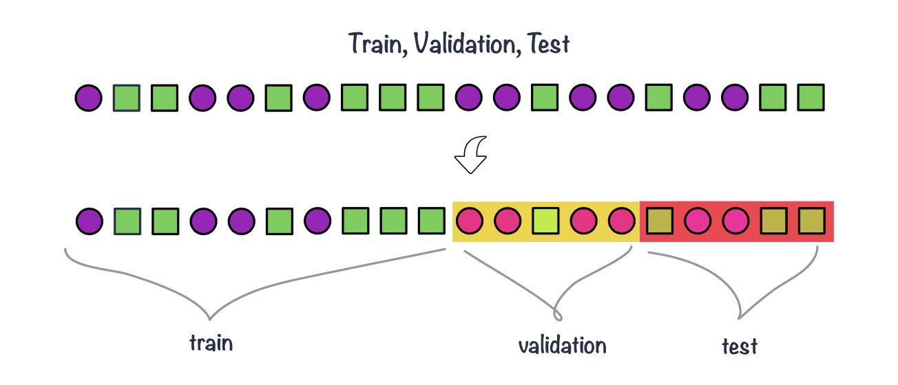
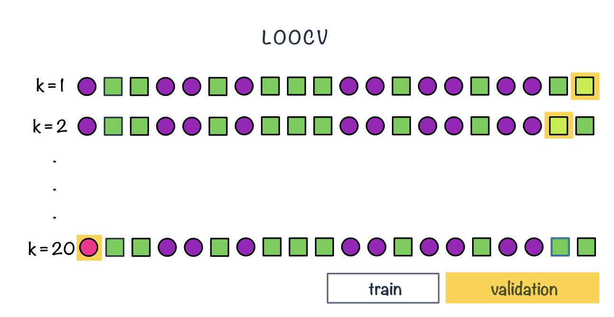

## Inference vs. prediction
*Inference*
<br> <br>


- So far, we have mainly used statistical models for **inference** to learn about relationships in the data.

## Inference vs. prediction
*Prediction*
<br> <br>


- Another goal is **prediction**. Here, we use observed data to build a model that can predict the outcome for **new observations**. 

. . . 

::: incremental

- If the outcome is continuous, such as age or gene expression, we have a **regression task**. 
- If the outcome consists of categories, such as disease versus healthy, we have a **classification task**. 

:::

. . .

<br>

::: {.text-box-1}
Here, an important question is **how well the model performs on new, unseen data**.
:::


## What is supervised learning?
<br>

- In **supervised learning**, we use observations for which the outcome is already known to **train** a model. The measured variables are used as predictors, while the known outcome provides the **label** or target that we want the model to learn to predict.

```{r}
#| label: fig-supervised
#| fig-cap: "Illustration of supervised learning, where labelled data are used to train a model that can make predictions for new observations."
#| fig-width: 12
#| fig-height: 7

library(knitr)

include_graphics("images/supervised.png")

```

::: footer
:::


## Data splitting


<br><br>

::: incremental


- A model can often be made to fit the observed data very well. 

- If a model adapts too closely to the particular patterns, noise or peculiarities of the training data, it may fail to generalize to new observations - **overfitting**.

- To obtain a more realistic estimate of predictive performance, we separate the data used to train the model from the data used to evaluate it - **data splitting**.

:::


## Data splitting
*Train / validation / test*
<br>


```{r}
#| label: fig-data-split
#| fig-cap: Example of splitting data into train (50%), validation (25%) and test (25%) set
#| fig-cap-location: margin
#| fig-align: center
#| echo: false
#| out-width: 100%


```


## Data splitting
*Cross validation*
<br>

```{r}
#| label: fig-data-split-kfold
#| fig-cap: Example of k-fold cross validation split (k = 3)
#| fig-cap-location: margin
#| fig-align: center
#| echo: false
#| out-width: 100%
#| 
knitr::include_graphics("images/data-split-kfolds-02.png")
##Eva: k=1,2,3 look identical. Can the splits be indicated somehow, circle the validation fold or something similar? I see 20 different objects, so I would expect 6 or 7 objects in each validation set. Use 'validation set' and 'training set' instead of 'validation fold' etc.
```

## Data splitting
*Leave-one-out cross-validation*
<br>

```{r}
#| label: fig-data-split-loocv
#| fig-cap: Example of LOOCV, leave-one-out cross validation
#| fig-cap-location: margin
#| fig-align: center
#| echo: false
#| out-width: 100%


```


## Data splitting
*Nested cross-validation*
<br>

**Nested cross-validation** uses two cross-validation loops:

* The **outer cross-validation** is used to estimate how well the final modelling procedure performs on new data.
* The **inner cross-validation** is used to select or tune the model.

. . .

::: incremental
E.g., in **5-fold nested cross-validation**:

1. Split the data into 5 **outer folds**.
2. Keep one outer fold aside as the **test set**.
3. Use the remaining data as the outer **training set**.
4. Within this training set, perform another k-fold cross-validation to select the best model or hyperparameters.
5. Fit the selected model using all of the outer training data.
6. Evaluate its performance on the outer test set.
7. Repeat until every outer fold has been used once as the test set.
- The final estimate of predictive performance is obtained by summarizing performance across the **outer test folds**.

:::


# Evaluating regression and classification models

## Evaluating regression models
*prediction error*
<br><br>

For regression tasks, predictions are numeric:

$$
\hat{y}_i
$$

We compare each observed value with its predicted value:

$$
e_i = y_i - \hat{y}_i
$$


. . .

<br>

::: {.incremental}
- Smaller prediction errors mean better predictive performance.
- Errors should be evaluated on **validation/test data**, not only on training data.
- Good model fit does not always mean good prediction.
:::


## Evaluating regression models
*Common regression metrics*
<br><br>

**Mean Absolute Error**

$$
MAE = \frac{1}{N}\sum_{i=1}^{N}|y_i - \hat{y}_i|
$$

Average absolute prediction error, in the same units as the outcome.

. . .

<br>

**Root Mean Squared Error**

$$
RMSE = \sqrt{\frac{1}{N}\sum_{i=1}^{N}(y_i - \hat{y}_i)^2}
$$

Also in the same units, but gives more weight to large errors.


## Evaluating classification models
*Classification predictions*
<br><br>

Many classifiers do not directly give a class label.

They first give a **score** or **predicted probability**:

$$
P(Y = \text{positive})
$$

. . . 

::: {.incremental}
- Example: probability that a biopsy is malignant.
- To turn this into a class prediction, we choose a **threshold**.
- If the probability is above the threshold, predict **positive**.
:::

## Evaluating classification models
*Threshold-based metrics*
<br><br>

After choosing a threshold, we compare predicted classes with true labels.

|                     | Predicted positive | Predicted negative |
|---------------------|-------------------:|-------------------:|
| **Actual positive** | TP                 | FN                 |
| **Actual negative** | FP                 | TN                 |

::: {.incremental}
- **Accuracy**: overall proportion classified correctly.
- **Sensitivity**: among actual positives, how many did we find?
- **Specificity**: among actual negatives, how many did we correctly exclude?
:::

## Evaluating classification models
*ROC curve and AUC*
<br><br>


:::: {.columns}

::: {.column width="45%"}
Changing the threshold changes the classifier performance.

The **ROC curve** shows this trade-off across thresholds:

$$
\text{sensitivity vs. } 1 - \text{specificity}
$$

$$
\text{AUC} = \text{overall ability to distinguish classes}
$$
:::

::: {.column width="5%"}

:::

::: {.column width="45%"}

```{r}
#| label: fig-roc-example
#| fig-cap: "Example ROC curve. The curve shows sensitivity versus the false positive rate (1 - specificity) across different classification thresholds."
#| fig-width: 6
#| fig-height: 5
#| echo: false
#| warning: false
#| message: false

library(pROC)
library(ggplot2)

set.seed(123)

# Simulate true class labels
n <- 200
truth <- factor(
  sample(c("Negative", "Positive"), n, replace = TRUE),
  levels = c("Negative", "Positive")
)

# Simulate model scores:
# positive samples tend to receive higher scores
score <- ifelse(
  truth == "Positive",
  rbeta(n, shape1 = 5, shape2 = 3),
  rbeta(n, shape1 = 3, shape2 = 5)
)

# Calculate ROC curve
roc_obj <- roc(
  response = truth,
  predictor = score,
  levels = c("Negative", "Positive"),
  direction = "<",
  quiet = TRUE
)

auc_value <- auc(roc_obj)

# Extract sensitivity and specificity
roc_df <- data.frame(
  sensitivity = roc_obj$sensitivities,
  false_positive_rate = 1 - roc_obj$specificities
)

# Plot
ggplot(roc_df,
       aes(x = false_positive_rate, y = sensitivity)) +
  geom_line(linewidth = 1.5) +
  geom_abline(
    intercept = 0,
    slope = 1,
    linetype = "dashed"
  ) +
  annotate(
    "text",
    x = 0.65,
    y = 0.2,
    label = paste0("AUC = ", round(auc_value, 2)),
    size = 3
  ) +
  coord_equal() +
  labs(
    x = "False positive rate (1 - specificity)",
    y = "Sensitivity (true positive rate)"
  ) +
  theme_classic(base_size = 16)
```

:::

::::


# Linear machine-learning models

## Regularized linear models
*definition* <br><br>

::: incremental
-   Regularized regression expands on the regression by adding a **penalty term(s)** to **shrink the model coefficients** of less important features towards zero.
-   This can help to prevent overfitting and improve the accuracy of the predictive model.
-   Depending on the penalty added, we talk about **Ridge**, **Lasso** or **Elastic Nets regression**.
:::

## Regularized regression

*Ridge regression* <br>

-   Previously we saw that the least squares fitting procedure estimates model coefficients $\beta_0, \beta_1, \cdots, \beta_p$ using the values that minimize the residual sum of squares: $$RSS = \sum_{i=1}^{n} \left( y_i - \beta_0 - \sum_{j=1}^{p}\beta_jx_{ij} \right)^2$$

. . .

-   In **regularized regression** the coefficients are estimated by minimizing slightly different quantity. Specifically, in **Ridge regression** we estimate $\hat\beta^{L}$ that minimizes $$\sum_{i=1}^{n} \left( y_i - \beta_0 - \sum_{j=1}^{p}\beta_jx_{ij} \right)^2 + \lambda \sum_{j=1}^{p}\beta_j^2 = RSS + \lambda \sum_{j=1}^{p}\beta_j^2$$ {#eq-ridge}

where:

$\lambda \ge 0$ is a **tuning parameter** to be determined separately e.g. via cross-validation

## Regularized regression
*Ridge regression* <br> <br>

$$\sum_{i=1}^{n} \left( y_i - \beta_0 - \sum_{j=1}^{p}\beta_jx_{ij} \right)^2 + \lambda \sum_{j=1}^{p}\beta_j^2 = RSS + \lambda \sum_{j=1}^{p}\beta_j^2$$

<br><br>

@eq-ridge trades two different criteria:

-   lasso regression seeks coefficient estimates that fit the data well, by making RSS small
-   however, the second term $\lambda \sum_{j=1}^{p}\beta_j^2$, called **shrinkage penalty** is small when $\beta_1, \cdots, \beta_p$ are close to zero, so it has the effect of **shrinking** the estimates of $\beta_j$ towards zero.
-   the tuning parameter $\lambda$ controls the relative impact of these two terms on the regression coefficient estimates
    -   when $\lambda = 0$, the penalty term has no effect
    -   as $\lambda \rightarrow \infty$ the impact of the shrinkage penalty grows and the ridge regression coefficient estimates approach zero

## Regularized regression

*Ridge regression* <br>

```{r}
#| label: ridge-input-data
#| eval: true
#| echo: false
#| warning: false
#| message: false

library(tidyverse)
library(kableExtra)

# # define scale function
# scale_numeric <- function(x, na.rm = TRUE){
#   (x - mean(x, na.rm = na.rm)) / sd(x, na.rm)
#   }

# input data
input_diabetes <- read_csv("data/data-diabetes.csv")

# clean data
inch2cm <- 2.54
pound2kg <- 0.45
data_diabetes <- input_diabetes %>%
  mutate(height  = height * inch2cm / 100, height = round(height, 2)) %>% 
  mutate(waist = waist * inch2cm) %>% 
  mutate(weight = weight * pound2kg, weight = round(weight, 2)) %>%
  mutate(BMI = weight / height^2, BMI = round(BMI, 2)) %>%
  mutate(obese= cut(BMI, breaks = c(0, 29.9, 100), labels = c("No", "Yes"))) %>%
  mutate(diabetic = ifelse(glyhb > 7, "Yes", "No"), diabetic = factor(diabetic, levels = c("No", "Yes"))) %>%
  mutate(location = factor(location)) %>%
  mutate(frame = factor(frame)) %>%
  mutate(gender = factor(gender))

```

```{r}
#| label: ridge-run
#| warning: false
#| message: false
#| fig-cap: "Example of Ridge regression to model BMI using age, chol, hdl and glucose variables: model coefficients are plotted over a range of lambda values, showing how initially for small lambda values all variables are part of the model and how they gradually shrink towards zero for larger lambda values."
#| fig-cap-location: margin

library(glmnet)
library(latex2exp)

# select subset data
# and scale: since regression puts constraints on the size of the coefficient
data_input <- data_diabetes %>%
  dplyr::select(BMI, chol, hdl, age, stab.glu) %>% 
  na.omit() 
  
# fit ridge regression for a series of lambda values 
# note: lambda values were chosen by experimenting to show lambda effect on beta coefficient estimates
x <- model.matrix(BMI ~., data = data_input)
y <- data_input %>% pull(BMI)
model <- glmnet(x, y, alpha=0, lambda = seq(0, 100, 1))

# plot beta estimates vs. lambda
betas <- model$beta %>% as.matrix() %>% t()
data_plot <- tibble(data.frame(lambda = model$lambda, betas)) %>%
  dplyr::select(-"X.Intercept.") %>%
  pivot_longer(-lambda, names_to = "variable", values_to = "beta")

data_plot %>%
  ggplot(aes(x = lambda, y = beta, color = variable)) +
  geom_line(linewidth = 2, alpha = 0.7) + 
  theme_classic() +
  xlab(TeX("$\\lambda$")) + 
  ylab(TeX("Standardized coefficients")) + 
  scale_color_brewer(palette = "Set1") + 
  theme(legend.title = element_blank(), legend.position = "top", legend.text = element_text(size=12)) + 
  theme(axis.title = element_text(size = 12), axis.text = element_text(size = 10))

```

## Bias-variance trade-off
<br><br>

:::: {.columns}

::: {.column width="45%"}
Ridge regression can improve prediction by accepting a little more **bias** in exchange for lower **variance**.

::: {.incremental}
- **Bias**: error from a model that is too simple  
  → may miss real patterns  
  → **underfitting**

- **Variance**: error from a model that is too sensitive to the training data  
  → may capture noise  
  → **overfitting**

- Regularization reduces flexibility by shrinking coefficients  
  → often lower variance  
  → better prediction on new data
:::

$$
\text{prediction error} \approx \text{bias}^2 + \text{variance} + \text{irreducible error}
$$
:::

::: {.column width="5%"}
:::

::: {.column width="45%"}

```{r}
#| label: fig-bias-variance-new
#| fig-cap: "Bias-variance trade-off. Increasing model flexibility decreases bias but increases variance. Prediction error is minimized at an intermediate level of complexity."
#| fig-width: 8
#| fig-height: 5.5
#| echo: false

library(ggplot2)

x <- seq(0, 1, length.out = 200)

# Illustrative curves
bias2 <- 1.1 * exp(-3 * x) + 0.08
variance <- 0.08 + 0.75 * x^2
irreducible <- 0.12

test_error <- bias2 + variance + irreducible

df <- data.frame(
  flexibility = rep(x, 3),
  error = c(bias2, variance, test_error),
  component = factor(
    rep(c("Bias²", "Variance", "Test error"), each = length(x)),
    levels = c("Bias²", "Variance", "Test error")
  )
)

ggplot(df, aes(
  x = flexibility,
  y = error,
  linetype = component
)) +
  geom_line(linewidth = 1.4) +
  labs(
    x = "Model flexibility",
    y = "Error",
    linetype = NULL
  ) +
  scale_x_continuous(
    breaks = c(0, 1),
    labels = c("Low", "High")
  ) +
  theme_classic(base_size = 17) +
  theme(
    legend.position = "top"
  )
```


:::


::::

## Ridge vs. Lasso

In **Ridge** regression we minimize: $$\sum_{i=1}^{n} \left( y_i - \beta_0 - \sum_{j=1}^{p}\beta_jx_{ij} \right)^2 + \lambda \sum_{j=1}^{p}\beta_j^2 = RSS + \lambda \sum_{j=1}^{p}\beta_j^2$$ {#eq-ridge2} where $\lambda \sum_{j=1}^{p}\beta_j^2$ is also known as **L2** regularization element or $l_2$ penalty


<br>
<br>

In **Lasso** regression, that is Least Absolute Shrinkage and Selection Operator regression we change penalty term to absolute value of the regression coefficients: $$\sum_{i=1}^{n} \left( y_i - \beta_0 - \sum_{j=1}^{p}\beta_jx_{ij} \right)^2 + \lambda \sum_{j=1}^{p}|\beta_j| = RSS + \lambda \sum_{j=1}^{p}|\beta_j|$$ {#eq-lasso} where $\lambda \sum_{j=1}^{p}|\beta_j|$ is also known as **L1** regularization element or $l_1$ penalty

<br>


## Ridge vs. Lasso

::: columns
::: {.column width="50%"}
```{r}
#| label: ridge-input-data-02
#| eval: true
#| echo: false
#| warning: false
#| message: false

library(tidyverse)
library(kableExtra)

# # define scale function
# scale_numeric <- function(x, na.rm = TRUE){
#   (x - mean(x, na.rm = na.rm)) / sd(x, na.rm)
#   }

# input data
input_diabetes <- read_csv("data/data-diabetes.csv")

# clean data
inch2cm <- 2.54
pound2kg <- 0.45
data_diabetes <- input_diabetes %>%
  mutate(height  = height * inch2cm / 100, height = round(height, 2)) %>% 
  mutate(waist = waist * inch2cm) %>% 
  mutate(weight = weight * pound2kg, weight = round(weight, 2)) %>%
  mutate(BMI = weight / height^2, BMI = round(BMI, 2)) %>%
  mutate(obese= cut(BMI, breaks = c(0, 29.9, 100), labels = c("No", "Yes"))) %>%
  mutate(diabetic = ifelse(glyhb > 7, "Yes", "No"), diabetic = factor(diabetic, levels = c("No", "Yes"))) %>%
  mutate(location = factor(location)) %>%
  mutate(frame = factor(frame)) %>%
  mutate(gender = factor(gender))

```

```{r}
#| label: ridge-run-02
#| warning: false
#| message: false
#| fig-cap: "Example of Ridge regression to model BMI using age, chol, hdl and glucose variables: model coefficients are plotted over a range of lambda values, showing how initially for small lambda values all variables are part of the model and how they gradually shrink towards zero for larger lambda values."
#| fig-height: 8


library(glmnet)
library(latex2exp)

# select subset data
# and scale: since regression puts constraints on the size of the coefficient
data_input <- data_diabetes %>%
  dplyr::select(BMI, chol, hdl, age, stab.glu) %>% 
  na.omit() 
  
# fit ridge regression for a series of lambda values 
# note: lambda values were chosen by experimenting to show lambda effect on beta coefficient estimates
x <- model.matrix(BMI ~., data = data_input)
y <- data_input %>% pull(BMI)
model <- glmnet(x, y, alpha=0, lambda = seq(0, 100, 1))

# plot beta estimates vs. lambda
betas <- model$beta %>% as.matrix() %>% t()
data_plot <- tibble(data.frame(lambda = model$lambda, betas)) %>%
  dplyr::select(-"X.Intercept.") %>%
  pivot_longer(-lambda, names_to = "variable", values_to = "beta")

font_size <- 20
data_plot %>%
  ggplot(aes(x = lambda, y = beta, color = variable)) +
  geom_line(linewidth = 2, alpha = 0.7) + 
  theme_classic() +
  xlab(TeX("$\\lambda$")) + 
  ylab(TeX("Standardized coefficients")) + 
  scale_color_brewer(palette = "Set1") + 
  theme(legend.title = element_blank(), legend.position = "top", legend.text = element_text(size=font_size)) + 
  theme(axis.title = element_text(size = font_size), axis.text = element_text(size = font_size)) +
  theme(title = element_text(size = font_size)) + 
  ggtitle("Ridge")

```
:::

::: {.column width="50%"}
```{r}
#| label: lasso-run
#| warning: false
#| message: false
#| fig-cap: "Example of Lasso regression to model BMI using age, chol, hdl and glucose variables: model coefficients are plotted over a range of lambda values, showing how initially for small lambda values all variables are part of the model and how they gradually shrink towards zero and are also set to zero for larger lambda values."
#| fig-height: 8

library(glmnet)
library(latex2exp)

# select subset data
# and scale: since regression puts constraints on the size of the coefficient
data_input <- data_diabetes %>%
  dplyr::select(BMI, chol, hdl, age, stab.glu) %>% 
  na.omit() 
  
# fit ridge regression for a series of lambda values 
# note: lambda values were chosen by experimenting to show lambda effect on beta coefficient estimates
x <- model.matrix(BMI ~., data = data_input)
y <- data_input %>% pull(BMI)
model <- glmnet(x, y, alpha=1, lambda = seq(0, 2, 0.1))

# plot beta estimates vs. lambda
betas <- model$beta %>% as.matrix() %>% t()
data_plot <- tibble(data.frame(lambda = model$lambda, betas)) %>%
  dplyr::select(-"X.Intercept.") %>%
  pivot_longer(-lambda, names_to = "variable", values_to = "beta")

data_plot %>%
  ggplot(aes(x = lambda, y = beta, color = variable)) +
  geom_line(linewidth = 2, alpha = 0.7) + 
  theme_classic() +
  xlab(TeX("$\\lambda$")) + 
  ylab(TeX("Standardized coefficients")) + 
  scale_color_brewer(palette = "Set1") + 
  theme(legend.title = element_blank(), legend.position = "top", legend.text = element_text(size=font_size)) + 
  theme(axis.title = element_text(size = font_size), axis.text = element_text(size = font_size)) + 
  theme(title = element_text(size = font_size)) + 
  ggtitle("Lasso")

```
:::
:::

## Elastic Net

<br>

**Elastic Net** use both L1 and L2 penalties to try to find middle grounds by performing parameter shrinkage and variable selection. $$\sum_{i=1}^{n} \left( y_i - \beta_0 - \sum_{j=1}^{p}\beta_jx_{ij} \right)^2 + \lambda \sum_{j=1}^{p}|\beta_j| + \lambda \sum_{j=1}^{p}\beta_j^2 = RSS + \lambda \sum_{j=1}^{p}|\beta_j| + \lambda \sum_{j=1}^{p}\beta_j^2 $$ {#eq-elastic-net}

```{r}
#| label: elastic-net
#| warning: false
#| message: false
#| fig-cap: "Example of Elastic Net regression to model BMI using age, chol, hdl and glucose variables: model coefficients are plotted over a range of lambda values and alpha value 0.1, showing the changes of model coefficients as a function of lambda being somewhere between those for Ridge and Lasso regression."
#| fig-cap-location: margin

library(glmnet)
library(latex2exp)

# select subset data
# and scale: since regression puts constraints on the size of the coefficient
data_input <- data_diabetes %>%
  dplyr::select(BMI, chol, hdl, age, stab.glu) %>% 
  na.omit() 
  
# fit ridge regression for a series of lambda values 
# note: lambda values were chosen by experimenting to show lambda effect on beta coefficient estimates
x <- model.matrix(BMI ~., data = data_input)
y <- data_input %>% pull(BMI)
model <- glmnet(x, y, alpha=0.1, lambda = seq(0, 3, 0.05))

# plot beta estimates vs. lambda
betas <- model$beta %>% as.matrix() %>% t()
data_plot <- tibble(data.frame(lambda = model$lambda, betas)) %>%
  dplyr::select(-"X.Intercept.") %>%
  pivot_longer(-lambda, names_to = "variable", values_to = "beta")


data_plot %>%
  ggplot(aes(x = lambda, y = beta, color = variable)) +
  geom_line(linewidth = 2, alpha = 0.7) + 
  theme_classic() +
  xlab(TeX("$\\lambda$")) + 
  ylab(TeX("Standardized coefficients")) + 
  scale_color_brewer(palette = "Set1") + 
  theme(legend.title = element_blank(), legend.position = "top", legend.text = element_text(size=font_size)) + 
  theme(axis.title = element_text(size = font_size), axis.text = element_text(size = font_size))

```

## Elastic Net

*In R with `glmnet`* <br>

In the `glmnet` library we can fit Elastic Net by setting parameters $\alpha$. Under the hood `glmnet` minimizes a cost function: $$\sum_{i_=1}^{n}(y_i-\hat y_i)^2 + \lambda \left ( (1-\alpha) \sum_{j=1}^{p}\beta_j^2 + \alpha \sum_{j=1}^{p}|\beta_j|\right )$$ where:

-   $n$ is the number of samples
-   $p$ is the number of parameters
-   $\lambda$, $\alpha$ hyperparameters control the shrinkage

and: 

-  $\alpha = 0$ corresponds to Ridge regression
-  $\alpha=1$ this corresponds to Lasso regression
- $0 < \alpha < 1$ gives **Elastic Net regularization**, combining both L1 and L2 regularization terms


## Logistic Lasso
*Logistic regression + Lasso regularization*

<br>

. . . 


-   We estimate set of coefficients $\hat \beta$ that minimize the combined logistic loss function and the Lasso penalty:

$$
\left( \sum_{i=1}^n [y_i \log(p_i) + (1-y_i) \log(1-p_i)] \right) + \lambda \sum_{j=1}^p |\beta_j|
$$

where:

-   $y_i$ represents the binary outcome (0 or 1)
-   $p_i$ is the predicted probability of $y_i = 1$ given by the logistic model
-   $\lambda$ is the regularization parameter that controls the strength of the Lasso penalty
-   $n$ is the number of observations
-   $p$ is the number of predictors.


# Other ML algorithms out there

## Other ML algorithms out there

<br>


Regularized linear models are only one part of the supervised learning toolbox.

::: {.incremental}
- **Tree-based methods**  
  decision trees, random forests, gradient boosting

- **Distance-based methods**  
  k-nearest neighbours

- **Margin-based methods**  
  support vector machines

- **Neural networks**  
  flexible models for complex patterns
:::

<br>

## Other ML algorithms out there {.center}
<br><br><br><br>

The algorithms differ, but the workflow stays the same:
<br>

$$
\text{train} \rightarrow \text{tune} \rightarrow \text{evaluate on unseen data}
$$

# Let's do some exercises