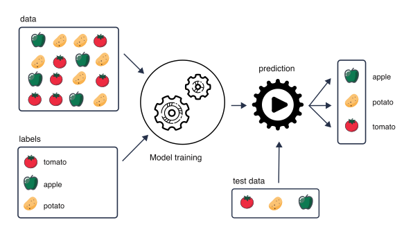
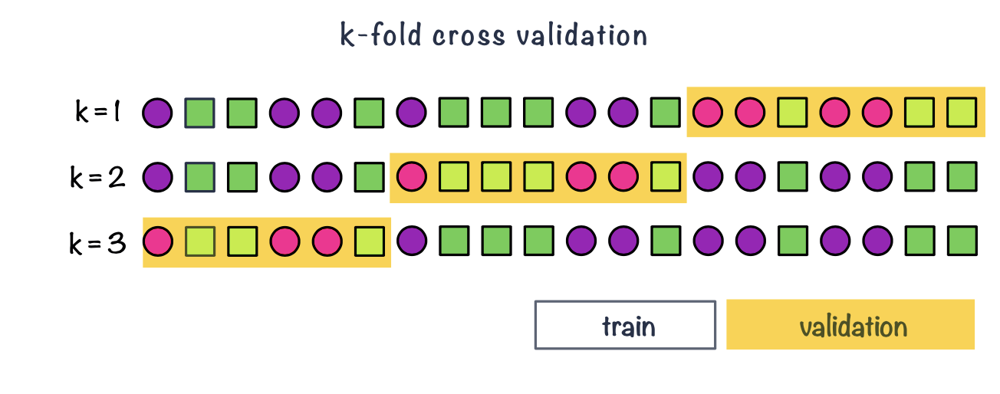

# From inference to prediction

So far, we have mainly used statistical models for **inference**: to learn about relationships in the data and to quantify the effects of explanatory variables on an outcome. For example, in a linear regression we may ask whether an outcome is associated with age, treatment or another variable, and estimate the size and uncertainty of these associations.

Another goal is **prediction**. Here, we use observed data to build a model that can predict the outcome for **new observations**. 

- If the outcome is continuous, such as age or gene expression, we have a **regression task**. 
- If the outcome consists of categories, such as disease versus healthy, we have a **classification task**. 

For example, we can train a model using biopsy images labelled as benign or malignant. Given an image from a new biopsy, the trained model can then predict whether it is benign or malignant (classification task).

Or we can train a model For example, we can start with DNA methylation measurements at thousands of CpG sites from individuals of known chronological age. During model building, we may select a subset of CpG sites that are useful for prediction. Given methylation measurements from a new individual, the trained model can then predict their age (regression task).

When prediction is our goal, an important question is therefore not only how well the model describes the data used to fit it, but **how well it performs on new, unseen data**.


## What is supervised learning?

In **supervised learning**, we use observations for which the outcome is already known to **train** a model. The measured variables are used as predictors, while the known outcome provides the **label** or target that we want the model to learn to predict.

This is in contrast to **unsupervised learning**, such as clustering or Principal Component Analysis (PCA), where there is no predefined outcome. Instead, the aim is to identify patterns or structure in the data, for example groups of samples with similar molecular profiles.

```{r}
#| label: fig-supervised
#| fig-cap: "Illustration of supervised learning, where labelled data are used to train a model that can make predictions for new observations."
#| fig-width: 12
#| fig-height: 7

library(knitr)


```

**Training** a model means using the observed data to estimate the model parameters so that the predictors are linked to the outcome. Depending on the type of outcome, this may be a **regression** or a **classification** task.

Once trained, the model can be used to make predictions for new observations.


## Data splitting

A model can often be made to fit the observed data very well. However, good performance on the data used to train the model does not necessarily mean that it will perform equally well on new data.

If a model adapts too closely to the particular patterns, noise or peculiarities of the training data, it may fail to generalize to new observations. This is known as **overfitting**.

To obtain a more realistic estimate of predictive performance, we therefore separate the data used to train the model from the data used to evaluate it. This is the basic idea behind data splitting.


### train, validation & test sets {.unnumbered}

-   Common split strategies include 50%/25%/25% and 33%/33%/33% splits for training/validation/test respectively
-   **Training data**: this is data used to fit (train) the classification or regression model, i.e. derive the classification rule
-   **Validation data**: this is data used to select which parameters or types of model perform best, i.e. to validate the performance of model parameters
-   **Test data**: this data is used to give an estimate of future prediction performance for the model and parameters chosen

```{r}
#| label: fig-data-split
#| fig-cap: Example of splitting data into train (50%), validation (25%) and test (25%) set
#| fig-cap-location: margin
#| fig-align: center
#| echo: false
#| out-width: 100%

knitr::include_graphics("images/data-split-02.png")
```

### cross validation {.unnumbered}

-   It can happen that despite random splitting in train/validation/test dataset one of the subsets does not represent data. e.g. gets all the difficult observation to classify.
-   Or that we do not have enough data in each subset after performing the split.
-   In **k-fold cross-validation** we split data into $k$ roughly equal-sized parts.
-   We start by setting the validation data to be the first set of data and the training data to be all other sets.
-   We estimate the validation error rate / correct classification rate for the split.
-   We then repeat the process $k-1$ times, each time with a different part of the data set to be the validation data and the remainder being the training data.
-   We finish with $k$ different error or correct classification rates.
-   In this way, every data point has its class membership predicted once.
-   The final reported error rate is usually the average of $k$ error rates.

```{r}
#| label: fig-data-split-kfold
#| fig-cap: Example of k-fold cross validation split (k = 3)
#| fig-cap-location: margin
#| fig-align: center
#| echo: false
#| out-width: 100%
#| 

##Eva: k=1,2,3 look identical. Can the splits be indicated somehow, circle the validation fold or something similar? I see 20 different objects, so I would expect 6 or 7 objects in each validation set. Use 'validation set' and 'training set' instead of 'validation fold' etc.
```


### Leave-one-out cross-validation {.unnumbered}

-   Leave-one-out cross-validation is a special case of cross-validation where the number of folds equals the number of instances in the data set.

```{r}
#| label: fig-data-split-loocv
#| fig-cap: Example of LOOCV, leave-one-out cross validation
#| fig-cap-location: margin
#| fig-align: center
#| echo: false
#| out-width: 100%

knitr::include_graphics("images/data-split-loocv-02.png")
```


### Nested cross-validation {.unnumbered}

**Nested cross-validation** uses two cross-validation loops:

* The **outer cross-validation** is used to estimate how well the final modelling procedure performs on new data.
* The **inner cross-validation** is used to select or tune the model.

For example, in **5-fold nested cross-validation**:

1. Split the data into 5 **outer folds**.
2. Keep one outer fold aside as the **test set**.
3. Use the remaining data as the outer **training set**.
4. Within this training set, perform another k-fold cross-validation to select the best model or hyperparameters.
5. Fit the selected model using all of the outer training data.
6. Evaluate its performance on the outer test set.
7. Repeat until every outer fold has been used once as the test set.

The final estimate of predictive performance is obtained by summarizing performance across the **outer test folds**.


## Evaluating regression

For regression tasks, the outcome is numeric and the prediction is a number:

$$
\hat{y}_i
$$

For each observation, we can compare the observed value $y_i$ with the predicted value $\hat{y}_i$. The difference between them is the prediction error:

$$
e_i = y_i - \hat{y}_i
$$

When we evaluate regression models, it is useful to distinguish between two related but different goals:

1. **Assessing model fit**: how well the model describes the data used to fit it.
2. **Assessing predictive performance**: how well the model predicts new, unseen observations.

In classical regression modelling, we often assess model fit using quantities such as R^2$, adjusted $R^2$, AIC or BIC. In prediction-focused modelling, however, we usually want to estimate the prediction error on data that were **not used to train the model**. This is why regression performance is often evaluated using a validation set, a test set, or cross-validation.

### Model fit {.unnumbered}

Measures of model fit summarize how well the model describes the observed data.

A familiar example is $R^2$, which measures the proportion of variation in the outcome that is explained by the model:

$$
R^2 = 1 - \frac{RSS}{TSS}
$$

where

$$
RSS = \sum_{i=1}^{n}(y_i - \hat{y}_i)^2
$$

and

$$
TSS = \sum_{i=1}^{n}(y_i - \bar{y})^2
$$

Adjusted $R^2$ adds a penalty for the number of predictors in the model:

$$
R_{adj}^2 = 1 - (1 - R^2)\frac{n-1}{n-p-1}
$$

where $n$ is the number of observations and \(p\) is the number of predictors.

This is useful because adding more predictors will usually increase \(R^2\), even if the additional predictors are not very useful. Adjusted $R^2$ therefore tries to balance goodness of fit against model complexity.

Other model comparison criteria include the **Akaike Information Criterion (AIC)** and the **Bayesian Information Criterion (BIC)**. For linear regression models with normally distributed errors, these can be written, up to constants, in terms of the residual sum of squares:

$$
AIC = n \log(RSS/n) + 2k
$$

$$
BIC = n \log(RSS/n) + k\log(n)
$$

where $k$ is the number of fitted parameters in the model.

Both AIC and BIC reward better fit but penalize model complexity. A lower AIC or BIC indicates a better balance between fit and complexity. BIC usually gives a stronger penalty for complexity than AIC, especially when the sample size is large.

However, these are still measures of model fit or model comparison. They do not directly tell us how well the model will predict future observations.

### Prediction error {.unnumbered}

When the goal is prediction, we usually evaluate the model on observations that were not used during training. These may come from a validation set, a test set, or cross-validation.

The most common regression metrics are based on the difference between observed and predicted values.

**Mean Squared Error (MSE)** is the average squared prediction error:

$$
MSE = \frac{1}{N}\sum_{i=1}^{N}(y_i - \hat{y}_i)^2
$$

Because errors are squared, large prediction errors receive a stronger penalty. However, the MSE is expressed in squared units, which can make it harder to interpret.

**Root Mean Squared Error (RMSE)** is the square root of the MSE:

$$
RMSE = \sqrt{\frac{1}{N}\sum_{i=1}^{N}(y_i - \hat{y}_i)^2}
$$

RMSE is in the same units as the outcome, which makes it easier to interpret. For example, if we are predicting age in years, RMSE is also measured in years.

**Mean Absolute Error (MAE)** is the average absolute prediction error:

$$
MAE = \frac{1}{N}\sum_{i=1}^{N}|y_i - \hat{y}_i|
$$

MAE is also in the same units as the outcome. Compared with RMSE, it is less strongly affected by large errors.

**Mean Absolute Percentage Error (MAPE)** expresses the error as a percentage of the observed value:

$$
MAPE = \frac{100}{N}\sum_{i=1}^{N}\left|\frac{y_i - \hat{y}_i}{y_i}\right|
$$

MAPE can be useful when percentage errors are easy to interpret. However, it is problematic when observed values are zero or close to zero.

### Which metric should we use? {.unnumbered}

There is no single best regression metric. The choice depends on the scientific question and on what type of error matters most.

- Use **RMSE** when large errors should be penalized strongly.
- Use **MAE** when you want an error measure that is easy to interpret and less sensitive to very large errors.
- Use **MAPE** only when percentage errors make sense and the outcome is not close to zero.
- Use \(R^2\) or adjusted \(R^2\) when you want to describe model fit, but be careful not to confuse good fit with good prediction.

For prediction, the key idea is that the metric should be calculated on data that were not used to train the model.

A model that fits the training data very well may still perform poorly on new data. Therefore, when our goal is prediction, we care most about the error on validation, test or cross-validation data.

## Evaluating classification

## Evaluating classification models

For a classification task, the outcome consists of two or more **classes** rather than a continuous value. For example, we may want to predict whether a tumour is **benign or malignant**, or whether a patient has **disease or no disease**.

To evaluate a classifier, we compare the **true class labels** with the classes predicted by the model.

Many binary classification models first produce a **score or probability** for belonging to the positive class. A classification threshold is then used to convert this value into a predicted class. For example, using a threshold of 0.5:

* predicted probability $\geq 0.5$ $\rightarrow$ predict positive
* predicted probability $< 0.5$ $\rightarrow$ predict negative

The choice of threshold affects the numbers of correct and incorrect classifications and therefore affects many classification performance metrics.

As for regression, predictive performance should ideally be evaluated using observations that were **not used to train the model**, for example using validation data, test data or cross-validation.

### Accuracy and misclassification rate {.unnumbered}

The simplest way to evaluate a classifier is to calculate the proportion of observations that were classified correctly.

For $N$ observations,

$$
Accuracy = \frac{\text{number of correct predictions}}{N}.
$$

For a binary classifier, this can be written as

$$
Accuracy = \frac{TP+TN}{TP+TN+FP+FN}.
$$

The **misclassification rate** is the proportion of incorrect predictions:

$$
Misclassification\ rate = 1 - Accuracy.
$$

Accuracy is easy to interpret, but it can be misleading when the classes are **imbalanced**.

For example, suppose only 5% of individuals have a disease. A classifier that predicts *no disease* for every individual would have an accuracy of 95%, despite being unable to identify any diseased individuals.

We therefore often need to examine performance separately for the positive and negative classes.

### Confusion matrix {.unnumbered}

A **confusion matrix** compares the true class labels with the predicted class labels.

For a binary classification task:

|                     |  Predicted positive |  Predicted negative |
| ------------------- | ------------------: | ------------------: |
| **Actual positive** |  True positive (TP) | False negative (FN) |
| **Actual negative** | False positive (FP) |  True negative (TN) |

The four possible outcomes are:

* **True positive (TP):** a positive observation is correctly classified as positive.
* **True negative (TN):** a negative observation is correctly classified as negative.
* **False positive (FP):** a negative observation is incorrectly classified as positive.
* **False negative (FN):** a positive observation is incorrectly classified as negative.

Several commonly used classification metrics can be calculated from these four quantities.

### Sensitivity {.unnumbered}

**Sensitivity** measures how well the classifier identifies observations that truly belong to the positive class:

$$
Sensitivity = \frac{TP}{TP+FN}.
$$

It answers the question:

> Of all observations that are truly positive, what proportion did the model identify correctly?

Sensitivity is also called the **true positive rate (TPR)** or **recall**.

A classifier with high sensitivity has relatively few **false negatives**.

For example, in disease detection, high sensitivity means that most individuals who truly have the disease are detected by the classifier.

### Specificity {.unnumbered}

**Specificity** measures how well the classifier identifies observations that truly belong to the negative class:

$$
Specificity = \frac{TN}{TN+FP}.
$$

It answers the question:

> Of all observations that are truly negative, what proportion did the model identify correctly?

Specificity is also called the **true negative rate (TNR)**.

A classifier with high specificity has relatively few **false positives**.

For example, in disease detection, high specificity means that most healthy individuals are correctly identified as healthy.

### Precision {.unnumbered}

**Precision** measures how many of the observations predicted to be positive are actually positive:

$$
Precision = \frac{TP}{TP+FP}.
$$

It answers the question:

> Of all observations predicted to be positive, what proportion are truly positive?

Precision is also known as the **positive predictive value (PPV)**.

A classifier with high precision makes relatively few **false-positive predictions**.

Sensitivity and precision therefore answer different questions:

* **Sensitivity:** among the actual positives, how many did we find?
* **Precision:** among the predicted positives, how many were actually positive?

### Classification thresholds {.unnumbered}

Sensitivity, specificity, precision and accuracy usually depend on the **classification threshold**.

For example, lowering the threshold for predicting the positive class will generally classify more observations as positive. This tends to:

* increase **sensitivity**, because fewer positive observations are missed;
* decrease **specificity**, because more negative observations may be incorrectly classified as positive.

Increasing the threshold usually has the opposite effect.

There is therefore often a **trade-off between sensitivity and specificity**, and the appropriate threshold depends on the scientific or clinical context.

For example, if missing a disease is particularly costly, we may prefer a lower threshold and prioritize high sensitivity. If false-positive results lead to costly or invasive follow-up procedures, specificity may be particularly important.

### ROC curve and ROC AUC {.unnumbered}

Rather than evaluating the classifier at only one threshold, we can examine its performance across many possible thresholds using the **Receiver Operating Characteristic (ROC) curve**.

The ROC curve plots:

$$
Sensitivity
$$

against

$$
1-Specificity
$$

for different classification thresholds.


```{r}
#| label: fig-roc-example
#| fig-cap: "Example ROC curve. The curve shows sensitivity versus the false positive rate (1 - specificity) across different classification thresholds."
#| fig-width: 6
#| fig-height: 5
#| echo: false
#| warning: false
#| message: false

library(pROC)
library(ggplot2)

set.seed(123)

# Simulate true class labels
n <- 200
truth <- factor(
  sample(c("Negative", "Positive"), n, replace = TRUE),
  levels = c("Negative", "Positive")
)

# Simulate model scores:
# positive samples tend to receive higher scores
score <- ifelse(
  truth == "Positive",
  rbeta(n, shape1 = 5, shape2 = 3),
  rbeta(n, shape1 = 3, shape2 = 5)
)

# Calculate ROC curve
roc_obj <- roc(
  response = truth,
  predictor = score,
  levels = c("Negative", "Positive"),
  direction = "<",
  quiet = TRUE
)

auc_value <- auc(roc_obj)

# Extract sensitivity and specificity
roc_df <- data.frame(
  sensitivity = roc_obj$sensitivities,
  false_positive_rate = 1 - roc_obj$specificities
)

# Plot
ggplot(roc_df,
       aes(x = false_positive_rate, y = sensitivity)) +
  geom_line(linewidth = 1.5) +
  geom_abline(
    intercept = 0,
    slope = 1,
    linetype = "dashed"
  ) +
  annotate(
    "text",
    x = 0.65,
    y = 0.2,
    label = paste0("AUC = ", round(auc_value, 2)),
    size = 5
  ) +
  coord_equal() +
  labs(
    x = "False positive rate (1 - specificity)",
    y = "Sensitivity (true positive rate)"
  ) +
  theme_classic(base_size = 16)
```

Thus, the ROC curve shows the trade-off between correctly identifying positive observations and incorrectly classifying negative observations as positive.

The **Area Under the ROC Curve (ROC AUC)** summarizes this curve using a single number.

ROC AUC ranges from 0 to 1:

* $AUC = 0.5$ corresponds approximately to random discrimination between the two classes.
* $AUC > 0.5$ indicates some ability to distinguish the classes.
* values closer to $1$ indicate better discrimination.
* $AUC = 1$ represents perfect discrimination.

Unlike accuracy, sensitivity or specificity at a particular threshold, ROC AUC summarizes the model's ability to **rank positive observations above negative observations across all possible thresholds**.

Importantly, a high ROC AUC does not automatically mean that a particular classification threshold will be useful in practice. The threshold and the resulting sensitivity, specificity and precision still need to be considered for the application.

### Which metric should we use? {.unnumbered}

There is no single best metric for every classification problem. The appropriate metric depends on the question and on the consequences of different types of errors.

* **Accuracy** gives the overall proportion of correct classifications, but can be misleading when classes are strongly imbalanced.
* **Sensitivity** is important when detecting as many positive observations as possible is the priority.
* **Specificity** is important when avoiding false-positive classifications is particularly important.
* **Precision** is useful when we want positive predictions themselves to be reliable.
* **ROC AUC** summarizes how well the model distinguishes between the classes across different classification thresholds.

As with regression, these metrics should be calculated using **held-out or cross-validation predictions** when the goal is to estimate performance on new data.


