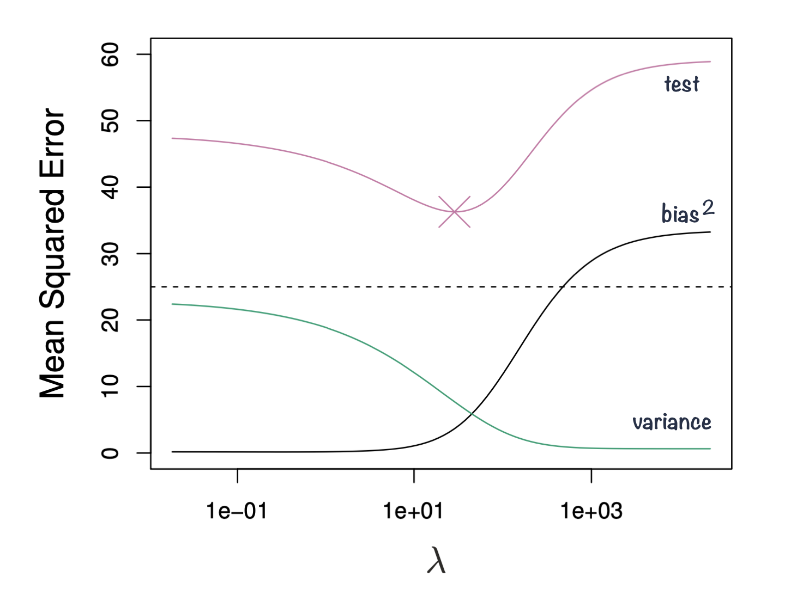

# Regularization

Linear models are widely used not only for inference, but also for prediction. In predictive modelling, we may have many potential predictors, and not all of them will necessarily contribute useful information about the outcome. Including irrelevant predictors can increase model complexity and may reduce performance on new data.

One way to address this is through feature selection or shrinkage methods, which aim to reduce the influence of less useful predictors. Here, we will focus on **regularized regression**, which extends the linear models we already know by adding a penalty to the model-fitting procedure. This leads to methods such as **Ridge regression, Lasso and Elastic Net**.

## Regularized regression

Regularized regression expands on the regression by adding a penalty term(s) to shrink the model coefficients of less important features towards zero. This can help to prevent overfitting and improve the accuracy of the predictive model. Depending on the penalty added, we talk about **Ridge**, **Lasso** or **Elastic Nets** regression.

Previously when talking about regression, we saw that the least squares fitting procedure estimates model coefficients $\beta_0, \beta_1, \cdots, \beta_p$ using the values that minimize the residual sum of squares: $$RSS = \sum_{i=1}^{n} \left( y_i - \beta_0 - \sum_{j=1}^{p}\beta_jx_{ij} \right)^2$$ {#eq-lm}

In **regularized regression** the coefficients are estimated by minimizing slightly different quantity. In **Ridge regression** we estimate $\hat\beta^{Ridge}$ that minimizes $$\sum_{i=1}^{n} \left( y_i - \beta_0 - \sum_{j=1}^{p}\beta_jx_{ij} \right)^2 + \lambda \sum_{j=1}^{p}\beta_j^2 = RSS + \lambda \sum_{j=1}^{p}\beta_j^2$$ {#eq-ridge}

where:

$\lambda \ge 0$ is a **tuning parameter** to be determined separately e.g. via cross-validation

@eq-ridge trades two different criteria:

-   as with least squares, Ridge regression seeks coefficient estimates that fit the data well, by making RSS small
-   however, the second term $\lambda \sum_{j=1}^{p}\beta_j^2$, called **shrinkage penalty** is small when $\beta_1, \cdots, \beta_p$ are close to zero, so it has the effect of **shrinking** the estimates of $\beta_j$ towards zero.
-   the tuning parameter $\lambda$ controls the relative impact of these two terms on the regression coefficient estimates
    -   when $\lambda = 0$, the penalty term has no effect
    -   as $\lambda \rightarrow \infty$ the impact of the shrinkage penalty grows and the ridge regression coefficient estimates approach zero

```{r}
#| label: ridge-input-data
#| eval: true
#| echo: false
#| warning: false
#| message: false

library(tidyverse)
library(kableExtra)

# # define scale function
# scale_numeric <- function(x, na.rm = TRUE){
#   (x - mean(x, na.rm = na.rm)) / sd(x, na.rm)
#   }

# input data
input_diabetes <- read_csv("data/data-diabetes.csv")

# clean data
inch2cm <- 2.54
pound2kg <- 0.45
data_diabetes <- input_diabetes %>%
  mutate(height  = height * inch2cm / 100, height = round(height, 2)) %>% 
  mutate(waist = waist * inch2cm) %>% 
  mutate(weight = weight * pound2kg, weight = round(weight, 2)) %>%
  mutate(BMI = weight / height^2, BMI = round(BMI, 2)) %>%
  mutate(obese= cut(BMI, breaks = c(0, 29.9, 100), labels = c("No", "Yes"))) %>%
  mutate(diabetic = ifelse(glyhb > 7, "Yes", "No"), diabetic = factor(diabetic, levels = c("No", "Yes"))) %>%
  mutate(location = factor(location)) %>%
  mutate(frame = factor(frame)) %>%
  mutate(gender = factor(gender))

```

```{r}
#| label: ridge-run
#| warning: false
#| message: false
#| fig-cap: "Example of Ridge regression to model BMI using age, chol, hdl and glucose variables: model coefficients are plotted over a range of lambda values, showing how initially for small lambda values all variables are part of the model and how they gradually shrink towards zero for larger lambda values."
#| fig-cap-location: margin

library(glmnet)
library(latex2exp)

# select subset data
# and scale: since regression puts constraints on the size of the coefficient
data_input <- data_diabetes %>%
  dplyr::select(BMI, chol, hdl, age, stab.glu) %>% 
  na.omit() 
  
# fit ridge regression for a series of lambda values 
# note: lambda values were chosen by experimenting to show lambda effect on beta coefficient estimates
x <- model.matrix(BMI ~., data = data_input)
y <- data_input %>% pull(BMI)
model <- glmnet(x, y, alpha=0, lambda = seq(0, 100, 1))

# plot beta estimates vs. lambda
betas <- model$beta %>% as.matrix() %>% t()
data_plot <- tibble(data.frame(lambda = model$lambda, betas)) %>%
  dplyr::select(-"X.Intercept.") %>%
  pivot_longer(-lambda, names_to = "variable", values_to = "beta")

data_plot %>%
  ggplot(aes(x = lambda, y = beta, color = variable)) +
  geom_line(linewidth = 2, alpha = 0.7) + 
  theme_classic() +
  xlab(TeX("$\\lambda$")) + 
  ylab(TeX("Standardized coefficients")) + 
  scale_color_brewer(palette = "Set1") + 
  theme(legend.title = element_blank(), legend.position = "top", legend.text = element_text(size=12)) + 
  theme(axis.title = element_text(size = 12), axis.text = element_text(size = 10))

```

## Bias-variance trade-off

Ridge regression's advantages over least squares estimates stems from **bias-variance trade-off**, another fundamental concept in machine learning.

-   The bias-variance trade-off describes the relationship between model complexity, prediction accuracy, and the ability of the model to generalize to new data.
-   **Bias** refers to the error that is introduced by approximating a real-life problem with a simplified model. A high bias model is one that makes overly simplistic assumptions about the underlying data, resulting in *under-fitting* and poor accuracy.
-   **Variance** refers to the sensitivity of a model to fluctuations in the training data. A high variance model is one that is overly complex and captures noise in the training data, resulting in *overfitting* and poor generalization to new data.
-   The goal of machine learning is to find a model with **the right balance between bias and variance**, which can generalize well to new data.
-   The bias-variance trade-off can be visualized in terms of MSE, means squared error of the model. The **MSE** can be decomposed into: $$MSE(\hat\beta) := bias^2(\hat\beta) + Var(\hat\beta) + noise$$
-   The irreducible error is the inherent noise in the data that cannot be reduced by any model, while the bias and variance terms can be reduced by choosing an appropriate model complexity. The trade-off lies in finding the right balance between bias and variance that minimizes the total MSE.
-   In practice, this trade-off can be addressed by **regularizing the model**, selecting an appropriate model complexity, or by using ensemble methods that combine multiple models to reduce the variance (e.g. Random Forest). Ultimately, the goal is to find a model that is both accurate and generalizing.

```{r}
#| label: fig-bias-variance
#| fig-cap: Squared bias, variance and test mean squared error for ridge regression predictions on a simulated data as a function of lambda demonstrating bias-variance trade-off. Based on Gareth James et. al, A Introduction to statistical learning
#| fig-cap-location: margin
#| fig-align: center
#| echo: false
#| out-width: 100%


```

## Ridge, Lasso and Elastic Nets

In **Ridge** regression we minimize: $$\sum_{i=1}^{n} \left( y_i - \beta_0 - \sum_{j=1}^{p}\beta_jx_{ij} \right)^2 + \lambda \sum_{j=1}^{p}\beta_j^2 = RSS + \lambda \sum_{j=1}^{p}\beta_j^2$$ {#eq-ridge2} where $\lambda \sum_{j=1}^{p}\beta_j^2$ is also known as **L2** regularization element or $l_2$ penalty

In **Lasso** regression, that is Least Absolute Shrinkage and Selection Operator regression we change penalty term to absolute value of the regression coefficients: $$\sum_{i=1}^{n} \left( y_i - \beta_0 - \sum_{j=1}^{p}\beta_jx_{ij} \right)^2 + \lambda \sum_{j=1}^{p}|\beta_j| = RSS + \lambda \sum_{j=1}^{p}|\beta_j|$$ {#eq-lasso} where $\lambda \sum_{j=1}^{p}|\beta_j|$ is also known as **L1** regularization element or $l_1$ penalty

Lasso regression was introduced to help model interpretation. With Ridge regression we improve model performance but unless $\lambda = \infty$ all beta coefficients are non-zero, hence all variables remain in the model. By using $l_1$ penalty we can force some of the coefficients estimates to be exactly equal to 0, hence perform **variable selection**

```{r}
#| label: lasso-run
#| warning: false
#| message: false
#| fig-cap: "Example of Lasso regression to model BMI using age, chol, hdl and glucose variables: model coefficients are plotted over a range of lambda values, showing how initially for small lambda values all variables are part of the model and how they gradually shrink towards zero and are also set to zero for larger lambda values."
#| fig-cap-location: margin

library(glmnet)
library(latex2exp)

# select subset data
# and scale: since regression puts constraints on the size of the coefficient
data_input <- data_diabetes %>%
  dplyr::select(BMI, chol, hdl, age, stab.glu) %>% 
  na.omit() 
  
# fit ridge regression for a series of lambda values 
# note: lambda values were chosen by experimenting to show lambda effect on beta coefficient estimates
x <- model.matrix(BMI ~., data = data_input)
y <- data_input %>% pull(BMI)
model <- glmnet(x, y, alpha=1, lambda = seq(0, 2, 0.1))

# plot beta estimates vs. lambda
betas <- model$beta %>% as.matrix() %>% t()
data_plot <- tibble(data.frame(lambda = model$lambda, betas)) %>%
  dplyr::select(-"X.Intercept.") %>%
  pivot_longer(-lambda, names_to = "variable", values_to = "beta")

data_plot %>%
  ggplot(aes(x = lambda, y = beta, color = variable)) +
  geom_line(linewidth = 2, alpha = 0.7) + 
  theme_classic() +
  xlab(TeX("$\\lambda$")) + 
  ylab(TeX("Standardized coefficients")) + 
  scale_color_brewer(palette = "Set1") + 
  theme(legend.title = element_blank(), legend.position = "top", legend.text = element_text(size=12)) + 
  theme(axis.title = element_text(size = 12), axis.text = element_text(size = 10))

```

**Elastic Net** use both L1 and L2 penalties to try to find middle grounds by performing parameter shrinkage and variable selection. $$\sum_{i=1}^{n} \left( y_i - \beta_0 - \sum_{j=1}^{p}\beta_jx_{ij} \right)^2 + \lambda \sum_{j=1}^{p}|\beta_j| + \lambda \sum_{j=1}^{p}\beta_j^2 = RSS + \lambda \sum_{j=1}^{p}|\beta_j| + \lambda \sum_{j=1}^{p}\beta_j^2 $$ {#eq-elastic-net}

In the `glmnet` library we can fit Elastic Net by setting parameters $\alpha$. Actually, under the hood `glmnet` minimizes a cost function: $$\sum_{i_=1}^{n}(y_i-\hat y_i)^2 + \lambda \left ( (1-\alpha) \sum_{j=1}^{p}\beta_j^2 + \alpha \sum_{j=1}^{p}|\beta_j|\right )$$ where:

-   $n$ is the number of samples
-   $p$ is the number of parameters
-   $\lambda$, $\alpha$ hyperparameters control the shrinkage

When $\alpha = 0$ this corresponds to Ridge regression and when $\alpha=1$ this corresponds to Lasso regression. A value of $0 < \alpha < 1$ gives us **Elastic Net regularization**, combining both L1 and L2 regularization terms.

```{r}
#| label: elastic-net
#| warning: false
#| message: false
#| fig-cap: "Example of Elastic Net regression to model BMI using age, chol, hdl and glucose variables: model coefficients are plotted over a range of lambda values and alpha value 0.1, showing the changes of model coefficients as a function of lambda being somewhere between those for Ridge and Lasso regression."
#| fig-cap-location: margin

library(glmnet)
library(latex2exp)

# select subset data
# and scale: since regression puts constraints on the size of the coefficient
data_input <- data_diabetes %>%
  dplyr::select(BMI, chol, hdl, age, stab.glu) %>% 
  na.omit() 
  
# fit ridge regression for a series of lambda values 
# note: lambda values were chosen by experimenting to show lambda effect on beta coefficient estimates
x <- model.matrix(BMI ~., data = data_input)
y <- data_input %>% pull(BMI)
model <- glmnet(x, y, alpha=0.1, lambda = seq(0, 3, 0.05))

# plot beta estimates vs. lambda
betas <- model$beta %>% as.matrix() %>% t()
data_plot <- tibble(data.frame(lambda = model$lambda, betas)) %>%
  dplyr::select(-"X.Intercept.") %>%
  pivot_longer(-lambda, names_to = "variable", values_to = "beta")

data_plot %>%
  ggplot(aes(x = lambda, y = beta, color = variable)) +
  geom_line(linewidth = 2, alpha = 0.7) + 
  theme_classic() +
  xlab(TeX("$\\lambda$")) + 
  ylab(TeX("Standardized coefficients")) + 
  scale_color_brewer(palette = "Set1") + 
  theme(legend.title = element_blank(), legend.position = "top", legend.text = element_text(size=12)) + 
  theme(axis.title = element_text(size = 12), axis.text = element_text(size = 10))

```


## Logistic Lasso

- Logistic Lasso combines logistic regression with Lasso regularization to analyze binary outcome data while simultaneously performing variable selection and regularization. 
- The equation for Logistic Lasso combines logistic regression with Lasso regularization. We estimate set  of coefficients $\hat \beta$ that minimize the combined logistic loss function and the Lasso penalty: 

$$
\left( \sum_{i=1}^n [y_i \log(p_i) + (1-y_i) \log(1-p_i)] \right) + \lambda \sum_{j=1}^p |\beta_j|
$$

where:

- $y_i$ represents the binary outcome (0 or 1) for the \( i \)-th observation.
- $p_i$ is the predicted probability of $y_i = 1$ given by the logistic model $p_i = \frac{1}{1 + e^{-(\beta_0 + \beta_1 x_{i1} + \cdots + \beta_p x_{ip})}}$.
- $\beta_0, \beta_1, \ldots, \beta_p$ are the coefficients of the model, including the intercept $\beta_0$.
- $x_{i1}, \ldots, x_{ip}$ are the predictor variables for the $i$-th observation.
- $\lambda$ is the regularization parameter that controls the strength of the Lasso penalty $\lambda \sum_{j=1}^p |\beta_j|$, which encourages sparsity in the coefficients $\beta_j$ by shrinking some of them to zero.
- $n$ is the number of observations, and $p$ is the number of predictors.


