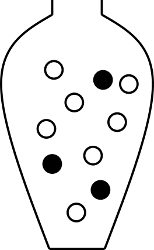

# Hypothesis testing using resampling

```{r setup, include=FALSE}
library(tidyverse)
library(ggplot2)
library(kableExtra)
options(digits=4)
```

The null distribution, that is, the sampling distribution of a test statistic under the null hypothesis, is sometimes known exactly or can be derived under a set of assumptions. When the null distribution is not known, it can often be estimated using resampling.

In this chapter, we consider three resampling-based approaches to hypothesis testing: simulation from a known null model, bootstrap, and permutation.

## Resampling from a known population under $H_0$

If it is possible to simulate sampling under the null hypothesis, resampling can be used to estimate the null distribution, just like we did in the previous chapter when estimating probabilities and probability distributions using resampling.

This is done by setting up a model under the null hypothesis (e.g. using an urn model) and drawing random samples from this model repeatedly.

::: {#exm-resamplingpollen}
### Proportions, pollen allergy

Let's assume we know that the proportion of people with pollen allergy in Sweden is $0.3$. We suspect that the number of people with pollen allergy has increased in Uppsala in the last couple of years and want to investigate this.

Observe 100 people from Uppsala, 42 of these were allergic to pollen. Is there a reason to believe that the proportion of people with pollen allergy in Uppsala $\pi > 0.3$?

##### Null and alternative hypotheses {.unnumbered}

$H_0:$ The proportion of people with pollen allergy in Uppsala is the same as in Sweden as a whole.

$H_1:$ The proportion of people with pollen allergy in Uppsala is greater than in Sweden as a whole.

or expressed differently:

$$H_0:\, \pi=\pi_0$$

$$H_1:\, \pi>\pi_0$$ where $\pi$ is the unknown proportion of pollen allergy in the Uppsala population and $\pi_0 = 0.3$ is the proportion of pollen allergy in Sweden.

##### Significance level {.unnumbered}

Here we let $\alpha = 0.05$.

##### Test statistic {.unnumbered}

Here we are interested in the proportion of people with pollen allergy in Uppsala. An appropriate test statistic could be the number of people with pollen allergy in a sample of size $n=100$, $X$. As an alternative we can use the proportion of people with pollen allergy in a sample of size $n$,

$$P = \frac{X}{n}$$

Let's use $P$ as our test statistic and compute the observed value, $p_{obs}$. In our sample of 100 people from Uppsala, the proportion of people with pollen allergy is $p_{obs}=42/100=0.42$.

##### Null distribution {.unnumbered}

The sampling distribution of $P$ under $H_0$ (i.e. when the null hypothesis is true) is what we call the null distribution.

$H_0$ states that $\pi=0.3$. We can model this using an urn model as follows;

```{r fig-pollenurn, echo=FALSE, fig.cap="An urn model of the null hypothesis $\\pi=0.3$. The black balls represent allergic and the white balls non-allergic.", out.width = "20%", fig.align="center"}

```

Using this model, we can simulate taking a sample of size 100 many times.

```{r sumpollenurn, echo=TRUE, message=FALSE}
## Urn
urn <- rep(c(0, 1), c(7, 3))
## Sample 100 times with replacement
x <- sample(urn, 100, replace=TRUE)
## Compute proportion of samples that are allergic (1)
mean(x)
## Set the seed to get the same result if we redo the analysis
set.seed(13)
## Repeat drawing sample of size 100 and computing proportion allergic 100000 times
p <- replicate(100000, mean(sample(rep(c(0, 1), c(7, 3)), 100, replace=TRUE)))
```

Plot the distribution

```{r fig-pollensampledistr, out.width="45%", fig.align="center", fig.cap="Estimated null distribution of the sample proportion under the null hypothesis."}
ggplot(data.frame(p=p), aes(x=p)) + geom_histogram(color="white", binwidth=0.02) + theme_bw()
```

##### Compute p-value {.unnumbered}

Compare the observed value, $p_{obs} = 0.42$ to the null distribution.

```{r fig-histpollennull, out.width="50%", fig.align="center", fig.cap="Estimated null distribution. The observed value is marked by a red vertical line."}
ggplot(data.frame(p=p), aes(x=p)) + geom_histogram(color="white", binwidth=0.02) + geom_vline(xintercept=0.42, color="red") + theme_bw()
```

The p-value is the probability of getting the observed value or higher, if the null hypothesis is true.

Use the null distribution to calculate the p-value, $P(P \geq 0.42 \mid H_0)$.

```{r pollenp, echo=TRUE, message=FALSE}
## How many times 
sum(p >= 0.42)
## p-value
pval <- mean(p >= 0.42)
```

p = $P(P \geq 0.42 \mid H_0)$ = `r format(pval, digits=4)`

##### Reject or fail to reject $H_0$? {.unnumbered}

As the p-value is $< \alpha = 0.05$ the null hypothesis is rejected. This means that we can conclude that there is reason to belive that the proportion of people with pollen allergy in Uppsala is greater than 0.3.

:::

## Bootstrap resampling

**Bootstrap** is a resampling technique that resamples with replacement from the available data (random sample) to construct new simulated samples. These bootstrap samples can be used to estimate the sampling distribution of a statistic. The estimated distribution is commonly used to estimate properties such as standard error and construct interval estimates, but can also be used to perform hypothesis testing.

We will get back to constructing bootstrap interval estimates in @sec-bootstrapinterval. Here we will focus on hypothesis testing using bootstrap.

To use the bootstrap for hypothesis testing, we first transform the observed sample so that it satisfies the null hypothesis, and then resample with replacement from this modified sample.

For a one sample test of mean, the hypotheses might be;

$$H_0: \mu=\mu_0$$
$$H_1: \mu>\mu_0$$

Let our observed sample of size $n$ be $x_1, x_2, \dots, x_n$. For simplicity, we use the sample mean, $\bar X$, as the test statistic, whose observed value is $m_{obs} = \bar x$.

To construct a sampling distribution when $H_0$ is true we would need a modified sample with mean $\mu_0$, which can be constructed by computing $x_i'=x_i-m_{obs} + \mu_0$. A null distribution can then be estimated using bootstrapping as follows;

1. Take a random sample of size $n$ with replacement from $x_1', x_2', \dots, x_n'$. Note that the same value might be selected more than once as we sample with replacement. Denote our bootstrap resample $x^*$.
2. Compute the mean value of the bootstrap resample $x^*$ and denote the mean $m^*$.

Repeating 1 and 2 many times, for example $B=1000$, yields a bootstrap estimate of the null distribution of sample means.

The p-value can be estimated as the number of times $m^* \geq m_{obs}$ divided by $B$

$$p = \frac{\sum_{k=1}^B I(m^*_k \geq m_{obs})}{B},$$

where $I(\cdot)$ is the indicator function.

::: {#exm-meanbootstrap}

### Mean value, bootstrap

Men with a waist circumference greater than 94 cm have been shown to have an increased risk of cardiovascular disease. Based on the following waist circumferences of 12 diabetic men, is there reason to believe that the mean waist circumference of diabetic men is greater than 94 cm?

```{r}
#| label: diabeteswaist12
#| message: false
diabetes <- read_csv("data/data-diabetes.csv")
set.seed (19383)
x <- round(sample(2.54*diabetes$waist, size=12))
```

`r paste(x, collapse=", ")`

```{r bootx, echo=TRUE}
x <- c(97, 97, 89, 84, 124, 107, 99, 122, 102, 114, 109, 84)
```


##### Null and alternative hypotheses {.unnumbered}

$$H_0: \mu=94$$
$$H_1: \mu>94$$

#### Significance level {.unnumbered}

Here we let $\alpha = 0.05$.

##### Test statistic {.unnumbered}

Here we will use the sample mean, $\bar X$, as test statistic.

The observed value of the test statistic is the mean of the observed sample values, $m_{obs} = \bar x$.

$m_{obs} = `r round(mean(x),1)`$

```{r mobs, echo=TRUE}
mobs <- mean(x)
```


#### Null distribution {.unnumbered}

Assume that $H_0$ is true and compute the **sampling distribution** of the sample mean $\bar X$. We will estimate the null distribution using bootstrap resampling.

First, modify the observed sample so that its mean is 94 cm, in accordance with the null hypothesis. This is done by subtracting the observed sample mean, $m_{obs}$, and adding 94 to the observations.

```{r xnull, echo=TRUE}
xnull <- x - mobs + 94
```

Resample with replacement to get a bootstrap sample of size 12 (same as the original sample) and compute the mean.

```{r echo=TRUE}
mean(sample(xnull, replace=TRUE))
```

Repeat 1000 times.

```{r}
#| label: mnull
#| echo: true
mnull <- replicate(1000, mean(sample(xnull, replace=TRUE)))
```

Plot the null distribution in a histogram and compare with the observed value $m_{obs}$.

```{r}
#| label: fig-bootmnull
#| fig-cap: "Null distribution of mean waist circumferences in cm. Observed mean is marked with a red vertical line."
#| echo: true
ggplot(data.frame(m=mnull), aes(x=m)) +
  geom_histogram(bins=25, color="white") +
  theme_bw() +
  geom_vline(xintercept=mobs, color="red")
```

#### Compute p-value

The p-value is the probability of seeing the observed value or something more extreme.

```{r bootp, echo=TRUE}
p <- mean(mnull>=mobs)
```

The computed p-value is `r format(p, digits=4)`. As the computed p-value $<\alpha=0.05$ the null hypothesis is rejected and we conclude that there is reason to believe that diabetic men have a mean waist circumference greater than 94 cm.

:::

### Permutation

Another resampling technique is permutation. A permutation test answers the question whether an observed effect could be explained simply by the random assignment of experimental units to groups under the null hypothesis. Permutation tests are commonly used in clinical settings where a treatment group is compared to a control group.

A permutation test involves comparing two (or more) groups, usually by computing the difference of a property of the two groups, e.g. a mean difference, where the null hypothesis is that there is no difference between the groups with respect to the variable of interest.

In a permutation test, the null distribution is computed by repeatedly permuting (rearranging) the observations so that they are randomly assigned to the two groups. This can be done either by keeping the group labels fixed and randomly reallocating the observed values between the groups, or equivalently by keeping the observed values fixed and randomly permuting the group labels. After each permutation, the test statistic (e.g. mean difference) is recomputed. Repeating this many times gives the null distribution of the test statistic under the null hypothesis.

The null distribution is a distribution of test statistics that could arise purely because of the random assignment to groups, assuming the null hypothesis is true. If the observed effect is much more extreme than what could be explained just by the randomization, we can conclude that there is a difference between the groups (the treatment has an effect).

::: {#exm-meanpermute}

### Does a high-fat diet lead to increased body weight?

The effect of high-fat diet on the body weight of mice is studied in an experiment. The study setup is as follows:

1.  24 female mice are ordered from a lab.
2.  Randomly, 12 of the 24 mice are assigned to receive high-fat diet, the remaining 12 are controls (ordinary diet).
3.  Body weight is measured after one week.

```{r mice, echo=FALSE, eval=FALSE}
## Full mouse population can be downloaded from
mp <- read.csv("https://raw.githubusercontent.com/genomicsclass/dagdata/master/inst/extdata/mice_pheno.csv")
## Select all female mice
pop.F <- mp %>% filter(Sex=="F")
## Select all the female mice on high fat diet
pop.F.hf <- (pop.F %>% filter(Diet=="hf"))[, "Bodyweight"]
## Select all the female mice on ordinary diet
pop.F.n <- (pop.F %>% filter(Diet=="chow"))[, "Bodyweight"]

## Select the seed so that we all get the same random mice!
set.seed(1)
## Select 12 HF mice
xHF <- round(sample(pop.F.hf, 12))
## Select 12 O mice
xN <- round(sample(pop.F.n, 12))
```

The observed values, mouse weights in grams, are summarized below;

```{r miceobs, echo=FALSE}
## 12 HF mice
xHF <- c(25, 30, 23, 18, 31, 24, 39, 26, 36, 29, 23, 32)
## 12 control mice
xN <- c(27, 25, 22, 23, 25, 37, 24, 26, 21, 26, 30, 24)
```

```{r}
kable(rbind("high-fat"=xHF, "ordinary"=xN), digits=1) %>% kable_styling(font_size=14)
```

##### Null and alternative hypotheses {.unnumbered}

$$
\begin{aligned}
H_0: \mu_{HF} = \mu_{N} \iff \mu_{HF} - \mu_{N} = 0\\
H_1: \mu_{HF}>\mu_{N} \iff \mu_{HF}-\mu_{N} > 0
\end{aligned}
$$

where $\mu_{HF}$ is the (unknown) mean body weight of the high-fat mouse population and $\mu_{N}$ is the mean body-weight of the control mouse population.

Studied population: Female mice that can be ordered from a lab.

##### Test statistic {.unnumbered}

Here we are interested in the mean difference between high-fat and control mice and an appropriate test statistic can be the mean difference, $D = \bar X_{HF} - \bar X_{N}$, where

-   $\bar X_{HF}$ is a random variable describing the mean weight of 12 (randomly selected) mice on high-fat diet. $E[\bar X_{HF}] = E[X_{HF}] = \mu_{HF}$
-   $\bar X_{N}$ is a random variable describing the mean weight of 12 (randomly selected) mice on ordinary diet. $E[\bar X_{N}] = E[X_{N}] = \mu_{N}$

The mean difference $D = \bar X_{HF} - \bar X_{N}$ is also a random variable.

Observed values;

```{r, echo=TRUE}
## 12 HF mice
xHF <- c(25, 30, 23, 18, 31, 24, 39, 26, 36, 29, 23, 32)
## 12 control mice
xN <- c(27, 25, 22, 23, 25, 37, 24, 26, 21, 26, 30, 24)

##Compute mean body weights of the two samples
mHF <- mean(xHF)
mN <- mean(xN) 
## Compute mean difference
dobs <- mHF - mN
```

Mean weight of sample control mice (ordinary diet): $\bar x_N = `r sprintf("%.2f", mN)`$

Mean weight of sample mice on high-fat diet: $\bar x_{HF} = `r sprintf("%.2f", mHF)`$

Difference in sample mean weights: $d_{obs} = \bar x_{HF} - \bar x_N = `r dobs`$

##### Null distribution {.unnumbered}

If high-fat diet has no effect, i.e. if $H_0$ was true, the result would be as if all mice were given the same diet. What can we expect if all mice are fed with the same type of food?

This can be done using permutation.

The 24 mice were initially from the same population, depending on how the mice are randomly assigned to the high-fat and normal group, the mean weights would differ, even if the two groups were treated the same.

Assume $H_0$ is true, i.e. assume all mice are exchangeable and

1.  Randomly reassign 12 of the 24 mice to 'high-fat' and the remaining 12 to 'control'.
2.  Compute difference in mean weights

If we repeat steps 1-2 many times, we get the null distribution of difference in mean weights.

```{r dnull, echo=TRUE, message=FALSE}
## All 24 body weights in a vector
x <- c(xHF, xN)
## Mean difference
dobs <- mean(x[1:12]) - mean(x[13:24])
## Permute once
y <- sample(x)
##Compute mean difference
mean(y[1:12]) - mean(y[13:24])
##Repeat the above many times
dnull.perm <- replicate(n = 100000, {
y <- sample(x)
##Mean difference
mean(y[1:12]) - mean(y[13:24])
})
```

Plot the null distribution and the observed difference.

```{r fig-permtest, fig.cap="Null distribution of the mean difference $D$.", out.width="50%"}
ggplot(data.frame(d=dnull.perm), aes(x=d)) +
geom_histogram(bins=25, color="white") +
theme_bw() +
geom_vline(xintercept=dobs, color="red")
##Alternatively plot using hist
## hist(dnull.perm)
```

##### Compute p-value {.unnumbered}

What is the probability to get an at least as extreme mean difference as our observed value, $d_{obs}$, if $H_0$ was true?

```{r micepval, echo=TRUE, message=FALSE}
## Compute the p-value
pval <- mean(dnull.perm>=dobs)
```

$$P(D \geq d_{obs} \mid H_0) = `r sprintf("%.3g",pval)`$$

##### Reject or fail to reject $H_0$? {.unnumbered}

As $`r format(pval, digits=3)`>0.05$, we fail to reject the null hypothesis. The data do not provide evidence that the high-fat diet increases body weight in mice.

:::
