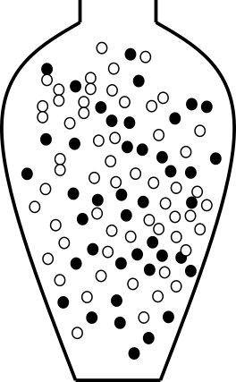

# Point and interval estimates {#sec-estimates}

```{r setup, include=FALSE}
library(tidyverse)
library(kableExtra)
library(ggforce)
```

## Point estimate

Unknown population parameters can be estimated from random samples drawn from the population of interest. A value computed from the sample can be used as a **point estimate**, that is, a single-number estimate of the population parameter.

An **estimator** is a random variable computed from the sample, whereas an **estimate** is its observed value for a particular sample.

::: {#exm-pollen-pointestimate}

# Pollen

If we are interested in the proportion of the Uppsala population that is allergic to pollen, we can investigate this by studying a random sample, e.g. by randomly selecting 100 people from Uppsala. It is important that the sample is actually random; ideally, every individual in the population should have the same probability of being selected.

In our sample, we observed that 42 of the 100 people have a pollen allergy. Hence, the observed sample proportion is $p=0.42$.

Based on this random sample, our point estimate of the Uppsala population proportion $\pi$ is $\pi \approx p = 0.42$. There is uncertainty in this estimate: if the sampling were repeated, a different random sample of 100 people would likely be selected, and the resulting point estimate would be slightly different.
:::

::: {#exm-meanweight}
# Weight

The mean weight of a mouse population, $\mu$, is unknown. By taking a sample of size $n$ and computing the mean weight of the mice in the sample, $\bar x$, we obtain a point estimate of the population mean.
:::

## Bias and precision

The sample proportion and sample mean are unbiased estimators of the corresponding population parameters. Although these estimators are unbiased, they still vary from sample to sample. In general, the variability decreases as the sample size increases.

An estimator is **unbiased** if its expected value equals the population parameter it is intended to estimate. This means that if the sampling was repeated many times and the estimator was computed each time, the average value of the estimator would equal the true population parameter.

```{r}
#| label: fig-biasprecision
#| fig-cap: "Bias and precision."
#| message: false
#| warning: false
#| echo: false
bias <- c(Biased=1.5, Unbiased=0)
precision= c(Precise=0.5, Unprecise=2)
df <- data.frame(B=rep(names(bias), each=2), P=rep(names(precision),2)) |> mutate(m=bias[B], s=precision[P]) |> group_by(B, P) |> reframe(x=rnorm(10, mean=m, sd=s), y=rnorm(10, mean=m, sd=s)) 

ggplot() + geom_point(data=df, aes(x=x, y=y, color=B, shape=P)) + facet_grid(B~P) + geom_circle(data=data.frame(x0=0, y0=0,r=1:6), aes(x0=x0,y0=y0,r=r)) + theme_classic() + theme(panel.grid=element_blank(), axis.ticks  = element_blank(), axis.text=element_blank(), legend.position = "none") + xlab("") + ylab("")
```

Even an unbiased estimator is not perfect; it will have a certain amount of uncertainty.

## Interval estimates

A point estimate gives a single best guess of the population parameter, whereas an interval estimate gives a range of plausible values and reflects the uncertainty due to sampling.

To show this uncertainty, an **interval estimate** for a population parameter can be computed instead of reporting only a point estimate. An interval estimate gives a range of plausible values for the population parameter, based on the observed sample. Interval estimation, just like point estimation, is a type of statistical inference.

The width of an interval estimate depends on the variability of the estimator, which is described by its sampling distribution. As seen before, there are different ways to estimate the sampling distribution.

### Bootstrap interval {#sec-bootstrapinterval}

If the sampling distribution of the statistic of interest is unknown, a bootstrap confidence interval can be computed instead.

**Bootstrapping** is performed by resampling with replacement from the available random sample. The resulting bootstrap distribution can then be used to calculate, for example, a 95% bootstrap interval.

This can be done as follows:

1.  Put the entire sample in an urn!
  
```{r pollenurn42, echo=FALSE, fig.cap="An urn model with 42 allergy (black) and 58 non-allergy (white). The black balls represent allergic and the white balls non-allergic.", out.width = "20%", fig.align="center"}

```

In R:

```{r}
#| echo: true
## the sample consists of 58 non-allergic (0) and 42 allergic (1).
x <- rep(0:1, c(58, 42))
```

2.  Sample from the urn with replacement to compute the bootstrap distribution.

```{r}
#| echo: true
pboot <- replicate(1000, mean(sample(x, replace=TRUE)))
```

```{r fig-boot, fig.cap="Bootstrap distribution.", out.width="45%", fig.align="center"}
#| echo: true
ggplot(data.frame(x=pboot), aes(x=x)) + geom_histogram(color="white", binwidth=0.02) + theme_bw() + xlab("p")
```

3.  Compute the 95% bootstrap interval. This can be done using the percentile method, by taking the 2.5th and 97.5th percentiles of the bootstrap distribution.

```{r calcCIboot}
#| echo: true
ciboot <- quantile(pboot, c(0.025, 0.975))
```

```{r fig-CIboot, fig.cap="Bootstrap distribution and the 95% bootstrap confidence interval.", out.width="45%", fig.align="center"}
ggplot(data.frame(x=pboot), aes(x=x, fill=x>ciboot[1] & x<ciboot[2])) + geom_histogram(color="white", binwidth=0.02) + theme_bw() + theme(legend.position="none") + xlab("p") + geom_line(data=data.frame(x=ciboot, y=50), aes(x=x, y=y), arrow=arrow(ends="both")) + annotate("label", x=mean(ciboot), y=50, label="95%")
```

The 95% bootstrap confidence interval for $\pi$ is \[`r ciboot`\].

### Confidence interval

A confidence interval is a type of interval estimate associated with a confidence level.

::: {#def-CI}
**A confidence interval for $\theta$ with confidence level $1 - \alpha$** is a method for constructing intervals such that, in repeated sampling, a proportion $1-\alpha$ of the intervals will contain the true population parameter $\theta$.
:::

```{r fig-CI95, fig.width=7, fig.height=3, fig.cap="A 95% confidence interval procedure gives intervals that cover the true value about 95% of the time."}
set.seed(13)
p <- replicate(100, mean(sample(0:1, 100, p=c(.7,.3), replace=TRUE)))
ggplot(data.frame(x=1:40, p=p[61:100]) %>% mutate(ymin=p-1.96*sqrt((p*(1-p))/100), ymax=p+1.96*sqrt((p*(1-p))/100)), aes(x=x, ymin=ymin, ymax=ymax, color=0.3>ymin & 0.3<ymax)) + geom_errorbar() + geom_hline(yintercept=0.3) + xlab("") + ylab("p") + theme_bw() + theme(legend.position="none")
```

If the sampling distribution of the statistic of interest is known, the confidence interval can be computed directly.

```{r fig-samplingdistr, out.width="50%", fig.cap="The sampling distribution of $theta$. The probability that an observation of $theta$ falls in the marked region is 0.95."}
w<-seq(-3.5,3.5,.01)
df.nwt <- data.frame(w=w, f=dnorm(w))
plot(ggplot(df.nwt, aes(x=w, y=f)) + geom_line() + theme_bw() + xlab("x") + ylab("f(x)") + geom_area(data=df.nwt %>% filter(abs(w)<qnorm(0.975))) + annotate("label",label=sprintf("95 %%"), x=0, y=0.1, hjust=0.5) + theme(panel.grid.minor = element_blank(), panel.grid.major.x = element_blank()))
```

### Confidence interval of proportions

The bootstrap is very useful if the sampling distribution of the statistic is unknown, but in our proportion example we already have an approximate sampling distribution.

From the central limit theorem, the sample proportion random variable $P$ is approximately normally distributed for sufficiently large $n$:

$$P \sim N\left(\pi, \frac{\pi(1-\pi)}{n}\right)$$

Its standard error is

$$SE = \sqrt{\frac{\pi(1-\pi)}{n}}.$$

It follows that

$$Z = \frac{P - \pi}{SE} \sim N(0,1).$$

Based on what we know about the standard normal distribution, we can compute an interval around the population proportion $\pi$ such that the probability that the sample proportion $P$ falls within this interval is $1-\alpha$:

$$P\left(-z_{\alpha/2} < \frac{P - \pi}{SE} < z_{\alpha/2}\right) = 1 - \alpha.$$

For a 95% confidence interval, $z_{0.025}=1.96$ (from a table of the standard normal distribution). Other confidence levels of interest include 90% ($z_{0.05}=1.64$) and 99% ($z_{0.005}=2.58$). In R, the function `qnorm` is used to compute $z_{\alpha/2}$:

```{r, echo=TRUE}
## 95% confidence interval, alpha=0.05
qnorm(1-0.05/2)
## 90% confidence interval, alpha=0.10
qnorm(1-0.10/2)
## 99% confidence interval, alpha=0.01
qnorm(1-0.01/2)
```

The inequality can be rewritten as

$$-z_{\alpha/2} < \frac{P-\pi}{SE}<z_{\alpha/2}
\iff P-z_{\alpha/2}SE \leq \pi \leq P + z_{\alpha/2}SE.$$

Hence,

$$P\left(P-z_{\alpha/2}SE < \pi < P + z_{\alpha/2}SE\right) = 1 - \alpha.$$

To get the observed confidence interval, replace the random variable $P$ with the observed sample proportion $p$ and replace the unknown standard error by its estimate.

The confidence interval can be expressed in different ways:

$$p-z_{\alpha/2} SE < \pi < p + z_{\alpha/2} SE$$

$$\pi = p \pm z_{\alpha/2} SE$$

$$(p - z_{\alpha/2} SE, p + z_{\alpha/2} SE)$$

The approximate 95% confidence interval is therefore

$$\pi = p \pm 1.96 \sqrt{\frac{p(1-p)}{n}}.$$

In repeated sampling, approximately 95% of 95% confidence intervals constructed in this way will contain the true population proportion.

```{r CIallergy, fig.width=7, fig.height=3}
set.seed(13)
p <- replicate(100, mean(sample(0:1, 100, p=c(.7,.3), replace=TRUE)))
ggplot(data.frame(x=1:40, p=p[61:100]) %>% mutate(ymin=p-1.96*sqrt((p*(1-p))/100), ymax=p+1.96*sqrt((p*(1-p))/100)), aes(x=x, ymin=ymin, ymax=ymax, color=0.3>ymin & 0.3<ymax)) + geom_errorbar() + geom_hline(yintercept=0.3) + xlab("") + ylab("p") + theme_bw() + theme(legend.position="none")
```

Back to our example of the proportion of people allergic to pollen in Uppsala. Here $p=0.42$ and

$$SE \approx \sqrt{\frac{p(1-p)}{n}} = `r sqrt(0.42*(1-0.42)/100)`.$$

Hence, the approximate 95% confidence interval is

$$\pi = 0.42 \pm 1.96 \cdot 0.05 = 0.42 \pm 0.092,$$

or equivalently

$$(0.42-0.092, 0.42+0.092) = (0.32, 0.52).$$

### Confidence interval of the mean

The confidence interval for a mean can be derived similarly.

If a sample of size $n$ consists of independent observations from a normal distribution,

$$X_i \sim N(\mu, \sigma^2),$$

then the sample mean is normally distributed:

$$\bar X \sim N\left(\mu, \frac{\sigma^2}{n}\right).$$

If $\sigma$ is unknown, the statistic

$$T = \frac{\bar X - \mu}{s/\sqrt{n}}$$

is t-distributed with $n-1$ degrees of freedom, in short $T \sim t(n-1)$.

It follows that

$$
P\left(-t_{\alpha/2,n-1} < \frac{\bar X - \mu}{S/\sqrt{n}} < t_{\alpha/2,n-1}\right) = 1 - \alpha
$$

which can be rewritten as

$$
P\left(\bar X - t_{\alpha/2,n-1}\frac{S}{\sqrt{n}} < \mu < \bar X + t_{\alpha/2,n-1}\frac{S}{\sqrt{n}}\right) = 1 - \alpha.
$$

Replacing the random quantities by their observed values gives the $1-\alpha$ confidence interval for $\mu$:

$$\bar x \pm t_{\alpha/2,n-1}\frac{s}{\sqrt{n}}.$$

The $t$ critical values for different confidence levels and degrees of freedom are tabulated and can be computed in R using the function `qt`.

For a 95% confidence interval, i.e. $\alpha=0.05$, and $n=5$, the critical value is `r qt(.975, df=4)` and can be computed using

```{r, echo=TRUE}
n=5
alpha = 0.05
## t value
qt(1-alpha/2, df=n-1)
```

