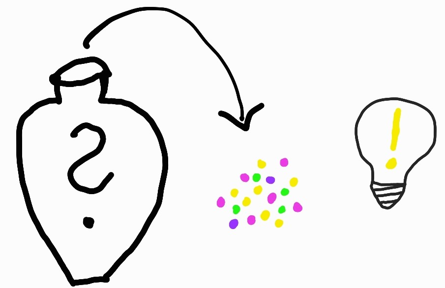

```{r, include=FALSE}
require(tidyverse)
require(ggplot2)
require(reshape2)
require(knitr)
require(kableExtra)
library(gt)
require(latex2exp)
knitr::opts_chunk$set(fig.width=3.5, fig.height=3.5, echo = FALSE, cache=TRUE, error=FALSE, warnings=FALSE, dpi=600)
options(digits=2)
```

## Introduction to hypothesis tests 

**Statistical inference** is to draw conclusions regarding properties of a population based on observations of a random sample from the population.

:::{.columns}
:::{.column width="7%"}

:::
:::{.column width="92%"}
A **hypothesis test** is a type of inference about evaluating if a hypothesis about a population is supported by the observations of a random sample (i.e by the data available).
:::
::::

Typically, the hypotheses that are tested are assumptions about properties of a population, such as proportion, mean, mean difference, variance etc.


{width=50% fig-align="center"}

## The null and alternative hypothesis 

::: {.columns}
::: {.column width="50%"}
### Null hypothesis, $H_0$

$H_0$ is in general neutral

* *no change*
* *no difference between groups*
* *no association*

In general we want to show that $H_0$ is false.

```{r H0box}
#| fig.width: 2.5
#| fig.height: 2.5
#| out.width: 50%
set.seed(123)
df <- data.frame(x=rnorm(100,30,5), group=sample(c("A", "B"), size = 100, replace=TRUE, prob=c(0.5, 0.5))) 
df |> ggplot(aes(x=group, y=x, color=group)) + geom_boxplot() + theme_bw() + xlab("Group") + ylab("") + theme(legend.position="none")
```

:::

::: {.column width="50%"}
:::{.fragment}

### Alternative hypothesis, $H_1$

$H_1$ expresses what the researcher is interested in 

* *the treatment has an effect*
* *there is a difference between groups*
* *there is an association*

The alternative hypothesis can also be directional

* *the treatment has a positive effect*

```{r H1box}
#| fig.width: 2.5
#| fig.height: 2.5
#| out.width: 50%
set.seed(123)
df1 <- df |> mutate(x=x+rnorm(nrow(df),c(A=15, B=0)[group],1))
df1 |> ggplot(aes(x=group, y=x, color=group)) + geom_boxplot() + theme_bw() + xlab("Group") + ylab("") + theme(legend.position="none")
```
:::
:::
::::

## To perform a hypothesis test

::: {.smaller style="font-size: 35px" .incremental}
1.  Define $H_0$ and $H_1$
2.  Select an appropriate significance level, $\alpha$

::: {.notes}
The significance level is the acceptable risk of false alarm, i.e. to say *"I have a hit"*, *"I found a difference"*, when the null hypothesis (*"there is no difference"*) is true.
:::

3.  Select appropriate test statistic, $T$, and compute the observed value, $t_{obs}$

::: {.notes}
For example the difference in means, the proportion of successes, the correlation coefficient etc.
:::

4.  Assume that the $H_0$ is true and compute the sampling distribution of $T$.

::: {.notes}
We will get back to the null distribution in the next slide
:::

5.  Compare the observed value, $t_{obs}$, with the computed sampling distribution under $H_0$ and compute a p-value. The p-value is the probability of observing a value at least as extreme as the observed value, if $H_0$ is true.
6.  Based on the p-value either reject or fail to reject $H_0$.
:::


## Null distribution

A **sampling distribution** is the distribution of a sample statistic. The sampling distribution can be obtained by drawing a large number of samples from a specific population.

The **null distribution** is a sampling distribution when the null hypothesis is true.

```{r examplenull, out.width="70%", fig.show="hold", fig.width=5, fig.align="center"}
x<-seq(-3,3,0.01)
df <- data.frame(x=x, f=dnorm(x, 0, 1))
plot(ggplot(df, aes(x=x, y=f)) + geom_line() + theme_bw() + xlab("x") + ylab("f(x)"))
```

## p-value

The p-value is the probability of the observed value, or something more extreme, if the null hypothesis is true.

```{r examplepval, out.width="70%", fig.align="center", fig.show="hold", fig.width=5, warning=FALSE}
pl <- ggplot(df, aes(x=x, y=f)) + geom_line() + theme_bw() + xlab("x") + ylab("f(x)") + geom_area(data=df %>% filter(x>1.5)) + annotate("label",label=TeX("P( X$\\geq$xobs )"), x=1.8, y=0.11, hjust=0)
plot(pl + scale_x_continuous(breaks=c(-2,0,1.5,2), labels=c("-2","0","xobs", "2")) + theme(panel.grid.minor = element_blank(), panel.grid.major.x = element_line(color = c("grey92", "grey92", NA, "grey92"))))
```

## p-value

The p-value is the probability of the observed value, or something more extreme, if the null hypothesis is true.

```{r examplepval2, out.width="70%", fig.align="center", fig.show="hold", fig.width=5, warning=FALSE}
pl <- pl + geom_area(data=df %>% filter(x<(-1.5))) + annotate("label",label=TeX("P(X$\\leq$-xobs)"), x=-1.8, y=0.11, hjust=1)
plot(pl + scale_x_continuous(breaks=c(-2,-1.5,0,1.5,2), labels=c("-2", "-xobs","0","xobs", "2")) +
     theme(panel.grid.minor = element_blank(),
              panel.grid.major.x = element_line(color = c("grey92", NA, "grey92", NA, "grey92"))))
```

## Error types {.auto-animate}

A hypothesis test is used to draw inference about a population based on a random sample. The inference made might of course be wrong. There are two types of errors;

::: {.fragment .fade-in}
**Type I error** is a false positive, a false alarm that occurs when $H_0$ is rejected when it is actually true. Examples: *"The test says that you are covid-19 positive, when you actually are not", "The test says that the drug has a positive effect on patient symptoms, but it actually has not"*.
:::

::: {.fragment .fade-in}
**Type II error** is a false negative, a miss that occurs when $H_0$ is not rejected, when it is actually false. Examples: *"The test says that you are covid-19 negative, when you actually have covid-19", "The test says that the drug has no effect on patient symptoms, when it actually has"*.
:::

## Probability of type I and II errors

The probability of type I and II errors are denoted $\alpha$ and $\beta$, respectively.


$$\alpha = P(\textrm{type I error}) = P(\textrm{false alarm}) = P(\textrm{Reject }H_0|H_0 \textrm{ is true})$$
$$\beta = P(\textrm{type II error}) = P(\textrm{miss}) = P(\textrm{Fail to reject }H_0|H_1 \textrm{ is true})$$

The significance level, $\alpha$, is the risk of false alarm.

:::{.notes}
On white board:

```{r}
kable(matrix(c("", "H0 is true", "H0 is false", "Fail to reject H0", "", "Type II error, miss", "Reject H0", "Type I error, false alarm", ""), byrow=F, ncol=3)) %>% kable_styling(full_width = FALSE, bootstrap_options = "bordered", position="center")
```
:::


## Probability of type I and II errors

```{r}
#| label: figalpha
#| fig-cap: "The probability density functions under H0. The probability of type I error ($\\alpha$)is indicated."
#| fig-width: 5
x<-seq(-3,6,0.01)
d <- 2.5
q=qnorm(0.975)
df <- data.frame(x=x, h=rep(c("H0", "H1"), each=length(x))) |> mutate(m=c(H0=0, H1=d)[h], f=dnorm(x, m, 1))
ggplot(df |> filter(h=="H0"), aes(x=x, y=f, color=h, fill=h)) + geom_line()  + geom_area(data=df %>% filter(x>q, h=="H0"), alpha=0.5) + xlab("x") + ylab("f(x)") + theme_bw() + scale_color_manual("", guide="none", values=c("black", "orange")) + scale_fill_manual("", guide="none", values=c("black", "orange")) + annotate("label", x=-1, y=dnorm(1,0,1), label="H0", color="black") + annotate("label", x=2.2, y=0.02, label="alpha", parse=TRUE) + geom_vline(xintercept=q) + annotate("text", x=q, y=0.25, label="Significance threshold", vjust=0, angle=90)
```
## Probability of type I and II errors

```{r}
#| label: figalphabeta
#| fig-cap: "The probability density functions under H0 and H1, respectively. The probability  of type I error ($\\alpha$) and type II error ($\\beta$) are indicated."
#| fig-width: 5
x<-seq(-3,6,0.01)
d <- 2.5
q=qnorm(0.975)
df <- data.frame(x=x, h=rep(c("H0", "H1"), each=length(x))) |> mutate(m=c(H0=0, H1=d)[h], f=dnorm(x, m, 1))
ggplot(df, aes(x=x, y=f, color=h, fill=h)) + geom_line()  + geom_area(data=df %>% filter(x>q, h=="H0"), alpha=0.5)  + geom_area(data=df %>% filter(x<q, h=="H1"), alpha=0.5) + xlab("x") + ylab("f(x)") + theme_bw() + scale_color_manual("", guide="none", values=c("black", "orange")) + scale_fill_manual("", guide="none", values=c("black", "orange")) + annotate("label", x=d+1, y=dnorm(1,0,1), label="H1", color="orange") + annotate("label", x=-1, y=dnorm(1,0,1), label="H0", color="black") + annotate("label", x=2.2, y=0.02, label="alpha", parse=TRUE) + annotate("label", x=1.2, y=0.08, label="beta", parse=TRUE, color="orange") + geom_vline(xintercept=q)
```

:::{.notes}
The risk of false alarm is controlled by setting the significance level to a desired value. We do want to keep the risk of false alarm (type I error) low, but at the same time we don't want many missed hits (type II error).
:::


## Significance level

The **significance level**, $\alpha$, is the risk of false alarm.

$\alpha$ should be set before the hypothesis test is performed. 

Common values to use are $\alpha=0.05$ or 0.01.


* If the p-value is above the significance level, $p>\alpha$, $H_0$ is not rejected.
* If the p-value is below the significance level, $p \leq \alpha$, $H_0$ is rejected.


## Statistical power

**Statistical power** is defined as

$$\textrm{power} = 1 - \beta = P(\textrm{Reject }H_0 | H_1\textrm{ is true}).$$


```{r}
x<-seq(-3,6,0.01)
d <- 2.5
q=qnorm(0.975)
df <- data.frame(x=x, h=rep(c("H0", "H1"), each=length(x))) |> mutate(m=c(H0=0, H1=d)[h], f=dnorm(x, m, 1))
ggplot(df, aes(x=x, y=f, color=h, fill=h)) + geom_line()  + geom_area(data=df %>% filter(x>q, h=="H1"), alpha=0.5) + xlab("x") + ylab("f(x)") + theme_bw() + scale_color_manual("", guide="none", values=c("black", "orange")) + scale_fill_manual("", guide="none", values=c("black", "orange")) + annotate("label", x=d+1, y=dnorm(1,0,1), label="H1", color="orange") + annotate("label", x=-1, y=dnorm(1,0,1), label="H0", color="black") + annotate("label", x=3, y=0.13, label="power", parse=TRUE, color="orange") + geom_vline(xintercept=q)
```

## Hypothesis testing using resampling

The null distribution, the sampling distribution of a test statistic under the null hypothesis, is sometimes known or can be approximated. When the null distribution is unknown, another option is to estimate the null distribution using resampling.

* Simulate from a known $H_0$
* Bootstrap
* Permutation

## Bootstrap

**Bootstrap** is a resampling technique that resamples with replacement from the available data (random sample) to construct new simulated samples.

Bootstrapping can be used to simulate a sampling distribution and estimate properties such as standard error and interval estimates, but also to perform hypothesis testing.


## Permutation

A permutation test answers the question whether an observed effect could be due only to the random sampling, how samples are assigned to different groups for example.

Permutation tests are commonly used in clinical settings where a treatment group is compared to a control group.

:::::{.columns}
::::{.column width="60%"}

:::{.fragment .fade-in}
```{r permdata,, fig.height=.3, fig.width=5}
set.seed(11)
df=data.frame(i=1:12,x=c(rnorm(6,27,5), rnorm(6, 22,5)), gr=rep(c("A", "B"), each=6), perm=0)
dfperm <- lapply(1:5, function(k) df |> mutate(x=sample(x), perm=k)) |> bind_rows()
df <- bind_rows(df, dfperm)
dfm <- df |> group_by(perm) |> summarize(mA=mean(x[gr=="A"]), mB=mean(x[gr=="B"]))|> mutate(diff=mA-mB)
df |> filter(perm==0) |> ggplot(aes(x=i, y=1, label=sprintf("%.1f",x), color=gr)) + geom_label() + theme_void() + theme(legend.position="none")
```
:::

:::{.fragment .fade-in}
Permute!

```{r perm, fig.height=1.4, fig.width=5}
dfperm |> ggplot(aes(x=i, y=perm, label=sprintf("%.1f",x), color=gr)) + geom_label() + theme_void() + theme(legend.position="none")
```
:::
::::

::::{.column width="30%"}
:::{.fragment .fade-in}
```{r}
gt(dfm)
```
:::
::::
:::::


:::{.notes}
In a permutation test the null distribution is computed by permuting (rearranging) the observations so that they are no longer associated to the outcome (e.g. group identity).

The null distribution is a distribution of test statistics that could be explained by the random sampling. If the observed effect is much more extreme than what could be explained just by the random sampling, we can conclude that there is a difference between the groups (the treatment has an effect).
:::

## Comparing means

:::{.notes}
Check lecture notes for other examples, e.g. comparing proportions.
:::

Three common situations where means are compared:

- **One sample**: compare the mean of a sample to a prespecified value
- **Two independent samples**: compare the means of two different groups
- **Paired samples**: compare two linked observations, for example before and after treatment in the same individual

These study designs lead to different hypothesis tests.

## Permutation example {auto-animate="true" auto-animate-easing="ease-in-out"}

**Do high fat diet lead to increased body weight?**

. . .

Study setup:

1.  Order 24 female mice from a lab.

::: r-hstack
```{r results="asis"}
set.seed(111)
n <- 12
xHF <- c(25, 30, 23, 18, 31, 24, 39, 26, 36, 29, 23, 32)
xN <- c(27, 25, 22, 23, 25, 37, 24, 26, 21, 26, 30, 24)
name <- paste0("mus", 1:(2*n))
o <- sample(1:(2*n))
#x <- c(xHF-rnorm(n, 5, 2), xN-rnorm(n, 2, 2))
x <- rnorm(2*n, 25, 3)
sc <- 4
for (i in o) {
  cat(sprintf('{width=%i data-id="%s"}', round(x[i]*sc), name[i]))
}
```

:::

## Permutation example {auto-animate="true" auto-animate-easing="ease-in-out"}

**Do high fat diet lead to increased body weight in mice?**

Study setup:

1.  Order 24 female mice from a lab.

2.  Randomly assign 12 of the 24 mice to receive high-fat diet, the remaining 12 are controls (ordinary diet).

::: {.columns}
::: {.column width="50%"}
High-fat diet

::: {r-vstack}
::: r-hstack
```{r results="asis"}
for (i in 1:4) {
  cat(sprintf('{width=%i data-id="%s"}', round(x[i]*sc), name[i])) 
}
```
:::
::: r-hstack
```{r results="asis"}
for (i in 5:8) {
  cat(sprintf('{width=%i data-id="%s"}', round(x[i]*sc), name[i])) 
}
```
:::
::: r-hstack
```{r results="asis"}
for (i in 9:12) {
  cat(sprintf('{width=%i data-id="%s"}', round(x[i]*sc), name[i])) 
}
```
:::
:::
:::
::: {.column width="50%"}
Ordinary diet

::: {r-vstack}
::: r-hstack
```{r results="asis"}
for (i in 13:16) {
  cat(sprintf('{width=%i data-id="%s"}\n', round(x[i]*sc), name[i])) 
}
```
:::
::: r-hstack
```{r results="asis"}
for (i in 17:20) {
  cat(sprintf('{width=%i data-id="%s"}\n', round(x[i]*sc), name[i])) 
}
```
:::
::: r-hstack
```{r results="asis"}
for (i in 21:24) {
  cat(sprintf('{width=%i data-id="%s"}\n', round(x[i]*sc), name[i])) 
}
```
:::
:::
:::
::::

## Permutation example {auto-animate="true" auto-animate-easing="ease-in-out"}

**Do high fat diet lead to increased body weight in mice?**

Study setup:

1.  Order 24 female mice from a lab.

2.  Randomly assign 12 of the 24 mice to receive high-fat diet, the remaining 12 are controls (ordinary diet).

::: {.columns}
::: {.column width="50%"}
High-fat diet

::: {r-vstack}
::: r-hstack
```{r results="asis"}
for (i in 1:4) {
  cat(sprintf('{width=%i data-id="%s"}', round(xHF[i]*sc), name[i]))
}
```
:::
::: r-hstack
```{r results="asis"}
for (i in 5:8) {
  cat(sprintf('{width=%i data-id="%s"}', round(xHF[i]*sc), name[i]))
}
```
:::
::: r-hstack
```{r results="asis"}
for (i in 9:12) {
  cat(sprintf('{width=%i data-id="%s"}', round(xHF[i]*sc), name[i]))
}
```
:::
:::
:::

::: {.column width="50%"}
Ordinary diet

::: {r-vstack}
::: r-hstack
```{r results="asis"}
for (i in 1:4) {
  cat(sprintf('{width=%i data-id="%s"}\n', round(xN[i]*sc), name[12+i]))
}
```
:::
::: r-hstack
```{r results="asis"}
for (i in 5:8) {
  cat(sprintf('{width=%i data-id="%s"}\n', round(xN[i]*sc), name[12+i]))
}
```
:::
::: r-hstack
```{r results="asis"}
for (i in 9:12) {
  cat(sprintf('{width=%i data-id="%s"}\n', round(xN[i]*sc), name[12+i]))
}
```
:::
:::
:::
::::

3.  Measure body weight after three weeks.

## Permutation example

**Do high fat diet lead to increased body weight in mice?**

Study setup:

1.  Order 24 female mice from a lab.

2.  Randomly assign 12 of the 24 mice to receive high-fat diet, the remaining 12 are controls (ordinary diet).

3.  Measure body weight after three weeks.

The observed values, mouse weights in grams, are summarized below;

```{r miceobs, echo=FALSE}
## 12 HF mice
xHF <- c(25, 30, 23, 18, 31, 24, 39, 26, 36, 29, 23, 32)
## 12 control mice
xN <- c(27, 25, 22, 23, 25, 37, 24, 26, 21, 26, 30, 24)
```

```{r}
kable(rbind("high-fat"=xHF, "ordinary"=xN), digits=1) %>% kable_styling()
```

## Permutation example

**1. Null and alternative hypotheses**

$$
\begin{aligned}
H_0: \mu_{HF} = \mu_{N} \iff \mu_{HF} - \mu_{N} = 0\\
H_1: \mu_{HF}>\mu_{N} \iff \mu_{HF}-\mu_{N} > 0
\end{aligned}
$$

where $\mu_{HF}$ is the (unknown) mean body weight of the high-fat mouse population and $\mu_{N}$ is the mean body-weight of the control mouse population.

Studied population: Female mice that can be ordered from a lab.

## Permutation example

**2. Select appropriate significance level** $\alpha$

$$\alpha = 0.05$$

## Permutation example

**3. Test statistic**

Of interest; the mean weight difference between high-fat and control mice 

$$D = \bar X_2 - \bar X_1$$

Mean weight of 12 (randomly selected) mice on ordinary diet, $\bar X_1$. $E[\bar X_1] = E[X_1] = \mu_1$

Mean weight of 12 (randomly selected) mice on high-fat diet, $\bar X_2$. $E[\bar X_2] = E[X_2] = \mu_2$

Observed values;

```{r, echo=FALSE}
## 12 HF mice
xHF <- c(25, 30, 23, 18, 31, 24, 39, 26, 36, 29, 23, 32)
## 12 control mice
xN <- c(27, 25, 22, 23, 25, 37, 24, 26, 21, 26, 30, 24)

##Compute mean body weights of the two samples
mHF <- mean(xHF)
mN <- mean(xN) 
## Compute mean difference
dobs <- mHF - mN
```

$\bar x_1 = `r sprintf("%.2f", mN)`$, mean weight of control mice (ordinary diet)

$\bar x_2 = `r sprintf("%.2f", mHF)`$, mean weight of mice on high-fat diet

$d_{obs} = \bar x_2 - \bar x_1 = `r dobs`$, difference in mean weights 

## Permutation example

**4. Null distribution**

If high-fat diet has no effect, i.e. if $H_0$ was true, the result would be as if all mice were given the same diet.

::: {.columns}
::: {.column width="50%"}
The 24 mice were initially from the same population, depending on how the mice are randomly assigned to high-fat and normal group, the mean weights would differ, even if the two groups were treated the same.

:::
::: {.column width="50%"}
```{r results="asis"}
sc <- 2
for (i in o) {
  cat(sprintf('{width=%i data-id="%s"}', round(c(xHF, xN)[i]*sc), name[i]))
}
```
:::
::::

## Permutation example

**4. Null distribution**

If high-fat diet has no effect, i.e. if $H_0$ was true, the result would be as if all mice were given the same diet.

::: {.columns}
::: {.column width="50%"}
The 24 mice were initially from the same population, depending on how the mice are randomly assigned to high-fat and normal group, the mean weights would differ, even if the two groups were treated the same.
:::
::: {.column width="50%"}
:::{.columns}
:::{.column width="40%"}
```{r results="asis"}
sc <- 2
o2 <- sample(o)
for (i in o2[1:12]) {
  cat(sprintf('{width=%i data-id="%s"}', round(c(xHF, xN)[i]*sc), name[i]))
}
```
:::
:::{.column width="40%"}
```{r results="asis"}
for (i in o2[13:24]) {
  cat(sprintf('{width=%i data-id="%s"}', round(c(xHF, xN)[i]*sc), name[i]))
}
```
:::
::::

:::
::::

## Permutation example

**4. Null distribution**

Random reassignment to two groups can be accomplished using permutation.

Assume $H_0$ is true, i.e. assume all mice are equivalent and

1.  Randomly reassign 12 of the 24 mice to 'high-fat' and the remaining 12 to 'control'.
2.  Compute difference in mean weights

If we repeat 1-2 many times we get the sampling distribution when $H_0$ is true, the so called null distribution, of difference in mean weights.

## Permutation example

**4. Null distribution**

```{r permtest, echo=FALSE, out.width="50%"}
## All 24 body weights in a vector
x <- c(xHF, xN)
## Mean difference
dobs <- mean(x[1:12]) - mean(x[13:24])

## Permute once
y <- sample(x)
##Compute mean difference
#mean(y[1:12]) - mean(y[13:24])
dnull.perm <- replicate(n = 100000, {
  y <- sample(x)
  ##Mean difference
  mean(y[1:12]) - mean(y[13:24])
})
ggplot(data.frame(d=dnull.perm), aes(x=d)) + geom_histogram(bins=25, color="white") + theme_bw() + geom_vline(xintercept=dobs, color="red")
##Alternatively plot using hist
## hist(dnull.perm)
```

## Permutation example

**5. Compute p-value**

What is the probability to get an at least as extreme mean difference as our observed value, $d_{obs}$, if $H_0$ was true?

```{r micepval, echo=FALSE, eval=FALSE}
## Compute the p-value
sum(dnull.perm>dobs)/length(dnull.perm)
mean(dnull.perm>dobs)
```

$P(\bar X_2 - \bar X_2 \geq d_{obs} | H_0) =$ `r sprintf("%.3g",mean(dnull.perm>=dobs))`

## Permutation example

**6. Conclusion?**


# Parametric tests

If the null distribution was already known (or could be computed based on a few assumptions) resampling would not be necessary.

## One sample, mean

A one sample test of means compares the mean of a sample to a prespecified value.

The hypotheses:

$$H_0: \mu = \mu_0 \\
H_1: \mu \neq \mu_0$$

The alternative hypothesis, $H_1,$ above is for the **two sided** hypothesis test.

Other options are the **one sided** alternatives;

::: {.r-stack}
* $H_1: \mu > \mu_0$ or
* $H_1: \mu < \mu_0$.
:::

## One sample, mean, mouse example

We know that the weight of a mouse on normal diet is normally distributed with mean 24.0 g and standard deviation 3.0 g. To investigate if body weight of mice is changed by high-fat diet, 10 mice are fed on high-fat diet for three weeks. The mean weight of the high-fat mice is 26.0 g, is there reason to believe that high fat diet affect mice body weight?

## One sample, mean, mouse example

The body weight of a mouse is $X \sim N(\mu, \sigma),$ where $\mu=24.0$ and $\sigma=3.0$

Hence, the mean weight of $n=10$ independent mice from the same population is  
$$\bar X \sim N\left(\mu, \frac{\sigma}{\sqrt{n}}\right).$$

## One sample, mean, mouse example

The body weight of a mouse is $X \sim N(\mu, \sigma),$ where $\mu=24.0$ and $\sigma=3$.

Hence, the mean weight of $n=10$ independent mice from the same population is  
$$\bar X \sim N\left(\mu, \frac{\sigma}{\sqrt{n}}\right).$$

An appropriate test statistic is 

$$Z = \frac{\bar X - \mu}{\frac{\sigma}{\sqrt{n}}}$$
If $\sigma$ is known, $Z\sim N(0,1)$.


## One sample t-test

For small $n$ and unknown $\sigma$, the test statistic

$$t = \frac{\bar X - \mu}{\frac{s}{\sqrt{n}}}$$

is t-distributed with $df=n-1$ degrees of freedom.

## Two samples, mean

A two sample test of means is used to determine if two population means are equal.

Two independent samples are collected (one from each population) and the means are compared. Can for example be used to determine if a treatment group is different compared to a control group, in terms of the mean of a property of interest.

The hypotheses;

$$H_0: \mu_2 = \mu_1\\
H_1: \mu_2 \neq \mu_1$$

The above $H_1$ is two-sided. One-sided alternatives could be
$$H_1: \mu_2 > \mu_1\\
\mathrm{or}\\
H_1: \mu_2 < \mu_1$$

## Two samples, mean

Assume that observations from both populations are normally distributed;

$$
\begin{aligned}
X_1 \sim N(\mu_1, \sigma_1) \\
X_2 \sim N(\mu_2, \sigma_2)
\end{aligned}
$$

Then it follows that the sample means will also be normally distributed;

$$
\begin{aligned}
\bar X_1 \sim N(\mu_1, \sigma_1/\sqrt{n_1}) \\
\bar X_2 \sim N(\mu_2, \sigma_2/\sqrt{n_2})
\end{aligned}
$$

The mean difference $D = \bar X_2 - \bar X_1$ is thus also normally distributed:

$$D = \bar X_2 - \bar X_1 = N\left(\mu_2-\mu_1, \sqrt{\frac{\sigma_2^2}{n_2} + \frac{\sigma_1^2}{n_1}}\right)$$

## Two samples, mean

If $H_0$ is true: $$D = \bar X_2 - \bar X_1 = N\left(0, \sqrt{\frac{\sigma_2^2}{n_2} + \frac{\sigma_1^2}{n_1}}\right)$$

The test statistic: $$Z = \frac{\bar X_2 - \bar X_1}{\sqrt{\frac{\sigma_2^2}{n_2} + \frac{\sigma_1^2}{n_1}}}$$ is standard normal, i.e. $Z \sim N(0,1)$.

However, note that the test statistic require the standard deviations $\sigma_1$ and $\sigma_2$ to be known.

<!-- --- -->

## Two samples, mean
### Unknown variances

What if the population standard deviations are not known?

## Two samples, mean
### Unknown variances, large sample sizes

If the sample sizes are large, we can replace the known standard deviations with our sample standard deviations and according to the central limit theorem assume that 

$$Z = \frac{\bar X_2 - \bar X_1}{\sqrt{\frac{s_2^2}{n_2} + \frac{s_1^2}{n_1}}} \sim N(0,1)$$

and proceed as before.

## Two samples, mean
### Unknown variances, small sample sizes

$$t = \frac{\bar X_2 - \bar X_1}{\sqrt{\frac{s_2^2}{n_2} + \frac{s_1^2}{n_1}}}$$
is t-distributed.

If equal variances can be assumed Student's t-test can be used otherwise Welch's t-test for unequal variances.

## Two samples, mean
### Unknown equal variances, small sample sizes

**Student's t-test**

Assume equal variances in the two populations and compute the pooled sample standard deviation;

$$
  s_p^2 = \frac{(n_1-1)s_1^2 + (n_2-1)s_2^2}{n_1+n_2-2}
$$
  
and the test statistic

$$t = \frac{\bar X_1 - \bar X_2}{\sqrt{s_p^2(\frac{1}{n_1} + \frac{1}{n_2})}},$$
  
which is t-distributed with $n_1+n_2-2$ degrees of freedom.

## Two samples, mean
### Unknown variances, small sample sizes

**Welch's t-test**

For unequal variances the following test statistic can be used;

$$t = \frac{\bar X_2 - \bar X_1}{\sqrt{\frac{s_2^2}{n_2} + \frac{s_1^2}{n_1}}}$$
$t$ is $t$-distributed and the degrees of freedom can be computed using Welch approximation.

Fortunately, the t-test is implemented in R, e.g. in the function `t.test` in the R-package `stats`. This function can compute both Student's t-test with equal variances and Welch's t-test with unequal variances.

## Paired samples

Sometimes two observations are naturally linked, rather than coming from two independent groups. This happens, for example, in before-and-after studies where the same subjects are measured twice, or in matched study designs.

Examples of paired data include:

- measurements before and after treatment in the same patient
- observations on matched case-control pairs

In a paired design, the analysis should take the pairing into account.

## Paired t-test

The null hypothesis in a paired analysis is that the mean within-pair difference is zero.

Let the paired observations be $(X_{i1}, X_{i2})$ and define the within-pair differences

$$D_i = X_{i2} - X_{i1}.$$

The hypotheses are

$$H_0: \mu_D = 0$$
$$H_1: \mu_D \neq 0$$

The paired t-test is simply a one-sample t-test applied to the differences $D_1, D_2, \dots, D_n$.

$$T = \frac{\bar D}{s_D/\sqrt{n}}$$

## Independent or paired?

::: {.columns}
::: {.column width="65%"}
| Study design | Typical question | Test |
|---|---|---|
| One sample | Is the mean different from a reference value? | One-sample t-test |
| Two independent groups | Do the two group means differ? | Two-sample t-test |
| Paired samples | Is the mean change/difference within pairs zero? | Paired t-test |
:::
::: {.column width="35%"}
The choice of test depends on the study design.
:::
::::

## Summary

- A hypothesis test compares an observed test statistic to a null distribution.
- The p-value is the probability of the observed value, or something more extreme, if $H_0$ is true.
- Resampling gives an intuitive way to construct a null distribution without relying on strong parametric distributional assumptions.
- Common mean-comparison tests are:
  - one-sample t-test
  - two-sample t-test
  - paired t-test
```