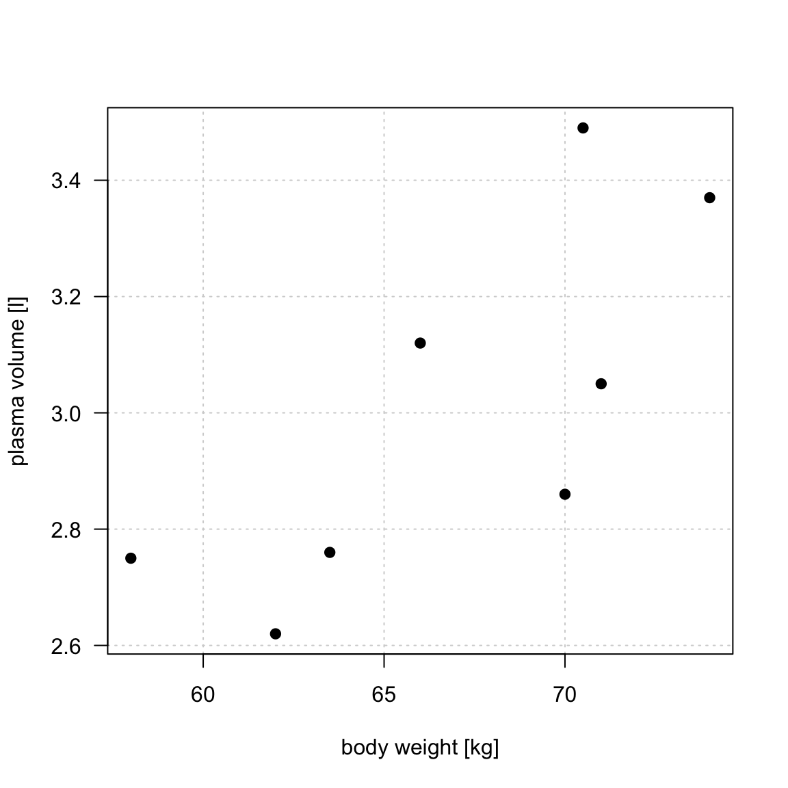
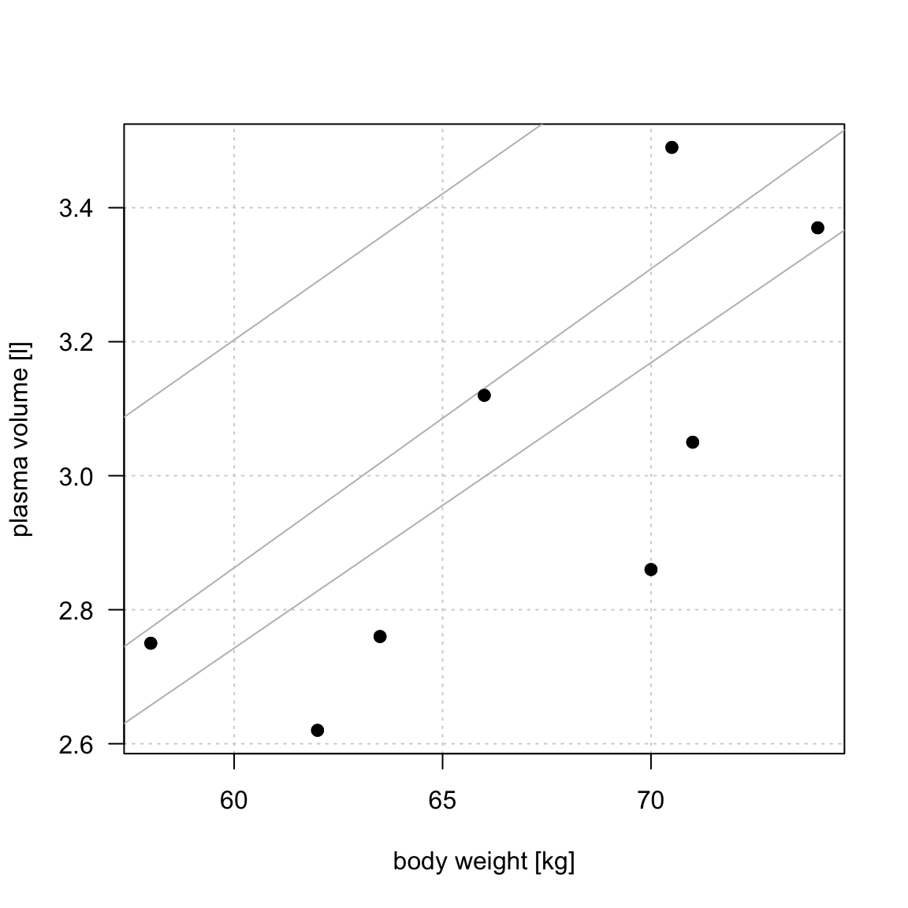
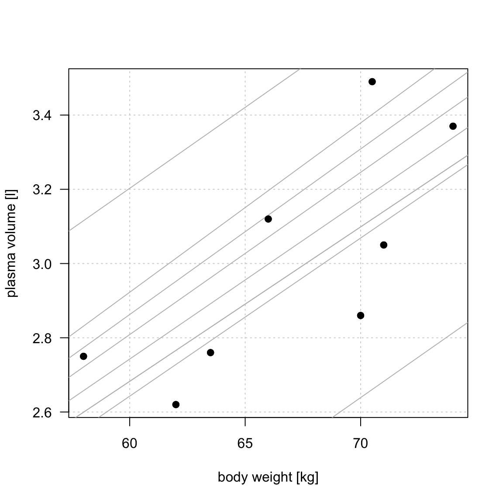
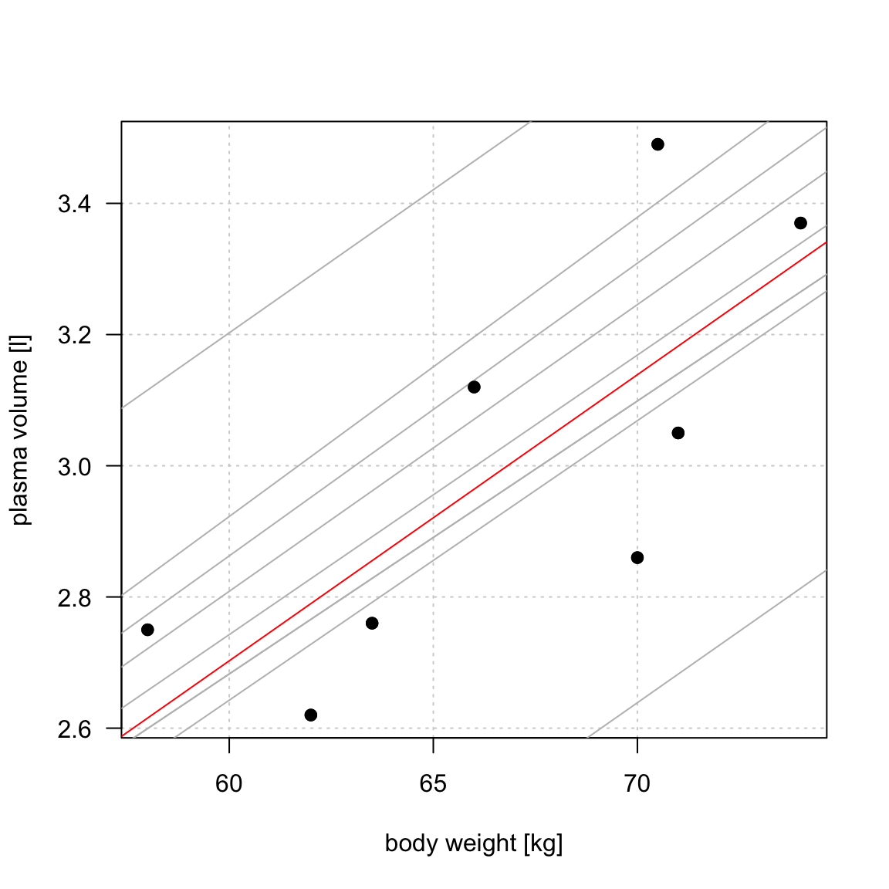
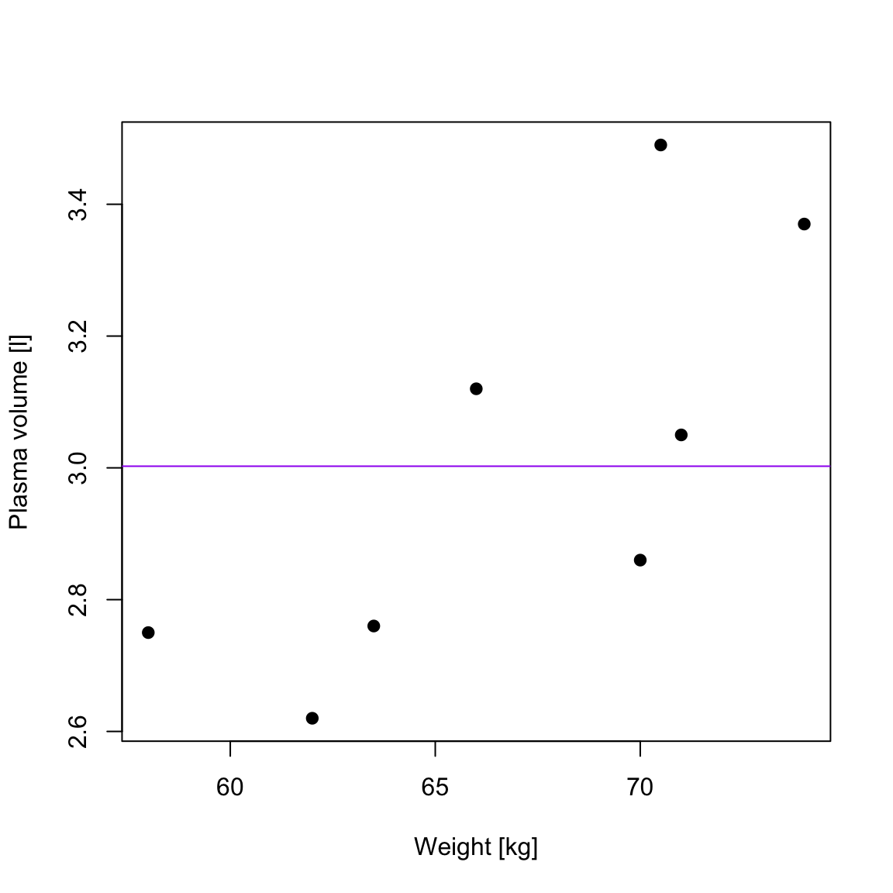
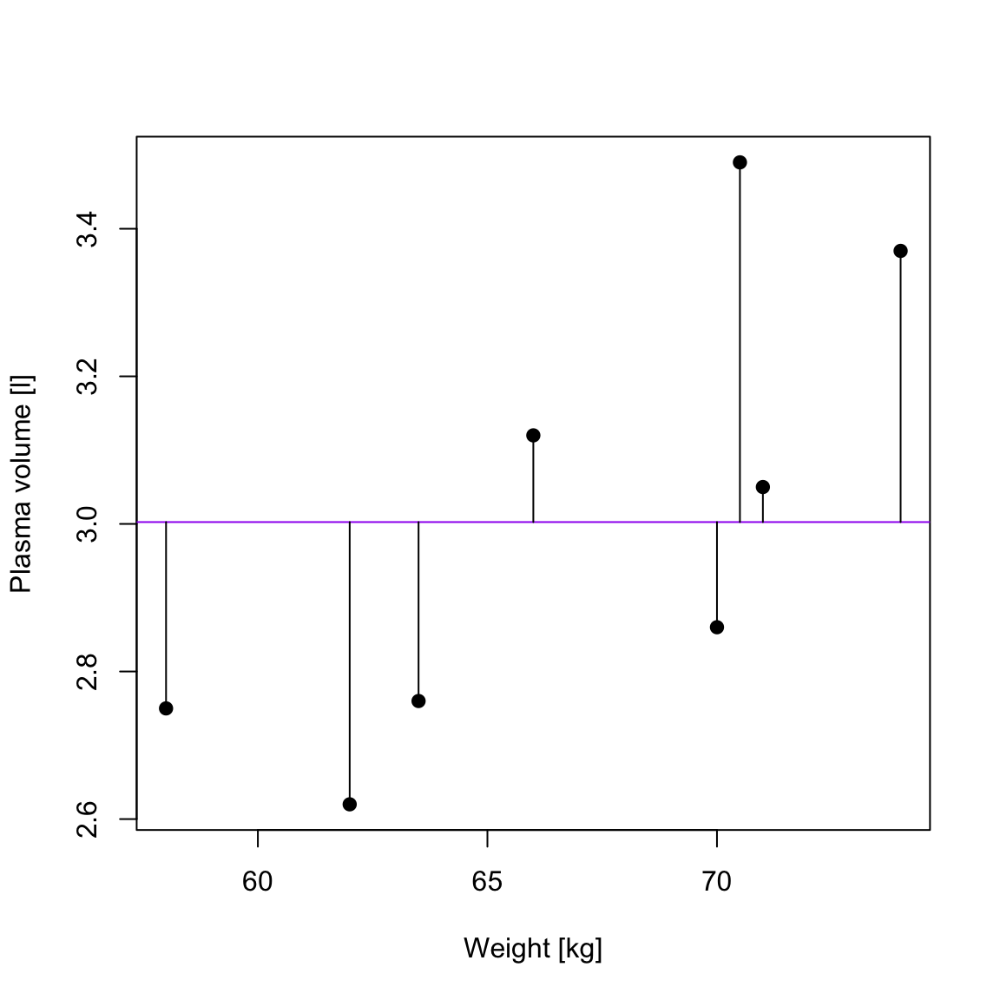
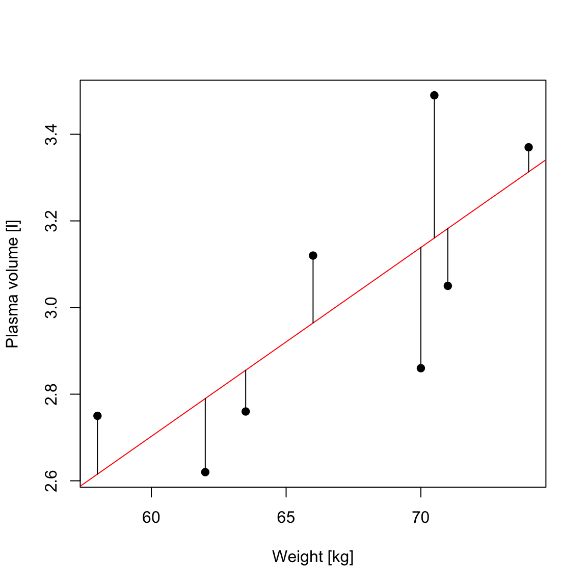

```{r}
#| message: false
#| warning: false
#| include: false

# load libraries
library(tidyverse)
library(magrittr)
library(faraway)
library(kableExtra)
library(ggplot2)
library(rmarkdown)
library(gridExtra)
library(ggiraphExtra)
library(latex2exp)

font.size <- 16
col.blue.light <- "#a6cee3"
col.blue.dark <- "#1f78b4"
my.ggtheme <- 
  theme_bw() + 
  theme(axis.title = element_text(size = font.size), 
        axis.text = element_text(size = font.size), 
        legend.text = element_text(size = font.size), 
        legend.title = element_blank(), 
        legend.position = "top") 
        


# add obesity and diabetes status to diabetes faraway data
inch2m <- 2.54/100
pound2kg <- 0.45
data_diabetes <- diabetes %>%
  mutate(height  = height * inch2m, height = round(height, 2)) %>% 
  mutate(waist = waist * inch2m) %>%  
  mutate(weight = weight * pound2kg, weight = round(weight, 2)) %>%
  mutate(BMI = weight / height^2, BMI = round(BMI, 2)) %>% 
  mutate(obese= cut(BMI, breaks = c(0, 29.9, 100), labels = c("No", "Yes"))) %>% 
  mutate(diabetic = ifelse(glyhb > 7, "Yes", "No"), diabetic = factor(diabetic, levels = c("No", "Yes"))) %>%
  na.omit()

```

# Today

We will learn how linear models can be used to describe relationships
between variables.

::: {.incremental}

- what a linear model represents
- how model coefficients are estimated and interpreted
- how to assess whether a linear model adequately describes the data

:::

<br>

. . .

*Later in the course*

- common study designs with GLMs
- linear models in the ML context 

## Why linear models?

. . .

::: columns
::: {.column width="50%"}
With linear models we can answer questions such as:

::: incremental
- Is there a relationship between **outcome** and **predictor**, e.g. weight and height?
- How strong is that relationship?
- How does the expected outcome change when the predictor changes?
:::
:::

::: {.column width="5%"}
:::

::: {.column width="45%"}
```{r}
#| fig-width: 6
#| fig-height: 6
data_diabetes %>%
  ggplot(aes(x = height, y = weight)) + 
  geom_point() + 
  geom_smooth(method = "lm", se = FALSE) + 
  my.ggtheme + 
  xlab("height [m]") + 
  ylab("weight [kg]")
```
:::
:::

## Statistical vs. deterministic relationship

. . .

Relationships in probability and statistics can generally be one of three things:

-   deterministic
-   random
-   statistical

## Statistical vs. deterministic relationship {.smaller}

*deterministic*

A **deterministic** relationship involves **an exact relationship** between two variables, for instance Fahrenheit and Celsius degrees is defined by an equation $Fahrenheit=\frac{9}{5}\cdot Celcius+32$

. . .

```{r}
#| fig-width: 6
#| fig-align: center
# Deterministic relationship example
x_celcius <- seq(from=0, to=50, by=5)
y_fahr <- 9/5*x_celcius+32
plot(x_celcius, y_fahr, type="b", pch=19, xlab="Celcius", ylab="Fahrenheit", main="Deterministic", cex.main=1, las=1)
```

## Statistical vs. deterministic relationship {.smaller}

*random*

There is **no relationship** between variables in the **random relationship**, e.g. number of plants Olga buys and time of the year as Olga buys plants whenever she feels like it throughout the entire year

```{r}
#| fig-width: 6
#| fig-align: center
# Statistical relationship (random)
x <- seq(from=0, to=100, by=5)
y_random <- - rnorm(length(x), mean=100, sd=25)
plot(x, y_random, pch=19, xlab="x", ylab="y", main="Random", cex.main=1, las=1)
```

## Statistical vs. deterministic relationship {.smaller}

*statistical relationship = deterministic + random*

**A statistical relationship** is a **mixture of deterministic and random relationship**, e.g. the savings that Olga has left in the bank account depend on Olga's monthly salary income (deterministic part) and the money spent on buying plants (random part)

```{r}
#| fig-width: 10
#| fig-align: center

# prepare plot space
par(mfrow=c(1,2))

# Statistical relationship (increasing)
x <- seq(from=0, to=100, by=5)
y_increasing <- 2*x + rnorm(length(x), mean=100, sd=25)
plot(x, y_increasing, pch=19, xlab="x", ylab="y", main="Statistical", cex.main=1, las=1)

# Statistical relationship (decreasing)
y_decreasing <- -2*x + rnorm(length(x), mean=100, sd=25)
plot(x, y_decreasing, pch=19, xlab="x", ylab="y", main="Statistical", cex.main=1, las=1)

```

## What linear models are

*definition*

<br>

::: columns
::: {.column width="60%"}
::: incremental


- A linear model describes a **continuous outcome** $Y$ using one or more predictors $X$.

- For example, $$ Y_i = \beta_0 + \beta_1x_{1i} + \dots + \beta_px_{pi} + \epsilon_i $$

- where:
- $Y_i$ is the observed outcome for individual $i$
- $x_{1i},\dots,x_{pi}$ are predictor values
- $\beta_0,\dots,\beta_p$ are unknown model parameters describing how the expected outcome depends on the predictors (systematic part)
- $\epsilon_i$ represents variation not explained by the systematic part of the model
- Predictors can be **numerical, categorical, or a mixture of both.**
:::
:::

::: {.column width="5%"}
:::

::: {.column width="35%"}
```{r}
#| fig-width: 6
#| fig-height: 6
data_diabetes %>%
  ggplot(aes(x = height, y = weight)) + 
  geom_point() + 
  geom_smooth(method = "lm", se = FALSE) + 
  my.ggtheme + 
  xlab("height [m]") + 
  ylab("weight [kg]")
```
:::
:::


## What does "linear" mean?

A linear model is **linear in its model parameters**.

For example:

$$
Y_i = \beta_0 + \beta_1X_i + \epsilon_i
$$

is a linear model.

. . .

<br>

But so is:

$$
Y_i = \beta_0 + \beta_1X_i + \beta_2X_i^2 + \epsilon_i
$$

because the parameters $\beta_0$, $\beta_1$ and $\beta_2$ still enter the model linearly.

. . .

<br>

::: {.key-message-box}

**Linear model does not necessarily mean a straight-line relationship between $X$ and $Y$.**

:::

## Simple linear regression

```{r}
#| fig-width: 10
#| fig-height: 4
#| fig-align: center

par(mfrow=c(1,2))
x <- 1:100
y <- x + rnorm(length(x), 0, 10)
plot(x,y, pch = 19, las = 1)

x <- 1:100
y <- (x - rnorm(length(x), 0, 10))*(-1)
plot(x,y, pch = 19, las = 1)

```

::: incremental
-   Simple linear regression describes the relationship between **the numerical outcome and one numerical explanatory variable**
- We represent the systematic part of this relationship using a **straight line**.
- In practice, we estimate the straight line that best describes how the outcome changes with the predictor.
:::

## Simple linear regression

::: {#exm-simple-lm}
## Weight and plasma volume

Let's look at the example data containing body weight (kg) and plasma volume (liters) for eight healthy men to see what the best-fitting straight line is.

```{r}
#| code-fold: false
weight <- c(58, 70, 74, 63.5, 62.0, 70.5, 71.0, 66.0) # body weight (kg)
plasma <- c(2.75, 2.86, 3.37, 2.76, 2.62, 3.49, 3.05, 3.12) # plasma volume (liters)

```

``` r
weight <- c(58, 70, 74, 63.5, 62.0, 70.5, 71.0, 66.0) # body weight (kg)
plasma <- c(2.75, 2.86, 3.37, 2.76, 2.62, 3.49, 3.05, 3.12) # plasma volume (liters)
```
:::

```{r}
#| label: fig-lm-intro-example
#| fig-cap: "Scatter plot of the data shows that high plasma volume tends to be associated with high weight and *vice verca*."
#| fig-cap-location: margin
#| echo: false
#| fig-width: 4
#| fig-heigth: 4
#| include: false

plot(weight, plasma, pch=19, las=1, xlab = "body weight [kg]", ylab="plasma volume [l]",  panel.first = grid())

```

## Simple linear regression

```{r}
#| label: fig-lm-01
#| include: false
#| fig-width: 6
#| fig-height: 6

plot(weight, plasma, pch=19, las=1, xlab = "body weight [kg]", ylab="plasma volume [l]",  panel.first = grid())

```

```{r}
#| label: fig-lm-02
#| include: false
#| fig-width: 6
#| fig-height: 6

plot(weight, plasma, pch=19, las=1, xlab = "body weight [kg]", ylab="plasma volume [l]", panel.first = grid())

reg1 <- lm(plasma ~ weight)
a <- reg1$coefficients[1]
b <- reg1$coefficients[2]

#abline(a=a+0.1 , b + 0.001, col="gray")
#abline(a=a+0.1 , b + 0.0001, col="gray")
#abline(a=a , b + 0.00015, col="gray")
#abline(a=a+0.1 , b + 0.002, col="gray")
# abline(a=a+0.1 , b - 0.002, col="gray")
# abline(a=a+0.1 , b - 0.002, col="gray")
# abline(a=a+0.1 , b - 0.001, col="gray")
# abline(a=a, b - 0.001, col="gray")
 abline(a=a+0.5 , b , col="gray")
# abline(a=a-0.5 , b , col="gray")

#abline(lm(plasma~weight), col="red") # regression line
points(weight, plasma, pch=19)

```

```{r}
#| label: fig-lm-03
#| include: false
#| fig-width: 6
#| fig-height: 6


plot(weight, plasma, pch=19, las=1, xlab = "body weight [kg]", ylab="plasma volume [l]", panel.first = grid())

reg1 <- lm(plasma ~ weight)
a <- reg1$coefficients[1]
b <- reg1$coefficients[2]

abline(a=a+0.1 , b + 0.001, col="gray")
#abline(a=a+0.1 , b + 0.0001, col="gray")
# abline(a=a , b + 0.00015, col="gray")
# abline(a=a+0.1 , b + 0.002, col="gray")
# abline(a=a+0.1 , b - 0.002, col="gray")
# abline(a=a+0.1 , b - 0.002, col="gray")
# abline(a=a+0.1 , b - 0.001, col="gray")
# abline(a=a, b - 0.001, col="gray")
abline(a=a+0.5 , b , col="gray")
# abline(a=a-0.5 , b , col="gray")

#abline(lm(plasma~weight), col="red") # regression line
points(weight, plasma, pch=19)

```

```{r}
#| label: fig-lm-03b
#| include: false
#| fig-width: 6
#| fig-height: 6


plot(weight, plasma, pch=19, las=1, xlab = "body weight [kg]", ylab="plasma volume [l]", panel.first = grid())

reg1 <- lm(plasma ~ weight)
a <- reg1$coefficients[1]
b <- reg1$coefficients[2]

abline(a=a+0.1 , b + 0.001, col="gray")
#abline(a=a+0.1 , b + 0.0001, col="gray")
# abline(a=a , b + 0.00015, col="gray")
#abline(a=a+0.1 , b + 0.002, col="gray")
# abline(a=a+0.1 , b - 0.002, col="gray")
# abline(a=a+0.1 , b - 0.002, col="gray")
 abline(a=a+0.1 , b - 0.001, col="gray")
#abline(a=a, b - 0.001, col="gray")
abline(a=a+0.5 , b , col="gray")
#abline(a=a-0.5 , b , col="gray")

#abline(lm(plasma~weight), col="red") # regression line
points(weight, plasma, pch=19)

```

```{r}
#| label: fig-lm-04
#| include: false
#| fig-width: 6
#| fig-height: 6


plot(weight, plasma, pch=19, las=1, xlab = "body weight [kg]", ylab="plasma volume [l]", panel.first = grid())

reg1 <- lm(plasma ~ weight)
a <- reg1$coefficients[1]
b <- reg1$coefficients[2]

abline(a=a+0.1 , b + 0.001, col="gray")
abline(a=a+0.1 , b + 0.0001, col="gray")
#abline(a=a , b + 0.00015, col="gray")
abline(a=a+0.1 , b + 0.002, col="gray")
abline(a=a+0.1 , b - 0.002, col="gray")
abline(a=a+0.1 , b - 0.002, col="gray")
abline(a=a+0.1 , b - 0.001, col="gray")
abline(a=a, b - 0.001, col="gray")
abline(a=a+0.5 , b , col="gray")
abline(a=a-0.5 , b , col="gray")

#abline(lm(plasma~weight), col="red") # regression line
points(weight, plasma, pch=19)

```

```{r}
#| label: fig-lm-05
#| include: false
#| fig-width: 6
#| fig-height: 6

plot(weight, plasma, pch=19, las=1, xlab = "body weight [kg]", ylab="plasma volume [l]", panel.first = grid())

reg1 <- lm(plasma ~ weight)
a <- reg1$coefficients[1]
b <- reg1$coefficients[2]

abline(a=a+0.1 , b + 0.001, col="gray")
abline(a=a+0.1 , b + 0.0001, col="gray")
#abline(a=a , b + 0.00015, col="gray")
abline(a=a+0.1 , b + 0.002, col="gray")
abline(a=a+0.1 , b - 0.002, col="gray")
abline(a=a+0.1 , b - 0.002, col="gray")
abline(a=a+0.1 , b - 0.001, col="gray")
abline(a=a, b - 0.001, col="gray")
abline(a=a+0.5 , b , col="gray")
abline(a=a-0.5 , b , col="gray")

abline(lm(plasma~weight), col="red") # regression line
points(weight, plasma, pch=19)
```

::: r-stack
{.fragment width="600" height="600"}

{.fragment width="600" height="600"}

{.fragment width="600" height="600"}

{.fragment width="600" height="600"}

{.fragment width="600" height="600"}

{.fragment width="600" height="600"}
:::

## Simple linear regression

```{r}
#| label: fig-lm-example-reg
#| fig-cap: "Scatter plot of the data shows that high plasma volume tends to be associated with high weight and *vice verca*. Linear regression gives the equation of the straight line (red) that best describes how the outcome changes (increase or decreases) with a change of exposure variable"
#| fig-cap-location: margin
#| echo: false
#| fig-width: 10
#| fig-heigth: 4

par(mfrow=c(1,2))
plot(weight, plasma, pch=19, las=1, xlab = "body weight [kg]", ylab="plasma volume [l]",  panel.first = grid())


plot(weight, plasma, pch=19, las=1, xlab = "body weight [kg]", ylab="plasma volume [l]", panel.first = grid())

reg1 <- lm(plasma ~ weight)
a <- reg1$coefficients[1]
b <- reg1$coefficients[2]

abline(a=a+0.1 , b + 0.001, col="gray")
abline(a=a+0.1 , b + 0.0001, col="gray")
#abline(a=a , b + 0.00015, col="gray")
abline(a=a+0.1 , b + 0.002, col="gray")
abline(a=a+0.1 , b - 0.002, col="gray")
abline(a=a+0.1 , b - 0.002, col="gray")
abline(a=a+0.1 , b - 0.001, col="gray")
abline(a=a, b - 0.001, col="gray")
abline(a=a+0.5 , b , col="gray")
abline(a=a-0.5 , b , col="gray")

abline(lm(plasma~weight), col="red") # regression line
points(weight, plasma, pch=19)


```

. . .


The equation for the red line is: $$\hat{y}_i=0.086 +  0.044 \cdot x_i \quad for \;i = 1 \dots 8$$

. . .

and in general: $$\hat{y}_i = \hat{\alpha} + \hat{\beta}x_i \quad for \; i = 1 \dots n$$ {#eq-lm-no-error}

. . .

## Simple linear regression

In other words, by finding the best-fitting straight line we are **building a statistical model** to represent the relationship between plasma volume ($Y$) and explanatory body weight variable ($x$)


## Simple linear regression {.smaller}

<br>

``` r
weight <- c(58, 70, 74, 63.5, 62.0, 70.5, 71.0, 66.0) # body weight (kg)
plasma <- c(2.75, 2.86, 3.37, 2.76, 2.62, 3.49, 3.05, 3.12) # plasma volume (liters)
```

<br>

::: columns
::: {.column width="55%"}

::: {.fragment}

- For an individual with body weight 58 kg, the fitted value from our model is. 

:::

::: {.fragment}
$$\hat{y}_i = 0.086 + 0.044 \cdot 58 = 2.638$$
:::

::: {.fragment}
- But the observed plasma volume is $$y_i = 2.75.$$
:::

::: {.fragment}
- The observation therefore does not lie exactly on the fitted line.
:::

::: {.fragment}
- The difference: $e_i = y_i - \hat{y}_i$ is called the **residual**.
:::

::: {.fragment}

- The statistical model can be written as

$$
Y_i = \alpha + \beta x_i + \epsilon_i,
$$

- where $\epsilon_i$ represents variation of individual observations around the systematic relationship.
:::

::: {.fragment}
- $x$: is called: exposure variable, explanatory variable, independent variable, predictor, covariate
:::

::: {.fragment}
- $y$: is called: response, outcome, dependent variable
:::

::: {.fragment}
- $\alpha$ and $\beta$ are **model coefficients**
:::

::: {.fragment}
- and $\epsilon_i$ is an **error terms**
:::

:::


::: {.column width="5%"}
:::

::: {.column width="40%"}
```{r}
#| warning: false
#| message: false
#| echo: false
#| fig-height: 7

font.size <- 22
my.ggtheme <- theme_bw() + 
  theme(axis.title = element_text(size = font.size),
        axis.text = element_text(size = font.size),
        legend.text = element_text(size = font.size),
        legend.title = element_blank(),
        legend.position = "top") 
        
df <- data.frame(weight = weight, plasma = plasma)
df %>%
  ggplot(aes(x = weight, y = plasma)) + 
  geom_point(size = 3) + 
  geom_smooth(method = "lm", se = FALSE, color = "red") + 
  xlab("body weight [kg]") +
  ylab("plasma volume [l]") + 
  my.ggtheme


```

:::
:::

::: footer
:::


## Least squares
<br> <br>

::: incremental
-   in the above **"body weight - plasma volume"** example, the values of $\alpha$ and $\beta$ have just appeared
-   in practice, $\alpha$ and $\beta$ values are **unknown** and we use data to **estimate these coefficients**, noting the estimates with a **hat**, $\hat{\alpha}$ and $\hat{\beta}$
-   **least squares** is one of the methods of parameters estimation, i.e. finding $\hat{\alpha}$ and $\hat{\beta}$
:::

## Least squares 
*minimizing RSS*

<br>

::: columns
::: {.column width="50%"}

Let

$$
\hat{y}_i=\hat{\alpha}+\hat{\beta}x_i
$$

be the fitted value for observation $i$.

- The **residual** is

$$
e_i = y_i-\hat{y}_i
$$

- The **residual sum of squares** is

$$
RSS = \sum_{i=1}^n e_i^2
$$

::: {.text-box-1}
- Least squares chooses $\hat{\alpha}$ and $\hat{\beta}$ to **minimize RSS**.
:::


<!-- Let $\hat{y_i}=\hat{\alpha} + \hat{\beta}x_i$ be the prediction $y_i$ based on the $i$-th value of $x$:

-   Then $\epsilon_i = y_i - \hat{y_i}$ represents the $i$-th **residual**, i.e. the difference between the $i$-th observed response value and the $i$-th response value that is predicted by the linear model
-   RSS, the **residual sum of squares** is defined as: $$RSS = \epsilon_1^2 + \epsilon_2^2 + \dots + \epsilon_n^2$$ or equivalently as: $$RSS=(y_1-\hat{\alpha}-\hat{\beta}x_1)^2+(y_2-\hat{\alpha}-\hat{\beta}x_2)^2+...+(y_n-\hat{\alpha}-\hat{\beta}x_n)^2$$
-   the least squares approach chooses $\hat{\alpha}$ and $\hat{\beta}$ **to minimize the RSS**. -->
:::

::: {.column width="10%"}
:::

::: {.column width="40%"}
```{r}
#| label: fig-reg-errors
#| fig-cap: "Scatter plot of the data shows that high plasma volume tends to be associated with high weight and *vice versa*. Linear regression gives the equation of the straight line (red) that best describes how the outcome changes with a change of exposure variable. Blue lines represent error terms, the vertical distances to the regression line"
#| fig-cap-location: margin
#| echo: false
#| warning: false
#| message: false
#| fig-width: 8
#| fig-height: 8

data.reg <- data.frame(plasma=plasma, weight=weight)
fit.reg <- lm(plasma~weight, data=data.reg)
data.reg$predicted <- predict(fit.reg)
data.reg$residuals <- residuals((fit.reg))

ggplot(data.reg, aes(x=weight, plasma)) + 
  geom_point() +
  geom_smooth(method = "lm", se = FALSE, color = "firebrick") +
  geom_segment(aes(xend = weight, yend = predicted), color="blue") +
  geom_point(aes(y = predicted), shape = 1) +
  geom_point(aes(y = predicted), shape = 1) +
  xlab("body weight [kg]") + ylab("plasma volume [liters]") + 
  my.ggtheme

```
:::
:::

## Another way to view the linear model
*Expected-value interpretation*

<br>

Another way to think about a linear regression model is that it describes the expected value of the outcome for a given value of the predictor.

$$
E(Y \mid X=x)=\alpha+\beta x
$$

. . .

<br>

Individuals with the same value of the predictor can have different outcomes. The regression line describes their expected, or average, outcome.

The line describes their expected, or average, outcome.

<br>

. . .

::: {.key-message-box}

The regression line describes how the expected outcome changes with the predictor, while individual observations vary around that expectation.

:::

## Slope

$\widehat{plasma} = 0.0857 + 0.0436 \cdot weight$

Linear regression estimates the model parameters $\alpha$ and $\beta$:
$Y_i = \alpha + \beta x_i + \epsilon_i$

The slope $\hat{\beta}=0.0436$ describes the expected change in plasma volume
for a one-unit increase in body weight.

```{r}
#| fig-align: center

model <- lm(plasma ~ weight)
alpha <- model$coefficients[1]
beta <- model$coefficients[2]

my.s <- 2
par(mfcol=c(1,2))

# Beta 1 example a
plot(weight, plasma, pch=19, las=1, xlab = "body weight [kg]", ylab="plasma volume [l]",  panel.first = grid())
abline(lm(plasma~weight), col="red") # regression line
abline(h = alpha + beta * 65, col = "blue",  lty = 3)
abline(h = alpha + beta * 70, col = "blue",  lty = 3)
segments(x0=65, y0=alpha + beta * 65, x1=70, y1=alpha + beta * 65, col="blue")
segments(x0=70, y0=alpha + beta * 65, x1=70, y1=alpha + beta * 70, col="blue")
text(72, 2.95, expression(beta), cex=1.2, col="blue")
text(60, alpha + beta * 65 + 0.05, round(alpha + beta * 65, 2), cex=1.2, col="blue")
text(60, alpha + beta * 70 + 0.05, round(alpha + beta * 70, 2), cex=1.2, col="blue")

# Beta 1 example b
plot(weight, plasma, pch=19, las=1, xlab = "body weight [kg]", ylab="plasma volume [l]",  panel.first = grid(), xlim=c(60, 70), ylim=c(2.8, 3.2))
abline(lm(plasma~weight), col="red") # regression line
abline(h = alpha + beta * 65, col = "blue",  lty = 3)
abline(h = alpha + beta * 66, col = "blue",  lty = 3)
segments(x0=65, y0=alpha + beta * 65, x1=66, y1=alpha + beta * 65, col="blue")
segments(x0=66, y0=alpha + beta * 65, x1=66, y1=alpha + beta * 66, col="blue")
text(67, 2.94, expression(beta), cex=1.2, col="blue")
text(61, alpha + beta * 65 - 0.02, round(alpha + beta * 65, 2), cex=1.2, col="blue")
text(61, alpha + beta * 66 + 0.02, round(alpha + beta * 66, 2), cex=1.2, col="blue")

```

*Increasing weight by 5 kg corresponds to* $3.14 - 2.92 = 0.22$ increase in plasma volume. Increasing weight by 1 kg corresponds $2.96 - 2.92 = 0.04$ increase in plasma volume

## Intercept

$\widehat{plasma} = 0.0857 + 0.0436 \cdot weight$

Linear regression estimates the model parameters $\alpha$ and $\beta$:
$Y_i = \alpha + \beta x_i + \epsilon_i$

```{r}
#| fig-align: center

# Values from regression model: plasma_volume = 0.0857 + 0.043615*x
par(mfcol=c(1,2))

# Fitted line
plot(weight, plasma, cex.main = my.s, cex.main=my.s, pch=19, las=1, xlab = "body weight [kg]", ylab="plasma volume [l]",  panel.first = grid())
abline(lm(plasma~weight), col="red") # regression line
text(65, 3.3, "plasma = 0.0857 + 0.0436 * weight", cex=1)

# Beta 0 example a
plot(weight, plasma, pch=19, las=1, xlab = "body weight [kg]", ylab="plasma volume [l]",  panel.first = grid(), xlim=c(-20, 80), ylim=c(0, 5))
abline(lm(plasma~weight), col="red") # regression line
abline(h=alpha, col="blue", lty = 3) # regression line
segments(x0=65, y0=2.92, x1=66, y1=2.92, col="blue")
segments(x0=66, y0=2.92, x1=66, y1=2.964, col="blue")
text(15, 0.4, expression(alpha), cex=1.2, col="blue")
text(33, 0.5, paste("= ", round(alpha,3), sep=""), cex=1.2, col="blue")

```

*The intercept $\hat{\alpha}=0.0857$ is the expected outcome when the predictor equals zero. It is not always meaningful*

## Hypothesis testing
*Is there evidence of an association between the response and the predictor?*

<br>

::: incremental

- $\hat{\alpha}$ and $\hat{\beta}$ are **estimates of unknown population parameters** and are therefore subject to **sampling variation**
- their precision is quantified by their **standard errors**
- we can use this uncertainty to test hypotheses about the model parameters

:::

## Hypothesis testing {.smaller}

**The most common hypothesis test** involves testing the `null hypothesis` of:

-   $H_0:$ There is no relationship between $X$ and $Y$
-   versus the `alternative hypothesis` $H_a:$ there is some relationship between $X$ and $Y$

. . .

**Mathematically**, this corresponds to testing:

-   $H_0: \beta=0$
-   versus $H_a: \beta\neq0$
-   since if $\beta=0$ then the model $Y_i=\alpha+\beta x_i + \epsilon_i$ reduces to $Y_i=\alpha + \epsilon_i$

. . .

**Under the null hypothesis** $H_0: \beta = 0$ <!-- we have: $$\frac{\hat{\beta}-\beta}{e.s.e(\hat{\beta})} \sim t(n-p)$$  --> 

-   $n$ is number of observations
-   $p$ is number of model parameters
-   $\frac{\hat{\beta}-\beta}{e.s.e(\hat{\beta})}$ is the ratio of the departure of the estimated value of a parameter, $\hat\beta$, from its hypothesized value, $\beta$, to its standard error, called `t-statistic`
-   the `t-statistic` follows Student's t distribution with $n-p$ degrees of freedom

## Hypothesis testing {.smaller}

::: {#exm-hypothesis-testing}
## Hypothesis testing

Let's look again at our example data and linear model fitted in R with lm() function.

```{r}
#| code-fold: false

weight <- c(58, 70, 74, 63.5, 62.0, 70.5, 71.0, 66.0) # body weight (kg)
plasma <- c(2.75, 2.86, 3.37, 2.76, 2.62, 3.49, 3.05, 3.12) # plasma volume (liters)

model <- lm(plasma ~ weight)
print(summary(model))

```
:::

. . .

-   Under `Estimate` we see estimates of our model coefficients, $\hat{\alpha}$ (intercept) and $\hat{\beta}$ (slope, here weight), followed by their estimated standard errors, `Std. Errors`

. . .

-   If we were to test if there is an **association between weight and plasma volume** we would write under the null hypothesis $H_0: \beta = 0$ $$\frac{\hat{\beta}-\beta}{e.s.e(\hat{\beta})} = \frac{0.04362-0}{0.01527} = 2.856582$$

. . .

-   and we would **compare** `t-statistic` to `Student's t distribution` with $n-p = 8 - 2 = 6$ degrees of freedom (as we have 8 observations and two model parameters, $\alpha$ and $\beta$)

. . .

-   we can use **Student's t distribution table** or **R code** to obtain the associated *P*-value

``` r
2*pt(2.856582, df=6, lower=F)
```

```{r}
#| code-fold: false
2*pt(2.856582, df=6, lower=F)
```

. . .

-   here the observed t-statistics is large and therefore yields a small *P*-value, meaning that **there is sufficient evidence to reject null hypothesis in favor of the alternative** and conclude that there is a significant association between weight and plasma volume

## Vector-matrix notations {.scrollable .smaller}

Let's **rewrite** our simple linear regression model $Y_i = \alpha + \beta x_i + \epsilon_i \quad i=1,\dots n$ **into vector-matrix notation** in **6 steps**.

. . .

Step 1. We rename our $\alpha$ to $\beta_0$ and $\beta$ to $\beta_1$.

. . .

Step 2. We notice that we have $n$ equations such as:

$$y_1 = \beta_0 + \beta_1 x_1 + \epsilon_1$$ $$y_2 = \beta_0 + \beta_1 x_2 + \epsilon_2$$ $$y_3 = \beta_0 + \beta_1 x_3 + \epsilon_3$$ $$\dots$$ $$y_n = \beta_0 + \beta_1 x_n + \epsilon_n$$

. . .

Step 3. We group all $Y_i$ and $\epsilon_i$ into column vectors: $\mathbf{Y}=\begin{bmatrix} y_1 \\ y_2 \\ \vdots \\ y_{n} \end{bmatrix}$ and $\boldsymbol\epsilon=\begin{bmatrix} \epsilon_1 \\ \epsilon_2 \\ \vdots \\ \epsilon_{n} \end{bmatrix}$

. . .

Step 4. We stack two parameters $\beta_0$ and $\beta_1$ into another column vector:$$\boldsymbol\beta=\begin{bmatrix}
  \beta_0  \\
  \beta_1
\end{bmatrix}$$

. . .

Step 5. We append a vector of ones with the single predictor for each $i$ and create a matrix with two columns called **design matrix** $$\mathbf{X}=\begin{bmatrix}
  1 & x_1  \\
  1 & x_2  \\
  \vdots & \vdots \\
  1 & x_{n}
\end{bmatrix}$$

. . .

Step 6. We write our linear model in a vector-matrix notations as: $$\mathbf{Y} = \mathbf{X}\boldsymbol\beta + \boldsymbol\epsilon$$

## Vector-matrix notations {.smaller}

::: {#def-vector-matrix-lm}
## vector matrix form of the linear model

The vector-matrix representation of a linear model with $p-1$ predictors can be written as $$\mathbf{Y} = \mathbf{X}\boldsymbol\beta + \boldsymbol\epsilon$$

where:

-   $\mathbf{Y}$ is $n \times1$ vector of observations
-   $\mathbf{X}$ is $n \times p$ **design matrix**
-   $\boldsymbol\beta$ is $p \times1$ vector of parameters
-   $\boldsymbol\epsilon$ is $n \times1$ vector of random errors, indepedent and identically distributed (i.i.d) N(0, $\sigma^2$)

In full, the above vectors and matrix have the form:

$\mathbf{Y}=\begin{bmatrix} y_1 \\ y_2 \\ \vdots \\ y_{n} \end{bmatrix}$ $\boldsymbol\beta=\begin{bmatrix} \beta_0 \\ \beta_1 \\ \vdots \\ \beta_{p} \end{bmatrix}$ $\boldsymbol\epsilon=\begin{bmatrix} \epsilon_1 \\ \epsilon_2 \\ \vdots \\ \epsilon_{n} \end{bmatrix}$ $\mathbf{X}=\begin{bmatrix} 1 & x_{1,1} & \dots & x_{1,p-1} \\ 1 & x_{2,1} & \dots & x_{2,p-1} \\ \vdots & \vdots & \vdots & \vdots \\ 1 & x_{n,1} & \dots & x_{n,p-1} \end{bmatrix}$
:::

## Vector-matrix notations

::: {#thm-lss-vector-matrix}
## Least squares in vector-matrix notation

The least squares estimates for a linear regression of the form: $$\mathbf{Y} = \mathbf{X}\boldsymbol\beta + \boldsymbol\epsilon$$

is given by: $$\hat{\mathbf{\beta}}= (\mathbf{X}^T\mathbf{X})^{-1}\mathbf{X}^T\mathbf{Y}$$
:::

## Vector-matrix notations {.smaller .scrollable}

::: {#exm-vector-matrix-notation}
## vector-matrix-notation

Following the above definition we can write the **"weight - plasma volume model"** as: $$\mathbf{Y} = \mathbf{X}\boldsymbol\beta + \boldsymbol\epsilon$$ where:

$\mathbf{Y}=\begin{bmatrix} 2.75 \\ 2.86 \\ 3.37 \\ 2.76 \\ 2.62 \\ 3.49 \\ 3.05 \\ 3.12 \end{bmatrix}$

$\boldsymbol\beta=\begin{bmatrix} \beta_0 \\ \beta_1 \end{bmatrix}$ $\boldsymbol\epsilon=\begin{bmatrix} \epsilon_1 \\ \epsilon_2 \\ \vdots \\ \epsilon_{8} \end{bmatrix}$ $\mathbf{X}=\begin{bmatrix} 1 & 58.0 \\ 1 & 70.0 \\ 1 & 74.0 \\ 1 & 63.5 \\ 1 & 62.0 \\ 1 & 70.5 \\ 1 & 71.0 \\ 1 & 66.0 \\ \end{bmatrix}$

and we can estimate model parameters using $\hat{\mathbf{\beta}}= (\mathbf{X}^T\mathbf{X})^{-1}\mathbf{X}^T\mathbf{Y}$.
:::

## Vector-matrix notations: least squares

*Live demo*

Estimating model parameters using $\hat{\mathbf{\beta}}= (\mathbf{X}^T\mathbf{X})^{-1}\mathbf{X}^T\mathbf{Y}$.

``` r
n <- length(plasma) # no. of observation
Y <- as.matrix(plasma, ncol=1)
X <- cbind(rep(1, length=n), weight)
X <- as.matrix(X)

# print Y and X to double-check that the format is according to the definition
print(Y)
print(X)

# least squares estimate
# solve() finds inverse of matrix
beta.hat <- solve(t(X)%*%X)%*%t(X)%*%Y
print(beta.hat)
```

```{r}
#| code-fold: false

n <- length(plasma) # no. of observation
Y <- as.matrix(plasma, ncol=1)
X <- cbind(rep(1, length=n), weight)
X <- as.matrix(X)

# print Y and X to double-check that the format is according to the definition
#print(Y)
#print(X)

# least squares estimate
# solve() finds inverse of matrix
beta.hat <- solve(t(X)%*%X)%*%t(X)%*%Y
print(beta.hat)

```

## Vector-matrix notations: least squares

*Live demo*

In R we can use `lm()`, the built-in function, to fit a linear regression model and we can replace the above code with one line

``` r
lm(plasma ~ weight)
```

```{r}
#| code-fold: false
lm(plasma ~ weight)
```


# Assessing model fit

## $R^2$: summary of the fitted model

*TSS*

```{r}
#| label: fig-lm-fit-00
#| include: false
#| fig-width: 6
#| fig-height: 6

#weight <- c(58, 70, 74, 63.5, 62.0, 70.5, 71.0, 66.0) # body weight (kg)
#plasma <- c(2.75, 2.86, 3.37, 2.76, 2.62, 3.49, 3.05, 3.12) # plasma volume (liters)

plot(weight, plasma, pch=19, xlab="Weight [kg]", ylab="Plasma volume [l]")
#abline(h=mean(plasma), col="purple")

```

```{r}
#| label: fig-lm-fit-01
#| include: false
#| fig-width: 6
#| fig-height: 6

#weight <- c(58, 70, 74, 63.5, 62.0, 70.5, 71.0, 66.0) # body weight (kg)
#plasma <- c(2.75, 2.86, 3.37, 2.76, 2.62, 3.49, 3.05, 3.12) # plasma volume (liters)

plot(weight, plasma, pch=19, xlab="Weight [kg]", ylab="Plasma volume [l]")
abline(h=mean(plasma), col="purple")

```

```{r}
#| label: fig-lm-fit-02
#| include: false
#| fig-width: 6
#| fig-height: 6


plot(weight, plasma, pch=19, xlab="Weight [kg]", ylab="Plasma volume [l]")
abline(h=mean(plasma), col="purple")

for (i in 1:length(weight)){
  segments(weight[i], plasma[i], weight[i], mean(plasma))
}

```

::: r-stack
{.fragment width="600" height="600"}

{.fragment width="600" height="600"}

{.fragment width="600" height="600"}
:::

## $R^2$: summary of the fitted model

*RSS*

```{r}
#| label: fig-lm-rss-01
#| include: false
#| fig-width: 6
#| fig-height: 6

#weight <- c(58, 70, 74, 63.5, 62.0, 70.5, 71.0, 66.0) # body weight (kg)
#plasma <- c(2.75, 2.86, 3.37, 2.76, 2.62, 3.49, 3.05, 3.12) # plasma volume (liters)

plot(weight, plasma, pch=19, xlab="Weight [kg]", ylab="Plasma volume [l]")
#abline(h=mean(plasma), col="purple")

```

```{r}
#| label: fig-lm-rss-02
#| include: false
#| fig-width: 6
#| fig-height: 6

plot(weight, plasma, pch=19, xlab="Weight [kg]", ylab="Plasma volume [l]")
abline(lm(plasma ~ weight), col="red")
model <- lm(plasma ~ weight)


```

```{r}
#| label: fig-lm-rss-03
#| include: false
#| fig-width: 6
#| fig-height: 6

plot(weight, plasma, pch=19, xlab="Weight [kg]", ylab="Plasma volume [l]")
abline(lm(plasma ~ weight), col="red")
model <- lm(plasma ~ weight)

for (i in 1:length(weight)){
  segments(weight[i], plasma[i], weight[i], model$fitted.values[i])
}
```

::: r-stack
{.fragment width="600" height="600"}

{.fragment width="600" height="600"}

{.fragment width="600" height="600"}
:::

## $R^2$: summary of the fitted model

::: columns
::: {.column width="40%"}
```{r}
#| fig-width: 8
#| fig-height: 12

par(mfrow=c(2,1))


# TSS
plot(weight, plasma, pch=19, xlab="Weight [kg]", ylab="Plasma volume [l]", main = "TSS", cex.main = 0.8)
abline(h=mean(plasma), col="purple")

for (i in 1:length(weight)){
  segments(weight[i], plasma[i], weight[i], mean(plasma))
}

# RSS
plot(weight, plasma, pch=19, xlab="Weight [kg]", ylab="Plasma volume [l]", main = "RSS", cex.main = 0.8)
abline(lm(plasma ~ weight), col="red")
model <- lm(plasma ~ weight)

for (i in 1:length(weight)){
  segments(weight[i], plasma[i], weight[i], model$fitted.values[i])
}


```
:::

::: {.column width="60%"}
<br>

-   **TSS**, denoted **Total corrected sum-of-squares** is the residual sum-of-squares for Model 0 $$S(\hat{\beta_0}) = TSS = \sum_{i=1}^{n}(y_i - \bar{y})^2 = S_{yy}$$ corresponding the to the sum of squared distances to the purple line

-   **RSS**, the residual sum-of-squares, is defined as: $$RSS = \displaystyle \sum_{i=1}^{n}(y_i - \{\hat{\beta_0} + \hat{\beta}_1x_{1i} + \dots + \hat{\beta}_px_{pi}\})^2 = \sum_{i=1}^{n}(y_i - \hat{y_i})^2$$ and corresponds to the squared distances between the observed values $y_i, \dots,y_n$ to fitted values $\hat{y_1}, \dots \hat{y_n}$, i.e. distances to the red fitted line
:::
:::

## $R^2$: summary of the fitted model

::: columns
::: {.column width="40%"}
```{r}
#| fig-width: 8
#| fig-height: 12

par(mfrow=c(2,1))

# TSS
plot(weight, plasma, pch=19, xlab="Weight [kg]", ylab="Plasma volume [l]", main = "TSS", cex.main = 0.8)
abline(h=mean(plasma), col="purple")

for (i in 1:length(weight)){
  segments(weight[i], plasma[i], weight[i], mean(plasma))
}

# RSS
plot(weight, plasma, pch=19, xlab="Weight [kg]", ylab="Plasma volume [l]", main = "RSS", cex.main = 0.8)
abline(lm(plasma ~ weight), col="red")
model <- lm(plasma ~ weight)

for (i in 1:length(weight)){
  segments(weight[i], plasma[i], weight[i], model$fitted.values[i])
}


```
:::

::: {.column width="60%"}
<br>

::: {#def-r2}
## $R^2$

A simple but useful measure of model fit is given by $$R^2 = 1 - \frac{RSS}{TSS}$$ where:

-   RSS is the residual sum-of-squares for Model 1, the fitted model of interest
-   TSS is the sum of squares of the **null model**
-   $R^2$ is also referred as **coefficient of determination**
-   $R^2$ is expressed on a scale, as a proportion between 0 and 1 of the total variation in the data.
:::
:::
:::


## $R^2$ and correlation coefficient

. . .

::: {#thm-r2}
## $R^2$

In the case of simple linear regression:

Model 1: $Y_i = \beta_0 + \beta_1x + \epsilon_i$ $$R^2 = r^2$$ where:

-   $R^2$ is the coefficient of determination
-   $r^2$ is the sample correlation coefficient
:::

::: notes
What other coefficient is expressed on a 0-1 scale?
:::

## $R^2(adj)$

::: incremental
-   In the case of multiple linear regression we are using the **adjusted version of** $R^2$ to assess the model fit as the number of explanatory variables increase, $R^2$ also increases.
:::

. . .

::: {#thm-r2adj}
## $R^2(adj)$

For any multiple linear regression $$Y_i = \beta_0 + \beta_1x_{1i} + \dots + \beta_{p-1}x_{(p-1)i} +  \epsilon_i$$ $R^2(adj)$ is defined as $$R^2(adj) = 1-\frac{\frac{RSS}{n-p-1}}{\frac{TSS}{n-1}}$$

-   $p$ is the number of independent predictors, i.e. the number of variables in the model, excluding the constant and $n$ is number of observations.

$R^2(adj)$ can also be calculated from $R^2$: $$R^2(adj) = 1 - (1-R^2)\frac{n-1}{n-p-1}$$
:::

# Checking model assumptions

## The assumptions of a linear model

::: incremental
-   Before making use of a fitted model for explanation or prediction, it is wise to check that the model provides an adequate description of the data.
-   Informally we have been using box plots and scatter plots to look at the data.
-   There are however formal assumptions that should be met when fitting linear models.
:::

## The assumptions of a linear model

. . .

<br>

**Linearity:**

-   The relationship between $X$ and $Y$ is linear

. . .

**Independence of errors**

- Errors from different observations are independent of each other

. . .

**Normality of errors**

-   The residuals must be approximately normally distributed

. . .

**Equal variances**

-   The variance of the residuals is the same for all values of $X$

## Checking assumptions {.smaller}

**Residuals**, $e_i = y_i - \hat{y}_i$ are the **main ingredient to check model assumptions**.

. . .

```{r}
#| code-fold: false
#| collapse: true
#| fig-cap: "Diagnostic residual plots based on the lm() model used to assess whether the assumptions of linear models are met. Modeling BMI with waist explanatory variable. Model assumptions seems to be met with no noticible patterns based on residuals. Few potential outliers could be considered to be removed."
#| fig-cap-location: margin
#| fig-height: 6

# fit simple linear regression model
model <- lm(BMI ~ waist, data = data_diabetes)

# plot diagnostic plots of the linear model
# by default plot(model) calls four diagnostics plots
# par() divides plot window in 2 x 2 grid
par(mfrow=c(2,2), mar = c(3, 2, 2, 1) + 0.1)
plot(model)
```

## Checking assumptions {.smaller}

```{r}
#| label: fig-lm-assumptions-violated
#| fig-cap: "Examples of diagnostic patterns suggesting violations of linear model assumptions: A) non-linearity, B) non-constant variance, C) non-normal residuals, and D) dependence between observations."
#| fig-width: 9
#| fig-height: 8
#| echo: false
#| warning: false
#| message: false

set.seed(123)

par(mfrow = c(2, 2), mar = c(4, 4, 3, 1))

# A) Non-linearity

n <- 100
x <- runif(n, -3, 3)

# True relationship contains a quadratic component
y <- 2 + 1.2 * x + 1.0 * x^2 + rnorm(n, 0, 1)

model <- lm(y ~ x)

plot(
  fitted(model),
  residuals(model),
  pch = 19,
  xlab = "Fitted values",
  ylab = "Residuals",
  main = "A) Non-linearity"
)

abline(h = 0, lty = 2)
lines(lowess(fitted(model), residuals(model)), lwd = 2)


# B) Non-constant variance

x <- runif(n, 0, 10)

# Residual variation increases with x
y <- 2 + 0.8 * x +
  rnorm(n, mean = 0, sd = 0.3 + 0.35 * x)

model <- lm(y ~ x)

plot(
  fitted(model),
  residuals(model),
  pch = 19,
  xlab = "Fitted values",
  ylab = "Residuals",
  main = "B) Non-constant variance"
)

abline(h = 0, lty = 2)
lines(lowess(fitted(model), residuals(model)), lwd = 2)

# C) Non-normal residuals

x <- runif(n, 0, 10)

# Heavy-tailed errors
y <- 2 + 0.8 * x + rt(n, df = 2)

model <- lm(y ~ x)

qqnorm(
  residuals(model),
  pch = 19,
  main = "C) Non-normal residuals"
)

qqline(residuals(model), lwd = 2)


# D) Non-independent errors

x <- seq_len(n)

# Consecutive errors are correlated
eps <- as.numeric(arima.sim(
  model = list(ar = 0.85),
  n = n
))

y <- 2 + 0.05 * x + eps

model <- lm(y ~ x)

plot(
  seq_len(n),
  residuals(model),
  type = "b",
  pch = 19,
  xlab = "Observation order",
  ylab = "Residuals",
  main = "D) Non-independent errors"
)

abline(h = 0, lty = 2)

```


# Exercises

Let's practice in exercises fitting linear models, hypothesis testing and assessing model fit.

