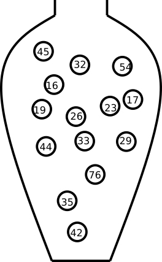
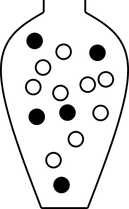

# Introduction to probability {#prob-01intro}

```{r}
#| label: setup
#| include: FALSE
library(ggplot2)
library(knitr)
library(kableExtra)
library(tidyverse)

options(digits=2)
##Allow duplicate chunk labels in child documents
options(knitr.duplicate.label = "allow")
```

Some things are more likely to occur than others. Compare:

-   the chance of the sun rising tomorrow with the chance that no one is infected with Ebola next year
-   the chance of a dark winter in Stockholm with the chance of no rainy days during the summer in Stockholm

We intuitively believe that the sun rising and a dark winter in Stockholm are much more likely than Ebola disappearing overnight or having no rain during the entire summer. **Probability** gives us a way to quantify how likely events are. **Probability rules** enable us to reason about uncertainty. The probability rules are expressed in terms of [sets](https://en.wikipedia.org/wiki/Set_(mathematics)), i.e., a well-defined collection of distinct objects.

Suppose we perform a random experiment that we do not know the outcome of, i.e., we are uncertain about the outcome. We can, however, describe all possible outcomes of the experiment.

-   The **sample space** is the set $S$ of all possible outcomes. For example, when rolling a 6-sided die, the sample space is $S=\{1,2,3,4,5,6\}$.
-   An **event** is a subset of the sample space.
-   An event is said to **occur** if the outcome of the experiment belongs to that set.
-   The **complement** of an event $E$, denoted $E'$, contains all outcomes in $S$ that are not in $E$.
-   Two sets $E$ and $F$, such that $E \cap F = \emptyset$, are said to be **disjoint**.

## Axioms of probability

1.  $0 \leq P(E) \leq 1$ for any event $E \subseteq S$
2.  $P(S) = 1$
3.  If $E$ and $F$ are disjoint events, then $P(E \cup F) = P(E) + P(F)$

## Common rules of probability

Based on the axioms, the following rules of probability can be proved.

-   **Complement rule**: let $E \subseteq S$ be any event, then $P(E') = 1 - P(E)$.
-   **Impossible event**: $P(\emptyset)=0$.
-   **Probability of a subset**: let $E, F \subseteq S$ be events such that $E \subseteq F$, then $P(F) \geq P(E)$.
-   **Addition rule**: let $E, F \subseteq S$ be any two events, then $P(E \cup F) = P(E) + P(F) - P(E \cap F)$.

## Conditional probability

Let $E,F \subseteq S$ be two events with $P(E)>0$, then the conditional probability of $F$ given that $E$ occurs is defined as
$$P(F \mid E) = \frac{P(E \cap F)}{P(E)}$$.

The **product rule** follows from conditional probability: $$P(E \cap F) = P(F \mid E)P(E) = P(E \mid F)P(F)$$

## The urn model

The urn model is a simple mathematical model commonly used in statistics and probability. In the urn model, objects (such as people, mice, cells, genes, or molecules) are represented by balls with different colors or labels.

For example, a fair coin can be represented by an urn with two balls, labeled H and T. A group of people can also be represented by an urn: if age is the variable of interest, we write each person's age on a ball; if we are instead interested in if the people are allergic to pollen or not, we color the balls according to allergy status.


```{r}
#| label: fig-urns
#| layout-ncol: 3
#| echo: FALSE
#| fig-cap: "Urn models of a fair coin, age of a group of people, and pollen allergy status of a group of people."
#| fig-subcap:
#|  - Fair coin
#|  - Age
#|  - Pollen allergy status
#| out.width: '20%'
#| fig.align: "center"
#| fig.show: "hold"



```

In the urn model, every unit (ball) is equally likely to be selected. This means that the urn model is well suited to represent flipping a fair coin. However, a biased coin can also be modeled using an urn model by changing the number of balls that represent each side of the coin.

By drawing balls from the urn with or without replacement, probabilities and other properties of the model can be inferred. Drawing with replacement means that the draws are independent and the composition of the urn stays identical after each draw, whereas drawing without replacement means that the draws are dependent and the composition of the urn changes after each draw. For example, with an urn representing a population of people who are or are not allergic, we can calculate the probability of randomly selecting three people who are all allergic.

## Random variables

A **random variable** is a variable whose value is determined by a random experiment.

A random variable cannot be predicted exactly before the experiment is performed, but its possible values and their probabilities can be described.

Random variables are usually denoted by capital letters, such as $X$, $Y$, and $Z$. Observed values of random variables are usually denoted by lowercase letters, such as $x$, $y$, and $z$.

The **population** is the full set of individuals or objects of interest, and a **sample** is a subset of the population.

Examples of random variables:

- the result of rolling a fair 6-sided die, $D$
- the weight of a random newborn baby, $W$
- the smoking status of a random mother, $S$
- the hemoglobin concentration of a random individual, $Hb$
- the number of mutations in a gene, $M$
- the BMI of a random man, $B$
- the weight status of a random man (underweight, normal weight, overweight, obese)

Examples of probabilities involving these random variables include:

- $P(W>4.0 \text{ kg})$
- $P(S=1)$
- $P(Hb<125 \text{ g/L})$

Conditional probability can, for example, be written as 
$$P(W \geq 3.5 \mid S = 1),$$
which denotes the probability that a smoking mother has a baby who weighs at least 3.5 kg.

Random variables can be classified based on their data type: categorical (nominal or ordinal) or numeric (discrete or continuous).
