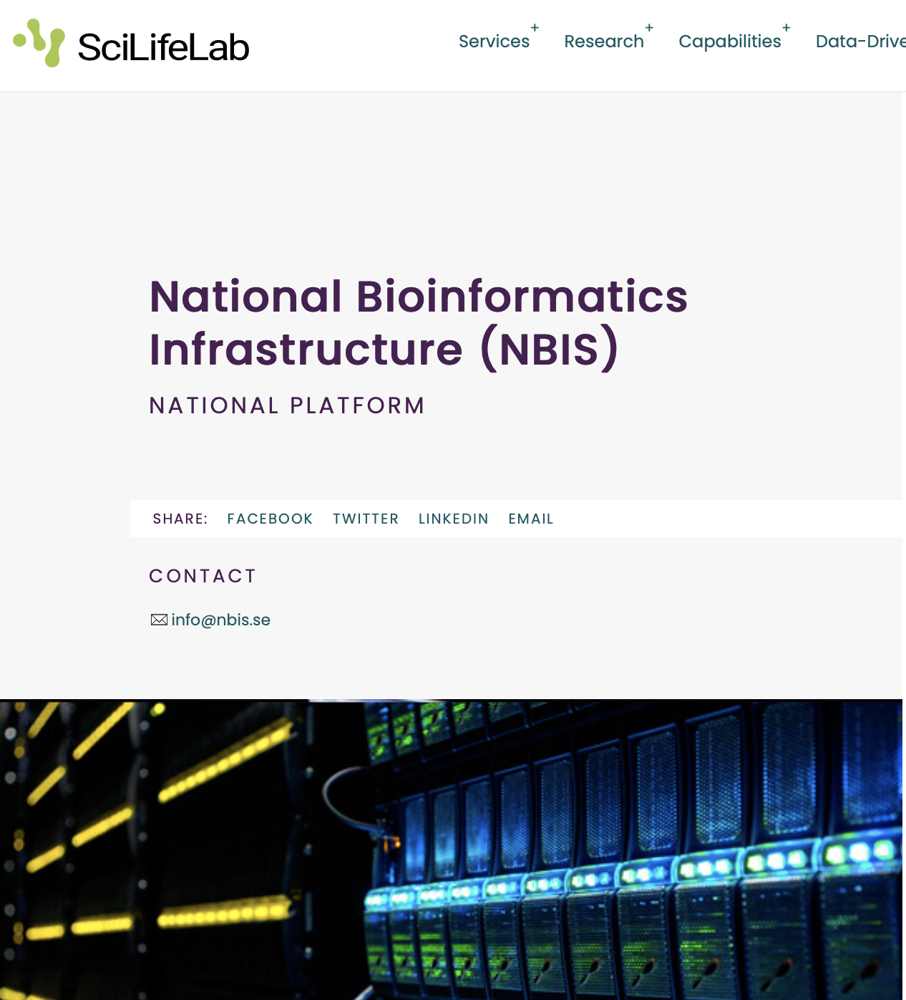
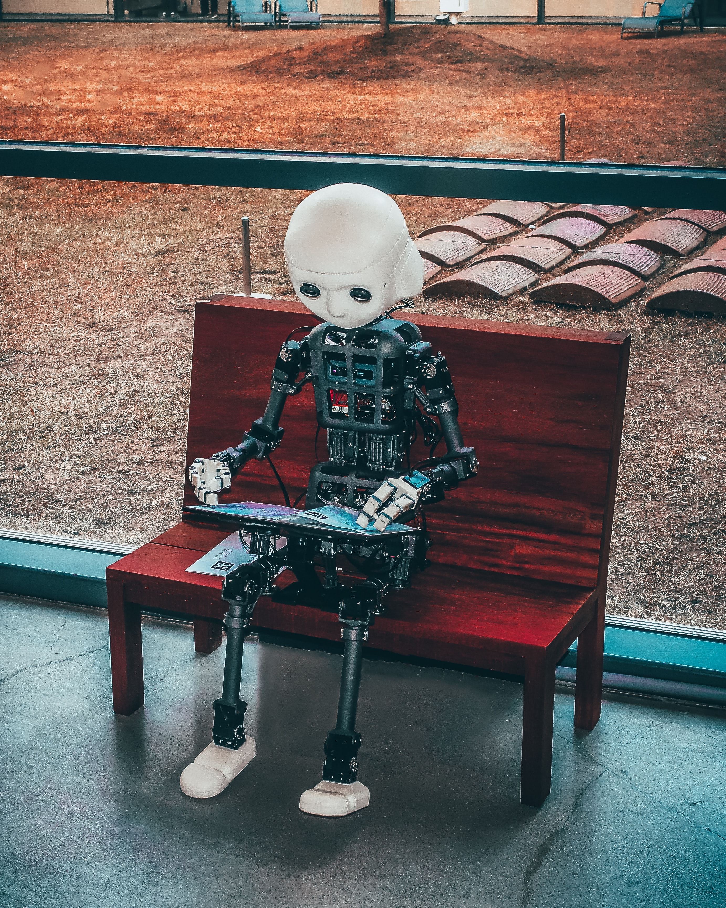
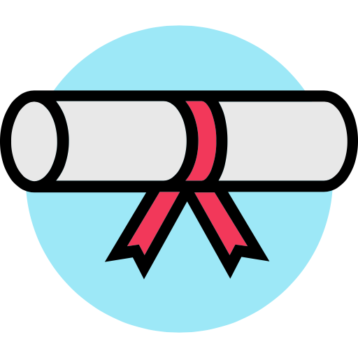
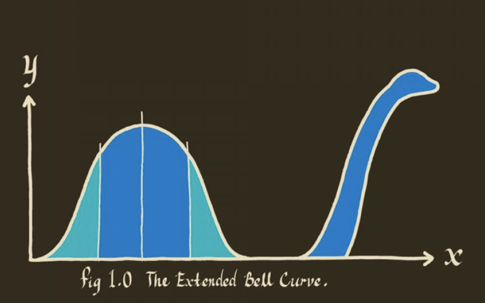

# Warm Welcome

## Statistical Methods for Life Sciences (SM4LS)

  

::: columns
::: {.column width="60%"}
-   7th - 11th September, 2026
-   BMC, Husargatan 3, Uppsala
-   Room: C6:323a
:::
:::

## About us

  

. . .

::: columns
::: {.column width="60%"}
- [Olga Dethlefsen](https://nbis.se/about/staff/olga-dethlefsen/)
- [Eva Freyhult](https://nbis.se/about/staff/eva-freyhult/)
- [Payam Emami](https://nbis.se/about/staff/payam-emami/)
- [Ying Sun](https://ki.se/en/people/ying-sun)
- [Mun-Gwan Hong](https://nbis.se/staff/mun-gwan-hong)
- [Richel Bilderbeek](https://www.uu.se/kontakt-och-organisation/personal?query=N21-617)

  

- NBIS: National Bioinformatics Infrastructure Sweden
- SciLifeLab Bioinformatics Platform
- <https://nbis.se>
- <https://www.scilifelab.se/units/nbis/>
:::

::: {.column width="40%"}
{width="391"}
:::
:::

  

## What about you?
*Let’s do a quick round of introductions*

 

. . .

:::: {.columns}

::: {.column width="40%"}

E.g.

- Where are you in your career right now (university, position)?
- What is your favorite data? 
- Why did you choose this course?
- Or, if you prefer: what did you do over the weekend, or is there anything else unrelated you’d like to share?

:::

::: {.column width="10%"}
:::

::: {.column width="40%"}
{width="391"}
:::

::::

# Practicalities

## Room & Lunches

  

::: columns
::: {.column width="60%"}

::: {.incremental}

-   same room entire week
-   please drink coffee and eat snacks outside
-   bathrooms locations
-   we will lock the room when going for lunch
-   lunch: Monday, Tuesday, Thursday and Friday at Bikupan
-   lunch: Wednesday at Sven Dufva
-   coffee and sandwich/fika at 8.45 and 14.30
:::

:::

<!-- ::: {.column width="40%"} -->
<!-- {fig-align="left" width="291"} -->
<!-- ::: -->
:::

## Internet

  

::: columns
::: {.column width="60%"}
-   Eduroam
-   WiFi network UU-Guest
:::

::: {.column width="40%"}
{fig-align="left" width="200"}
:::
:::

## Course website

  

::: incremental
-   <https://uppsala.instructure.com/courses/119661>
-   you should be now enrolled and be able to access materials incl. quizzes
:::

## Canvas Demo

  

-   Schedule
-   Quiz

  

## Certificate requirements

  

::: columns
::: {.column width="60%"}
::: {.fragment .fade-in}
1.  presence in all sessions during the week
    -   we may allow some skipping if you talk to us ahead
:::

::: {.fragment .fade-in}
2.  completing "Daily challenge" quiz
    -   opens daily at 15.00
    -   closes at 09:00 the following day
:::

::: {.fragment .fade-in}
3.  active participation during the week
:::
:::

::: {.column width="40%"}
{fig-align="center" width="200"}
:::
:::

. . .

 
*Note that we are not able to provide any formal university credits (högskolepoäng). Many universities, however, recognize the attendance in our courses, and award 1.5 HPs, corresponding to 40h of studying. It is up to participants to clarify and arrange credit transfer with the relevant university department.*

  

# Course Background & Aim

---

  
  

::: columns
::: {.column width="60%"}
*"If you torture the data long enough, it will confess to anything"*

*Ronald Coase, British Economist*
:::

::: {.column width="5%"}
:::

::: {.column width="30%"}
{fig-align="left" width="300"}
:::
:::

## Background

  

::: columns
::: {.column width="60%"}

Over the years, we have seen researchers struggle with:

::: {.incremental}

- poor study design, e.g. inadequate or missing controls
- formulating appropriate null and alternative hypotheses
- applying statistical methods without understanding their assumptions
- misinterpreting statistical results
- circular analysis, e.g. testing hypotheses on the same data that were used to generate them

:::

:::

::: {.column width="10%"}
:::

::: {.column width="30%"}
{fig-align="left" width="300"}
:::
:::

## Aim
 

In 2019, we started running this course to:

- help researchers build a framework for statistical learning
- not shy away from theory and equations
- develop an understanding of how to apply statistical methods correctly
- provide a foundation for learning more advanced methods

# Course content

## What are we doing this week?
 

. . .

**How can we learn from biological data while accounting for variation and uncertainty?**

 

. . .

**Probability & sampling**  
How much can observations and study results vary by chance?

. . .

↓  

**Statistical inference**  
How can we estimate, compare groups, and test hypotheses using a sample?

. . .

↓  

**Statistical models**  
How can we describe relationships between variables and account for multiple factors?

. . .

↓  

**More complex data and study designs**  
How do we analyse different types of outcomes, repeated measurements,
high-dimensional data and time-to-event data?

## The week at a glance
 

::: columns

::: {.column width="50%"}

### Monday

Probability & distributions
Statistical inference

 

### Tuesday
Linear regression: Model fitting, assumptions & diagnostics  
Statistical inference, cont.

 

### Wednesday
Linear regression cont.
Mixed-effects models

:::

::: {.column width="50%"}

### Thursday

Survival analysis
Multivariate methods (PCA)

 

### Friday

Clustering
Prediction in life sciences (primer)

:::

:::

## Thank you & Welcome

  

Any questions?
