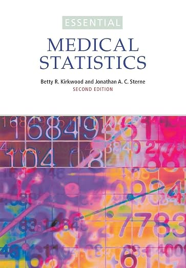
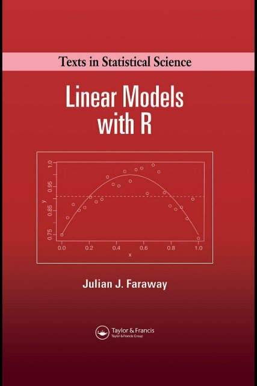
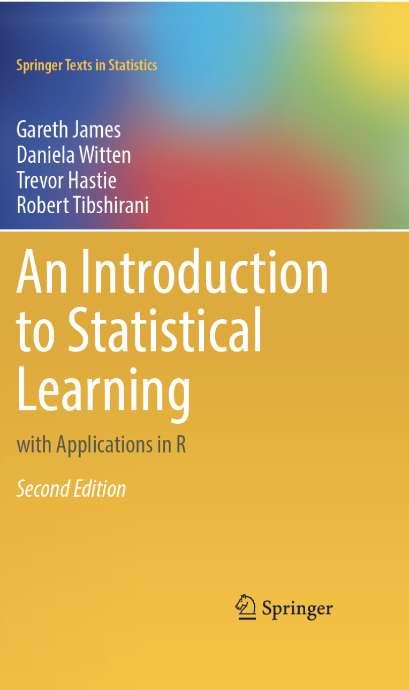

## Group discussion {.center}
ca. 15 min

<br><br>

- Think about all the topics we discussed this week.
- Discuss what you still find unclear or interesting.
- Come up with **at least 2 questions** that you would like to hear answers to and **write them down on a piece of paper.** 

## Materials availability
<br><br>

[https://uppsala.instructure.com/courses/119661](https://uppsala.instructure.com/courses/119661)

[https://nbisweden.github.io/workshop-mlbiostatistics/docs/SM4LS-book/](https://nbisweden.github.io/workshop-mlbiostatistics/docs/SM4LS-book/)

- website will stay up forever
- in case any of the links break, contact us

## Recommended books {.smaller}
<br>

:::: {.columns}

::: {.column width="70%"}
### Biostatistics

- Medical Statistics at a Glance by Aviva Petrie and Caroline Sabin
- Essential Medical Statistics by Kirkwood and Sterne
- Practical Statistics for Data Scientists: 50 Essential Concepts by Peter Bruce and Andrew Bruce

### Linear models 

- Linear Models with R by Julian J. Faraway (second edition)
- Extending the Linear Models with R by Julian J. Faraway (second edition)
- Data Analysis Using Regression and Multilevel/Hierarchical Models by Andrew Gelman & Jennifer Hill

### Statistics & machine learning 

- An Introduction to Statistical Learning with Application in R by Gareth James, Daniela Witten, Trevor Hastie & Robert Tibshirani (second edition) [free download](https://www.statlearning.com).
- Data Analysis for the Life Sciences with R by Rafael A. Irizarry, Michael I. Love.
- Hands-on Machine Learning with Scikit-Learn, Keras & TensorFlow by Aurelien Geron
- Elements of Statistical Learning: data mining, inference and prediction by Trevor Hastie, Robert Tibshirani & Jerome Friedman
:::
 
::: {.column width="2%"}
:::  

::: {.column width="13%"}

{height=2in width=1.3in}
{height=2in width=1.3in}


::: 

::: {.column width="15%"}
{height=2in width=1.3in}

{height=2in width=1.3in}


:::

::::

## Contact

<br><br>


- edu.ml-biostats@nbis.se (reaches Eva, Olga and Payam)

<br><br>

- eva.freyhult@nbis.se
- olga.dethlefsen@nbis.se
- payam.emami@nbis.se
- richel.bilderbeek@icm.uu.se
- ying.sun@scilifelab.se
- mungwan.hong@nbis.se


## NBIS Bioinformatics drop-in

<br><br>

[https://meet.nbis.se/dropin](https://meet.nbis.se/dropin)

- Online on Tuesdays 14:00 - 15:00 (zoom [https://meet.nbis.se/dropin](https://meet.nbis.se/dropin)) 
- In person in Stockholm and Lund
- For exact schedule see [https://nbis.se/get-support/talk-to-us](https://nbis.se/get-support/talk-to-us)


## NBIS consultation and support

<br><br>

* Consultation

  - Up to 3 h for free [https://nbis.se/get-support/talk-to-us](https://nbis.se/get-support/talk-to-us)

* Support [https://nbis.se/services/bioinformatics](https://nbis.se/services/bioinformatics)
 
  - User fee (800 SEK/h)
  - Peer review (Up to 500h for free)

* PhD Bioinformatics advisory program

## Training events
<br><br>


- [https://training.scilifelab.se/events](https://training.scilifelab.se/events)
- [https://training.scilifelab.se/courses/statistical-methods-for-life-sciences](https://training.scilifelab.se/courses/statistical-methods-for-life-sciences)


## What's next?
<br><br>

- [https://training.scilifelab.se/courses/machine-learning-for-life-sciences](https://training.scilifelab.se/courses/machine-learning-for-life-sciences)


<!-- ## AI and IO Seminar series

<br><br>

[https://www.scilifelab.se/research/scilifelab-seminar-series/ai-seminar-series/](https://www.scilifelab.se/research/scilifelab-seminar-series/ai-seminar-series/)

- invited talks in Artificial Intelligence and Integrative Omics
- online, once a month, 1h
- open to everyone -->

## Feedback
<br>

<br>

- Your opinion matters!

## Well done & thank you! 🌱

One final sample from our model...

Each flower is generated by sampling from a garden model described by:

$P \sim \operatorname{Poisson}(8)$, $R \sim N(40, 7^2)$, $H \sim N(160, 30^2)$, and $C \sim U(0, 360)$

<br>

```{ojs}
//| echo: false

viewof sample = Inputs.button("Sample a flower 🌸")
```

```{ojs}
//| echo: false

garden = {

  // ------------------------------------------------
  // Seeded random-number generator
  // This means previously sampled flowers don't
  // change when a new one is added.
  // ------------------------------------------------

  function mulberry32(seed) {
    return function() {
      let t = seed += 0x6D2B79F5;
      t = Math.imul(t ^ t >>> 15, t | 1);
      t ^= t + Math.imul(t ^ t >>> 7, t | 61);
      return ((t ^ t >>> 14) >>> 0) / 4294967296;
    }
  }


  // Normal distribution
  function rnorm(rand, mean, sd) {

    let u = 0;
    let v = 0;

    while (u === 0) u = rand();
    while (v === 0) v = rand();

    let z =
      Math.sqrt(-2 * Math.log(u)) *
      Math.cos(2 * Math.PI * v);

    return mean + sd * z;
  }


  // Poisson distribution
  function rpois(rand, lambda) {

    let L = Math.exp(-lambda);
    let k = 0;
    let p = 1;

    do {
      k++;
      p *= rand();
    } while (p > L);

    return k - 1;
  }


  const NS = "http://www.w3.org/2000/svg";


  // ------------------------------------------------
  // Container
  // ------------------------------------------------

  const container = document.createElement("div");

  container.style.textAlign = "center";


  // ------------------------------------------------
  // Information text
  // ------------------------------------------------

  const info = document.createElement("div");

  info.style.fontSize = "0.65em";
  info.style.marginBottom = "5px";
  info.style.minHeight = "1.5em";

  container.appendChild(info);


  // ------------------------------------------------
  // SVG garden
  // ------------------------------------------------

  const svg = document.createElementNS(NS, "svg");

  svg.setAttribute("viewBox", "0 0 900 370");

  svg.style.width = "100%";
  svg.style.maxWidth = "900px";
  svg.style.height = "370px";


  // ground

  const groundLine =
    document.createElementNS(NS, "line");

  groundLine.setAttribute("x1", 20);
  groundLine.setAttribute("y1", 330);
  groundLine.setAttribute("x2", 880);
  groundLine.setAttribute("y2", 330);

  groundLine.setAttribute("stroke", "#888");
  groundLine.setAttribute("stroke-width", 2);

  svg.appendChild(groundLine);


  // ------------------------------------------------
  // Draw all samples so far
  // ------------------------------------------------

  for (let i = 0; i < sample; i++) {

    const rand =
      mulberry32(91827 + i * 12547);


    // ------------------------------
    // SAMPLE FROM OUR MODEL
    // ------------------------------

    // petals ~ Poisson(8)
    let petals = rpois(rand, 8);

    // just protect the drawing from zero petals
    petals = Math.max(1, petals);


    // flower size ~ N(40, 7²)
    const sampledRadius =
      rnorm(rand, 40, 7);


    // stem height ~ N(160, 30²)
    const sampledStem =
      rnorm(rand, 160, 30);


    // colour ~ Uniform(0, 360)
    const hue =
      rand() * 360;


    // horizontal location ~ Uniform
    //
    // Use evenly spaced regions so flowers
    // don't all land on top of one another.

    const slots = 12;

    const slot =
      i % slots;

    const row =
      Math.floor(i / slots);

    const x =
      55 +
      slot * (790 / (slots - 1)) +
      (rand() - 0.5) * 25;


    // keep extreme samples drawable
    const radius =
      Math.max(18,
        Math.min(62, sampledRadius));

    const stemHeight =
      Math.max(70,
        Math.min(230, sampledStem));


    const ground =
      330 + row * 3;

    const y =
      ground - stemHeight;


    // ------------------------------
    // STEM
    // ------------------------------

    const stem =
      document.createElementNS(NS, "line");

    stem.setAttribute("x1", x);
    stem.setAttribute("y1", y);
    stem.setAttribute("x2", x);
    stem.setAttribute("y2", ground);

    stem.setAttribute(
      "stroke",
      "#4f8a4c"
    );

    stem.setAttribute(
      "stroke-width",
      6
    );

    stem.setAttribute(
      "stroke-linecap",
      "round"
    );

    svg.appendChild(stem);


    // ------------------------------
    // LEAF
    // ------------------------------

    const leaf =
      document.createElementNS(
        NS,
        "ellipse"
      );

    const leafY =
      y + stemHeight * 0.58;

    leaf.setAttribute(
      "cx",
      x + 15
    );

    leaf.setAttribute(
      "cy",
      leafY
    );

    leaf.setAttribute("rx", 20);
    leaf.setAttribute("ry", 7);

    leaf.setAttribute(
      "fill",
      "#6fa95d"
    );

    leaf.setAttribute(
      "transform",
      `rotate(-25 ${x + 15} ${leafY})`
    );

    svg.appendChild(leaf);


    // ------------------------------
    // PETALS
    // ------------------------------

    for (
      let p = 0;
      p < petals;
      p++
    ) {

      const angle =
        2 * Math.PI *
        p / petals;

      const distance =
        radius * 0.55;


      const px =
        x +
        Math.cos(angle) *
        distance;

      const py =
        y +
        Math.sin(angle) *
        distance;


      const petal =
        document.createElementNS(
          NS,
          "ellipse"
        );


      petal.setAttribute(
        "cx",
        px
      );

      petal.setAttribute(
        "cy",
        py
      );

      petal.setAttribute(
        "rx",
        radius * 0.48
      );

      petal.setAttribute(
        "ry",
        radius * 0.25
      );


      petal.setAttribute(
        "fill",
        `hsl(${hue}, 70%, 70%)`
      );


      petal.setAttribute(
        "transform",
        `rotate(
          ${angle * 180 / Math.PI}
          ${px}
          ${py}
        )`
      );


      svg.appendChild(petal);
    }


    // ------------------------------
    // CENTRE
    // ------------------------------

    const centre =
      document.createElementNS(
        NS,
        "circle"
      );

    centre.setAttribute(
      "cx",
      x
    );

    centre.setAttribute(
      "cy",
      y
    );

    centre.setAttribute(
      "r",
      radius * 0.30
    );

    centre.setAttribute(
      "fill",
      "#f5c542"
    );

    svg.appendChild(centre);


    // show latest sample
    if (i === sample - 1) {

      info.innerHTML =
        `Sample ${sample}: ` +
        `<b>${petals} petals</b>` +
        ` · flower size = ` +
        `${sampledRadius.toFixed(1)}` +
        ` · stem height = ` +
        `${sampledStem.toFixed(1)}`;

    }

  }


  // before first click

  if (sample === 0) {

    info.innerHTML =
      "Click to draw from the model.";

  }


  container.appendChild(svg);

  return container;
}
```