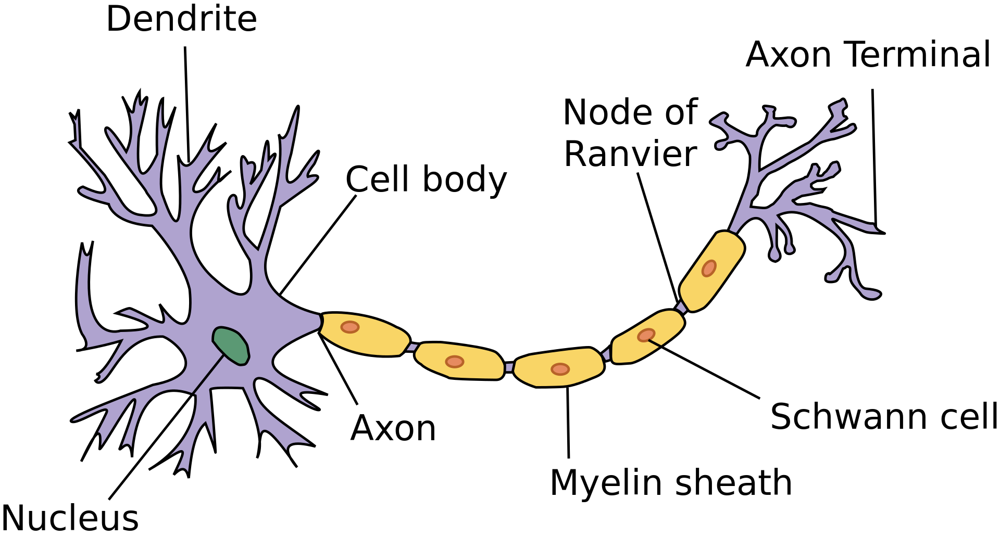

class: inverse, middle, center
<html><div style='float:left'></div><hr color='#EB811B' size=1px width=800px></html> 

# Artificial neural networks (ANNs)
## An introduction to of their basic underlying theory
### Bengt Sennblad, NBIS
### 2019-12-18


???
- frustrated of ANNs
- black box -- ? under the hood
- examination committe
- Many already knows -- apologies
- hopefully, some benefit

```{r setup, include=FALSE}
options(htmltools.dir.version = FALSE)
library(reticulate)
library(knitr)
knit_engines$set(python = reticulate::eng_python)  
```

<style>

.remark-slide-number {
  position: inherit;
}

.remark-slide-number .progress-bar-container {
  position: absolute;
  bottom: 0;
  height: 6px;
  display: block;
  left: 0;
  right: 0;
}

.remark-slide-number .progress-bar {
  height: 100%;
  background-color: #EB811B;
}

.orange {
  color: #EB811B;
}
</style>


---
class: inverse, middle, center
<html><div style='float:left'></div><hr color='#EB811B' size=1px width=800px></html> 

# Neuron models and networks

---


# Background

Inspired by biological neural networks.
Mimic neurons (at the most basic level):

- Single output *state*
    + 0 (inactive) or 
    + 1 (activated)
- State is a function of 1 - several inputs
- State transmitted as input of 1 - many downstream neurons.


```{r, background, echo=F, out.height=280, out.width=500, fig.align='center'}

knitr::include_graphics("neuron1.jpg") #1*vBIWWCFLLzZzGes1HcCJOw.jpg")

```

.footnote[.font70[(c) fig from `https://medium.com/predict/artificial-neural-networks-mapping-the-human-brain-2e0bd4a93160`.]]


---

# Biological neuron
.pull-left[

```{r, neuron2, echo=F, out.height=280, out.width=500, fig.align='center'}



```
].pull-right[
- *Multiple input (on/off):* 
    - from 1-several neurons 

- *Processing*:
     - _Combination_: of inputs  
     - _Activation_: on or off state  

- *Single output (on/off):* to 1-several neurons

- Iterative *Learning* by trial and error
]


---

# The Perceptron
## The first artificial neuron 

.pull-left[

```{python perceptron, echo=F, out.height="100%", out.width="100%", fig.align='center', dpi=600}
import numpy as np
import matplotlib.pyplot as plt
from draw_neural_net import draw_neural_net

layer_sizes = [3,1,1]

weights = [
    np.array(
        [
            ["w_{1}"],
            ["w_{2}"], 
            ["w_{3}"],
        ]
    ),
    np.array(
        [
            [""]
        ]
    )

]
biases = [
    np.array(
        ["b"]
    ), 
    np.array(
        ["b"]
    )
]
fig = plt.figure(figsize=(12, 12), dpi=600)
ax = fig.gca()
ignore=ax.axis('off')

draw_neural_net(ax,
                layerSizes=layer_sizes, 
                weights=weights, 
                biases=biases, 
                hiddenNodePrefix = "", 
                outNodePrefix = "", 
                inNodePrefix ="", 
                biasNodePrefix = "b",
                inPrefix = "a'", 
                outPrefix = "a", 
                nodePrefix =  r"z_{m}",
                hideInOutPutNodes=True,
                nodeFontSize = 30,
                edgeFontSize = 25, 
                edgeWidth = 3
               )
plt.show()
```

].pull-right[

- *Multiple input (on/off):* 
    - from 1-several neurons
- *Processing*:
     - **Multivariate linear model**
$z=\sum_i w_i a'_i + b$
     - The **step activation function**
$$a = 
\begin{cases} 
1 & \quad\textrm{if} \quad z >0\\ 
0 & \quad\textrm{otherwise} 
\end{cases}$$

  - $w$ weights (coefficients)
  - $b$ bias, threshold for *activation*

- *Single output:* to 1-several neurons

- Iterative *Learning* -- a little limited

]
???

-Models biological neuron as ...

-Explain how to read figure
  - input a'
  - weights w
  - bias b
  - output a

-Learning benefits from doing small changes. non-active-activated flip is to sensitive to small changes.


---
# The Sigmoid neuron

It turns out that the perceptorn is a suboptimal for ANN learning. The situation can be substantially improved by relaxing the on/off output of the perceptron -- Enter the *sigmoid neuron*:
.pull-left[
```{python sigmoid, echo=F, out.height="100%", fig.align='center', dpi=600}
import numpy as np
import matplotlib.pyplot as plt
from draw_neural_net import draw_neural_net

layer_sizes = [3,1,1]

weights = [
    np.array(
        [
            ["w_{1}"],
            ["w_{2}"], 
            ["w_{3}"],
        ]
    ),
    np.array(
        [
            ["\sigma"]
        ]
    )

]
biases = [
    np.array(
        ["b"]
    ), 
    np.array(
        ["b"]
    )
]
fig = plt.figure(figsize=(12, 12), dpi=600)
ax = fig.gca()
ignore=ax.axis('off')

draw_neural_net(ax,
                layerSizes=layer_sizes, 
                weights=weights, 
                biases=biases, 
                hiddenNodePrefix = "", 
                outNodePrefix = "", 
                inNodePrefix ="", 
                biasNodePrefix = "b",
                inPrefix = "a'", 
                outPrefix = "a", 
                nodePrefix =  r"z_{m}",
                hideInOutPutNodes=True,
                nodeFontSize = 30,
                edgeFontSize = 25, 
                edgeWidth = 3
               )
plt.show()
```
].pull-right[

- *Multiple input (on/off):* 
    - from 1-several neurons
- *Processing*:
     - **Multivariate linear model**
$$z=\sum_{i=1} w_i a'_i + b$$
     - The **step activation function**
$$a = \sigma(z)$$
- *Single output:* to 1-several neurons

- Iterative *Learning* efficient

]

???
The basis is still a linear model, but the  output is modified by an *activation function* $\sigma$ 


---

# Sigmoid neuron
.pull-left[
To compute the output, $a$, 

- first let
$$z = \sum_{i=1}^M w_i a'_i + b$$
- then determine $a$ from $z.$
$$a = \sigma(z),$$
    + $\sigma(z)$ is a *sigmoid function*, more specifically the *logistic function*:
    $$\sigma(z) = \frac{1}{1+e^{-z}}$$
]
.pull-right[
```{r, logistic, echo = F, out.height=300}

curve(1/(1+exp(-x)),from=-10, to=10, xlab="z", ylab="sigma(z)")
title(main="the logistic function")

```

]


The output is now continuous, but *tends* towards either $0$ or $1.$
The *bias*, $b$, can still be viewed as a threshold for *activation*, as it moves the tendency to activation.

---
# Sigmoid neuron

.footnote[.font70[ [1] also the perceptron can be viewed as a GLM. The threshold forms the activation function.]]

In fact, the sigmoid neuron represents a *generalized linear model* (*GLM*)<sup>1</sup>, specifically the logistic model

In logistic regression, it is more common to describe GLMs in terms a link function that transforms the outcome:

$$logit(a) = \sum_{i=1}^M w_ia'_i + b,$$

where $logit(a) = \sigma^{-1}(a)$ is called the link function.

A sigmoid neuron can thus be viewed simply as a multivariate logistic model. 

--

However, connected in a network they can do more.

---

# Sigmoid Feedforward ANN


.pull-left[
```{python sigmoidAnn, echo=F, out.height="100%", fig.align='center',dpi=600}

layer_sizes = [1, 3, 1]
weights = [
    np.array(
        [
            [ "w_{1,1}", "w_{1,2}", "w_{1,3}"]
        ]
    ),
        np.array(
        [
            [ "w_{1,1}" ],
            [ "w_{2,1}" ],
            [ "w_{3,1}" ]
        ]
    )


]
biases = [
    np.array(
        ["b_1", "b_2", "b_3"]
    ), 
    np.array(
        [ "b_1"]
    ),    
]

fig = plt.figure(figsize=(12, 12))

ax = fig.gca()
ignore=ax.axis('off')

draw_neural_net(ax, 
                layerSizes=layer_sizes,
                weights= weights, 
                biases=biases,
                nodeFontSize = 30,
                edgeFontSize = 25, 
                edgeWidth=3
                )


plt.show()
```
]
.pull-right[
In a *feedforward* ANN, neurons are arranged into **layers**: 
- single *input* layer, passes the input, continuous or discrete
- 1-several of *hidden* layers.
- single *output* layer
The output of one layer forms the input of the next layer. 
- in a feed-forward ANN, layers are _completely connected_
- Network output $\hat{y}$
    + discrete -- **classification**
    + continuous -- **regression**  
    + $\hat{y}_j=a_j$ for neuron $j$ in output layer


]
???
- DAG
- Each layers can have any number of neurons.
- Specially, 
    + size of input layer should = input size 
    + size of output layer should = output size 

**Notice that output $\hat{y}_i$ is the same as $a_i$ for the output layer.

???

- So while each neuron performs rather simple transformations, the sum can be very complex

- Point out that we now have dopuble indices

---

# ANN depth = number of hidden layers

.pull-left[
```{python depth1, echo=F, out.height=250, out.width=250, fig.align='center'}
#,dpi=600}

layer_sizes = [1, 3, 1]
weights = [
    np.array(
        [
            [ "w_{1,1}", "w_{1,2}", "w_{1,3}"]
        ]
    ),
        np.array(
        [
            [ "w_{1,1}" ],
            [ "w_{2,1}" ],
            [ "w_{3,1}" ]
        ]
    )


]
biases = [
    np.array(
        ["b_1", "b_2", "b_3"]
    ), 
    np.array(
        [ "b_1"]
    ),    
]

fig = plt.figure(figsize=(12, 12))

ax = fig.gca()
ignore=ax.axis('off')

draw_neural_net(ax, 
                layerSizes=layer_sizes,
                weights= weights, 
                biases=biases)

plt.title("1 layer", fontsize=48)
plt.show()
```
]
--
.pull-right[
```{python depth2, echo=F, out.height=250, out.width=250, fig.align='center'}
#,dpi=600}


layer_sizes = [2, 2, 2, 1]
weights = [
    np.array(
        [
        
            [ "w_{1.1}",  "w_{2.1}" ],
            [ "w_{1.2}",  "w_{2,2}" ]
        ]
    ),
    np.array(
        [
            [ "w_{1.1}",  "w_{1.2}" ],
            [ "w_{1.2}",  "w_{2.2}" ]
        ]
    ),
    np.array(
        [
            [ "w_{1.1}" ],
            [ "w_{1.2}" ]
        ]
    )
]
biases = [
    np.array(
        [ "b_1",  "b_2" ]
    ), 
    np.array(
        [ "b_1" ,  "b_2" ]
    ),
    np.array(
        [ "b_1" ]
    )
    
]

fig = plt.figure(figsize=(12, 12))

ax = fig.gca()
ignore=ax.axis('off')

draw_neural_net(ax, layerSizes=layer_sizes, weights= weights, biases=biases)


plt.title("2 layer", fontsize=48)

plt.show()
```
]
--
.pull-left[
```{python depth3, echo=F, out.height=250, out.width=250, fig.align='center'}
#,dpi=600}

layer_sizes = [ 4, 3, 2, 3, 4 ]
weights = [
    np.array(
        [
            [ "w_{1,1}", "w_{1,2}", "w_{1,3}"],
            [ "w_{2,1}", "w_{2,2}", "w_{2,3}"],
            [ "w_{3,1}", "w_{3,2}", "w_{3,3}"],
            [ "w_{4,1}", "w_{4,2}", "w_{4,3}"]
        ]
    ),

    np.array(
        [
            [ "w_{1,1}", "w_{1,2}"],
            [ "w_{2,1}", "w_{2,2}"],
            [ "w_{3,1}", "w_{3,2}"]

        ]
    ),

 #   np.array(
 #       [
 #           [ "w_{1,1}", "w_{1,2}"],
 #           [ "w_{2,1}", "w_{2,2}"],
 #       ]
 #  ),
        np.array(
        [
            [ "w_{1,1}", "w_{1,2}", "w_{1,3}"],
            [ "w_{2,1}", "w_{2,2}", "w_{2,3}"]
        ]
    ),
        np.array(
        [
            [ "w_{1,1}", "w_{1,2}", "w_{1,3}","w_{1,4}"],
            [ "w_{2,1}", "w_{2,2}", "w_{2,3}","w_{2,4}"],
            [ "w_{3,1}", "w_{3,2}", "w_{3,3}","w_{3,4}"]
        ]
    )
]
biases = [
    np.array(
        ["b_1", "b_2","b_3"]
    ), 
    np.array(
        ["b_1", "b_2"]
    ), 
    np.array(
        ["b_1", "b_2", "b_3"]
    ), 
    np.array(
        ["b_1", "b_2", "b_3", "b_4"]
    ), 


]

fig = plt.figure(figsize=(12,12))

ax = fig.gca()
ignore=ax.axis('off')

draw_neural_net(ax, layerSizes=layer_sizes) #, weights= weights, biases=biases)

plt.title("3 layer", fontsize=48)


plt.show()

```
]

???
- removed weights

--
.pull-left[
```{python depth4, echo=F, out.height=250, out.width=250, fig.align='center'}
#,dpi=600}

layer_sizes= (2,3,4,4,4,4,4,3,1)

fig = plt.figure(figsize=(12,12))
ax = fig.gca()
ignore=ax.axis('off')

draw_neural_net(ax, 
                layerSizes=layer_sizes, 
                nodePrefix = "",
                hideBias = True)
plt.title("7 layer", fontsize=48)

plt.show()
```
]

???
- remove bias nodes

---
# Hidden layers

#### Inutitive function of hidden layers?
- Each layer can be viewed as transforming the original data to a new multi-dimensional space.

#### Depth
- Number of hidden layers

#### Deep Learning
- ANN with depth > 1


---

# Why Deep Learning?

.pull-left[
#### For regression

- Single layer logistic regression
- More layer $\rightarrow$ - more complex, non-linear, models

#### For classification

- ANNs with depth > 1
    + A single hidden layer can classify data points using one hyperplane
]

.pull-right[
```{r hyperplanes1, echo = FALSE}
library(ggplot2)
a1 = 5
b1=-0.75
a2=8
b2 = -0.4
n=50
df = data.frame(x = runif(n, 0,10), y = runif(n, 0,10))
df$color="A"
df[df$y > a1+b1*df$x & df$y < a2+b2*df$x, "color"] = "B"

p = ggplot(df, aes(x=x, y=y, col=color)) +
  geom_point() + 
#  geom_abline(intercept=a1, slope=b1, col="blue") +
  geom_abline(intercept=a2, slope=b2, col="black") +
  scale_color_manual(values=c("A"="green", "B"="red")) +
  theme_bw()
p

```
]

---


# Why Deep Learning?

.pull-left[
#### For regression

- Single layer logistic regression
- More layer $\rightarrow$ more complex, non-linear, models

#### For classification

- ANNs with depth > 1
    + A single hidden layer can classify using one hyperplane
    + To obtain another hyperplane, add another level
]
'.pull-right[

```{r hyperplanes2, echo = FALSE}
p +  
  geom_abline(intercept=a1, slope=b1, col="blue") 

```
]

---
layout: true
# Other activation functions

```{r tanh, echo=FALSE}

library(ggplot2)

ptanh<-ggplot(data= data.frame(x=0), mapping=aes(x=x)) +
  stat_function(fun=tanh) +
  xlim(-10,10) +
  xlab("z") +
  ylab("tanh(z)")


relu<-function(z){
  ret=z
  ret[z<=0]=0
  return(ret)
}

prelu<-ggplot(data= data.frame(x=0), mapping=aes(x=x)) +
  stat_function(fun=relu) +
  xlim(-10,10) +
  xlab("z") +
  ylab("relu(z)")

library(ggplot2)
softmax<-function(z, sumotherez){
  ez = exp(z)
  return(ez/(sumotherez+ez))
}
otherz = c(-5, -1, 0, 1, 5)
sumotherez = sapply(otherz, function(x)  length(x) * exp(x))
labelsumotherez = sapply(sumotherez, format, digit=2, scientific=3)

psoftmax=ggplot(data= data.frame(x=0), mapping=aes(x=x)) +
  xlim(-10,10) +
  xlab("z") +
  ylab("softmax(z)")

for(i  in seq(1,5)){
  mycol = paste(otherz[i])
  psoftmax = psoftmax + stat_function(fun=function (x, i) softmax(x,sumotherez[i]), aes(colour = paste(!!mycol)), args = list(i=i))
}
psoftmax = psoftmax +  scale_colour_manual(expression("avg "*z), values = c("yellow","orange", "red", "darkgreen","blue"))

```
---
.pull-left[
#### $tanh$
- $\tanh(z) = \frac{e^z-e^{-z}}{e^z+e^{-z}} = 2\sigma(2z) -1$
]
.pull-right[
```{r, echo =FALSE, fig.height =3, fig.width=3}
ptanh
```
]
.pull-left[
#### *Rectified Linear Unit* (*ReLU*)
- $relu(z) =\begin{cases}z &\textrm{if } z >0\\0 &\textrm{otherwise}\end{cases}$

]
.pull-right[
```{r, echo =FALSE, fig.height =3, fig.width=3}
prelu
```
]
---
.pull-left[
#### *SoftMax*
\begin{eqnarray}
softmax(z_i) &=&\frac{e^{z_i}}{\sum_k e^{z_k}} = \frac{e^{z_i}}{S+e^{z_i}},\\
&&\textrm{where }S=\sum_{k\neq i} e^{z_k}
\end{eqnarray}
- used in output layer
  - Normalized over output neurons  
  $\rightarrow$ "probabilities"

]
.pull-right[
```{r, echo =FALSE, fig.height =3, fig.width=4}
psoftmax
```
{{content}}
]

--

```{python pyann1, echo=F, out.height=300, out.width=300, fig.align='center'}
import numpy as np
import matplotlib.pyplot as plt
from draw_neural_net import draw_neural_net

#--------[1] Input data
#dataset = np.mat('-1 -1 -1; -1 1 1; 1 -1 1; 1 1 -1')
#X_train = dataset
#y_train = np.mat('0; 1; 1; 0')
#-----2-2-1
layer_sizes= (4,5,5,5,3)

output = [ "COW=0", "DOG=1", "CAT=0" ]

fig = plt.figure(figsize=(12, 12))

ax = fig.gca()
ignore=ax.axis('off')
nodeFontSize = 35

draw_neural_net(ax,
                layerSizes=layer_sizes, 
                outPrefix = output,
                nodePrefix = "",
                inNodePrefix = "",
                nodeFontSize=nodeFontSize,
                hideBias = True)
plt.show()
```

---
layout: false
# Mini-exercise:

  - [http://playground.tensorflow.org/](http://playground.tensorflow.org/)
      + Test different input "problems" (all are classifications)
      + Investigate how different depth affect classification 
      + (focus on sigmoid activation, and 2-dimensional input)
     
---

# Summary Neuron models and networks

#### Sigmoid neuron is a logistic model

\begin{eqnarray}
z_j &=& \sum_i w_{i,j}a'_i+b_j\\
a_j &=& \sigma(z_j)
\end{eqnarray}

#### Feedforward network 
- Neurons arranged into layers
    + Input layer (single)
    + Output layer (single)
    + Hidden layers (1-many; depth, Deep Learning)
- Each hidden layer transforms the input into a new multi-dimensional space which is fed to the next layer
- Output $y$, where
    + $\hat{y_j} = a_j$ for neuron $j$ in the output layer
    + *regression* or *classification*

#### Parameters
- $\{w_{ij}\}$ and $b_j$ for all neurons in all hidden and output layers 

???
- Next: how to determine the parameters (learning)

---
class: inverse, middle, center
<html><div style='float:left'></div><hr color='#EB811B' size=1px width=800px></html> 

# Learning
## Cost function and Gradient descent

---

# Learning

## Task
Find optimal values for $w_{\cdot,j}$ and $b_j$ over all neurons $j$
.pull-left[
## Data
Cross-validation approach
* Training set
* .orange[Validation set]
* .orange[Test set]
].pull-right[
## Tools
* Cost function
* Gradient descent
  + Back-propagation
* .orange[Cross-validation]
]

???
- orange = not treated
- gradient descent to optimise fo cost function
- back-prop to do this efficiently
---


# Supervised learning: cost function

Suppose we apply

1. an ANN that, with input $x$, produces an estimated output $\hat{y}$ to
2. training samples $X=(x^{(1)},\ldots,x^{(K)})$ with true output values $Y=(y^{(1)},\ldots,y^{(K)})$. 

Then the **quadratic cost function** is defined as follows:

???
Borrow some established concepts
- RSS from regression
-MSE from cross-validation

--
.pull-left[

1 For each $x\in X$, use the residual sum of squares, *RSS*, as an error measure

$$C(w,b|x) = \sum_i\frac{1}{2} \left( y_i-\hat{y}_i\right) ^2$$
 
]

.pull-right[

```{r rss, echo=F, out.height='175', fig.asp=0.6} 

plot(x=c(2,4,6,8), y=c(8,3,7,8), xlim=c(0,10), ylim=c(2.5,9.5), pch=1, xlab="x", ylab="y")
abline(b=0.5, a=3, col="blue")
arrows(x1=2,y1=4,x0=2,y0=8, col="darkgray",lwd=5)
text(x=2, y=6, labels="-4", cex=2, pos=4, col="darkgray")
arrows(x1=4,y1=5,x0=4,y0=3, col="darkgray", lwd=5)
text(x=4, y=4, labels="-2", cex=2, pos=4, col="darkgray")

```

]

???
* The factor 1/2 is included for convenience  (see later)

--

2 The full quadratic cost function is  simply the Mean Squared Error (MSE) used in cross-validation
\begin{eqnarray}
C(w,b) &=&  \frac{1}{K} \sum_{k=1}^K C(w,b|x^{(k)})\\
%&=& \frac{1}{2K}\sum_{k=1}^K \Vert Y(x_k)-a^{(L)}(X_k)\Vert ^2
\end{eqnarray}

???
- We will here focus on $C(w,b|x)$

Now we got something to optimize for , let's optimize


---

# Gradient descent -- "clever hillclimbing"
Consider inverted hill-climbing in one dimension $v$, i.e., we want to find the minimum instead of the maximum.

.pull-left[
####*Hill-climbing* 
1. randomly choose direction and length to change $v$
2. stay if $C(v|x)$ got better, else go back.

We want to be smarter!

]

.pull-right[
```{r, descent1, echo=F, fig.height=8}
k=4.5
f<-function(x){(sin(k*(x)+1.5)+1)/2}
fp<-function(x){k/2*cos(k*x+1.5)}
curve(f, from=0, to=1, xlab="v", ylab="C(v|x)", xlim=c(0.2,1),ylim =c(-0.5,1.2), cex.lab=1.5)
x=0.5
points(x=x,y=f(x), pch=0)

e = 0.1
d=0.2
arrows(x0=x,x1=x-d, y0=f(x)+e, angle=45,col = "darkgray", lwd=5)
arrows(x0=x,x1=x+d, y0=f(x)-e, angle=45,col = "darkgray", lwd=5)

```
]


---

# Gradient descent -- "clever hillclimbing"
Consider inverted hill-climbing in one dimension $v$, i.e., we want to find the minimum instead of the maximum.

.pull-left[
####*Hill-climbing* 
1. randomly choose direction and length to change $v$
2. stay if $C(v|x)$ got better, else go back.

We want to be smarter!

####*Gradient descent*
1. compute the derivative $\frac{dC(v|x)}{dv}$ to see which way *down* is

]

.pull-right[
```{r, descent3, echo=F, fig.height=8}
k=4.5
f<-function(x){(sin(k*(x)+1.5)+1)/2}
fp<-function(x){k/2*cos(k*x+1.5)}
curve(f, from=0, to=1, xlab="v", ylab="C(v|x)", xlim=c(0.2,1),ylim =c(-0.5,1.2), cex.lab=1.5)
x=0.5
points(x=x,y=f(x), pch=0)
y=seq(x-0.2,x+0.2, 0.01)
lines(x=y, y = fp(x)*y+(f(x)-fp(x)*x), col="blue")
e = 0.1
d=0.5
```
]

---

# Gradient descent -- "clever hillclimbing"
Consider inverted hill-climbing in one dimension $v$, i.e., we want to find the minimum instead of the maximum.

.pull-left[
####*Hill-climbing* 
1. randomly choose direction and length to change $v$
2. stay if $C(v|x)$ got better, else go back.

We want to be smarter!

####*Gradient descent*
1. compute the derivative $\frac{dC(v|x)}{dv}$ to see which way *down* is
2. Take a reasonably long step in that direction, $v' = v-\eta\frac{dC(v|x)}{dv}$

]

.pull-right[
```{r, descent4, echo=F, fig.height=8}
k=4.5
f<-function(x){(sin(k*(x)+1.5)+1)/2}
fp<-function(x){k/2*cos(k*x+1.5)}
curve(f, from=0, to=1, xlab="v", ylab="C(v|x)", xlim=c(0.2,1),ylim =c(-0.5,1.2), cex.lab=1.5)
x=0.5
points(x=x,y=f(x), pch=0)
y=seq(x-0.2,x+0.2, 0.01)
lines(x=y, y = fp(x)*y+(f(x)-fp(x)*x), col="blue")
e = 0.1
d=0.5
arrows(x0=x,x1=x+d, y0=f(x)+e, angle=45,col = "red", lwd=5)
arrows(x0=x,x1=x+e, y0=f(x)-e, angle=45,col = "green", lwd=5)
```
]

???

- Notice the minus sign: the derivative show which way is up and wewant to go down.

- Prepare for "partial derivative"

---

# Gradient descent in higher dimensions


.pull-left[
```{r, twodim, echo=F, out.width=600, warnings=F, output=F, message=F}
require(magick)
require(magrittr)
image_read('valley_with_ball.png') %>%
  image_flop() %>% 
  image_crop("600x500+80-90") %>% 
  image_flop()
```
]
.pull-right[
Same thing really, but we have to have *partial derivatives* for each dimension, which makes it look more complicated. 
{{content}}
]
--

Consider a 2-dimensional case,

1. Find the (partial) derivatives  
$$\begin{pmatrix}
\frac{\partial C(v_1,v_2|x)}{\partial v_1}\\
\frac{\partial C(v_1,v_2|x)}{\partial v_2}
\end{pmatrix}$$
{{content}}

???
- $\partial$ indicates partial derivative on one of the free parameters.
--
2. Take a resonably long step
$$\begin{pmatrix} v'_1\\ v'_2\end{pmatrix} = \begin{pmatrix}v_1-\eta\frac{\partial  C(x,w)}{\partial v_1} \\ v_2-\eta\frac{\partial C(x,v)}{\partial v_2} \end{pmatrix}$$


---


# Gradient descent in higher dimensions 
### Applied to ANN

- For each neuron and each layer:
    + For each weight $w_{i,j}$:
$$w'_{i,j}=w_{i,j}- \eta \frac{\partial C(w,b|x)}{\partial w_i}$$
    + For each bias $b_{i,j}$:
$$b'_{i,j}=b_{i,j}- \eta \frac{\partial C(w,b|x)}{\partial b_i}$$


---

# Summary Learning

#### Cost function
\begin{eqnarray}
C(w,b) &=& \frac{1}{K}\sum_{k=1}^K  C(w,b|x^{(k)})\\
C(w,b|x) &=& \frac{1}{2}\sum_i\left(y_i-a_i^{(L)}\right)^2
\end{eqnarray}

- Mean squared error (MSE)
- Residual sum of squares (RSS)

#### Gradient descent

- "Clever hill-climbing" in several dimensions
- Change all variables $v\in (w,b)$ by taking a reasonable step in opposite direction to the gradient 
\begin{equation}
v' = v-\eta \frac{\partial C(w,b|x)}{\partial v}
\end{equation}

{{content}}
--

For this to work, we need to be able to **compute all $\frac{\partial C(w,b|x)}{\partial v}$ efficiently**

???
- This is where back-propagation comes in

---
layout: false
class: inverse, middle, center
<html><div style='float:left'></div><hr color='#EB811B' size=1px width=800px></html> 

# Back-propagation
## Computing derivatives fast

---

# Chain rule of derivation
##### A reminder


The chain rule simplifies derivation of complex functions and states that
$$\frac{d f(g(x))}{dx} = \frac{dg(x)}{d x} \times \frac{df(g(x))}{d g(x)}$$


???

- continued fraction

--

##### An example
.pull-left[
$f(x) =(1-x)^2$

$t = g(x) = 1-x$

$f(t) = t^2$
]
--
.pull-right[
\begin{eqnarray}
\frac{d f(x)}{dx} &=& \frac{d f(t)}{dt}\times\frac{d t}{dx}\\
%&=& \frac{d f(t)}{dt}\times\frac{d g(x)}{dx}\\
&=& \frac{d t^2}{dt}\times\frac{d 1-x}{dx}\\
&=& 2t \times -1\\
&=& 2(x+1) \times 1\\
&=& -2(x+1)
\end{eqnarray}
]

---

# Chain rule more complex example 
## (optional)

.pull-left[
##### A reminder

The chain rule simplifies derivation of complex functions and states that
$$\frac{d f(g(x))}{dx} = \frac{dg(x)}{d x} \times \frac{df(g(x))}{d g(x)}$$

{{content}}

]

???

- continued fraction


The derivative of the sigmoid function:

- $\sigma(z) = \frac{1}{1+e^{-z}} = \left(1+e^{-z}\right)^{-1}$

    + $g(z) = 1+e^{-z}$

    + $f(z) = g(z) ^{-1}$
--

##### An example

The derivative of the sigmoid function:

- $\sigma(x) = \frac{1}{1+e^{-x}} = \left(1+e^{-x}\right)^{-1}$

    + $g(x) = 1+e^{-x}$

    + $f(x) = g(x) ^{-1}$


???
$$\begin{eqnarray*}
\frac{d\sigma(x)}{d x}
%&=&\frac{d \frac{1}{1+e^{-x}}}{d x}\\ 
&=& \frac{d (1+e^{-x})^{-1}}{d x}\\
&=&  \frac{d (1+e^{-x})}{d x} \quad\times\quad \frac{d (1+e^{-x})^{-1}}{d (1+e^{-x})}\\
&=& (-e^{-x}) \quad\times\quad -(1+e^{-x})^{-2}\\
&=& \frac{e^{-x}}{(1+e^{-x})^{2}} \\
&=& \frac{1}{1+e^{-x}}\quad \left(1-\frac{1}{1+e^{-x}}\right)\\\\
&=& \sigma(x)\left(1-\sigma(x)\right)
\end{eqnarray*}$$

--
.pull-right[

##### Derivation example

$$\begin{eqnarray*}
\frac{d\sigma(x)}{d x}
%&=&\frac{d \frac{1}{1+e^{-x}}}{d x}\\ 
&=& \frac{d (1+e^{-x})^{-1}}{d x}\\
&=&  \frac{d (1+e^{-x})}{d x} \quad\times\quad \frac{d (1+e^{-x})^{-1}}{d (1+e^{-x})}\\
&=& (-e^{-x}) \quad\times\quad -(1+e^{-x})^{-2}\\
&=& \frac{e^{-x}}{(1+e^{-x})^{2}} \\
&=& \frac{1}{1+e^{-x}}\quad \left(1-\frac{1}{1+e^{-x}}\right)\\\\
&=& \sigma(x)\left(1-\sigma(x)\right)
\end{eqnarray*}$$

]

---

# Back propagation strategy

Use chain rule to split $\frac{C(b,w|x)}{\partial v}$ on $z$ and $a$ of each layer.

```{python, annbackprop, echo=F,  out.height=300, out.width=500, fig.align='center'}

import numpy as np
import matplotlib.pyplot as plt
from draw_neural_net import draw_neural_net

#-----1-1-1
layer_sizes = [1,1,1]

weights = [
    np.array(
        [
            [ "w_1"],
        ]
    ),
    np.array(
        [
            [ "a_1"],
        ]
    )
]
biases = [
    np.array(
        ["b_1"]
    ), 
    np.array(
        ["b_2"]
    )
]

fig = plt.figure(figsize=(12, 12))
ax = fig.gca()

ignore=ax.axis('off')

draw_neural_net(ax, 0,1.,0, 1.,
                layerSizes=layer_sizes, 
                weights=weights, biases=biases, 
                nodePrefix="z_{m}",
                hiddenNodePrefix = "", 
                outNodePrefix = "", inNodePrefix ="",
                hideInOutPutNodes=True, 
                edgeFontSize = 30, nodeFontSize = 40)
#fig.savefig('nn_digar00am.png')
plt.show()


```


$$ \frac{\partial C(w,b|x)}{\partial w_1} =  \frac{\partial z_1}{\partial w_1}\times \frac{\partial a_1}{\partial z_1} \times \frac{\partial C(w,b|x)}{\partial a_1} $$

---
layout:true
# Mini exercise

.pull-left[
```{python, sigmoidAnn3, echo=F,  out.height=300, out.width=600, fig.align='center'}
import numpy as np
import matplotlib.pyplot as plt
from draw_neural_net import draw_neural_net

def sigma(z):
  return 1/(1+np.exp(-z))

#-----1-1-1
layer_sizes = [1,1,1]

x= 0.05
y = 0.1
i1 = x
w1 = 0.1
w2=0.3
b1 = -0.10
b2 = 0.30
z1 = w1*i1+b1
a1 = sigma(z1)
z2 = w2*a1+b2
a2 = sigma(z2)
C = 0.5 * (y-a2)**2
# z1 = round(z1, 2)
# a1 = round(a1, 2)
# z2 = round(z2, 2)
# a2 = round(a2, 2)
# C = round(C,2)

weights = [
    np.array(
        [
            ["w_1:{}".format(w1)]
         ]
    ),
    np.array(
        [
            [ "w_2:{}".format(w2)]
        ]
    )
]
biases = [
    np.array(
        ["{}".format(b1)]
    ), 
    np.array(
        ["{}".format(b2)]
    )
]

hidden = [
                np.array(
                [ r"$i_1$"]
                ),
                np.array(
                [ r"$z_1\rightarrow a_1$"]
                ),
                np.array(
                [ r"$z_2\rightarrow a_2$"]
                ),
]

fig = plt.figure(figsize=(12, 12))
ax = fig.gca()
ignore=ax.axis('off')

draw_neural_net(ax, 
                layerSizes = layer_sizes, 
                weights = weights, 
                nodePrefix = hidden,
                biases=biases, 
                inPrefix = ["{}".format(x)], 
                nodeFontSize=25, edgeFontSize = 20, edgeWidth = 3
               )
plt.show()
```
]

.pull-right[
### Forward pass
$$z_j =  w_j a_{j-1} + b_j$$
$$a_j = \sigma(z_j) = \frac{1}{1+e^{-z_j}}$$
- *hint!*: use `plogis` to compute $\sigma(z)$

]


---

```{r, tab1a, echo =FALSE}
tab = data.frame(x=signif(py$x, 2),
                 y=signif(py$y, 2),
                 z1=0., 
                 a1=0., 
                 z2=0.,
                 a2=0.,
                 haty=0.,
                 C=0.)

kable(tab, booktabs = TRUE, col.names = c("$x$", "$y$", "$z_1$", "$a_1$", "$z_2$", "$a_2$", "$\\hat{y}$",  "$C(w,b\\vert x)$"), escape = FALSE)
```
---
```{r, tab1b, echo =FALSE}
tab = data.frame(x = signif(py$x, 2), 
                 y=signif(py$y, 2), 
                 z1=signif(py$z1, 2), 
                 a1=signif(py$a1, 2), 
                 z2=signif(py$z2, 2),
                 a2=signif(py$a2, 2),
                 haty=signif(py$a2, 2),
                 C=signif(py$C, 2))

kable(tab, booktabs = TRUE, col.names = c("$x$", "$y$", "$z_1$", "$a_1$", "$z_2$", "$a_2$", "$\\hat{y}$",  "$C(w,b\\vert x)$"), escape = FALSE)
```

---
layout: false
layout: true

# Mini exercise

.pull-left[

```{python, sigmoidAnn3b, echo=F,  out.height=300, out.width=600, fig.align='center'}

fig = plt.figure(figsize=(12, 12))
ax = fig.gca()
ignore=ax.axis('off')

draw_neural_net(ax, 
                layerSizes = layer_sizes, 
                weights = weights, 
                biases=biases, 
                nodePrefix = hidden,
                inPrefix = ["{}".format(x)], 
                nodeFontSize=25, edgeFontSize = 20, edgeWidth = 3
               )
plt.show()
```

```{r, tab1c, echo =FALSE}
tab = data.frame(x = signif(py$x, 2), 
                 y=signif(py$y, 2), 
                 z1=signif(py$z1, 2), 
                 a1=signif(py$a1, 2), 
                 z2=signif(py$z2, 2),
                 a2=signif(py$a2, 2),
                 haty=signif(py$a2, 2),
                 C=signif(py$C, 2))

kable(tab, booktabs = TRUE, col.names = c("$x$", "$y$", "$z_1$", "$a_1$", "$z_2$", "$a_2$", "$\\hat{y}$",  "$C(w,b\\vert x)$"), escape = FALSE)
```

```{python, pybackward, echo=F}
import numpy as np

eta = 0.3

dcda2 = a2-y
da2dz2= a2*(1-a1)
dcdz2 = dcda2 * da2dz2
dz2da1 = w2
dcda1 = dcdz2 * dz2da1
da1dz1 = a1*(1-a1)
dcdz1 = dcdz2 * dz2da1
dz1dw1 = x
dcdw1 = dcdz1 * dz1dw1

wnew = w1 - eta * dcdw1

# dcda2 = round(dcda2, 4)
# da2dz2= round(da2dz2, 4)
# dcdz2 = round(dcdz2, 4)
# dz2da1 = round(dz2da1, 4)
# dcda1 = round(dcda1, 4)
# da1dz1 = round(da1dz1, 4)
# dcdz1 = round(dcdz1, 4)
# dz1dw1 = round(dz1dw1, 4)
# dcdw1 = round(dcdw1, 4)

# wnew = round(wnew, 4)

```

```{r, rbackward, echo=FALSE}
tab2 = data.frame(
  dcdw1="?",
  dz1dw1="?",
  dcdz1="?",
  da1dz1="?",
  dcda1="?",
  dz2da1="?",
  dcdz2="?",
  da2dz2="?",
  dcda2 = "?"
)

tab2 = data.frame(
  dcdw1=py$dcdw1,
  dz1dw1=py$dz1dw1,
  dcdz1=py$dcdz1,
  da1dz1=py$da1dz1,
  dcda1=py$dcda1,
  dz2da1=py$dz2da1,
  dcdz2=py$dcdz2,
  da2dz2=py$da2dz2,
  dcda2 = py$dcda2
)
tab2 = data.frame(
  wnew=0,
  dcdw1=0,
  dz1dw1=0,
  dcdz1=0,
  da1dz1=0,
  dcda1=0,
  dz2da1=0,
  dcdz2=0,
  da2dz2=0,
  dcda2 = 0
)
mynames = c(
  "$w'_1$",
  "$\\frac{\\partial C(w,b\\vert x)}{\\partial w_1}$",
  "$\\frac{\\partial z_1}{\\partial w_1}$", 
  "$\\frac{\\partial C(w,b\\vert x)}{\\partial z_1}$",
  "$\\frac{\\partial a_1}{\\partial z_1}$", 
  "$\\frac{\\partial C(w,b\\vert x)}{\\partial a_1}$", 
  "$\\frac{\\partial z_2}{\\partial a_1}$",
  "$\\frac{\\partial C(w,b\\vert x)}{\\partial z_2}$",
  "$\\frac{\\partial a_2}{\\partial z_2}$",  
  "$\\frac{\\partial C(w,b\\vert x)}{\\partial a_2}$"
)
```

]
---
.pull-right[
### Backward pass 1
{{content}}

]

```{r, bw1, echo =FALSE}
kable(tab2, booktabs = TRUE, 
      col.names =  mynames,
      # c(
      #   "$\\frac{\\partial C(w,b\\vert x)}{\\partial w_1}$",
      #   "$\\frac{\\partial z_1}{\\partial w_1}$", 
      #   "$\\frac{\\partial C(w,b\\vert x)}{\\partial z_1}$",
      #   "$\\frac{\\partial a_1}{\\partial z_1}$", 
      #   "$\\frac{\\partial C(w,b\\vert x)}{\\partial a_1}$", 
      #   "$\\frac{\\partial z_2}{\\partial a_1}$",
      #   "$\\frac{\\partial C(w,b\\vert x)}{\\partial z_2}$",
      #   "$\\frac{\\partial a_2}{\\partial z_2}$",  
      #   "$\\frac{\\partial C(w,b\\vert x)}{\\partial a_2}$"
      # ), 
      escape = FALSE)
```
--
$$\frac{\partial C(w,b|x)}{\partial a_2} =  \frac{\partial \frac{1}{2}(y-a_2)^2}{\partial a_2} = -(y-a_2) = a_2 -y$$
---
.pull-right[
### Backward pass 1
$$\frac{\partial C(w,b|x)}{\partial a_2} =  \frac{\partial \frac{1}{2}(y-a_2)^2}{\partial a_2} = -(y-a_2) = a_2 -y$$

]

```{r, bw1b, echo =FALSE}
tab2$dcda2 = signif(py$dcda2,2)
kable(tab2, booktabs = TRUE, 
      col.names =  mynames,
      # c(
      #   "$\\frac{\\partial C(w,b\\vert x)}{\\partial w_1}$",
      #   "$\\frac{\\partial z_1}{\\partial w_1}$", 
      #   "$\\frac{\\partial C(w,b\\vert x)}{\\partial z_1}$",
      #   "$\\frac{\\partial a_1}{\\partial z_1}$", 
      #   "$\\frac{\\partial C(w,b\\vert x)}{\\partial a_1}$", 
      #   "$\\frac{\\partial z_2}{\\partial a_1}$",
      #   "$\\frac{\\partial C(w,b\\vert x)}{\\partial z_2}$",
      #   "$\\frac{\\partial a_2}{\\partial z_2}$",  
      #   "$\\frac{\\partial C(w,b\\vert x)}{\\partial a_2}$"
      # ), 
      escape = FALSE)
```

---
.pull-right[
### Backward pass 2
{{content}}
]
```{r, bw2, echo =FALSE}
kable(tab2, booktabs = TRUE, 
      col.names = mynames, 
      escape = FALSE)
```
--
$$\frac{\partial a_2}{\partial z_2} =  \frac{\partial \sigma(z)}{\partial a} = \sigma(z)(1-\sigma(z))$$

$$\frac{\partial C(w,b|x)}{\partial z_2} =  \frac{\partial a_2}{\partial z_2} \times \frac{\partial C(w,b|x)}{\partial a_2}$$

---
.pull-right[
### Backward pass 2
$$\frac{\partial a_2}{\partial z_2} =  \frac{\partial \sigma(z)}{\partial a} = \sigma(z)(1-\sigma(z))$$

$$\frac{\partial C(w,b|x)}{\partial z_2} =  \frac{\partial a_2}{\partial z_2} \times \frac{\partial C(w,b|x)}{\partial a_2}$$

]
```{r, bw2a, echo =FALSE}
tab2$da2dz2=signif(py$da2dz2, 4)
tab2$dcdz2=signif(py$dcdz2, 4)
kable(tab2, booktabs = TRUE, 
      col.names = mynames, 
      escape = FALSE)
```

---
.pull-right[
### Backward pass 3
{{content}}
]
```{r, bw3, echo =FALSE}

kable(tab2, booktabs = TRUE, 
      col.names = mynames, 
      escape = FALSE)
```
--
$$\frac{\partial z_2}{\partial a_1} =  \frac{\partial w_2*a_1+b_1}{\partial a} = w_2$$

$$\frac{\partial C(w,b|x)}{\partial a_1} =  \frac{\partial z_2}{\partial a_1} \times \frac{\partial C(w,b|x)}{\partial z_2}$$

---
.pull-right[
### Backward pass 3
$$\frac{\partial z_2}{\partial a_1} =  \frac{\partial w_2*a_1+b_1}{\partial a} = w_2$$

$$\frac{\partial C(w,b|x)}{\partial a_1} =  \frac{\partial z_2}{\partial a_1} \times \frac{\partial C(w,b|x)}{\partial z_2}$$
]
```{r, bw3b, echo =FALSE}
tab2$dcda1=signif(py$dcda1, 4)
tab2$dz2da1=signif(py$dz2da1, 4)

kable(tab2, booktabs = TRUE, 
      col.names = mynames, 
      escape = FALSE)
```

---
.pull-right[
### Backward pass 4
{{content}}
]
```{r, bw4, echo =FALSE}

kable(tab2, booktabs = TRUE, 
      col.names = mynames, 
      escape = FALSE)
```

--
$$\frac{\partial a_1}{\partial z_1} =  \frac{\partial \sigma(z_1)}{\partial a_1} = \sigma(z_1)(1-\sigma(z_1))$$

$$\frac{\partial C(w,b|x)}{\partial z_1} =  \frac{\partial a_1}{\partial z_1} \times \frac{\partial C(w,b|x)}{\partial a_1}$$

---
.pull-right[
### Backward pass 4
$$\frac{\partial a_1}{\partial z_1} =  \frac{\partial \sigma(z_1)}{\partial a_1} = \sigma(z_1)(1-\sigma(z_1))$$

$$\frac{\partial C(w,b|x)}{\partial z_1} =  \frac{\partial a_1}{\partial z_1} \times \frac{\partial C(w,b|x)}{\partial a_1}$$
]
```{r, bw4b, echo =FALSE}
tab2$dcdz1=signif(py$dcdz1, 4)
tab2$da1dz1=signif(py$da1dz1, 4)
  
kable(tab2, booktabs = TRUE, 
      col.names = mynames, 
      escape = FALSE)
```

---
.pull-right[
### Backward pass 5
{{content}}
]
```{r, bw5, echo =FALSE}

kable(tab2, booktabs = TRUE, 
      col.names = mynames, 
      escape = FALSE)
```

--
$$\frac{\partial z_1}{\partial w_1} =  \frac{\partial w_1a_1+b_1}{\partial a_1} = a_1$$

$$\frac{\partial C(w_1,b|x)}{\partial z_1} =  \frac{\partial z_1}{\partial w_1} \times \frac{\partial C(w_1,b|x)}{\partial z_1}$$


---
.pull-right[
### Backward pass 5
$$\frac{\partial z_1}{\partial w_1} =  \frac{\partial w_1a_1+b_1}{\partial a_1} = a_1$$

$$\frac{\partial C(w_1,b|x)}{\partial z_1} =  \frac{\partial z_1}{\partial w_1} \times \frac{\partial C(w_1,b|x)}{\partial z_1}$$
]
```{r, bw5b, echo =FALSE}
tab2$dcdw1=signif(py$dcdw1, 4)
tab2$dz1dw1=signif(py$dz1dw1, 4)
  
kable(tab2, booktabs = TRUE, 
      col.names = mynames, 
      escape = FALSE)
```

---
.pull-right[
### Update $w_1$
$$\frac{\partial z_1}{\partial w_1} =  \frac{\partial w_1a_1+b_1}{\partial a_1} = a_1$$

$$\frac{\partial C(w_1,b|x)}{\partial z_1} =  \frac{\partial z_1}{\partial w_1} \times \frac{\partial C(w_1,b|x)}{\partial z_1}$$
Let $\eta=$ `r py$eta`, then 

$$w'_1 = w_1 - \eta \frac{\partial C(w_1,b|x)}{\partial z_1}$$
]
```{r, bw6, echo =FALSE}
kable(tab2, booktabs = TRUE, 
      col.names = mynames, 
      escape = FALSE)
```

---
.pull-right[
### Update $w_1$
$$\frac{\partial z_1}{\partial w_1} =  \frac{\partial w_1a_1+b_1}{\partial a_1} = a_1$$

$$\frac{\partial C(w_1,b|x)}{\partial z_1} =  \frac{\partial z_1}{\partial w_1} \times \frac{\partial C(w_1,b|x)}{\partial z_1}$$
Let $\eta=$ `r py$eta`, then 

$$w'_1 = w_1 - \eta \frac{\partial C(w_1,b|x)}{\partial z_1}$$
]
```{r, bw6b, echo =FALSE}
tab2$wnew = signif(py$wnew, 4)
kable(tab2, booktabs = TRUE, 
      col.names = mynames, 
      escape = FALSE)
```
---
layout: false
# Back-propagation

#### Additional notes on strategy 
- Do all derivatives layer-wise, backwards!
    + [In software:
        - Partial derivatives is collected in vectors ("gradients") layer-wise
        - Allows use of matrix algebra to efficiently perform operations ]

- Same strategy can be used for targeting weights $\left(\frac{\partial c(b, w|x)}{\partial w}\right)$ and biases $\left(\frac{\partial c(b, w|x)}{\partial b}\right)$

```{python, finalann, echo=F,  out.height=300, out.width=300, fig.align='center'}
import numpy as np
import matplotlib.pyplot as plt
from draw_neural_net import draw_neural_net

#-----2-2-2-1
layer_sizes = [2, 2, 2, 1]
weights = [
    np.array(
        [
        
            [ 0.04424369,  0.44677247],
            [-0.01369809, -0.22391297]
        ]
    ),
    np.array(
        [
            [ 0.04424369,  0.44677247],
            [-0.01369809, -0.22391297]
        ]
    ),
    np.array(
        [
            [ 3.90439194],
            [-0.57540788]
        ]
    )
]
biases = [
    np.array(
        [-0.0691795 ,  0.93110698]
    ), 
    np.array(
        [-0.0691795 ,  0.93110698]
    ),
    np.array(
        [0.38188918]
    )  
]

epoch=233
loss = 0.02044999912702309

fig = plt.figure(figsize=(12, 12))

ax = fig.gca()
ignore=ax.axis('off')

draw_neural_net(ax, 
layerSizes=layer_sizes, 
weights= weights, biases=biases,
nodeFontSize = 25, edgeFontSize = 20)
plt.show()
```

---

# Summary -- Back-propagation

##### Efficient computation of partial derivatives $\frac{\partial C(w,b|x)}{\partial v}, v\in w\cup b$

+ Chain rule allows computing partial derivatives layer-wise, backwards

---

# Final words on ANN
.pull-left[
##### Iterative training
+ Back-propagation is run for all training data for a large number, $n$, iterations (or *epochs*)
{{content}}
]

--

##### Evaluation
+ Cost plots and accuracy plot
+ Cross-validation --train/validation/test 
{{content}}
--

##### Requirements
+ Typical case, $p$, the number of of weights and biases, are large, which
+ Require (very) large number, $n$, of samples/training data

--
.pull-right[
##### Uses
+ Prediction, classification
  - speech/scripture/image recognition
  - biological image analysis (microscopy, spatial transcriptomics)
  - protein structure/localization
+ Regression
  - Artificial image generation 
  - Molecular simulations
  More complex non-linear regression models
{{content}}
]
--

##### Overfitting
- Regularization

---
class: inverse, middle, center
<html><div style='float:left'></div><hr color='#EB811B' size=1px width=800px></html> 
# Want to learn know more about ANNs?
## NBIS workshop on Neural Networks and Deep Learning, 2021
---


# Thanks! Questions

Slides created via the R package [**xaringan**](https://github.com/yihui/xaringan).

The chakra comes from [remark.js](https://remarkjs.com), [**knitr**](http://yihui.name/knitr), and [R Markdown](https://rmarkdown.rstudio.com).
