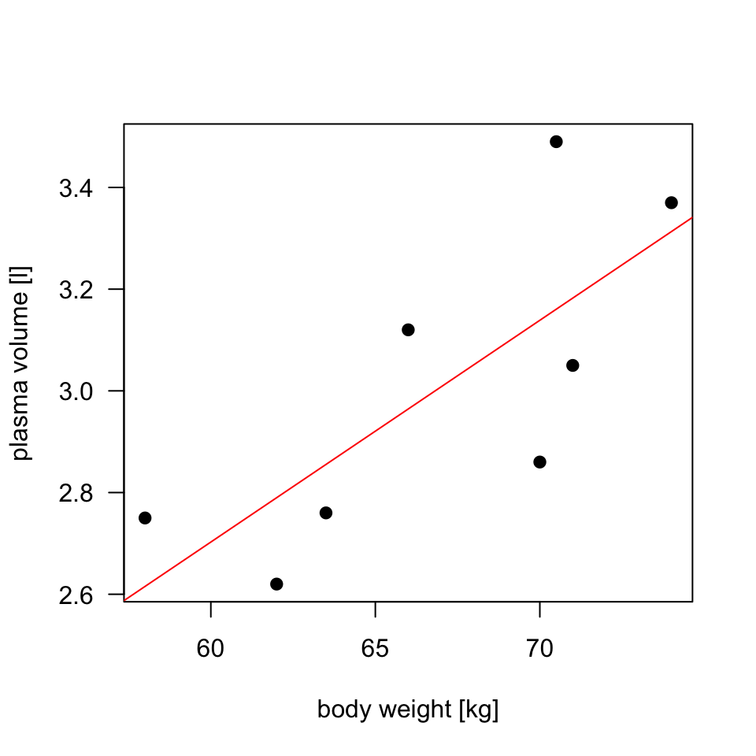

Session regression I
================

### Learning outcomes

  - understand simple linear regression model incl. terminology and
    mathematical notations
  - estimate model parameters and their standar error
  - use model for checking the association between *x* and *y*
  - use model for prediction
  - assees model accuracy with RSE and R\[^2\]
  - check model assumptions
  - to be able to fit regression line and interpret regression model
  - to be able to use `lm` function in R for model fitting, obtaining
    confidence interval and predictions

## Linear Regression

Linear regression is a very simple approach for supervised learning,
when numerical outcome and numerical exposure are concerned. The method
of linear regression is used to estimate the best-fitting straight line
to describe the association. With linear regression we can answer
questions incl.:

  - is there a relationship between exposure (e.g. body weigth) and
    outcome (e.g. plasma volume)?
  - how strong is the relationship between the two variables
  - what will be a predicted value of the outcome given a new set of
    exposure values
  - how accurately can we predict outcome

### Example data

Example data contain the body weight and plasma volume for eight healthy
men.

``` r
weight <- c(58, 70, 74, 63.5, 62.0, 70.5, 71.0, 66.0) # body weight (kg)
plasma <- c(2.75, 2.86, 3.37, 2.76, 2.62, 3.49, 3.05, 3.12) # plasma volume (liters)
```

Scatter plot of the data shows that high plasma volume tends to be
associated with high weight and *vice verca*. Linear regrssion gives the
equation of the straight line that best describes how the outcome
changes (increase or decreases) with a change of exposure variable (in
red)


The equation of the regression line is:

\[y=beta_0 + beta_1x\]

### Estimating the Coefficients

### Assessing the Accuracy of the Coefficient Estimates

### Asesssing the Accuracy of the Model

    ## [1] 0.7591266

    ## 
    ## Call:
    ## lm(formula = y ~ x)
    ## 
    ## Residuals:
    ##      Min       1Q   Median       3Q      Max 
    ## -0.27880 -0.14178 -0.01928  0.13986  0.32939 
    ## 
    ## Coefficients:
    ##             Estimate Std. Error t value Pr(>|t|)  
    ## (Intercept)  0.08572    1.02400   0.084   0.9360  
    ## x            0.04362    0.01527   2.857   0.0289 *
    ## ---
    ## Signif. codes:  0 '***' 0.001 '**' 0.01 '*' 0.05 '.' 0.1 ' ' 1
    ## 
    ## Residual standard error: 0.2188 on 6 degrees of freedom
    ## Multiple R-squared:  0.5763, Adjusted R-squared:  0.5057 
    ## F-statistic:  8.16 on 1 and 6 DF,  p-value: 0.02893

    ##          x 
    ## 0.01526836

    ##        x 
    ## 1.023998

## Multiple linear regression

### Estimating the Regression Coefficients

### Estimating coefficients

### Relationship between the response and predictors

### Model fit

### Predictions

### Qualitative predictors

### Interaction terms

### Non-linear transformation of the predictors

### Potential problems: non-linearity, collinearity

### Logistic regression
