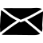

 

#####  Introduction to biostatistics and machine learning
This is a generic website containing teaching and learning materials used during the "Introduction to biostatistics and machine learning" course organised by NBIS, National Bioinformatics Infrastructure Sweden. The course is open for PhD students, postdocs, researchers and other employees in need of biostatistical skills within all Swedish universities. The materials are geared towards life scientists wanting to be able to understand and use basic statistical and machine learning methods.

The course is run via Canvas and is advertised via SciLifeLab website [https://www.scilifelab.se/events/#calendar](https://www.scilifelab.se/events/#calendar) and [NBIS website](https://nbis.se/training/events.html).

The latest Canvas course is here: [https://uppsala.instructure.com/courses/74597](https://uppsala.instructure.com/courses/74597).

 

#####  Course content
- Probability theory
- Hypothesis testing and confidence intervals
- Resampling
- Linear regression methods
- Introduction to generalized linear models
- Model evaluation
- Unsupervised learning incl. clustering and dimension reduction methods
- Supervised learning incl. classification

#####  Generic schedule
A typical schedule is under [Schedule tab](schedule.md). Times and sessions may vary slightly from one course event to another.

 

#####  Education
In this course we focus on an active learning approach. The course participants are expected to do some pre-course reading and exercises, corresponding up to 40h studying. The education consists of teaching blocks alternating between mini-lectures, group discussions, live coding sessions etc.

 

#####  Entry requirements
- Basic R programming skills
- BYOL (bring your own laptop) with R and RStudio installed
- No prior biostatistical knowledge is assumed

 

#####  Selection criteria
 - The course can accommodate maximum of 25 participants. If we receive more applications, participants will be selected based on several criteria. Selection criteria include correct entry requirements, motivation to attend the course as well as gender and geographical balance.
 - NBIS prioritises academic participants (students, staff, affiliated researchers) in Sweden. We can accept participants from industry and/or outside Sweden if we have seats available and the requirements criteria are met.

 
#####  Fees
- Check Canvas website for the latest information.

 
#####  Course credits
- Upon successful course completion, assessed based on active participation in all course session, we will issue a course certificate.

- Please note that we are **not** able to provide any formal university credits (högskolepoäng). Many universities, however, recognize the attendance in our courses, and award 1.5 HPs, corresponding to 40 h of studying. It is up to participants to clarify and arrange credit transfer with the relevant university department.

 
#####  Teaching team
- [Olga Dethlefsen][olga] <<olga.dethlefsen@nbis.se>>
- [Eva Freyhult][eva] <<eva.freyhult@nbis.se>>
- [Bengt Sennblad][bengt] <<bengt.sennblad@scilifelab.se>>
- [Payam Emami][payam] <<payam.emami@nbis.se>>  
- [Mun-Gwan Hong](mungwan) <<mungwan.hong@nbis.se>>

 

[eva]: https://nbis.se/about/staff/eva-freyhult/
[olga]: https://nbis.se/about/staff/olga-dethlefsen/
[bengt]: https://nbis.se/about/staff/bengt-sennblad/
[payam]: https://nbis.se/about/staff/payam-emami/
[mungwan]: https://nbis.se/about/staff/mungwan-hong/

#####  Contact us
- **edu.ml-biostats@nbis.se**
- olga.dethlefsen@nbis.se
- eva.freyhult@nbis.se
