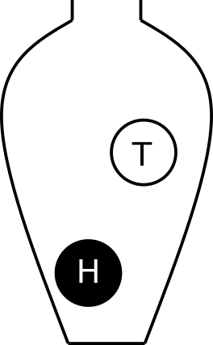

class: spaced

```{r, include=FALSE}
require(tidyverse)
require(ggplot2)
require(reshape2)
require(knitr)
require(kableExtra)
knitr::opts_chunk$set(fig.width=3.5, fig.height=3.5, echo = FALSE, cache=TRUE, error=FALSE, warnings=FALSE, dpi=600)
options(digits=2)
```

name: introprob
layout: true
# Probability theory

---

Probability describe the likeliness of an event to occur.

Probability rules can be expressed in terms of sets.

The *sample space*, $S$, describe all possible outcomes of an experiment, e.g. a dice experiment $S = \{1, 2, 3, 4, 5, 6\}$ 

An *event*, $E$, is a subset of $S$. $E \subseteq S$

The probabiity of $E$ is denoted $P(E)$

---

### Axioms of probability

1. $0 \leq P(E) \leq 1$
2. $P(S) = 1$
3. If $E$, $F$ are disjoint events, then $P(E \cup F) = P(E) + P(F)$

--

The complement, $E'$, of $E$ is all outcomes in $S$ not in $E$. $P(E') = 1 - P(E)$

---

### Conditional probability
Let $E,F \subseteq S$ be two events that $P(E)>0$ then the conditional probability of $F$ given that $E$ occurs is defined to be: $$P(F|E) = \frac{P(E\cap F)}{P(E)}$$

**Product rule** follows conditional probability: let $E,F \subseteq S$ be events such that $P(E)>0$ then: $$P(E \cap F) = P(F|E)P(E)$$

---
name: RV
layout: true
# Random variables

A *random variable* describes the outcome of a random experiment.

---
- The weight of a random newborn baby, $W$, $P(W>4.0kg)$
- The smoking status of a random mother, $S$, $P(S=1)$
- The hemoglobin concentration in blood, $Hb$, $P(Hb<125 g/L)$
- The number of mutations in a gene, $M$
- BMI of a random man, $B$
- Weight status of a random man (underweight, normal weight, overweight, obese), $W$
- The result of throwing a die, $X$

```{r, fig.show="hold", out.width="50%", fig.align="center"}

```
???
Whenever chance is involved

---

A random variable can not be predicted exactly, but the probability of all possible outcomes can be described.

Random variables: $X, Y, Z, \dots$, in general a capital letter.

Probability: $P(X=5)$, $P(Z>0.34)$, $$P(W \geq 3.5 | S = 1)$$

*Observations* of the random variable, $x, y, z, \dots$

The **sample space** is the collection of all possible observation values.

The *population* is the collection of all possible observations.

A *sample* is a subset of the population.

???
Whenever chance is involved in the outcome of an experiment the outcome is a random variable.

Note, the population is not always countable.

the probability that $X \geq 3.5$ if $S = 1$

the probability that a smoking mother has a baby with birth weight of 3.5 kg or more"
---
layout:false

# The urn model

```{r urns, echo=FALSE, fig.cap="A fair coin, age and pollen allergy status of a group of people.", out.width = '20%', fig.align="center", fig.show="hold"}

knitr::include_graphics("figures/ageurn.png")
knitr::include_graphics("figures/pollenageurn.png")
```

By drawing balls from the urn with (or without) replacement probabilities and other properties of the model can be inferred.

---
name: discrete
layout:true

# Discrete random variables

---

A discrete random number has countable number of outcome values.

{1,2,3,4,5,6}; {red, blue, green}; {tiny, small, average, large, huge} or all integers.

A discrete random variable can be described by its *probability mass function*, pmf.

The probability that the random variable, $X$, takes the value $x$ is denoted $P(X=x) = p(x)$. Note that:
  
1. $0 \leq p(x) \leq 1$, a probability is always between 0 and 1.
2. $\sum p(x) = 1$, the sum over all possible outcomes is 1.

---

## Example: a fair six-sided die

```{r, fig.show="hold", out.width="50%", fig.align="center"}

```

Possible outcomes: $\{1, 2, 3, 4, 5, 6\}$

---

### Example: a fair six-sided die

The probability mass function;

```{r}
kable(matrix(c(1:6,rep(1/6,6)),ncol=6, byrow=TRUE, dimnames=list(c('x','p(x)'), c()))) %>% kable_styling(full_width = FALSE)
```

```{r die, fig.height=3, fig.width=7, out.width="45%", fig.align='center'}
plot(data.frame(x=1:6, p=1/6) %>% ggplot(aes(x=x, y=p)) + geom_bar(stat="identity") + theme_bw() + ylim(c(0,.25)) + scale_x_continuous(breaks = 1:6))
``` 
---

### Example: Smoking status


The random variable has two possible outcomes; non-smoker (0) and smoker (1). The probability of a random mother being a smoker is 0.39.


```{r}
kable(matrix(c("0","0.61","1","0.39"),ncol=2, dimnames=list(c('x','p(x)'), c('non-smoker','smoker')))) %>% kable_styling(full_width = FALSE)
```

---

### Example: Number of bacterial colonies


```{r CFU, fig.height=3, fig.width=7}
x=1:50
ggplot(data.frame(x=x, fx=dpois(x, lambda=25)), aes(x,fx)) + geom_bar(stat="identity") + theme_bw() + ylab("p(x)")
```

---

## Expected value

When the probability mass function is know, the *expected value* of the random variable, the population mean, can be computed.

For a *uniform distribution*, where every object has the same probability;

$$E[X] = \mu = \frac{1}{N}\sum_{i=1}^N x_i$$

In general,

$$E[X] = \mu = \sum_{i=1}^N x_i p(x_i)$$

---
## Expected value
**Linear transformations and combinations**
  
  $$E(aX) = a E(X)$$
  
  $$E(X + Y) = E(X) + E(Y)$$
  
  $$E[aX + bY] = aE[X] + bE[Y]$$
---

## Variance

The variance is a measure of spread and is defined as the expected value of the squared distance from the population mean;

$$var(X) = \sigma^2 = E[(X-\mu)^2] = \sum_{i=1}^n (x_i-\mu)^2 p(x_i)$$
---
## Variance
**Linear transformations and combinations**
  
  $$var(aX) = a^2 var(X)$$
      
For independent random variables X and Y
    
  $$var(aX + bY) = a^2var(X) + b^2var(Y)$$


---
layout: false
name:sim
layout: true
# Simulate distributions

---

Once the distribution is known, we can compute probabilities, such as $P(X=a), P(X<a)$ and $P(X \geq a)$. 

If the distribution is not known, simulation might be the solution.

---

In a single coin toss the probabity of heads is 0.5. 

In 20 coin tosses, what is the probability of at least 15 heads?

--

.left-column[
```{r coinurn, out.width="80%", echo=FALSE, fig.align="lecenter"}

```
]
.right-column[
The outcome of a single coin toss is a random variable, $X$, that can be described using an urn model.

Probability of heads; $P(X=H) = 0.5$

To simulate tossing 20 coins (or one coin 20 times), draw a ball from the urn 20 times! 

Remember to replace the ball after each draw to keep the $P(X=H)$ constant.
]

*Simulation in R*

???
In R we can simulate random draws from an urn model using the function `sample`.

```{r coin, echo=TRUE}
# A single coin toss
sample(c("H", "T"), size=1)
# Another coin toss
sample(c("H", "T"), size=1)
```

Every time you run the sample a new coin toss is simulated. 

The argument `size` tells the function how many balls we want to draw from the urn. To draw 20 balls from the urn, set `size=20,` remember to replace the ball after each draw!

```{r coins, echo=TRUE}
# 20 independent coin tosses
(coins <- sample(c("H", "T"), size=20, replace=TRUE))
```

How many heads did we get in the 20 random draws?

```{r, echo=TRUE}
# How many heads?
sum(coins == "H")
```

We can repeat this experiment (toss 20 coins and count the number of heads) several times to estimate the distribution of number of heads in 20 coin tosses.

To do the same thing several times we use the function `replicate.`

To simulate tossing 20 coins and counting the number of heads 10000 times, do the following;

```{r Nheads, echo=TRUE}
Nheads <- replicate(10000, {
  coins <- sample(c("H", "T"), size=20, replace=TRUE)
  sum(coins == "H")
})
```

Plot distribution of the number of heads in a histogram.

```{r histNheads, out.width="70%", echo=TRUE}
hist(Nheads, breaks=0:20)
```

Now, let's get back to the question; when tossing 20 coins, what is the probability of at least 15 heads?

$P(X \geq 15)$

Count how many times out of our `r length(Nheads)` exeriments the number is 15 or greater

```{r, echo=TRUE}
sum(Nheads >= 15)
```

From this we conclude that

$P(X \geq 15) =$ `r sum(Nheads>=15)`/`r length(Nheads)` = `r sum(Nheads>=15)/length(Nheads)`

---
layout: false

# Bernoulli trial

A Bernoulli trial is a random experiment with two outcomes; *success* (1) and *failure* (0).

The outcome of a Bernoulli trial is a discrete random variable, $X$.

The probability of success is constant, $P(X=1) = p$.

It follows that the probabaility of failure is $P(X=0) = 1 - p$.


Using the definitions of expected value and variance it can be shown that;

$$E[X] = p\\
var(X) = p(1-p)$$

---

# Binomial distribution

The number of successes in a series of $n$ independent and identical Bernoulli trials is a discrete random variable, $X$.

$X = \sum_{i=0}^n Z_i,$

where all $Z_i$ describe the outcome of independent and identical Bernoilli trials with probability $p$ for *success*.

The probability mass function of $X$, called the binomial distribution, is

$$P(X=k) = {n \choose k} p^k (1-p)^{n-k}$$

$$E[X] = np\\
var(X) = np(1-p)$$


---
layout:false

# Hypergeometric distribution

The hypergeometric distribution describe the number of successes in a series of $n$ draws *without* replacement, from a population of size $N$ with $Np$ objects of interest (successes).

The probability density function

$$P(X=k) = \frac{{Np \choose k}{N-Np \choose n-k}}{N \choose n}$$

???
*Example:* Overrepresentation of iron metabolism genes in a list of significant genes.

You have a population of $N$ genes, of which $Np$ belong to the pathway *iron metabolism*. A statistiction gave you a list of $n$ interesting genes of which $k$ genes belong to the *iron metabolism*. If the statistician just selected the top list at random, the hypergeometric distribution can be used to compute the probability of getting $k4 successes, i.e. genes that belong to the *iron metabolism*.


---
layout:true

# Poisson distribution

The Poisson distribution describes the number of times a rare event occurs in a large number of trials.

---

The probability mass function;

$$P(X=k) = \frac{\mu}{k!}e^{-\mu},$$
where $\mu$ is the expected value, which is $\mu = n \pi$, where $n$ is the number of objects sampled from the population and $\pi$ is the probability of a single object.

The Poisson distribution can approximate the binomial distribution if $n$ is large and $\pi$ is small, $n>10, \pi < 0.1$.

---

### Example

A rare disease has a very low probability for a single individual. The number of individuals in a large population that catch the disease in a certain time period can be modelled using the Poisson distribution.