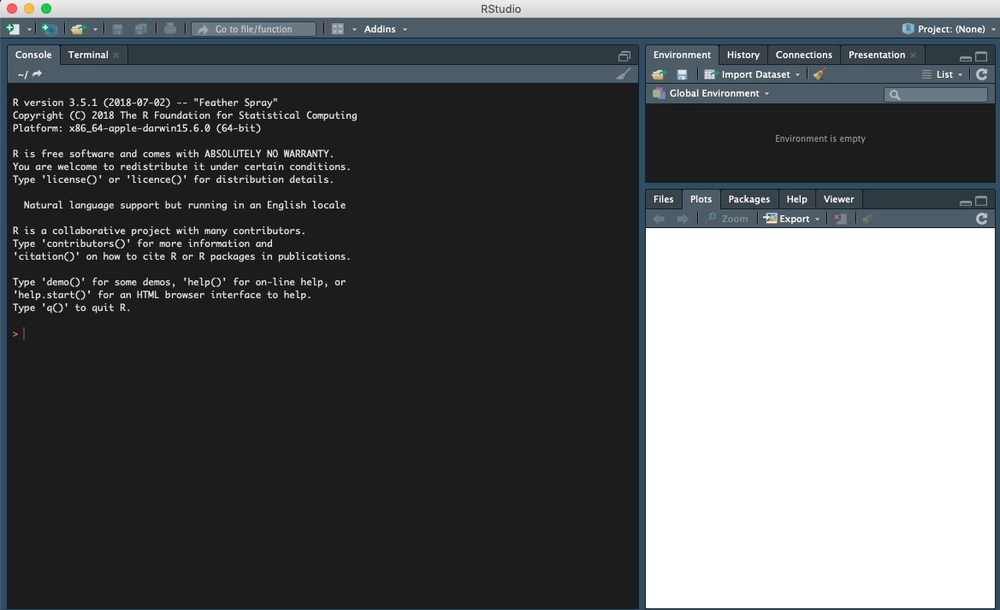
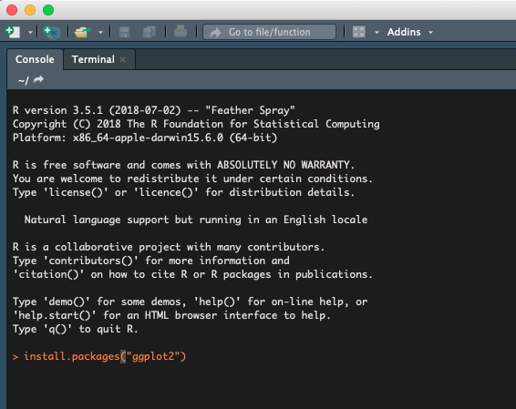

# Pre-course
There are few things **to do** before the course starts. These include both setting up computers as well as pre-course studying. Please read carefully and follow the instructions so we can have a good start. Contact us in case anything in unclear.

## Content
- [R & R-Studio](#R)
- [R libraries and datasets](#Rlib)
- [Recommended reading](#reading)
- [Recommended exercises](#exercises)
- [Additional resources](#extra)

---

### R & R-Studio <a name="R"></a>

During the course we will run scripts locally on laptops using `R` and `R-Studio`. To be able to follow exercises we ask you to install R and R-Studio on your laptop. Both of these work on computers running Linux, Windows and Macintosh operative systems. R-studio is a set of tools as well as an editor that facilitates the use of R. Over the last years it has become a very popular tool and in many ways become a de-facto standard for working with R.

Note that on same operative systems it will be easier to install and run R and R-studio if you are administrator of your own computer and hence are allowed to install software on your machine. If you do not have these privileges please ask your system administrator to install the latest version of R and R-studio.

##### Install R

Install version 3.5.0 or higher

1.  Go to [CRAN](https://cran.rstudio.com)
2.  Click on the link corresponding to your operative system
3.  Download the recommended files for your system.
4.  Run the installer or move the downloaded files to suitable place on
    your computer.


##### Install R Studio

Go to the web page [rstudio](https://www.rstudio.com/products/rstudio/download/) download the installer corresponding to your operative system. Unpack the installer and install the app on a suitable place on your system.

#### Test installations

If the installation above went without any problem you should be able to fire up R-studio and see something like the following:


----------
### R libraries and datasets <a name="Rlib"></a>

By default, R instals a set of packages during installation. R package, is a basic unit of sharable code, that bundles together code, data, documentation and tests. In the course we will be using both default and additional R packages; the latter we need to install.

#### Install R packages
To install R packages, open R-Studio and in the console, type

``` r
# For CRAN packages
install.packages(ggplot2)
install.packages(reshape2)
install.packages(dplyr)
install.packages(UsingR)
install.packages(googledrive)
install.packages(devtools)

# For developmental packages, not on CRAN
devtools::install_github("tidyverse/googlesheets4")
```


#### Test installation
1. Download R markdown file that we have prepared for you from here [Rtest.Rmd](precourse/Rtest.Rmd)
2. Open R-Studio
3. Open Rtest.Rmd by clicking on `File` -> `Open file`and navigating to the `Rtest.Rmd` location on your computer
4. Read through the document to understand more about R Markdown
5. Press `Knit` button
6. Email us <<olga.dethlefsen@nbis.se>> and <<eva.freyhult@nbis.se>> the resulting `Rtest.html` file. If installation was successful, `Rtest.Rmd` will render to `Rtest.html` with KnitR.
7. Otherwise, you will get error messages in the console. Try to trouble shoot, i.e. by re-installing packages. If you do not manage, email us saying that you will need help during the course, so we can plan accordingly.

------

### Recommended reading <a name="reading"></a>
------


### Recommended exercises <a name="exercises"></a>

-------
### Additional resources <a name="extra"></a>

For those of you wanting to start ahead and/or brush up on various skills before the course

##### Computer skills
- [Best first R tutorial](https://www.nceas.ucsb.edu/files/scicomp/Dloads/RProgramming/BestFirstRTutorial.pdf)  
  A nice self learn tutorial to R, introducing many central concepts to R.
- [A short introduction to R](https://cran.r-project.org/doc/contrib/Torfs+Brauer-Short-R-Intro.pdf)  
  A very short introduction to using R.
- More on Rnw and KnitR
