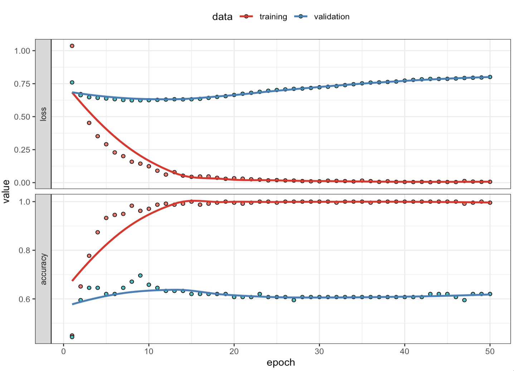
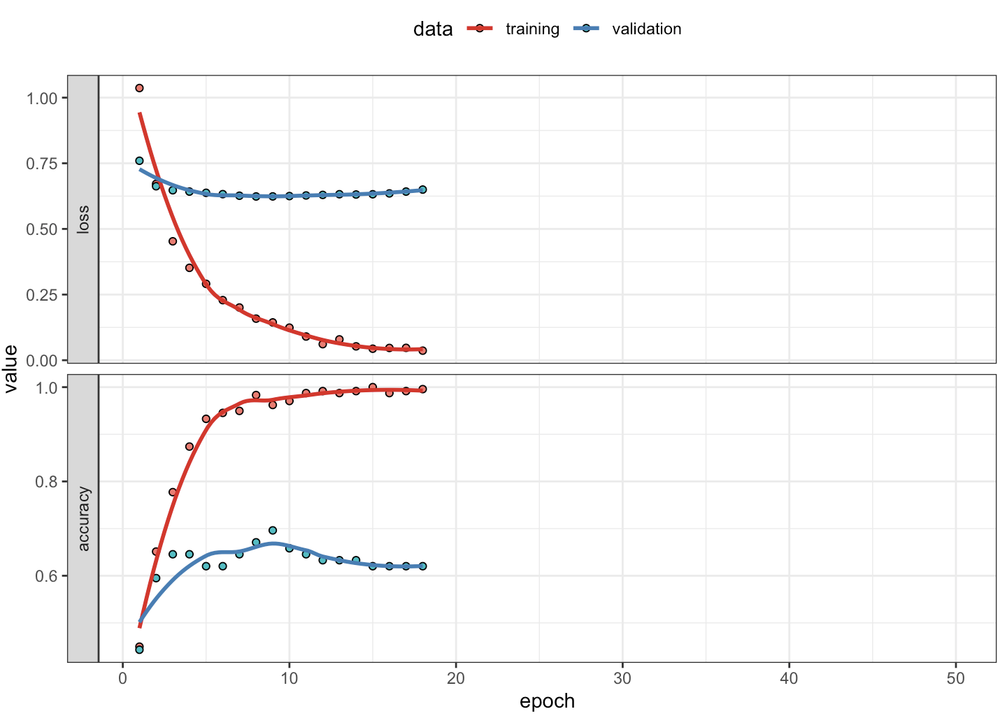
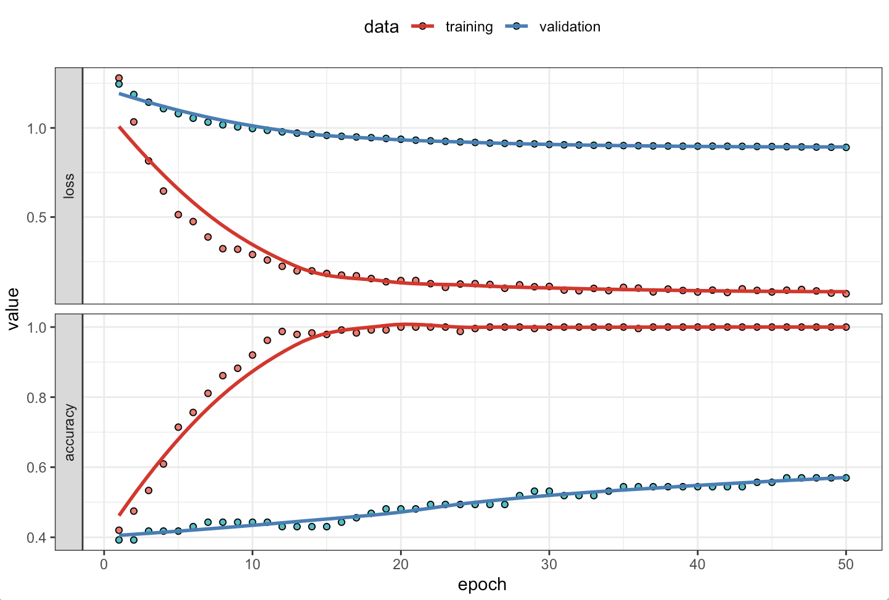
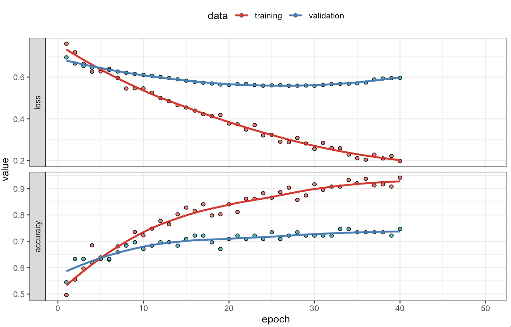
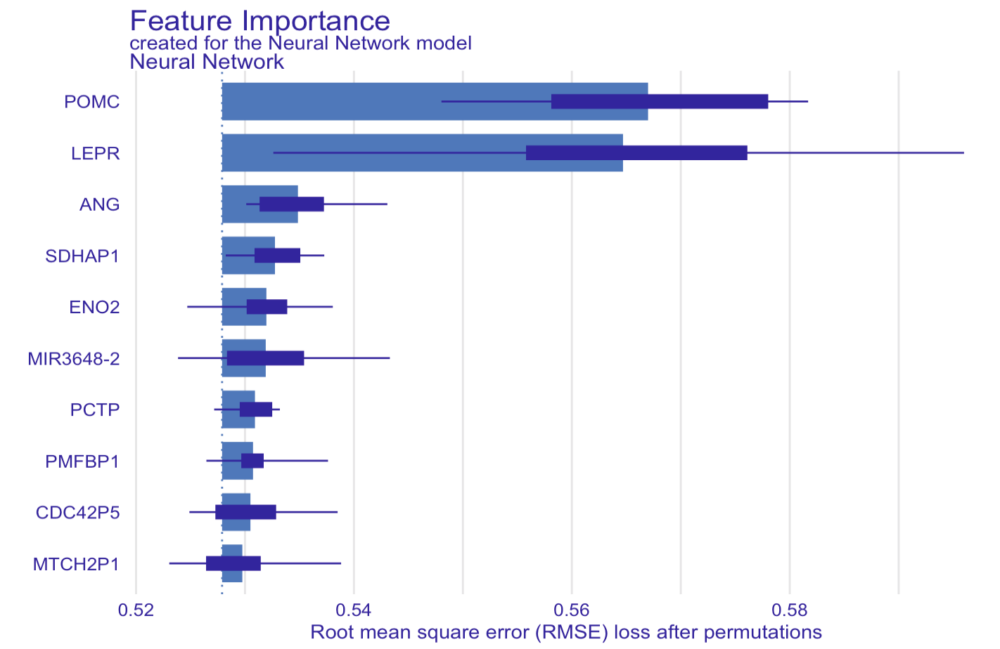

# Introduction

We are going to continue with our exploration of the biology of obesity. Let's see if we can improve our predictive using the less well-known genes by using neural networks. 

We will train a forward feedback network, also known as multilayer perceptrons (MLPs).

## Load packages
```{r}
#| label: load-packages
#| eval: true

# load packages
rm(list=ls())
library(tidyverse)
library(fastDummies)
library(pROC)
library(class)
library(reticulate)
library(keras)
library(tensorflow)

tensorflow::set_random_seed(123)

#use_python("/Users/olga.hrydziuszko/miniconda3/envs/r-reticulate/bin/python")
use_condaenv("r-reticulate", required = TRUE)

```

## Load data

```{r}
#| label: load-data
#| eval: false

# Load clinical data
data_obesity <- read_csv("data/data-obesity.csv") 

# Load gene expression data
data_expr <- read_csv("data/data-obesity-genes.csv")
genes_all <- colnames(data_expr)[-1]  # Exclude the 'id' column

# Genes
gens_known <- c("FTO", "MC4R", "LEP")
genes_other <- setdiff(genes_all, gens_known)
```

## Split Data
```{r}
#| label: split-data
#| eval: false

# join gene expression data with clinical data
data <- data_obesity %>%
  left_join(data_expr, by = "id") %>%
  dplyr::select("obese", all_of(genes_other)) %>%
  na.omit()

# select top 100 genes based on variance
# Calculate variance for each gene
gene_vars <- data %>%
  select(-obese) %>%
  summarise(across(everything(), var)) %>%
  pivot_longer(everything(), names_to = "gene", values_to = "variance")

# three-way split: train (60%), validation (20%), test (20%)
set.seed(123)
n <- nrow(data)
idx <- sample(seq_len(n))
idx_train <- idx[1:floor(0.6 * n)]
idx_valid <- idx[(floor(0.6 * n) + 1):floor(0.8 * n)]
idx_test  <- idx[(floor(0.8 * n) + 1):n]

data_train <- data[idx_train, ]
data_valid <- data[idx_valid, ]
data_test  <- data[idx_test, ]

# To keep focus on the important parts, we will skip feature engineering
# and we will just scale all data
x_train <- data_train %>%
  dplyr::select(-obese) %>%
  as.matrix() %>%
  scale()

x_valid <- data_valid %>%
  dplyr::select(-obese) %>%
  as.matrix() %>%
  scale()

x_test <- data_test %>%
  dplyr::select(-obese) %>%
  as.matrix() %>%
  scale()

# Separate and format target variable
y_train <- data_train$obese
y_train <- ifelse(y_train == "Yes", 1, 0) 

y_valid <- data_valid$obese
y_valid <- ifelse(y_valid == "Yes", 1, 0)

y_test <- data_test$obese
y_test <- ifelse(y_test == "Yes", 1, 0)

```

## Train Feedforward Neural Network

Let's fit a simple feedforward neural network using the Keras package. We will use a sequential model with dense layers, and compile it with the Adam optimizer and binary crossentropy loss function.

In particular, we will use a simple architecture with two hidden layers, and we will use dropout to prevent overfitting. 

This neural network is well-suited for the obesity classification task because:

- It accepts high-dimensional gene expression input, which can contain complex, nonlinear patterns.
- The first dense layer with 64 ReLU units learns rich feature representations from gene data.
- Dropout layers (0.3 and 0.2) help prevent overfitting, which is critical when working with many features and relatively few samples.
- The final dense layer uses a sigmoid activation to output a probability of obesity (binary classification).
- This architecture is flexible and efficient enough to model subtle interactions between genes that simpler models might miss.

```{r}
#| label: define-keras-model
#| eval: false
#| include: true
#| message: false
#| warning: false

# Define model
model <- keras_model_sequential() %>%
  layer_dense(units = 64, activation = "relu", input_shape = ncol(x_train)) %>%
  layer_dropout(0.3) %>%
  layer_dense(units = 32, activation = "relu") %>%
  layer_dropout(0.2) %>%
  layer_dense(units = 1, activation = "sigmoid")

# Compile model
model %>% compile(
  optimizer = "adam",
  loss = "binary_crossentropy",
  metrics = c("accuracy")
)

# Fit model
history <- model %>% fit(
  x_train, y_train,
  epochs = 50,
  batch_size = 32,
  validation_data = list(x_valid, y_valid),
  verbose = 1
)

plot(history) + 
  theme_bw() + 
  scale_color_brewer(palette = "Set1") + 
  theme(legend.position = "top")

```



When training a neural network, we divide learning into **batches** and **epochs**:

- **Batch**: A small subset of the training data processed before the model updates its weights.  
  Above, we used `batch_size = 32`, meaning the model updates after every 32 samples.

- **Epoch**: One complete pass through the entire training dataset.  
  With `epochs = 50`, the model sees all training data 50 times, updating weights incrementally after each batch.

Smaller batches mean more frequent updates (faster learning, more noise).  Larger batches give more stable updates but may require more memory.

In the plot:

- After ca. 10 epochos, validation loss starts increasing while training loss continues to decrease.
- Validation accuracy plateaus early, while training accuracy keeps improving, reaching nearly 100%.
- A big gap appears between training and validation performance.

The above points are a classic sign of **overfitting**: the model is learning training data too well, but failing to generalize to new (validation) data.

Let's see how well the model predicts on the test set.

```{r}
#| label: evaluate-test
#| eval: false

# Evaluate on test data
model %>% evaluate(x_test, y_test)

#     loss accuracy 
# 1.348176 0.550000 

```

The model achieves an accuracy of ca. 55% on the test set, which is not significantly better than random guessing (50% for binary classification).

To improve generalization, we can consider:

- Using early stopping
- Reducing model complexity
- Narrowing down the number of features

### Adding early stopping

**Early stopping** is a regularization technique used to prevent overfitting during training.

The idea is to: 

→ Monitor the model's performance on a validation set during training.  
→ Stop training when validation performance stops improving for a few consecutive epochs.

This avoids wasting time and computing resources on extra epochs that only improve training accuracy while hurting generalization.

```{r}
#| label: fit-with-early-stopping
#| eval: false

tensorflow::set_random_seed(123)

# Fit model using early stopping
# Define model
model_1 <- keras_model_sequential() %>%
  layer_dense(units = 64, activation = "relu", input_shape = ncol(x_train)) %>%
  layer_dropout(0.3) %>%
  layer_dense(units = 32, activation = "relu") %>%
  layer_dropout(0.2) %>%
  layer_dense(units = 1, activation = "sigmoid")

# Compile model
model_1 %>% compile(
  optimizer = "adam",
  loss = "binary_crossentropy",
  metrics = c("accuracy")
)

# Patience is the number of epochs with no improvement before stopping
# Let's set it to 10 to allow the model some flexibility to improve
history_1 <- model_1 %>% fit(
  x_train, y_train,
  epochs = 50,
  batch_size = 32,
  validation_data = list(x_valid, y_valid),
  callbacks = list(
    callback_early_stopping(patience = 10, restore_best_weights = TRUE)
  ),
  verbose = 1
)

plot(history_1) + 
  theme_bw() + 
  scale_color_brewer(palette = "Set1") + 
  theme(legend.position = "top")

```


```{r}
#| label: evaluate-test-estop
#| eval: false

# Evaluate on test data
model_1 %>% evaluate(x_test, y_test)

#      loss  accuracy 
# 0.7922236 0.5250000 

```

Ok, the accuracy has not improve much. Btw, you may be seeing slightly different values when running your code, because of the random initialization of the model weights. Let's try reduce model complexity by reducing the number of hidden layers and units.

### Reducing model complexity

```{r}
#| label: fit-with-redcomp
#| eval: false

# Define model
model_3 <- keras_model_sequential() %>%
  layer_dense(units = 16, activation = "relu", input_shape = ncol(x_train)) %>%
  layer_dropout(0.3) %>%
  layer_dense(units = 1, activation = "sigmoid")

# Compile model
model_3 %>% compile(
  optimizer = "adam",
  loss = "binary_crossentropy",
  metrics = c("accuracy")
)

# Patience is the number of epochs with no improvement before stopping
history_3 <- model_3 %>% fit(
  x_train, y_train,
  epochs = 50,
  batch_size = 32,
  validation_data = list(x_valid, y_valid),
  callbacks = list(
    callback_early_stopping(patience = 10, restore_best_weights = TRUE)
  ),
  verbose = 1
)

plot(history_3) + 
  theme_bw() + 
  scale_color_brewer(palette = "Set1") + 
  theme(legend.position = "top")

```



```{r}
#| label: evaluate-test-redcomp
#| eval: false

# Evaluate on test data
model_3 %>% evaluate(x_test, y_test)

#     loss accuracy 
# 1.067796 0.450000 

```

The model is still not performing well. Based on the plot we can see that the model is learning from the training data, but is not generalizing well to unseen validation data. There’s no severe overfitting, but the gap between training and validation performance is large.

This likely reflects underlying data limitations, not just model architecture. 

- We have 1000 input features (genes) and ca. 400 sample, meaning we have less samples than features. 
- Some use a rule of thumb that ideally you want 10 times more samples than features for deep models. 
- Here, the ratio is 0.4:1, meaning the model has more freedom to memorize than to generalize.

Let's try reducing number of input features, by keeping top 50 genes based on the variance.

### Reducing number of features

```{r}
#| label: select-relevant-ft
#| eval: false

# join gene expression data with clinical data
data <- data_obesity %>%
  left_join(data_expr, by = "id") %>%
  dplyr::select("obese", all_of(genes_other)) %>%
  na.omit()

# select top 50 genes based on variance
# Calculate variance for each gene
gene_vars <- data %>%
  select(-obese) %>%
  summarise(across(everything(), var)) %>%
  pivot_longer(everything(), names_to = "gene", values_to = "variance")

# Select top 100 most variable genes
top_genes <- gene_vars %>%
  arrange(desc(variance)) %>%
  slice_head(n = 50) %>%
  pull(gene)

# Subset the data to use only top 50 genes
data <- data %>%
  select(obese, all_of(top_genes))

# three-way split: train (60%), validation (20%), test (20%)
set.seed(123)
n <- nrow(data)
idx <- sample(seq_len(n))
idx_train <- idx[1:floor(0.6 * n)]
idx_valid <- idx[(floor(0.6 * n) + 1):floor(0.8 * n)]
idx_test  <- idx[(floor(0.8 * n) + 1):n]

data_train <- data[idx_train, ]
data_valid <- data[idx_valid, ]
data_test  <- data[idx_test, ]

# To keep focus on the important parts, we will skip feature engineering
# and we will just scale all data
x_train <- data_train %>%
  dplyr::select(-obese) %>%
  as.matrix() %>%
  scale()

x_valid <- data_valid %>%
  dplyr::select(-obese) %>%
  as.matrix() %>%
  scale()

x_test <- data_test %>%
  dplyr::select(-obese) %>%
  as.matrix() %>%
  scale()

# Separate and format target variable
y_train <- data_train$obese
y_train <- ifelse(y_train == "Yes", 1, 0) 

y_valid <- data_valid$obese
y_valid <- ifelse(y_valid == "Yes", 1, 0)

y_test <- data_test$obese
y_test <- ifelse(y_test == "Yes", 1, 0)

# Fit model using early stopping
model_4 <- keras_model_sequential() %>%
  layer_dense(units = 64, activation = "relu", input_shape = ncol(x_train)) %>%
  layer_dropout(0.3) %>%
  layer_dense(units = 32, activation = "relu") %>%
  layer_dropout(0.2) %>%
  layer_dense(units = 1, activation = "sigmoid")

# Compile model
model_4 %>% compile(
  optimizer = "adam",
  loss = "binary_crossentropy",
  metrics = c("accuracy")
)

history_4 <- model_4 %>% fit(
  x_train, y_train,
  epochs = 50,
  batch_size = 32,
  validation_data = list(x_valid, y_valid),
  callbacks = list(
    callback_early_stopping(patience = 10, restore_best_weights = TRUE)
  ),
  verbose = 1
)

plot(history_4) + 
  theme_bw() + 
  scale_color_brewer(palette = "Set1") + 
  theme(legend.position = "top")

```



```{r}
#| label: evaluate-test-ft
#| eval: false

# Evaluate on test data
model_4 %>% evaluate(x_test, y_test)

#      loss  accuracy 
# 0.6893102 0.6500000

```

The accuracy on the test set has improved to 65% and there is smaller gap between training and validation loss (and accuracy) which is better than our first original model. However, the plot still shows sign of overfitting, as the validation loss starts increasing after a few epochs while training loss keeps decreasing.

Most likely the model is too complex for the amount of data. We could continue trying to simplify the model further, e.g. by reducing the number of hidden layers or units, or adding regularization techniques like L1/L2 regularization. Most likely we would need much more data to use neural network effectively in this case. 

Instead, let's try to visualize the feature importance of the model, and see whether we can see some familiar gene names that were identified as key features in the previous lab (Bagging, boosting, and stacking).

## DALEX

DALEX (Descriptive mAchine Learning EXplanations) works by wrapping a trained model with an explainer that defines how to generate predictions, and then applies model-agnostic techniques like permutation-based variable importance to assess how each feature impacts performance. It measures the increase in prediction error when a feature's values are randomly shuffled, indicating its relative importance.


```{r}
#| eval: false
#| include: false

library(DALEX)

# Wrap Keras model in a prediction function
predict_function <- function(model_4, newdata) {
  predict(model_4, as.matrix(newdata))
}

# Create DALEX explainer
explainer_nn <- explain(
  model = model_4,
  data = as.data.frame(x_test),
  y = y_test,
  predict_function = predict_function,
  label = "Neural Network"
)

# Plot feature importance (SHAP-like effect)
vip <- variable_importance(explainer_nn)

plot(vip, max_vars = 10)

```



# Comments

So why did we not achieve better results than with XGBoost, for which we got accuracy of 0.74?

Despite applying best practices like including early stopping, dropout regularization, simplified architecture, and focusing on the top 50 most variable genes the neural network did not outperform XGBoost on this classification task.

This is likely due to:

- Limited sample size: neural networks require large datasets to generalize well, while XGBoost is more robust on smaller datasets.
- High dimensionality: even after reduction, the gene expression space may still be too noisy or sparse for a neural net to learn reliably.
- XGBoost inherently handles feature selection and interaction more effectively for tabular data, while ANNs rely more on large-scale data to uncover complex patterns.
- In contrast, tree-based models like XGBoost are better suited for small, tabular datasets with heterogeneous signals which makes them a strong baseline for gene expression-based classification tasks like this.

# Task I

Can you modify the code above to try to predict BMI instead of obesity status?

Hint:

- update the final layer in the network, no activation is needed
- update the loss function to `mean_squared_error`
- and choose metric suitable for regression, e.g. `mean_absolute_error`