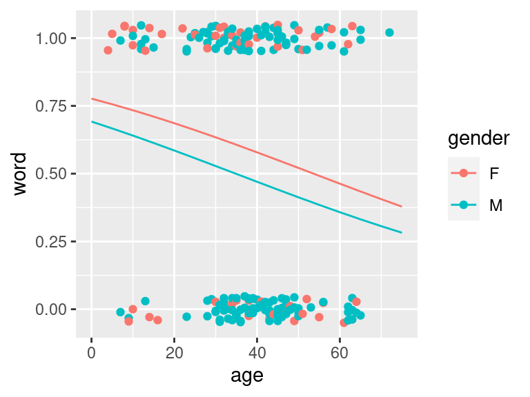

# Generalized linear models

**Aims**

- to briefly introduce GLMs via examples of modeling binary and count response

**Learning outcomes**

- to understand the limits of linear regression and the application of GLMs
- to be able to use `glm()` function to fit and interpret logistic and Poisson regression


## Why Generalized Linear Models (GLMs)
- GLMs extend linear model framework to outcome variables that do not follow normal distribution
- They are most frequently used to model binary, categorical or count data
- In the Galapagos Island example we have tried to model Species using linear model
- It kind of worked but the predicted counts were not counts (natural numbers) but rational numbers instead that make no sense when taking about count data
- Similarly, fitting a regression line to binary data yields predicted values that could take any value, including $<0$
- not to mention that it is hard to argue that the values of 0 and 1s are normally distributed

<div class="figure" style="text-align: center">

<p class="caption">(\#fig:unnamed-chunk-2)Example of fitting linear model to binary data, to model the acceptance to medical school, coded as 1 (Yes) and 0 (No) using GPA school scores. Linear model does not fit the data well in this case</p>
</div>

## Logistic regression
- [Yanny or Laurel auditory illusion](https://www.theguardian.com/global/video/2018/may/16/what-do-you-hear-in-this-audio-clip-yanny-or-laurel-takes-internet-by-storm-video) appeared online in May 2018. You could find lots of information about it, together with some plausible explanations why some people hear Yanny and some year Laurel
- One of the explanation is that with age we lose the ability to hear certain sounds
- To see if there is evidence for that, someone has already collected some data for 198 people including their age and gender


```r
# Read in and preview data
yl <- read.csv("data/lm/YannyLaurel.csv")
head(yl)
##     hear age gender
## 1  Yanny   4      F
## 2  Yanny   5      F
## 3  Yanny   7      M
## 4 Laurel   7      M
## 5  Yanny   8      F
## 6  Yanny   8      F
# Recode Laurel to 0 and Yanny as 1 in new variable
yl$word <- 0
yl$word[yl$hear=="Yanny"] <- 1

# Make some exploratory plots
par(mfrow=c(1,2))
plot(yl$age, yl$word, pch=19, xlab="age", ylab="", las=1)
boxplot(yl$age~yl$hear, xlab="", ylab="age", col="lightblue")
```

<div class="figure" style="text-align: center">

<p class="caption">(\#fig:unnamed-chunk-3)Yanny and Laurel auditory illusion data, Yanny (1), Laurel (0)</p>
</div>

- Since the response variable takes only two values (Yanny or Laurel) we use GLM model 
- to fit **logistic regression** model for the **probability of hearing Yanny**
- we let $p_i=P(Y_i=1)$ denote the probability of hearing Yanny (success)
- and we assume that the response follows binomial distribution: $Y_i \sim Bi(1, p_i)$ distribution 
- We can write the regression model now as: 
$$log(\frac{p_i}{1-p_i})=\beta_0 + \beta_1x_i$$
and given the properties of logarithms this is also equivalent to:
$$p_i = \frac{exp(\beta_0 + \beta_1x_i)}{1 + exp(\beta_0 + \beta_1x_i)}$$
- In essence, the GLM generalizes linear regression by allowing the linear model to be related to the response variable via a **link function**.
- Here, the **link function** $log(\frac{p_i}{1-p_i})$ provides the link between the binomial distribution of $Y_i$ (hearing Yanny) the linear predictor (age) 
- Thus **GLM model** can be written as $$g(\mu_i)=\mathbf{X}\boldsymbol\beta$$ where `g()` is the link function.
- We use `glm()` function in R to fit GLM models


```r
# fit logistic regression model
logmodel.1 <- glm(word ~ age, family = binomial(link="logit"), data = yl)

# print model summary
print(summary(logmodel.1))
```

```
## 
## Call:
## glm(formula = word ~ age, family = binomial(link = "logit"), 
##     data = yl)
## 
## Deviance Residuals: 
##     Min       1Q   Median       3Q      Max  
## -1.5319  -1.1656   0.8516   1.1376   1.5238  
## 
## Coefficients:
##             Estimate Std. Error z value Pr(>|z|)  
## (Intercept)  0.97429    0.42678   2.283   0.0224 *
## age         -0.02444    0.01048  -2.332   0.0197 *
## ---
## Signif. codes:  0 '***' 0.001 '**' 0.01 '*' 0.05 '.' 0.1 ' ' 1
## 
## (Dispersion parameter for binomial family taken to be 1)
## 
##     Null deviance: 274.41  on 197  degrees of freedom
## Residual deviance: 268.73  on 196  degrees of freedom
## AIC: 272.73
## 
## Number of Fisher Scoring iterations: 4
```

```r
# plot
ggPredict(logmodel.1)
```

<div class="figure" style="text-align: center">

<p class="caption">(\#fig:unnamed-chunk-4)Fitted logistic model to the Yanny and Laurel data</p>
</div>

```r
# to get predictions use predict() functions
# if no new observations is specified predictions are returned for the values of exploratory variables used
# we specify response to return prediction on the probability scale
predict(logmodel.1, type="response")
```

```
##         1         2         3         4         5         6         7         8 
## 0.7061023 0.7010050 0.6906602 0.6906602 0.6854144 0.6854144 0.6801208 0.6801208 
##         9        10        11        12        13        14        15        16 
## 0.6747804 0.6747804 0.6747804 0.6747804 0.6639632 0.6639632 0.6639632 0.6584885 
##        17        18        19        20        21        22        23        24 
## 0.6584885 0.6584885 0.6529712 0.6529712 0.6474126 0.6418137 0.6361759 0.6074493 
##        25        26        27        28        29        30        31        32 
## 0.6016063 0.6016063 0.6016063 0.5957342 0.5898346 0.5898346 0.5839091 0.5779592 
##        33        34        35        36        37        38        39        40 
## 0.5719866 0.5719866 0.5719866 0.5719866 0.5719866 0.5719866 0.5659929 0.5659929 
##        41        42        43        44        45        46        47        48 
## 0.5659929 0.5599798 0.5599798 0.5599798 0.5599798 0.5599798 0.5599798 0.5599798 
##        49        50        51        52        53        54        55        56 
## 0.5539491 0.5539491 0.5539491 0.5539491 0.5539491 0.5479025 0.5479025 0.5479025 
##        57        58        59        60        61        62        63        64 
## 0.5479025 0.5479025 0.5479025 0.5479025 0.5418417 0.5418417 0.5418417 0.5418417 
##        65        66        67        68        69        70        71        72 
## 0.5418417 0.5357685 0.5357685 0.5357685 0.5357685 0.5357685 0.5357685 0.5357685 
##        73        74        75        76        77        78        79        80 
## 0.5296847 0.5296847 0.5296847 0.5296847 0.5296847 0.5296847 0.5296847 0.5296847 
##        81        82        83        84        85        86        87        88 
## 0.5235921 0.5235921 0.5235921 0.5235921 0.5235921 0.5235921 0.5174924 0.5174924 
##        89        90        91        92        93        94        95        96 
## 0.5174924 0.5174924 0.5174924 0.5174924 0.5113875 0.5113875 0.5113875 0.5113875 
##        97        98        99       100       101       102       103       104 
## 0.5113875 0.5113875 0.5113875 0.5113875 0.5113875 0.5113875 0.5113875 0.5052791 
##       105       106       107       108       109       110       111       112 
## 0.5052791 0.5052791 0.5052791 0.5052791 0.4991693 0.4991693 0.4991693 0.4991693 
##       113       114       115       116       117       118       119       120 
## 0.4930596 0.4930596 0.4930596 0.4930596 0.4930596 0.4869521 0.4869521 0.4869521 
##       121       122       123       124       125       126       127       128 
## 0.4869521 0.4869521 0.4808484 0.4808484 0.4808484 0.4808484 0.4808484 0.4808484 
##       129       130       131       132       133       134       135       136 
## 0.4747504 0.4747504 0.4747504 0.4747504 0.4686600 0.4686600 0.4686600 0.4686600 
##       137       138       139       140       141       142       143       144 
## 0.4686600 0.4686600 0.4686600 0.4686600 0.4686600 0.4686600 0.4625789 0.4625789 
##       145       146       147       148       149       150       151       152 
## 0.4625789 0.4625789 0.4625789 0.4565089 0.4565089 0.4565089 0.4565089 0.4565089 
##       153       154       155       156       157       158       159       160 
## 0.4565089 0.4565089 0.4504518 0.4504518 0.4444093 0.4444093 0.4444093 0.4444093 
##       161       162       163       164       165       166       167       168 
## 0.4444093 0.4383833 0.4383833 0.4383833 0.4383833 0.4383833 0.4323753 0.4323753 
##       169       170       171       172       173       174       175       176 
## 0.4263872 0.4263872 0.4204206 0.4144771 0.4085585 0.4085585 0.4085585 0.4085585 
##       177       178       179       180       181       182       183       184 
## 0.4026662 0.4026662 0.3968019 0.3909671 0.3909671 0.3736547 0.3736547 0.3736547 
##       185       186       187       188       189       190       191       192 
## 0.3679527 0.3679527 0.3679527 0.3679527 0.3622873 0.3622873 0.3622873 0.3622873 
##       193       194       195       196       197       198 
## 0.3566600 0.3566600 0.3510719 0.3510719 0.3510719 0.3131544
```

- The regression equation for the fitted model is:
$$log(\frac{\hat{p_i}}{1-\hat{p_i}})=0.97  -  0.02x_i$$
- we see from the output that $\hat{\beta_0} = 0.97$ and $\hat{\beta_1} = -0.02$
- these estimates are arrived at via maximum likelihood estimation, something that is out of scope here
- but similarly to linear models, we can test the null hypothesis $H_0:\beta_1=0$ by comparing,  $z = \frac{\hat{\beta_1}}{e.s.e(\hat{\beta_1)}} = -2.33$ with a standard normal distribution, and the associated value is small so there is enough evidence to reject the null, meaning that age is significantly associated with the probability with hearing Laurel and Yanny, **Wald test**
- the same conclusion can be reached if we compare the **residual deviance**

**Deviance**

- deviance is the number that measures the goodness of fit of a logistic regression model
- we use saturated and residual deviance to assess model, instead of $R^2$ or $R^2(adj)$
- for a GLM model that fits the data well the approximate deviance $D$ is
$$\chi^2(m-p)$$ where $m$ is the number of parameters in the saturated model (full model) and $p$ is the number of parameters in the model of interest
- for our above model we have $274.41  - 268.73 = 5.68$ which is larger than 95th percentile of $\chi^2(197-196)$

```r
qchisq(df=1, p=0.95)
## [1] 3.841459
```
- i.e. $5.68 > 3.84$ and again we can conclude that age is a significant term in the model

**Odds ratios**

- In logistic regression we often interpret the model coefficients by taking $e^{\hat{\beta}}$
- and we talk about **odd ratios**
- e.g. we can say, given our above model, $e^{-0.02444} = 0.9758562$ that for each unit increase in age the odds of hearing Laurel get multiplied by 0.98

**Other covariates**

- Finally, we can use the same logic as in multiple regression to expand by models by additional variables, numerical, binary or categorical
- E.g. we can test whether there is a gender effect when hearing Yanny or Laurel


```r
# fit logistic regression including age and gender
logmodel.2 <- glm(word ~ age + gender, family = binomial(link="logit"), data = yl)

# print model summary
print(summary(logmodel.2))
## 
## Call:
## glm(formula = word ~ age + gender, family = binomial(link = "logit"), 
##     data = yl)
## 
## Deviance Residuals: 
##     Min       1Q   Median       3Q      Max  
## -1.6376  -1.1464   0.7595   1.1510   1.5592  
## 
## Coefficients:
##             Estimate Std. Error z value Pr(>|z|)   
## (Intercept)  1.24682    0.48166   2.589  0.00964 **
## age         -0.02325    0.01061  -2.191  0.02848 * 
## genderM     -0.43691    0.32798  -1.332  0.18282   
## ---
## Signif. codes:  0 '***' 0.001 '**' 0.01 '*' 0.05 '.' 0.1 ' ' 1
## 
## (Dispersion parameter for binomial family taken to be 1)
## 
##     Null deviance: 274.41  on 197  degrees of freedom
## Residual deviance: 266.94  on 195  degrees of freedom
## AIC: 272.94
## 
## Number of Fisher Scoring iterations: 4
# plot model
ggPredict(logmodel.2)
```

<div class="figure" style="text-align: center">

<p class="caption">(\#fig:unnamed-chunk-6)Yanny Laurel data modelled with logistic regression given age and gender. Regression lines in males and females are very alike and the model suggest no gender effect</p>
</div>

**Simulated data**

This is beyond the scope of this course but a more advanced model might be needed to better explain these specific data. As an exercise, let us simulate a dataset where the logistic regression would be a better fit (it would probably be the case if the age effect had been larger than the one observed in the Yanny/Laurel example above). 


```r
# In a similar way as for the first Yanny/Laurel model above (logmodel.1)
# where a binary variable (hearing Yanny/Laurel) was explained by one 
# continuous variable (age), let us simulate the data below:

# - we will simulate a sample of 60 individuals where the binary variable 
# (e.g. hearing Yanny/Laurel) is equal to zero 30 times and to one 30 times

set.seed(1)
n <- 30
binaryVar <- c(rep(0, n), rep(1, n))

# - we would like to simulate a strong effect of the continuous variable 
# so we can simulate people with binaryVar 0 and binaryVar 1 from 
# different distributions. 

distr0 <- rnorm(n, mean=65, sd=15) %>% round()
distr1 <- rnorm(n, mean=25, sd=12) %>% round()

dat <- data.frame(binaryVar=c(rep(0, n), rep(1, n)),
                  continuousVar = c(distr0, distr1))
idx <- sample(1:(2*n), 2*n) 
dat <- dat[idx,] #reorder samples randomly

head(dat)
##    binaryVar continuousVar
## 42         1            22
## 32         1            24
## 39         1            38
## 51         1            30
## 29         0            58
## 34         1            24
# Make some exploratory plots
par(mfrow=c(1,2))
plot(dat$continuousVar, dat$binaryVar, pch=19, 
     xlab="Continuous variable (for instance age)", 
     ylab="Binary variable (for instance hearing Yanny/Laurel)", las=1)

boxplot(dat$continuousVar~dat$binaryVar, 
        xlab="Binary variable", 
        ylab="Continuous variable", 
        col="lightblue")
```


```r
# fit logistic regression model
logmodel.3 <- glm(binaryVar ~ continuousVar, 
                  family = binomial(link="logit"), data = dat)

# print model summary
print(summary(logmodel.3))
## 
## Call:
## glm(formula = binaryVar ~ continuousVar, family = binomial(link = "logit"), 
##     data = dat)
## 
## Deviance Residuals: 
##      Min        1Q    Median        3Q       Max  
## -2.23294  -0.08988   0.01110   0.18155   1.70441  
## 
## Coefficients:
##               Estimate Std. Error z value Pr(>|z|)    
## (Intercept)    9.16941    2.55369   3.591 0.000330 ***
## continuousVar -0.21133    0.06112  -3.458 0.000544 ***
## ---
## Signif. codes:  0 '***' 0.001 '**' 0.01 '*' 0.05 '.' 0.1 ' ' 1
## 
## (Dispersion parameter for binomial family taken to be 1)
## 
##     Null deviance: 83.178  on 59  degrees of freedom
## Residual deviance: 19.123  on 58  degrees of freedom
## AIC: 23.123
## 
## Number of Fisher Scoring iterations: 7
# plot
ggPredict(logmodel.3)
```


## Poisson regression
- GLMs can be also applied to count data
- e.g. hospital admissions due to respiratory disease or number of bird nests in a certain habitat
- here, we commonly assume that data follow the Poisson distribution $Y_i \sim Pois(\mu_i)$
- and the corresponding model is 
$$E(Y_i)=\mu_i = \eta_ie^{\mathbf{x_i}^T\boldsymbol\beta}$$ with a log link $\ln\mu_i = \ln \eta_i + \mathbf{x_i}^T\boldsymbol\beta$

**Data set**
Suppose we wish to model $Y_i$ the number of cancer cases in the i-th intermediate geographical location (IG) in Glasgow. We have collected data for 271 regions, a small areas that contain between 2500 and 6000 people. Together with cancer occurrence with have data:

- Y\_all: number of cases of all types of cancer in the IG in 2013
- E\_all: expected number of cases of all types of cancer for the IG based on the population size and demographics of the IG in 2013
- pm10: air pollution
- smoke: percentage of people in an area that smoke
- ethic: percentage of people who are non-white
- logpice: natural log of average house price
- easting and northing: co-ordinates of the central point of the IG divided by 10000

We can model the **rate of occurrence of cancer** using the very same `glm` function:¨
- now we use **poisson family distribution** to model counts
- and we will include an **offset term** to model as we are modeling the rate of occurrence of the cancer that has to be adjusted by different number of people living in different regions


```r
# Read in and preview data
cancer <- read.csv("data/lm/cancer.csv")
head(cancer)
##          IG Y_all     E_all pm10 smoke ethnic log.price  easting northing
## 1 S02000260   133 106.17907 17.8  21.9   5.58  11.59910 26.16245 66.96574
## 2 S02000261    38  62.43131 18.6  21.8   7.91  11.84940 26.29271 67.00278
## 3 S02000262    97 120.00694 18.6  20.8   9.58  11.74106 26.21429 67.04280
## 4 S02000263    80 109.10245 17.0  14.0  10.39  12.30138 25.45705 67.05938
## 5 S02000264   181 149.77821 18.6  15.2   5.67  11.88449 26.12484 67.09280
## 6 S02000265    77  82.31156 17.0  14.6   5.61  11.82004 25.37644 67.09826
# fit Poisson regression
epid1 <- glm(Y_all ~ pm10 + smoke + ethnic + log.price + easting + northing + offset(log(E_all)), 
             family = poisson, 
             data = cancer)

print(summary(epid1))
## 
## Call:
## glm(formula = Y_all ~ pm10 + smoke + ethnic + log.price + easting + 
##     northing + offset(log(E_all)), family = poisson, data = cancer)
## 
## Deviance Residuals: 
##     Min       1Q   Median       3Q      Max  
## -4.2011  -0.9338  -0.1763   0.8959   3.8416  
## 
## Coefficients:
##               Estimate Std. Error z value Pr(>|z|)    
## (Intercept) -0.8592657  0.8029040  -1.070 0.284531    
## pm10         0.0500269  0.0066724   7.498 6.50e-14 ***
## smoke        0.0033516  0.0009463   3.542 0.000397 ***
## ethnic      -0.0049388  0.0006354  -7.773 7.66e-15 ***
## log.price   -0.1034461  0.0169943  -6.087 1.15e-09 ***
## easting     -0.0331305  0.0103698  -3.195 0.001399 ** 
## northing     0.0300213  0.0111013   2.704 0.006845 ** 
## ---
## Signif. codes:  0 '***' 0.001 '**' 0.01 '*' 0.05 '.' 0.1 ' ' 1
## 
## (Dispersion parameter for poisson family taken to be 1)
## 
##     Null deviance: 972.94  on 270  degrees of freedom
## Residual deviance: 565.18  on 264  degrees of freedom
## AIC: 2356.2
## 
## Number of Fisher Scoring iterations: 4
```

**Hypothesis testing, model fit and predictions**

- follows stay the same as for logistic regression

**Rate ratio**

- similarly to logistic regression it common to look at the $e^\beta$
- for instance we are interested in the effect of air pollution on health, we could look at the pm10 coefficient
- coefficient is positive, 0.0500269, indicating that cancer incidence rate increase with increased air poluttion
- the rate ratio allows us to quantify by how much, here by a factor of $e^{0.0500269} = 1.05$ 

-----

## Exercises (GLMs)

\BeginKnitrBlock{exercise}<div class="exercise"><span class="exercise" id="exr:glm-rerun"><strong>(\#exr:glm-rerun) </strong></span>
Make sure you can run and understand the above code for logistic and Poisson regression
</div>\EndKnitrBlock{exercise}


\BeginKnitrBlock{exercise}<div class="exercise"><span class="exercise" id="exr:glm-wcgs"><strong>(\#exr:glm-wcgs) </strong></span>
Additional practice with a bigger more realistic data set. 

What might affect the chance of getting a heart disease? One of the earliest studies addressing this issue started in 1960 in 3154 healthy men in the San Francisco area. At the start of the study all were free of heart disease. Eight years later the study recorded whether these men now suffered from heart disease (chd), along with many other variables that might be related. 

The data is available from the faraway package and includes variables:

- age: age in years
- height: height in inches
- weight: weight in pounds
- sdp: systolic blood pressure in mm Hg
- dbp: diastolic blood pressure in mm Hg
- chol: Fasting serum cholesterol in mm %
- behave: behavior type which is a factor with levels A1 A2 B3 B4
- cigs: number of cigarettes smoked per day
- dibep: behavior type a factor with levels A (Agressive) B (Passive)
- chd: coronary heat disease developed is a factor with levels no yes
- typechd: type of coronary heart disease is a factor with levels angina infdeath none silent 
- timechd: Time of CHD event or end of follow-up
- arcus: arcus senilis is a factor with levels absent present

a) using logistic regression, can you discover anything interesting about the probability of developing heart disease (chd)?
b) using Poisson regression, can you comment about the numbers of cigarettes smoked (cigs)?
</div>\EndKnitrBlock{exercise}


```r
library(faraway)
data(wcgs, package="faraway")

head(wcgs)
##      age height weight sdp dbp chol behave cigs dibep chd  typechd timechd
## 2001  49     73    150 110  76  225     A2   25     B  no     none    1664
## 2002  42     70    160 154  84  177     A2   20     B  no     none    3071
## 2003  42     69    160 110  78  181     B3    0     A  no     none    3071
## 2004  41     68    152 124  78  132     B4   20     A  no     none    3064
## 2005  59     70    150 144  86  255     B3   20     A yes infdeath    1885
## 2006  44     72    204 150  90  182     B4    0     A  no     none    3102
##        arcus
## 2001  absent
## 2002 present
## 2003  absent
## 2004  absent
## 2005 present
## 2006  absent
```

----

Answers to selected exercises

Exr. \@ref(exr:glm-wcgs) possible solution

a) probability of developing heart disease

We first check the relationship between variables to gain more understanding of the data. We discover that a couple of variables are exactly collinear with other variables, including `typechd`, `timechd` and `dibep`. We do not include these in the model. 

```r
# `chd` and `typechd` were correlated.
with(wcgs, table(chd, typechd))
##      typechd
## chd   angina infdeath none silent
##   no       0        0 2897      0
##   yes     51      135    0     71
# `timechd` is an outcome variable affected by `chd`.
by(wcgs$timechd, wcgs$chd, summary)
## wcgs$chd: no
##    Min. 1st Qu.  Median    Mean 3rd Qu.    Max. 
##     238    2864    2952    2775    3048    3430 
## ------------------------------------------------------------ 
## wcgs$chd: yes
##    Min. 1st Qu.  Median    Mean 3rd Qu.    Max. 
##      18     934    1666    1655    2400    3229
# `behave` has more detailed info of `dibep` -> exact collinearity
with(wcgs, table(behave, dibep))
##       dibep
## behave    A    B
##     A1    0  264
##     A2    0 1325
##     B3 1216    0
##     B4  349    0
```

We fit logistic regression model to explain the probability of developing cardiac disease (`chd`) given the remaining variables

```r
model1 <- glm(chd ~ . - typechd - timechd - dibep, data = wcgs, family = binomial)
summary(model1)
```

```
## 
## Call:
## glm(formula = chd ~ . - typechd - timechd - dibep, family = binomial, 
##     data = wcgs)
## 
## Deviance Residuals: 
##     Min       1Q   Median       3Q      Max  
## -1.3653  -0.4362  -0.3128  -0.2208   2.8603  
## 
## Coefficients:
##                Estimate Std. Error z value Pr(>|z|)    
## (Intercept)  -12.331126   2.350347  -5.247 1.55e-07 ***
## age            0.061812   0.012421   4.977 6.47e-07 ***
## height         0.006903   0.033335   0.207  0.83594    
## weight         0.008637   0.003892   2.219  0.02647 *  
## sdp            0.018146   0.006435   2.820  0.00481 ** 
## dbp           -0.000916   0.010903  -0.084  0.93305    
## chol           0.010726   0.001531   7.006 2.45e-12 ***
## behaveA2       0.082920   0.222909   0.372  0.70990    
## behaveB3      -0.618013   0.245032  -2.522  0.01166 *  
## behaveB4      -0.487224   0.321325  -1.516  0.12944    
## cigs           0.021036   0.004298   4.895 9.84e-07 ***
## arcuspresent   0.212796   0.143915   1.479  0.13924    
## ---
## Signif. codes:  0 '***' 0.001 '**' 0.01 '*' 0.05 '.' 0.1 ' ' 1
## 
## (Dispersion parameter for binomial family taken to be 1)
## 
##     Null deviance: 1769.2  on 3139  degrees of freedom
## Residual deviance: 1569.1  on 3128  degrees of freedom
##   (14 observations deleted due to missingness)
## AIC: 1593.1
## 
## Number of Fisher Scoring iterations: 6
```

And we notice that many variables including `age`, `chol`, and `cigs`, were significantly associated with heart disease development. For example, increment of one mm % of Fasting serum cholesterol (`chol`) elevated the odds of the disease by a factor of $e^{0.010726} = 1.010784$ after adjustment for the effects of the other variables.

b) numbers of cigarettes smoked

Many variables were correlated with the number of cigarettes.
For example, one mm Hg increase of systolic blood pressure was correlated with the increase of average number of cigarettes smoked by a factor of $e^{0.0024264} = 1.002429$. 

```r
# check distribution
hist(wcgs$cigs, breaks = 25)
```


```r
# Poisson regression for age
model2 <- glm(cigs ~ age, data = wcgs, family = poisson)
summary(model2)
```

```
## 
## Call:
## glm(formula = cigs ~ age, family = poisson, data = wcgs)
## 
## Deviance Residuals: 
##    Min      1Q  Median      3Q     Max  
## -4.837  -4.820  -4.787   2.254  15.839  
## 
## Coefficients:
##               Estimate Std. Error z value Pr(>|z|)    
## (Intercept)  2.5038936  0.0441558  56.706   <2e-16 ***
## age         -0.0011423  0.0009481  -1.205    0.228    
## ---
## Signif. codes:  0 '***' 0.001 '**' 0.01 '*' 0.05 '.' 0.1 ' ' 1
## 
## (Dispersion parameter for poisson family taken to be 1)
## 
##     Null deviance: 62697  on 3153  degrees of freedom
## Residual deviance: 62696  on 3152  degrees of freedom
## AIC: 70053
## 
## Number of Fisher Scoring iterations: 6
```

```r
# Poisson regression for weight
model3 <- glm(cigs ~ weight, data = wcgs, family = poisson)
summary(model3)
```

```
## 
## Call:
## glm(formula = cigs ~ weight, family = poisson, data = wcgs)
## 
## Deviance Residuals: 
##    Min      1Q  Median      3Q     Max  
## -5.720  -4.803  -4.347   2.441  15.779  
## 
## Coefficients:
##               Estimate Std. Error z value Pr(>|z|)    
## (Intercept)  3.2939845  0.0430796   76.46   <2e-16 ***
## weight      -0.0049918  0.0002548  -19.59   <2e-16 ***
## ---
## Signif. codes:  0 '***' 0.001 '**' 0.01 '*' 0.05 '.' 0.1 ' ' 1
## 
## (Dispersion parameter for poisson family taken to be 1)
## 
##     Null deviance: 62697  on 3153  degrees of freedom
## Residual deviance: 62307  on 3152  degrees of freedom
## AIC: 69664
## 
## Number of Fisher Scoring iterations: 6
```

```r
# Poisson regression for systolic blood pressure
model4 <- glm(cigs ~ sdp, data = wcgs, family = poisson)
summary(model4)
```

```
## 
## Call:
## glm(formula = cigs ~ sdp, family = poisson, data = wcgs)
## 
## Deviance Residuals: 
##    Min      1Q  Median      3Q     Max  
## -5.445  -4.800  -4.707   2.351  15.922  
## 
## Coefficients:
##              Estimate Std. Error z value Pr(>|z|)    
## (Intercept) 2.1382494  0.0440018  48.595  < 2e-16 ***
## sdp         0.0024264  0.0003382   7.175 7.21e-13 ***
## ---
## Signif. codes:  0 '***' 0.001 '**' 0.01 '*' 0.05 '.' 0.1 ' ' 1
## 
## (Dispersion parameter for poisson family taken to be 1)
## 
##     Null deviance: 62697  on 3153  degrees of freedom
## Residual deviance: 62647  on 3152  degrees of freedom
## AIC: 70004
## 
## Number of Fisher Scoring iterations: 6
```


