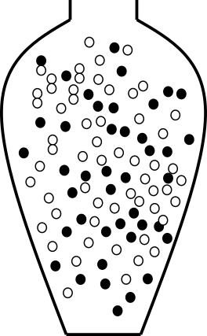

# (PART) Statistical Inference {-}

Statistical inference is to draw conclusions regarding properties of a population based on observations of a random sample from the population.

## Learning outcomes {-}

- to define null and alternative hypothesis
- to perform a hypothesis test using resampling
- to perform a t-test
- to understand and define sampling distribution and standard error
- to compute standard error of mean and proportions
- to compute confidence interval of mean and proportions using the normal approximation
- to compute confidence interval of mean using the t-distribution

```{r setup, include=FALSE}
require(tidyverse)
require(ggplot2)
require(reshape2)
require(knitr)
require(kableExtra)
require(latex2exp)
knitr::opts_chunk$set(fig.width=3.5, fig.height=3.5, echo = FALSE, error=FALSE, warnings=FALSE, dpi=600, fig.path = "Rfigures/infe_")
options(digits=4)
```


# Introduction to hypothesis tests {#infe-hypothesis}

To perform a **hypothesis test** is to evaluate a hypothesis based on a random sample.

Typically, the hypotheses that are tested are assumptions about properties of the population, such as proportion, mean, mean difference, variance etc.


## The null and alternative hypothesis

There are two hypotheses involved in a hypothesis test, the **null hypothesis, $H_0$**, and the **alternative hypothesis, $H_1$**.

The null hypothesis is in general neutral; "no change", "no difference between the groups", "no association". In general we want to show that $H_0$ is false.

The alternative hypothesis expresses what the researcher is interested in, such as "the treatment has an effect", "there is a difference between the groups", "there is an association". The alternative hypothesis can also be directional, e.g. "the treatment has a positive effect".

## Significance level and error types

A hypothesis test is used to draw inference about a population based on a random sample. The inference made might of course be wrong. There are two types of errors;

**Type I error** is a false positive, a false alarm that occurs when $H_0$ is rejected when it is actually true. Examples: *"The test says that you are covid-19 positive, when you actually are not", "The test says that the drug has a positive effect on patient symptoms, but it actually has not"*.

**Type II error** is a false negative, a miss that occurs when $H_0$ is accepted, when it is actually false. Examples: *The test says that you are covid-19 negative, when you actually have covid-19", "The test says that the drug has no effect on patient symptoms, when it actually has"*.

```{r}
kable(matrix(c("", "H0 is true", "H0 is false", "Accept H0", "", "Type II error, miss", "Reject H0", "Type I error, false alarm", ""), byrow=3, ncol=3), caption="Error types") %>% kable_styling(full_width = FALSE)
```

The significance level, $\alpha$ = P(false alarm) = P(Reject $H_0$|$H_0$ is true).

The significance level is the risk of false alarm, i.e. to say "I have a hit", "I found a difference", when the the null hypothesis ("there is no difference") is true. The risk of false alarm is controlled by setting the significance level to a desired value. We do want to keep the risk of false alarm (type I error) low, but at the same time we don't want many missed hits (type II error).

The significance level should be set before the hypothesis test is performed. Common values to use are 0.05 or 0.01.

If the p-value is above the significance level, $p>\alpha$, $H_0$ is accepted. 

If the p-value is below the significance level, $p \leq \alpha$, $H_0$ is rejected.

Another property of a statistical test is the **statistical power**, defined as power = P(Refect H0|H0 is false).


## To perform a hypothesis test

1. Define $H_0$ and $H_1$
2. Select an appropriate **significance level**, $\alpha$
3. Select an appropriate test statistic, $T$, and compute the observed value, $t_{obs}$
4. Assume that the $H_0$ is true and compute the **sampling distribution** of $T$.
5. Compare the observed value, $t_{obs}$, with the computed sampling distribution under $H_0$ (the so called **null distribution**) and compute a **p-value**.
6. Based on the p-value either accept or reject $H_0$.

The **sampling distribution** is the distribution of a sample statistic (e.g mean or proportion). The sampling distribution can be obtained by drawing a large number of samples from a population.

A **null distribution** is a sampling distribution when the null hypothesis is true.

```{r examplenull, out.width="70%", fig.show="hold", fig.width=5, fig.align="center", fig.cap="A null distribution"}
x<-seq(-3,3,0.01)
df <- data.frame(x=x, f=dnorm(x, 0, 1))
plot(ggplot(df, aes(x=x, y=f)) + geom_line() + theme_bw() + xlab("x") + ylab("f(x)"))
```

The **p-value** is the probability of observing a value at least as extreme as the observed value, if $H_0$ is true.

```{r examplepval, out.width="70%", fig.align="center", fig.show="hold", fig.cap="The p-value is the probability to observe $x_{obs}$ or something more extreme, if the null hypothesis is true. The p-value is illustrated for a one-tailed test (left) and for a two-tailed test (right).", fig.width=5, warning=FALSE, out.width="50%"}
pl <- ggplot(df, aes(x=x, y=f)) + geom_line() + theme_bw() + xlab("x") + ylab("f(x)") + geom_area(data=df %>% filter(x>1.5)) + annotate("label",label=TeX("P(X$\\geq$x_{obs})"), x=1.8, y=0.11, hjust=0)
plot(pl + scale_x_continuous(breaks=c(-2,0,1.5,2), labels=c("-2","0","xobs", "2")) + theme(panel.grid.minor = element_blank(), panel.grid.major.x = element_line(color = c("grey92", "grey92", NA, "grey92"))))

pl <- pl + geom_area(data=df %>% filter(x<(-1.5))) + annotate("label",label=TeX("P(X$\\leq$-x_{obs})"), x=-1.8, y=0.11, hjust=1)
plot(pl + scale_x_continuous(breaks=c(-2,-1.5,0,1.5,2), labels=c("-2", "-xobs","0","xobs", "2")) +
     theme(panel.grid.minor = element_blank(),
              panel.grid.major.x = element_line(color = c("grey92", NA, "grey92", NA, "grey92"))))
```

## Hypothesis test using resampling

The sampling distribution of a test statistic under the null hypothesis is sometimes known or can be approximated. When the null distribution is unknown, another option is to simulate the null distribution using resampling. This is done by simulating a model under the null hypothesis and drawing random samples from this model repeatedly. Let's take a look at a few examples;

### Proportions, pollen allergy example

Let's assume we know that the proportion of pollen allergy in Sweden is $0.3$. We suspect that the number of pollen allergic has increased in Uppsala in the last couple of years and want to investigate this.

Observe 100 people from Uppsala, 42 of these were allergic to pollen. Is there a reason to believe that the proportion of pollen allergic in Uppsala $\pi > 0.3$?

##### Null and alternative hypotheses {-}

$H_0:$ The proportion of pollen allergy in Uppsala is the same as in Sweden as a whole.

$H_1:$ The proportion of pollen allergy in Uppsala is greater than in Sweden as a whole.

or expressed differently;

$$H_0:\, \pi=\pi_0$$

$$H_1:\, \pi>\pi_0$$
where $\pi$ is the unknown proportion of pollen allergy in the Uppsala population and $\pi_0 = 0.3$ is the proportion of pollen allergy in Sweden.

##### Test statistic {-}

Here we are interested in the proportion of pollen allergic in Uppsala. An appropriate test statistic could be the number of pollen allergic in a sample of size $n=100$, $X$. As an alternative we can use the proportion of pollen allergic in a sample of size $n$, 

$$P = \frac{X}{n}$$

Let's use $P$ as our test statistic and compute the observed value, $p_{obs}$. In our sample of 100 people from Uppsala, the proportion allergic to pollen is $p=42/100=0.42$.

##### Null distribution {-}

The sampling distribution of $P$ under $H_0$ (i.e. when the null hypothesis is true) is what we call the null distribution.

$H_0$ state that $\pi=0.3$. We can model this using an urn model as follows;

```{r pollenurn, echo=FALSE, fig.cap="An urn model of the null hypothesis $\\pi=0.3$. The black balls represent allergic and the white balls non-allergic.", out.width = "20%", fig.align="center"}
knitr::include_graphics("figures/pollenurn.png")
```

Using this model, we can simulate taking a sample of size 100 many times.

```{r sumpollenurn, echo=TRUE, message=FALSE}
## Urn
urn <- rep(c(0, 1), c(7, 3))
## Sample 100 times with replacement
x <- sample(urn, 100, replace=TRUE)
## Compute proportion of samples that are allergic (1)
mean(x)
## Set the seed to get the same result if we redo the analysis
set.seed(13)
## Repeat drawing sample of size 100 and computing proporion allergic 100000 times
p <- replicate(100000, mean(sample(rep(c(0, 1), c(7, 3)), 100, replace=TRUE)))
```

Plot the distribution

```{r pollensampledistr, out.width="45%", fig.align="center", fig.cap="The sampling distribution."}
ggplot(data.frame(p=p), aes(x=p)) + geom_histogram(color="white", binwidth=0.02) + theme_bw()
```   

##### Compute p-value {-}

Compare the observed value, $p_{obs} = 0.42$ to the null distribution.

```{r histpollennull, out.width="50%", fig.align="center", fig.cap="The sampling distribution. The observed value is marked by a red vertical line."}
ggplot(data.frame(p=p), aes(x=p)) + geom_histogram(color="white", binwidth=0.02) + geom_vline(xintercept=0.42, color="red") + theme_bw()
```

The p-value is the probability of getting the observed value or higher, if the null hypothesis is true.

Use the null distribution to calculate the p-value, $P(P \geq 0.42|H_0)$.

```{r pollenp, echo=TRUE, message=FALSE}
## How many times 
sum(p >= 0.42)
## p-value
pval <- mean(p >= 0.42)
```

p = $P(P \geq 0.42|H_0)$ = `r format(pval, digits=4)` 


##### Accept or reject $H_0$? {-}

As the p-value is $< \alpha = 0.05$ the null hypotheis is rejected. This means that we can conclude that there is reason to belive that the porportion of pollen allergic in Uppsala is greater than 30%.

### Mean values, permutation test example

**Do high fat diet lead to increased body weight?**

The effect of high-fat diet on the body weight of mice is studied in an experiment. The study setup is as follows:

1. 24 female mice are ordered from a lab.
2. Randomly, 12 of the 24 mice are assigned to receive high-fat diet, the
  remaining 12 are controls (ordinary diet).
3. Body weight is measured after one week.

```{r mice, echo=FALSE, eval=FALSE}
## Full mouse population can be downloaded from
mp <- read.csv("https://raw.githubusercontent.com/genomicsclass/dagdata/master/inst/extdata/mice_pheno.csv")
## Select all female mice
pop.F <- mp %>% filter(Sex=="F")
## Select all the female mice on high fat diet
pop.F.hf <- (pop.F %>% filter(Diet=="hf"))[, "Bodyweight"]
## Select all the female mice on ordinary diet
pop.F.n <- (pop.F %>% filter(Diet=="chow"))[, "Bodyweight"]

## Select the seed so that we all get the same random mice!
set.seed(1)
## Select 12 HF mice
xHF <- round(sample(pop.F.hf, 12))
## Select 12 O mice
xN <- round(sample(pop.F.n, 12))
```

The observed values, mouse weights in grams, are summarized below;

```{r miceobs, echo=FALSE}
## 12 HF mice
xHF <- c(25, 30, 23, 18, 31, 24, 39, 26, 36, 29, 23, 32)
## 12 control mice
xN <- c(27, 25, 22, 23, 25, 37, 24, 26, 21, 26, 30, 24)
```

```{r}
kable(rbind("high-fat"=xHF, "ordinary"=xN), digits=1) %>% kable_styling(font_size=14)
```

##### Null and alternative hypotheses {-}
$$
\begin{aligned}
H_0: \mu_d = \mu_c \iff \mu_d - \mu_c = 0\\
H_1: \mu_d>\mu_c \iff \mu_d-\mu_c > 0
\end{aligned}
$$

where $\mu_d$ is the (unknown) mean body weight of the high-fat mouse population and $\mu_c$ is the mean body-weight of the control mouse population.

Studied population: Female mice that can be ordered from a lab.


##### Test statistic {-}

Here we are interested in the mean difference between high-fat and control mice and an appropriate test statistic can be the mean diffrence, $D = \bar X_d - \bar X_c$, where 

* $\bar X_d$ is a random variable describing the mean weight of 12 (randomly selected) mice on high-fat diet. $E[\bar X_d] = E[X_d] = \mu_d$
* $\bar X_c$ is a random variable describing the Mean weight of 12 (randomly selected) mice on ordinary diet. $E[\bar X_c] = E[X_c] = \mu_c$

The mean difference $D = \bar X_d - \bar X_c$ is also a random variable.

Observed values;

```{r, echo=TRUE}
## 12 HF mice
xD <- c(25, 30, 23, 18, 31, 24, 39, 26, 36, 29, 23, 32)
## 12 control mice
xC <- c(27, 25, 22, 23, 25, 37, 24, 26, 21, 26, 30, 24)

##Compute mean body weights of the two samples
mD <- mean(xD)
mC <- mean(xC) 
## Compute mean difference
dobs <- mD - mC
```

Mean weight of sample control mice (ordinary diet): $\bar x_c = `r sprintf("%.2f", mC)`$

Mean weight of sample mice on high-fat diet: $\bar x_d = `r sprintf("%.2f", mD)`$

Difference in sample mean weights: $d_{obs} = \bar x_d - \bar x_c = `r dobs`$

##### Null distribution {-}

If high-fat diet has no effect, i.e. if $H_0$ was true, the result would be as if all mice were given the same diet. What can we expect if all mice are fed with the same type of food? 

This can be accomplished using permutation

The 24 mice were initially from the same population, depending on how the mice are randomly assigned to high-fat and normal group, the mean weights would differ, even if the two groups were treated the same.

Assume $H_0$ is true, i.e. assume all mice are equivalent and
  
1. Randomly reassign 12 of the 24 mice to 'high-fat' and the remaining 12 to 'control'.
2. Compute difference in mean weights

If we repeat 1-2 many times we get the null distribution of difference in mean weights.

```{r permtest, echo=TRUE, message=FALSE}
## All 24 body weights in a vector
x <- c(xHF, xN)
## Mean difference
dobs <- mean(x[1:12]) - mean(x[13:24])
## Permute once
y <- sample(x)
##Compute mean difference
mean(y[1:12]) - mean(y[13:24])
##Repeat the above many times
dnull.perm <- replicate(n = 100000, {
  y <- sample(x)
  ##Mean difference
  mean(y[1:12]) - mean(y[13:24])
})
```

Plot the null distribution and the observed difference.

```{r permtest, fig.cap="Null distribution of the mean difference $D$.", out.width="50%"}
ggplot(data.frame(d=dnull.perm), aes(x=d)) +
  geom_histogram(bins=25, color="white") +
  theme_bw() +
  geom_vline(xintercept=dobs, color="red")
##Alternatively plot using hist
## hist(dnull.perm)
```


##### Compute p-value {-}

What is the probability to get an at least as extreme mean difference as our observed value, $d_{obs}$, if $H_0$ was true?

```{r micepval, echo=TRUE, message=FALSE}
## Compute the p-value
pval <- mean(dnull.perm>=dobs)
```

$$P(\bar X_2 - \bar X_1 \geq d_{obs} | H_0) = `r sprintf("%.3g",pval)`$$

##### Accept or reject $H_0$? {-}

As $`r format(pval, digits=3)`>0.05$ the null hypothesis is accepted, there is no evidence that the high-fat diet increase body weight in mice.

<!-- ## Parametric hypothesis tests -->

# Exercises: Hypothesis tests, resampling {.unnumbered #infe-exr1-hypresamp}

The exercise Rmd can be downloaded from the [inference exercise files](https://uppsala.instructure.com/courses/70535/files/folder/Exercises/inference) directory, also solutions (both Rmd and html) can be downloaded from the same directory (but with a time restriction).

```{r hyporesamplingexercises, child="infe_exr_1_hyporesampling.Rmd"}

```

<!-- # Exercises with solutions: Hypothesis tests, resampling {.unnumbered #infe-exercise1-solutions-hypresamp} -->
  
```{r hyporesamplingsolutions, child="infe_exr_1_hyporesampling_solutions.Rmd", eval=FALSE}

```

# Parametric tests {#infe-hypparam}

In the previous chapter we computed the sampling distribution using resampling techniques to be able to perform hypothesis tests. If the null distribution was already known, or could be computed based on a few assumptions, resampling would not be necessary.

We can follow the same steps as before to perform a hypothesis test:

1. Define $H_0$ and $H_1$
2. Select an appropriate significance level, $\alpha$
3. Select appropriate test statistic, $T$, and compute the observed value, $t_{obs}$
4. Assume that the $H_0$ and derive the null distribution of the test statistic based on appropriate assumptions.
5. Compare the observed value, $t_{obs}$, with the null distribution and compute a p-value. The p-value is the probability of observing a value at least as extreme as the observed value, if $H_0$ is true.
6. Based on the p-value either accept or reject $H_0$.

In this section we will present a few common situation in which the null distribution can be described parametrically.

## One sample, proportions

```{example, label="parampollen", echo=TRUE}
**Let's get back to the pollen example!**

Assume that the proportion of pollen allergy in Sweden is known to be $0.3$. Observe 100 people from Uppsala, 42 of these were allergic to pollen. Is there a reason to believe that the proportion of pollen allergic in Uppsala $\pi > 0.3$?
```

##### Null and alternative hypotheses {-}

$$H_0:\, \pi=\pi_0$$

$$H_1:\, \pi>\pi_0,$$

where $\pi_0=0.30$ in this example. Other potential alternative hypothesis are $H_1: \pi<\pi_0$ or $H_1:\pi \neq \pi_0$, but in this particular example we are only interested in the alternative that $\pi > \pi_0$.

##### Significance level

Set the signifgicance level to $\alpha=0.05$.

##### Test statistic {-}

Here, we will use $X$, the number of allergic persons in a random sample of size $n=100$. The observed value is $x_{obs} = 42$.

##### Null distribution {-}

$X$ is binomially distributed, so there is no need to use resampling here, we can use the binomial distribution to answer the question.

##### p-value {-}

The probaility of $x_{obs}$ or something higher,

$P(X \geq 42) = 1 - P(X \leq 41)$ [`1-pbinom(41,100,0.3)`] = `r format(1-pbinom(41,100,0.3), digits=4)`

##### Accept or recject $H_0$?

As $p<0.05$ $H_0$ is rejected and we conclude that there is reason to believe that the proportion of pollen allergic in Uppsala is higher than 0.3.


This p-value can also be computed using the exact binomial test;

```{r}
binom.test(42, 100, 0.3, alternative="greater")
```

An alternative approach is to use the Central limit theorem, see \@ref(thm:CLTrep), and use the normal approximation.

```{theorem, label="CLTrep", echo=TRUE}
The sum of $n$ independent and equally distributed random variables
is normally distributed, if $n$ is large enough.
```

As a result of the central limit theorem, the distribution of number or proportion of allergic  individuals in a sample of size $n$ is approximately normal. At least if the sample is large enough. A rule of thumb is that the sample size should be $n>30$.

Here, the sample size is 100!

This test of proportions using the normal approximation is implemented in in the r-function `prop.test`.

```{r}
prop.test(42, 100, 0.3, alternative="greater")
```

But can of course also be calculated using only the normal distribution table.

The normal distribution has two parameters, mean and standard deviation.

From the binomial distribution we know that $E[X] = n\pi$ and $var(X) = n\pi(1-\pi)$. 

The standard error of $X$ is 

$$SE=\sqrt{n\pi(1-\pi)}$$


If $H_0$ is true $\pi=\pi_0$ and

$$X \sim N\left(n\pi_0, \sqrt{n\pi_0(1-\pi_0)}\right)$$
<!-- An appropriate test statistic is -->
<!-- $$Z = \frac{X-n\pi_0}{\sqrt{n\pi_0(1-\pi_0)}}$$ -->
<!-- $Z \in N(0,1)$ which makes probabilities easy to compute. -->

With this null distribution and ur observed value $x_{obs} = 42$, the p-value can be computed.

$p = P(X \geq 42)$

As we are now approximating a discrete distribution using a continuous distribution we need to use a trick called *continuiuty correction*, which simply means that we let each integer be represented by y a region $\pm 0.5$ from its value. Hence,

`r zobs <- (41.5-30)/sqrt(100*0.3*(1-0.3))`

$$p = P(X \geq 42) = [continuity \; correction] = $$
$$P(X \geq 41.5) = P\left(Z \geq \frac{41.5 - n\pi_0}{\sqrt{n\pi_0(1-\pi_0)}}\right) = $$
$$P\left(Z \geq \frac{41.5-30}{\sqrt{100*0.3*(1-0.3)}}\right) = P(Z \geq 2.51) = 1 - P(Z \leq 2.51) = [Z-table] = 0.0060$$

<!-- The p-value is the probability of the observed value, or something more extreme, if the null hypothesis is true. If the computed probability is below $\alpha=0.05$ our significance threshold, $H_0$ will be rejected. -->

<!-- $$p = P(P \geq \pi_0) = P(Z \geq Z_{obs}) = P(Z \geq` `r format(zobs, digits=3)`) = 1 - P(Z \leq `r format(zobs, digits=3)`) = [table] = 1 - `r format(pnorm(2.62), digits=3)` = `r format(pnorm(2.62, lower.tail=FALSE), digits=3)`$$ -->

As `r format(pnorm(zobs, lower.tail=FALSE), digits=3)`<0.05 we reject $H_0$ and conclude that there is reason to believe that the proportion of allergic in Uppsala is greater than 0.3.


## One sample, mean

A one sample test of means compares the mean of a sample to a prespecified value.

For example, we might know that the weight of a mouse on normal diet is normally distributed with mean 24.0 g and standard deviation 3 g and want to compare the weight of a sample of 10 mice on high-fat diet to the known mean value for mice on normal diet.

The hypotheses:

$$H_0: \mu = \mu_0 \\
H_1: \mu \neq \mu_0$$

The alternative hypothesis, $H_1,$ above is for the two sided hypothesis test. Other options are the one sided $H_1$; $H_1: \mu > \mu_0$ or $H_1: \mu < \mu_0$.

If $$X \sim N(\mu, \sigma)$$ (this could for example be the weight of a mouse on high-fat diet) then the sample mean $$\bar X \sim N\left(\mu, \frac{\sigma}{\sqrt{n}}\right).$$

If $\sigma$ is known under the null hypothesis, then the test statistic

$$Z = \frac{\bar X - \mu_0}{\frac{\sigma}{\sqrt{n}}}$$
is normally distributed, $\sim N(0,1)$.

In many situations the the population standard deviation is not known, but can instead be estimated from the sample. For small $n$ and unknown $\sigma$, we can use the **one-sample t-test**, that uses the test statistic

$$T = \frac{\bar X - \mu_0}{\frac{s}{\sqrt{n}}},$$

which is t-distributed with $df=n-1$ degrees of freedom.

Once we have an appropriate test statistic, $T$ with known distribution, we can compute the observed value, $t_{obs}$ and use the null distribution to compute the p-value, $P(|T| \geq |t_{obs}|)$.

In R, the functions `pnorm` and `pt` are useful for computing these probabilities. The **one-sample t-test** can also be performed using the function `t.test`like this;

```{r, echo=TRUE}
##The observed 10 mouse weights;
x <- c(25, 30, 23, 18, 31, 24, 39, 26, 36, 29, 23, 32)
## Under the null hypothesis mu=24
##Perform the t-test to investigate if the null hypotheis can be accepted, i.e. if the sample comes from a normal distribution with expected value 24.
t.test(x, mu=24)
```


## Two samples, proportions

$$H_0: \pi_1 - \pi_2 = 0\\
H_1: \pi_1 - \pi_2 \neq 0$$

Alternatively, a one sided alternative hypothesis can be used; $H_1: \pi_1 - \pi_2 >0$ or $H_1: \pi_1 - \pi_2 < 0$.
<!-- If $H_0$ is true -->

<!-- $$P_1 - P_2 \sim N\left(0, \sqrt{\pi(1-\pi)\left (\frac{1}{n_1} + \frac{1}{n_2}\right)} \right)$$ -->
<!-- where $\pi$ is the  -->

If n is large the normal approximation can be used and an appropriate test statistic is

$$Z = \frac{P_1 - P_2}{\sqrt{P(1-P)\left (\frac{1}{n_1} + \frac{1}{n_2}\right)}},$$

where $P$ is the proportion in the merged sample of size $n_1 + n_2$. $Z \in N(0,1)$ and p-value can be computed using the standard normal distribution.

Also the two sample proportions test is implemented in the function `prop.test`.

## Two samples, mean

A two sample test of means is used to determine if two population means are equal.

Two independent samples are collected (one from each population) and the means are compared. Can for example be used to determine if a treatment group is different compared to a control group, in terms of the mean of a property of interest.

The null hypothesis;

$$H_0: \mu_2 = \mu_1$$
The alternative hypothesis can either be two sided

$$H_1: \mu_2 \neq \mu_1$$
or one sided

$H_1: \mu_2 > \mu_1$ or $H_1: \mu_2 < \mu_1$

Assume that observations from both populations are normally distributed;

$$
\begin{aligned}
X_1 \sim N(\mu_1, \sigma_1) \\
X_2 \sim N(\mu_2, \sigma_2)
\end{aligned}
$$
Then it follows that the sample means will also be normally distributed;

$$
\begin{aligned}
\bar X_1 \sim N(\mu_1, \sigma_1/\sqrt{n_1}) \\
\bar X_2 \sim N(\mu_2, \sigma_2/\sqrt{n_2})
\end{aligned}
$$


The mean difference $D = \bar X_2 - \bar X_1$ is thus also normally distributed:

$$D = \bar X_2 - \bar X_1 = N\left(\mu_2-\mu_1, \sqrt{\frac{\sigma_2^2}{n_2} + \frac{\sigma_1^2}{n_1}}\right)$$


If $H_0$ is true: $$D = \bar X_2 - \bar X_1 = N\left(0, \sqrt{\frac{\sigma_2^2}{n_2} + \frac{\sigma_1^2}{n_1}}\right)$$

The test statistic: $$Z = \frac{\bar X_2 - \bar X_1}{\sqrt{\frac{\sigma_2^2}{n_2} + \frac{\sigma_1^2}{n_1}}}$$ is standard normal, i.e. $Z \sim N(0,1)$.

However, note that the test statistic require the standard deviations $\sigma_1$ and $\sigma_2$ to be known.

What if the population standard deviations are not known?

If the sample sizes are large, we can replace the known standard deviations with our sample standard deviations and according to the central limit theorem assume that 

$$Z = \frac{\bar X_2 - \bar X_1}{\sqrt{\frac{s_2^2}{n_2} + \frac{s_1^2}{n_1}}} \sim N(0,1)$$

and proceed as before.

<!-- Here $n_1=n_2=12$ which is not very large. -->

For small sample sizes the test statistic will be t-distributed.

$$t = \frac{\bar X_2 - \bar X_1}{\sqrt{\frac{s_2^2}{n_2} + \frac{s_1^2}{n_1}}}$$

For small sample sizes we can use Student's t-test, which requires us to assume that $X_1$ and $X_2$ both are normally distributed and have equal variances. With these assumptions we can compute the pooled variance

$$
s_p^2 = \frac{(n_1-1)s_1^2 + (n_2-1)s_2^2}{n_1+n_2-2}
$$

and the test statistic

$$t = \frac{\bar X_1 - \bar X_2}{\sqrt{s_p^2(\frac{1}{n_1} + \frac{1}{n_2})}}$$

$t$ is t-distributed with $n_1+n_2-2$ degrees of freedom.

The t-test is implemented in R, e.g. in the function `t.test` in the R-package `stats`, both Student's t-test with equal variances and Welch's t-test with unequal variances.


## Variance

The test of equal variance in two groups is based on the null hypothesis

$$H_0: \sigma_1^2 = \sigma_2^2$$

If the two samples both come from populations with normal distributions, the sample variances (also random variables) are

$$S_1^2 = \frac{1}{n_1-1} \sum_{i=1}^{n_1} (X_{1i}-\bar X_1)^2\\
S_2^2 = \frac{1}{n_2-1} \sum_{i=1}^{n_2} (X_{2i}-\bar X_2)^2$$

It can be shown that $\frac{(n_1-1)S_1^2}{\sigma_1^2} \sim \chi^2(n_1-1)$ and $\frac{(n_2-1)S_2^2}{\sigma_2^2} \sim \chi^2(n_2-1)$.

Hence, the test statistic for comparing the variances of two groups

$$F = \frac{S_1^2}{S_2^2}$$
is $F$-distributed with $n_1-1$ and $n_2-1$ degrees of freedom.

In R a test of equal variances can be performed using the function `var.test`.


# Exercises: Hypothesis tests, parametric {.unnumbered #infe-exr2-hypparam}

The exercise Rmd can be downloaded from the [inference exercise files](https://uppsala.instructure.com/courses/70535/files/folder/Exercises/inference) directory, also solutions (both Rmd and html) can be downloaded from the same directory (but with a time restriction).


```{r hypoparamexercises, child="infe_exr_2_hypoparam.Rmd"}

```

<!-- # Exercises with solutions: Hypothesis tests, parametric {.unnumbered #infe-exercise2-solutions-hypparam} -->
  
```{r hypoparamsolutions, child="infe_exr_2_hypoparam_solutions.Rmd", eval=FALSE}

```

# Multiple testing {#infe-multiple}
## Error types

```{r}
kable(matrix(c("", "H0 is true", "H0 is false", "Accept H0", "", "Type II error, miss", "Reject H0", "Type I error, false alarm", ""), byrow=F, ncol=3)) %>% kable_styling(font_size=14)
```


```{r}
kable(matrix(c("", "H0 is true", "H0 is false", "Accept H0", "TN", "FN", "Reject H0", "FP", "TP"), byrow=F, ncol=3)) %>% kable_styling(font_size=14)
```

Significance level

$$P(\mbox{reject }\,H_0 | H_0 \,\mbox{is true}) = P(\mbox{type I error}) = \alpha$$
  
Statistical power

$$P(\mbox{reject } H_0 | H_1 \mbox{ is true}) = P(\mbox{reject } H_0 | H_0 \mbox{ is false}) = 1 - P(\mbox{type II error})$$

## Perform one test:
  
- P(One type I error) = $\alpha$
- P(No type I error) = $1 - \alpha$
  
## Perform $m$ independent tests:
  
- P(No type I errors in $m$ tests) = $(1 - \alpha)^m$
- P(At least one type I error in $m$ tests) = $1 - (1 - \alpha)^m$
  
```{r multiple, echo=FALSE, out.width="50%", fig.align="center", fig.width=4, fig.height=4}
a=0.05
k <- 1:100
ggplot(data.frame(k=k, p = 1-(1-a)^k), aes(x=k, y=p)) + geom_line() + xlab("Number of tests") + ylab("P(At least one type I error)") + theme_bw() + annotate("label", x=75, y=0.2, label="alpha == 0.05", parse=TRUE)
```

  - FWER: family-wise error rate, probability of one or more false positive, e.g. Bonferroni, Holm
  - FDR: false discovery rate, proportion of false positives among hits, e.g. Benjamini-Hochberg, Storey

## Bonferroni correction
  
  To achieve a family-wise error rate of $\leq \alpha$ when performing $m$ tests, declare significance and reject the null hypothesis for any test with $p \leq \alpha/m$.

Objections: too conservative

## Benjamini-Hochbergs FDR
  
```{r}
kable(matrix(c("", "H0 is true", "H0 is false", "Accept H0", "TN", "FN", "Reject H0", "FP", "TP"), byrow=3, ncol=3)) %>% kable_styling(font_size=14)
```

The false discovery rate is the proportion of false positives among 'hits', i.e. $\frac{FP}{TP+FP}$.


Benjamini-Hochberg's method control the FDR level, $\gamma$, when performing $m$ *independent* tests, as follows:
  
1. Sort the p-values $p_1 \leq p_2 \leq \dots \leq p_m$.
2. Find the maximum $j$ such that $p_j \leq \gamma \frac{j}{m}$.
3. Declare significance for all tests $1, 2, \dots, j$.


## 'Adjusted' p-values
  
Sometimes an adjusted significance threshold is not reported, but instead 'adjusted' p-values are reported.
  
- Using Bonferroni's method the 'adjusted' p-values are:
  
  $\tilde p_i = \min(m p_i, 1)$.

A feature's adjusted p-value represents the smallest FWER at which the null hypothesis will be rejected, i.e. the feature will be deemed significant.
  
- Benjamini-Hochberg's 'adjusted' p-values are called $q$-values:
  
  $q_i = \min(\frac{m}{i} p_i, 1)$
  
  A feature's $q$-value can be interpreted as the lowest FDR at which the corresponding null hypothesis will be rejected, i.e. the feature will be deemed significant.
 
```{example, label="10000", echo=TRUE}
**10000 independent tests (e.g. genes)**
```

```{r padjust, results="asis"}
p <- sort(c(1.7e-8, 5.8e-8, 3.4e-7, 9.1e-7, 1.0e-6, 2.4e-6, 3.6e-5, 2.3e-5, 2.3e-4, 2.2e-4, 8.9e-3,7.3e-4, 0.0045, 0.0032, 0.0087, 0.012, 0.014, 0.045, 0.08, 0.23))
kable(data.frame(`p-value`=sprintf("%.3g", p), `adj p (Bonferroni)` = p.adjust(p, "bonferroni", 10000), `q-value (B-H)`=p.adjust(p, "BH", 10000), check.names=FALSE))
```


# Point and interval estimates {#infe-interval}

## Point estimate

As seen in previous chapter, the sample proportion and sample mean are unbiased estimates of the corresponding population statistics. When we only have a sample, the sample estimate will be our best guess, a **point estimate**, of the population value, but it will not be without error, but the larger the sample, the smaller the error.
  
If we are interested in how large proportion of the Uppsala population is allergic to pollen, we can investigate this by studying a random sample, e.g.  randomly select 100 persons in Uppsala. It is important to actually sample randomly, ideally every individual in the population should have the same probability of being sampled.

In our sample, we observed that 42 of the 100 has a pollen allergy. Hence, the observed sample proportion is $p=0.42$.

<!-- What does this say about the population proportion $\pi$? -->
Based on this observation our point estimate of the Uppsala popultation proportion $\pi$ is $\pi \approx p = 0.42$. We know that there is an uncertainty in this measurement, if the experiment is repeated we would select 100 other persons and our point estimate would be slightly different.

## Confidence interval

A confidence interval is a type of interval estimate associated with a confidence level. 

```{definition, label="CI"}
**Confidence interval** An interval that with probability $1 - \alpha$ cover the population parameter $\theta$ is called a confidence interval for $\theta$ with confidence level $1 - \alpha$.
```


```{r CI95, fig.width=7, fig.height=3, fig.cap="A 95% confidence interval will have 95% chance to cover the true value."}
set.seed(13)
p <- replicate(100, mean(sample(0:1, 100, p=c(.7,.3), replace=TRUE)))
ggplot(data.frame(x=1:40, p=p[61:100]) %>% mutate(ymin=p-1.96*sqrt((p*(1-p))/100), ymax=p+1.96*sqrt((p*(1-p))/100)), aes(x=x, ymin=ymin, ymax=ymax, color=0.3>ymin & 0.3<ymax)) + geom_errorbar() + geom_hline(yintercept=0.3) + xlab("") + ylab("p") + theme_bw() + theme(legend.position="none")
```

### Bootstrap interval

If the distribution of the random variable of interest is unknown, a bootstrap confidence interval can be computed instead.

Bootstraping is performed by resampling with replacement from the available random sample. The resampling distribution can then be used to calculate e.g. a 95% bootstrap interval.

This can be done as follows;

1. Put the entire sample in an urn!

```{r pollenurn42, echo=FALSE, fig.cap="An urn model with 42 allergy (black) and 58 non-allergy (white). The black balls represent allergic and the white balls non-allergic.", out.width = "20%", fig.align="center"}

```

In R; 

```{r}
## the sample consists of 50 non-allergic (0) and 42 allergic (1).
x <- rep(0:1, c(58, 42))
```


2. Sample from the urn with replacement to compute the bootstrap distribution.

```{r }
pboot <- replicate(1000, mean(sample(x, replace=TRUE)))
```


```{r boot, fig.cap="Bootstrap resampling distribution.", out.width="45%", fig.align="center"}
ggplot(data.frame(x=pboot), aes(x=x)) + geom_histogram(color="white", binwidth=0.02) + theme_bw() + xlab("p")
```

3. Compute the 95% bootstrap interval. This can be done using the percentile method by calculating the 2.5 and 97.5 percentiles, i.e. the values in the resampling distribution for which 2.5% and 97.5%, respectively, of all the values lie to the left of.

```{r CIboot}
ciboot <- quantile(pboot, c(0.025, 0.975))
```

```{r CIboot, fig.cap="Bootstrap resampling distribution and the 95% bootstrap confidence interval.", out.width="45%", fig.align="center"}
ggplot(data.frame(x=pboot), aes(x=x, fill=x>ciboot[1] & x<ciboot[2])) + geom_histogram(color="white", binwidth=0.02) + theme_bw() + theme(legend.position="none") + xlab("p") + geom_line(data=data.frame(x=ciboot, y=50), aes(x=x, y=y), arrow=arrow(ends="both")) + annotate("label", x=mean(ciboot), y=50, label="95%")
```
  
The 95% bootstrap confidence interval of $\pi$; [`r ciboot`].

### Confidence interval of proportions

The bootstrap is very useful if you do not know the distribution of our sampled property, but in our proportions example we actually do.

Remember that we can use the central limit theorem to show that 

$$P \sim N\left(\pi, SE\right) \iff P \sim \left(\pi, \sqrt{\frac{\pi(1-\pi)}{n}}\right)$$

It follows that 

$$Z = \frac{P - \pi}{SE} \sim N(0,1)$$
Based on what we know of the standard normal distribution, we can compute an interval around the population property $\pi$ such that the probability that a sample property $p$ fall within this interval is $1-\alpha$.

$$P(-z_{\alpha/2} < \frac{P - \pi}{SE} < z_{\alpha/2}) = 1 - \alpha$$ 

For a 95% confidence interval $z_{0.025}=1.96$ (from a table of the standard normal distribution). Other confidence levels of interest include 90% ($z_{0.05}=1.64$) and 99% ($z_{0.005}=2.58$). In R, the function ´qnorm` is used to compute $z_{\alpha/2}$,

```{r, echo=TRUE}
## 95% confidence interval, alpha=0.05
qnorm(1-0.05/2)
## 90% confidence interval, alpha=0.10
qnorm(1-0.10/2)
## 99% confidence interval, alpha=0.01
qnorm(1-0.01/2)
```

The unequality can be rewritten;


$$-z_{\alpha/2} < \frac{P-\pi}{SE}<z_{\alpha/2} \iff P-z_{\alpha/2}SE \leq \pi \leq P + z_{\alpha/2}SE$$
Hence,

$$P\left(P-z SE < \pi < P + z SE\right) = 1 - \alpha$$
In words, the population proportion $\pi$ will lie within $\pm z_{\alpha/2}SE$ from the the sample proportion $P$.

To get the observed confidence interval, replace the random variable $P$ with the observed value $p$ (in our example 0.42).

The confidence interval can be expressed in different was; 

$$p-z_{\alpha/2} SE < \pi < p + z_{\alpha/2} SE$$
$$\pi = p \pm z_{\alpha/2} SE$$
$$(p - z_{\alpha/2} SE, p + z_{\alpha/2} SE)$$

The 95% confidence interval $$\pi = p \pm 1.96 \sqrt{\frac{p(1-p)}{n}}$$ will have 95% chance to cover the true value.

```{r CIallergy, fig.width=7, fig.height=3}
set.seed(13)
p <- replicate(100, mean(sample(0:1, 100, p=c(.7,.3), replace=TRUE)))
ggplot(data.frame(x=1:40, p=p[61:100]) %>% mutate(ymin=p-1.96*sqrt((p*(1-p))/100), ymax=p+1.96*sqrt((p*(1-p))/100)), aes(x=x, ymin=ymin, ymax=ymax, color=0.3>ymin & 0.3<ymax)) + geom_errorbar() + geom_hline(yintercept=0.3) + xlab("") + ylab("p") + theme_bw() + theme(legend.position="none")
```

Back to our example of proportion pollen allergic in Uppsala. $p=0.42$ and $SE=\sqrt{\frac{p(1-p)}{n}} = `r sqrt(0.42*(1-0.42)/100)`$.

Hence, the 95% confidence interval is 
$$\pi = 0.42 \pm 1.96 * 0.05 = 0.42 \pm 0.092$$
or
$$(0.42-0.092, 0.42+0.092) = (0.32, 0.52)$$


#### Confidence interval of mean

The confidence interval of mean can be derived similarly.

The mean of a sample of $n$ independent and identically normal distributed observations $X_i$ is normally distributed;

$$\bar X \sim N(\mu, \frac{\sigma}{\sqrt{n}})$$

If $\sigma$ is unknown the statistic

$$T = \frac{\bar X - \mu}{\frac{s}{\sqrt{n}}}$$

is t-distributed with $n-1$ degrees of freedom, in short $T \sim t(n-1)$.

It follows that 

$$
\begin{aligned}
P\left(-t < \frac{\bar X - \mu}{\frac{\sigma}{\sqrt{n}}} < t\right) = 1 - \alpha \iff \\
P\left(\bar X - t \frac{\sigma}{\sqrt{n}} < \mu < \bar X + t \frac{\sigma}{\sqrt{n}}\right) = 1 - \alpha
\end{aligned}
$$

The confidence interval with confidence level $1-\alpha$ is thus;

$$\mu = \bar x \pm t \frac{s}{\sqrt{n}}$$
  
The $t$ values for different values of $\alpha$ and degrees of freedom are tabulated and can be computed in R using the function `qt`.

For a 95% confidence interval, i.e. $\alpha=0.05$, and $n=5$, $t$ is `r qt(.975, df=4)` and can be computed using 

```{r, echo=TRUE}
n=5
alpha = 0.05
## t value
qt(1-alpha/2, df=n-1)
```

# Exercises: Interval estimates {.unnumbered #infe-exr3-interval}

The exercise Rmd can be downloaded from the [inference exercise files](https://uppsala.instructure.com/courses/70535/files/folder/Exercises/inference) directory, also solutions (both Rmd and html) can be downloaded from the same directory (but with a time restriction).

```{r hypoparamexercises, child="infe_exr_3_interval.Rmd"}

```

<!-- # Exercises and solutions: Interval estimates {.unnumbered #infe-exercise-solutions-interval} -->

```{r hypoparamsolutions, child="infe_exr_3_interval_solutions.Rmd", eval=FALSE}

```
