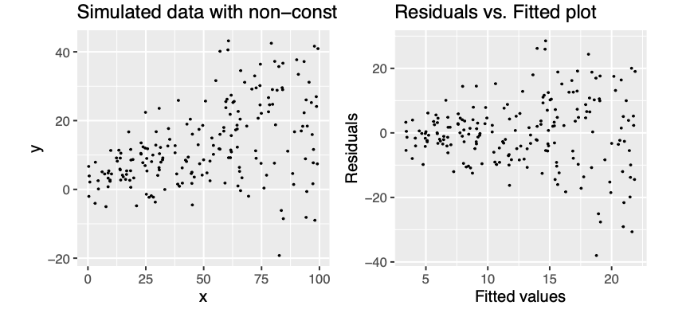
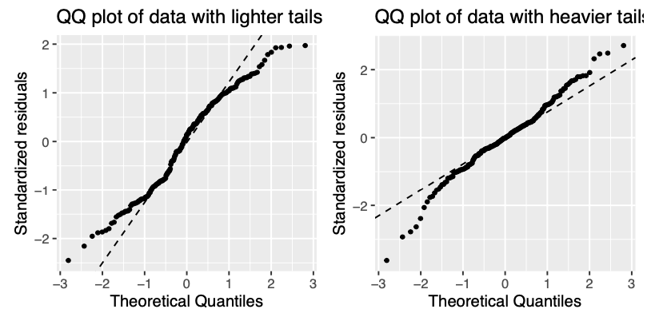

# Model diagnostics

**Aims**

- to introduce concepts of linear models summary and assumptions

**Learning outcomes**

- to able to interpret $R^2$ and $R^2(adj)$ values
- state the assumptions of a linear model and assess them using residual plots

## Assessing model fit
- earlier we learned how to estimate parameters in a liner model using least squares
- now we will consider how to assess the goodness of fit of a model
- we do that by calculating the amount of variability in the response that is explained by the model

## $R^2$: summary of the fitted model
- considering a simple linear regression, the simplest model, **Model 0**, we could consider fitting is $$Y_i = \beta_0+ \epsilon_i$$ that corresponds to a line that run through the data but lies parallel to the horizontal axis
- in our plasma volume example that would correspond the mean value of plasma volume being predicted for any value of weight (in purple)
```{r, collapse=TRUE, echo=F, fig.align="center", fig.width=5, fig.height=4}
weight <- c(58, 70, 74, 63.5, 62.0, 70.5, 71.0, 66.0) # body weight (kg)
plasma <- c(2.75, 2.86, 3.37, 2.76, 2.62, 3.49, 3.05, 3.12) # plasma volume (liters)

plot(weight, plasma, pch=19, xlab="Weight [kg]", ylab="Plasma volume [l]")
abline(h=mean(plasma), col="purple")

```

- TSS, denoted **Total corrected sum-of-squares** is the residual sum-of-squares for Model 0
$$S(\hat{\beta_0}) = TSS = \sum_{i=1}^{n}(y_i - \bar{y})^2 = S_{yy}$$ corresponding the to the sum of squared distances to the purple line
```{r, echo=F, fig.align="center", fig.width=5, fig.height=4}

plot(weight, plasma, pch=19, xlab="Weight [kg]", ylab="Plasma volume [l]")
abline(h=mean(plasma), col="purple")

for (i in 1:length(weight)){
  segments(weight[i], plasma[i], weight[i], mean(plasma))
}

```

- Fitting **Model 1** of the form $$Y_i = \beta_0 + \beta_1x + \epsilon_i$$ we have earlier defined
- **RSS**, the residual sum-of-squares as:
$$RSS = \displaystyle \sum_{i=1}^{n}(y_i - \{\hat{\beta_0} + \hat{\beta}_1x_{1i} + \dots + \hat{\beta}_px_{pi}\}) = \sum_{i=1}^{n}(y_i - \hat{y_i})^2$$
- that corresponds to the squared distances between the observed values $y_i, \dots,y_n$ to fitted values $\hat{y_1}, \dots \hat{y_n}$, i.e. distances to the red fitted line
```{r, echo=F, fig.align="center", fig.width=5, fig.height=4}

plot(weight, plasma, pch=19, xlab="Weight [kg]", ylab="Plasma volume [l]")
abline(lm(plasma ~ weight), col="red")
model <- lm(plasma ~ weight)

for (i in 1:length(weight)){
  segments(weight[i], plasma[i], weight[i], model$fitted.values[i])
}

```

```{definition}

A simple but useful measure of model fit is given by $$R^2 = 1 - \frac{RSS}{TSS}$$ where:

- RSS is the residual sum-of-squares for Model 1, the fitted model of interest
- TSS is the sum of squares of the **null model**

```

- $R^2$ quantifies how much of a drop in the residual sum-of-squares is accounted for by fitting the proposed model
- $R^2$ is also referred as **coefficient of determination**
- It is expressed on a scale, as a proportion (between 0 and 1) of the total variation in the data
- Values of $R^2$ approaching 1 indicate he model to be a good fit
- Values of $R^2$ less than 0.5 suggest that the model gives rather a poor fit to the data

## $R^2$ and correlation coefficient
```{theorem}

In the case of simple linear regression:

Model 1: $Y_i = \beta_0 + \beta_1x + \epsilon_i$
$$R^2 = r^2$$
where:

- $R^2$ is the coefficient of determination
- $r^2$ is the sample correlation coefficient

```

## $R^2(adj)$
- in the case of multiple linear regression, where there is more than one explanatory variable in the model
- we are using the adjusted version of $R^2$ to assess the model fit
- as the number of explanatory variables increase, $R^2$ also increases
- $R^2(adj)$ takes this into account, i.e. adjusts for the fact that there is more than one explanatory variable in the model

```{theorem}
For any multiple linear regression
$$Y_i = \beta_0 + \beta_1x_{1i} + \dots + \beta_{p-1}x_{(p-1)i} +  \epsilon_i$$ $R^2(adj)$ is defined as
$$R^2(adj) = 1-\frac{\frac{RSS}{n-p-1}}{\frac{TSS}{n-1}}$$ where

- $p$ is the number of independent predictors, i.e. the number of variables in the model, excluding the constant

$R^2(adj)$ can also be calculated from $R^2$:
$$R^2(adj) = 1 - (1-R^2)\frac{n-1}{n-p-1}$$

```

We can calculate the values in R and compare the results to the output of linear regression
```{r, collapse=TRUE}

htwtgen <- read.csv("data/lm/heights_weights_genders.csv")
head(htwtgen)
attach(htwtgen)

## Simple linear regression
model.simple <- lm(Height ~ Weight, data=htwtgen)

# TSS
TSS <- sum((Height - mean(Height))^2)

# RSS
# residuals are returned in the model type names(model.simple)
RSS <- sum((model.simple$residuals)^2)
R2 <- 1 - (RSS/TSS)

print(R2)
print(summary(model.simple))

## Multiple regression
model.multiple <- lm(Height ~ Weight + Gender, data=htwtgen)
n <- length(Weight)
p <- 1

RSS <- sum((model.multiple$residuals)^2)
R2_adj <- 1 - (RSS/(n-p-1))/(TSS/(n-1))

print(R2_adj)
print(summary(model.multiple))

```

## The assumptions of a linear model
- up until now we were fitting models and discussed how to assess the model fit
- before making use of a fitted model for explanation or prediction, it is wise to check that the model provides an adequate description of the data
- informally we have been using box plots and scatter plots to look at the data
- there are however formal definitions of the assumptions

**Assumption A: The deterministic part of the model captures all the non-random structure in the data**

- this implies that the **mean of the errors $\epsilon_i$** is zero
- it applies only over the range of explanatory variables

**Assumption B: the scale of variability of the errors is constant at all values of the explanatory variables**

- practically we are looking at whether the observations are equally spread on both side of the regression line

**Assumption C: the errors are independent**

- broadly speaking this means that knowledge of errors attached to one observation does not give us any information about the error attached to another

**Assumptions D: the errors are normally distributed**

- this will allow us to describe the variation in the model's parameters estimates and therefore make inferences about the population from which our sample was taken

**Assumption E: the values of the explanatory variables are recorded without error**

- this one is not possible to check via examining the data, instead we have to consider the nature of the experiment

## Checking assumptions
**Residuals**, $\hat{\epsilon_i} = y_i - \hat{y_i}$ are the **main ingredient to check model assumptions**. We use plots such as:

1. Histograms or normal probability plots of $\hat{\epsilon_i}$
- useful to check the assumption of normality

2. Plots of $\hat{\epsilon_i}$ versus the fitted values $\hat{y_i}$
- used to detect changes in error variance
- used to check if the mean of the errors is zero

3. Plots of $\hat{\epsilon_i}$ vs. an explanatory variable $x_{ij}$
- this helps to check that the variable $x_j$ has a linear relationship with the response variable

4. Plots of $\hat{\epsilon_i}$ vs. an explanatory variable $x_{kj}$ that is **not** in the model
- this helps to check whether the additional variable $x_k$ might have a relationship with the response variable

4. Plots of $\hat{\epsilon_i}$ in the order of the observations were collected
- this is useful to check whether errors might be correlated over time

Let's look at the "good" example going back to our data of protein levels during pregnancy
```{r, collapse=TRUE, fig.align="center", fig.width=8, fig.height=8}
# read in data
data.protein <- read.csv("data/lm/protein.csv")

protein <- data.protein$Protein # our Y
gestation <- data.protein$Gestation # our X

model <- lm(protein ~ gestation)

# plot diagnostic plots of the linear model
# by default plot(model) calls four diagnostics plots
# par() divides plot window in 2 x 2 grid
par(mfrow=c(2,2))
plot(model)

```

- the residual plots provides examples of a situation where the assumptions appear to be met
- the linear regression appears to describe data quite well
- there is no obvious trend of any kind in the residuals vs. fitted values (the shape is scatted)
- points lie reasonably well along the line in the normal probability plot, hence normality appears to be met

**Examples of assumptions not being met**

```{r lm-viol-01, echo=F, fig.align="center", fig.cap="Example of data with a typical seasonal variation (up and down) coupled wtih a linear trend. The blue line gives the linear regression fit to the data, which clearly is not adequate. In comparison, if we used a non-parametric fit, we will get the red line as the fitted relationship. The residual plot retains pattern, given by orange line, indicating that the linear model is not appropriate in this case."}
knitr::include_graphics("figures/linear-models/lm-assumptions-01.png")

```

```{r lm-viol-02, echo=F, fig.align="center", fig.cap="Example of non-constant variance"}


```

```{r lm-viol-03, echo=F, fig.align="center", fig.cap="Example of residulas deviating from QQ plot, i.e. not following normal distribution. The residuals can deviate in both upper and lower tail. On the left tails are lighter meaning that they have smaller values that what would be expected, on the right there are heavier tails with values larger than expected"}


```


## Influential observations
- Sometimes individual observations can exert a great deal of influence on the fitted model
- One routine way of checking for this is to fit the model $n$ times, missing out each observation in turn
- If we removed i-th observation and compared the fitted value from the full model, say $\hat{y_j}$ to those obtained by removing this point, denoted $\hat{y_{j(i)}}$ then
- observations with a high Cook's distance (measuring the effect of deleting a given observation) could be influential

Let's remove some observation with higher Cook's distance from protein data set, re-fit our model and compare the diagnostics plots
```{r}
# observations to be removed (based on Residuals vs. Leverage plot)
obs <- c(18,7)

# fit models removing observations
model.2 <- lm(protein[-obs] ~ gestation[-obs])

# plot diagnostics plot
par(mfrow=c(2,2))
plot(model.2)

```


## Selecting best model
- We have learned what linear models are, how to find estimates and interpret model coefficients and how to check for the overall relationship between response and predictors. We also know how to assess model fit, check model assumptions and find potential outliers. Given a set of predictors, e.g. many genes, how do we arrive at the best model?
- As a rule of thumb, we want a model that **fits the data best and is as simple as possible**, meaning it contains only relevant predictors.
- In practice, this means, that for smaller data sets, e.g. with up to 10 predictors, one works with **manually** trying different models, including different subsets of predictors, interactions terms and/or their transformations. 
- When the number of predictors is large, one can try **automated approaches of feature selection** like forward selection or stepwise regression, the last one demonstrated in the exercises below. 
- Finally, as we will learn later in the course, we can use **regularization techniques** that allow including all parameters in the model but constrain (regularizes) coefficient estimates towards zero for the less relevant predictors, preventing building complex models and thus overfitting. 

-----

## Exercises: linear models III

- **Data for exercises** can be downloaded from Github using [Link 1](https://github.com/olgadet/mlbiostats-linear-models/blob/main/data/data.zip) or from Canvas under Files -> data_exercises/linear-models

------

```{exercise, "lm-brozek"}

Brozek score

Researchers collected age, weight, height and 10 body circumference measurements for 252 men in an attempt to find an alternative way of calculate body fat as oppose to measuring someone weight and volume, the latter one by submerging in a water tank. Is it possible to predict body fat using easy-to-record measurements?

Use lm() function and fit a linear method to model brozek, score estimate of percent body fat

- find $R^2$ and $R^2(adj)$
- assess the diagnostics plots to check for model assumptions
- delete observation #86 with the highest Cook's distance and re-fit the model (model.clean)
- look at the model summary. Are all variables associated with brozek score?
- try improving the model fit by removing variables with the highest p-value first and re-fitting the model until all the variables are significantly associated with the response (p value less than 0.1); note down the $R^2(adj)$ values while doing so
- compare the output models for model.clean and final model

```


To access and preview the data:
```{r, collapse=TRUE}
data(fat, package = "faraway")
```

## Answers to selected exercises (linear models III) {-}

Exr. \@ref(exr:lm-brozek)

```{r, collapse=TRUE, fig.align="center"}
# access and preview data
data(fat, package = "faraway")
head(fat)

# fit linear regression model
model.all <- lm(brozek ~ age + weight + height + neck + abdom + hip + thigh + knee + ankle + biceps + forearm + wrist, data = fat)

# print model summary
print(summary(model.all))

# diagnostics plots
par(mfrow=c(2,2))
plot(model.all)

# remove potentially influential observations
obs <- c(86)
fat2 <- fat[-obs, ]

# re-fit the model
model.clean <- lm(brozek ~ age + weight + height + neck + abdom + hip + thigh + knee + ankle + biceps + forearm + wrist, data = fat)

# diagnostics plots
par(mfrow=c(2,2))
plot(model.clean)

# model summary
print(summary(model.clean))

# re-fit the model (no height)
model.red1 <- lm(brozek ~ age + weight + neck + abdom + hip + thigh + knee + ankle + biceps + forearm + wrist, data = fat)
print(summary(model.red1))

# re-fit the model (no knee)
model.red2 <- lm(brozek ~ age + weight + neck + abdom + hip + thigh + ankle + biceps + forearm + wrist, data = fat)
print(summary(model.red2))

# re-fit the model (no ankle)
model.red3 <- lm(brozek ~ age + weight + neck + abdom + hip + thigh  + biceps + forearm + wrist, data = fat)
print(summary(model.red3))

# re-fit the model (no biceps)
model.red4 <- lm(brozek ~ age + weight + neck + abdom + hip + thigh  + forearm + wrist, data = fat)
print(summary(model.red4))

# re-fit the model (no hip)
model.red5 <- lm(brozek ~ age + weight + neck + abdom  + thigh  + forearm + wrist, data = fat)
print(summary(model.red5))

# compare model.clean and final model
print(summary(model.clean))
print(summary(model.red5))

```

*Note: we have just run a very simple feature selection using stepwise regression. In this method, using backward elimination, we build a model containing all the variables and remove them one by one based on defined criteria (here we have used p-values) and we stop when we have a justifiable model or when removing a predictor does not change the chosen criterion significantly.*
