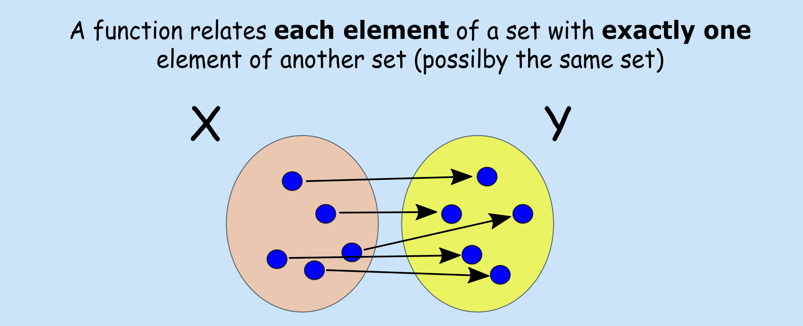

# Functions

**Aims**

- to revisit the concept of a function

**Learning outcomes**

- to be able to explain what function, function domain and function range are
- to be able to identify input, output, argument, independent variable, dependent variable
- to be able to evaluate function for a given value and plot the function

## Definitions


```{r func-def, echo=F, fig.align="center", fig.cap="Formal function defition"}


```

- A **function**, $f(x)$, can be viewed as a rule that relates input $x$ to an output $f(x)$
- In order for a rule to be a function it must produce a single output for any given input
- Input $x$ is also known as **argument** of the function
- **Domain of a function**: the set of all values that the function "maps"
- **Range**: the set of all values that the function maps into

<br/>
**Many names are used interchangeably** 

Functions have been around for a while and there are many alternative names and writing conventions are being used. Common terms worth knowing:
```{r func-ters, echo=F, fig.align="center", fig.cap="Common function terms"}
knitr::include_graphics("figures/precourse/math-functions-terms.png")

```

## Evaluating function
To evaluate a function is to replace (substitute) its variable with a given number or expression. E.g. given a rule (function) that maps temperature measurements from Celsius to Fahrenheit scale:
$$f(x) = 1.8x + 32$$
where $x$ is temperature measurements in Celsius and $f(x)$ is the associated value in Fahrenheit, we can find for a given temperature in Celsius corresponding temperature in Fahrenheit. Let's say we measure 10 Celsius degrees one autumn day in Uppsala and we want to share this information with a friend in USA. We can find the equivalent temperature in Fahrenheit by evaluating our function at 10, $f(10)$, giving us $$f(10) = 1.8\cdot 10 + 32 = 50$$

## Plotting function
Function graphs are a convenient way of showing functions, by looking at the graph it is easier to notice function's properties, e.g. for which input values functions yields positive outcomes or whether the function is increasing or decreasing. To graph a function, one can start by evaluating function at different values for the argument $x$ obtaining $f(x)$, plotting the points by plotting the pairs $(x, f(x))$ and connecting the dots. E.g. evaluating our above temperature rule at -20, -10, 0, 10, 20, 30 Celsius degrees results in: 

```{r, echo=F, include=FALSE}

x <- c(-20, -10, 0, 10, 20, 30)
y <- 1.8*x + 32

temp = data.frame(Celsius = x, Fahrenheit  = y)

knitr::kable(
  temp, booktabs = TRUE,  align = "cc",
  caption = 'A table of the Celsius degrees and their corresponding Fahrenheit degrees')
  
```

|x (Celsius degrees) | evaluates | f(x) (Fahrenheit degrees)|
| :-----------: | :-----------: | :-------: |
|-20 | $f(-20) = 1.8 \cdot (-20) + 32$| -4 |
|-10 | $f(-10) = 1.8 \cdot (-10) + 32$| 14 |
|0 | $f(0) = 1.8 \cdot (0) + 32$| 32 |
|10 | $f(10) = 1.8 \cdot (10) + 32$| 50 |
|20 | $f(20) = 1.8 \cdot (20) + 32$| 68 |
|30 | $f(30) = 1.8 \cdot (30) + 32$| 86 |

```{r, echo=F, fig.align="center", fig.width=4, fig.height=4, fig.cap="Graph of f(x) for the temeprature rule"}

x <- c(-20, -10, 0, 10, 20, 30)
y <- 1.8*x + 32

plot(x, y, xlab="temperature [Celsius]", ylab="temperature [Farenheit]", type="b", panel.first = grid())

```

## Standard classes of functions
**Algebraic function**: functions that can be expressed as the solution of a polynomial equation with integer coefficients, e.g. 

- constant function $f(x) = a$
- identity function $f(x) = x$
- linear function $f(x) = ax + b$
- quadratic function $f(x) = a + bx + cx^2$
- cubic function $fx() = a + bx + cx^2 + dx^3$

**Transcendental functions**: functions that are not algebraic, e.g. 

- exponential function $f(x) = e^x$
- logarithmic function $f(x) = log(x)$
- trigonometric function $f(x) = -3sin(2x)$

```{r, echo=F, fig.align="center", fig.cap="Examples of the standard classess of functions"}

x = seq(-10, 10, 0.1)

par(mfrow=c(2,4))
plot(x, y=rep(4, length(x)), type="l", xlab="x", ylab="f(x)", main=expression("f(x)=4"))
plot(x, y=x, type="l", xlab="x", ylab="f(x)", main=expression("f(x)=x"))
plot(x, y=2*x + 4, type="l", xlab="x", ylab="f(x)", main=expression("f(x)=2x + 4"))

x = seq(-30, 30, 0.1)
plot(x, y=x^2 + 2*x + 4, type="l", xlab="x", ylab="f(x)", main=expression("f(x)=x"^2*"+ 2x + 4"))
plot(x, y=x^3 + x^2 + 2*x + 4, type="l", xlab="x", ylab="f(x)", main=expression("f(x)=x"^3*"+x"^2*"+ 2x + 4"))
plot(seq(1,10,0.1), y=exp(seq(1,10,0.1)), type="l", xlab="x", ylab="f(x)", main=expression("f(x)=exp(x)"))
plot(seq(1,10,0.1), y=log(seq(1,10,0.1)), type="l", xlab="x", ylab="f(x)", main=expression("f(x)=log(x)"))

x = seq(-10, 10, 0.1)
plot(x, y=sin(x), type="l", xlab="x", ylab="f(x)", main=expression("f(x)=sin(x)"))

```

## Piecewise functions
A function can be in pieces, i.e. we can create functions that behave differently based on the input $x$ value. They are useful to describe situations in which a rule changes as the input value crosses certain "boundaries". E.g. a function value could be fixed in a given range and equal to the input value (identify function) for input values outside this range

\begin{equation}
    f(x) =
    \left\{
        \begin{array}{cc}
                2 & \mathrm{if\ } x \le 1 \\
                x & \mathrm{if\ } x>1 \\
        \end{array}
    \right.
\end{equation}

The function can be split in many pieces, e.g. the personal training fee in SEK may depend whether the personal trainer is hired for an hour, two hours or three or more hours:
\begin{equation}
    f(h) =
    \left\{
        \begin{array}{cc}
                500  & \mathrm{if\ } h \le 1 \\
                750  & \mathrm{if\ } 1 < h \le 2 \\
                500 + 250 \cdot h & \mathrm{if\ } h > 2 \\
        \end{array}
    \right.
\end{equation}

```{r, echo=F, fig.align="center", fig.height=4, fig.cap="Examples of piece-wise functions"}

par(mfrow=c(1,2))
# Example of piece-wise function 01
x1 <- seq(-2, 1, 0.1)
y1 <- rep(2, length(x1))

x2 <- seq(1.01, 5, 0.1)
y2 <- x2

#grid(nx = NULL, ny = NULL, col = "lightgray", lty = "dotted")
plot(x1, y1, type="l", xlim=c(-2.5, 5), ylim=c(0, 5), xlab="x", ylab="f(x)", las=1, panel.first = grid())
points(x1[length(x1)], y1[length(x1)], pch=19)
points(x2, y2, type="l")
points(x2[1], y2[1])

# Example of piece-wise function 02
x1 = seq(0, 1, 0.1)
y1 = rep(500, length(x1))

x2 = seq(1.01, 2, 0.1)
y2 = rep(750, length(x2))

x3 = seq(2, 10, 0.1)
y3 = 600 + 250*x3

plot(x1, y1, xlim=c(0, 10), ylim=c(0, 3000), xlab="h", ylab="f(h)", type="l", las = 1, panel.first = grid())
points(x1[length(x1)], y1[length(y1)], pch=19)

points(x2, y2, type="l")
points(x2[length(x2)], y2[length(y2)], pch=19)

points(x3, y3, type="l")
points(x3[1], y3[1])

```


-----

## Exercises: functions

```{exercise, "m-functions-evaluate-01"}

Given the function for the personal trainer costs: 

\begin{equation}
    f(h) =
    \left\{
        \begin{array}{cc}
                500  & \mathrm{if\ } h \le 1 \\
                750  & \mathrm{if\ } 1 < h \le 2 \\
                500 + 250 \cdot h & \mathrm{if\ } h > 2 \\
        \end{array}
    \right.
\end{equation}

How much would you pay

a) for a 4-hours session? Evaluate function f(h) for value 4. 
b) for a 2-hour session? Evalue function f(h) for value 2. 

```

```{exercise, "m-functions-write"}

A museum charges 50 SEK per person for a guided tour with a group of 1 to 9 people or a fixed 500 SEK fee for a group of 10 or more people. Write a function relating the number of people $n$ to the cost $C$.

```

```{exercise, "m-functions-plot-evaluate"}

Given function

\begin{equation}
    f(x) =
    \left\{
        \begin{array}{cc}
                x^2  & \mathrm{if\ } x \le 1 \\
                3  & \mathrm{if\ } 1 < x \le 2 \\
                x & \mathrm{if\ } x > 2 \\
        \end{array}
    \right.
\end{equation}
                
a) sketch a graph of a function for $x \in (-4, 4)$, i.e.. for $x$ between -4 and 4
b) evaluate function at f(1)
b) evaluate function at f(4)


```


## Answers to selected exercises (functions) {-}

Exr. \@ref(exr:m-functions-evaluate-01)

a) $f(4) = 500 + 250 \cdot 4 = 1500$
b) $f(2) = 750$ as $h \le 2$ means less or equal to 2, that is including 2
