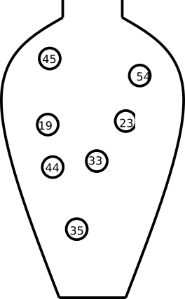

class: spaced

```{r, include=FALSE}
require(tidyverse)
require(ggplot2)
require(reshape2)
require(knitr)
require(kableExtra)
knitr::opts_chunk$set(fig.width=3.5, fig.height=3.5, echo = FALSE, cache=TRUE, error=FALSE, warnings=FALSE, dpi=600)
options(digits=2)
```

name: contRV
# Continuous random variable


.pull-left[A continuous random number is not limited to discrete values, but any continuous number within one or several ranges is possible.

Examples: weight, height, speed, intensity, ...

A continuous random variable can be described by its *probability density function*, pdf.]
.pull-right[
```{r, fig.show="hold", fig.cap="Probability density function of the weight of a newborn baby.", fig.height=4, fig.width=7}
baby <- data.frame(smoke=sample(1000, x=0:2, prob=c(0.45,0.45,0.1), replace=TRUE)) %>% mutate(m=c(3.4, 3.0, 2.5)[smoke+1], wt=rnorm(n(), mean=m, sd=0.5))
ggplot(baby, aes(x=wt)) + theme_bw() + xlab("x") + ylab("f(x)") + geom_density() 
```
]

---

# Probability density function

$$
  \int_{-\infty}^{\infty} f(x) dx = 1
$$

```{r wtbabiesdens3, out.width="49%", warning=FALSE, message=FALSE, fig.show="hold", fig.keep="all", fig.width=5, fig.height=3.5}
ggplot(baby, aes(x=wt)) + theme_bw() + xlab("x") + ylab("f(x)") + geom_density() 
#plot(ggplot(data.frame(w=wt), aes(x=w)) + theme_bw() + xlab("x") + ylab("f(x)") + geom_density())

df.wt <- density(baby$wt)
df.wt <- data.frame(x=df.wt$x, y=df.wt$y)
plot(ggplot(baby, aes(x=wt)) + theme_bw() + xlab("x") + ylab("f(x)") + geom_density() + geom_area(data=df.wt %>% filter(x<3.75, x>2.33), aes(x=x, y=y)) + scale_x_continuous(breaks=c(2,2.33,3,3.75,4,5), labels=c('2','a','3','b','4','5')) + geom_hline(yintercept=0) + theme(panel.grid.minor = element_blank(), panel.grid.major.x = element_line(color = c("grey92", NA, "grey92", NA, "grey92", "grey92"))))
#plot(ggplot(data.frame(w=wt), aes(x=w)) + theme_bw() + xlab("x") + ylab("f(x)") + geom_density() + geom_area(data=df.wt %>% filter(x<3.75, x>2.33), aes(x=x, y=y)) + scale_x_continuous(breaks=c(2,2.33,3,3.75,4,5), labels=c('2','a','3','b','4','5')) + geom_hline(yintercept=0) + theme(panel.grid=element_blank()))
```

```{r pdfwtnorm, out.width="100%", eval=TRUE}
w<-seq(1.5,5.5,.01)
df.nwt <- data.frame(w=w, f=dnorm(w, 3.5, 0.5))
```

The area under the curve from $a$ to $b$ is the probability that the random variable $X$ takes a value between $a$ and $b$.

$P(a \leq X \leq b) = \int_a^b f(x) dx$

---
# Cumulative distribution function
  
The *cumulative distribution function*, cdf, $F(x)$, is defined as:
  
$$F(x) = P(X \leq x) = \int_{-\infty}^x f(x) dx$$
  
```{r wtpdfcdf, out.width="49%", fig.show="hold", fig.width=5, fig.height=3.5}
plot(ggplot(df.nwt, aes(x=w, y=f)) + geom_line() + theme_bw() + xlab("x") + ylab("f(x)") + geom_area(data=df.nwt %>% filter(w<4.0)) + annotate("label",label=sprintf("P(X<4.0) = F(4.0) = %.2f", pnorm(4,3.5,0.5)), x=2.7, y=0.4, hjust=0))
df.nwt$F <- pnorm(df.nwt$w, 3.5, 0.5)
plot(ggplot(df.nwt, aes(x=w, y=F)) + geom_line() + xlab("x") + ylab("F(x)") + theme_bw() + geom_point(aes(x=4, y=pnorm(4,3.5,.5))) + annotate("label",label=sprintf("F(4.0)=%.2f", pnorm(4,3.5,.5)), x=4, y=.84, hjust=-0.2))##+ ggtitle("Cumulative distribution function") 
```

As we know that the total probability (over all x) is 1, we can conclude that 

$$P(X > x) = 1 - P(X \leq x) = 1 - F(x)$$
  and thus

$$P(a < X \leq b) = F(b) - F(a)$$
---

# Parametric continuous distributions

Two important parameters of a distribution is the expected value, $\mu$, that describe the distributions location and the variance, $\sigma^2$, that describe the spread.

The expected value, or population mean, is defined as;

$$E[X] = \mu = \int_{-\infty}^\infty x f(x) dx$$

The variance is defined as the expected value of the squared distance from the population mean;

$$\sigma^2 = E[(X-\mu)^2] = \int_{-\infty}^\infty (x-\mu)^2 f(x) dx$$

The square root of the variance is called the standard deviation, $\sigma$.


---

layout: true
name: normal
# Normal distribution

---

.pull-left[
The normal probability density function

$$f(x) = \frac{1}{\sqrt{2 \pi} \sigma} e^{-\frac{1}{2} \left(\frac{x-\mu}{\sigma}\right)^2}$$
  
describes the distribution of a normal random variable, $X$, with expected value $\mu$ and standard deviation $\sigma$, $e$ and $\pi$ are two common mathematical constants, $e \approx 2.71828$ and $\pi \approx 3.14159$.

In short we write $X \sim N(\mu, \sigma)$.

The bell-shaped normal distributions is symmetric around $\mu$ and $f(x) \rightarrow 0$ as $x \rightarrow \infty$ and as $x \rightarrow -\infty$.
]
.pull-right[
```{r norm, out.width="100%", fig.show="hold", fig.align="center"}
#ggplot(pop.FN, aes(x=Bodyweight)) + geom_histogram(binwidth=1, aes(y=stat(density)), color="white") + theme_bw() + geom_line(data=den.FN, aes(x=x, y=nfx), color="red")
x <- seq(-3.5, 3.5, .1)
dN <- data.frame(x=x, fx=dnorm(x))
plot(ggplot(dN, aes(x=x, y=fx)) + geom_line() + scale_x_continuous(breaks=-3:3, labels=c(expression(mu-3*sigma),expression(mu-2*sigma), expression(mu-1*sigma), expression(mu), expression(mu+sigma), expression(mu + 2*sigma),  expression(mu + 3*sigma))) + xlab("") + ylab("f(x)") + theme_bw())
```
]
---

As $f(x)$ is well defined, values for the cumulative distribution function $F(x) = \int_{- \infty}^x f(x) dx$ can be computed.

```{r out.width="45%", fig.show="hold"}
dN$Fx <- pnorm(x)
ggplot(dN, aes(x=x, y=fx)) + geom_line() + scale_x_continuous(breaks=-3:3, labels=c(expression(mu-3*sigma),expression(mu-2*sigma), expression(mu-1*sigma), expression(mu), expression(mu+sigma), expression(mu + 2*sigma),  expression(mu + 3*sigma))) + xlab("") + ylab("f(x)") + theme_bw() + ggtitle("Probability density function")
ggplot(dN, aes(x=x, y=Fx)) + geom_line() + scale_x_continuous(breaks=-3:3, labels=c(expression(mu-3*sigma),expression(mu-2*sigma), expression(mu-1*sigma), expression(mu), expression(mu+sigma), expression(mu + 2*sigma),  expression(mu + 3*sigma))) + xlab("") + ylab("F(x)") + theme_bw() + ggtitle("Cumulative distribution function")
```

---
layout: false
name: stdnorm
layout: true

# Standard normal distribution

---

Using transformation rules we can define

$$Z = \frac{X-\mu}{\sigma}, \, Z \sim N(0,1)$$ 
  
Values for the cumulative standard normal distribution, $F(z)$, are tabulated and easy to compute in R using the function `pnorm`.

```{r FZ, out.width="50%", fig.width=5, fig.height=3.5}
w<-seq(-3.5,3.5,.01)
df.nwt <- data.frame(w=w, f=dnorm(w))
plot(ggplot(df.nwt, aes(x=w, y=f)) + geom_line() + theme_bw() + xlab("x") + ylab("f(x)") + geom_area(data=df.nwt %>% filter(w<0.7)) + annotate("label",label=sprintf("P(Z<z) = F(z)"), x=-1.0, y=0.1, hjust=0) + scale_x_continuous(breaks=c(-2,0,+.7,2), labels=c("-2","0","z","2")) + theme(panel.grid.minor = element_blank(), panel.grid.major.x = element_line(color = c("grey92", "grey92", NA, "grey92"))))
```

---

.pull-left[Properties of the standard normal distribution

$P(Z \leq -z) = P(Z \geq z) = 1 - P(Z \leq z)$

$P(Z < z) = P(Z \leq z)$

Some value of particular interest:
  
$$F(1.64) = 0.95\\
F(1.96) = 0.975$$

As the normal distribution is symmetric $F(-z) = 1 - F(z)$

$$F(-1.64) = 0.05\\
F(-1.96) = 0.025$$

$$P(-1.96 < Z < 1.96) = 0.95$$]
.pull-right[
```{r}
z <- sapply(seq(-3.4, -3.49, -0.01), function(x) seq(x,0,0.1))
z <- -z[nrow(z):1,]
z <- sapply(seq(0, 0.09, 0.01), function(x) seq(x,3.49,0.1))
zscore.df <- apply(pnorm(z), 2, function(x) sprintf("%.4f",x))
row.names(zscore.df) <- sprintf("%.1f", z[,1])
colnames(zscore.df) <- seq(0,0.09,0.01)
kable(zscore.df, caption = "F(z) = P(Z <= z)") %>% kable_styling(font_size = 8)
```
]

---
layout: false

# Sum of two normal random variables
  
If $X \sim N(\mu_1, \sigma_1)$ and $Y \sim N(\mu_2, \sigma_2)$ are two independent normal random variables, then their sum is also a random variable:
  
$$X + Y \sim N(\mu_1 + \mu_2, \sqrt{\sigma_1^2 + \sigma_2^2})$$
  
  and 

$$X - Y \sim N(\mu_1 - \mu_2, \sqrt{\sigma_1^2 + \sigma_2^2})$$
This can be extended to the case with $n$ independent and identically distributed random varibles $X_i \in N(\mu, \sigma)$.

$$\sum_{i=1}^n X_i \in N(n\mu, \sqrt{n}\sigma)$$

---
layout: true
name: CLT

# Central limit theorem

> The sum of $n$ independent and equally distributed random variables is normally distributed, if $n$ is large enough.

---

As a result of central limit theorem, the distribution of fractions or mean values of a sample follow the normal distribution, at least if the sample is large enough (a rule of thumb is that the sample size $n>30$).

---

Example. In a population of 252 men we can study the distribution of BMI.

```{r fatdata}
fat <- read.table("http://jse.amstat.org/datasets/fat.dat.txt")
colnames(fat) <- c("case","body.fat","body.fat.siri","density","age","weight","height","BMI","ffweight","neck","chest","abdomen","hip","thigh","knee","ankle" ,"bicep","forearm","wrist" )
```

```{r BMIhist, out.width="60%", fig.width=5, fig.height=3.5, fig.align="center"}
pl <- ggplot(fat, aes(x=BMI)) + geom_histogram(aes(y=stat(density)), binwidth=2, color="white") + theme_bw()
plot(pl)
```


```{r BMI, eval=FALSE}
##Population mean
(mu <- mean(fat$BMI))
##Population variance
(sigma2 <- var(fat$BMI)/nrow(fat)*(nrow(fat)-1))
##Population standard variance
(sigma <- sqrt(sigma2))
```

Randomly sample 3, 5, 10, 15, 20, 30 men and compute the mean value, $m$. Repeat many times to get the distribution of mean values.

---

```{r owexample, out.width="100%", fig.width=7, fig.show="hold"}
#hist(fat$BMI)
bmi <- fat$BMI
n <- c(3,5,10,15,20, 30)
rs <- sapply(n, function(k) replicate(10000, mean(sample(bmi, k))))
plot(ggplot(melt(rs, varnames=c("rep", "n")), aes(x=value, color=factor(n))) + geom_density() + theme_bw() + facet_wrap(~n) + theme(legend.position = "none"))
```

---
layout: false

# $\chi^2$-distribution

.pull-left[
If $X_i$ are independent identically distributed random variables $X_i \in N(0,1)$, then 
$$Y = \sum_{i=1}^n X_i^2$$
is $\chi^2$ distributed with $n-1$ degrees of freedom.

In short $Y \in \chi^2_{n-1}$.

Example: The sample variance $S^2 = \frac{1}{n-1} \sum_{i=1}^n (X_i-\bar X)^2$ is such that $\frac{(n-1)S^2}{\sigma^2}$ is $\chi^2$ distributed with $n-1$ degrees of freedom.

]
.pull-right[
```{r Xdistr, fig.width=7, fig.height=7, out.width="100%"}
x <- seq(-0,5, .01)
dX <- data.frame(x=x, n=rep(c(2, 3,4,5,7, 10), each=length(x))) %>%
  mutate(fx=dchisq(x, df=n-1))
#dT <- data.frame(x=x, fx=dt(x, df=n-1))
ggplot(dX, aes(x=x, y=fx, color=factor(paste0("n=",n), levels=paste0("n=",sort(unique(n)))))) + geom_line() + theme_bw() + scale_color_discrete("") + ylim(c(0,0.5)) + theme(legend.position = c(1,1), legend.justification = c(1,1))
```
]

---
  
# F-distribution

.pull-left[
The ratio of two $\chi^2$-distributed variables divided by their degrees of freedom is F-distributed

Example: The ratio of two sample variances is F-distributed
]
.pull-right[
```{r Fdistr, fig.width=5, fig.height=5, fig.cap="The F-distribution"}
x <- seq(-0,5, .01)
dX <- data.frame(x=x, n1=rep(c(2,4,10), each=length(x)), n2=rep(c(2,4,10), each=length(x)*3)) %>%
  mutate(fx=df(x, df1=n1-1, df2=n2-1))
#dT <- data.frame(x=x, fx=dt(x, df=n-1))
ggplot(dX, aes(x=x, y=fx, color=factor(sprintf("n1=%i, n2=%i",n1, n2), levels=sprintf("n1=%i, n2=%i",rep(sort(unique(n1)), each=3), sort(unique(n2)))))) + geom_line() + theme_bw() + scale_color_discrete("") + ylim(c(0,0.8)) + theme(legend.position = c(1,1), legend.justification = c(1,1))
```
]

<!-- Example. F-test of equality of variances -->
---

# t-distribution
  
The ratio of a normally distributed variable and the square root of a $\chi^2$-distributed variable is t-distributed.

```{r exampletdistr, fig.width=5, fig.height=3.5, out.width="70%"}
x <- seq(-3.5,3.5, .01)
dT <- data.frame(x=x, n=rep(c(2, 3,5,7, 10, 15, 20, 30), each=length(x))) %>%
  mutate(fx=dt(x, df=n-1))
#dT <- data.frame(x=x, fx=dt(x, df=n-1))
ggplot(dT, aes(x=x, y=fx, color=factor(paste0("n=",n), levels=paste0("n=",sort(unique(n)))))) + geom_line() + theme_bw() + scale_color_discrete("")
```


The ratio between sample mean and sample variance is t-distributed.

---
layout:false


layout: true
# Random sampling and experimental design

---

In many (most) experiments it is not feasible to examine the entire population. Instead we study a **random sample**.

A **random sample** is a random subset of individuals from a population.

There are different techniques for performing random sampling, two common techniques are **simple random sampling** and **stratified random sampling**.

A **simple random sample** is a random subset of individuals from a population, where every individual has the same probability of being choosen. Simple random sampling can be performed using the urn model. If every individual in the population is represented by one ball, a simple random sample of size $n$ can be achieved by drawing $n$ balls from the urn, without replacement.


---

## Simple random sample

A **simple random sample** is a random subset of individuals from a population, where every individual has the same probability of being choosen. 

Simple random sampling using an urn model;

Let every individual in the population be represented by a ball. The value on each ball is the measurement we are interested in, for example height, shoe size, hair color, healthy/sick, type of cancer/no cancer, blood glucose value, etc.

Draw $n$ balls from the urn, without replacement, to get a random sample of size $n$.

```{r urns, echo=FALSE, out.width = '20%', fig.align="center", fig.show="hold"}
knitr::include_graphics("figures/ageurn.png")
```

---

## Stratified random sampling

In **stratified random sampling** the population is first divided into subpopulations based on important attributes, e.g. sex (male/female), age (young/middle aged/old) or BMI (underweight/normal weight/overweight/obese). Simple random sampling is then performed within each subpopulation.




## Principles of experimental design

It is important to consider **extraneous variables**, when assigning experimental units to treatment or control group.

Extraneous variable are variables that are not your main interest but that might affect the studied experimental outcome or the variable of interest.

Such as age, sex, batch, experiment date, laboratory personell etc.

## Principles of experimental design

Fundamental to experimental design are the three principles; **replication**, **randomization** and **blocking**.

## Principles of experimental design

### Replication

Replication is the repetition of the same experiment, with the same conditions. **Biological replicates** are measurements of different biological units under the same conditions, whereas **technical replicates** are repeated measurements of the same biological unit under the same conditions.

## Principles of experimental design

### Randomization

Experimental units are not identical, hence by assigning experimental units to treatment/control at random we can avoid unnecessary bias. It is also important to perform the measurements in random order.

<!-- - **Completely randomized design**, the experimental units are assigned to treatment and control groups at random. -->
<!-- - **Randomized block design**, first group the experimental units based on extraneous variables such as sex, age, BMI, then within each group assign the experimental units to treatment/control at random. -->

## Principles of experimental design

### Blocking

Blocking is grouping experimental units into blocks consisting of units that are similar to one another and assigning units within a block to treatment/control at random. Blocking reduces known but irrelevant sources of variation between units and thus allows greater precision in the estimation of the source of variation under study.

The experimental units can be grouped into blocks according to their properies (e.g. age, sex, etc). Units within a block will be more similar than between blocks. By assigning units within a block to treatment/control at random, the variation due to differences between blocks (that are not relevant to the studied outcome) can be reduced.

In many retrospective studies it is not possible to assign patients into treatment/control or sick/healthy. Experimental design is still important for controling sources of variation introduced during the experiment.

## Principles of experimental design

**Block what you can; randomize what you cannot.**

---
layout: false
layout: true

# Sample properties

---
Summary statistics can be computed for a sample, such as the sum, proportion, mean and variance.

---
## Sample proportion

The proportion of a population with a particular property is $\pi$.

The number of individuals with the property in a simple random sample of size $n$ is a random variable $X$.

The proportion of individuals in a sample with the property is also a random variable;

$$P = \frac{X}{n}$$
with expected value 
$$E[P] = \frac{E[X]}{n} = \frac{n\pi}{n} = \pi$$
---

## Sample mean and variance

For a particular sample of size $n$; $x_1, \dots, x_n$, the sample mean is denoted $m = \bar x$. The sample mean is calculated as;
  
  $$m = \bar x = \frac{1}{n}\displaystyle\sum_{i=1}^n x_i$$
and the sample variance as;

$$s^2 = \frac{1}{n-1} \sum_{i=1}^n (x_i-m)^2$$
---
## Sample mean and variance

Note that the mean of $n$ independent identically distributed random variables, $X_i$ is itself a random variable;
  
$$\bar X = \frac{1}{n}\sum_{i=1}^n X_i,$$
If $X_i \sim N(\mu, \sigma)$ then $\bar X \sim N\left(\mu, \frac{\sigma}{\sqrt{n}}\right)$.

When we only have a sample of size $n$, the sample mean $m$ is our best estimate of the population mean. It is possible to show that the sample mean is an unbiased estimate of the population mean, i.e. the average (over many size $n$ samples) of the sample mean is $\mu$.

$$E[\bar X] = \frac{1}{n} n E[X] = E[X] = \mu$$

Similarly, the sample variance is an unbiased estimate of the population variance.

---
layout: false

# Standard error

Sample estimates of mean and variance are unbiased, but not perfect.

The standard deviation of the sampling distribution (the distribution of sample estimates) is called the standard error.

```{r SE, out.width="50%"}
x<-seq(1.5,5.5,.01)
df.nwt <- data.frame(x=x, f=dnorm(x, 3.5, 0.5))
ggplot(df.nwt, aes(x=x, y=f)) + geom_line() + ggtitle("N(3.5, 0.5)")
m <- replicate(1000, mean(rnorm(10, m=3.5, sd=0.5)))
ggplot(data.frame(m=m), aes(x=m)) + geom_histogram(color="white", bins=25) + ggtitle("mean of a sample of size 10")
```


---

# Standard error of the mean

For the sample mean, $\bar X$, the variance is

$$E[(\bar X - \mu)^2] = var(\bar X) = var(\frac{1}{n}\sum_i X_i) = \frac{1}{n^2} \sum_i var(X_i) = \frac{1}{n^2} n var(X) = \frac{\sigma^2}{n}$$
The standard error of the mean is thus;

$$SEM = \frac{\sigma}{\sqrt{n}}$$
Replacing $\sigma$ with the sample standard deviation, $s$, we get an estimate of the standard deviation of the mean;

$$SEM \approx \frac{s}{\sqrt{n}}$$
An alternative definition of standard error of the mean is actually 

$$SEM = \frac{s}{\sqrt{n}}$$