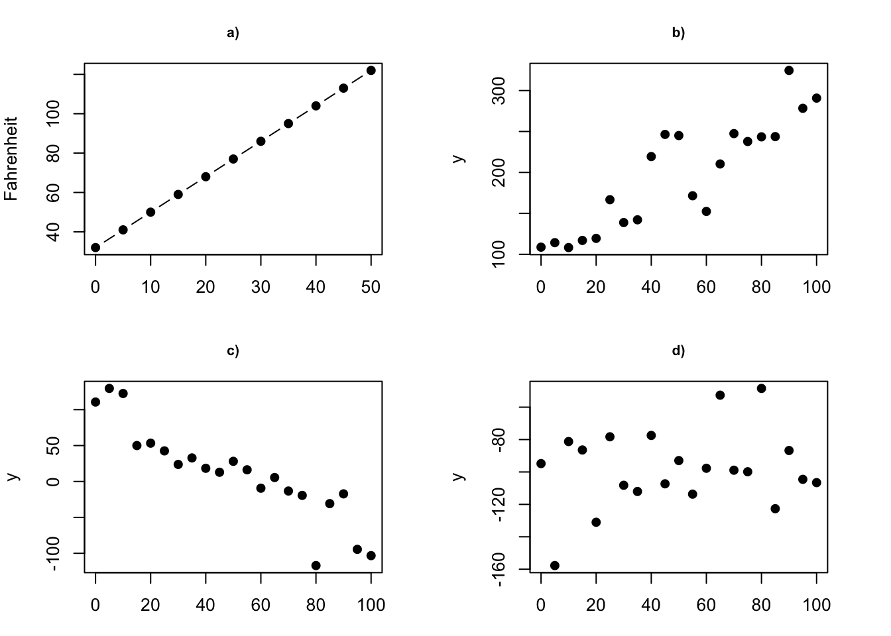

Learning outcomes
-----------------

-   understand simple linear regression model incl. terminology and
    mathematical notations
-   estimate model parameters and their standar error
-   use model for checking the association between *x* and *y*
-   use model for prediction
-   assees model accuracy with RSE and R**<sup>2</sup>
-   check model assumptions
-   to be able to use `lm` function in R for model fitting, obtaining
    confidence interval and predictions

------------------------------------------------------------------------

Introduction
------------

-   [Quiz](https://forms.gle/bHZr1MP454npysAFA): What do we already know
    about `simple linear regression`?

#### Description

-   Simple linear regression is a statistical method that allows us to
    summarize and study relationships between two continuous
    (quantitative, numerical) variables
    -   one variable, denoted `x` is regarded as the *predictor*,
        *explanatory*, or *indepedent variable*, e.g. body weight (kg)
    -   the other variable, denoted `y`, is regarded as the *response*,
        *outcome*, or *dependent variable*, e.g. plasma volume (l)
-   It is used to estimate the best-fitting straight line to describe
    the association

#### Used for to answer questions such as:

-   is there a relationship between `x` exposure (e.g. body weight) and
    `y` outcome (e.g. plasma volume)?
-   how strong is the relationship between the two variables?
-   what will be a predicted value of the `y` outcome given a new set of
    exposure values?
-   how accurately can we predict the outcome?


<p class="caption">
**Determinisitc vs. statistical relationship**: a) deterministic:
equation exactly describes the relationship between the two variables
e.g. *F**a**h**r**e**n**h**e**i**t* = 9/5 \* *C**e**l**c**i**u**s* + 32;
b) statistical relationship between x and y is not perfect (increasing),
c) statistical relationship between x and y is not perfect (decreasing),
d) random signal
</p>

### Example data

Example data contain the body weight and plasma volume for eight healthy
men.

``` r
weight <- c(58, 70, 74, 63.5, 62.0, 70.5, 71.0, 66.0) # body weight (kg)
plasma <- c(2.75, 2.86, 3.37, 2.76, 2.62, 3.49, 3.05, 3.12) # plasma volume (liters)
```

Scatter plot of the data shows that high plasma volume tends to be
associated with high weight and *vice verca*. Linear regrssion gives the
equation of the straight line that best describes how the outcome
changes (increase or decreases) with a change of exposure variable (in
red)


The equation of the regression line is:

*y* = *b**e**t**a*<sub>0</sub> + *b**e**t**a*<sub>1</sub>*x*

### Estimating the Coefficients

### Assessing the Accuracy of the Coefficient Estimates

### Asesssing the Accuracy of the Model

    ## [1] 0.7591266

    ## 
    ## Call:
    ## lm(formula = y ~ x)
    ## 
    ## Residuals:
    ##      Min       1Q   Median       3Q      Max 
    ## -0.27880 -0.14178 -0.01928  0.13986  0.32939 
    ## 
    ## Coefficients:
    ##             Estimate Std. Error t value Pr(>|t|)  
    ## (Intercept)  0.08572    1.02400   0.084   0.9360  
    ## x            0.04362    0.01527   2.857   0.0289 *
    ## ---
    ## Signif. codes:  0 '***' 0.001 '**' 0.01 '*' 0.05 '.' 0.1 ' ' 1
    ## 
    ## Residual standard error: 0.2188 on 6 degrees of freedom
    ## Multiple R-squared:  0.5763, Adjusted R-squared:  0.5057 
    ## F-statistic:  8.16 on 1 and 6 DF,  p-value: 0.02893

    ##          x 
    ## 0.01526836

    ##        x 
    ## 1.023998

------------------------------------------------------------------------

**Next**: [Regression session II: multiple linear
regression](../session-regression-II/session-regression-II.md)
