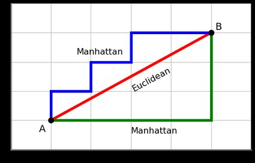

# Learning outcomes

* ML pipeline
    + preprocessing (scaling, normalization/standardization);
    + Feature selection
    + Cross-validation
    + Model evaluation
    + Over/underfitting
* Likelihood
    + Relation to OLS for linear model
* Overfitting
* Regularization
    + Model comparison 
        - AIC
    + Feature selection
        - LASSO, ridge regression
* Cross validation


# Likelihood

Likelihood is concerned with estimating how likely it is that a certain model or certain model parameter values are *true* ones.

Consider a generative model, with parameters $\theta$, for how $X\rightarrow Y$. We would like to test if $\theta$ are good parameters. Given the model, we can compute
$Pr[Y| X, \theta]$,
that is, the probability that the model with parameters $\theta$ and given $X$ generates $Y$. 

Likelihood builds on the intuition that if parameters $\theta_T$ is close to the 'truth', then $Pr[Y| X, \theta]$ will be higher for $\theta_T$ than for any more "wrong" parameter $\theta_W$. We should therefore select the $\theta$ that maximizes $Pr[Y| X, \theta]$; this is called maximum likelihood estimation (MLE) of $\theta$.

Since statistical model contain an element of randomness, the reasoning above might not always be correct for any single observation. However, if we sum over a large number of observations it will be true on average. Hence the need for datasets that are large enough.

To formalize this intuition, Edwards (1972) defined the likelihood of model parameters being true given observed data as

$$L[\theta|Y,X] \propto Pr[Y|X, \theta]$$
<details>
<summary> <span style="color:gray">Extra Reading</span> </summary>

Notice that this notation is not uncommonly mixed up, so you might also see the notation $L[Y|X,\theta]$ for the likelihood.

Similarly $Pr[Y|X, \theta]$ is often referred to as the *likelihood function* or simply the likelihood.

***
</details>
Notice that this means that $L[\theta|Y,X]$ is not a proper probability, hence the term *likelihood* is used.
<details>
<summary> <span style="color:gray">Extra Reading</span> </summary>
In fact, for continuous $Y$, $Pr[Y|X, \theta]$ may be a density $f[Y|X, \theta]$ rather than a probability.

***
</details>

In practice, the proportionality is ignored and we set

$$L[\theta|Y,X] = Pr[Y|X, \theta]$$

<details>
<summary> <span style="color:gray">Extra Reading</span> </summary>
The proportionality (indicated by '$\propto$') means there are some unknown constant factor, $k$, such that $L[\theta|Y,X] = k Pr[Y|X, \theta]$. However, the factor $k$ is assumed to be constant over $\theta$s and over models. 

When the likelihood of two $\theta$s (or models) are compared this is almost always done as a _likelihood ratio_, 

$$\frac{L[\theta_1|Y,X]}{L[\theta_0|Y,X]} = \frac{k Pr[Y|X, \theta_1]}{ k  Pr[Y|X, \theta_0]} =\frac{Pr[Y|X, \theta_1]}{ Pr[Y|X, \theta_0]}$$

which means that the factor $k$ disappears. Hence the factor $k$ is always ignored. Likelihood ratios is the basis of most model comparison statistics, e.g., the Wald test, the Score test, regularization... 

***
</details>

In maximum likelihood estimation, _MLE_, of some parameters $\theta$, one simply selects the estimates $\widehat\theta$ that gives the highest likelihood, i.e.,  $$\widehat{\theta} = argmax_{\theta}L[\theta|X,Y]$$
and equivalently $$max_{\theta}L[\theta|X,Y] = L[\widehat\theta|X,Y].$$
In many applications of  likelihood and maximum likelihood, it is practical to instead use the logarithm of the likelihood, the logLikelihood, $$\log L[\theta_1|Y,X].$$
<details>
<summary> <span style="color:gray">Extra Reading</span> </summary>
As mentioned above, the logarithm of the likelihood, the logLikelihood, $\log L[\theta_1|Y,X],$ or sometimes the negative logLikelihood, $-\log L[\theta_1|Y,X]$, is often used. Notice, that 

1. The $\theta$ estimates that maximizes  $\log L[\theta|Y,X]$ also maximizes $L[\theta|Y,X]$
2. The $\theta$ estimates that minimizes $-\log L[\theta|Y,X]$ maximizes $L[\theta|Y,X]$
3. A likelihood ratio corresponds to a logLikelihood difference, $$\log\left(\frac{L[\theta_1|Y,X]}{L[\theta_0|Y,X]}\right) = \frac{\log L[\theta_1|Y,X]}{\log L[\theta_0|Y,X]} = \log L[\theta_1|Y,X] - \log L[\theta_0|Y,X]$$.

***
</details>

Likelihood and maximum likelihood estimation are central concepts in statistics. Many statistical tests and methods uses or is based on the concept of maximum likelihood.

(In the following, I will simplify notation and not differentiate between estimates and random variables, e.g., $\theta$ will be used also for $\widehat\theta$.)


## Likelihood | `Likelihood and OLS for linear models`

<details>
<summary> Lecture notes </summary>

So, why have we used ordinary least squares (OLS), i.e., minimization of  RSS when estimating linear model parameters $\beta$ rather than maximum likelihood estimation?

Linear models is a special case with some nice properties when it comes to  likelihood. Consider a simple linear regression model,

$$ y = \beta x + \epsilon, $$

where the residuals $\epsilon\sim N(0,\sigma^2)$. 

It turns out that the maximum likelihood estimates of both $\beta$ and $\sigma^2$ are functions of the  RSS of the residuals, so that the likelihood can be approximated by

$$  \log L[\beta, \sigma^2|Y,X] \approx -\frac{N}{2} \log RSS$$

<details>
<summary> <span style="color:gray">Extra Reading</span> </summary>

The likelihood for given $\beta$ and $\sigma^2$, given observed data $Y$ and $X$ is given by

$$ L[\beta, \sigma^2|Y,X] = \prod_i pdf_{Normal}(y_i, \mu=\beta x_i, \sigma^2=\sigma^2) = \prod_i \frac{1}{\sqrt{2\pi \sigma^2}}e^{-\frac{(y_i-\beta x_i)^2}{2\sigma^"}} $$

where $pdf_{Normal}$ denotes the probability distribution function for the Normal distribution. If we work with the logLikelihood instead, we get 

$$\begin{eqnarray*}
\log L[\beta, \sigma^2|Y,X] 
&=& \sum_{i=1}^N \log\left(\frac{1}{\sqrt{2\pi \sigma^2}}e^{-\frac{(y_i-\beta x_i)^2}{2\sigma^2}}\right)\\
&=& \sum_{i=1}^N \left[\log\left(\frac{1}{\sqrt{2\pi \sigma^2}}\right)+\log\left(e^{-\frac{(y_i-\beta x_i)^2}{2\sigma^2}}\right)\right]\\
&=&   \sum_{i=1}^N \left[ \log \left(\frac{1}{\sqrt{2\pi \sigma^2}}\right) -\frac{(y_i-\beta x_i)^2}{2\sigma^2} \right]\\
&=&   \sum_{i=1}^N \left[ \log \left(\frac{1}{\sqrt{2\pi \sigma^2}}\right)\right] -\sum_{i=1}^N \left[\frac{(y_i-\beta x_i)^2}{2\sigma^2} \right]\\
&=&   N\log \left(2\pi \sigma^2\right)^{-1/2} -\frac{\sum_{i=1}^N (y_i-\beta x_i)^2}{2\sigma^2} \\
&=&   -\frac{N}{2}\log \left(2\pi \sigma^2\right)  -\frac{RSS}{2\sigma^2}
\end{eqnarray*}$$

We see here that minimizing $RSS$ (as in OLS) will maximize the logLikelihood, regardless of the value of $\sigma^2$. Moreover, it turns out that also $\sigma^2$ can be estimated fairly well by $RSS/N$. Hence, we get 

$$\begin{eqnarray*}
\log L[\beta, \sigma^2|Y,X]
&=&   -\frac{N}{2}\log \left(\frac{2\pi RSS}{N}\right)  -\frac{N}{2}\frac{RSS}{RSS}\\
&=&   -\frac{N}{2}\log RSS + \frac{N}{2}\log \frac{2\pi}{N} -\frac{N}{2}\\
&=&   -\frac{N}{2}\log RSS + C
\end{eqnarray*}$$
where $C=\frac{N}{2}\left(\log \frac{2\pi}{N} -1\right)$ is a constant that is usually ignored (in likelihood ratios, which is equivalent to log likelihoods differences, it will disappear).

***
</details>

This means that the maximum likelihood estimates of $\beta$ is exactly the same as those of the minimum RSS.

_**NB!** This is a special case for linear models and are not generally true for other models. For example, logistic regression is typically fitted using a maximum likelihood estimation _

In general, full-on likelihood computation and maximum likelihood estimation is relatively slow, so alternative and faster methods has been developed, e.g., OLS.


#  Overfitting

We will now look at a general problem in statistical modeling that can be visualized quite well with Likelihoods. We will later look at some solutions to this problem.

## Overfitting | `Example data`

First, you need some test data to play around with. For simplicity and convenience, you will simulate a toy data from a linear model and use this in the exercises. The advantage for us using simulated data is that we know the 'truth', i.e., how the data was simulated and we therefore have *oracle knowledge* about the true parameter values, e.g., for $\beta$.

### Task | `simulation of example data`
* The data should comprise 100 samples. 
* First generate 10 variables $(x_1,x_2,\ldots, x_{0})$ from a uniform distribution (use the function `runif`) and store them in a Matrix $X$. 
* Use an intercept $\beta_0=3$ 
* Generate effect sizes $\beta_1, \beta_2, \beta_3$ from a Uniform distribution in the interval $(0.5, 1.0)$ for the 3 first $X$ variable (use the function `runif`); record the 'true' effect sizes for reference.
* Finally generate outcome variable $Y$ using a linear model $Y = \beta_0 + \beta_1 x_i + \beta_2 x_2 + \beta_3 x_3 + \epsilon$, with $\epsilon\sim N(0,\sigma^2=1)$ (i.e., the residuals are drawn from a Normal distribution with mean=0 and standard deviation=1, *Tip:* use the R function `rnorm`).

```{r, echo=TRUE}
# To obtain exactly the same result as in the demo, set seed to 85
set.seed(85)
```

```{r, echo=TRUE}
N=100 # number of samples
P=10 # number of variables

# Draw variables, x_{i,1},...,x_{i,P} for all N individuals, from a uniform distribution in interval (0,1) (this is the default interval for runif)
# 1. runif generates N*P+1 values, round them off to 2 decimals
# 2. Put values into a matrix with N rows and P columns
X=matrix(round(runif(N*(P+1),min=0, max=2)), nrow=N, ncol=P)

# generate a y variable from a multivariate lm of 3 first X variables only
# intercept
b0=3
# effect sizes for first three variables
b=c(runif(3, min=0.5, max=1.0))

# generate y for all samples (=rows in X) using only the 3 first variables (columns) of X
Y <- b0 + X[,1] * b[1] + X[,2] * b[2] + X[,3] * b[3] + rnorm(N)

```

#### Think about:

* What can simulation be used for?

<details>
<summary> Some possible answers </summary>
<h4>Some possible answers</h4>

* Oracle knowledge when evaluating performance of methods, e.g., Type I and II errors 
* Estimating probabilities and probability distributions of, e.g., data and summary statistics of data

***

</details>
## Overfitting | `Model comparison`

Now consider the following two models for our data

\begin{eqnarray}
y & \sim & \beta_0 + \beta_1 x_1 & (1) \\
y & \sim &  \beta_0 + \beta_1 x_1 + \beta_2 x_2 & (2)
\end{eqnarray}

What are the max Likelihood estimates of the two models? (we can use the R function `logLik` in the `stats` package)

### Task | `plot two likelihoods`
* Create `lm` models for the two models, and
* store the likelihood (use `logLik`) in a vector
* plot the likelihoods

```{r,echo=T, fig.height=4, echo=TRUE, eval=FALSE}
library(stats)
ll= vector()
for(i in seq(1,2)){
  Xi=X[,seq(1,i)] # use variables 1..i
  ll[i] <- logLik(lm(Y~Xi)) # logLik extract loglikelihood from lm 
}
# plot likelihoods for models with 1 and 2 variables
plot(ll, ylab="log L", xlab="model #", type = "b", xlim=c(1,P), ylim=c(floor(min(ll)),ceiling(max(ll)))) 
# xlim and ylim not really necessary here, but I can reuse the plot statement below, so the plots look similar
```

<details>
<summary> *Show result*</summary>
```{r,echo=T, fig.height=4, echo=FALSE}
library(stats)
ll= vector()
for(i in seq(1,P)){
  Xi=X[,seq(1,i)]
  ll[i] <- logLik(lm(Y~Xi))
}
# plot likelihoods for models with 1 and 2 vaiables
plot(ll[1:2], ylab="log L", xlab="model #", type = "b", xlim=c(1,P), ylim=c(floor(min(ll)),ceiling(max(ll)))) 
# xlim and ylim not really necessary here, but I can reuse the plot statement below, so the plots look similar
```

***
</details>

... 2 variables are clearly better than 1 variable -- What if we add more variables?

### Task | `plot all likelihoods`

* Now repeat this for the sequence of models obtained by creating the next model by simply adding the next $X$ variable in order.

```{r,echo=T, fig.height=4, echo=TRUE, eval=FALSE}
# compute loglikelihood (ll) for all models including variables
# 1-i, for i <= P; store results in vector ll
ll= vector()
for(i in seq(1,P)){
  Xi=X[,seq(1,i)]
  ll[i] <- logLik(lm(Y~Xi))
}

# plot ll for all models
plot(ll, ylab="log L", xlab="model #", type = "b", xlim=c(1,P), ylim=c(floor(min(ll)),ceiling(max(ll)))) 

```

<details>
<summary> *Show result*</summary>
```{r,echo=T, fig.height=4, echo =FALSE}
# compute loglikelihood (ll) for all models including variables
# 1-i, for i <= P; store results in vector ll
ll= vector()
for(i in seq(1,P)){
  Xi=X[,seq(1,i)]
  ll[i] <- logLik(lm(Y~Xi))
}

# plot ll for all models
plot(ll, ylab="log L", xlab="model #", type = "b", xlim=c(1,P), ylim=c(floor(min(ll)),ceiling(max(ll)))) 

```

***
</details>

#### Think about:

* How does the Likelihood behave as more variables are added?

* Which is the maximum likelihood model? Is this correct given our *oracle knowledge*?

* What could be the problem with this behaviour? How would we like it to behave?

* How can we obtain the desired behaviour?

<details>
<summary> Some possible answers </summary>
<h4>Some possible answers</h4>
_Nested models_

* Model (1) can be described as a special case of Model (2) with the constraints on $\beta_2=0$

* Therefore Model (2) will always have equal or better ML than Model (1)


_Overfitting_

* Using our *oracle knowledge*, we know that the simulated data was generated from the 3 first variables
  + thus, the subsequent variables increase ML by modeling noise in data
  
* This is difficult to detect by just looking at the likelihoods

* Solutions
  + Seek the simplest model that is "good enough" -> Regularization

***
</details>


<details>
<summary> <span style="color:gray">Extra Reading</span> </summary>
<h2> Model comparison | `Likelihood ratio test`</h1>


For nested models $-2 \max \frac{L[\theta_1|Y,X]}{L[\theta_0|Y,X]}$ is $\chi^2(d)$-distributed, with $d=$ the difference in free parameters in the two models.
This fors the basis of the *likelihood ratio test*. This is very frequently used with in statistics, but does not perform any regularization. Applying a likelihood ratio test to our data yields the following result:

```{r, lrt, echo=F}
library(lmtest)
mprev <- lm(Y ~ X[,1])
lrt=data.frame(models=0, ll1=0, ll2=0, lr=0, P = 0, sign=0)
for(i in seq(2,P)){
  m <- lm(Y ~ X[,seq(1,i)])
  fit=lrtest(mprev,m)
  mprev=m
  sign = ifelse(fit$`Pr(>Chisq)`[2]>0.05,"no","yes")#ifelse(fit$`Pr(>Chisq)`[2]>0.01,"*",ifelse(fit$`Pr(>Chisq)`[2]>0.001, "**","***")))
  lr=fit$LogLik[1]-fit$LogLik[2]
  lrt[i-1,] = list(paste0(i-1," vs ", i," variables"), signif(fit$LogLik[1], 5), signif(fit$LogLik[2], 5), format(lr, digits=4), format(fit$`Pr(>Chisq)`[2],digits=3, scientific=-1), sign)
}
library(kableExtra)
kable(lrt,"html",row.names=F, col.names=c("Compared models","logL 1st model","logL 2nd model","logLR", "P-value", "Sign at 0.05"),digits=30, format.args=list(snsmall=0)) %>% kable_styling(bootstrap="striped", font_size = 14, full_width=F)

```
In our simple test case, the LRT also succeed in picking the correct model. It should be noted that certain issues, such as *linkage disequilibrium*, may cause problems for LRT (*the example is not optimized to show this*).


***
</details>

# Regularization


Regularization is a concept that adds auxiliary criteria, so-called *regularization terms*,  to probabilistic models.  This is called regularized likelihood models or penalized likelihood models. Typically, the regularization term is a function of parameters $\beta$:

$$\log rL[\beta | X, Y]  = \log L[\beta | X, Y] - f(\beta).$$

## Example | `A naive regularization model` {#naive}

A very simple regularized likelihood model uses $f(\beta) = \#\beta = \#X$, that is the number of $X$ variables.  
$$\log rL[{\beta} | X, Y]  = \log L[\beta | X, Y] - \#X, $$


Applying this rL to our example data, solves the overfitting problem.

```{r test,echo=F, fig.height=4, echo=TRUE}
# compute loglikelihood (ll) for all models including 1-P variables
rl= vector() 
for(i in seq(1,P)){
  xi=X[,seq(1,i), drop=FALSE]
  fit = lm(Y~xi)
  # Compute the regularized Likelihood
  rl[i] = logLik(fit) - i
}
# plot ll of all models
#plot(rl, xlim=c(1,P), ylim=c(floor(min(rl)),ceiling(max(rl))),ylab="log rL", xlab="model #", type = "b")
plot(rl, xlim=c(1,P), ylab="log rL", xlab="model #", type = "b")

# Identify maximum rL model and print it
maxrl=max(rl)
print(paste("Model",which(ifelse(rl==maxrl,TRUE,FALSE)), "has the maximum rL"))

```  

</details>

### Mini-task: Think about:

* Which is the best model? Is this correct compared to our *oracle knowledge*?
* What can we say about how good it is compared to the other models?
* Can you see a drawback in our model testing approach above? If so, how can we solve that?

<details>
<summary> Some possible answers </summary>
<h4>Some possible answers</h4>

* We see that the best model is the one with the 3 first X-variables (in line with our *oracle knowledge*) and that the likelihood of second best model (with the first 4 X-variables) is $\approx 40\%$ of the best likelihood.

<details>
<summary> <span style="color:gray">Extra Reading</span> </summary>

* Sometimes it is desirable to compute a significance for rejecting a model in favour of another model. A NULL distribution for the $relL$ statistic is usually obtained through simulation, e.g., using parametric bootstrapping.

***
</details>

* Now, In this case we happened to know that the first 3 variables was the right one, so the order we choose to include them was correct. However, in the general case, we do not know this. How solve this?
  - Best subset method; involves testing all possible subsets, which is computationally time-consuming and unfeasible for larger sets of models.
  - Lasso; see next section

***
</details>


##  Regularization | `LASSO and Feature selection`

LASSO  stands for *Least absolute shrinkage and selection operator* ("shrinkage" is another common term for regularization) and is a method for selecting variables to include in a multivariate model.

Here, we do not explicitly compare two models with different number of variables. Instead all variables are included and the regularization acts upon the values of $\beta$ so that only important variables have a $\beta_i> 0$.

Classical LASSO builds on RSS (residual sum of squares) of a linear regression model $Y \sim X{\beta}$ with regularization


The regularization term $f(\beta) = \lambda\sum_{\beta_i\in\beta} |\beta_i|$

    
The $\lambda$ parameter defines how strong the regularization becomes; a higher $\lambda$ will put a stricter limit on the estimation of individual $\beta_i$ values. 


Lasso is traditionally described as RSS with an auxiliary criterion/constraint: 

$$min\left\{RSS\right\} + \lambda\sum_{\beta_i\in\beta} |\beta_i|,$$
but, equivalently, it can be written in terms of the likelihood:
$$max \log L[\beta|X,Y] - \lambda\sum_{\beta_i\in\beta} |\beta_i|.$$
<details>
<summary> <span style="color:gray">Extra Reading</span> </summary>

Other common notation for LASSO:

* You might often see the notation $$min_{{\beta}}\left\{RSS\right\} \textrm{ subject to } ||{\beta}||_1 <= t$$
  where $t$ is related to $\lambda$.

***
</details>

The optimal values of $\beta$ are then estimated, using some algorithm (*lars* or *coordinate descent*).

<details>
<summary> <span style="color:gray">Extra Reading</span> </summary>

The *coordinate descent* algorithm is used in the R package `glmnet`:

1. Over a grid of $\lambda\in [0, \infty]$, do
    1. Start with all $\beta=0$
    2. until convergence repeat for each $\beta_i$
        1. while keeping all other $\beta$ fixed and $\beta_i=0$, compute partial residuals
        2. estimate $\beta_i$ by RSS on the partial residuals
        3. update $\beta_i$ using the RSS estimate and $\lambda$.
    
***
</details>


### Example | `Lasso using the glmnet R-package`

* Use function `glmnet` to perform LASSO analysis on our example data; relevant arguments of the function:
    + preprocessing
        + Standardization in `glmnet`:
$x' = \frac{x-\bar{x}}{\sqrt{\frac{1}{n}\sum_i(x_i-\bar{x})^2}},$
where $\sqrt{\frac{1}{n}\sum_i(x_i-\bar{x})^2}$ is the uncorrected sample standard deviation.
          - The variables Y and X must be centered and standardized to ensure that all variables are given equal weight in the model selection.
          - standardization of $X$ to unit variance in `glmnet` is obtained  by setting the argument `standardize=TRUE` which is the default
          - the values of $Y$ is always standardized (?) for `family=gaussian` (LASSO)
            + and the coefficients are back-standardized before reported
    + linear regression (`family='gaussian'` = default)
    + LASSO (`alpha=1` = default)

```{r, echo=T, eval=TRUE} 
library(glmnet)
# run lasso (alpha=1) for linear model (family=gaussian)
fit = glmnet(X,Y, family="gaussian", alpha=1, standardize=T)
```

* A graphical way to view the result is to `plot` the paths of $\beta$ for increasing values of $\lambda$. This plot shows how the $\beta_i$ for different variables $i$ changes with $\lambda$. The plot is perhaps best read from right to left, going from higher and thereby stricter, $\lambda$ values to lower $\lambda$ values including more and more variables/non-zero $\beta_i$.

```{r, echo=T, fig.height=5, eval=FALSE} 
par(mfrow=c(1,1))
plot(fit, xvar="lambda",label=T)
```

<details>
<summary> *Show result*</summary>
```{r, echo=FALSE, fig.height=5} 
par(mfrow=c(1,1))
plot(fit, xvar="lambda",label=T)
```

***
</details>

#### Mini-task | `Think about`
* In which order are variables included (i.e., their $\beta$ becomes non-zero? 
* In which direction is the effect
* Which lambda should we select?
  - Given our *oracle knowledge*, where would an appropriate $\lambda$ be?
  - Can we use that in the general case?

<details>
<summary> Some possible answers </summary>

<h4>Some possible answers</h4>
* The order appears to be $(1,2,3,7,6,5,10,9,4,8)$
* $\beta_i > 0, i\in \{1,2,3,4,7,9\}$, while $\beta_i<0, i\in \{5,6,8,10\}$
* Given *oracle knowledge*, the correct $\lambda$ appears lie somewhere in the interval $[\approx \exp(-1), \approx\exp(-2.5)]$
* In the normal case, we do not have *oracle knowledge*.

***
</details>

### Cross-validation

The LASSO model will be different depending on how we set $\lambda$. A problem is to decide the optimal $\lambda$ to use. 

* $\lambda$ too *high*: risk of missing relevant variables
* $\lambda$ too *low*: risk of overfitting 

`glmnet` addresses this using *$k$-fold cross-validation* -- what is that?


#### Cross-validation | `How to test for overfitting`

The ultimate way of testing an estimated model (with parameters) would be to apply it to new data and evaluate how well it performs, e.g., by measuring the *mean squared error*, $MSE$ ($=RSS/N$).
Naturally, we want to minimize $MSE$, i.e., the error of the model. In our LASSO application, this means that we want to select the $\lambda$ that minimizes the $MSE$

In cross validation, this approach is emulated by partitioning the data at hand into a *training* and  *validation* data set. The model parameters are estimated ('trained') on the the training data and the validated on the validation data. (Optionally, a *test* partition can be assigned in cross-validation on which the final, selected model is evaluated; this is not employed here).

By chance, this may fail if the partitioning is 'non-representative'. A solution is to repeat the cross-validation procedure with another partitioning.

In $k$-fold cross validation, the original data is split into $k$ sub-datasets $\{D_1,D_2,\ldots, D_k\}$.
For $i \in \{1,2,\ldots, k\}$, set $D_i$ as the validation data set and the union of the other datasets be the training data. Perform cross validation as above.

This gives a distribution of $MSE$ from which we can estimate, e.g., mean and standard deviation.

<details>
<summary> <span style="color:gray">Extra Reading</span> </summary>

This distribution allows us to use more elaborate means to select $\lambda$. One common suggestion is to use the largest $\lambda$ whose $MSE$ is within 1 standard error from the minimum value (called `lambda.1se` in `glmnet`). The motivation argued for this choice is *parsimony*, in the sense that larger $\lambda$ will include fewer variables (hence it is parsimonious in terms of number of included variables). 

Here we will limit ourselves to finding the minimum $\lambda$, called `lambda.min` in `glmnet`, but anyone is free to test if `lambda.1se` gives a different result.

***
</details>


#### Example | `Determine optimal LASSO `$\lambda$` using cross-validation`
* Use the function `cv.glmnet` to perform cross validation (same options as for `glmnet`), store it in a R variable, e.g., `cvglm`,
* `plot` the cross-validation results 
* Compare with the plot of estimated $\beta_i$ under different $\lambda$ (these can be accessed from the result as `cvglm$glmnet.fix`).
* Determine the optimal $\lambda$ (the one with minimal error, can be found in `cvglm$lambda.min`) 

```{r, echo=T,fig.height=5, eval=FALSE}
library(glmnet)
par(mfrow=c(1,1))
# run lasso (alpha=1) for linear model (family=gaussian)
cvglm=cv.glmnet(X,Y, family="gaussian", alpha=1, standardize=T, nfolds=100)

plot(cvglm)
plot(cvglm$glmnet.fit, xvar="lambda",label=T)
minlambda=cvglm$lambda.min
print(minlambda)
```

<details>
<summary> *Show result*</summary>
```{r, echo=FALSE,fig.height=5}
library(glmnet)
par(mfrow=c(1,1))
# run lasso (alpha=1) for linear model (family=gaussian)
cvglm=cv.glmnet(X,Y, family="gaussian", alpha=1, standardize=T, nfolds=100)

plot(cvglm)
plot(cvglm$glmnet.fit, xvar="lambda",label=T)
minlambda=cvglm$lambda.min
print(minlambda)
```

***
</details>

##### Think about
* Which is the $\lambda$ selected by `cv.glmnet`?
* Does this make sense given our *oracle knowledge*?

<details>
<summary> Some possible answers </summary>

<h4>Some possible answers</h4>
* Cross-validation-selected optimal lambda is `r minlambda`
* Yes, this includes only the *oracle knowledge* correct variables $X_1, X_2, X_3$

***
</details>

#### Example| `Final LASSO effect sizes`
* Finally print a table with the $\beta$ coefficients (including the intercept, $\beta_0$) for the optimal model (i.e.,  at minimum $\lambda$); compare with oracle knowledge. (Hint: see `? coef.cv.glmnet`).

```{r, echo =T, eval=FALSE}
# Actually the following suffice for output on console
#coef(cvglm, s="lambda.min")

# But to get a nice table:
library(dplyr)      # for nice table
library(kableExtra) #for nice table

coefglm=as.data.frame(as.matrix(coef(cvglm, s="lambda.min")))
coefglm=cbind(seq(0,10),c(b0, b, rep(0, 7)),coefglm)
names(coefglm)=c("beta","value (oracle)", paste0("estimate(lambda=",signif(minlambda,3),")"))
kable(coefglm, row.names=F) %>%   kable_styling( font_size = 14)
```

<details>
<summary> *Show result*</summary>

```{r, echo =FALSE}
library(dplyr)      # for nice table
library(kableExtra) #for nice table

coefglm=as.data.frame(as.matrix(coef(cvglm, s="lambda.min")))
coefglm=cbind(seq(0,10),c(b0, b, rep(0, 7)),coefglm)
names(coefglm)=c("beta","value (oracle)", paste0("estimate(lambda=",signif(minlambda,3),")"))
kable(coefglm, row.names=F) %>%   kable_styling( font_size = 14)
```

***
</details>

##### Think about
* Does the effect sizes make sense -- if not can you think of why?

<details>
<summary> Some possible answers </summary>
<h4>Some possible answers</h4>

* Well...yes!
  + $\beta_i$ is non-zero only for _oracle_-known variables $X_1, X_2, X_3$
  + they don't exactly equate our *oracle knowledge* parameter values -- they appear to be scaled.
  + but their relative order of amplitude is right.
* Perhaps the normalization affected scaling.

***
</details>

## More about regularization 


### General cost function

Regularization can be generalized to apply not only to linear models. For example `glmnet` allows using regularized likelihood expression for generalized linear models, GLMs. 

Even more general, regularization can be formulated to apply some general loss (or cost or error) function, $\mathcal{L}(Y|X, \beta),$ commonly used in Machine learning. The modified loss function (including the regularization) can be written

$$\mathcal{L}(Y|\beta, X, \lambda) = \mathcal{L}(Y|\beta, X) + \lambda f(\beta).$$
This formulation allows application to various regresssi0on and classification problems.

Examples of loss functions:

- $RSS$ (least squares method)
- mean square error (MSE) = $RSS/N$
- cross entropy $\sum_i y_i \times Pr[y_i|\beta, x]$


<details>
<summary> <span style="color:gray">A note on notation</span> </summary>

Here, for consistency, I use $\beta$ for the parameters of the model, but other notation is commonly also used, e.g., $w$ (for weights). In fact, $\beta$ is often associated with regression parameters; when more types of parameters are used, it is common to use, e.g., $\theta$ as a collective notation for all those parameters.
    
***
</details>

### Reasons for regularizing

#### Avoid false positives dues to overfitting

In inference, where you want to identify the causative variables that contribute to the outcome. overfitting may cause false positives, that is, variables that simply explains random noise in the training data.

Applying regularization reduces these kinds of false positives.

#### Model selection

Compare competing models, how much better is the best model.

#### Generalization

In Machine learning the goal is often prediction, i.e., using the estimated model to predict outcomes $Y'$ from a completely new set of predictors, $X'$. Overfitting will make the estimated model to specialized to prediction of the training outcomes including the noise it contains. 

Regularization can therefore be motivated as a technique to improve the generalizability of a learned model by reducing its overfitting to the training data..

#### Feature selection/sparsity

In many applications, e.g., for clinical diagnosis, a small model with few variables explaining the bulk of the outcome is preferred over a detailed model that explains as much of the outcome as possible. In these applications, regularization can be used for selecting the most important features and ignoring the other variables.

More generally, sparsity may also lead to more easily interpreted models, e.g., for biological questions.

### More about cross validation -- "regularization" and model evaluation

Many Machine learning techniques uses iteration to improve the model estimate incrementally. The number of iterations then becomes an important parameter -- you want enough iterations to get a good model, but not so many that you get overfitting. 

A common approach to this problem is to use cross-validation. Here you partition the data into three sets, *training*, *validation*, and *test* data sets. The test data is is not used in the iterations. In each iteration, you train the model on the training data and then evaluate it on the validation data using some loss function. You continue the iterations until the  evaluated loss score is not better than the loss score from the previous iteration; this will be your final model, which is evaluated against the test data.
 
### Norms {#norms}

*Norms* is a concept that commonly pops up when regularization is discussed.

Norms are a kind of summary statistic over vectors -- a functions that has a vector as input and a (non-negative) number as output. The most common notation for norms (in this case for parameter vector $\beta) is

$||\beta||_p,$

where $p$ is the "degree" of the norm.

Since this special notation is used for norms, they can at first look very incomprehensible, but we have already used a number of them!

#### The $L_0$ "norm"

Our initial simple naive regularization approach actually used the $L_0$-"norm", which is the number of non-zero $beta$, which can be written mathematically as 

$$||beta||_0 = \sum_i I(\beta_i=0),$$
where $I(expr)$ equals 1 if $expr$ is true and 0 otherwise. 

<details>
<summary> *Geometry*</summary>

Geometrically, the $L_0$-norm is also the *Hamming distance* from origo. the Hamming distance between two vectors is the number of places they disagree.

In formal mathematics, the $L_0$-"norm" does not properly fulfill all criteria for a norm; hence it is often, as here, written within quotation marks.

***

</details>

Our naive regularization can then instead be written

$$\log rL[\beta | X, Y]  = \log L[\beta | X, Y] - ||\beta||_0.$$
Here, the $L_0$-norm can also be viewed as the number of variables, $\#X$, included in the model (if $\beta_i=0$, then the variable $X_i$ is not included in the model).

The *Akaike Information Criterion*, $AIC$, as well as the *Bayesian Information Criterion*, $BIC$, for model selection use a logLikelihood penalized with an $L_0$ "norm", with different values of $\lambda$ ($1$ and $ln(n)/2$, respectively).

In fact, regularization with the $L_0$-norm would be the desired approaching most cases. However, as we have seen, finding the optimal model is really hard; in fact this is an *NP-hard* problem. Hence, alternative approaches using other norms has been investigated. 

#### The $L_1$ norm

LASSO regularization uses the $L-1$-norm, which is simply the sum of the absolute values of $\beta_i$,

$$ ||\beta||_1 = \sum_{\beta_i\in\beta} |\beta_i|.$$
<details>
<summary> *Geometry*</summary>

Geometrically, the $L_1$-norm is also the *Manhattan distance* from origo. 



***

</details>


So another way of writing LASSO is

$$min\left\{RSS\right\} + \lambda ||\beta||_1.$$
As we have seen, LASSO is an effective algorithm for regularization with the $L_1$-norm. It also does a decent job of mimicking the $L_0$-"norm", i.e., setting $\beta_i=0$ for certain variables $i$. However, it has been shown that it can occasionally produce non-unique solutions.

<details>
<summary> *Extra reading*</summary>

The absolute value $|x|$ is not differentiable at $x=0$, so neither is the $L_1$-norm. This is a drawback in some Machine Learning approaches, e.g., those using so-called *gradient descent*.

***

</details>


#### The $L_2$ norm

There is also a $L_2$-norm:
$$ ||\beta||_2 = \sqrt{\sum_{\beta_i\in{\beta}} \beta_i^2}.$$
<details>
<summary> *Geometry*</summary>

Geometrically, the $L_2$-norm is also the *Euclidean distance* from origo. 


***

</details>

We note that you already have been working with an $L_2-norm$: since $RSS = ||Y-X\beta||_2^2$ is simply the square of the $L_2$ norm of the residuals.
Similarly, the sample standard deviation could be written using the $L_2$-norm, $sd(x) = \frac{||x-\bar{x}||_2}{\sqrt{n-1}}.$

For regularization, the $L_2$-norm is used in *ridge regression*. Computationally, regularization with an $L_2$-norm is even more efficient than with an $L_1$-norm. It works well to prevent over-fitting, but because it is bad at shrinking $\beta_i$'s all the way to zero, it is not so good for feature selection.

<details>
<summary> *Extra reading*</summary>

The $L_2$-norm is differentiable at all values, making it usable in Machine Learning approaches using so-called *gradient descent*.

***

</details>


#### Combination of norms

*Elastic net* regularization uses a mixed model combination of the $L_1$ norm and the $L_2$ norm,

$$RSS+\lambda_1 ||\beta||_1 + \lambda_2 ||\beta||_2.$$
The aim is to avoid some drawbacks of LASSO.

Elastic net regularization is closely related to the Machine Learning approach (linear) *Support Vector Machines*, $SVN$s


