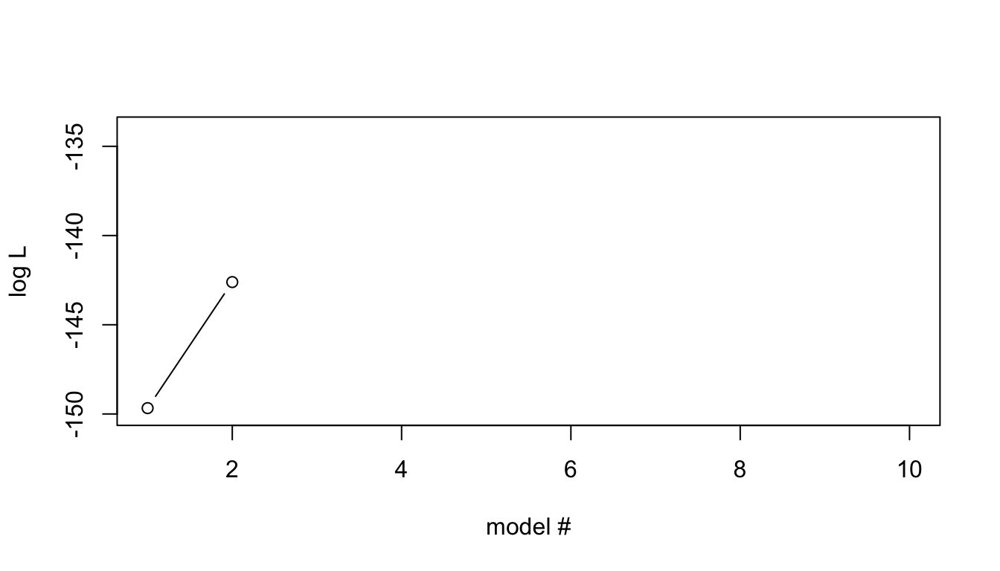
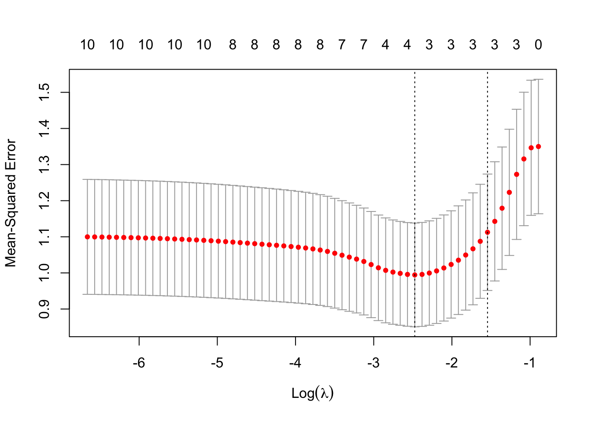

```r
require(knitr)
opts_chunk$set(echo=FALSE, eval=TRUE,message=FALSE, warning=FALSE, error=FALSE, out.width='100%', fig.height=3) #, fig.width=6)#, knitr.kable.NA = '-')
```

### Learning outcomes

* Likelihood
    + Relation to RSS for linear model
    + Overfitting
* Regularization
    + Model comparison 
        - AIC
    + Feature selection
        - LASSO, ridge regression


# Likelihood

Likelihood is concerned with estimating how likely it is that a certain model or certain model parameters are the *true*.

Consider a generative model, with parameters $\theta$, for how $X\rightarrow Y$. We would like to test if $\theta$ are good parameters. Given the model, we can compute
$Pr[Y| X, \theta]$,
that is, the probability that the model with parameters $\theta$ and given $X$ generates $Y$. 

Likelihood builds on the intuition that if $\theta$ (or the model) is close to the 'truth', then $Pr[Y| X, \theta]$ will be higher than for wrong $\theta$ (model). We should therefore select the $\theta$ that maximizes $Pr[Y| X, \theta]$; this is called maximum likelihood estimation of $\theta$.

Since statistical model contain an element of randomness, the reasoning above might not always be correct for any single obeservation. However, if we sum over a large number of observations it will be true on average. Hence the need for datasets that are large enough.

To formalize this intuition, Edwards (1972) defined the likelihood of model parameters being true given observed data as

$$L[\theta|Y,X] \propto Pr[Y|X, \theta]$$
Notice that this means that $L[\theta|Y,X]$ is not a proper probability, hence the term *likelihood* is used.
<details>
<summary> Extra Reading </summary>

(Notice that this notation is not uncommonly mixed up, so you might also see the notation $L[Y|X,\theta]$)

***
</details>

In practice, the proportionality is ignored and we set

$$L[\theta|Y,X] = Pr[Y|X, \theta]$$

<details>
<summary> Extra Reading </summary>
The proportionality (indicated by $\propto$) means there are some unknown constant factor, $k$, such that $L[\theta|Y,X] = k Pr[Y|X, \theta]$. However, the factor $k$ is assumed to be constant over $\theta$s and over models. 

When the likelihood of two $\theta$s (or models) are compared this is almost always done as a _likelihood ratio_, 

$$\frac{L[\theta_1|Y,X]}{L[\theta_0|Y,X]} = \frac{k Pr[Y|X, \theta_1]}{ k  Pr[Y|X, \theta_0]} =\frac{Pr[Y|X, \theta_1]}{ Pr[Y|X, \theta_0]}$$

which means that the factor $k$ disappears. Hence the factor $k$ is always ignored. Likelihood ratios is the basis of most model comparison statistics, e.g., the Wald test, the Score test, regularization... 

***
</details>

In maximum likelihood estimation of some parameters $\theta$, one simply selects the estimates $\widehat\theta$ that gives the highest likelihood $max_{\theta}L[\theta|X,Y] = L[\widehat\theta|X,Y]$. In many applications of  likelihood and maximum likelihood, it is practical to instead use the logarithm of the likelihood, the logLikelihood, $\log L[\theta_1|Y,X]$.
<details>
<summary> Extra Reading </summary>
As mentioned above, the logarithm of the likelihood, the logLikelihood, $\log L[\theta_1|Y,X]$, or sometimes the negative logLikelihood, $-\log L[\theta_1|Y,X]$, is often used. Notice, that 

1. The $\theta$ estimates that maximizes  $\log L[\theta|Y,X]$ also maximizes $L[\theta|Y,X]$
2. The $\theta$ estimates that minimizes $-\log L[\theta|Y,X]$ maximizes $L[\theta|Y,X]$
3. A likelihood ratio corresponds to a logLikelihood difference, $$\log\left(\frac{L[\theta_1|Y,X]}{L[\theta_0|Y,X]}\right) = \frac{\log L[\theta_1|Y,X]}{\log L[\theta_0|Y,X]} = \log L[\theta_1|Y,X] - \log L[\theta_0|Y,X]$$.

***
</details>

Likelihood and maximum likelihood estimation are central concepts in statistics. Many statistical tests and methods uses or is based on the concept of maximum likelihood.

(In the following, I will simplify notation and not differentiate between etimates and random variables, e.g., $\theta$ will be used also for $\widehat\theta$.)

## Likelihood | `Likelihood and OLS for linear models`

So, why have we used ordinary least squares (OLS) of  RSS when estimating linear model parameters $\beta$ rather than maximum likelihood estimation?

Linear models is a special case with some nice properties when it comes to  likelihood. Consider a simple linear regression model,

$$ y = \beta x + \epsilon, $$

where the residuals $\epsilon\sim N(0,\sigma^2)$. 

It turns out that the  likelihood estimates of both $\beta$ and $\sigma^2$ are functions of the  RSS of the residuals, so that the likelihood can be approximated by

$$  \log L[\beta, \sigma^2|Y,X] \approx \frac{N}{2} \log RSS$$

<details>
<summary> Extra Reading </summary>

The likelihood for given $\beta$ and $\sigma^2$, given observed data $Y$ and $X$ is given by

$$ L[\beta, \sigma^2|Y,X] = \prod_i pdf_{Normal}(y_i, \mu=\beta x_i, \sigma^2=\sigma^2) = \prod_i \frac{1}{\sqrt{2\pi \sigma^2}}e^{-\frac{(y_i-\beta x_i)^2}{2\sigma^"}} $$

where $pdf_{Normal}$ denotes the probability distribution function for the Normal distribution. If we work with the logLIkelihood instead, we get 

$$\begin{eqnarray*}
\log L[\beta, \sigma^2|Y,X] 
&=& \sum_{i=1}^N \log\left(\frac{1}{\sqrt{2\pi \sigma^2}}e^{-\frac{(y_i-\beta x_i)^2}{2\sigma^2}}\right)\\
&=&   \sum_{i=1}^N \log \left(\frac{1}{\sqrt{2\pi \sigma^2}}\right) -\frac{(y_i-\beta x_i)^2}{2\sigma^2} \\
&=&   N\log \left(2\pi \sigma^2\right)^{1/2} -\frac{\sum_{i=1}^N (y_i-\beta x_i)^2}{2\sigma^2} \\
&=&   \frac{N}{2}\log \left(2\pi \sigma^2\right)  -\frac{RSS}{2\sigma^2}
\end{eqnarray*}$$

We see here that minimizing $RSS$ (as in OLS) will maximize the logLikelihood, regardless of the value of $\sigma^2$. Moreover, it turns out that also $\sigma^2$ can be estimated fairly well by $RSS/N$. Hence, we get 

$$\begin{eqnarray*}
\log L[\beta, \sigma^2|Y,X]
&=&   \frac{N}{2}\log \left(\frac{2\pi RSS}{N}\right)  -\frac{N}{2}\frac{RSS}{RSS}\\
&=&   \frac{N}{2}\log RSS + \frac{N}{2}\log \frac{2\pi}{N} -\frac{N}{2}\\
&=&   \frac{N}{2}\log RSS + C
\end{eqnarray*}$$
where $C=\frac{N}{2}\left(\log \frac{2\pi}{N} -1\right)$ is a constant that is usually ignored (in likelihood ratios, which is equivalent to log likelihoods differences, it will disappear).

***
</details>

This means that the maximum likelihood estimates of $beta$ is exactly the same as those of the minimum RSS.

_**NB!** This is a special case for linear models and are not generally true for other models. For example, logistic regression is fitted by maximizing the likelihood _

In general, full-on likelihood computation and maximum likelihood estimation is relatively slow, so alternative and faster methods has been developed, e.g., OLS


#  Overfitting

We will now look at a general problem in statistical modeling that can be visualized quite well with Likelihoods. We will later look at some solutions to this problem.

## Overfitting | `Example data`

First, we need some test data to play around with. For simplicity, you will simulate a toy data from a linear model and use this in the exercises. The advantage for us using simulated data is that we know the 'truth', i.e., how the data was simulated and we therefore have *oracle knowledge* about the true parameter values, e.g., for $\beta$.

### Task | `generate example data`
* The data should comprise 100 samples. 
* First generate 10 variables $(x_1,x_2,\ldots, x_{0})$ from a uniform distribution and store them in a Matrix $X$. 
* Use an intercept $\beta_0=3$ 
* Generate effect sizes $\beta_1, \beta_2, \beta_3$ from a Uniform distribution in the interval $(0.5, 1.0)$ for the 3 first $X$ variable (use the function `runif`),
* Finally generate outcome variable $Y$ using a linear model $Y = \beta_0 + \beta_1 x_i + \beta_2 x_2 + \beta_3 x_3 + \epsilon$, with $\epsilon\sim N(0,\sigma^2=1)$ (i.e., the residuals are drawn from a Normal distribution with mean=0 and standard deviation=1, *Tip:* use the R function `rnorm`).


```r
# To obtain exactly the same result as in the demo, set seed to 85
set.seed(85)
```


```r
N=100 # no samples
P=10 # no variables

# Draw variables, x_1,...,x_10, from a uniform distribution in interval (0,1)
X=matrix(runif(N*(P+1)), nrow=N, ncol=P) 

# generate a y variable from a multivarite lm of 3 first X variables only
# intercept
b0=3
# effect sizes for first three variables
b=c(runif(3, min=0.5, max=1.0))
#b=c(runif(3, min=1.5, max=3.5))
# generate y
Y <- b0 + X[,1] * b [1] + X[,2] * b [2] + X[,3] * b [3] + rnorm(N) 
# This can also be done using matrix multiplication
#y1 <- b0 + X[,seq(1,3)] %*% b + rnorm(N) 
# Store in the Y matrix (really just a vector here)
#Y = as.matrix(y)  
```

## Overfitting | `Model comparison`

Now consider the following two models for our data
\begin{aligned}
y & \sim  \beta_0 + \beta_1 x_1 & (1) \\
y & \sim  \beta_0 + \beta_1 x_1 + \beta_2 x_2 & (2)
\end{aligned}

What are the max Likelihood estimates of the two models? (we can use the R function `logLik` in the `stats` package)

### Task | `plot two likelihoods`
* Create `lm` models for the two models, and
* store the likelihood
* plot the likelihoods


```r
require(stats)
ll= vector()
for(i in seq(1,2)){
  Xi=X[,seq(1,i)]
  ll[i] <- logLik(lm(Y~Xi))
}
# plot likelihoods for models with 1 and 2 vaiables
plot(ll[seq(1,2)], ylab="log L", xlab="model #", type = "b", xlim=c(1,P), ylim=c(floor(min(ll)),ceiling(max(ll)))) 
# xlim and ylim not really necessary here, but I can reuse the plot statement below, so the plots look similar
```

<details>
<summary> *Show result*</summary>


***
</details>

... 2 variables are clearly better than 1 variable -- What if we add more variables?

### Task | `plot all likelihoods`

* Now repeat this for the sequence of models obtained by creating the next model by simply adding the next $X$ variable in order.

<details>
<summary> *Show result*</summary>

```r
# compute loglikelihood (ll) for all models including variables
# 1-i, for i <= P; store results in vector ll
ll= vector()
for(i in seq(1,P)){
  Xi=X[,seq(1,i)]
  ll[i] <- logLik(lm(Y~Xi))
}

# plot ll for all models
plot(ll[seq(1,P)], ylab="log L", xlab="model #", type = "b", xlim=c(1,P), ylim=c(floor(min(ll)),ceiling(max(ll)))) 
```


***
</details>

#### Think about:

* How does the Likelihood behave as more variables are added?

* Which is the maximum likelihood model? Is this correct given our *oracle knowledge*?

* What could be the problem with this behaviour? How would we like it to behave?

* How can we obtain the desired behaviour?

<details>
<summary> Some possible answers </summary>
<h4>Some possible answers</h4>
_Nested models_

* Model (1) can be described as a special case of Model (2) with the constraints on $\beta_2=0$

* Therefore Model (2) will always have equal or better ML than Model (1)


_Overfitting_

* Using our *oracle knowledge*, we know that the simulated data was generated from the 3 first variables
  + thus, the subsequent variables increase ML by modeling noise in data
  
* This is difficult to detect by just looking at the likelihoods

* Solutions
  + Seek the simplest model that is "good enough" -> Regularization

***
</details>


<details>
<summary> Extra Reading </summary>
<h2> Model comparison | `Likelihood ratio test`</h1>

For nested models $-2 \max LRT$ is $\chi^2(d)$-distributed, with d=the difference in free params in the two models.

<table class="table table-striped" style="font-size: 14px; width: auto !important; margin-left: auto; margin-right: auto;">
 <thead>
  <tr>
   <th style="text-align:left;"> Compared models </th>
   <th style="text-align:right;"> logL 1st model </th>
   <th style="text-align:right;"> logL 2nd model </th>
   <th style="text-align:left;"> logLR </th>
   <th style="text-align:left;"> P-value </th>
   <th style="text-align:left;"> Sign at 0.05 </th>
  </tr>
 </thead>
<tbody>
  <tr>
   <td style="text-align:left;"> 1 vs 2 variables </td>
   <td style="text-align:right;"> -139.86 </td>
   <td style="text-align:right;"> -137.37 </td>
   <td style="text-align:left;"> -2.492 </td>
   <td style="text-align:left;"> 0.0256 </td>
   <td style="text-align:left;"> yes </td>
  </tr>
  <tr>
   <td style="text-align:left;"> 2 vs 3 variables </td>
   <td style="text-align:right;"> -137.37 </td>
   <td style="text-align:right;"> -136.00 </td>
   <td style="text-align:left;"> -1.366 </td>
   <td style="text-align:left;"> 0.0983 </td>
   <td style="text-align:left;"> no </td>
  </tr>
  <tr>
   <td style="text-align:left;"> 3 vs 4 variables </td>
   <td style="text-align:right;"> -136.00 </td>
   <td style="text-align:right;"> -135.85 </td>
   <td style="text-align:left;"> -0.1471 </td>
   <td style="text-align:left;"> 0.588 </td>
   <td style="text-align:left;"> no </td>
  </tr>
  <tr>
   <td style="text-align:left;"> 4 vs 5 variables </td>
   <td style="text-align:right;"> -135.85 </td>
   <td style="text-align:right;"> -135.73 </td>
   <td style="text-align:left;"> -0.1271 </td>
   <td style="text-align:left;"> 0.614 </td>
   <td style="text-align:left;"> no </td>
  </tr>
  <tr>
   <td style="text-align:left;"> 5 vs 6 variables </td>
   <td style="text-align:right;"> -135.73 </td>
   <td style="text-align:right;"> -135.27 </td>
   <td style="text-align:left;"> -0.4527 </td>
   <td style="text-align:left;"> 0.341 </td>
   <td style="text-align:left;"> no </td>
  </tr>
  <tr>
   <td style="text-align:left;"> 6 vs 7 variables </td>
   <td style="text-align:right;"> -135.27 </td>
   <td style="text-align:right;"> -135.25 </td>
   <td style="text-align:left;"> -0.0238 </td>
   <td style="text-align:left;"> 0.827 </td>
   <td style="text-align:left;"> no </td>
  </tr>
  <tr>
   <td style="text-align:left;"> 7 vs 8 variables </td>
   <td style="text-align:right;"> -135.25 </td>
   <td style="text-align:right;"> -135.22 </td>
   <td style="text-align:left;"> -0.02914 </td>
   <td style="text-align:left;"> 0.809 </td>
   <td style="text-align:left;"> no </td>
  </tr>
  <tr>
   <td style="text-align:left;"> 8 vs 9 variables </td>
   <td style="text-align:right;"> -135.22 </td>
   <td style="text-align:right;"> -135.19 </td>
   <td style="text-align:left;"> -0.02746 </td>
   <td style="text-align:left;"> 0.815 </td>
   <td style="text-align:left;"> no </td>
  </tr>
  <tr>
   <td style="text-align:left;"> 9 vs 10 variables </td>
   <td style="text-align:right;"> -135.19 </td>
   <td style="text-align:right;"> -134.79 </td>
   <td style="text-align:left;"> -0.4047 </td>
   <td style="text-align:left;"> 0.368 </td>
   <td style="text-align:left;"> no </td>
  </tr>
</tbody>
</table>

***
</details>

#  Regularization

Regularization is a concept that adds auxiliary criteria, so-called *regularization terms*,  to probabilistic models.  This is called regularized likelihood models or penalized likelihood models. Typically, the regularization term is a function of parameters $\beta$:

$$\log rL[\beta | X, Y]  = \log Pr[Y | X, \beta] - f(\beta),$$


A very simple regularized likelihood model uses $f(\beta) = \#\beta = \#X$, that is the number of $X$ variables.  
$$\log rL[{\beta} | X, Y]  = \log Pr[Y | X, {\beta}] - \#X, $$
where, in the regularization term, $\#X$ denote the _cardinality_ $X$, i.e., the number of variables in the model.

Applying this rL to our example, solves the overfitting problem.


```r
# compute loglikelihood (ll) for all models including 1-P variables
pl= vector() 
for(i in seq(1,P)){
  xi=X[,seq(1,i)]
  xi=cbind(rep(1,N), xi)
  fit = lm(Y~xi)
  # To make the code simple, we forestall next step and use the AIC function here
  # AIC= -2(pl) so convert back
  pl[i] = -AIC(fit)/2
}
# plot ll of all models
plot(pl[seq(1,P)], xlim=c(1,P), ylim=c(floor(min(pl)),ceiling(max(pl))),ylab="log pL", xlab="model #", type = "b")
```




##  Regularization | `AIC and model testing`

Coming from a _information theory_ base, Hirotugu Akaike came up with a very similar approach for the overfitting problem.

The Akaike information criterion (AIC), for a model $m$ with variables $X$, is defined as

  $$AIC_m = 2\# X - 2\log \max L[{\beta}|X,Y]$$

We see that $AIC_m = -2 \left(\log \max L[{\beta}|X,Y] - \#X\right)$, i.e., $-2$ times the the simple $\log rL$, we just looked at in our first regularization example. 
    
<details>
<summary> Extra Reading </summary>

The difference in $AIC$ between two models is claimed to estimate the information lost by selecting the worse model.

***
</details>
    
Sometimes, the *relative likelihood* for model $m$ is used, which is
      $$relL = e^\frac{ AIC_{min} - AIC_{m} }{2}$$
where $AIC_{min}$ is the minimum AIC among a set of compared models
      
<details>
<summary> Extra Reading </summary>

* $relL$ can be interpreted as proportional to the probability that the model $m$ minimizes the information loss.
<!--       and can be interpreted as -->
<!-- $rL \propto Pr[m\textrm{ minimizes estimated information loss}]$. -->

   * Notice that
   
$$\log relL = \frac{\#X_m }{\#X_{min}}\log\frac{\max L[{\beta}_{m}|X_m,Y]}{\max L[{\beta}_{min}|X_{min},Y]}$$
  we see that $rL$ can be viewed as a  likelihood ratio weighted by the ratio of number of $X$ variables.
* However, AIC are not limited to nested models

***
</details>


### Task

* A typical strategy is to select the model, $m$ with $AIC_m=AIC_{min}$ and then evaluate how much better it is than the other candidate models.

* Apply this AIC strategy applied to our example data.
* create a table with th AIC and the $relL$ for the set of models comprising $\{X_1, .\ldots, X_i\} \textrm{ for } i \in [1, \ldots, 10]$; indicate also if a model is the minim AIC model.


```r
require(stats)
require(dplyr)
require(kableExtra)
mprev <- lm(Y ~ X[,1])
aic=data.frame(models=0, aic=0, lowest="-")
for(i in seq(1,P)){
  m <- lm(Y ~ X[,seq(1,i)])
  fit=AIC(mprev,m)
  mprev=m
  if(i==2){
    aic[i-1,] = list(paste0(i-1," variable"), signif(fit$AIC[1],5), "-") 
  }
  aic[i,] = list(paste0(i," variables"), signif(fit$AIC[2],5), "-") 
}
minaic=min(aic$aic)
aic$rl=format(exp((minaic-aic$aic)/2), digits=4)
aic$lowest = ifelse(aic$aic==minaic,"Yes","-")

kable(aic, format='html', row.names=F, col.names=c("Compared models","AIC","Minimum AIC","rL"),digits=30,format.args=list(snsmall=0))  %>%  kable_styling( font_size = 14)
```

<details>
<summary> *Show result*</summary>
<table class="table" style="font-size: 14px; margin-left: auto; margin-right: auto;">
 <thead>
  <tr>
   <th style="text-align:left;"> Compared models </th>
   <th style="text-align:right;"> AIC </th>
   <th style="text-align:left;"> Minimum AIC </th>
   <th style="text-align:left;"> rL </th>
  </tr>
 </thead>
<tbody>
  <tr>
   <td style="text-align:left;"> 1 variable </td>
   <td style="text-align:right;"> 285.71 </td>
   <td style="text-align:left;"> - </td>
   <td style="text-align:left;"> 0.156453 </td>
  </tr>
  <tr>
   <td style="text-align:left;"> 2 variables </td>
   <td style="text-align:right;"> 282.73 </td>
   <td style="text-align:left;"> - </td>
   <td style="text-align:left;"> 0.694197 </td>
  </tr>
  <tr>
   <td style="text-align:left;"> 3 variables </td>
   <td style="text-align:right;"> 282.00 </td>
   <td style="text-align:left;"> Yes </td>
   <td style="text-align:left;"> 1.000000 </td>
  </tr>
  <tr>
   <td style="text-align:left;"> 4 variables </td>
   <td style="text-align:right;"> 283.70 </td>
   <td style="text-align:left;"> - </td>
   <td style="text-align:left;"> 0.427415 </td>
  </tr>
  <tr>
   <td style="text-align:left;"> 5 variables </td>
   <td style="text-align:right;"> 285.45 </td>
   <td style="text-align:left;"> - </td>
   <td style="text-align:left;"> 0.178173 </td>
  </tr>
  <tr>
   <td style="text-align:left;"> 6 variables </td>
   <td style="text-align:right;"> 286.55 </td>
   <td style="text-align:left;"> - </td>
   <td style="text-align:left;"> 0.102797 </td>
  </tr>
  <tr>
   <td style="text-align:left;"> 7 variables </td>
   <td style="text-align:right;"> 288.50 </td>
   <td style="text-align:left;"> - </td>
   <td style="text-align:left;"> 0.038774 </td>
  </tr>
  <tr>
   <td style="text-align:left;"> 8 variables </td>
   <td style="text-align:right;"> 290.44 </td>
   <td style="text-align:left;"> - </td>
   <td style="text-align:left;"> 0.014699 </td>
  </tr>
  <tr>
   <td style="text-align:left;"> 9 variables </td>
   <td style="text-align:right;"> 292.38 </td>
   <td style="text-align:left;"> - </td>
   <td style="text-align:left;"> 0.005572 </td>
  </tr>
  <tr>
   <td style="text-align:left;"> 10 variables </td>
   <td style="text-align:right;"> 293.58 </td>
   <td style="text-align:left;"> - </td>
   <td style="text-align:left;"> 0.003058 </td>
  </tr>
</tbody>
</table>

***
</details>

* Try to plot the $AIC$ and the $reL$ with the different models on the $X$-axis


```r
require(stats)
pl= vector() 
for(i in seq(1,P)){
  xi=X[,seq(1,i)]
  xi=cbind(rep(1,N), xi)
  fit = lm(Y~xi)
  # To make the code simple, we forestall next slides and use the AIC function here
  # AIC= -2(pl) so convert back
  pl[i] = AIC(fit)
}
# plot ll of all models
plot(pl[seq(1,P)], xlim=c(1,P), ylim=c(floor(min(pl)),ceiling(max(pl))),ylab="AIC", xlab="model #", type = "b")

# plot ll of all models
plot(aic$rl, xlim=c(1,P), ylab="relL", xlab="model #", type = "b")
```

<details>
<summary> *Show result*</summary>


***
</details>

#### Think about:

* Which is the best model? Is this correct compared to our *oracle knowledge*?
* How good is it compared to the others?
* Can you see a drawback in our model testing approach above? If so, how can we solve that?


<details>
<summary> Some possible answers </summary>
<h4>Some possible answers</h4>

* We see that the best model is the one with the 3 first X-variables (in line with our *oracle knowledge*) and that the second best model (with the first 2 X-variabels) is $\approx70\%$ worse.

<details>
<summary> Extra Reading </summary>

* Sometimes it is desirable to compute a significance for rejecting a model in favour of another model. A NULL distribution for the $relL$ statistic is usally obtained through simulation, e.g., using parameteric bootstrapping.

***
</details>

* Now, I this case we happened to know that the first 3 variables was the right one, so the order we choose to include them was correct. However, in the general case, we do not know this. HOwsolve
  - Best subset method; involves testing all possible subsets, which is computationally time-consuming and dometimes unfeasible
  - Lasso

***
</details>

##  Regularization | `LASSO and Feature selection`

LASSO  stands for Least absolute shrinkage and selection operator ("shrinkage" is another common term for regularization) and is a method for selecting variables to include in a multivariate model.

Classical LASSO builds on RSS of a linear regression model $Y \sim X{\beta}$ with regularization

<details>
<summary> Extra Reading </summary>

Extensions to glms exists, but then using a regularized likelihood expression
    
***
</details>

The regularization term $f(\beta) = \lambda\sum_{\beta_i\in\beta} |\beta_i-0|= \lambda\sum_{\beta_i\in\beta} |\beta_i|$

<details>
<summary> Extra Reading </summary>

Often the regularization term is expressed in terms of the $\ell_1-norm$, which can be viewed simply a short-hand notation, e.g., the $\ell_1-norm$ of $\beta$ is
$$ ||\beta||_1 = \sum_{\beta_i\in\beta} |\beta_i|$$

There is also a $\ell_2-norm$:
$$ ||\beta||_2 = \sqrt{\sum_{\beta_i\in{\beta}} \beta_i^2}$$
which is used, e.g., in ridge regression.

We note, BTW, that you already have been working with an $\ell_2-norm$: since $RSS = ||Y-X\beta||_2$ is simply the $\ell_2$ norm of the residuals.

***
</details>  
    
The $\lambda$ parameter sets a limit on the estimation of $\beta$. 


Lasso is traditionally described as RSS with an auxiliary criterion/constraint: 

$$min_{{\beta}}\left\{RSS\right\} - \lambda\sum_{\beta_i\in\beta} |\beta_i|.$$

<details>
<summary> Extra Reading </summary>

Other common notation for LASSO:

* You might often see the notation $$min_{{\beta}}\left\{RSS\right\} \textrm{ subject to } ||{\beta}||_1 <= t$$
  where $t$ is related to $\lambda$.
* Lasso can also be viewed as a Bayesian posterior probability, with a LaPlacean prior on $\beta$: $\beta_j ∼ LaPlace(0, 1/\lambda)$ 

***
</details>

The optimal values of $\beta$ are then estimated, using some algorithm (lars or coordinate descent).

<details>
<summary> Extra Reading </summary>

The *Coordinate descent* algorithm is used in the R package `glmnet`:

1. Over a grid of $\lambda\in [0, \infty]$, do
  1. Start with all $\beta=0$
  2. until convergence repeat for each $\beta_i$
    1. while keeping all other $\beta$ fixed and $\beta_i=0$, compute partial residuals
    2. estimate $\beta_i$ by RSS on the partial residuals
    3. update $\beta_i using the RSS estimate and $\lambda$.
    
***
</details>
            
<details>
<summary> Extra Reading </summary>

Alternatives to LASSO, differing mainly in the auxiliary criterion

  - *Ridge regression* which uses a $L_2$ norm
  - *Elastic-net*, which uses a mixed model combination of the  $\ell_1$ norm and the $\ell_2$ norm.

*** 
</details>

### Task | `Lasso using the glmnet R-package`

* Use function `glmnet` to perform LASSO analysis on our toy data.
    + linear regression (`family='gaussian'`, default)
    + LASSO (`alpha=1`, default)
    + standardization
        + The variables Y and X must be centered and standardized to ensure that all variables are given equal weight in the model selection.
        + standardization of $X$ to unit variance in `glmnet` is obtained  by setting the argument `standardize=TRUE` which is the default
        + the values of $Y$ is always standardized (?) for `family=gaussian` (LASSO)
         + and the coefficients are back-standardized before reported

<details> 
<summary> Extra Reading </summary>

Standardization in `glmnet`:
$x' = \frac{x-\bar{x}}{1/\sqrt{N}||X-\bar{x}||_2}$

***
</details>


```r
require(glmnet)
# run lasso (alpha=1) for linear model (family=gaussian)
fit = glmnet(X,Y, family="gaussian", alpha=1, standardize=T)
```

* A graphical way to view the result is to `plot` the paths of $\beta$ for increasing vaules of $\lambda$.


```r
par(mfrow=c(1,1))
plot(fit, xvar="lambda",label=T)
```

<details>
<summary> *Show result*</summary>


***
</details>

#### Think about
* In which order are variables included (i.e., their $\beta$ becomes non-zero? 
* In which direction is the effect
* Which lambda should we select?
  - Given our *oracle knowledge*, where would an appropriate $\lambda$ be?
  - Can we use that?

<details>
<summary> Some possible answers </summary>

<h4>Some possible answers</h4>
* The order appears to be $(3,2,1,6,4,10,5,8,7,9)$
* $\beta_i > 0, i\in \{1,2,3,4,7,8\}$, while $\beta_i<0, i\in \{5,6,9,19\}$
* Given *oracle knowledge*, the correct $\lambda$ appears lie somewhere in the interval $[\approx \exp(-2.1), \approx\exp(-2.5)]$
* In the normal case, we do not have *oracle knowledge*.

***
</details>

## Cross-validation
* A problem is to decide $\lambda$ to use as the cutoff. 
  + glmnet uses cross-validation to obtain an estimate of the minimum $\lambda$ attainable,

### Task| `Determine `$\lambda$` using cross-validation`
* Use the function `cv.glmnet to perform cross validation
* `plot` the cross-validation results 
* Compare with the plot of estimated $\beta_i$ under different $\lambda$.
* Determine the optimal $\lambda$


```r
par(mfrow=c(1,2))
require(glmnet)
require(dplyr)
require(kableExtra)
par(mfrow=c(1,2))
# run lasso (alpha=1) for linear model (family=gaussian)
cvglm=cv.glmnet(X,Y, family="gaussian", alpha=1, standardize=T, nfolds=100)

plot(cvglm$glmnet.fit, xvar="lambda",label=T)
plot(cvglm)
minlambda=cvglm$lambda.min
```

<details>
<summary> *Show result*</summary>


***
</details>

#### Think about
* Which is the $\lambda$ selected by `cv.glmnet`?
* Does this make sense given our *oracle knowledge*?

<details>
<summary> Some possible answers </summary>

<h4>Some possible answers</h4>
* Cross-validation-selected optimal lambda is 0.0875179
* Yes, this includes only the *oracle knowledge* correct variables $X_1, X_2, X_3$

***
</details>

### Task| `Final effect sizes`
* Finally print a table with the $\beta$ coefficients for the optimal model (i.e.,  at minimum $\lambda$).


```r
require(dplyr)
require(kableExtra)

coefglm=as.data.frame(as.matrix(coef(cvglm, s="lambda.min")))
coefglm=cbind(seq(0,10),coefglm)
names(coefglm)=c("Variable",paste0("beta(lambda=",signif(minlambda,2),")"))
kable(coefglm, row.names=F) %>%   kable_styling( font_size = 14)
```

<details>
<summary> *Show result*</summary>

<table class="table" style="font-size: 14px; margin-left: auto; margin-right: auto;">
 <thead>
  <tr>
   <th style="text-align:right;"> Variable </th>
   <th style="text-align:right;"> beta(lambda=0.088) </th>
  </tr>
 </thead>
<tbody>
  <tr>
   <td style="text-align:right;"> 0 </td>
   <td style="text-align:right;"> 3.7018933 </td>
  </tr>
  <tr>
   <td style="text-align:right;"> 1 </td>
   <td style="text-align:right;"> 0.1485417 </td>
  </tr>
  <tr>
   <td style="text-align:right;"> 2 </td>
   <td style="text-align:right;"> 0.4612657 </td>
  </tr>
  <tr>
   <td style="text-align:right;"> 3 </td>
   <td style="text-align:right;"> 0.2341136 </td>
  </tr>
  <tr>
   <td style="text-align:right;"> 4 </td>
   <td style="text-align:right;"> 0.0000000 </td>
  </tr>
  <tr>
   <td style="text-align:right;"> 5 </td>
   <td style="text-align:right;"> 0.0000000 </td>
  </tr>
  <tr>
   <td style="text-align:right;"> 6 </td>
   <td style="text-align:right;"> 0.0000000 </td>
  </tr>
  <tr>
   <td style="text-align:right;"> 7 </td>
   <td style="text-align:right;"> 0.0000000 </td>
  </tr>
  <tr>
   <td style="text-align:right;"> 8 </td>
   <td style="text-align:right;"> 0.0000000 </td>
  </tr>
  <tr>
   <td style="text-align:right;"> 9 </td>
   <td style="text-align:right;"> 0.0000000 </td>
  </tr>
  <tr>
   <td style="text-align:right;"> 10 </td>
   <td style="text-align:right;"> 0.0000000 </td>
  </tr>
</tbody>
</table>

***
</details>

#### Think about
* Does the effect sizes make sense

<details>
<summary> Some possible answers </summary>
<h4>Some possible answers</h4>

* Yes, $\beta_i$ is non-zero only for _oracle_-known variables $X_1, X_2, X_3$

***
</details>

<br><br><br>

# Thank you

##Session info

**R version 3.5.3 (2019-03-11)**

**Platform:** x86_64-apple-darwin15.6.0 (64-bit) 

**locale:**
en_US.UTF-8||en_US.UTF-8||en_US.UTF-8||C||en_US.UTF-8||en_US.UTF-8

**attached base packages:** 
_stats_, _graphics_, _grDevices_, _utils_, _datasets_, _methods_ and _base_

**other attached packages:** 
_pander(v.0.6.3)_, _glmnet(v.2.0-16)_, _foreach(v.1.4.4)_, _Matrix(v.1.2-16)_, _dplyr(v.0.8.0.1)_, _kableExtra(v.1.1.0)_, _lmtest(v.0.9-36)_, _zoo(v.1.8-4)_ and _knitr(v.1.22)_

**loaded via a namespace (and not attached):** 
_Rcpp(v.1.0.1)_, _pillar(v.1.3.1)_, _compiler(v.3.5.3)_, _highr(v.0.7)_, _iterators(v.1.0.10)_, _tools(v.3.5.3)_, _digest(v.0.6.18)_, _evaluate(v.0.13)_, _tibble(v.2.1.1)_, _lattice(v.0.20-38)_, _viridisLite(v.0.3.0)_, _pkgconfig(v.2.0.2)_, _rlang(v.0.3.1)_, _rstudioapi(v.0.9.0)_, _yaml(v.2.2.0)_, _xfun(v.0.5)_, _stringr(v.1.4.0)_, _httr(v.1.4.0)_, _xml2(v.1.2.0)_, _hms(v.0.4.2)_, _tidyselect(v.0.2.5)_, _grid(v.3.5.3)_, _webshot(v.0.5.1)_, _glue(v.1.3.1)_, _R6(v.2.4.0)_, _rmarkdown(v.1.12)_, _purrr(v.0.3.2)_, _readr(v.1.3.1)_, _magrittr(v.1.5)_, _codetools(v.0.2-16)_, _scales(v.1.0.0)_, _htmltools(v.0.3.6)_, _assertthat(v.0.2.0)_, _rvest(v.0.3.2)_, _colorspace(v.1.4-1)_, _stringi(v.1.4.3)_, _munsell(v.0.5.0)_ and _crayon(v.1.3.4)_
