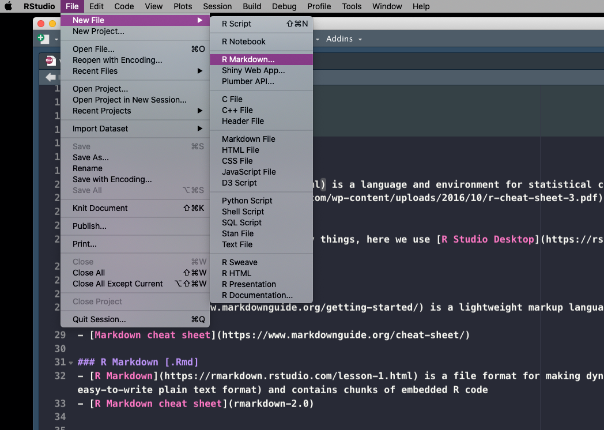

```{r setup, include=FALSE}
knitr::opts_chunk$set(echo = TRUE)
knitr::opts_chunk$set(fig.path="session-intro-files/figures/")
knitr::opts_chunk$set(fig.pos = 'H')
knitr::opts_chunk$set(cache.path = "tmp")
knitr::opts_chunk$set(cache = FALSE)


```


### R [.R]
- [R](https://www.r-project.org/about.html) is a language and environment for statistical computing and graphics
- [Basic R cheat sheet](https://rstudio.com/wp-content/uploads/2016/10/r-cheat-sheet-3.pdf)

### R Studio
- [R Studio](https://rstudio.com) is many things, here we use [R Studio Desktop](https://rstudio.com/products/rstudio/#rstudio-desktop) to have a more convienent way to write and execute R code
- [R studio cheat sheet](rstudio-ide.pdf)

### Markdown [.md]
- [Markdown](https://www.markdownguide.org/getting-started/) is a lightweight markup language that you can use to add formatting elements to plaintext text documents. 
- [Markdown cheat sheet](https://www.markdownguide.org/cheat-sheet/)

### R Markdown [.Rmd]
- [R Markdown](https://rmarkdown.rstudio.com/lesson-1.html) is a file format for making dynamic documents with R. An R Markdown document is written in markdown (an easy-to-write plain text format) and contains chunks of embedded R code
- [R Markdown cheat sheet](rmarkdown-2.0)

--------

#### Try your setup



