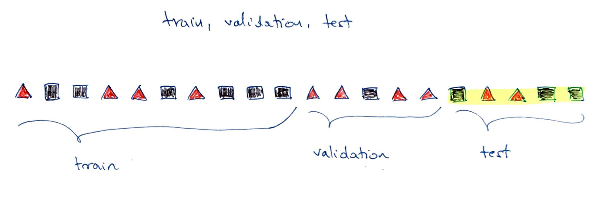
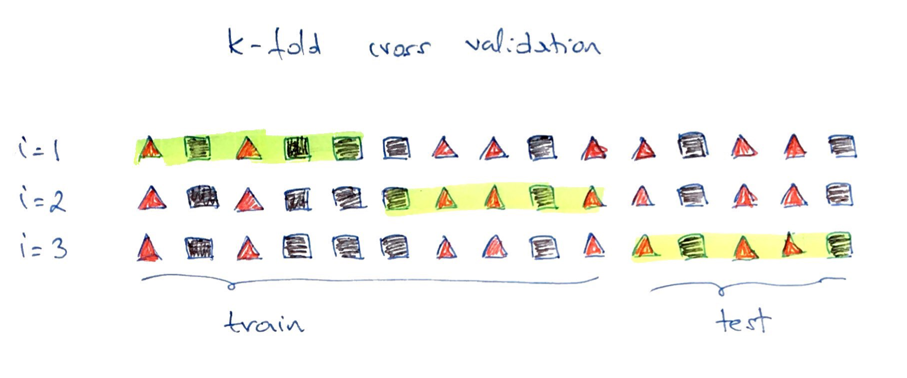

# Introduction to supervised learning
**Aims**

- to introduce supervised learning for classification and regression

**Learning outcomes**

- to be able to explain supervised learning
- to be able to split data into training, validation and test sets
- to be able to explain basic performance metrics for classification and regression
- to be able to use knn() function to select the optimal value of k and build knn classifier 


## What is supervised learning? 
- When we talked earlier about PCA and clustering, we were interested in finding patterns in the data. We treated data set as a whole, using all the samples, and we did not use samples labels in any way to find the components with the highest variables (PCA) or the number of clusters (k-means)
- In supervised learning, we are using samples **labels** to build (train) our models. When then use the models for interpretation and **prediction**

## Supervised classification

- Classification methods are algorithms used to categorize (classify) objects based on their measurements
- They belong under **supervised learning** as we usually start off with **labeled** data, i.e. observations with measurements for which we know the label (class) of
- If we have a pair $\{\mathbf{x_i}, g_i\}$ for each observation $i$, with $g_i \in \{1, \dots, G\}$ being the class label, where $G$ is the number of different classes and $\mathbf{x_i}$ a set of exploratory variables, that can be continuous, categorical or a mix of both, then we want to find a **classification rule** $f(.)$ (model) such that $$f(\mathbf{x_i})=g_i$$


**KNN example**
```{r, fig.align="center", echo=F, fig.width=8, fig.height=8, fig.cap="An example of k-nearest neighbours algorithm with k=3; in the top new observation (blue) is closest to three red triangales and thus classified as a red triangle; in the bottom, a new observation (blue) is closest to 2 black dots and 1 red triangle thus classified as a black dot (majority vote)"}
# Example data
n1 <- 10
n2 <- 10
set.seed(1)
x <- c(rnorm(n1, mean=0, sd=1), rnorm(n2, mean=0.5, sd=1))
y <- rnorm(n1+n2, mean=0, sd=1)

group <- rep(1, (n1+n2))
group[1:n1] <- 0
idx.1 <- which(group==0)
idx.2 <- which(group==1)

# new points
p1 <- c(1.5, 0.5)
p2 <- c(0, 0.6)

# distance 
dist.1 <- c()
dist.2 <- c()
for (i in 1:length(x))
{
  dist.1[i] <- round(sqrt((p1[1]-x[i])^2 + (p1[2]-y[i])^2),2)
  dist.2[i] <- round(sqrt((p2[1]-x[i])^2 + (p2[2]-y[i])^2),2)
}

# find nearest friends
n.idx1 <- order(dist.1)
n.idx2 <- order(dist.2)


par(mfrow=c(2,2), mar=c(2, 2, 2, 2) + 0.1)
# a) 
plot(x[idx.1],y[idx.1], pch=0, las=1, xlim=c(min(x), max(x)), ylim=c(min(y), max(y)), xlab="x", ylab="y")
points(x[idx.2], y[idx.2], pch=2, col="red")
points(p1[1], p1[2], pch=13, col="blue", cex=2)
# b) 
plot(x[idx.1],y[idx.1], pch=0, las=1, xlim=c(min(x), max(x)), ylim=c(min(y), max(y)), xlab="x", ylab="y")
points(x[idx.2], y[idx.2], pch=2, col="red")
points(p1[1], p1[2], pch=13, col="blue", cex=2)
points(x[n.idx1[1:3]], y[n.idx1[1:3]], pch=17, col="red")
# c) 
plot(x[idx.1],y[idx.1], pch=0, las=1, xlim=c(min(x), max(x)), ylim=c(min(y), max(y)), xlab="x", ylab="y")
points(x[idx.2], y[idx.2], pch=2, col="red")
points(p2[1], p2[2], pch=13, col="blue", cex=2)
# d)
plot(x[idx.1],y[idx.1], pch=0, las=1, xlim=c(min(x), max(x)), ylim=c(min(y), max(y)), xlab="x", ylab="y")
points(x[idx.2], y[idx.2], pch=2, col="red")
points(p2[1], p2[2], pch=13, col="blue", cex=2)
points(x[n.idx2[1]], y[n.idx2[1]], pch=17, col="red")
points(x[n.idx2[2:3]], y[n.idx2[2:3]], pch=19, col="black")

```


## Data splitting

**train, validation & test sets**

- part of the issue of fitting complex models to data is that the model can be continually tweaked to adapt as well as possible
- but the results may not be generalizable to future data due to the added complexity modeling noise that is unique to a particular dataset (overfitting)
- to deal with overconfident estimation of future performance we randomly split data into training data, validation data and test data
- common split strategy are 50%/25%/25% and 33%/33%/33% for training/validation/test
- **training data**: this is data to give fit (train) the classification model, i.e. derive the classification rule
- **validation data**: this is data used to select which parameters or types of model perform best, i.e. to validate the performance of model parameters
- **test data**: this data is used to give an estimate of future prediction performance for the model and parameters chosen

```{r, echo=F, fig.align="center", fig.cap="Example of splitting data into train (50%), validation (25%) and test (25%) sets", out.width="100%"}

```


**cross validation**

- the could happen that despite random splitting in train/validation/test dataset one of the subsets does not represent data (i.e. gets all the difficult observation to classify)
- or that we do not have enough data in each subset after performing the split
- In **K-fold cross-validation** we split data into $K$ roughly equal-sized parts
- We start by setting the validation data to be the first set of data and the training data to be all other sets
- We estimate the validation error rate / correct classification rate for the split
- We then repeat the process $K-1$ times, each time with a different part of the data set to be the validation data and the remainder being the training data
- We finish with $K$ different error of correct classification rates
- In this way, every data point has its class membership predicted once
- The final reporter error rate is usually the average of $K$ error rates

```{r, echo=F, fig.align="center", fig.cap="Examples of k-fold cross validaiton split, k = 3"}

```

<br />
<br />

```{r, echo=F, fig.align="center", fig.cap="Examples of LOOCV, leave-out-out cross validation"}
knitr::include_graphics("figures/split-loocv.png")
```

**Stratifying sampling**

- is used to eliminate sampling bias in validation and test set
- and to create splits that that best represents the entire population being studied.
- Further note: real world data can contain considerably different number of samples for the classes (unbalanced) and training a classifier on unbalanced data could introduce classification bias. Common methods to account for this include stratification the data by over- and under-sampling samples based on their class labels. 

## Evaluating Classification Model Performance
- To train the model we need some way of evaluating how well it works so we know how to tune the model parameters, e.g. change the value of $k$ in KNN
- There are few measures being used that involve looking at the truth (labels) and comparing it to what was predicted by the model
- Common measures include: correct (overall) classification rate, missclassification rate, class specific rates, cross classification tables, sensitivity and specificity and ROC curves

**Correct (miss)classification rate**

- the simplest way to evaluate in which we count for all the $n$ predictions how many times we got the classification right 
$$Correct\; Classifcation \; Rate = \frac{\sum_{i=1}^{n}1[f(x_i)=g_i]}{n}$$ where
$1[]$ is an indicator function equal to 1 if the statement in the bracket is true and 0 otherwise
- Missclassification Rate = 1 - Correct Classification Rate

<!-- **Class specific rates and cross classification table** -->
<!-- $$CCR \; for \; class\; j =  \frac{number \; of \; observations \; in \; class \; j \; that \; were \; correctly \; classified}{number \; of \; observations \; in \; class \; j} = \\ \sum_{i:g_i=j}{\frac{1[f(\mathbf{x_i})\neq j]}{n_j} = \frac{n_j-k_j}{n_j}}$$ -->
<!-- **Example** -->
```{r, collapse=TRUE, eval=F, include=F}
# Example data
true.clas <- c(1, 1, 1, 1, 1, 1, 2, 2, 2, 2)
pred.class <-  c(1, 1, 2, 1, 1, 2, 1, 1, 2, 2)

# correct classification rate
n <- length(true.clas)
ccr <- sum(true.clas == pred.class)/n
print(ccr)

# cross classification table
tab.pred <- table(true.clas, pred.class)
print(tab.pred)

# cross classification rate
# we divide each row by its sum (using sweep function)
tab.rate <- sweep(tab.pred, 1, apply(tab.pred, 1, sum), "/")
tab.rate <- round(tab.rate, 2)
print(tab.rate)

```


## Putting it together: k-nearest neighbours
- k-nearest neighbors (knn) is a non-parametric classification method, i.e. we do not have to assume a parametric model for the data of the classes

**Algorithm**

- Decide on the value of $k$
- Calculate the distance between the query-instance (new observation) and all the training samples
- Sort the distances and determine the nearest neighbors based on the k-th minimum distance
- Gather the categories of the nearest neighbors
- Use simple majority of the categories of nearest neighbors as the prediction value of the new observation

_Euclidean distance is a classic distance used with knn; other distance measures are also used incl. weighted Euclidean distance, Mahalanobis distance, Manhatan distance, maximum distance etc._

**choosing k**

- for problems with 2 classes, choose an odd number of k to avoid ties
- use validation data to fit the model for a series of $k$ values
- pick the value of $k$ which results in the best model (as assessed by the method of choice, e.g. overall classification rate)

Let's see how it works in practice on a classical iris dataset containing measurements on petals and sepals as well as species information (setosa, versicolor, virginica)
```{r, collapse=TRUE, fig.align="center", fig.width=6, fig.height=4}

library(class) # library with knn() function
library(splitTools) # load library for data splitting

# preview iris dataset
head(iris)

# summary statistics
summary(iris)

# split data into train 50%, validation 25% and test dataset 25%
# 
randseed <- 102
set.seed(randseed)
inds <- partition(iris$Species, p = c(train = 0.5, valid = 0.25, test = 0.25), seed = randseed)
str(inds)

data.train <- iris[inds$train, ]
data.valid <- iris[inds$valid,]
data.test <- iris[inds$test, ]

dim(data.train)
dim(data.valid)
dim(data.test)

summary(data.train$Species)
summary(data.valid$Species)
summary(data.test$Species)

# run knn with different values of k from 1, 3, 5 to 51
k.values <- seq(1, 51, 2)
class.rate <- rep(0, length(k.values)) # allocate empty vector to collect correct classification rates
for (k in seq_along(k.values))
{
  
  pred.class <- knn(train = data.train[, -5], 
                    test = data.valid[, -5], 
                    cl = data.train[, 5], k.values[k])
  
  class.rate[k] <- sum((pred.class==data.valid[,5]))/length(pred.class)
}

# for which value of k we reach the highest classification rate
k.best <- k.values[which.max(class.rate)]
print(k.best)

# plot classification rate as a function of k
plot(k.values, class.rate, type="l", xlab="k", ylab="class. rate")

# how would our model perform on the future data using the optimal k?
pred.class <- knn(train = data.train[, -5], data.test[, -5], data.train[,5], k=k.best)
class.rate <- sum((pred.class==data.test[,5]))/length(pred.class)
print(class.rate)

```

## Going back to regression
- The idea of using data splits to train the model holds for fitting (training) regression models.
- Earlier, we used the entire data set to fit the model and we used the fitted model for prediction given a new observation
- If we were to use regression in supervised learning context, we would use data splits to train and assess the regression model.
- For instance, given a number of variables of interest, we could try to find the best regression model using train data to fit the model and assess on the validation data; while keeping the test to assess the performance on the final model. Or we could use cross validation. - We have seen before how to fit the model and assess the model fit, e.g. with $R^2$.
- Other popular regression performance metrics  include **RMSE**, root mean square error $$RMSE = \sqrt{\frac{1}{N}\sum_{i=1}^{N}({y_i}-\hat{y_i})^2}$$
- and **MAE** $$MAE = \frac{1}{N}\sum_{i=1}^{N}|{y_i}-\hat{y_i}|$$


------

## Exercises: introduction to supervised learning


<br />
```{exercise, "knn"}

Given BreastCancer data shown below build the best knn() classification model that you can to predict the cancer type (benign or malignant). 

Note: you may need to do some data cleaning.
1. First column contains patients IDs that should not be used
2. Data set contains some missing values. You can keep only the complete cases e.g. using na.omit() function. 


```

```{r, collapse=TRUE}

# Install "mlbench" package (if not already installed)
# install.packages("mlbench")
library(mlbench)

# Look at the Breast Cancer data
# more about data is here: https://archive.ics.uci.edu/ml/datasets/Breast+Cancer+Wisconsin+(Original)
data(BreastCancer)
dim(BreastCancer)
levels(BreastCancer$Class)
head(BreastCancer)

```

```{exercise, "lm"}

Let's look again at the "fat" data set from the "faraway" package. This time we would like to use regression to predict the Brozek scores given new observations as accurately as possible. 

Split data into train (60%), validation (20%) and test (20%). Assess three models on the validation set using RMSE. Which model seems to be the best in terms of predicting the Brozek scores. What would be the expected performance on the new (test) data? 

1. Model 1: use "age" only as predictor
2. Model 2: use "age", "weight" and "heigth" as predictors
3. Model 3: use "age", and "wrist" as predictors

````


<!-- ```{exercise, "knn-kfold"} -->
<!-- Additional practice: KNN with k-fold cross validation -->

<!-- a) modify the KNN code from the mateirlas above to use k-fold cross validation (k = 5) to find the optimal value of k, number of neighbors. Use the train and validation samples to train the model and the same test as above to compare the final model performance. Is the k-value different? Is the expected model performance better or worse? Hint: you can use create_folds() from splitTools package to create the folds -->

<!-- ``` -->

-----

## Answers to selected exercises (introduction to supervised learning) {-}

Exr \@ref(exr:knn)
```{r, eval=T, collapse=TRUE}
# split data into train, validation and test
randseed <- 123
set.seed(randseed)

# clean data by removing first column of IDs
data.cancer <- BreastCancer[, -1]

# keep only complete cases 
data.cancer <- na.omit(data.cancer)

# split data into train, validation and test
inds <- partition(data.cancer$Class, 
                  p = c(train = 0.5, valid = 0.25, test = 0.25), 
                  seed = randseed)
str(inds)

data.train <- data.cancer[inds$train, ]
data.valid <- data.cancer[inds$valid,]
data.test <- data.cancer[inds$test, ]

dim(data.train)
dim(data.valid)
dim(data.test)

summary(data.train$Class)
summary(data.valid$Class)
summary(data.test$Class)

# find optimal value of k
k.values <- seq(1, 51, 2)
class.rate <- rep(0, length(k.values)) 
for (k in seq_along(k.values))
{

  pred.class <- knn(train = data.train[, -10], 
                    test = data.valid[, -10], 
                    cl = data.train[,10], k=k.values[k])

  class.rate[k] <- sum((pred.class==data.valid[,10]))/length(pred.class)
}

# for which value of k we reach the highest classification rate
k.best <- k.values[which.max(class.rate)]
print(k.best)

# plot classification rate as a function of k
plot(k.values, class.rate, type="l", xlab="k", ylab="class. rate")

# how would our model perform on the future data using the optimal k?
pred.class <- knn(train = data.train[, -10], data.test[, -10], data.train[,10], k=k.best)
class.rate <- sum((pred.class==data.test[,10]))/length(pred.class)
print(class.rate)

```

Other solutions could include: 

- trying and comparing models with different number of variables
- trying to implement k-fold cross validation or LOOVC to assess model performance when selecting the optimal value of $k$

--------

Exr \@ref(exr:lm)
```{r, collapse=TRUE}
# access data
data(fat, package = "faraway")
data.fat <- fat

# split into train, validation and test: stratify by Brozek score
inds <- partition(data.fat$brozek, 
                  p = c(train = 0.6, valid = 0.2, test = 0.2), 
                  seed = randseed)
str(inds)

data.train <- data.fat[inds$train, ]
data.valid <- data.fat[inds$valid,]
data.test <- data.fat[inds$test, ]

# Model 1
m1 <- lm(brozek ~ age, data = data.train) # fit model on train
m1.pred <- predict(m1, newdata = data.valid[,-1]) # predict brozek score using validation set
m1.rmse <- sqrt((1/nrow(data.valid))*sum((data.valid$brozek - m1.pred)^2)) # calculate RMSE

# Model 2
m2 <- lm(brozek ~ age + weight + height, data = data.train) # fit model on train
m2.pred <- predict(m2, newdata = data.valid[,-1]) # predict brozek score using validation set
m2.rmse <- sqrt((1/nrow(data.valid))*sum((data.valid$brozek - m2.pred)^2)) # calculate RMSE

# Model 3
m3 <- lm(brozek ~ age + wrist, data = data.train) # fit model on train
m3.pred <- predict(m3, newdata = data.valid[,-1]) # predict brozek score using validation set
m3.rmse <- sqrt((1/nrow(data.valid))*sum((data.valid$brozek - m3.pred)^2)) # calculate RMSE

# Compare models
rmse <- data.frame(model = c("Model 1", "Model 2", "Model 3"), rmse = c(m1.rmse, m2.rmse, m3.rmse))
rmse

# Out of the three models, Model 2, has the smallest RMSE and is thus selected as best

# Expected performance on the test data
m.pred <- predict(m2, newdata = data.test[,-1])
sqrt((1/nrow(data.test))*sum((data.test$brozek - m.pred)^2))

```

Note: 
It is possible to use glm() function to fit linear regression. The advantage of this is that one can use easily use cross validation with cv.glm(). More about that on Friday. 


<!-- Exr. \@ref(exr:knn-kfold) -->
<!-- ```{r, collapse=TRUE} -->

<!-- # start with the same into train, validation and test as before  -->
<!-- inds <- partition(iris$Species, p = c(train = 0.5, valid = 0.25, test = 0.25), seed = randseed) -->
<!-- str(inds) -->

<!-- # keep the same test data  -->
<!-- data.test <- iris[inds$test, ] -->

<!-- # pull train and validation into one, non-test data -->
<!-- data.iris <- iris[-inds$test, ]  -->

<!-- # create k folds -->
<!-- folds <- create_folds(data.iris$Species, k = 5) -->
<!-- str(folds) -->

<!-- # vector of k values to test -->
<!-- k.values <- seq(1, 51, 2)  -->

<!-- # allocate empty vector to collect classification rates per k value (average across folds) -->
<!-- class.rate <- rep(0, length(k.values))  -->
<!-- for (k in seq_along(k.values)) # for every k-value -->
<!-- { -->

<!--   # allocate empty vector to collect classification rate per given k and fold change -->
<!--   class.rate_fold <- rep(0, length(folds))  -->
<!--   for (f in 1:length(folds)) # for every fold  -->
<!--   { -->
<!--     idx.train <- folds[[f]] # fold index of train samples -->
<!--     idx.test <- setdiff(1:nrow(data.iris), idx.train) # fold index of test samples -->

<!--     pred.class <- knn(train = data.iris[idx.train, -5],  -->
<!--                       test=data.iris[idx.test, -5],  -->
<!--                       cl = data.iris[idx.train,5], k.values[k]) -->

<!--     class.rate_fold[f] <- sum((pred.class==data.iris[idx.test,5]))/length(pred.class)   -->

<!--   } -->

<!--   class.rate[k] <- mean(class.rate_fold) -->
<!-- } -->

<!-- # for which value of k we reach the highest classification rate -->
<!-- k.best <- k.values[which.max(class.rate)] -->
<!-- print(k.best) -->

<!-- # plot classification rate as a function of k -->
<!-- plot(k.values, class.rate, type="l", xlab="k", ylab="class. rate") -->

<!-- # how would our model perform on the future data using the optimal k? -->
<!-- pred.class <- knn(train = data.iris[, -5], data.test[, -5], data.iris[,5], k=k.best) -->
<!-- class.rate <- sum((pred.class==data.test[,5]))/length(pred.class) -->
<!-- print(class.rate) -->

<!-- ``` -->

