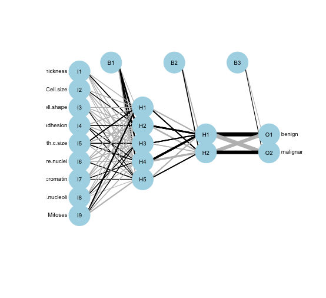

Rate your confidence of being able to answer the below questions saying A, B or C, where:

- A. I am confident that I know the answer to this question
- B. I know at least 50% of the answer to this question, within 20 minutes I could find the required resources to enable a complete answer
- C. I am not confident that I can answer the question at this time.

### Part I (Rating confidence)

1. Could you broadly explain the concept and application of likelihood?
2. In Bayesian approach, could you broadly explain the difference the prior and posterior distribution?
3. In feature selection, could you explain the concept of Lasso?
4. In ANN, could you explain what an activation function is?
5. In ANN, could you explain gradient descent?

6. (Ask Bengt)
7. (Ask Bengt)

8. Would you be able to explain a structure of a feedforward neural network? 

### Part II (Answer questions: matching the confidence questions above)

1. What is not correct about likelihood?
a) likelihood can be used to estimate how likely it is that a certain model is true
b) likelihood can be used to estimate how likely it is that a certain model parameter values are true
c) the maximum likelihood estimates are the same least squares estimates in linear models
d) we use maximum likelihood to find out the probability of observing data given the most likely model

2. In Bayesian approach, what is true about the prior and posterior distribution?
a) prior distribution reflects what we know about the value of the parameter of interest, the posterior distribution captures our prior knowledge and knowledge coming from observing the data
b) posterior distribution reflects what we know about the value of the parameter of interest, the prior distribution captures our prior knowledge and knowledge coming from observing the data
c) prior distribution and posterior distributions are unrelated, one is used to capture a hypothetical distribution of the model parameter, the posterior captures the knowledge after getting to know the data
d) none of the above is true

3. In feature selection, what is not true about Lasso?
a) LASSO stands for absolute shrinkage and selection operator 
b) LASSO can be viewed as least squares model parameters estimation that includes a penalty criterion
c) LASSO can be viewed as a Bayesian posterior probability
d) LASSO handles unstandardized variables while shrinking unimportant coefficients towards 0

4. In ANN, what is not true about the activation function?
a) activation function is an equation that determines the output of neuron in a neural network
b) activation function normalizes the output of each neuron to 0 - 1 range
c) logistic function is an example of an activation function
d) activation function activates learning in ANN

5. In ANN, what is true about gradient descent?
a) gradient descent is used during back-propagation to update model parameters
b) gradient descent is calculated based on partial derivatives of the loss function
c) gradient descent is used in forward propagation to update model parameters
d) gradient descent depends on the learning rate

6. (Ask Bengt)

7. (Ask Bengt)

8. What is true about the structure of the below neural network?
a) there are 2 hidden layers containing 5 nodes and 2 nodes respectively and 9 nodes in the input layer
b) there are 2 hidden layers containing 2 nodes and 5 nodes respectively and 9 nodes in the input layer
c) there are 3 hidden layers containing 5, 2 and 2 nodes respectively 
d) there is one hidden layer with 5 nodes and 2 output layers

 

