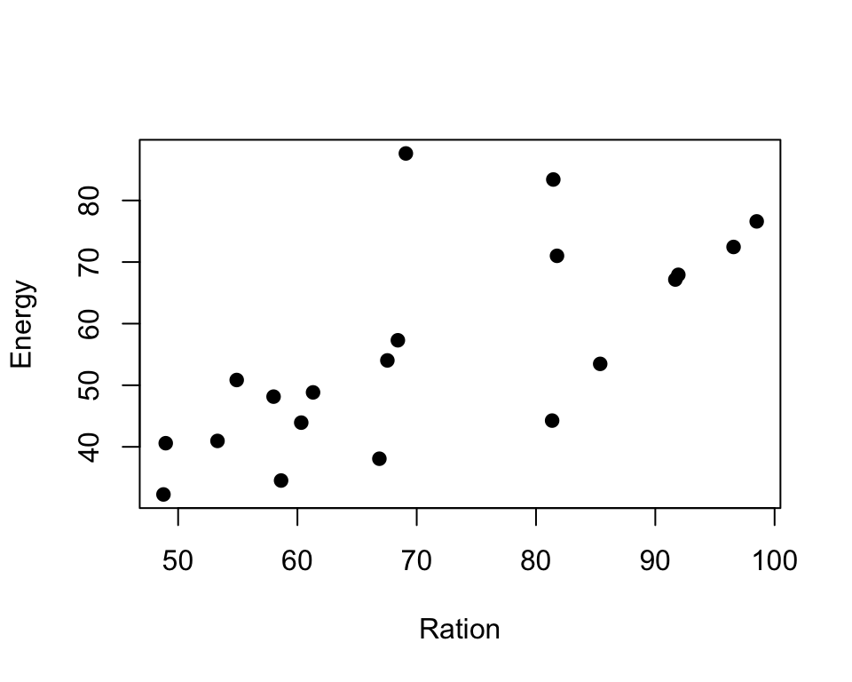
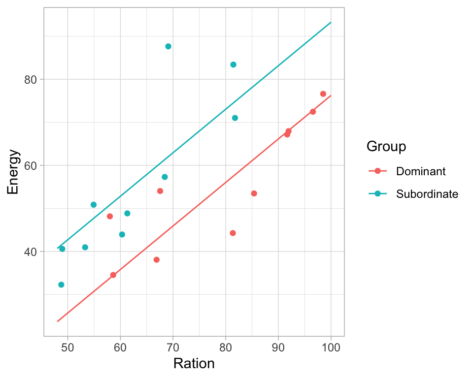

# Regression coefficients

**Aims**

- to clarify the interpretation of the fitted linear models

**Learning outcomes**

- to use `lm()` function to fit multiple linear regression model
- to be able to interpret the output of the model
- to be able to use lm() function to check for association between variables, group effects and interaction terms


## Interpreting and using linear regression models
- In previous section we have seen how to find estimates of model coefficients, using theorems and vector-matrix notations. 
- Now, we will focus on what model coefficient values tell us and how to interpret them
- And we will look at the common cases of using linear regression models
- We will do this via analyzing some examples


## Example: plasma volume

```r
# data
weight <- c(58, 70, 74, 63.5, 62.0, 70.5, 71.0, 66.0) # body weight (kg)
plasma <- c(2.75, 2.86, 3.37, 2.76, 2.62, 3.49, 3.05, 3.12) # plasma volume (liters)

# fit regression model
model <- lm(plasma ~ weight)

# plot the original data and fitted regression line
plot(weight, plasma, pch=19, xlab="weight [kg]", ylab="plasma [l]")
lines(weight, model$fitted.values, col="red") # fitted model in red
grid()
```


```r
# print model summary
print(summary(model))
## 
## Call:
## lm(formula = plasma ~ weight)
## 
## Residuals:
##      Min       1Q   Median       3Q      Max 
## -0.27880 -0.14178 -0.01928  0.13986  0.32939 
## 
## Coefficients:
##             Estimate Std. Error t value Pr(>|t|)  
## (Intercept)  0.08572    1.02400   0.084   0.9360  
## weight       0.04362    0.01527   2.857   0.0289 *
## ---
## Signif. codes:  0 '***' 0.001 '**' 0.01 '*' 0.05 '.' 0.1 ' ' 1
## 
## Residual standard error: 0.2188 on 6 degrees of freedom
## Multiple R-squared:  0.5763,	Adjusted R-squared:  0.5057 
## F-statistic:  8.16 on 1 and 6 DF,  p-value: 0.02893
```

**Model:** 

- $Y_i = \alpha + \beta x_i + \epsilon_i$ where $x_i$ corresponds to $weight_i$

**Slope**

- The value of slope tells us how and by much the outcome changes with a unit change in $x$
- If we go up in weight 1 kg what would be our expected change in plasma volume$^1$? 
- And if we go up in weight 10 kg what would be our expected change in plasma volume$^2$?


**Intercept**

- the **intercept**, often labeled the **constant**, is the value of Y when $x_i=0$
- in models where $x_i$ can be equal 0, the intercept is simply the expected mean value of response
- in models where $x_i$ cannot be equal 0, like in our plasma example no weight makes no sense for healthy men, the intercept has no intrinsic meaning
- the intercept is thus quite often ignored in linear models, as it is the value of slope that dictates the association between exposure and outcome

<br />

- $^1$: If we go up in weight 1 kg we would expect our plasma volume to increase by 0.04 liter since $\hat{\beta} = 0.04$
- $^2$ If we go up in weight 10 kg we would expect our plasma voluem to increase by $0.04 \cdot 10 = 0.4$ liter


## Example: Galapagos Islands
Researchers were interested in biological diversity on the Galapagos islands. They've collected data on number of plant species (Species) and number of endemic species on 30 islands as well as some descriptors of the islands such as area [$\mathrm{km^2}$], elevation [m], distance to nearest island [km], distance to Santa Cruz [km] and the area of the adjacent island [$\mathrm{km^2}$].  

The preview of data is here: 

```r
# Data is available via faraway package
if(!require(faraway)){
    install.packages("faraway")
    library(faraway)
}

head(gala)
##              Species Endemics  Area Elevation Nearest Scruz Adjacent
## Baltra            58       23 25.09       346     0.6   0.6     1.84
## Bartolome         31       21  1.24       109     0.6  26.3   572.33
## Caldwell           3        3  0.21       114     2.8  58.7     0.78
## Champion          25        9  0.10        46     1.9  47.4     0.18
## Coamano            2        1  0.05        77     1.9   1.9   903.82
## Daphne.Major      18       11  0.34       119     8.0   8.0     1.84
```

And we can fit a linear regression model to model number of Species given the remaining variables. Let's keep aside for now that number of Species is actually a count variable, not a continuous numerical variable, we just want to estimate the number of Species for now. 

**Fitted Model**

- $Y_i = \beta_0 + \beta_1 Area_i + \beta_2 Elevation_i + \beta_3 Nearest_i + \beta_4 Scruz_i + \beta_5 Adjacent_i + \epsilon_i$


```r
# fit multiple linear regression and print model summary
model1 <- lm(Species ~ Area + Elevation + Nearest + Scruz + Adjacent, data = gala)
print(summary(model1))
## 
## Call:
## lm(formula = Species ~ Area + Elevation + Nearest + Scruz + Adjacent, 
##     data = gala)
## 
## Residuals:
##      Min       1Q   Median       3Q      Max 
## -111.679  -34.898   -7.862   33.460  182.584 
## 
## Coefficients:
##              Estimate Std. Error t value Pr(>|t|)    
## (Intercept)  7.068221  19.154198   0.369 0.715351    
## Area        -0.023938   0.022422  -1.068 0.296318    
## Elevation    0.319465   0.053663   5.953 3.82e-06 ***
## Nearest      0.009144   1.054136   0.009 0.993151    
## Scruz       -0.240524   0.215402  -1.117 0.275208    
## Adjacent    -0.074805   0.017700  -4.226 0.000297 ***
## ---
## Signif. codes:  0 '***' 0.001 '**' 0.01 '*' 0.05 '.' 0.1 ' ' 1
## 
## Residual standard error: 60.98 on 24 degrees of freedom
## Multiple R-squared:  0.7658,	Adjusted R-squared:  0.7171 
## F-statistic:  15.7 on 5 and 24 DF,  p-value: 6.838e-07
```


**Using the model compare two islands in terms of number of species**

- if the second island has an elevation 1 m higher than the first one?$^1$
- if the second island has an elevation 100 m higher than the first one?$^2$
- if the second island is 100 km closer to Santa Cruz?$^3$
- overall, is there a relationship between the response $Y$ (Species) and predictors?$^4$

<br />  

- $^1$ the second island will have 0.32 species more than the first one, $\hat{\beta_2} = 0.319465 \approx 0.32$
- $^2$ the second island will have $0.32 \cdot 100 = 32$ more species than the first one
- $^3$ the second island would have $-0.24 \cdot 100 = -24$ less species than the first if there was enough evidence to reject the null hypothesis of $\beta_4 = 0$; It is not appropriate to try to interpret non-significant coefficients.
- $^4$ we have seen before that in the case of simple linear regression it was enough to test the null hypothesis of $H_0: \beta=0$ versus $H_0: \beta\neq0$ to answers the question whether there is an overall relationship between response and predictor. In case of multiple regression, with many predictors, we need to test the null hypothesis of $$H_0: \beta_1 = \beta_2 = \dots = \beta_p = 0$$ versus the alternative $$H_a: at \; least \; one \; \beta_j \; is \; non-zero$$. This hypothesis test is performed by computing **F-statistics** reported in the model summary and calculated as $F = \frac{(TSS - RSS)/p}{RSS/(n-p-1)}$ where $TSS = \sum(y_i - \bar{y})^2$ and $RSS = \sum(y_i - \hat{y_i})^2$. Here, the $F-statsitics = 15.7$ and the associated $p-value < 0.05$ so there is enough evidence to reject the null hypothesis in favor of the alternative and conclude that there is an overall signficiant relationship between response (Species) and predictors. 

<br />
**Not so easy: alternative model**

Consider an alternative model where we only use elevation to model the number of species
$$Y_i = \beta_0 + \beta_1 Elevation_i + \epsilon_i$$
We fit the model in `R` and look at the model summary

```r
model2 <- lm(Species ~ Elevation, data = gala)
print(summary(model2))
## 
## Call:
## lm(formula = Species ~ Elevation, data = gala)
## 
## Residuals:
##      Min       1Q   Median       3Q      Max 
## -218.319  -30.721  -14.690    4.634  259.180 
## 
## Coefficients:
##             Estimate Std. Error t value Pr(>|t|)    
## (Intercept) 11.33511   19.20529   0.590     0.56    
## Elevation    0.20079    0.03465   5.795 3.18e-06 ***
## ---
## Signif. codes:  0 '***' 0.001 '**' 0.01 '*' 0.05 '.' 0.1 ' ' 1
## 
## Residual standard error: 78.66 on 28 degrees of freedom
## Multiple R-squared:  0.5454,	Adjusted R-squared:  0.5291 
## F-statistic: 33.59 on 1 and 28 DF,  p-value: 3.177e-06
```


**Using the alternative model compare again two islands in terms of number of species**

- if the second island has an elevation 1 m higher than the first one?$^1$
- if the second island has an elevation 100 m higher than the first one?$^2$

<br />

- $^1$ the second island will have 0.20 species more than the first one
- $^2$ the seond island will have $0.20 \cdot 100 = 20$ more species

**Specific interpretation**

- Obviously there is difference between 32 and 20 times more species given the same elevation difference as obtained by the multiple regression (first model) and simple regression (alternative model). 
- Our interpretations need to be more specific and we say that **a unit increase in $x$ with other predictors held constant will produce a change equal to $\hat{\beta}$ in the response $y$**
- It is of course often quite unrealistic to be able to control other variables and keep them constant and for our alternative model, a change in evaluation is most likely associated with other variables, even though they are not included in the model.
- Further, our explanation contains **no notation of causation**, even though the two models are showing a strong association between elevation and number of species.
- We will learn later how to choose the best model by assessing its fit and including only relevant variable (feature selection), for now we focus on learning how to interpret the coefficients given a fitted model.

## Example: Height and gender
Data are available containing the weight [lbs] and height [inches] of 10000 men and women

```r
# read in data
htwtgen <- read.csv("data/lm/heights_weights_genders.csv")
head(htwtgen)
##   Gender   Height   Weight
## 1   Male 73.84702 241.8936
## 2   Male 68.78190 162.3105
## 3   Male 74.11011 212.7409
## 4   Male 71.73098 220.0425
## 5   Male 69.88180 206.3498
## 6   Male 67.25302 152.2122
#
# boxplot for females and males
boxplot(htwtgen$Height ~ htwtgen$Gender, xlab="", ylab="Height", col="lightblue")
```


- We want to **compare the average height of men and women**.
- We can do that using linear regression and including gender as **binary variable**

**Model**

$$Y_i = \alpha + \beta I_{x_i} + \epsilon_i$$
where
\begin{equation}
    I_{x_i} =
    \left\{
        \begin{array}{cc}
                1 & \mathrm{if\ } x_i=1 \\
                0 & \mathrm{if\ } x_i=0 \\
        \end{array}
    \right.
\end{equation}
for some coding, e.g. we choose to set "Female=1" and "Male=0" or vice versa. 

In `R` we write:

```r
# Note: check that Gender is indeed non-numeric 
print(class(htwtgen$Gender))
## [1] "character"
#
# fit linear regression and print model summary
model1 <- lm(Height ~ Gender, data = htwtgen)
print(summary(model1))
## 
## Call:
## lm(formula = Height ~ Gender, data = htwtgen)
## 
## Residuals:
##      Min       1Q   Median       3Q      Max 
## -10.6194  -1.8374   0.0088   1.9185   9.9724 
## 
## Coefficients:
##             Estimate Std. Error t value Pr(>|t|)    
## (Intercept) 63.70877    0.03933  1619.8   <2e-16 ***
## GenderMale   5.31757    0.05562    95.6   <2e-16 ***
## ---
## Signif. codes:  0 '***' 0.001 '**' 0.01 '*' 0.05 '.' 0.1 ' ' 1
## 
## Residual standard error: 2.781 on 9998 degrees of freedom
## Multiple R-squared:  0.4776,	Adjusted R-squared:  0.4775 
## F-statistic:  9140 on 1 and 9998 DF,  p-value: < 2.2e-16
```

**Estimates**
$$\hat{\alpha} = 63.71$$
$$\hat{\beta} = 5.32$$

- the `lm()` function chooses automatically one of the category as baseline, here Females
- model summary prints the output of the model with the baseline category "hidden"
- i.e. notice the only label we have is "GenderMale"
- meaning that we ended-up having a model coded as below:
\begin{equation}
    I_{x_i} =
    \left\{
        \begin{array}{cc}
                1 & \mathrm{if\ } \quad person_i\;is\;male \\
                0 & \mathrm{if\ } \quad person_i\;is\;female \\
        \end{array}
    \right.
\end{equation}
- Consequently, if observation $i$ is male then the expected value of height is: 
$$E(Height_i|Male) = 63.71 + 5.32 = 69.03$$
- and if observation $i$ is female then the expected value of height is: 
$$E(Height_i|Male) = 63.71$$

## Example: Heigth, weight and gender I
- So as expected, there is a difference in average height between the men and women.
- Is there a relationship between weight and height? 
- If so, does this relationship depend on gender? 


```r
library(ggplot2)

# plot the data separately for Male and Female
ggplot(data=htwtgen, aes(x = Weight, y=Height, col = Gender)) + 
  geom_point(alpha = 0.5) + 
  theme_light()
```


- From the plot we can see that height increases with weight. 
- On average, men are taller than women.
- On average, men weight more than women.
- The relationship between height and weight appears to be the same for males and females, i.e. height increases with weight for both men and women.

To assess the relationship we use a model containing height and gender.

**Model**

$$Y_i = \alpha + \beta I_{x_i} + \gamma x_{2,i} + \epsilon_i$$
where
\begin{equation}
    I_{x_i} =
    \left\{
        \begin{array}{cc}
                1 & \mathrm{if\ } \quad person_i\;is\;male \\
                0 & \mathrm{if\ } \quad person_i\;is\;female \\
        \end{array}
    \right.
\end{equation}

and $x_{2,i}$ is the weight of person $i$

In `R` we write: 

```r
# fit linear model and print model summary
model2 <- lm(Height ~ Gender + Weight, data = htwtgen) 
print(summary(model2))
## 
## Call:
## lm(formula = Height ~ Gender + Weight, data = htwtgen)
## 
## Residuals:
##     Min      1Q  Median      3Q     Max 
## -5.4956 -0.9583  0.0126  0.9867  5.8358 
## 
## Coefficients:
##               Estimate Std. Error t value Pr(>|t|)    
## (Intercept) 47.0306678  0.1025161  458.76   <2e-16 ***
## GenderMale  -0.9628643  0.0474947  -20.27   <2e-16 ***
## Weight       0.1227594  0.0007396  165.97   <2e-16 ***
## ---
## Signif. codes:  0 '***' 0.001 '**' 0.01 '*' 0.05 '.' 0.1 ' ' 1
## 
## Residual standard error: 1.435 on 9997 degrees of freedom
## Multiple R-squared:  0.8609,	Adjusted R-squared:  0.8609 
## F-statistic: 3.093e+04 on 2 and 9997 DF,  p-value: < 2.2e-16
```

**Model together with estimates**

$$Y_i = \alpha + \beta I_{x_i} + \gamma x_{2,i} + \epsilon_i$$
where
\begin{equation}
    I_{x_i} =
    \left\{
        \begin{array}{cc}
                1 & \mathrm{if\ } \quad person_i\;is\;male \\
                0 & \mathrm{if\ } \quad person_i\;is\;female \\
        \end{array}
    \right.
\end{equation}

and $x_{2,i}$ is the weight of person $i$


**Estimates**

$$\hat{\alpha} = 47.031$$
$$\hat{\beta} = -0.963$$
$$\hat{\gamma} = 0.123$$


- Using our estimates, for a male of with an example weight of 161.4 we would predict a height of:
$$E(Height_i|Male, Weight = 161.4) = 47.031 - 0.963 + (0.123 \cdot 161.4) = 65.9$$
- and for a female of weight 161.4 we would predict a height of 
$$E(Height_i|Female, Weight = 161.4) = 47.031 + (0.123 \cdot 161.4) = 66.9$$

In `R` we can plot our data and the fitted moded to verify our calculations:

```r
# plot the data separately for men and women
# using ggplot() and geom_smooth()
ggplot(data=htwtgen, aes(x = Weight, y=Height, col = Gender)) + 
  geom_point(alpha = 0.1) + 
  geom_smooth(method=lm) + 
  theme_light() + 
  guides(color=guide_legend(override.aes=list(fill=NA)))
```


<br />

<!-- **Predicting outside the data range: warning** -->

<!-- - As much as our calculations are correct, the above example also shows the need of considering the data when interpreting coefficients. Our expected height for a person weighing 161.4 lbs is 66.9 for a woman and 65.9 (lower!) for a man. -->
<!-- - However, our initial data inspection on the plot showed that the the majority of our values for women lie between 100 and 175 and between 150 and 250 for men, i.e. they lie in different ranges. -->
<!-- - In principle, we should **not predict outside the data range**.  -->


## Example: Heigth, weight and gender II
- The fitted lines in the above example are **parallel**, the **slope is modeled to be the same for men and women**, and the intercept denotes the group differences
- It is also possible to allow **both intercept and slope being fitted separately for each group**
- This is done when we except that the relationships are different in different groups.
- And we then talk about including **interaction effect**, as the two lines may interact (cross).

**Model**

$$Y_{i,j} = \alpha_i + \beta_ix_{ij} + \epsilon_{i,j}$$ 
where:

- $Y_{i,j}$ is the height of person $j$ of gender $i$
- $x_{ij}$ is the weight of person $j$ of gender $i$
- $i=1$ corresponds to men in our example (keeping the same coding as above)
- $i=2$ corresponds to women

In `R` we define the interaction term with `*`:

```r
# fit linear model with interaction 
model3 <- lm(Height ~ Gender * Weight, data = htwtgen)
print(summary(model3))
## 
## Call:
## lm(formula = Height ~ Gender * Weight, data = htwtgen)
## 
## Residuals:
##     Min      1Q  Median      3Q     Max 
## -5.4698 -0.9568  0.0092  0.9818  5.7544 
## 
## Coefficients:
##                    Estimate Std. Error t value Pr(>|t|)    
## (Intercept)       47.347783   0.146325 323.579  < 2e-16 ***
## GenderMale        -1.683668   0.242119  -6.954 3.78e-12 ***
## Weight             0.120425   0.001067 112.903  < 2e-16 ***
## GenderMale:Weight  0.004493   0.001480   3.036   0.0024 ** 
## ---
## Signif. codes:  0 '***' 0.001 '**' 0.01 '*' 0.05 '.' 0.1 ' ' 1
## 
## Residual standard error: 1.435 on 9996 degrees of freedom
## Multiple R-squared:  0.861,	Adjusted R-squared:  0.861 
## F-statistic: 2.064e+04 on 3 and 9996 DF,  p-value: < 2.2e-16
```

Now, based on the regression output we would expect:

- for a men of weight $x$, a height of:
$$E(height|male\; and \; weight=x)=47.34778 - 1.68367 + 0.12043x + 0.00449x = 45.7 + 0.125x$$
- for a women of weight $x$, a height of $$E(height|female\; and \; weight=x)=47.34778 + 0.12043x$$

**Estimates**
$$\hat{\alpha_1} = 45.7$$
$$\hat{\beta_1} = 0.125$$

$$\hat{\alpha_2} = 47.34778$$
$$\hat{\beta_2} = 0.12043$$

- We can see from the regression output that the interaction term, "GenderMale:Weight,  is significant 
- and therefore the relationship between weight and height is different for men and women.
- We can plot the fitted model and see that the lines are no longer parallel.
- We will see clearer example of the interactions in the exercises.


```r
# ggiraphExtra makes it easy to visualize fitted models
if(!require(ggiraphExtra)){
    install.packages("ggiraphExtra")
    library(ggiraphExtra)
}

ggPredict(model3) +
  theme_light() + 
  guides(color=guide_legend(override.aes=list(fill=NA)))
```


-------

## Exercises: linear models II

**Before you begin:**

- **Try to complete Exr. \@ref(exr:lm-rerun) and Exr. \@ref(exr:lm-trout)** to practice the material above. Exr. \@ref(exr:lm-blooddrug) includes three groups and can be used as a supplementary practice. 
- **Data for exercises** can be downloaded from Github using [Link 1](https://github.com/olgadet/mlbiostats-linear-models/blob/main/data/data.zip) or from Canvas under Files -> data_exercises/linear-models

---------

\BeginKnitrBlock{exercise}<div class="exercise"><span class="exercise" id="exr:lm-rerun"><strong>(\#exr:lm-rerun) </strong></span>
Given the "height-weight-gender" data:

a) repeat fitting the models with a) gender, b) weight and gender and c) interaction between weight and gender
b) given the model with the interaction term, what is expected height of a man and a women given a weight of 120 lbs?
c) can you use predict() function to check your calculations? 
</div>\EndKnitrBlock{exercise}

---------

\BeginKnitrBlock{exercise}<div class="exercise"><span class="exercise" id="exr:lm-trout"><strong>(\#exr:lm-trout) </strong></span>
When the behavior of a group of trout is studied, some fish are observed to become dominant and others to become subordinate. Dominant fish have freedom of movement whereas subordinate fish tend to congregate in the periphery of the waterway to avoid crossing the path of the dominant fish. Data on energy expenditure and ration of blood obtained were collected as part of a laboratory experiment for 20 trout. Energy and ration is measured in calories per kilo-calorie per trout per day.

Use the below code to load the data to R and use linear regression models to answer:

- a) is there a relationship between ration obtained and energy expenditure
- b) is the relationship between ration obtained and energy expenditure different for each type of fish?
- Hint: it is good to start with some explanatory plots between every pair of variable
</div>\EndKnitrBlock{exercise}


```r
# read in data and show preview
trout <- read.csv("data/lm/trout.csv")

# recode the Group variable and treat like categories (factor)
trout$Group <- factor(trout$Group, labels=c("Dominant", "Subordinate"))
```

-------

\BeginKnitrBlock{exercise}<div class="exercise"><span class="exercise" id="exr:lm-blooddrug"><strong>(\#exr:lm-blooddrug) </strong></span>A clinical trial

A clinical trial has been carried out to compare three drug treatments which are intended to lower blood pressure in hypertensive patients. The data contains initial values fo systolic blood pressure (bp) in mmHg for each patient and the reduction achieved during the course of the trial. For each patient, allocation to treatment (drug) was carried out randomly and conditions such as the length of the treatment and dose of the drug were standardized as far as possible. 

Use linear regression to answer questions:

a) is there an association between the reduction in blood pressure and initial blood pressure 
b) is reduction in blood pressure different across the treatment (in three drug groups)?
c) is reduction in blood pressure different across the treatment when accounting for initial blood pressure? 
d) is reduction in blood pressure changing differently under different treatment? 
Hint: here we have three categories which can be seen as expanding the model with two categories by an additional one: one category will be treated as baseline
</div>\EndKnitrBlock{exercise}


```r
blooddrug <- read.csv("data/lm/bloodrug.csv")
blooddrug$drug <- factor(blooddrug$drug)
head(blooddrug)
```

```
##   initial redn drug
## 1     158    4    1
## 2     176   21    1
## 3     174   36    1
## 4     168   14    1
## 5     174   34    1
## 6     186   37    1
```

-------

## Answers to selected exercises (linear models II) {-}

Exr. \@ref(exr:lm-rerun)

a)

```r
htwtgen <- read.csv("data/lm/heights_weights_genders.csv")
head(htwtgen)
##   Gender   Height   Weight
## 1   Male 73.84702 241.8936
## 2   Male 68.78190 162.3105
## 3   Male 74.11011 212.7409
## 4   Male 71.73098 220.0425
## 5   Male 69.88180 206.3498
## 6   Male 67.25302 152.2122
# a)
model1 <- lm(Height ~ Gender, data = htwtgen)
model2 <- lm(Height ~ Gender + Weight, data = htwtgen)
model3 <- lm(Height ~ Gender * Weight, data = htwtgen)

# print(summary(model1))
# print(summary(model2))
# print(summary(model3))
```

b) use equations to find the height for men and women respectively:
$$E(height|male\; and \; weight=x)=47.34778 - 1.68367 + 0.12043x + 0.00449x = 45.7 + 0.125x$$
$$E(height|female\; and \; weight=x)=47.34778 + 0.12043x$$

c)

```r
# for men
new.obs <- data.frame(Weight=120, Gender="Male")
predict(model3, newdata = new.obs)
##        1 
## 60.65427
# for female
new.obs <- data.frame(Weight=120, Gender="Female")
predict(model3, newdata = new.obs)
##        1 
## 61.79882
```

----------

Exr. \@ref(exr:lm-trout)


```r
# read in data and show preview
trout <- read.csv("data/lm/trout.csv")

# recode the Group variable and treat like categories (factor)
trout$Group <- factor(trout$Group, labels=c("Dominant", "Subordinate"))
head(trout)
##   Energy Ration    Group
## 1  44.26  81.35 Dominant
## 2  67.16  91.68 Dominant
## 3  48.15  58.00 Dominant
## 4  34.53  58.63 Dominant
## 5  67.93  91.93 Dominant
## 6  72.45  96.56 Dominant
# plot data
# boxplots of Energy and Ration per group
boxplot(trout$Energy ~ trout$Group, xlab="", ylab="Energy")
```


```r
boxplot(trout$Ration ~ trout$Group, xlab="", ylab="Ration")
```


```r
# scatter plot of Ration vs. Energy
plot(trout$Ration, trout$Energy, pch=19, xlab="Ration", ylab="Energy")
```



- From the exploratory plots we see that there is some sort of relationship between ratio and energy, i.e. energy increase while ration obtained increases
- From boxplots we see that the ration obtained may be different in two groups


```r
# Is there a relationship between ration obtained and energy expenditure
model1 <- lm(Energy ~ Ration, data = trout)
print(summary(model1))
## 
## Call:
## lm(formula = Energy ~ Ration, data = trout)
## 
## Residuals:
##     Min      1Q  Median      3Q     Max 
## -18.704  -4.703  -0.578   2.432  33.506 
## 
## Coefficients:
##             Estimate Std. Error t value Pr(>|t|)    
## (Intercept)   4.3037    12.5156   0.344 0.734930    
## Ration        0.7211     0.1716   4.203 0.000535 ***
## ---
## Signif. codes:  0 '***' 0.001 '**' 0.01 '*' 0.05 '.' 0.1 ' ' 1
## 
## Residual standard error: 12.05 on 18 degrees of freedom
## Multiple R-squared:  0.4953,	Adjusted R-squared:  0.4673 
## F-statistic: 17.66 on 1 and 18 DF,  p-value: 0.0005348
# from the regression output we can see that yes, a unit increase in ratio increase energy expenditure by 0.72

# Is there a relationship between ration obtained and energy expenditure different for each type of fish?
# we first check if there is a group effect
model2 <- lm(Energy ~ Ration + Group, data = trout)
print(summary(model2))
## 
## Call:
## lm(formula = Energy ~ Ration + Group, data = trout)
## 
## Residuals:
##     Min      1Q  Median      3Q     Max 
## -13.130  -5.139  -0.870   2.199  25.622 
## 
## Coefficients:
##                  Estimate Std. Error t value Pr(>|t|)    
## (Intercept)      -24.8506    13.3031  -1.868  0.07910 .  
## Ration             1.0109     0.1626   6.218 9.36e-06 ***
## GroupSubordinate  17.0120     5.1075   3.331  0.00396 ** 
## ---
## Signif. codes:  0 '***' 0.001 '**' 0.01 '*' 0.05 '.' 0.1 ' ' 1
## 
## Residual standard error: 9.647 on 17 degrees of freedom
## Multiple R-squared:  0.6946,	Adjusted R-squared:  0.6587 
## F-statistic: 19.33 on 2 and 17 DF,  p-value: 4.182e-05
ggPredict(model2) +   
  theme_light() + 
  guides(color=guide_legend(override.aes=list(fill=NA)))
```



```r
# and whether there is an interaction effect
model3 <- lm(Energy ~ Ration * Group, data = trout)
print(summary(model3))
## 
## Call:
## lm(formula = Energy ~ Ration * Group, data = trout)
## 
## Residuals:
##      Min       1Q   Median       3Q      Max 
## -12.7951  -6.0981  -0.1554   3.9612  23.5946 
## 
## Coefficients:
##                         Estimate Std. Error t value Pr(>|t|)    
## (Intercept)              -9.2330    15.9394  -0.579 0.570483    
## Ration                    0.8149     0.1968   4.141 0.000767 ***
## GroupSubordinate        -18.9558    22.6934  -0.835 0.415848    
## Ration:GroupSubordinate   0.5200     0.3204   1.623 0.124148    
## ---
## Signif. codes:  0 '***' 0.001 '**' 0.01 '*' 0.05 '.' 0.1 ' ' 1
## 
## Residual standard error: 9.214 on 16 degrees of freedom
## Multiple R-squared:  0.7378,	Adjusted R-squared:  0.6886 
## F-statistic:    15 on 3 and 16 DF,  p-value: 6.537e-05
ggPredict(model3) + 
  theme_light() + 
  guides(color=guide_legend(override.aes=list(fill=NA)))
```


Based on the regression output and plots we can say:

- there is a relationship between ration obtained and energy expenditure
- that this relationship is the same in the two groups although the energy expenditure is higher in the dominant fish


---


Exr. \@ref(exr:lm-blooddrug)

a) 

Yes. The `redn` and `initial` were significantly associated (p-value = 0.00312, linear regression).


```r
model1 <- lm(redn ~ initial, data = blooddrug)
summary(model1)
## 
## Call:
## lm(formula = redn ~ initial, data = blooddrug)
## 
## Residuals:
##     Min      1Q  Median      3Q     Max 
## -23.476 -11.705   1.558   9.197  24.392 
## 
## Coefficients:
##             Estimate Std. Error t value Pr(>|t|)   
## (Intercept) -72.7302    29.1879  -2.492  0.02036 * 
## initial       0.5902     0.1788   3.301  0.00312 **
## ---
## Signif. codes:  0 '***' 0.001 '**' 0.01 '*' 0.05 '.' 0.1 ' ' 1
## 
## Residual standard error: 12.79 on 23 degrees of freedom
## Multiple R-squared:  0.3214,	Adjusted R-squared:  0.2919 
## F-statistic: 10.89 on 1 and 23 DF,  p-value: 0.003125
```

b) 

No. The `drug2` and `drug3` were not significantly different from `drug1` (p-value = 0.714 and p-value = 0.628, respectively). The patients of the drug 1 group had 2.750 higher blood pressure drop (`redn`) than those of the drug 2 group. However, the difference was relatively small comparing to the standard error of the estimate, which was 7.402.
The difference between drug 1 and 3 was relatively small, too.

```r
model2 <- lm(redn ~ drug, data = blooddrug)
summary(model2)
## 
## Call:
## lm(formula = redn ~ drug, data = blooddrug)
## 
## Residuals:
##     Min      1Q  Median      3Q     Max 
## -32.000  -9.286   0.000  12.714  26.000 
## 
## Coefficients:
##             Estimate Std. Error t value Pr(>|t|)    
## (Intercept)   23.250      5.517   4.214 0.000358 ***
## drug2          2.750      7.402   0.372 0.713796    
## drug3         -3.964      8.076  -0.491 0.628379    
## ---
## Signif. codes:  0 '***' 0.001 '**' 0.01 '*' 0.05 '.' 0.1 ' ' 1
## 
## Residual standard error: 15.6 on 22 degrees of freedom
## Multiple R-squared:  0.03349,	Adjusted R-squared:  -0.05437 
## F-statistic: 0.3812 on 2 and 22 DF,  p-value: 0.6875
```

c)

Yes. The `redn` of the `drug2` group was significantly higher than that of the `drug1` group after adjustment for the effects of the `initial` (P = 0.018).
The reduction of the patients who got the drug 2 was much higher (13.6906) than the drug 1, comparing to the standard error of the difference (5.3534) after accounting for initial blood pressure. 


```r
model3 <- lm(redn ~ drug + initial, data = blooddrug)
summary(model3)
## 
## Call:
## lm(formula = redn ~ drug + initial, data = blooddrug)
## 
## Residuals:
##      Min       1Q   Median       3Q      Max 
## -15.8114 -10.5842  -0.4959   6.2834  16.4265 
## 
## Coefficients:
##              Estimate Std. Error t value Pr(>|t|)    
## (Intercept) -124.8488    28.0674  -4.448 0.000223 ***
## drug2         13.6906     5.3534   2.557 0.018346 *  
## drug3         -7.2045     5.4275  -1.327 0.198625    
## initial        0.8895     0.1671   5.323 2.81e-05 ***
## ---
## Signif. codes:  0 '***' 0.001 '**' 0.01 '*' 0.05 '.' 0.1 ' ' 1
## 
## Residual standard error: 10.42 on 21 degrees of freedom
## Multiple R-squared:  0.5886,	Adjusted R-squared:  0.5298 
## F-statistic: 10.01 on 3 and 21 DF,  p-value: 0.0002666
```

