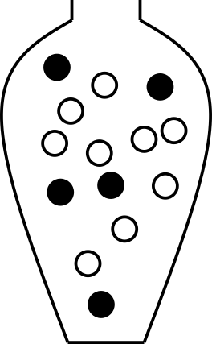

--- 
title: "Descriptive statistics, probability and inference"
author: "NBIS"
date: 2021-10-04 -- 2021-10-08
output:
  bookdown::gitbook:
    in_header:
      style.css
    keep_md: true
    number_sections: true
    css: style.css
  toc: false
---

# Preface {-}

This repository contains teaching and learning materials prepared and used during “Introduction to biostatistics and machine learning” course, organized by NBIS, National Bioinformatics Infrastructure Sweden. The course is open for PhD students, postdoctoral researcher and other employees within Swedish universities. The materials are geared towards life scientists wanting to be able to understand and use basic statistical and machine learning methods. More about the course [https://uppsala.instructure.com/courses/51998/](https://uppsala.instructure.com/courses/51998/)


# Descriptive statistics {#session-descstats}

Learning outcomes:

- be aware of data types
- compute measures of location, including mean and median
- compute measures of spread, including quantiles, variance and standard deviation
- understand the concept random sample
- compute population mean and variance
- compute sample mean and variance


## Data types

Data can be divided into different types; categorical and quantitative (numeric). How to summarize and analyze your data depends on the type.

Categorical data types are divided into;

* Nominal: named. 
*Ex: dead/alive, healthy/sick, WT/mutant, AA/Aa/aa, male/female, red/green/blue*
* Ordinal: named and ordered. 
*Ex: pain (weak, moderate, severe), AA/Aa/aa, very young/young/middle age/old/very old, grade I, II, III, IV*

Quantitative data types are divided into;

* Discrete: finite or countable infinite values. *Ex. counts, number of cells, number of reads*
* Continuous: infinitely many uncountable values. *Ex. height, weight, concentration*


## Categorical data

### Data summarization and plots

Categorical data can be summarized by counting the number of observations of each category and summarizing in a frequency table or bar plot. Alternatively, the proportions (or percentages) of each category can be calculated.


\BeginKnitrBlock{example}<div class="example"><span class="example" id="exm:10mice"><strong>(\#exm:10mice) </strong></span>
**Ten lab mice**
  
Observe gender and weight of your ten lab mice and summarize.</div>\EndKnitrBlock{example}

If you want to follow this example, you can download the data here; [mice.csv](data/mice.csv). You get the subset used in this example by the following commands; 


```r
## first read the full data set into R
mice <- read.csv("mice.csv")
```


```r
## Then extract the specific subset used in this example
m10 <- subset(mice, subset=week==5 & id %in% 1:10, select = c(id, gender, weight))
```

In this example we have only ten observations (mice) and the full data can actually be shown in a table.

<table class="table" style="width: auto !important; margin-left: auto; margin-right: auto;">
<caption>(\#tab:m10)Gender and weight of 10 mice.</caption>
 <thead>
  <tr>
   <th style="text-align:left;">   </th>
   <th style="text-align:right;"> id </th>
   <th style="text-align:left;"> gender </th>
   <th style="text-align:right;"> weight </th>
  </tr>
 </thead>
<tbody>
  <tr>
   <td style="text-align:left;"> 1 </td>
   <td style="text-align:right;"> 1 </td>
   <td style="text-align:left;"> male </td>
   <td style="text-align:right;"> 19 </td>
  </tr>
  <tr>
   <td style="text-align:left;"> 21 </td>
   <td style="text-align:right;"> 2 </td>
   <td style="text-align:left;"> male </td>
   <td style="text-align:right;"> 21 </td>
  </tr>
  <tr>
   <td style="text-align:left;"> 41 </td>
   <td style="text-align:right;"> 3 </td>
   <td style="text-align:left;"> female </td>
   <td style="text-align:right;"> 18 </td>
  </tr>
  <tr>
   <td style="text-align:left;"> 61 </td>
   <td style="text-align:right;"> 4 </td>
   <td style="text-align:left;"> male </td>
   <td style="text-align:right;"> 20 </td>
  </tr>
  <tr>
   <td style="text-align:left;"> 81 </td>
   <td style="text-align:right;"> 5 </td>
   <td style="text-align:left;"> male </td>
   <td style="text-align:right;"> 21 </td>
  </tr>
  <tr>
   <td style="text-align:left;"> 101 </td>
   <td style="text-align:right;"> 6 </td>
   <td style="text-align:left;"> male </td>
   <td style="text-align:right;"> 17 </td>
  </tr>
  <tr>
   <td style="text-align:left;"> 121 </td>
   <td style="text-align:right;"> 7 </td>
   <td style="text-align:left;"> female </td>
   <td style="text-align:right;"> 18 </td>
  </tr>
  <tr>
   <td style="text-align:left;"> 141 </td>
   <td style="text-align:right;"> 8 </td>
   <td style="text-align:left;"> male </td>
   <td style="text-align:right;"> 24 </td>
  </tr>
  <tr>
   <td style="text-align:left;"> 161 </td>
   <td style="text-align:right;"> 9 </td>
   <td style="text-align:left;"> male </td>
   <td style="text-align:right;"> 22 </td>
  </tr>
  <tr>
   <td style="text-align:left;"> 181 </td>
   <td style="text-align:right;"> 10 </td>
   <td style="text-align:left;"> female </td>
   <td style="text-align:right;"> 18 </td>
  </tr>
</tbody>
</table>

We are interested in the gender distribution in our group of mice. Count the frequency of male/female mice and summarize in a table. Also, the fraction or percentage can be useful.

<table class="table" style="width: auto !important; margin-left: auto; margin-right: auto;">
<caption>(\#tab:tabm10)The number of male and female mice.</caption>
 <thead>
  <tr>
   <th style="text-align:left;"> gender </th>
   <th style="text-align:right;"> n </th>
   <th style="text-align:right;"> percent (%) </th>
  </tr>
 </thead>
<tbody>
  <tr>
   <td style="text-align:left;"> female </td>
   <td style="text-align:right;"> 3 </td>
   <td style="text-align:right;"> 30 </td>
  </tr>
  <tr>
   <td style="text-align:left;"> male </td>
   <td style="text-align:right;"> 7 </td>
   <td style="text-align:right;"> 70 </td>
  </tr>
</tbody>
</table>

The frequencies can also be shown in a barplot.


```r
ggplot(m10, aes(x=gender)) + geom_bar()
barplot(table(m10$gender))
```

<div class="figure">

<p class="caption">(\#fig:m10barplot)The number of male and female mice shown in barplots generated using ggplot and basic R graphics.</p>
</div>


\BeginKnitrBlock{example}\iffalse{-91-76-101-102-116-32-104-97-110-100-101-100-110-101-115-115-93-}\fi{}<div class="example"><span class="example" id="exm:lefthandedness"><strong>(\#exm:lefthandedness)  \iffalse (Left handedness) \fi{} </strong></span>You are interested in whether left-handedness is associated to a disease you study and observe left-handedness among 30 patients as well as among 40 healthy controls;</div>\EndKnitrBlock{example}


patients: {L, L, L, R, L, R, R, L, L, R, R, R, R, R, L, R, R, R, R, R, R, R, R, R, R, L, L, R, R, R}

controls: {R, L, R, R, L, R, R, R, R, R, R, R, R, R, R, R, R, R, R, R, R, R, L, R, R, L, R, R, R, R, R, R, R, R, R, R, R, R, R, R}

Summarized as 

<table>
<caption>(\#tab:table1)Summary of left handedness among patients and controls.</caption>
 <thead>
  <tr>
   <th style="text-align:left;"> group </th>
   <th style="text-align:right;"> Total n </th>
   <th style="text-align:left;"> Left handed (%) </th>
  </tr>
 </thead>
<tbody>
  <tr>
   <td style="text-align:left;"> control </td>
   <td style="text-align:right;"> 40 </td>
   <td style="text-align:left;"> 4 (10%) </td>
  </tr>
  <tr>
   <td style="text-align:left;"> patient </td>
   <td style="text-align:right;"> 30 </td>
   <td style="text-align:left;"> 9 (30%) </td>
  </tr>
</tbody>
</table>

or in a contingency table;

<table>
<caption>(\#tab:unnamed-chunk-5)Cross table or contingency table of group and left/right handedness.</caption>
 <thead>
  <tr>
   <th style="text-align:left;">   </th>
   <th style="text-align:right;"> L </th>
   <th style="text-align:right;"> R </th>
   <th style="text-align:right;"> Sum </th>
  </tr>
 </thead>
<tbody>
  <tr>
   <td style="text-align:left;"> control </td>
   <td style="text-align:right;"> 4 </td>
   <td style="text-align:right;"> 36 </td>
   <td style="text-align:right;"> 40 </td>
  </tr>
  <tr>
   <td style="text-align:left;"> patient </td>
   <td style="text-align:right;"> 9 </td>
   <td style="text-align:right;"> 21 </td>
   <td style="text-align:right;"> 30 </td>
  </tr>
  <tr>
   <td style="text-align:left;"> Sum </td>
   <td style="text-align:right;"> 13 </td>
   <td style="text-align:right;"> 57 </td>
   <td style="text-align:right;"> 70 </td>
  </tr>
</tbody>
</table>

Data can be summarized in barplots in several ways;


```r
## Using ggplot to create barplots
ggplot(hand, aes(x=group, fill=handedness)) + geom_bar()
ggplot(hand, aes(x=group, fill=handedness)) + geom_bar(position="dodge")
ggplot(hand, aes(x=group, fill=handedness)) + geom_bar(position="fill") + ylab("Fraction")

## Using basic R graphics to create barplots
tab <- table(hand$handedness, hand$group)
barplot(tab)
barplot(tab, beside=TRUE)
tabperc <- tab
tabperc[,1] <- 100*tab[,1]/sum(tab[,1])
tabperc[,2] <- 100*tab[,2]/sum(tab[,2])
barplot(tabperc)
```

<div class="figure">

<p class="caption">(\#fig:barlefthand)Left-handedness in patient and control groups.</p>
</div>


## Quantitative data

Quantitative data (both discrete and continuous) can be visualized in a histogram;

<div class="figure">

<p class="caption">(\#fig:sum10dice)Throw 10 dice and count the total number of dots. Repeat the experiment 1000 times. This histogram summarize the results, i.e. the total number of dots when throwing 10 dice.</p>
</div>

or a density plot;

<div class="figure">

<p class="caption">(\#fig:dicedens)Density plot over the total number of dots when throwing 10 dice.</p>
</div>

<div class="figure">

<p class="caption">(\#fig:hist)Histogram over weight of 2000 5 weeks old mice, colored according to gender.</p>
</div>

Summary statistics for numeric data are usually divided into measures of location and spread.

<!--   - Interval: no absolute zero, meaningful to compute interval ratios. -->
<!--     Ex: time, temperature -->
<!--   - Ratio: absolute zero, meaningful to compute ratios. Ex. height, -->
<!--     weight, concentration -->
<!-- Often not necessary to distinguish between interval and ratio scale, can be more useful to divide the quantitative scales into -->


## Measures of location

- Mode: the most common value, can be computed also for categorical data
- Median: The value that divide the ordered data values into two equally sized groups. 50% of the values are below the median.


- Mean: the arithmetic mean, also called the average

For $n$ onservations $x_1, x_2, \dots, x_n$, the mean value is calculated as;
  
$$\bar x = \frac{x_1+x_2+\dots+x_n}{n} = \frac{1}{n}\displaystyle\sum_{i=1}^n x_i$$
Note, several very different distributions can still have the same mean value.

<div class="figure">

<p class="caption">(\#fig:mean35)All these distributions have the same mean value, 3.50.</p>
</div>

## Measures of spread
- Quartiles - the three values that divide the data values into four equally sized groups.

  - Q1. First quartile. 25% of the values are below Q1. Divides the values below the median into equally sized groups.
  - Q2.´ Second quartile. 50% of the values are below Q2. Q2 is the median.
  - Q3. Third quartile. 75% of the values are below Q3. Divides the values above the median into equally sized groups.


- IQR: interquartile range: Q3 - Q1
- Variance, $\sigma^2$.
The variance is the mean squared distance from the mean value.
- Standard deviation, $\sigma = \sqrt{\sigma^2}$.

### Variance and standard deviation

The **variance** of a set of observations is their mean squared distance from the mean value;

$$\sigma^2 = \frac{1}{n} \sum_{i=1}^n (x_i - \bar x)^2.$$
the variance is measured in the square of the unit in which $x$ was measured. a commonly used measured on the same unit as $x$ is the  **standard deviation**, defined as the square root of the variance;

$$\sigma = \sqrt{\frac{1}{n} \sum_{i=1}^n (x_i - \bar x)^2}$$
The denominator $n$ is commonly replaced by $n-1$ and the **sample standard deviation** is calculated instead;

$$s = \sqrt{\frac{1}{n-1} \sum_{i=1}^n (x_i - \bar x)^2}.$$
The latter formula is used if we regard the collection of observations $x_1, \dots, x_n$ as a **sample** drawn from a large **population** of possible observations.

I we want to describe the variance/standard deviation only of our set of observations, the former formula should be used, calculation of a population standard deviation $\sigma$ (i.e. we consider the set of observations to be the full population).

If instead, we want to estimate the variance of a larger population from which our smaller sample is drawn, we should calculate the sample standard deviation, $s$.

## Exercises: Descriptive statistics {-}

\BeginKnitrBlock{exercise}<div class="exercise"><span class="exercise" id="exr:Datasummary"><strong>(\#exr:Datasummary) </strong></span>**Data summary**

Consider the below data and summarize each of the variables. There is no need to use R here, just use pen and paper, maybe use R as a calculator.
</div>\EndKnitrBlock{exercise}
<table class="table table-striped" style="width: auto !important; margin-left: auto; margin-right: auto;">
 <thead>
  <tr>
   <th style="text-align:right;"> id </th>
   <th style="text-align:left;"> smoker </th>
   <th style="text-align:right;"> baby weight (kg) </th>
   <th style="text-align:left;"> gender </th>
   <th style="text-align:right;"> mother weight (kg) </th>
   <th style="text-align:right;"> mother age </th>
   <th style="text-align:right;"> parity </th>
   <th style="text-align:left;"> married </th>
  </tr>
 </thead>
<tbody>
  <tr>
   <td style="text-align:right;"> 1 </td>
   <td style="text-align:left;"> yes </td>
   <td style="text-align:right;"> 2.8 </td>
   <td style="text-align:left;"> F </td>
   <td style="text-align:right;"> 64 </td>
   <td style="text-align:right;"> 21 </td>
   <td style="text-align:right;"> 2 </td>
   <td style="text-align:left;"> yes </td>
  </tr>
  <tr>
   <td style="text-align:right;"> 2 </td>
   <td style="text-align:left;"> yes </td>
   <td style="text-align:right;"> 3.2 </td>
   <td style="text-align:left;"> M </td>
   <td style="text-align:right;"> 65 </td>
   <td style="text-align:right;"> 27 </td>
   <td style="text-align:right;"> 1 </td>
   <td style="text-align:left;"> yes </td>
  </tr>
  <tr>
   <td style="text-align:right;"> 3 </td>
   <td style="text-align:left;"> yes </td>
   <td style="text-align:right;"> 3.5 </td>
   <td style="text-align:left;"> F </td>
   <td style="text-align:right;"> 60 </td>
   <td style="text-align:right;"> 31 </td>
   <td style="text-align:right;"> 2 </td>
   <td style="text-align:left;"> yes </td>
  </tr>
  <tr>
   <td style="text-align:right;"> 4 </td>
   <td style="text-align:left;"> yes </td>
   <td style="text-align:right;"> 2.7 </td>
   <td style="text-align:left;"> F </td>
   <td style="text-align:right;"> 73 </td>
   <td style="text-align:right;"> 32 </td>
   <td style="text-align:right;"> 0 </td>
   <td style="text-align:left;"> yes </td>
  </tr>
  <tr>
   <td style="text-align:right;"> 5 </td>
   <td style="text-align:left;"> yes </td>
   <td style="text-align:right;"> 3.3 </td>
   <td style="text-align:left;"> M </td>
   <td style="text-align:right;"> 59 </td>
   <td style="text-align:right;"> 39 </td>
   <td style="text-align:right;"> 3 </td>
   <td style="text-align:left;"> yes </td>
  </tr>
  <tr>
   <td style="text-align:right;"> 6 </td>
   <td style="text-align:left;"> no </td>
   <td style="text-align:right;"> 3.7 </td>
   <td style="text-align:left;"> F </td>
   <td style="text-align:right;"> 62 </td>
   <td style="text-align:right;"> 26 </td>
   <td style="text-align:right;"> 0 </td>
   <td style="text-align:left;"> no </td>
  </tr>
  <tr>
   <td style="text-align:right;"> 7 </td>
   <td style="text-align:left;"> no </td>
   <td style="text-align:right;"> 3.3 </td>
   <td style="text-align:left;"> F </td>
   <td style="text-align:right;"> 52 </td>
   <td style="text-align:right;"> 27 </td>
   <td style="text-align:right;"> 2 </td>
   <td style="text-align:left;"> no </td>
  </tr>
  <tr>
   <td style="text-align:right;"> 8 </td>
   <td style="text-align:left;"> no </td>
   <td style="text-align:right;"> 4.3 </td>
   <td style="text-align:left;"> F </td>
   <td style="text-align:right;"> 59 </td>
   <td style="text-align:right;"> 21 </td>
   <td style="text-align:right;"> 0 </td>
   <td style="text-align:left;"> no </td>
  </tr>
  <tr>
   <td style="text-align:right;"> 9 </td>
   <td style="text-align:left;"> no </td>
   <td style="text-align:right;"> 3.2 </td>
   <td style="text-align:left;"> M </td>
   <td style="text-align:right;"> 65 </td>
   <td style="text-align:right;"> 28 </td>
   <td style="text-align:right;"> 1 </td>
   <td style="text-align:left;"> no </td>
  </tr>
  <tr>
   <td style="text-align:right;"> 10 </td>
   <td style="text-align:left;"> no </td>
   <td style="text-align:right;"> 3.0 </td>
   <td style="text-align:left;"> M </td>
   <td style="text-align:right;"> 81 </td>
   <td style="text-align:right;"> 33 </td>
   <td style="text-align:right;"> 4 </td>
   <td style="text-align:left;"> yes </td>
  </tr>
</tbody>
</table>

\BeginKnitrBlock{exercise}<div class="exercise"><span class="exercise" id="exr:cholesterol"><strong>(\#exr:cholesterol) </strong></span>**Exercise in distribution of sample mean**

The total cholesterol in population (mg/dL) is normally distributed with $\mu = 202$ and $\sigma = 40$.

a. How is the sample mean of a sample of 4 persons distributed?
b. What is the probability to see a sample mean of 260 mg/dL or higher?
c. Is there reason to believe that the four persons with mean 260 mg/dL were sampled from another population with higher population mean?</div>\EndKnitrBlock{exercise}

\BeginKnitrBlock{exercise}<div class="exercise"><span class="exercise" id="exr:pill2"><strong>(\#exr:pill2) </strong></span>**Amount of active substance**
  
The amount of active substance in a pill is stated by the manufacturer to be normally distributed with mean 12 mg and standard deviation 0.5 mg.
You take a sample of five pill and measure the amount of active substance to; 13.0, 12.3, 12.6, 12.5, 12.7 mg.

a) Compute the sample mean
b) Compute the sample variance
c) Compute the sample standard deviation
d) compute the standard error of mean, $SEM$.
d) [Save this question to the probability session] If the manufacturers claim is correct, what is the probability to see a sample mean as high as in a) or higher?</div>\EndKnitrBlock{exercise}

\BeginKnitrBlock{exercise}<div class="exercise"><span class="exercise" id="exr:visualize"><strong>(\#exr:visualize) </strong></span>Visualize data...</div>\EndKnitrBlock{exercise}


### Solutions: Descriptive statistics {-}  


\@ref(exr:baby)
Smokers: 5 (50%) yes
baby weight (kg) mean (sd): 3.3 (0.44)
gender: 6 (60%) F
mother weight (kg) mean(sd): 64 (8.5)
mother age mean(sd): 28.5 (5.8)
partity mean(sd): 1.5 (1.4) could also be handled as categorical (ordinal) and report frequencies and percentages.
married: 4 (40%) yes

Did you caompute standard deviations that were aslightly different? Then you probably computed the sample standard deviation, which could actually be what you want to report. When do you want to compute sample standard deviation?


\@ref(exr:cholesterol)

a. $$\bar X = \frac{1}{4}\sum_{i=1}^4 X_i \\
X_i \sim N(\mu, \sigma) \\
\bar X \sim N\left(\mu, \frac{\sigma}{\sqrt{n}}\right) = N(202, 20)
$$
b. 0.0019

\@ref(exr:pill2)

a. 12.62
b. 0.067
c. 0.26
d. 0.22
e. 0.0028


# Probability theory {#session-probability}

Learning outcomes

- understand the concept of random variables
- understand the concept of probability
- understand and learn to use resampling to compute probabilities
- understand the concept probability mass function
- understand the concept probability density function
- understand the concept cumulative distribution functions
- use normal distribution
- understand the central limit theorem

## Introduction to probability

Some things are more likely to occur than others. Compare:

- the chance of the sun rising tomorrow with the chance that no-one is infected with COVID-19 tomorrow
- the chance of a cold dark winter in Stockholm with the chance of no rainy days over the summer months in Stockholm

We intuitively believe that the chance of sun rising or dark winter occurring are enormously higher than COVID-19 disappearing over night or having no rain over the entire summer. **Probability** gives us a scale for measuring the likeliness of events to occur. **Probability rules** enable us to reason about uncertain events. The probability rules are expressed in terms of [sets](https://en.wikipedia.org/wiki/Set_(mathematics)), a well-defined collection of distinct objects.

Suppose we perform an experiment that we do not know the outcome of, i.e. we are uncertain about the outcome. We can however list all the outcomes that might occur.

- **sample space** is the set $S$ of these possible outcomes of the experiment, e.g. getting 1, 2 etc. on the 6-sided dice $S=\{1,2,3,4,5,6\}$
- **an event** is a subset of the sample space
- an event is said to **occur** if the outcome of the experiment belong to this set
- The **complement**, $E'$, of the event $E$ contains all the outcomes in $S$ which are not in $E$
- Two sets $E$ and $F$, such that $E \cap F = \emptyset$, are said to be **disjoint**


### Axioms of probability
1. $0 \leq P(E) \leq 1$ for any event $E \subseteq S$
2. $P(S) = 1$
3. if $E$, $F$ are disjoint events, then $P(E \cup F) = P(E) + P(F)$

### Common rules of probability

Based on the axioms the following rules of probability can be proved.

- **Complement rule**: let $E \subseteq S$ be any event, then $P(E') = 1 - P(E)$ 
- **Impossible event**: $P(\emptyset)=0$
- **Probability of a subset**: let $E,F \subseteq S$ be events such that $E \subseteq F$ then $P(F) \geq P(E)$
- **Addition rule**: let $E,F \subseteq S$ be any two events, then $P(E \cup F) = P(E) + P(F) - P(E \cap F)$

### Conditional probability
Let $E,F \subseteq S$ be two events that $P(E)>0$ then the conditional probability of $F$ given that $E$ occurs is defined to be: $$P(F|E) = \frac{P(E\cap F)}{P(E)}$$

**Product rule** follows conditional probability: let $E,F \subseteq S$ be events such that $P(E)>0$ then: $$P(E \cap F) = P(F|E)P(E) = P(E|F)P(F)$$

### The urn model

The urn model is a simple model commonly used in statistics and probability. In the urn model, real objects (such as people, mice, cells, genes, molecules, etc) are represented by balls of different colors. A fair coin can be represented by an urn with two balls representing the coins two sides. A group of people can be modelled in an urn model, if age is the variable of interest, we write the age of each person on the balls. If we instead are interested in if the people are allergic to pollen or not, we color the balls according to allergy status.

<div class="figure" style="text-align: center">

<p class="caption">(\#fig:urns)Urn models of a fair coin, age of a group of people, pollen allergy status of a group of people.</p>
</div>

In the urn model every unit (ball) is equally likely of being selected. This means that the urn model us well suited to represent flipping a fair coin. However, a biased coin can also be modelled using an urn model, by changing the number of balls that represent each side of the coin.

By drawing balls from the urn with (or without) replacement, probabilities and other properties of the model can be inferred.


### Random variables

The outcome of a random experiment can be described by a **random variable**. Whenever chance is involved in the outcome of an experiment the outcome is a random variable.

A random variable can not be predicted exactly, but the probability of all possible outcomes can be described. The **sample space** is the set of all possible outcomes of a random variable. Note, the sample space is not always countable.

A random variable is usually denoted by a capital letter, $X, Y, Z, \dots$. Values collected in an experiment are **observations** of the random variable, usually denoted by lowercase letters $x, y, z, \dots$.

The **population** is the collection of all units studied.

A **sample** is a subset of the population.

Example random variables and probabilites:

- The weight of a random newborn baby, $W$. $P(W>4.0kg)$
- The smoking status of a random mother, $S$. $P(S=1)$
- The hemoglobin concentration in blood, $Hb$. $P(Hb<125 g/L)$
- The number of mutations in a gene
- BMI of a random man
- Weight status of a random man (underweight, normal weight, overweight, obese)
- The result of throwing a die

Conditional probability can be written for example $P(W \geq 3.5 | S = 1)$, which is the probability that $X \geq 3.5$ if $S = 1$, in words "the probability that a smoking mother has a baby with birth weight of 3.5 kg or more".

## Discrete random variables

A discrete random number has countable number of outcome values, such as {1,2,3,4,5,6}; {red, blue, green}; {tiny, small, average, large, huge} or all integers.

A discrete random variable can be described by its *probability mass function*, pmf.

The probability that the random variable, $X$, takes the value $x$ is denoted $P(X=x) = p(x)$. Note that:
  
1. $0 \leq p(x) \leq 1$, a probability is always between 0 and 1.
2. $\sum p(x) = 1$, the sum over all possible outcomes is 1.

\BeginKnitrBlock{example}<div class="example"><span class="example" id="exm:rolldie"><strong>(\#exm:rolldie) </strong></span>**The number of dots on a die**
  
When rolling a die the there are six possible outcomes; 1, 2, 3, 4, 5 and 6, each of which have the same probability, if the die is fair. The outcome of one dice roll can be described by a random variable $X$. The probability of a particular outcome $x$ is denoted $P(X=x)$ or $p(x)$. </div>\EndKnitrBlock{example}

The probability mass function of a fair six-sided die can be summarized in a table;

<table class="table" style="width: auto !important; margin-left: auto; margin-right: auto;">
<tbody>
  <tr>
   <td style="text-align:left;"> x </td>
   <td style="text-align:right;"> 1.00 </td>
   <td style="text-align:right;"> 2.00 </td>
   <td style="text-align:right;"> 3.00 </td>
   <td style="text-align:right;"> 4.00 </td>
   <td style="text-align:right;"> 5.00 </td>
   <td style="text-align:right;"> 6.00 </td>
  </tr>
  <tr>
   <td style="text-align:left;"> p(x) </td>
   <td style="text-align:right;"> 0.17 </td>
   <td style="text-align:right;"> 0.17 </td>
   <td style="text-align:right;"> 0.17 </td>
   <td style="text-align:right;"> 0.17 </td>
   <td style="text-align:right;"> 0.17 </td>
   <td style="text-align:right;"> 0.17 </td>
  </tr>
</tbody>
</table>

or in a barplot;

<div class="figure" style="text-align: center">

<p class="caption">(\#fig:die)Probability mass function of a die.</p>
</div>


<table class="table" style="width: auto !important; margin-left: auto; margin-right: auto;">
 <thead>
  <tr>
   <th style="text-align:left;">   </th>
   <th style="text-align:left;"> non-smoker </th>
   <th style="text-align:left;"> smoker </th>
  </tr>
 </thead>
<tbody>
  <tr>
   <td style="text-align:left;"> x </td>
   <td style="text-align:left;"> 0 </td>
   <td style="text-align:left;"> 1 </td>
  </tr>
  <tr>
   <td style="text-align:left;"> p(x) </td>
   <td style="text-align:left;"> 0.61 </td>
   <td style="text-align:left;"> 0.39 </td>
  </tr>
</tbody>
</table>

\BeginKnitrBlock{example}<div class="example"><span class="example" id="exm:bacteria"><strong>(\#exm:bacteria) </strong></span>**CFU**

The number of bacterial colonies on a plate is a random number.</div>\EndKnitrBlock{example}

<div class="figure">

<p class="caption">(\#fig:CFU)Probability mass distribution of the number of bacterial colonies on an agar plate.</p>
</div>

### Expected value

When the probability mass function is know the *expected value* of the random variable can be computed.

$$E[X] = \mu = \sum_{i=1}^N x_i p(x_i)$$
For a *uniform distribution*, where every object has the same probability (in the urn model, every object is represented by one ball), the expected value can be computed as the sum of all objects divided by the total number of objects;

$$E[X] = \mu = \frac{1}{N}\sum_{i=1}^N x_i$$
**Linear transformations and combinations**
  
  $$E(aX) = a E(X)$$
  
  $$E(X + Y) = E(X) + E(Y)$$
  
  $$E[aX + bY] = aE[X] + bE[Y]$$

### Variance

The variance is a measure of spread and is defined as the expected value of the squared distance from the expected value;

$$var(X) = \sigma^2 = E[(X-\mu)^2] = \sum_{i=1}^n (x_i-\mu)^2 p(x_i)$$
**Linear transformations and combinations**
  
  $$var(aX) = a^2 var(X)$$
      
For independent random variables X and Y
    
  $$var(aX + bY) = a^2var(X) + b^2var(Y)$$


### Simulate distributions

Once the distribution is known, we can compute probabilities, such as $P(X=x), P(X<x)$ and $P(X \geq x)$. If the distribution is not known, simulation might be the solution.

\BeginKnitrBlock{example}<div class="example"><span class="example" id="exm:cointoss"><strong>(\#exm:cointoss) </strong></span>**Simulate coin toss**

In a single coin toss the probabity of heads is 0.5. In 20 coin tosses, what is the probability of at least 15 heads?</div>\EndKnitrBlock{example}

The outcome of a single coin toss is a random variable, $X$ with two possible outcomes $\{H, T\}$. We know that $P(X=H) = 0.5$. The random variable of interest is the number of heads in 20 coin tosses, $Y$. The probability that we need to compute is $P(Y \geq 15)$.

<div class="figure" style="text-align: lecenter">

<p class="caption">(\#fig:coinurn)A coin toss. Urn model with one black ball (heads) and one white ball (tails).</p>
</div>

A single coin toss can be modelled by an urn with two balls. When a ball is drawn randomly from the urn, the probability to get the black ball (heads) is $P(X=H) = 0.5$.

If we want to simulate tossing 20 coins (or one coin 20 times) we can use the same urn model, if the ball is replaced after each draw.

In R we can simulate random draws from an urn model using the function `sample`.


```r
# A single coin toss
sample(c("H", "T"), size=1)
```

```
## [1] "H"
```

```r
# Another coin toss
sample(c("H", "T"), size=1)
```

```
## [1] "H"
```

Every time you run `sample` a new coin toss is simulated. 

The argument `size` tells the function how many balls we want to draw from the urn. To draw 20 balls from the urn, set `size=20,` remember to replace the ball after each draw!


```r
# 20 independent coin tosses
(coins <- sample(c("H", "T"), size=20, replace=TRUE))
```

```
##  [1] "H" "H" "H" "H" "T" "H" "H" "T" "T" "T" "H" "T" "H" "H" "T" "H" "T" "T" "T"
## [20] "T"
```

How many heads did we get in the 20 random draws?


```r
# How many heads?
sum(coins == "H")
```

```
## [1] 10
```

We can repeat this experiment (toss 20 coins and count the number of heads) several times to estimate the distribution of number of heads in 20 coin tosses.

To do the same thing several times we use the function `replicate.`

To simulate tossing 20 coins and counting the number of heads 10000 times, do the following;


```r
Nheads <- replicate(10000, {
  coins <- sample(c("H", "T"), size=20, replace=TRUE)
  sum(coins == "H")
})
```

Plot distribution of the number of heads in a histogram.


```r
hist(Nheads, breaks=0:20-0.5)
```


Now, let's get back to the question; when tossing 20 coins, what is the probability of at least 15 heads?

$P(X \geq 15)$

Count how many times out of our 10000 exeriments the number is 15 or greater


```r
sum(Nheads >= 15)
```

```
## [1] 200
```

From this we conclude that

$P(X \geq 15) =$ 200/10000 = 0.02


### Parametric discrete distributions

#### Bernoulli trial

A Bernoulli trial is a random experiment with two outcomes; success and failure. The probability of success, $P(success) = p$, is constant. The probability of failure is $P(failure) = 1-p$.

When coding it is convenient to code success as 1 and failure as 0.

The outcome of a Bernoulli trial is a discrete random variable, $X$.

$$p(x) = \left\{
\begin{array}{ll}
p & \mathrm{if}\,x=1\mathrm,\,success\\
1-p & \mathrm{if}\,x=0\mathrm,\,failure
\end{array}
\right.$$


Using the definitions of expected value and variance it can be shown that;

$$E[X] = p\\
var(X) = p(1-p)$$

#### Binomial distribution

The number of successes in a series of independent and identical Bernoulli trials is a discrete random variable, $X$.

$X = \sum_{i=0}^n Z_i,$

where all $Z_i$ describe the outcome of independent and identical Bernoilli trials with probability $p$ for *success* ($P(Z_i=1) = p$).

The probability mass function of $X$ is called the binomial distribution. In short we use the notation;

$$X \in Bin(n, p)$$

The probability mass function is

$$P(X=k) = {n \choose k} p^k (1-p)^{n-k}$$
It can be shown that

$$E[X] = np\\
var(X) = np(1-p)$$

The binomial distribution occurs when sampling $n$ objects **with** replacement from an urn with objects of two types, of which the interesting type has probability $p$.

The probability mass function, $P(X=k)$ can be computed using the R function `dbinom` and the cumulative distribution function $P(X \leq k)$ can be computed using `pbinom`.

#### Hypergeometric distribution

The hypergeometric distribution occurs when sampling $n$ objects **without** replacement from an urn with $N$ objects of two types, of which the interesting type has probability $p$.

The probability density function

$$P(X=k) = \frac{{Np \choose x} {N-Np \choose n-x}}{N \choose n}$$
can be computed in R using `dhyper` and the cumulative distribution function $P(X \leq k)$ can be computed using `phyper`.


#### Poisson distribution

The Poisson distribution describe the number of times a rare event occurs in a large number of trials.

A rare disease has a very low probability for a single individual. The number of individuals in a large population that catch the disease in a certain time period can be modelled using the Poisson distribution.

The probability mass function;

$$P(X=k) = \frac{\mu}{k!}e^{-\mu},$$
where $\mu$ is the expected value, which is $\mu = n \pi$, where $n$ is the number of objects sampled from the population and $\pi$ is the probability of a single object.

The Poisson distribution can approximate the binomial distribution if $n$ is large ($n>10$) and $\pi$ is small ($\pi < 0.1$).

#### Distributions in R

Probability mass functions, $P(X=x)$, for the binomial, hypergeometric and Poisson distributions can in R can be computed using functions `dbinom`, `dhyper`, and `dpois`, respectively.

Cumulative distribution functions, $P(X \leq x)$ can be computed using `pbinom`, `phyper` and `ppois`.

Also, functions for computing an $x$ such that $P(X \leq x) = q$, where $q$ is a probability of interest are available using `qbinom`, `qhyper`, and `qpois`.

  
  
  
## Exercises: Discrete random variables {-}

#### Introduction to probability {-}

\BeginKnitrBlock{exercise}<div class="exercise"><span class="exercise" id="exr:probcoin"><strong>(\#exr:probcoin) </strong></span>When tossing a fair coin
  a) what is the probability of heads?
  b) what is the probability of tails?</div>\EndKnitrBlock{exercise}

\BeginKnitrBlock{exercise}<div class="exercise"><span class="exercise" id="exr:probdie"><strong>(\#exr:probdie) </strong></span>When tossing a fair six-sided die

  a) what is the probability of getting 6?
  b) what is the probability of an even number?
  c) what is the probability of getting 3 or more?
  d) what is the expected value of dots on the die?</div>\EndKnitrBlock{exercise}

#### Simulation {-}

\BeginKnitrBlock{exercise}<div class="exercise"><span class="exercise" id="exr:Cointoss"><strong>(\#exr:Cointoss) </strong></span>In a single coin toss the probability of heads is 0.5.

In 20 coin tosses,   

  a) what is the probability of exactly 15 heads?
  b) what is the probability of less than 7 heads?
  c) What is the most probable number of heads?
  d) what is the probability of 5 tails or less?
  e) what is the probability of 2 heads or less?</div>\EndKnitrBlock{exercise}
  
\BeginKnitrBlock{exercise}<div class="exercise"><span class="exercise" id="exr:Dice"><strong>(\#exr:Dice) </strong></span>When rolling 10 six-sided dice, study the number of sixes.

 a) Define the random variable of interest
 b) What are the possible outcomes?
 c) Using simulation, estimate the probability mass function
 d) what is the probability to get at least 5 sixes?
 e) Which is the most likely number of sixes?
 f) What is the probability to get exactly 2 sixes?
 g) On average how many sixes do you get when throwing ten dice?
  <!-- The law of large numbers states that if the same experiment is performed many times the average of the result will be close to the expected value. --></div>\EndKnitrBlock{exercise}

\BeginKnitrBlock{exercise}<div class="exercise"><span class="exercise" id="exr:Cards"><strong>(\#exr:Cards) </strong></span>A deck of cards consists of 52 cards; 13 diamonds, 13 spades, 13 hearts and 13 clubs. When five cards are randomly selected (a poker hand), what is the probability of getting all hearts?</div>\EndKnitrBlock{exercise}

\BeginKnitrBlock{exercise}<div class="exercise"><span class="exercise" id="exr:Pollen"><strong>(\#exr:Pollen) </strong></span>30% of a large population is allergic to pollen. If you randomly select 3 people to participate in your study, what is the probability than none of them will be allergic to pollen?</div>\EndKnitrBlock{exercise}


\BeginKnitrBlock{exercise}<div class="exercise"><span class="exercise" id="exr:Pollen2"><strong>(\#exr:Pollen2) </strong></span>In a class of 20 students, 6 are allergic to pollen. If you randomly select 3 of the students to participate in your study, what is the probability than none of them will be allergic to pollen?</div>\EndKnitrBlock{exercise}

\BeginKnitrBlock{exercise}<div class="exercise"><span class="exercise" id="exr:Pollen3"><strong>(\#exr:Pollen3) </strong></span>Of the 200 persons working at a company, 60 are allergic to pollen. If you randomly select 3 people to participate in your study, what is the probability that none of them are allergic to pollen?</div>\EndKnitrBlock{exercise}

\BeginKnitrBlock{exercise}<div class="exercise"><span class="exercise" id="exr:Pollen4"><strong>(\#exr:Pollen4) </strong></span>Compare your results in \@ref(exr:Pollen), \@ref(exr:Pollen2) and \@ref(exr:Pollen3). Did you get the same results? Why/why not?</div>\EndKnitrBlock{exercise}

#### Parametric discrete distributions {-}

\BeginKnitrBlock{exercise}<div class="exercise"><span class="exercise" id="exr:pollenparam"><strong>(\#exr:pollenparam) </strong></span>Do exercises \@ref(exr:Pollen), \@ref(exr:Pollen2) and \@ref(exr:Pollen3) again, but using parametric distributions. Compare your results.</div>\EndKnitrBlock{exercise}

\BeginKnitrBlock{exercise}\iffalse{-91-71-101-110-101-32-115-101-116-32-101-110-114-105-99-104-109-101-110-116-32-97-110-97-108-121-115-105-115-93-}\fi{}<div class="exercise"><span class="exercise" id="exr:GSEA"><strong>(\#exr:GSEA)  \iffalse (Gene set enrichment analysis) \fi{} </strong></span>You have analyzed 20000 genes and a bioinformatician you are collaborating with has sent you a list of 1000 genes that she says are important. You are interested in a particular pathway A. 200 genes in pathway A are represented among the 20000 genes, 20 of these are in the bioinformaticians important list.

If the bioinformatician selected the 1000 genes at random, what is the probability to see 20 or more genes from pathway A in this list?</div>\EndKnitrBlock{exercise}


#### Conditional probability {-}

\BeginKnitrBlock{exercise}<div class="exercise"><span class="exercise" id="exr:diagnostictests"><strong>(\#exr:diagnostictests) </strong></span>**Diagnostic tests**</div>\EndKnitrBlock{exercise}

A study of a method for cancer prediction is evaluated. Based on the results in the below table estimate;  
<table class="table table-striped" style="width: auto !important; margin-left: auto; margin-right: auto;">
 <thead>
  <tr>
   <th style="text-align:left;">   </th>
   <th style="text-align:right;"> pos </th>
   <th style="text-align:right;"> neg </th>
   <th style="text-align:right;"> tot </th>
  </tr>
 </thead>
<tbody>
  <tr>
   <td style="text-align:left;"> not cancer </td>
   <td style="text-align:right;"> 98 </td>
   <td style="text-align:right;"> 882 </td>
   <td style="text-align:right;"> 980 </td>
  </tr>
  <tr>
   <td style="text-align:left;"> cancer </td>
   <td style="text-align:right;"> 16 </td>
   <td style="text-align:right;"> 4 </td>
   <td style="text-align:right;"> 20 </td>
  </tr>
  <tr>
   <td style="text-align:left;"> total </td>
   <td style="text-align:right;"> 114 </td>
   <td style="text-align:right;"> 886 </td>
   <td style="text-align:right;"> 1000 </td>
  </tr>
</tbody>
</table>

a) the probability of a positive test result from a person with cancer?
b) the probability of a negative test result from a person without cancer?
c) the probability of having cancer, if the test is positive?
d) the probability of not having cancer, if the test is negative?

e) Connect the four computed probabilities with the following four terms;

- Sensitivity
- Specificity
- Positive predictive value (PPV)
- Negative predictive value (NPV)

### Solutions: Discrete random variables {-}

\@ref(exr:probcoin)

a) 0.5
b) 0.5

\@ref(exr:probdie)

 a) $\frac{1}{6}$
  b) $\frac{3}{6} = \frac{1}{2}$
  c) $\frac{4}{6} = \frac{2}{3}$
  d)  $1*\frac{1}{6} +
  2*\frac{1}{6} +
  3*\frac{1}{6} +
  4*\frac{1}{6} +
  5*\frac{1}{6} +
  6*\frac{1}{6} = 
    3.5$
  
\@ref(exr:Cointoss)

Simulate as in the lecture;


```r
# A single coin toss
sample(c("H", "T"), size=1)
```

```
## [1] "T"
```

```r
# Another coin toss
sample(c("H", "T"), size=1)
```

```
## [1] "H"
```

```r
# 20 independent coin tosses
(coins <- sample(c("H", "T"), size=20, replace=TRUE))
```

```
##  [1] "H" "H" "T" "T" "T" "T" "H" "T" "H" "H" "H" "T" "T" "H" "T" "T" "H" "H" "T"
## [20] "H"
```

```r
# How many heads did we get in these particular 20 draws?
sum(coins == "H")
```

```
## [1] 10
```

```r
## The simulation is about repeating this (20 random draws and summing up the number of heads) many times. To do it 10000 times;
Nheads <- replicate(10000, {
  coins <- sample(c("H", "T"), size=20, replace=TRUE)
  sum(coins == "H")
})
```

a. Probability of exactly 15 heads

```r
## Numer of times of the 10000 with exactly 15 heads
sum(Nheads==15)
```

```
## [1] 156
```

```r
## divide by 10000 to get the probability
sum(Nheads==15)/10000
```

```
## [1] 0.016
```

```r
## or compute using mean (why does this work?)
mean(Nheads==15)
```

```
## [1] 0.016
```

b. Probability of less than 7 heads

```r
mean(Nheads<7)
```

```
## [1] 0.055
```


c. What is the most probable number of heads?


```r
## plot the distribution and read the graph
hist(Nheads, breaks=0:20-0.5)
```

<!-- -->


```r
## or tabulate
table(Nheads)
```

```
## Nheads
##    3    4    5    6    7    8    9   10   11   12   13   14   15   16   17   18 
##    8   37  145  359  718 1188 1662 1751 1616 1211  710  387  156   41    9    2
```

d. What is the probability of 5 tails or less?

To get five or less tails out of 20 throws is equal to getting 15 or more heads out of 20.


```r
## probability of 15 heads or more
mean(Nheads>=15)
```

```
## [1] 0.021
```

e. what is the probability of 2 heads or less?


```r
mean(Nheads<=2)
```

```
## [1] 0
```

```r
sum(Nheads<=2)
```

```
## [1] 0
```

```r
## with this low number of observations, more repeats is required to get a more accurate answer

Nheads <- replicate(1000000, {
  coins <- sample(c("H", "T"), size=20, replace=TRUE)
  sum(coins == "H")
})
sum(Nheads<=2)
```

```
## [1] 215
```

```r
mean(Nheads<=2)
```

```
## [1] 0.00021
```

a) 0.015
b) 0.058
c) 10
d) 0.020
e) 0.0002

\@ref(exr:Dice)

a) $X$, the number of sixes when rolling 10 dice.
b) ${0, 1, 2, 3, 4, 5, 6, 7, 8, 9, 10}$
c)


```r
N <- replicate(100000, sum(sample(1:6, size=10, replace=TRUE)==6))
table(N)
```

```
## N
##     0     1     2     3     4     5     6     7     8 
## 16141 32153 29094 15502  5478  1366   234    30     2
```

```r
hist(N, breaks=(0:11)-0.5)
```

<!-- -->

 f) What is the probability to get exactly 2 sixes?
 g) On average how many sixes do you get when throwing ten dice?
d) 0.015

```
## [1] 1632
```

```
## [1] 0.016
```

```
## [1] 0.016
```

e) 1
f) 0.29

```r
mean(N==2)
```

```
## [1] 0.29
```


g) 1.7

```r
mean(N)
```

```
## [1] 1.7
```

```r
10*1/6
```

```
## [1] 1.7
```


\@ref(exr:Cards)

0.00049


```r
N <- replicate(100000, sum(sample(rep(0:1, c(39,13)), size=5)))
hist(N, breaks=(0:6)-.5)
```

<!-- -->

```r
# P(N==5)
mean(N==5)
```

```
## [1] 0.00039
```


\@ref(exr:Pollen)


```r
## Solution using 100 replicates
x <- replicate(100, sum(sample(c(0,0,0,0,0,0,0,1,1,1), size=3, replace=TRUE)))
table(x)
```

```
## x
##  0  1  2  3 
## 42 43 13  2
```

```r
mean(x==0)
```

```
## [1] 0.42
```

```r
## Solution using 1000 replicates
x <- replicate(1000, sum(sample(c(0,0,0,0,0,0,0,1,1,1), size=3, replace=TRUE)))
table(x)
```

```
## x
##   0   1   2   3 
## 358 429 193  20
```

```r
mean(x==0)
```

```
## [1] 0.36
```

```r
## Solution using 100000 replicates
x <- replicate(100000, sum(sample(c(0,0,0,0,0,0,0,1,1,1), size=3, replace=TRUE)))
table(x)
```

```
## x
##     0     1     2     3 
## 34253 44113 18927  2707
```

```r
mean(x==0)
```

```
## [1] 0.34
```

\@ref(exr:Pollen2)

```r
## Solution using 100000 replicates
x <- replicate(100000, sum(sample(rep(c(0, 1), c(14, 6)), size=3, replace=FALSE)))
table(x)
```

```
## x
##     0     1     2     3 
## 32080 47809 18368  1743
```

```r
mean(x==0)
```

```
## [1] 0.32
```

\@ref(exr:Pollen3)


```r
## Solution using 100000 replicates
x <- replicate(100000, sum(sample(rep(c(0, 1), c(140, 60)), size=3, replace=FALSE)))
table(x)
```

```
## x
##     0     1     2     3 
## 34182 44396 18785  2637
```

```r
mean(x==0)
```

```
## [1] 0.34
```

#### Parametric discrete distributions {-}
\@ref(exr:pollenparam)


```r
## 1.6 Solution using the Binomial distribution
pbinom(0, 3, 0.3)
```

```
## [1] 0.34
```

```r
## 1.7 Solution using the hypergeometric distribution
phyper(0, 6, 20-6, 3)
```

```
## [1] 0.32
```

```r
## 1.8 Solution using the hypergeometric distribution
phyper(0, 66, 200-60, 3)
```

```
## [1] 0.31
```


\@ref(exr:GSEA)


```r
phyper(20, 200, 20000-200, 1000, lower.tail=FALSE)
```

```
## [1] 0.0011
```

#### Conditional probability {-}

\@ref(exr:diagnostictests)

a) $P(pos|cancer) = 16/20$, sensitivity
b) $P(neg|not cancer) = 882/980$, specificity
c) $P(cancer|pos) = 16/114$, PPV
d) $P(not cancer|neg) = 882/886$, NPV

## Continuous random variable

A continuous random number is not limited to discrete values, but any continuous number within one or several ranges is possible.

Examples: weight, height, speed, intensity, ...

A continuous random variable can be described by its *probability density function*, pdf.

<div class="figure">

<p class="caption">(\#fig:unnamed-chunk-32)Probability density function of the weight of a newborn baby.</p>
</div>


  The probability density function, $f(x)$, is defined such that the total area under the curve is 1.

$$
  \int_{-\infty}^{\infty} f(x) dx = 1
$$
  


The area under the curve from a to b is the probability that the random variable $X$ takes a value between a and b.

$P(a \leq X \leq b) = \int_a^b f(x) dx$
  
<!-- #### Cumulative distribution function, cdf -->
  
The *cumulative distribution function*, cdf, sometimes called just the
distribution function, $F(x)$, is defined as:
  
  $$F(x) = P(X \leq x) = \int_{-\infty}^x f(x) dx$$
  


$$P(X \leq x) = F(x)$$
  
  As we know that the total probability (over all x) is 1, we can conclude that 

$$P(X > x) = 1 - F(x)$$
  and thus

$$P(a < X \leq b) = F(b) - F(a)$$
  
### Parametric continuous distributions

Two important parameters of a distribution is the expected value, $\mu$, that describe the distributions location and the variance, $\sigma^2$, that describe the spread.

The expected value, or population mean, is defined as;

$$E[X] = \mu = \int_{-\infty}^\infty x f(x) dx$$
We will learn more about the expected value and how to estimate a population mean from a sample later in the course.

The variance is defined as the expected value of the squared distance from the population mean;

$$\sigma^2 = E[(X-\mu)^2] = \int_{-\infty}^\infty (x-\mu)^2 f(x) dx$$

The square root of the variance is called the standard deviation, $\sigma$.

### Normal distribution

The normal distribution (sometimes referred to as the Gaussian distribution) is a common probability distribution and many continuous random variables can be described by the normal distribution or be approximated by the normal distribution.

The normal probability density function

$$f(x) = \frac{1}{\sqrt{2 \pi} \sigma} e^{-\frac{1}{2} \left(\frac{x-\mu}{\sigma}\right)^2}$$
  
describes the distribution of a normal random variable, $X$, with expected value $\mu$ and standard deviation $\sigma$, $e$ and $\pi$ are two common mathematical constants, $e \approx 2.71828$ and $\pi \approx 3.14159$.

In short we write $X \sim N(\mu, \sigma)$.


The bell-shaped normal distributions is symmetric around $\mu$ and $f(x) \rightarrow 0$ as $x \rightarrow \infty$ and as $x \rightarrow -\infty$.

As $f(x)$ is well defined, values for the cumulative distribution function $F(x) = \int_{- \infty}^x f(x) dx$ can be computed.


If $X$ is normally distributed with expected value $\mu$ and
standard deviation $\sigma$ we write:
  
  $$X \sim N(\mu, \sigma)$$
  
  Using transformation rules we can define

$$Z = \frac{X-\mu}{\sigma}, \, Z \sim N(0,1)$$ 
  
Values for the cumulative standard normal distribution, $F(z)$, are tabulated and easy to compute in R using the function ``pnorm``.

<div class="figure">

<p class="caption">(\#fig:FZ)The shaded area under hte curve is the tabulated value $P(Z \leq z) = F(z)$.</p>
</div>


<table class="table" style="margin-left: auto; margin-right: auto;">
<caption>(\#tab:unnamed-chunk-34)Normal distribution. The table gives $F(z) = P(Z \leq z)$ for $Z \in N(0,1)$.</caption>
 <thead>
  <tr>
   <th style="text-align:left;">   </th>
   <th style="text-align:left;"> 0 </th>
   <th style="text-align:left;"> 0.01 </th>
   <th style="text-align:left;"> 0.02 </th>
   <th style="text-align:left;"> 0.03 </th>
   <th style="text-align:left;"> 0.04 </th>
   <th style="text-align:left;"> 0.05 </th>
   <th style="text-align:left;"> 0.06 </th>
   <th style="text-align:left;"> 0.07 </th>
   <th style="text-align:left;"> 0.08 </th>
   <th style="text-align:left;"> 0.09 </th>
  </tr>
 </thead>
<tbody>
  <tr>
   <td style="text-align:left;"> 0.0 </td>
   <td style="text-align:left;"> 0.5000 </td>
   <td style="text-align:left;"> 0.5040 </td>
   <td style="text-align:left;"> 0.5080 </td>
   <td style="text-align:left;"> 0.5120 </td>
   <td style="text-align:left;"> 0.5160 </td>
   <td style="text-align:left;"> 0.5199 </td>
   <td style="text-align:left;"> 0.5239 </td>
   <td style="text-align:left;"> 0.5279 </td>
   <td style="text-align:left;"> 0.5319 </td>
   <td style="text-align:left;"> 0.5359 </td>
  </tr>
  <tr>
   <td style="text-align:left;"> 0.1 </td>
   <td style="text-align:left;"> 0.5398 </td>
   <td style="text-align:left;"> 0.5438 </td>
   <td style="text-align:left;"> 0.5478 </td>
   <td style="text-align:left;"> 0.5517 </td>
   <td style="text-align:left;"> 0.5557 </td>
   <td style="text-align:left;"> 0.5596 </td>
   <td style="text-align:left;"> 0.5636 </td>
   <td style="text-align:left;"> 0.5675 </td>
   <td style="text-align:left;"> 0.5714 </td>
   <td style="text-align:left;"> 0.5753 </td>
  </tr>
  <tr>
   <td style="text-align:left;"> 0.2 </td>
   <td style="text-align:left;"> 0.5793 </td>
   <td style="text-align:left;"> 0.5832 </td>
   <td style="text-align:left;"> 0.5871 </td>
   <td style="text-align:left;"> 0.5910 </td>
   <td style="text-align:left;"> 0.5948 </td>
   <td style="text-align:left;"> 0.5987 </td>
   <td style="text-align:left;"> 0.6026 </td>
   <td style="text-align:left;"> 0.6064 </td>
   <td style="text-align:left;"> 0.6103 </td>
   <td style="text-align:left;"> 0.6141 </td>
  </tr>
  <tr>
   <td style="text-align:left;"> 0.3 </td>
   <td style="text-align:left;"> 0.6179 </td>
   <td style="text-align:left;"> 0.6217 </td>
   <td style="text-align:left;"> 0.6255 </td>
   <td style="text-align:left;"> 0.6293 </td>
   <td style="text-align:left;"> 0.6331 </td>
   <td style="text-align:left;"> 0.6368 </td>
   <td style="text-align:left;"> 0.6406 </td>
   <td style="text-align:left;"> 0.6443 </td>
   <td style="text-align:left;"> 0.6480 </td>
   <td style="text-align:left;"> 0.6517 </td>
  </tr>
  <tr>
   <td style="text-align:left;"> 0.4 </td>
   <td style="text-align:left;"> 0.6554 </td>
   <td style="text-align:left;"> 0.6591 </td>
   <td style="text-align:left;"> 0.6628 </td>
   <td style="text-align:left;"> 0.6664 </td>
   <td style="text-align:left;"> 0.6700 </td>
   <td style="text-align:left;"> 0.6736 </td>
   <td style="text-align:left;"> 0.6772 </td>
   <td style="text-align:left;"> 0.6808 </td>
   <td style="text-align:left;"> 0.6844 </td>
   <td style="text-align:left;"> 0.6879 </td>
  </tr>
  <tr>
   <td style="text-align:left;"> 0.5 </td>
   <td style="text-align:left;"> 0.6915 </td>
   <td style="text-align:left;"> 0.6950 </td>
   <td style="text-align:left;"> 0.6985 </td>
   <td style="text-align:left;"> 0.7019 </td>
   <td style="text-align:left;"> 0.7054 </td>
   <td style="text-align:left;"> 0.7088 </td>
   <td style="text-align:left;"> 0.7123 </td>
   <td style="text-align:left;"> 0.7157 </td>
   <td style="text-align:left;"> 0.7190 </td>
   <td style="text-align:left;"> 0.7224 </td>
  </tr>
  <tr>
   <td style="text-align:left;"> 0.6 </td>
   <td style="text-align:left;"> 0.7257 </td>
   <td style="text-align:left;"> 0.7291 </td>
   <td style="text-align:left;"> 0.7324 </td>
   <td style="text-align:left;"> 0.7357 </td>
   <td style="text-align:left;"> 0.7389 </td>
   <td style="text-align:left;"> 0.7422 </td>
   <td style="text-align:left;"> 0.7454 </td>
   <td style="text-align:left;"> 0.7486 </td>
   <td style="text-align:left;"> 0.7517 </td>
   <td style="text-align:left;"> 0.7549 </td>
  </tr>
  <tr>
   <td style="text-align:left;"> 0.7 </td>
   <td style="text-align:left;"> 0.7580 </td>
   <td style="text-align:left;"> 0.7611 </td>
   <td style="text-align:left;"> 0.7642 </td>
   <td style="text-align:left;"> 0.7673 </td>
   <td style="text-align:left;"> 0.7704 </td>
   <td style="text-align:left;"> 0.7734 </td>
   <td style="text-align:left;"> 0.7764 </td>
   <td style="text-align:left;"> 0.7794 </td>
   <td style="text-align:left;"> 0.7823 </td>
   <td style="text-align:left;"> 0.7852 </td>
  </tr>
  <tr>
   <td style="text-align:left;"> 0.8 </td>
   <td style="text-align:left;"> 0.7881 </td>
   <td style="text-align:left;"> 0.7910 </td>
   <td style="text-align:left;"> 0.7939 </td>
   <td style="text-align:left;"> 0.7967 </td>
   <td style="text-align:left;"> 0.7995 </td>
   <td style="text-align:left;"> 0.8023 </td>
   <td style="text-align:left;"> 0.8051 </td>
   <td style="text-align:left;"> 0.8078 </td>
   <td style="text-align:left;"> 0.8106 </td>
   <td style="text-align:left;"> 0.8133 </td>
  </tr>
  <tr>
   <td style="text-align:left;"> 0.9 </td>
   <td style="text-align:left;"> 0.8159 </td>
   <td style="text-align:left;"> 0.8186 </td>
   <td style="text-align:left;"> 0.8212 </td>
   <td style="text-align:left;"> 0.8238 </td>
   <td style="text-align:left;"> 0.8264 </td>
   <td style="text-align:left;"> 0.8289 </td>
   <td style="text-align:left;"> 0.8315 </td>
   <td style="text-align:left;"> 0.8340 </td>
   <td style="text-align:left;"> 0.8365 </td>
   <td style="text-align:left;"> 0.8389 </td>
  </tr>
  <tr>
   <td style="text-align:left;"> 1.0 </td>
   <td style="text-align:left;"> 0.8413 </td>
   <td style="text-align:left;"> 0.8438 </td>
   <td style="text-align:left;"> 0.8461 </td>
   <td style="text-align:left;"> 0.8485 </td>
   <td style="text-align:left;"> 0.8508 </td>
   <td style="text-align:left;"> 0.8531 </td>
   <td style="text-align:left;"> 0.8554 </td>
   <td style="text-align:left;"> 0.8577 </td>
   <td style="text-align:left;"> 0.8599 </td>
   <td style="text-align:left;"> 0.8621 </td>
  </tr>
  <tr>
   <td style="text-align:left;"> 1.1 </td>
   <td style="text-align:left;"> 0.8643 </td>
   <td style="text-align:left;"> 0.8665 </td>
   <td style="text-align:left;"> 0.8686 </td>
   <td style="text-align:left;"> 0.8708 </td>
   <td style="text-align:left;"> 0.8729 </td>
   <td style="text-align:left;"> 0.8749 </td>
   <td style="text-align:left;"> 0.8770 </td>
   <td style="text-align:left;"> 0.8790 </td>
   <td style="text-align:left;"> 0.8810 </td>
   <td style="text-align:left;"> 0.8830 </td>
  </tr>
  <tr>
   <td style="text-align:left;"> 1.2 </td>
   <td style="text-align:left;"> 0.8849 </td>
   <td style="text-align:left;"> 0.8869 </td>
   <td style="text-align:left;"> 0.8888 </td>
   <td style="text-align:left;"> 0.8907 </td>
   <td style="text-align:left;"> 0.8925 </td>
   <td style="text-align:left;"> 0.8944 </td>
   <td style="text-align:left;"> 0.8962 </td>
   <td style="text-align:left;"> 0.8980 </td>
   <td style="text-align:left;"> 0.8997 </td>
   <td style="text-align:left;"> 0.9015 </td>
  </tr>
  <tr>
   <td style="text-align:left;"> 1.3 </td>
   <td style="text-align:left;"> 0.9032 </td>
   <td style="text-align:left;"> 0.9049 </td>
   <td style="text-align:left;"> 0.9066 </td>
   <td style="text-align:left;"> 0.9082 </td>
   <td style="text-align:left;"> 0.9099 </td>
   <td style="text-align:left;"> 0.9115 </td>
   <td style="text-align:left;"> 0.9131 </td>
   <td style="text-align:left;"> 0.9147 </td>
   <td style="text-align:left;"> 0.9162 </td>
   <td style="text-align:left;"> 0.9177 </td>
  </tr>
  <tr>
   <td style="text-align:left;"> 1.4 </td>
   <td style="text-align:left;"> 0.9192 </td>
   <td style="text-align:left;"> 0.9207 </td>
   <td style="text-align:left;"> 0.9222 </td>
   <td style="text-align:left;"> 0.9236 </td>
   <td style="text-align:left;"> 0.9251 </td>
   <td style="text-align:left;"> 0.9265 </td>
   <td style="text-align:left;"> 0.9279 </td>
   <td style="text-align:left;"> 0.9292 </td>
   <td style="text-align:left;"> 0.9306 </td>
   <td style="text-align:left;"> 0.9319 </td>
  </tr>
  <tr>
   <td style="text-align:left;"> 1.5 </td>
   <td style="text-align:left;"> 0.9332 </td>
   <td style="text-align:left;"> 0.9345 </td>
   <td style="text-align:left;"> 0.9357 </td>
   <td style="text-align:left;"> 0.9370 </td>
   <td style="text-align:left;"> 0.9382 </td>
   <td style="text-align:left;"> 0.9394 </td>
   <td style="text-align:left;"> 0.9406 </td>
   <td style="text-align:left;"> 0.9418 </td>
   <td style="text-align:left;"> 0.9429 </td>
   <td style="text-align:left;"> 0.9441 </td>
  </tr>
  <tr>
   <td style="text-align:left;"> 1.6 </td>
   <td style="text-align:left;"> 0.9452 </td>
   <td style="text-align:left;"> 0.9463 </td>
   <td style="text-align:left;"> 0.9474 </td>
   <td style="text-align:left;"> 0.9484 </td>
   <td style="text-align:left;"> 0.9495 </td>
   <td style="text-align:left;"> 0.9505 </td>
   <td style="text-align:left;"> 0.9515 </td>
   <td style="text-align:left;"> 0.9525 </td>
   <td style="text-align:left;"> 0.9535 </td>
   <td style="text-align:left;"> 0.9545 </td>
  </tr>
  <tr>
   <td style="text-align:left;"> 1.7 </td>
   <td style="text-align:left;"> 0.9554 </td>
   <td style="text-align:left;"> 0.9564 </td>
   <td style="text-align:left;"> 0.9573 </td>
   <td style="text-align:left;"> 0.9582 </td>
   <td style="text-align:left;"> 0.9591 </td>
   <td style="text-align:left;"> 0.9599 </td>
   <td style="text-align:left;"> 0.9608 </td>
   <td style="text-align:left;"> 0.9616 </td>
   <td style="text-align:left;"> 0.9625 </td>
   <td style="text-align:left;"> 0.9633 </td>
  </tr>
  <tr>
   <td style="text-align:left;"> 1.8 </td>
   <td style="text-align:left;"> 0.9641 </td>
   <td style="text-align:left;"> 0.9649 </td>
   <td style="text-align:left;"> 0.9656 </td>
   <td style="text-align:left;"> 0.9664 </td>
   <td style="text-align:left;"> 0.9671 </td>
   <td style="text-align:left;"> 0.9678 </td>
   <td style="text-align:left;"> 0.9686 </td>
   <td style="text-align:left;"> 0.9693 </td>
   <td style="text-align:left;"> 0.9699 </td>
   <td style="text-align:left;"> 0.9706 </td>
  </tr>
  <tr>
   <td style="text-align:left;"> 1.9 </td>
   <td style="text-align:left;"> 0.9713 </td>
   <td style="text-align:left;"> 0.9719 </td>
   <td style="text-align:left;"> 0.9726 </td>
   <td style="text-align:left;"> 0.9732 </td>
   <td style="text-align:left;"> 0.9738 </td>
   <td style="text-align:left;"> 0.9744 </td>
   <td style="text-align:left;"> 0.9750 </td>
   <td style="text-align:left;"> 0.9756 </td>
   <td style="text-align:left;"> 0.9761 </td>
   <td style="text-align:left;"> 0.9767 </td>
  </tr>
  <tr>
   <td style="text-align:left;"> 2.0 </td>
   <td style="text-align:left;"> 0.9772 </td>
   <td style="text-align:left;"> 0.9778 </td>
   <td style="text-align:left;"> 0.9783 </td>
   <td style="text-align:left;"> 0.9788 </td>
   <td style="text-align:left;"> 0.9793 </td>
   <td style="text-align:left;"> 0.9798 </td>
   <td style="text-align:left;"> 0.9803 </td>
   <td style="text-align:left;"> 0.9808 </td>
   <td style="text-align:left;"> 0.9812 </td>
   <td style="text-align:left;"> 0.9817 </td>
  </tr>
  <tr>
   <td style="text-align:left;"> 2.1 </td>
   <td style="text-align:left;"> 0.9821 </td>
   <td style="text-align:left;"> 0.9826 </td>
   <td style="text-align:left;"> 0.9830 </td>
   <td style="text-align:left;"> 0.9834 </td>
   <td style="text-align:left;"> 0.9838 </td>
   <td style="text-align:left;"> 0.9842 </td>
   <td style="text-align:left;"> 0.9846 </td>
   <td style="text-align:left;"> 0.9850 </td>
   <td style="text-align:left;"> 0.9854 </td>
   <td style="text-align:left;"> 0.9857 </td>
  </tr>
  <tr>
   <td style="text-align:left;"> 2.2 </td>
   <td style="text-align:left;"> 0.9861 </td>
   <td style="text-align:left;"> 0.9864 </td>
   <td style="text-align:left;"> 0.9868 </td>
   <td style="text-align:left;"> 0.9871 </td>
   <td style="text-align:left;"> 0.9875 </td>
   <td style="text-align:left;"> 0.9878 </td>
   <td style="text-align:left;"> 0.9881 </td>
   <td style="text-align:left;"> 0.9884 </td>
   <td style="text-align:left;"> 0.9887 </td>
   <td style="text-align:left;"> 0.9890 </td>
  </tr>
  <tr>
   <td style="text-align:left;"> 2.3 </td>
   <td style="text-align:left;"> 0.9893 </td>
   <td style="text-align:left;"> 0.9896 </td>
   <td style="text-align:left;"> 0.9898 </td>
   <td style="text-align:left;"> 0.9901 </td>
   <td style="text-align:left;"> 0.9904 </td>
   <td style="text-align:left;"> 0.9906 </td>
   <td style="text-align:left;"> 0.9909 </td>
   <td style="text-align:left;"> 0.9911 </td>
   <td style="text-align:left;"> 0.9913 </td>
   <td style="text-align:left;"> 0.9916 </td>
  </tr>
  <tr>
   <td style="text-align:left;"> 2.4 </td>
   <td style="text-align:left;"> 0.9918 </td>
   <td style="text-align:left;"> 0.9920 </td>
   <td style="text-align:left;"> 0.9922 </td>
   <td style="text-align:left;"> 0.9925 </td>
   <td style="text-align:left;"> 0.9927 </td>
   <td style="text-align:left;"> 0.9929 </td>
   <td style="text-align:left;"> 0.9931 </td>
   <td style="text-align:left;"> 0.9932 </td>
   <td style="text-align:left;"> 0.9934 </td>
   <td style="text-align:left;"> 0.9936 </td>
  </tr>
  <tr>
   <td style="text-align:left;"> 2.5 </td>
   <td style="text-align:left;"> 0.9938 </td>
   <td style="text-align:left;"> 0.9940 </td>
   <td style="text-align:left;"> 0.9941 </td>
   <td style="text-align:left;"> 0.9943 </td>
   <td style="text-align:left;"> 0.9945 </td>
   <td style="text-align:left;"> 0.9946 </td>
   <td style="text-align:left;"> 0.9948 </td>
   <td style="text-align:left;"> 0.9949 </td>
   <td style="text-align:left;"> 0.9951 </td>
   <td style="text-align:left;"> 0.9952 </td>
  </tr>
  <tr>
   <td style="text-align:left;"> 2.6 </td>
   <td style="text-align:left;"> 0.9953 </td>
   <td style="text-align:left;"> 0.9955 </td>
   <td style="text-align:left;"> 0.9956 </td>
   <td style="text-align:left;"> 0.9957 </td>
   <td style="text-align:left;"> 0.9959 </td>
   <td style="text-align:left;"> 0.9960 </td>
   <td style="text-align:left;"> 0.9961 </td>
   <td style="text-align:left;"> 0.9962 </td>
   <td style="text-align:left;"> 0.9963 </td>
   <td style="text-align:left;"> 0.9964 </td>
  </tr>
  <tr>
   <td style="text-align:left;"> 2.7 </td>
   <td style="text-align:left;"> 0.9965 </td>
   <td style="text-align:left;"> 0.9966 </td>
   <td style="text-align:left;"> 0.9967 </td>
   <td style="text-align:left;"> 0.9968 </td>
   <td style="text-align:left;"> 0.9969 </td>
   <td style="text-align:left;"> 0.9970 </td>
   <td style="text-align:left;"> 0.9971 </td>
   <td style="text-align:left;"> 0.9972 </td>
   <td style="text-align:left;"> 0.9973 </td>
   <td style="text-align:left;"> 0.9974 </td>
  </tr>
  <tr>
   <td style="text-align:left;"> 2.8 </td>
   <td style="text-align:left;"> 0.9974 </td>
   <td style="text-align:left;"> 0.9975 </td>
   <td style="text-align:left;"> 0.9976 </td>
   <td style="text-align:left;"> 0.9977 </td>
   <td style="text-align:left;"> 0.9977 </td>
   <td style="text-align:left;"> 0.9978 </td>
   <td style="text-align:left;"> 0.9979 </td>
   <td style="text-align:left;"> 0.9979 </td>
   <td style="text-align:left;"> 0.9980 </td>
   <td style="text-align:left;"> 0.9981 </td>
  </tr>
  <tr>
   <td style="text-align:left;"> 2.9 </td>
   <td style="text-align:left;"> 0.9981 </td>
   <td style="text-align:left;"> 0.9982 </td>
   <td style="text-align:left;"> 0.9982 </td>
   <td style="text-align:left;"> 0.9983 </td>
   <td style="text-align:left;"> 0.9984 </td>
   <td style="text-align:left;"> 0.9984 </td>
   <td style="text-align:left;"> 0.9985 </td>
   <td style="text-align:left;"> 0.9985 </td>
   <td style="text-align:left;"> 0.9986 </td>
   <td style="text-align:left;"> 0.9986 </td>
  </tr>
  <tr>
   <td style="text-align:left;"> 3.0 </td>
   <td style="text-align:left;"> 0.9987 </td>
   <td style="text-align:left;"> 0.9987 </td>
   <td style="text-align:left;"> 0.9987 </td>
   <td style="text-align:left;"> 0.9988 </td>
   <td style="text-align:left;"> 0.9988 </td>
   <td style="text-align:left;"> 0.9989 </td>
   <td style="text-align:left;"> 0.9989 </td>
   <td style="text-align:left;"> 0.9989 </td>
   <td style="text-align:left;"> 0.9990 </td>
   <td style="text-align:left;"> 0.9990 </td>
  </tr>
  <tr>
   <td style="text-align:left;"> 3.1 </td>
   <td style="text-align:left;"> 0.9990 </td>
   <td style="text-align:left;"> 0.9991 </td>
   <td style="text-align:left;"> 0.9991 </td>
   <td style="text-align:left;"> 0.9991 </td>
   <td style="text-align:left;"> 0.9992 </td>
   <td style="text-align:left;"> 0.9992 </td>
   <td style="text-align:left;"> 0.9992 </td>
   <td style="text-align:left;"> 0.9992 </td>
   <td style="text-align:left;"> 0.9993 </td>
   <td style="text-align:left;"> 0.9993 </td>
  </tr>
  <tr>
   <td style="text-align:left;"> 3.2 </td>
   <td style="text-align:left;"> 0.9993 </td>
   <td style="text-align:left;"> 0.9993 </td>
   <td style="text-align:left;"> 0.9994 </td>
   <td style="text-align:left;"> 0.9994 </td>
   <td style="text-align:left;"> 0.9994 </td>
   <td style="text-align:left;"> 0.9994 </td>
   <td style="text-align:left;"> 0.9994 </td>
   <td style="text-align:left;"> 0.9995 </td>
   <td style="text-align:left;"> 0.9995 </td>
   <td style="text-align:left;"> 0.9995 </td>
  </tr>
  <tr>
   <td style="text-align:left;"> 3.3 </td>
   <td style="text-align:left;"> 0.9995 </td>
   <td style="text-align:left;"> 0.9995 </td>
   <td style="text-align:left;"> 0.9995 </td>
   <td style="text-align:left;"> 0.9996 </td>
   <td style="text-align:left;"> 0.9996 </td>
   <td style="text-align:left;"> 0.9996 </td>
   <td style="text-align:left;"> 0.9996 </td>
   <td style="text-align:left;"> 0.9996 </td>
   <td style="text-align:left;"> 0.9996 </td>
   <td style="text-align:left;"> 0.9997 </td>
  </tr>
  <tr>
   <td style="text-align:left;"> 3.4 </td>
   <td style="text-align:left;"> 0.9997 </td>
   <td style="text-align:left;"> 0.9997 </td>
   <td style="text-align:left;"> 0.9997 </td>
   <td style="text-align:left;"> 0.9997 </td>
   <td style="text-align:left;"> 0.9997 </td>
   <td style="text-align:left;"> 0.9997 </td>
   <td style="text-align:left;"> 0.9997 </td>
   <td style="text-align:left;"> 0.9997 </td>
   <td style="text-align:left;"> 0.9997 </td>
   <td style="text-align:left;"> 0.9998 </td>
  </tr>
</tbody>
</table>

Some value of particular interest:
  
$$F(1.64) = 0.95\\
F(1.96) = 0.975$$

As the normal distribution is symmetric F(-z) = 1 - F(z) 

$$F(-1.64) = 0.05\\
F(-1.96) = 0.025$$

$$P(-1.96 < Z < 1.96) = 0.95$$

<!-- Show table? -->
  
  <!-- dnorm -->
  
  <!-- pnorm -->
  
#### Sum of two normal random variables
  
  If $X \sim N(\mu_1, \sigma_1)$ and $Y \sim N(\mu_2, \sigma_2)$ are two independent normal random variables, then their sum is also a random variable:
  
  $$X + Y \sim N(\mu_1 + \mu_2, \sqrt{\sigma_1^2 + \sigma_2^2})$$
  
  and 

$$X - Y \sim N(\mu_1 - \mu_2, \sqrt{\sigma_1^2 + \sigma_2^2})$$
  This can be extended to the case with $n$ independent and identically distributed random varibles $X_i$ ($i=1 \dots n$). If all $X_i$ are normally distributed with mean $\mu$ and standard deviation $\sigma$, $X_i \in N(\mu, \sigma)$, then the sum of all $n$ random variables will also be normally distributed with mean $n\mu$ and standard deviation $\sqrt{n} \sigma$.


### Central limit theorem

\BeginKnitrBlock{theorem}<div class="theorem"><span class="theorem" id="thm:CLT"><strong>(\#thm:CLT) </strong></span>The sum of $n$ independent and equally distributed random variables
is normally distributed, if $n$ is large enough.</div>\EndKnitrBlock{theorem}


As a result of central limit theorem, the distribution of fractions or mean values of a sample follow the normal distribution, at least if the sample is large enough (a rule of thumb is that the sample size $n>30$).


<!-- ```{example, "Mean BMI", eval=FALSE} -->
  <!-- Percentage of body fat, age, weight, height, BMI and ten body circumference -->
  <!-- measurements are recorded for 252 men. Consider these 252 as a population and compute the population mean ans standard deviation. -->
  <!-- ``` -->
  
\BeginKnitrBlock{example}<div class="example"><span class="example" id="exm:BMdistr"><strong>(\#exm:BMdistr) </strong></span>**Mean BMI**

In a population of 252 men we can study the distribution of BMI.</div>\EndKnitrBlock{example}


```r
##Population mean
(mu <- mean(fat$BMI))
```

```
## [1] 25
```

```r
##Population variance
(sigma2 <- var(fat$BMI)/nrow(fat)*(nrow(fat)-1))
```

```
## [1] 13
```

```r
##Population standard variance
(sigma <- sqrt(sigma2))
```

```
## [1] 3.6
```

Randomly sample 3, 5, 10, 15, 20, 30 men and compute the mean value, $m$. Repeat many times to get the distribution of mean values.


Note, mean is just the sum divided by the number of samples $n$.

### $\chi^2$-distribution

The random variable $Y = \sum_{i=1}^n X_i^2$ is $\chi^2$ distributed with $n-1$ degrees of freedom, if $X_i$ are independent identically distributed random variables $X_i \in N(0,1)$.

In short $Y \in \chi^2(n-1)$.

<div class="figure">

<p class="caption">(\#fig:Xdistr)The $\chi^2$-distribution.</p>
</div>


<!-- Example. $\chi^2$-test for variance -->
  
### F-distribution
  
The ratio of two $\chi^2$-distributed variables divided by their degrees of freedom is F-distributed

<div class="figure">

<p class="caption">(\#fig:Fdistr)The F-distribution</p>
</div>

\BeginKnitrBlock{example}<div class="example"><span class="example" id="exm:Fdist"><strong>(\#exm:Fdist) </strong></span>The ratio of two sample variances is F-distributed</div>\EndKnitrBlock{example}
<!-- Example. F-test of equality of variances -->
  
### t-distribution
  
The ratio of a normally distributed variable and a $\chi^2$-distributed variable is t-distributed.

<div class="figure">

<p class="caption">(\#fig:exampletdistr)The t-distribution.</p>
</div>


\BeginKnitrBlock{example}<div class="example"><span class="example" id="exm:tdistr"><strong>(\#exm:tdistr) </strong></span>**t-distribution**

The ratio between sample mean and sample variance is t-distributed.</div>\EndKnitrBlock{example}

### Distributions in R

Probability density functions for the normal, t, $\chi^2$ and F distributions can in R can be computed using functions `dnorm`, `dt`, `dchisq`, and `df`, respectively.

Cumulative distribution functions can be computed using `pnorm`, `pt`, `pchisq` and `pf`.

Also, functions for computing an $x$ such that $P(X<x) = q$, where $q$ is a probability of interest are available using `qnorm`, `qt`, `qchisq` and `qf`.

## Exercises: Continuous random variables {-}

\BeginKnitrBlock{exercise}\iffalse{-91-69-120-101-114-99-105-115-101-32-111-110-32-117-115-105-110-103-32-116-104-101-32-110-111-114-109-97-108-32-116-97-98-108-101-10-92-110-93-}\fi{}<div class="exercise"><span class="exercise" id="exr:normtable"><strong>(\#exr:normtable)  \iffalse (Exercise on using the normal table
\n) \fi{} </strong></span>
Let $Z \sim N(0,1)$ be a standard normal random variable, and compute;

  a. $P(Z<1.64)$
  b. $P(Z>-1.64)$
  c. $P(-1.96<Z)$
  d. $P(Z<2.36)$
  e. An $a$ such that $P(Z<a) = 0.95$
  f. A $b$ such that $P(Z>b) = 0.975$
  
Note, this ecercise can be solved using the standard normal table or using the R functions `pnorm`and `qnorm`.</div>\EndKnitrBlock{exercise}

\BeginKnitrBlock{exercise}\iffalse{-91-69-120-101-114-99-105-115-101-32-105-110-32-115-116-97-110-100-97-114-100-105-122-97-116-105-111-110-47-116-114-97-110-115-102-111-114-109-97-116-105-111-110-93-}\fi{}<div class="exercise"><span class="exercise" id="exr:ztransform"><strong>(\#exr:ztransform)  \iffalse (Exercise in standardization/transformation) \fi{} </strong></span>If $X \sim N(3,2)$, compute the probabilities
  
  a. $P(X<5)$
  b. $P(3<X<5)$
  c. $P(X \geq 7)$</div>\EndKnitrBlock{exercise}

\BeginKnitrBlock{exercise}<div class="exercise"><span class="exercise" id="exr:sumdistr"><strong>(\#exr:sumdistr) </strong></span>The hemoglobin (Hb) value in a male population is normally distributed with mean 188 g/L and standard deviation 14 g/L.
a) Men with Hb below 158 g/L are considered anemic. What is the probability of a random man being anemic?
b) When randomly selecting 10 men from the population, what is the probability that none of them are anemic?</div>\EndKnitrBlock{exercise}

\BeginKnitrBlock{exercise}<div class="exercise"><span class="exercise" id="exr:poisson"><strong>(\#exr:poisson) </strong></span>A rare disease affects 3 in 100000 in a large population. If 10000 people are randomly selected from the population, what is the probability

a) that no one in the sample is affected?
b) that at least two in the sample are affected?</div>\EndKnitrBlock{exercise}

\BeginKnitrBlock{exercise}<div class="exercise"><span class="exercise" id="exr:pill"><strong>(\#exr:pill) </strong></span>A drug company is producing a pill, with on average 12 mg of active substance. The amount of active substance is normally distributed with mean 12 mg and standard deviation 0.5 mg, if the production is without problems. Sometimes there is a problem with the production and the amount of active substance will be too high or too low, in which case the pill has to be discarded. What should the upper and lower critical values (limits for when a pill is acceptable) be in order not to discard more than 1/20 pills from a problem free production?</div>\EndKnitrBlock{exercise}


### Solutions {-}

\@ref(exr:normtable)

  a. $P(Z<1.64) = P(Z \leq 1.64) = [from table] = 0.9495$
  b. $P(Z>-1.64) = [symmetry] = P(Z<1.64) = 0.9495$
  c. $P(-1.96<Z) = [symmetry] = P(Z<1.96) = [from table] = 0.975$
  d. $P(Z<2.36) = [from table] = 0.9909$
  e. Standard normal table gives that $a=1.64$
  f. $P(Z>b) = 0.975$, symmetry gives that $P(Z<-b)=0.975$. Look-up in the standard normal table gives that $-b=1.96$, hence $b=-1.96$.
  
\@ref(exr:ztransform)
  
a. $P(X<5) = P\left(\frac{X-3}{2}\right < \frac{5-3}{2}) = P(Z<1) = [±textrm{from table}] = 0.8413$
b. $P(3<X<5) = P\left(\frac{3-3}{2} < \frac{X-3}{2} < \frac{5-3}{2}\right) = P(0<Z<1) = P(Z<1) - P(Z<0) = 0.8413 - 0.5000 = 0.3413$
c. $P(X> \geq 7) = P\left(\frac{X-3}{2} \geq \frac{7-3}{2}) = P(Z \geq 2) = 1 - P(Z < 2) = 1 - 0.9772 = 0.0228$


\@ref(exr:sumdistr)

a) $P(Hb<158) = P(Z<\frac{158-188}{14}) = P(Z<-2.14) = [table] = 0.016$
or use R

```r
pnorm(158, mean=188, sd=14)
```

```
## [1] 0.016
```

b) Probability of one man not being anemic; $1-0.016 = 0.984$. Probability of 10 selected men not being anemic (binomial distribution) $0.984^{10} = 0.95$
  

\@ref(exr:poisson)
a)

```r
n <- 10000
p <- 3/100000
ppois(0, n*p)
```

```
## [1] 0.74
```

b)


```r
ppois(1, n*p, lower.tail=FALSE)
```

```
## [1] 0.037
```


## Random sample

In many (most) experiments it is not feasible (or even possible) to examine the entire population. Instead we study a random sample.

A random sample is a random subset of individuals from a population.
<!-- In random sampling from a population, where the variable $X$ has a known distribution with mean $\mu$ and standard deviation $\sigma$ -->
  
A simple random sample is a random subset of individuals from a population, where every individual has the same probability of being choosen.

<!-- **Notation** -->

<!-- A random sample $x_1,x_2,\dots,x_n$ from a distribution, $D$, consists of $n$ observations of the independent random variables $X_1, X_2,\dots,X_n$ all with the distribution $D$. -->

### The urn model to perform simple random sampling

Let every individual in the population be represented by a ball. The value on each ball is the measurement we are interested in, for example height, shoe size, hair color, healthy/sick, type of cancer/no cancer, blood glucose value, etc.

Draw $n$ balls from the urn, without replacement, to get a random sample of size $n$.


    

### Sample properties

Summary statistics can be computed for a sample, such as the sum, proportion, mean and variance.

**Notation:**
A random sample $x_1,x_2,\dots,x_n$ from a distribution, $D$, consists of $n$ observations of the independent random variables $X_1, X_2,\dots,X_n$ all with the distribution $D$.

#### Sample proportion

The proportion of a population with a particular property is $\pi$.

The number of individuals with the property in a simple random sample of size $n$ is a random variable $X$. The proportion of individuals in a sample with the property is also a random variable;

$$P = \frac{X}{n}$$
with expected value 
$$E[P] = \frac{E[X]}{n} = \frac{n\pi}{n} = \pi$$

### Sample mean and standard deviation

For a particular sample of size $n$; $x_1, \dots, x_n$, the sample mean is denoted $m = \bar x$. The sample mean is calculated as;
  
$$m = \bar x = \frac{1}{n}\displaystyle\sum_{i=1}^n x_i$$
and the sample variance as;

$$s^2 = \frac{1}{n-1} \sum_{i=1}^n (x_i-m)^2$$

Note that the mean of $n$ independent identically distributed random variables, $X_i$ is itself a random variable;
  
$$\bar X = \frac{1}{n}\sum_{i=1}^n X_i,$$
If $X_i \sim N(\mu, \sigma)$ then $\bar X \sim N\left(\mu, \frac{\sigma}{\sqrt{n}}\right)$.

When we only have a sample of size $n$, the sample mean $m$ is our best estimate of the population mean. It is possible to show that the sample mean is an unbiased estimate of the population mean, i.e. the average (over many size $n$ samples) of the sample mean is $\mu$.

$$E[\bar X] = \frac{1}{n} n E[X] = E[X] = \mu$$

Similarly, the sample variance is an unbiased estimate of the population variance.

### Standard error

Eventhough the sample can be used to calculate unbiased estimates of the population value, the sample estimate will not be perfect. The standard deviation of the sampling distribution (the distribution of sample estimates) is called the standard error.

For the sample mean, $\bar X$, the variance is

$$E[(\bar X - \mu)] = var(\bar X) = var(\frac{1}{n}\sum_i X_i) = \frac{1}{n^2} \sum_i var(X_i) = \frac{1}{n^2} n var(X) = \frac{\sigma^2}{n}$$
The standard error of the mean is thus;

$$SEM = \frac{\sigma}{\sqrt{n}}$$
Replacing $\sigma$ with the sample standard deviation, $s$, we get an estimate of the standard deviation of the mean;

$$SEM \approx \frac{s}{\sqrt{n}}$$
An alternative definition of standard error of the mean is actually 

$$SEM = \frac{s}{\sqrt{n}}$$
  


# Statistical Inference {#session-inference}

Learning outcomes:

- to define null and alternative hypothesis
- to perform a hypothesis test using resampling
- to perform a t-test
- to understand and define sampling distribution and standard error
- to compute standard error of mean and proportions
- to compute confidence interval of mean and proportions using the normal approximation
- to compute confidence interval of mean using the t-distribution

Statistical inference is to draw conclusions regarding properties of a population based on observations of a random sample from the population.

## Hypothesis test
 
To perform a hypothesis test is to evaluate a hypothesis based on a random sample.

Typicaly, the hypotheses that are tested are assumptions about properties of the population, such as proportion, mean, mean difference, variance etc.


### The null and alternative hypothesis

There are two hypotheses involved in a hypothesis test, the null hypothesis, $H_0$, and the alternative hypothesis, $H_1$.

The null hypothesis is in general neutral, "no change", "no difference between groups", "no association". In general we want to show that $H_0$ is false.

The alternative hypothesis expresses what the researcher is interested in "the treatment has an effect", "there is a difference between groups", "there is an association". The alternative hypothesis can also be directional "the treatment has a positive effect".

### To perform a hypothesis test

1. Define $H_0$ and $H_1$
2. Select appropriate test statistic, $T$, and compute the observed value, $t_{obs}$
3. Assume that the $H_0$ is true and compute the sampling distribution of $T$.
4. Select an appropriate significance level, $\alpha$
5. Compare the observed value, $t_{obs}$, with the computed sampling distribution under $H_0$ and compute a p-value. The p-value is the probability of observing a value at least as extreme as the observed value, if $H_0$ is true.
6. Based on the p-value either accept or reject $H_0$.

\BeginKnitrBlock{definition}<div class="definition"><span class="definition" id="def:samplingdistribution"><strong>(\#def:samplingdistribution) </strong></span>**Sampling distribution**

A **sampling distribution** is the distribution of a sample statistic. The samplling distribution can be obtained by drawing a large number of samples from a specific population.</div>\EndKnitrBlock{definition}

\BeginKnitrBlock{definition}<div class="definition"><span class="definition" id="def:nulldistribution"><strong>(\#def:nulldistribution) </strong></span>**Null distribution**

The null distribution is a sampling distribution when the null hypothesis is true.</div>\EndKnitrBlock{definition}

<div class="figure" style="text-align: center">

<p class="caption">(\#fig:examplenull)A null distribution</p>
</div>

\BeginKnitrBlock{definition}<div class="definition"><span class="definition" id="def:pvalue"><strong>(\#def:pvalue) </strong></span>**p-value**
  
The p-value is the probability of the observed value, or something more extreme, if the null hypothesis is true.</div>\EndKnitrBlock{definition}

<div class="figure" style="text-align: center">

<p class="caption">(\#fig:examplepval)The p-value is the probability to observe $x_{obs}$ or something more extreme, if the null hypothesis is true.</p>
</div>

### Significance level and error types

<table>
<tbody>
  <tr>
   <td style="text-align:left;">  </td>
   <td style="text-align:left;"> H0 is true </td>
   <td style="text-align:left;"> H0 is false </td>
  </tr>
  <tr>
   <td style="text-align:left;"> Accept H0 </td>
   <td style="text-align:left;">  </td>
   <td style="text-align:left;"> Type II error, miss </td>
  </tr>
  <tr>
   <td style="text-align:left;"> Reject H0 </td>
   <td style="text-align:left;"> Type I error, false alarm </td>
   <td style="text-align:left;">  </td>
  </tr>
</tbody>
</table>

The significance level, $\alpha$ = P(false alarm) = P(Reject $H_0$|$H_0$ is true).

The significance level is the risk to of false alarm, i.e. to say "I have a hit", "I found a difference", when the the null hypothesis ("there is no difference") is true. The risk of false alarm is control by setting the significance level to a disired value. We do want to keep the risk of false alarm (type I error) low, but at the same time we don't want to many missed hits (type II error).

The significance level should be set before the hypothesis test is performed. Common values to use are 0.05 or 0.01.

If the p-value is above the significance level, $H_0$ is accepted. 

If the p-value is below the significance level, $H_0$ is rejected.

<!-- Power = P(Refect H0|H0 is false) -->

### Hypothesis test, simulation examples

In these examples the significance level is set to 0.05.

\BeginKnitrBlock{example}<div class="example"><span class="example" id="exm:simpollentest"><strong>(\#exm:simpollentest) </strong></span>**Pollen allergy**

Let's assume we know that the proportion of pollen allergy in Sweden is $0.3$. We suspect that the number of pollen allergic has increased in Uppsala in the last couple of years and want to investigate this.

Observe 100 people from Uppsala, 42 of these were allergic to pollen. Is there a reason to believe that the proportion of pollen allergic in Uppsala $\pi > 0.3$?</div>\EndKnitrBlock{example}

##### Null and alternative hypotheses {-}

$H_0:$ The proportion of pollen allergy in Uppsala is the same as in Sweden as a whole.

$H_1:$ The proportion of pollen allergy in Uppsala is not the same as in Sweden as a whole.

or expressed differently;

$$H_0:\, \pi=\pi_0$$

$$H_1:\, \pi>\pi_0$$
where $\pi$ is the unknown proportion of pollen allergy in the Uppsala population that. $\pi_0 = 0.3$ is the proportion of pollen allergy in Sweden.

##### Test statistic {-}

Here we are interested in the proportion of pollen allergic in Uppsala. An appropriate test statistic could be the number of pollen allergic in a sample of size $n=100$, $X$. As an alternative we can use the proportion of pollen allergic in a sample of size $n$, 

$$P = \frac{X}{n}$$

Let's use $P$ as our test statistic and compute the observed value, $p_{obs}$. In our sample of 100 people from Uppsala the proportion allergic to pollen is $p=42/100=0.42$.

##### Null distribution {-}

The sampling distribution of $P$ under $H_0$ (i.e. when the null hypothesis is true) is what we call the null distribution.

$H_0$ state that $\pi=0.3$. We can model this using an urn model as follows;

<div class="figure" style="text-align: center">

<p class="caption">(\#fig:pollenurn)An urn model of the null hypothesis $\pi=0.3$. The black balls represent allergic and the white balls non-allergic.</p>
</div>

Using this model, we can simulate taking a sample of size 100 many times.


```r
## Urn
rep(c(0, 1), c(7, 3))
```

```
##  [1] 0 0 0 0 0 0 0 1 1 1
```

```r
## Sample 100 times with replacement
sample(rep(c(0, 1), c(7, 3)), 100, replace=TRUE)
```

```
##   [1] 0 0 0 1 0 0 1 1 1 0 0 1 0 0 0 0 1 0 1 1 0 1 0 1 0 0 0 0 1 0 1 1 0 0 0 0 1
##  [38] 0 1 0 0 0 0 1 0 0 0 0 1 1 0 0 0 1 0 0 1 0 1 0 1 0 0 1 1 0 0 0 1 1 1 0 0 0
##  [75] 0 0 0 0 0 0 0 1 1 0 0 0 1 1 1 0 1 0 1 1 1 0 1 0 0 0
```

```r
## Compute proportion of samples that are allergic (1)
sum(sample(rep(c(0, 1), c(7, 3)), 100, replace=TRUE))/100
```

```
## [1] 0.3
```

```r
## Draw samples of size 100 and compute proporion allergic 100000 times
p <- replicate(100000, mean(sample(rep(c(0, 1), c(7, 3)), 100, replace=TRUE)))
```

Finally plot the distribution

<div class="figure" style="text-align: center">

<p class="caption">(\#fig:pollensampledistr)The sampling distribution.</p>
</div>

##### Compute p-value {-}

Compare the observed value, $p_{obs} = 0.42$ to the null distribution.

<div class="figure" style="text-align: center">

<p class="caption">(\#fig:unnamed-chunk-41)The sampling distribution. The observed value is marked by a red vertical line.</p>
</div>

The p-value is the probability of getting the observed value or higher, if the null hypothesis is true.

Use the null distribution to calculate the p-value, $P(P \geq 0.42|H_0)$.


```r
## How many times 
sum(p >= 0.42)
```

```
## [1] 689
```

```r
## p-value
sum(p >= 0.42)/length(p)
```

```
## [1] 0.00689
```

p = $P(P \geq 0.42|H_0)$ = 0.00689 


##### Accept or reject $H_0$? {-}

\BeginKnitrBlock{example}<div class="example"><span class="example" id="exm:permutationtest"><strong>(\#exm:permutationtest) </strong></span>**Permutation test: Do high fat diet lead to increased body weight?**

Study setup:

1. Order 24 female mice from a lab.
2. Randomly assign 12 of the 24 mice to receive high-fat diet, the
  remaining 12 are controls (ordinary diet).
3. Measure body weight after one week.</div>\EndKnitrBlock{example}


The observed values, mouse weights in grams, are summarized below;


<table class="table" style="font-size: 14px; margin-left: auto; margin-right: auto;">
<tbody>
  <tr>
   <td style="text-align:left;"> high-fat </td>
   <td style="text-align:right;"> 25 </td>
   <td style="text-align:right;"> 30 </td>
   <td style="text-align:right;"> 23 </td>
   <td style="text-align:right;"> 18 </td>
   <td style="text-align:right;"> 31 </td>
   <td style="text-align:right;"> 24 </td>
   <td style="text-align:right;"> 39 </td>
   <td style="text-align:right;"> 26 </td>
   <td style="text-align:right;"> 36 </td>
   <td style="text-align:right;"> 29 </td>
   <td style="text-align:right;"> 23 </td>
   <td style="text-align:right;"> 32 </td>
  </tr>
  <tr>
   <td style="text-align:left;"> ordinary </td>
   <td style="text-align:right;"> 27 </td>
   <td style="text-align:right;"> 25 </td>
   <td style="text-align:right;"> 22 </td>
   <td style="text-align:right;"> 23 </td>
   <td style="text-align:right;"> 25 </td>
   <td style="text-align:right;"> 37 </td>
   <td style="text-align:right;"> 24 </td>
   <td style="text-align:right;"> 26 </td>
   <td style="text-align:right;"> 21 </td>
   <td style="text-align:right;"> 26 </td>
   <td style="text-align:right;"> 30 </td>
   <td style="text-align:right;"> 24 </td>
  </tr>
</tbody>
</table>

##### Null and alternative hypotheses {-}
$$
\begin{aligned}
H_0: \mu_2 = \mu_1 \iff \mu_2 - \mu_1 = 0\\
H_1: \mu_2>\mu_1 \iff \mu_2-\mu_1 > 0
\end{aligned}
$$

where $\mu_2$ is the (unknown) mean body weight of the high-fat mouse population and $\mu_1$ is the mean body-weight of the control mouse population.

Studied population: Female mice that can be ordered from a lab.


##### Test statistic {-}

Here we are interested in the mean difference between high-fat and control mice.

Mean weight of 12 (randomly selected) mice on ordinary diet, $\bar X_1$. $E[\bar X_1] = E[X_1] = \mu_1$
  
Mean weight of 12 (randomly selected) mice on high-fat diet, $\bar X_2$. $E[\bar X_2] = E[X_2] = \mu_2$

The mean difference is also a random variable: $D = \bar X_2 - \bar X_1$

Observed values;


```r
## 12 HF mice
xHF <- c(25, 30, 23, 18, 31, 24, 39, 26, 36, 29, 23, 32)
## 12 control mice
xN <- c(27, 25, 22, 23, 25, 37, 24, 26, 21, 26, 30, 24)

##Compute mean body weights of the two samples
mHF <- mean(xHF)
mN <- mean(xN) 
## Compute mean difference
dobs <- mHF - mN
```

Mean weight of control mice (ordinary diet): $\bar x_1 = 25.83$

Mean weight of mice on high-fat diet: $\bar x_2 = 28.00$

Difference in mean weights: $d_{obs} = \bar x_2 - \bar x_1 = 2.17$

##### Null distribution {-}

If high-fat diet has no effect, i.e. if $H_0$ was true, the result would be as if all mice were given the same diet. What can we expect if all mice are fed with the same type of food? 

This can be accomplished using permutation

The 24 mice were initially from the same population, depending on how the mice are randomly assigned to high-fat and normal group, the mean weights would differ, even if the two groups were treated the same.

Assume $H_0$ is true, i.e. assume all mice are equivalent and
  
1. Randomly reassign 12 of the 24 mice to 'high-fat' and the remaining 12 to 'control'.
2. Compute difference in mean weights

If we repeat 1-2 many times we get the sampling distribution when $H_0$ is true, the so called null distribution, of difference in mean weights.


```r
## All 24 body weights in a vector
x <- c(xHF, xN)
## Mean difference
(dobs <- mean(x[1:12]) - mean(x[13:24]))
```

```
## [1] 2.167
```

```r
## Permute once
(y <- sample(x))
```

```
##  [1] 29 36 39 31 26 24 25 23 25 27 32 37 30 23 30 18 24 23 24 26 22 26 21 25
```

```r
##Compute mean difference
mean(y[1:12]) - mean(y[13:24])
```

```
## [1] 5.167
```

```r
dnull.perm <- replicate(n = 100000, {
  y <- sample(x)
  ##Mean difference
  mean(y[1:12]) - mean(y[13:24])
})
ggplot(data.frame(d=dnull.perm), aes(x=d)) +
  geom_histogram(bins=25, color="white") +
  theme_bw() +
  geom_vline(xintercept=dobs, color="red")
```


```r
##Alternatively plot using hist
## hist(dnull.perm)
```


##### Compute p-value {-}

What is the probability to get an at least as extreme mean difference as our observed value, $d_{obs}$, if $H_0$ was true?


```r
## Compute the p-value
sum(dnull.perm>dobs)/length(dnull.perm)
```

```
## [1] 0.1492
```

```r
mean(dnull.perm>dobs)
```

```
## [1] 0.1492
```

$P(\bar X_2 - \bar X_1 \geq d_{obs} | H_0) = $ 0.168

Conclusion?

<!-- ## Parametric hypothesis tests -->

## Exercises: Hypothesis tests, resampling {-}

\BeginKnitrBlock{exercise}<div class="exercise"><span class="exercise" id="exr:pollentest"><strong>(\#exr:pollentest) </strong></span>You believe that the proportion of Swedish students allergic to pollen is greater than 0.3 (the proportion allergic to pollen in Sweden). To test this you observe 20 people in a student group at BMC in Uppsala, 9 or them are allergic to pollen. Is this reason to believe that the proportion of Swedish students allergic to pollen i greater than 0.3?

Can you identify any problems with this study setup?</div>\EndKnitrBlock{exercise}

\BeginKnitrBlock{exercise}<div class="exercise"><span class="exercise" id="exr:diet"><strong>(\#exr:diet) </strong></span>A diet study aims to study how the hemoglobin (Hb) levels in blood are affected by an iron-rich diet consisting of tofu, soybeans, broccoli, lentils and peas. To perform the study the dietician has recruited 40 male participants, who are randomly assigned to the iron-rich diet or control group (no change in participants diet), 20 participant in each group.

The observed Hb levels (in g/L);</div>\EndKnitrBlock{exercise}


```r
ctrl <- c(197, 186, 157, 170, 193, 188, 175, 186, 177, 191, 168, 193, 191, 189, 188, 192, 179, 186, 197, 203)
iron <- c(187, 218, 196, 210, 206, 178, 181, 193, 172, 202, 169, 221, 183, 222, 185, 174, 192, 192, 162, 211)
```

Perform a hypothesis test to investigate if the Hb level is affected (increased or decreased) by the iron-rich diet.


## Parametric tests

In previous chapters we have computed the sampling distribution using resampling techniques to be able to perform hypothesis tests or compute interval estimates. If the null distribution was already known (or could be computed based on a few assumptions) resampling would not be necessary.

We can follow the same steps as before to perform a hypothesis test:

1. Define $H_0$ and $H_1$
2. Select appropriate test statistic, $T$, and compute the observed value, $t_{obs}$
3. Assume that the $H_0$ and derive the null distribution of the test statistic based on appropriate assumptions.
4. Select an appropriate significance level, $\alpha$
5. Compare the observed value, $t_{obs}$, with the null distribution and compute a p-value. The p-value is the probability of observing a value at least as extreme as the observed value, if $H_0$ is true.
6. Based on the p-value either accept or reject $H_0$.


### One sample, proportions

\BeginKnitrBlock{example}<div class="example"><span class="example" id="exm:parampollen"><strong>(\#exm:parampollen) </strong></span>**Let's get back to the pollen example!**

Assume that the proportion of pollen allergy in Sweden is known to be $0.3$. Observe 100 people from Uppsala, 42 of these were allergic to pollen. Is there a reason to believe that the proportion of pollen allergic in Uppsala $\pi > 0.3$?</div>\EndKnitrBlock{example}

The number of allergic individuals in a sample of size $n$ is $X$ and the proportion of allergic persons is $P = X/n$. $X$ is binomially distributed, but here we can use the Central limit theorem, see \@ref(thm:CLT).

\BeginKnitrBlock{theorem}<div class="theorem"><span class="theorem" id="thm:CLTrep"><strong>(\#thm:CLTrep) </strong></span>The sum of $n$ independent and equally distributed random variables
is normally distributed, if $n$ is large enough.</div>\EndKnitrBlock{theorem}

As a result of the central limit theorem, the distribution of number or proportion of allergic 
individuals in a sample of size $n$ is approximately normal. At least if the sample is large enough. A rule of thumb is that the sample size should be $n>30$.

Here, the sample size is 100!

The normal distribution has two parameters, mean and standard deviation.

From the binomial distribution we know that $E[X] = \pi$ and $var(X) = n\pi(1-\pi)$. Hence $E[P] = \pi$ and $var(P) = \frac{\pi(1-\pi)}{n}$. 

The standard error is thus

$$SE=\sqrt{\frac{\pi(1-\pi)}{n}}$$


When the null hypothesis is true $\pi$ is known and $\pi=0.3$.

Actually these calculations are true in general when a proportion in one sample is compared to a known value.

$$H_0: \pi=\pi_0 \\
H_1: \pi>\pi_0 $$

Ather potential alternative hypothesis are $H_1: \pi<\pi_0$ or $H_1:\pi \neq \pi_0$, but in this particular example we are only interested in the alternative that $\pi > \pi_0$.

If $H_0$ is true $\pi=\pi_0$ and

$$P \sim N\left(\pi_0, \sqrt{\frac{\pi_0(1-\pi_0)}{n}}\right)$$
An appropriate test statistic is

$$Z = \frac{P-\pi_0}{\sqrt{\frac{\pi_0(1-\pi_0)}{n}}}$$

$Z \in N(0,1)$ which makes probabilities easy to compute.

Back to our example, replace $P$ with our observed value $p=0.42$ and $\pi_0=0.3$ and compute our observed

$$Z_{obs} = \frac{0.42-0.3}{\sqrt{\frac{0.3(1-0.3)}{100}}} = 2.62$$

The p-value is the probability of the observed value, or something more extreme, if the null hypothesis is true. If the computed probability is below $\alpha=0.05$ our significance threshold, $H_0$ will be rejected.

$$p = P(P \geq \pi_0) = P(Z \geq Z_{obs}) = P(Z \geq 2.62) = 1 - P(Z \leq 2.62) = [table] = 1 - 0.996 = 0.0044$$

As 0.0044<0.05 we reject $H_0$ and conclude that there is reason to believe that the proportion of allergic in Uppsala is greater than 0.3.

### One sample, mean

A one sample test of means compares the mean of a sample to a prespecified value.

For example, we might know that the weight of a mouse on normal diet is normally distributed with mean 24.0 g and standard deviation 3 g and want to compare the weight of a sample of 10 mice on high-fat diet to the known mean value for mice on normal diet.

The hypotheses:

$$H_0: \mu = \mu_0 \\
H_1: \mu \neq \mu_0$$

The alternative hypothesis, $H_1,$ above is for the two sided hypothesis test. Other options are the one sided $H_1$; $H_1: \mu > \mu_0$ or $H_1: \mu < \mu_0$.

If $$X \sim N(\mu, \sigma)$$ (this could for example be the weight of a mouse on high-fat diet) then the sample mean $$\bar X \sim N\left(\mu, \frac{\sigma}{\sqrt{n}}\right).$$

If $\sigma$ is known the test statistic

$$Z = \frac{\bar X - \mu}{\frac{\sigma}{\sqrt{n}}}$$
is normally distributed, $\sim N(0,1)$.

For small $n$ and unknown $\sigma$, the test statistic

$$t = \frac{\bar X - \mu}{\frac{s}{\sqrt{n}}}$$

is t-distributed with $df=n-1$ degrees of freedom.

### Two samples, proportions

$$H_0: \pi_1 - \pi_2 = 0\\
H_1: \pi_1 - \pi_2 \neq 0$$

Alternatively, a one sided alternative hypothesis can be used; $H_1: \pi_1 - \pi_2 >0$ or $H_1: \pi_1 - \pi_2 < 0$.
<!-- If $H_0$ is true -->

<!-- $$P_1 - P_2 \sim N\left(0, \sqrt{\pi(1-\pi)\left (\frac{1}{n_1} + \frac{1}{n_2}\right)} \right)$$ -->
<!-- where $\pi$ is the  -->

Test statistic

$$Z = \frac{P_1 - P_2}{\sqrt{P(1-P)\left (\frac{1}{n_1} + \frac{1}{n_2}\right)}}$$

where $P$ is the proportion in the merged sample of size $n_1 + n_2$. $Z \in N(0,1)$ and p-value can be computed using the standard normal distribution.

### Two samples, mean

A two sample test of means is used to determine if two population means are equal.

Two independent samples are collected (one from each population) and the means are compared. Can for example be used to determine if a treatment group is different compared to a control group, in terms of the mean of a property of interest.

The null hypothesis;

$$H_0: \mu_2 = \mu_1$$
The alternative hypothesis can either be two sided

$$H_1: \mu_2 \neq \mu_1$$
or one sided

$$H_1: \mu_2 > \mu_1$$
or 

$$H_1: \mu_2 < \mu_1$$

Assume that observations from both populations are normally distributed;

$$
\begin{aligned}
X_1 \sim N(\mu_1, \sigma_1) \\
X_2 \sim N(\mu_2, \sigma_2)
\end{aligned}
$$
Then it follows that the sample means will also be normally distributed;

$$
\begin{aligned}
\bar X_1 \sim N(\mu_1, \sigma_1/\sqrt{n_1}) \\
\bar X_2 \sim N(\mu_2, \sigma_2/\sqrt{n_2})
\end{aligned}
$$


The mean difference $D = \bar X_2 - \bar X_1$ is thus also normally distributed:

$$D = \bar X_2 - \bar X_1 = N\left(\mu_2-\mu_1, \sqrt{\frac{\sigma_2^2}{n_2} + \frac{\sigma_1^2}{n_1}}\right)$$


If $H_0$ is true: $$D = \bar X_2 - \bar X_1 = N\left(0, \sqrt{\frac{\sigma_2^2}{n_2} + \frac{\sigma_1^2}{n_1}}\right)$$

The test statistic: $$Z = \frac{\bar X_2 - \bar X_1}{\sqrt{\frac{\sigma_2^2}{n_2} + \frac{\sigma_1^2}{n_1}}}$$ is standard normal, i.e. $Z \sim N(0,1)$.

However, note that the test statistic require the standard deviations $\sigma_1$ and $\sigma_2$ to be known.

What if the population standard deviations are not known?

If the sample sizes are large, we can replace the known standard deviations with our sample standard deviations and according to the central limit theorem assume that 

$$Z = \frac{\bar X_2 - \bar X_1}{\sqrt{\frac{s_2^2}{n_2} + \frac{s_1^2}{n_1}}} \sim N(0,1)$$

and proceed as before.

<!-- Here $n_1=n_2=12$ which is not very large. -->

For small sample sizes the test statistic will be t-distributed.

$$t = \frac{\bar X_2 - \bar X_1}{\sqrt{\frac{s_2^2}{n_2} + \frac{s_1^2}{n_1}}}$$

For small sample sizes we can use Student's t-test, which requires us to assume that $X_1$ and $X_2$ both are normally distributed and have equal variances. With these assumptions we can compute the pooled variance

$$
s_p^2 = \frac{(n_1-1)s_1^2 + (n_2-1)s_2^2}{n_1+n_2-2}
$$

and the test statistic

$$t = \frac{\bar X_1 - \bar X_2}{\sqrt{s_p^2(\frac{1}{n_1} + \frac{1}{n_2})}}$$

$t$ is t-distributed with $n_1+n_2-2$ degrees of freedom.

The t-test is implemented in R, e.g. in the function `t.test` in the R-package `stats`, both Student's t-test with equal variances and Welch's t-test with unequal variances.


### Variance

The test of equal variance in two groups is based on the null hypothesis

$$H_0: \sigma_1^2 = \sigma_2^2$$

If the two samples both come from two populations with normal distributions, the sample variances

$$S_1^2 = \frac{1}{n_1-1} \sum_{i=1}^{n_1} (X_{1i}-\bar X_1)^2\\
S_2^2 = \frac{1}{n_2-1} \sum_{i=1}^{n_2} (X_{2i}-\bar X_2)^2$$

It can be shown that $\frac{(n_1-1)S_1^2}{\sigma_1^2} \sim \chi^2(n_1-1)$ and $\frac{(n_2-1)S_2^2}{\sigma_2^2} \sim \chi^2(n_2-1)$.

Hence, the test statistic for comparing the variances of two groups

$$F = \frac{S_1^2}{S_2^2}$$
is $F$-distributed with $n_1-1$ and $n_2-1$ degrees of freedom.

In R a test of equal variances can be performed using the function `var.test`.


## Exercises: Hypothesis tests, parametric {-}

\BeginKnitrBlock{exercise}<div class="exercise"><span class="exercise" id="exr:Hb"><strong>(\#exr:Hb) </strong></span>The hemoglobin value (Hb) in women is  on average 140 g/L. You observe the following Hb values in a set of five male blood donors: 154, 140, 147, 162, 172. Assume that Hb is normally distributed. Is there a reason to believe that the mean Hb value in men differ from that in women? </div>\EndKnitrBlock{exercise}

\BeginKnitrBlock{exercise}<div class="exercise"><span class="exercise" id="exr:Hb2"><strong>(\#exr:Hb2) </strong></span>The hemoglobin value (Hb) in men is on average 188 g/L. The Hb values in \@ref(exr:Hb2) were actually measured after the men had donated blood. Is there a reason to believe that the mean Hb level after blood donation is less than 188 g/L?</div>\EndKnitrBlock{exercise}

\BeginKnitrBlock{exercise}<div class="exercise"><span class="exercise" id="exr:Hb3"><strong>(\#exr:Hb3) </strong></span>By observing the Hb values in 5 male blood donors; 154, 140, 147, 162, 172 g/L, and 5 female blood donors: 123, 140, 137, 132, 127 g/L, is there a reason to believe that the Hb level is higher in men than in women?</div>\EndKnitrBlock{exercise}

\BeginKnitrBlock{exercise}<div class="exercise"><span class="exercise" id="exr:mice12"><strong>(\#exr:mice12) </strong></span>In order to study the effect of high-fat diet 12 mice are fed normal diet (control group) and 12 mice are fed high-fat diet. After a couple of weeks the mouse weights in gram are recorded;</div>\EndKnitrBlock{exercise}

<table class="table" style="font-size: 14px; margin-left: auto; margin-right: auto;">
<tbody>
  <tr>
   <td style="text-align:left;"> high-fat </td>
   <td style="text-align:right;"> 25 </td>
   <td style="text-align:right;"> 30 </td>
   <td style="text-align:right;"> 23 </td>
   <td style="text-align:right;"> 18 </td>
   <td style="text-align:right;"> 31 </td>
   <td style="text-align:right;"> 24 </td>
   <td style="text-align:right;"> 39 </td>
   <td style="text-align:right;"> 26 </td>
   <td style="text-align:right;"> 36 </td>
   <td style="text-align:right;"> 29 </td>
   <td style="text-align:right;"> 23 </td>
   <td style="text-align:right;"> 32 </td>
  </tr>
  <tr>
   <td style="text-align:left;"> ordinary </td>
   <td style="text-align:right;"> 27 </td>
   <td style="text-align:right;"> 25 </td>
   <td style="text-align:right;"> 22 </td>
   <td style="text-align:right;"> 23 </td>
   <td style="text-align:right;"> 25 </td>
   <td style="text-align:right;"> 37 </td>
   <td style="text-align:right;"> 24 </td>
   <td style="text-align:right;"> 26 </td>
   <td style="text-align:right;"> 21 </td>
   <td style="text-align:right;"> 26 </td>
   <td style="text-align:right;"> 30 </td>
   <td style="text-align:right;"> 24 </td>
  </tr>
</tbody>
</table>

Does high fat diet increase body weight in mice?

a) Assume equal variances.
b) Don't assume equal variances.


<!-- Exercise, known $\sigma$ -->
<!-- If the means of the populations are unknown, but the standard variations are known -->
<!-- Let's assume that both mouse body weights in control and treatment groups are independent and normally distributed, with unknown mean, but known standard deviations, $\sigma_1=3.4$ and $\sigma_2=5.1$. -->

<!-- ```{r echo=F, eval=FALSE} -->
<!-- ## Our observed value -->
<!-- dobs -->
<!-- ## The p-value -->
<!-- 1-pnorm(dobs, mean=0, sd=sqrt(5.1^2/12 + 3.4^2/12)) -->
<!-- 1-pnorm((dobs-0)/sqrt(5.1^2/12 + 3.4^2/12)) -->
<!-- pnorm(dobs, mean=0, sd=sqrt(5.1^2/12 + 3.4^2/12), lower.tail=FALSE) -->
<!-- pnorm((dobs-0)/sqrt(5.1^2/12 + 3.4^2/12), lower.tail=FALSE) -->
<!-- ``` -->

### Solutions: Hypothesis tests, parametric {-}

\@ref(exr:Hb)


```r
x <- c(154, 140, 147, 162, 172)
## sample mean
m <- mean(x)
## standard error of mean
SE <- sd(x)/sqrt(5)
## Observed value of test statistic
tobs <- (m-140)/SE
## P(t>tobs)
pt(tobs, df=4, lower.tail=FALSE)
```

```
## [1] 0.0277
```

```r
## p = P(t>tobs) + P(t<-tobs) = 2 * P(t>tobs)
p <- 2*pt(tobs, df=4, lower.tail=FALSE)
p
```

```
## [1] 0.05541
```

\@ref(exr:mice12)
a) 

```r
# Student's t-test with pooled variances
t.test(xHF, xN, var.equal=TRUE, alternative="greater")
```

```
## 
## 	Two Sample t-test
## 
## data:  xHF and xN
## t = 1, df = 22, p-value = 0.2
## alternative hypothesis: true difference in means is greater than 0
## 95 percent confidence interval:
##  -1.469    Inf
## sample estimates:
## mean of x mean of y 
##     28.00     25.83
```
b) 

```r
# Unequal variances with Welch approximation to the degrees of freedom (the default)
t.test(xHF, xN, var.equal=FALSE, alternative="greater")
```

```
## 
## 	Welch Two Sample t-test
## 
## data:  xHF and xN
## t = 1, df = 20, p-value = 0.2
## alternative hypothesis: true difference in means is greater than 0
## 95 percent confidence interval:
##  -1.486    Inf
## sample estimates:
## mean of x mean of y 
##     28.00     25.83
```


## Point and interval estimates

As seen in previous chapter, the sample proportion or mean is an unbiased estimate of the population values. When we only have a sample, the sample estimate will be our best guess of the population value, but it will not be without error.
  
If we are interested in how large proportion of the Uppsala population is allergic to pollen, we can investigate this by studying a random sample. Randomly select 100 persons in Uppsala. It is important to actually sample randomly, ideally every individual should have the same probability of being sampled.

In our sample, we observe that 42 of the 100 has a pollen allergy. Hence, the observed sample proportion is $p=0.42$.

<!-- What does this say about the population proportion $\pi$? -->
Based on this observation our point estimate of the Uppsla popultation proportion $\pi$ is $\pi \approx p = 0.42$. We know that there is a certain uncertainty in this measurement, if the experiment is repeated we would select 100 other persons and our point estimate would be slightly different.

### Bootstrap interval
  
Using bootstrap we can sample with replacement from our sample to estimate the uncertainty.

Bootstrap is to use the data we have (our sample) and sample repeatedly with replacement from this data.

Put the entire sample in an urn!

<div class="figure" style="text-align: center">

<p class="caption">(\#fig:pollenurn42)An urn model with 42 allergy (black) and 58 non-allergy (white). The black balls represent allergic and the white balls non-allergic.</p>
</div>

Sample from the urn with replacement to compute the bootstrap distribution.


  
Using the bootstrap distribution the uncertainty of our estimate of $\pi$ can be estimated.

The 95% bootstrap interval is [0.32, 0.52].

The bootstrap is very useful if you do not know the distribution of our sampled propery. But in our example we actually do.

### Confidence interval

A confidence interval is a type of interval estimate associated with a confidence level. 


#### Confidence interval of proportions

Remember that we can use the central limit theorem to show that 

$$P \sim N\left(\pi, SE\right) \iff P \sim \left(\pi, \sqrt{\frac{\pi(1-\pi)}{n}}\right)$$

It follows that 

$$Z = \frac{P - \pi}{SE} \sim N(0,1)$$
Based on what we know of the standard normal distribution, we can compute an interval around the population property $\pi$ such that the probability that a sample property $p$ fall within this interval is $1-\alpha$.

$$P(-z < \frac{P - \pi}{SE} < z) = 1 - \alpha$$ 
For a 95% confidence interval z=1.96 (from a table of the standard normal distribution). Other confidence levels of interest include 90% (z=1.64) and 99% (z=2.58).

$$P\left(-z < \frac{P-\pi}{SE}<z\right) = \left(-z < Z <z\right) = 1-\alpha$$
We can rewrite this to

$$P\left(\pi-z SE < P < \pi + z SE\right) = 1-\alpha$$
in other words sample fraction $p$ will fall between $\pi \pm 1.96 SE$ with 95% probability.

The equation can also be rewritten to 
$$P\left(P-z SE < \pi < P + z SE\right) = 1 - \alpha$$
The observed confidence interval is what we get when we replace the random variable $P$ with our observed fraction,

$$p-z SE < \pi < p + z SE$$
$$\pi = p \pm z SE = p \pm z \sqrt{\frac{p(1-p)}{n}}$$
The 95% confidence interval $$\pi = p \pm 1.96 \sqrt{\frac{p(1-p)}{n}}$$

A 95% confidence interval will have 95% chance to cover the true value.

<!-- -->

Back to our example of proportion pollen allergic in Uppsala. $p=0.42$ and $SE=\sqrt{\frac{p(1-p)}{n}} = 0.05$.

Hence, the 95% confidence interval is 
$$\pi = 0.42 \pm 1.96 * 0.05 = 0.42 \pm 0.092$$
or
$$(0.42-0.092, 0.42+0.092) = (0.32, 0.52)$$


##### Confidence interval of mean

The confidence interval of mean can be derived similarly.

The mean of a sample of $n$ independent and identically normal distributed observations $X_i$ is normally distributed;

$$\bar X \sim N(\mu, \frac{\sigma}{\sqrt{n}})$$

If $\sigma$ is unknown the statistic

$$\frac{\bar X - \mu}{\frac{\sigma}{\sqrt{n}}} \sim t(n-1)$$
is t-distributed with $n-1$ degrees of freedom.

It follows that 

$$
\begin{aligned}
P\left(-t < \frac{\bar X - \mu}{\frac{\sigma}{\sqrt{n}}} < t\right) = 1 - \alpha \iff \\
P\left(\bar X - t \frac{\sigma}{\sqrt{n}} < \mu < \bar X + t \frac{\sigma}{\sqrt{n}}\right) = 1 - \alpha
\end{aligned}
$$

The confidence interval with confidence level $1-\alpha$ is thus;

$$\mu = \bar x \pm t \frac{s}{\sqrt{n}}$$
  
For a 95% confidence interval and $n=5$ $t$ is 2.78.

The $t$ values for different values of $\alpha$ and degrees of freedom are tabulated and can be computed in R using the function `qt`.


```r
n=5
alpha = 0.05
## t value
qt(1-alpha/2, df=n-1)
```

```
## [1] 2.776
```

## Exercises: Interval estimates {-}

\BeginKnitrBlock{exercise}<div class="exercise"><span class="exercise" id="exr:CIHb"><strong>(\#exr:CIHb) </strong></span>You measure the Hb value in 10 50-year old men and get the following observations; 145, 165, 134, 167, 158, 176, 156, 189, 143, 123 g/L.

a) Compute a 95% bootstrap interval for the mean Hb value.
b) Compute the sample mean Hb value
c) Compute the sample variance
d) Compute the sample standard deviation
b) Assume that Hb is normally distributed and compute a 95% confidence interval for the mean Hb value.</div>\EndKnitrBlock{exercise}


\BeginKnitrBlock{exercise}<div class="exercise"><span class="exercise" id="exr:CIprop"><strong>(\#exr:CIprop) </strong></span>In the pollen example we calculated a 95% confidence interval.

a) How can we get a narrower confidence interval?
b) We computed a 95% interval, what if we want a 90% confidence interval?
c) or a 99% confidence interval?</div>\EndKnitrBlock{exercise}

\BeginKnitrBlock{exercise}<div class="exercise"><span class="exercise" id="exr:CIscale"><strong>(\#exr:CIscale) </strong></span>A scale has a normally distributed error with mean 0 and standard deviation 2.3 g. You measure a sample 10 times and observe the mean weight 43 g.

a) Compute a 95% confidence interval of the sample weight
b) Compute a 90% confidence interval of the sample weight</div>\EndKnitrBlock{exercise}


### Solutions

\@ref(exr:CIHb)

a)


```r
obs <- c(145, 165, 134, 167, 158, 176, 156, 189, 143, 123)
mboot <- replicate(10000, {
  x <- sample(obs, size=10, replace=TRUE)
  mean(x)
})
hist(mboot)
```

<!-- -->

```r
## 05% confidence interval
quantile(mboot, c(0.025, 0.975))
```

```
##  2.5% 97.5% 
## 143.9 167.2
```

b)

```r
(m <- mean(obs))
```

```
## [1] 155.6
```

c)

```r
(v <- var(obs))
```

```
## [1] 395.2
```

d) 

```r
(s <- sd(obs))
```

```
## [1] 19.88
```

e) Assume that Hb is normally distributed and compute a 95% confidence interval for the mean Hb value.

```r
n <- length(obs)
t <- qt(0.975, df=9)
##95% confidence interval 
c(m - t*s/sqrt(n), m + t*s/sqrt(n))
```

```
## [1] 141.4 169.8
```


\@ref(exr:CIprop)

a) Calculate a 90% confidence interval instead. Or sample more people than 100.

b) Change the z number,

$$p \pm z * SE$$
  
For a 90% confidence interval use z=1.64


```r
p <- 0.42
n <- 100
SE <- sqrt(p*(1-p)/n)
z <- qnorm(0.95)
c(p - z*SE, p + z*SE)
```

```
## [1] 0.3388 0.5012
```

c) or a 99% confidence interval?


```r
z <- qnorm(0.995)
c(p - z*SE, p + z*SE)
```

```
## [1] 0.2929 0.5471
```


\@(ref:CIscale)

The measured weight is a random variable $X \sim N(\mu, \sigma)$. You know that $\sigma = 2.3$, $\mu$ is the weight of the smaple.

a) Compute a 95% confidence interval of the sample weight


```r
## 95% ciónfidence interval
m <- 42
sigma <- 2.3
n <- 10
z <- qnorm(0.975)
c(m - z*sigma/sqrt(10), m + z*sigma/sqrt(10))
```

```
## [1] 40.57 43.43
```


b) Compute a 90% confidence interval of the sample weight


```r
z <- qnorm(0.95)
c(m - z*sigma/sqrt(10), m + z*sigma/sqrt(10))
```

```
## [1] 40.8 43.2
```


\@(ref:BMCsmokers)


You observe 150 students at BMC of which 25 are smokers.  Compute a 95% confidence interval for the proportion of smokers among BMC students.


```r
p <- 25/150
n <- 150
z <-qnorm(0.975)
SE <- sqrt(p*(1-p)/n)
## 95% CI
c(p - z*SE, p + z*SE)
```

```
## [1] 0.1070 0.2263
```


## Multiple testing
### Error types

<table class="table" style="font-size: 14px; margin-left: auto; margin-right: auto;">
<tbody>
  <tr>
   <td style="text-align:left;">  </td>
   <td style="text-align:left;"> Accept H0 </td>
   <td style="text-align:left;"> Reject H0 </td>
  </tr>
  <tr>
   <td style="text-align:left;"> H0 is true </td>
   <td style="text-align:left;">  </td>
   <td style="text-align:left;"> Type I error, false alarm </td>
  </tr>
  <tr>
   <td style="text-align:left;"> H0 is false </td>
   <td style="text-align:left;"> Type II error, miss </td>
   <td style="text-align:left;">  </td>
  </tr>
</tbody>
</table>


<table class="table" style="font-size: 14px; margin-left: auto; margin-right: auto;">
<tbody>
  <tr>
   <td style="text-align:left;">  </td>
   <td style="text-align:left;"> Accept H0 </td>
   <td style="text-align:left;"> Reject H0 </td>
  </tr>
  <tr>
   <td style="text-align:left;"> H0 is true </td>
   <td style="text-align:left;"> TN </td>
   <td style="text-align:left;"> FP </td>
  </tr>
  <tr>
   <td style="text-align:left;"> H0 is false </td>
   <td style="text-align:left;"> FN </td>
   <td style="text-align:left;"> TP </td>
  </tr>
</tbody>
</table>

Significance level

$$P(\mbox{reject }\,H_0 | H_0 \,\mbox{is true}) = P(\mbox{type I error}) = \alpha$$
  
Statistical power

$$P(\mbox{reject } H_0 | H_1 \mbox{ is true}) = P(\mbox{reject } H_0 | H_0 \mbox{ is false}) = 1 - P(\mbox{type II error})$$

#### Perform one test:
  
- P(One type I error) = $\alpha$
- P(No type I error) = $1 - \alpha$
  
#### Perform $m$ independent tests:
  
- P(No type I errors in $m$ tests) = $(1 - \alpha)^m$
- P(At least one type I error in $m$ tests) = $1 - (1 - \alpha)^m$
  


  - FWER: family-wise error rate, probability of one or more false positive, e.g. Bonferroni, Holm
  - FDR: false discovery rate, proportion of false positives among hits, e.g. Benjamini-Hochberg, Storey

### Bonferroni correction
  
  To achieve a family-wise error rate of $\leq \alpha$ when performing $m$ tests, declare significance and reject the null hypothesis for any test with $p \leq \alpha/m$.

Objections: too conservative

### Benjamini-Hochbergs FDR
  
<table class="table" style="font-size: 14px; margin-left: auto; margin-right: auto;">
<tbody>
  <tr>
   <td style="text-align:left;">  </td>
   <td style="text-align:left;"> H0 is true </td>
   <td style="text-align:left;"> H0 is false </td>
  </tr>
  <tr>
   <td style="text-align:left;"> Accept H0 </td>
   <td style="text-align:left;"> TN </td>
   <td style="text-align:left;"> FN </td>
  </tr>
  <tr>
   <td style="text-align:left;"> Reject H0 </td>
   <td style="text-align:left;"> FP </td>
   <td style="text-align:left;"> TP </td>
  </tr>
</tbody>
</table>

The false discovery rate is the proportion of false positives among 'hits', i.e. $\frac{FP}{TP+FP}$.


Benjamini-Hochberg's method control the FDR level, $\gamma$, when performing $m$ *independent* tests, as follows:
  
1. Sort the p-values $p_1 \leq p_2 \leq \dots \leq p_m$.
2. Find the maximum $j$ such that $p_j \leq \gamma \frac{j}{m}$.
3. Declare significance for all tests $1, 2, \dots, j$.


### 'Adjusted' p-values
  
Sometimes an adjusted significance threshold is not reported, but instead 'adjusted' p-values are reported.
  
- Using Bonferroni's method the 'adjusted' p-values are:
  
  $\tilde p_i = \min(m p_i, 1)$.

A feature's adjusted p-value represents the smallest FWER at which the null hypothesis will be rejected, i.e. the feature will be deemed significant.
  
- Benjamini-Hochberg's 'adjusted' p-values are called $q$-values:
  
  $q_i = \min(\frac{m}{i} p_i, 1)$
  
  A feature's $q$-value can be interpreted as the lowest FDR at which the corresponding null hypothesis will be rejected, i.e. the feature will be deemed significant.

### Example, 10000 independent tests (e.g. genes) {-}

<table>
 <thead>
  <tr>
   <th style="text-align:left;"> p-value </th>
   <th style="text-align:right;"> adj p (Bonferroni) </th>
   <th style="text-align:right;"> q-value (B-H) </th>
  </tr>
 </thead>
<tbody>
  <tr>
   <td style="text-align:left;"> 1.7e-08 </td>
   <td style="text-align:right;"> 0.0002 </td>
   <td style="text-align:right;"> 0.0002 </td>
  </tr>
  <tr>
   <td style="text-align:left;"> 5.8e-08 </td>
   <td style="text-align:right;"> 0.0006 </td>
   <td style="text-align:right;"> 0.0003 </td>
  </tr>
  <tr>
   <td style="text-align:left;"> 3.4e-07 </td>
   <td style="text-align:right;"> 0.0034 </td>
   <td style="text-align:right;"> 0.0011 </td>
  </tr>
  <tr>
   <td style="text-align:left;"> 9.1e-07 </td>
   <td style="text-align:right;"> 0.0091 </td>
   <td style="text-align:right;"> 0.0020 </td>
  </tr>
  <tr>
   <td style="text-align:left;"> 1e-06 </td>
   <td style="text-align:right;"> 0.0100 </td>
   <td style="text-align:right;"> 0.0020 </td>
  </tr>
  <tr>
   <td style="text-align:left;"> 2.4e-06 </td>
   <td style="text-align:right;"> 0.0240 </td>
   <td style="text-align:right;"> 0.0040 </td>
  </tr>
  <tr>
   <td style="text-align:left;"> 2.3e-05 </td>
   <td style="text-align:right;"> 0.2300 </td>
   <td style="text-align:right;"> 0.0329 </td>
  </tr>
  <tr>
   <td style="text-align:left;"> 3.6e-05 </td>
   <td style="text-align:right;"> 0.3600 </td>
   <td style="text-align:right;"> 0.0450 </td>
  </tr>
  <tr>
   <td style="text-align:left;"> 0.00022 </td>
   <td style="text-align:right;"> 1.0000 </td>
   <td style="text-align:right;"> 0.2300 </td>
  </tr>
  <tr>
   <td style="text-align:left;"> 0.00023 </td>
   <td style="text-align:right;"> 1.0000 </td>
   <td style="text-align:right;"> 0.2300 </td>
  </tr>
  <tr>
   <td style="text-align:left;"> 0.00073 </td>
   <td style="text-align:right;"> 1.0000 </td>
   <td style="text-align:right;"> 0.6636 </td>
  </tr>
  <tr>
   <td style="text-align:left;"> 0.0032 </td>
   <td style="text-align:right;"> 1.0000 </td>
   <td style="text-align:right;"> 1.0000 </td>
  </tr>
  <tr>
   <td style="text-align:left;"> 0.0045 </td>
   <td style="text-align:right;"> 1.0000 </td>
   <td style="text-align:right;"> 1.0000 </td>
  </tr>
  <tr>
   <td style="text-align:left;"> 0.0087 </td>
   <td style="text-align:right;"> 1.0000 </td>
   <td style="text-align:right;"> 1.0000 </td>
  </tr>
  <tr>
   <td style="text-align:left;"> 0.0089 </td>
   <td style="text-align:right;"> 1.0000 </td>
   <td style="text-align:right;"> 1.0000 </td>
  </tr>
  <tr>
   <td style="text-align:left;"> 0.012 </td>
   <td style="text-align:right;"> 1.0000 </td>
   <td style="text-align:right;"> 1.0000 </td>
  </tr>
  <tr>
   <td style="text-align:left;"> 0.014 </td>
   <td style="text-align:right;"> 1.0000 </td>
   <td style="text-align:right;"> 1.0000 </td>
  </tr>
  <tr>
   <td style="text-align:left;"> 0.045 </td>
   <td style="text-align:right;"> 1.0000 </td>
   <td style="text-align:right;"> 1.0000 </td>
  </tr>
  <tr>
   <td style="text-align:left;"> 0.08 </td>
   <td style="text-align:right;"> 1.0000 </td>
   <td style="text-align:right;"> 1.0000 </td>
  </tr>
  <tr>
   <td style="text-align:left;"> 0.23 </td>
   <td style="text-align:right;"> 1.0000 </td>
   <td style="text-align:right;"> 1.0000 </td>
  </tr>
</tbody>
</table>
