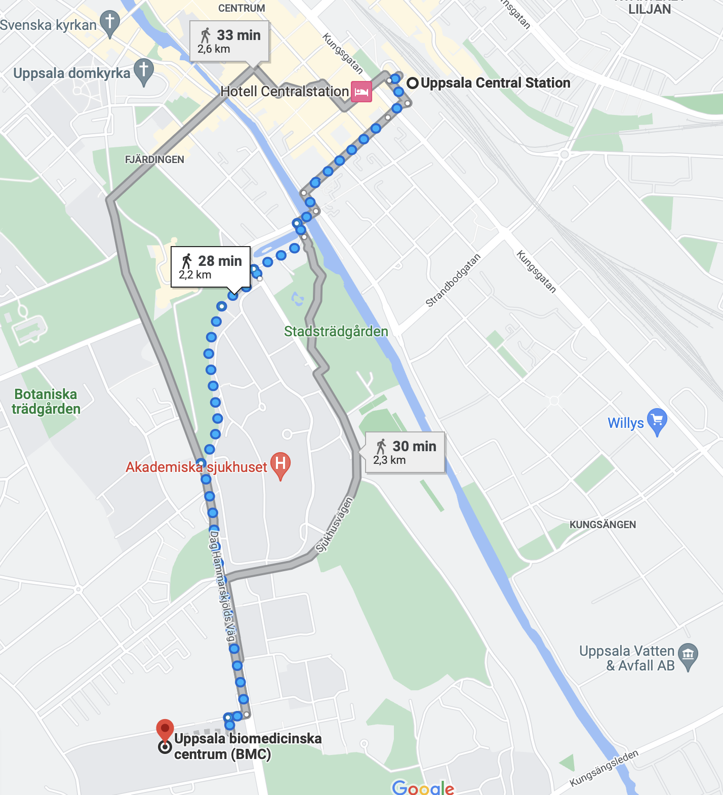

 
#####  Course location

- Uppsala Biomedical Centre (BMC), Uppsala University, Husargatan 3, Uppsala
- Room: E10:1308, BMC
- To find the room within BMC see [http://www.uu.se/map](mazemap)

 
#####  Walk
- Uppsala Biomedical Centre is located ca. 2.5 km from the Uppsala Central Station.
- A walk takes ca. 30 min.  
<figure>

<figcaption>
</figcaption>
</figure>

 
#####  By bus
- There is also a bus stop "Uppsala Science park"
- To travel by bus in Uppsala see [https://www.ul.se/en](https://www.ul.se/en)

 
#####  Accommodation
Unfortunately we do not have enough resources to help with hotel bookings. Uppsala town center is ca. 2km from BMC, and so any hotel in that region could be a good choice.

Some choices could include: [Scandi Uplandia][Scandi Uplandia], [Clarion Hotel Gillet][Clarion Hotel Gillet], [Elite Hotel Academia][Elite Hotel Academia], [Best Western Hotel Svava][Best Western Hotel Svava]. [Hotel von Kraemer][Hotel von Kraemer] is located half way between Uppsala town center and BMC.

[mazemap]: http://www.uu.se/map
[Scandi Uplandia]: https://www.scandichotels.com/hotels/sweden/uppsala/scandic-uplandia
[Clarion Hotel Gillet]: https://www.nordicchoicehotels.com/hotels/sweden/uppsala/clarion-hotel-gillet/
[Elite Hotel Academia]: https://elite.se/sv/hotell/uppsala/hotel-academia/
[Best Western Hotel Svava]: https://www.bestwestern.se/booking-path/hotel-details/best-western-hotel-svava-uppsala-88169
[Hotel von Kraemer]: https://hotelvonkraemer.se/en/
