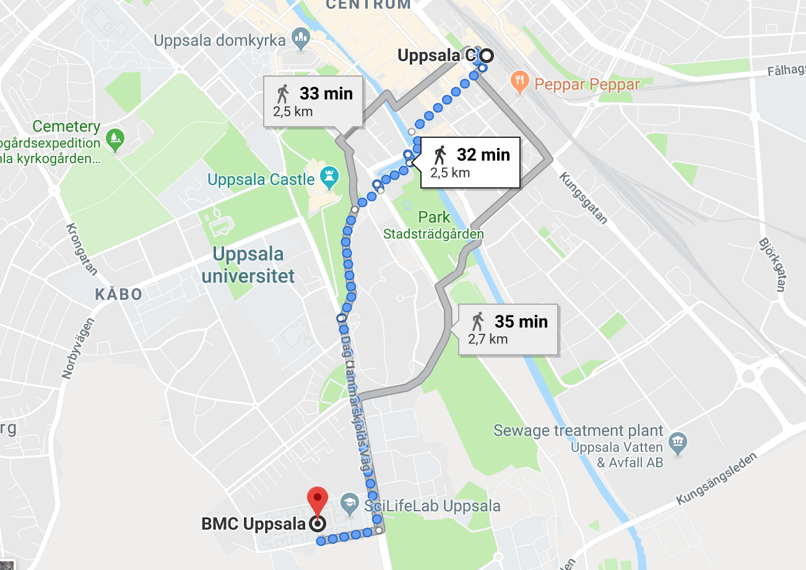

 
#####  Course location

- SciLifeLab, Uppsala University, BMC, Husargatan 3
- Room: E10:1308, BMC

 
#####  By buss
- To travel in Uppsala: see [UL website][ul]
- Nearest bus stop: Uppsala Science park (opposite BMC).

 
#####  Walk
- Ca. 2.5km, 35 min, walk from Uppsala Station.
<figure>

<figcaption>
</figcaption>
</figure>

 
#####  Room locator
- To find room within BMC see [Mazemap][mazemap]

 
#####  Accommodation
Unfortunately we cannot help with hotel bookings. Uppsala town center is ca. 2km from BMC, so any hotel in that region could be a good choice, e.g. Scandi Uplandia, Clarion Hotel Gillet, Elite Hotel Academia, Best Western Hotel Svava. Hotel von Kraemer is located half way between Uppsala town center and BMC.

[ul]: https://www.ul.se/en
[mazemap]: https://use.mazemap.com/#v=1&zlevel=1&left=17.5570095&right=17.7032085&top=59.8806680&bottom=59.8361040&campusid=49&campuses=uu&starttype=poi&start=383383&desttype=poi&dest=383419
